<h1 align = "center">JavaSE
</h1>


# 一、Java基础概述

## 1、Java基础知识结构

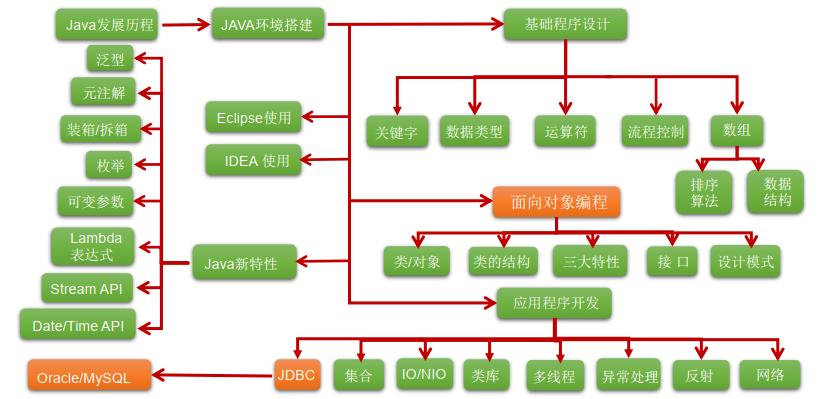

## 2、常用DOS命令

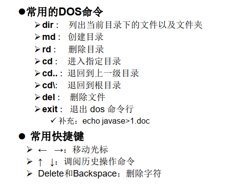

## 3、计算机编程语言发展历程

第一代语言：机器语言，指令以二进制代码形式存在

第二代语言：汇编语言，指令以助记符表示机器指令

第三代语言：高级语言：面向过程语言，C语言、Pascal、Fortran等；面向对象语言：java、python

## 4、Java语言发展历程

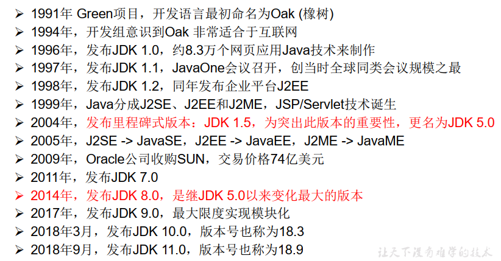

## 5、Java技术体系平台

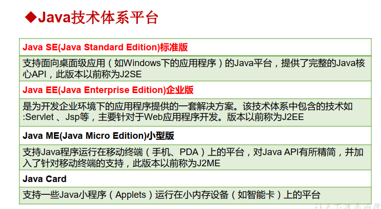

## 6、java运行机制

Java的两种核心机制

-   Java虚拟机（Java Virtal Machine）
-   垃圾回收机制（Garbage Collection）

## 7、Java开发环境搭建

-   JDK(Java Developement Kit)：java开发工具包
-   JRE(Java Runtime Environment)：java运行环境
-   JVM(Java Virtal Machine)：java虚拟机
-   JDK = JRE + java开发工具
-   JRE = JVM + java核心类库

## 8、Java注释方式

```Java
// 单行注释
/*
	多行注释
*/
/**
	文档注释
*/
```

# 二、Java基本语法

## 1、关键字与保留字

关键字：被Java语言赋予了特殊含义，用做专门用途的字符串（单词），关键字中所有字母都为小写

保留字：当前java版本尚未使用，但以后版本可能会作为关键字使用的单词或字符串

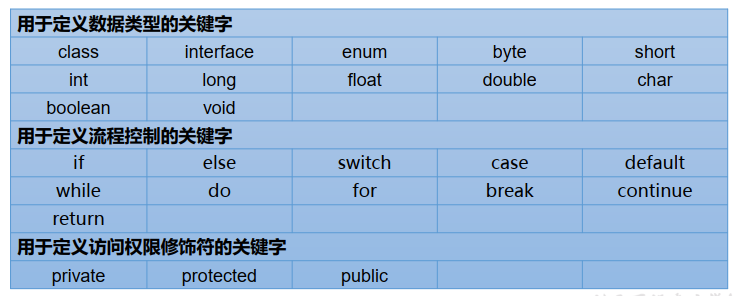

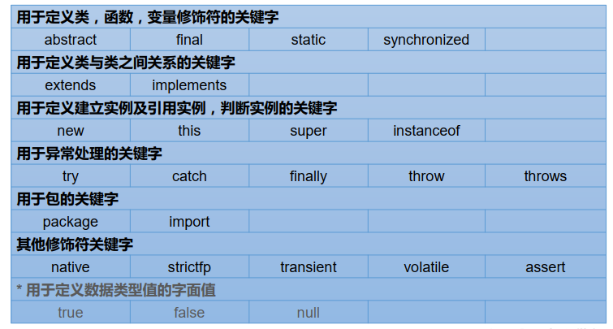

## 2、标识符

定义：Java对各种变量、方法和类等要素命名时使用的字符序列称为标识符

技巧：凡是可以自己起名的地方都叫标识符

标识符命名规则：

-   Java严格区分大小写
-   由26个大小写字母、数字、下划线_或这dollar符$组成
-   不能使用关键字或保留字、可以包含关键字或保留字
-   数字不能开头
-   不能包含空格

标识符命名规范：

-   见名知意
-   包名：所有单词全部小写
-   类名、接口名：所有单词首字母大写
-   变量名、方法名：多单词组成时，首单词小写，其余单词首字母大写
-   常量：所有单词全部大写，单词之间用下划线连接

## 3、变量

### 3.1 变量的定义格式

数据类型 变量名 = 变量值

**说明：**

-   变量必须先声明再使用
-   变量都是定义在其定义域内的，在作用域内，变量是有效的
-   同一个作用域内，不可以声明两个同名的变量

### 3.2 变量的数据类型

#### 3.2.1 变量按数据类型来分：分为基本数据类型和引用数据类型

**基本数据类型：**

-   整形：byte(1字节) \ short(2字节) \ int(4字节) \ long(8字节)
-   浮点型：float(4字节) \ double(8字节)
-   字符型：char(2字节)
-   布尔型：boolean

**引用数据类型：**

-   类（class）
-   接口（interface）
-   数组（array）

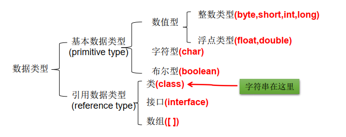

#### 3.2.2 变量按照在类中的声明位置可以分为：成员变量和局部变量

### 3.3 基本数据类型之间的运算规则

**说明：这里讨论只是7种基本数据类型变量间的运算。不包含boolean类型的。**

#### 3.3.1 自动类型提升

**结论：当容量小的数据类型的变量与容量大的数据类型的变量做运算时，结果自动提升为容量大的数据类型。**

**byte 、char 、short --> int --> long --> float --> double** 

**特别的：当byte、char、short三种类型的变量之间做运算时，结果为int型**

#### 3.3.2 强制类型转换

**强制类型转换：自动类型提升运算的逆运算**

**需要使用强转符：()**

**注意点：强制类型转换，可能导致精度损失**

**说明：此时的容量大小指的是，表示数的范围的大和小。比如：float容量要大于long的容量**

## 4、运算符

### 4.1 算术运算符

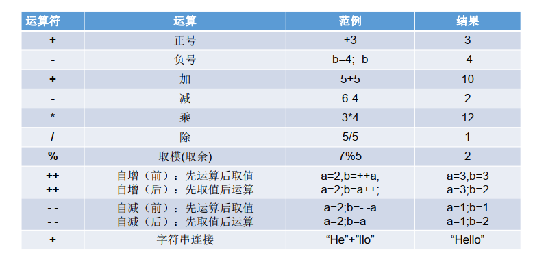

### 4.2 赋值运算符

**=  +=  -=  *=  /=  %=**

### 4.3 比较运算符

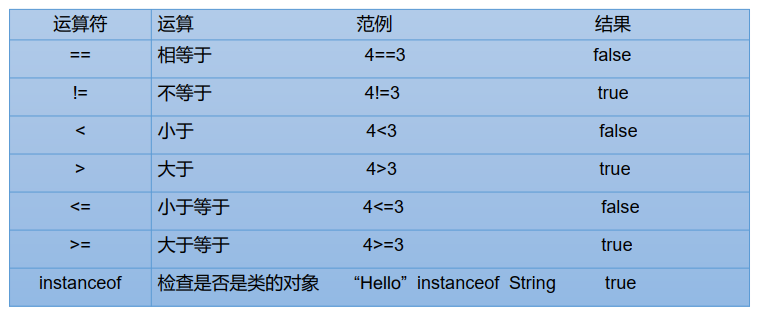

### 4.4 逻辑运算符

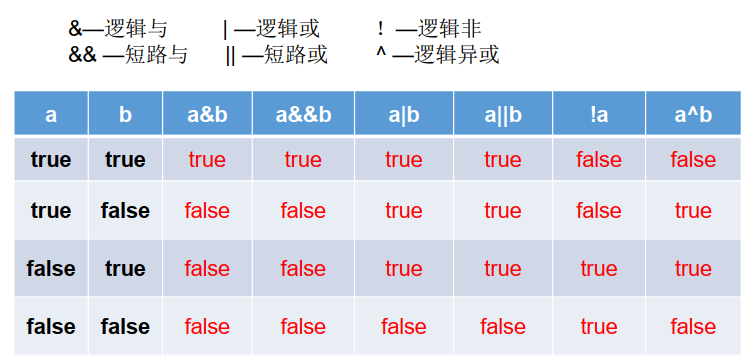

区分& 与 &&

-   相同点1：& 与  && 的运算结果相同

-   相同点2：当符号左边是true时，二者都会执行符号右边的运算

-   不同点：当符号左边是false时，&继续执行符号右边的运算。&&不再执行符号右边的运算。

-   开发中，推荐使用&&

区分：| 与 ||

-   相同点1：| 与  || 的运算结果相同

-   相同点2：当符号左边是false时，二者都会执行符号右边的运算

-   不同点3：当符号左边是true时，|继续执行符号右边的运算，而||不再执行符号右边的运算

-   开发中，推荐使用||

### 4.5 位运算符

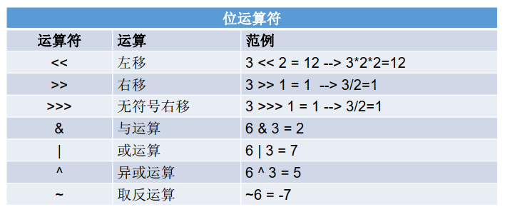

**说明：**

-   位运算符操作的都是整型的数据
-   <<  运算符的意义：在一定范围内，每向左移1位，相当于 * 2
-   \>> 运算符的意义：在一定范围内，每向右移1位，相当于 / 2

### 4.6 三元运算符

**结构：(条件表达式)? 表达式1 : 表达式2**

**说明：**

-   根据条件表达式真或假，决定执行表达式1，还是表达式2
    -   如果表达式为true，则执行表达式1
    -   如果表达式为false，则执行表达式2
-   表达式1 和表达式2的运算结果的数据类型必须是一致的，如果结果不一致，那么会进行自动数据类型转换，如果转换失败，则报错
-   三元运算符可以嵌套使用
-   凡是可以使用三元运算符的地方，都可以改写为if-else，反之，不成立
-   如果程序既可以使用三元运算符，又可以使用if-else结构，那么优先选择三元运算符。原因：简洁、执行效率高

### 4.7 运算符的优先级

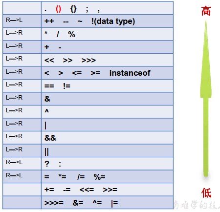

## 5、流程控制

### 5.1 分支结构

#### 5.1.1 if-else条件判断结构

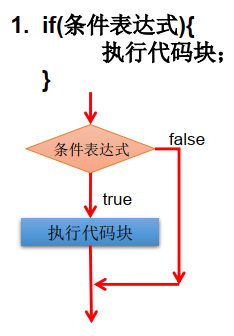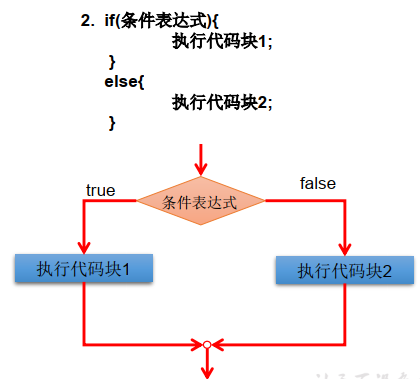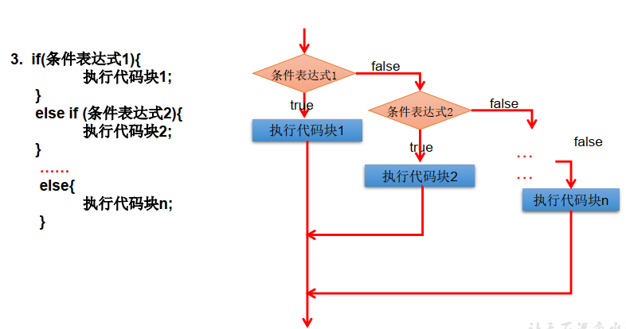

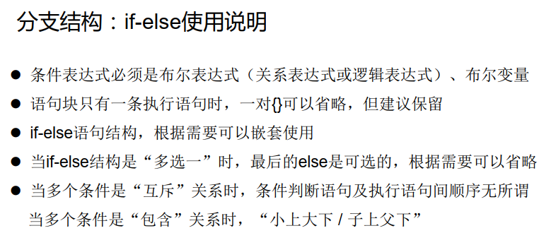

#### 5.1.2 switch-case选择结构

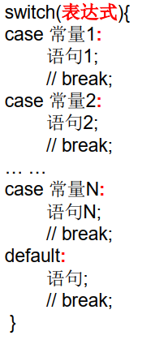

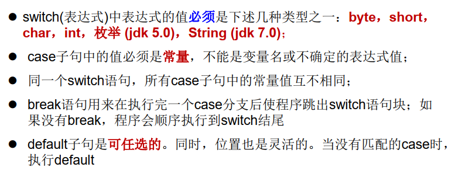

### 5.2 循环结构

循环结构的组成部分

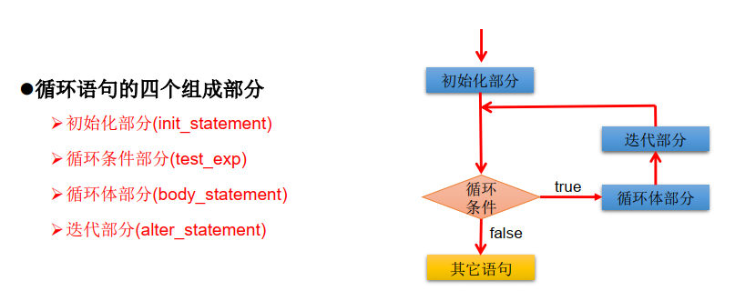

#### 5.2.1 for循环结构

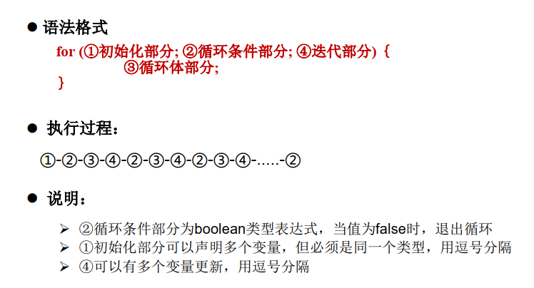

#### 5.2.1 while循环结构

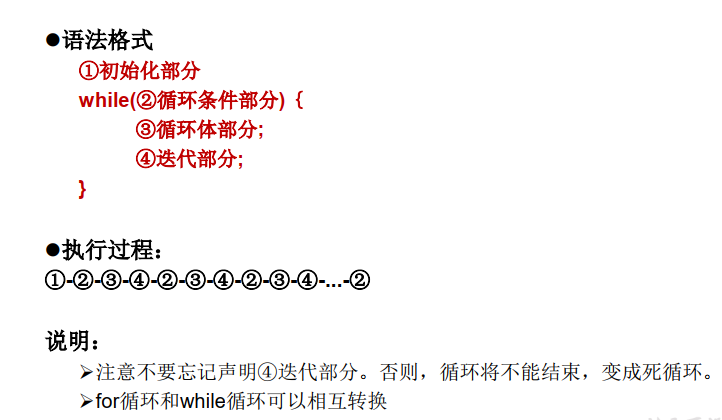

#### 5.2.2 do...while循环结构

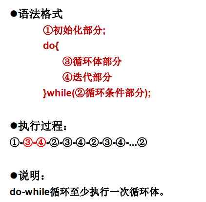

### 5.3 流程控制语句

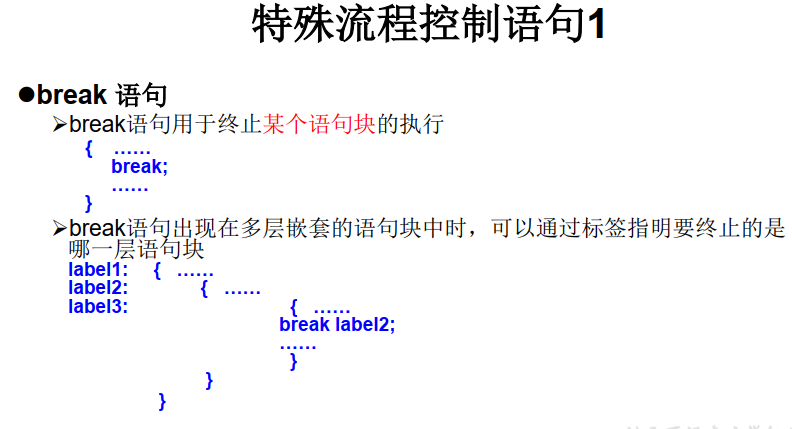

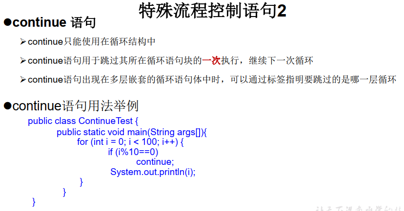

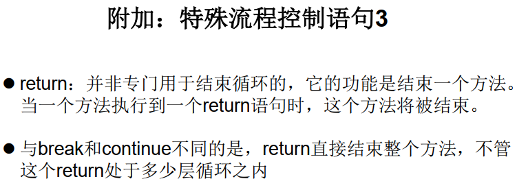

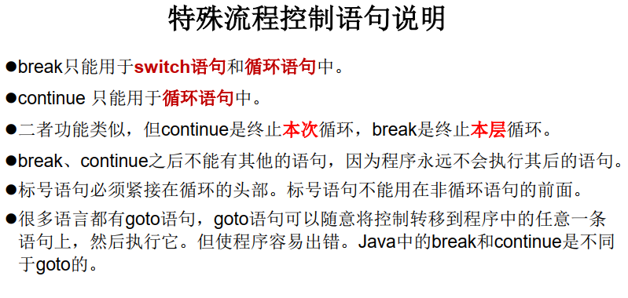

# 三、数组

## 1、数组的概述

### 1.1 数组的定义

数组是多个相同类型的数据按照一定的顺序排列的集合，并使用一个名字命名，并通过编号的方式对这些数据进行统一管路

### 1.2 数组的常见概念

数组名

索引或下表

数组元素

数组长度

### 1.3 数组的特点

-   数组的长度一旦确定，就不能修改
-   数组中的元素都是有序排列的
-   数组本身是引用数据类型，数组的元素，既可以是基本数据类型，也可以是引用数据类型
-   创建数组会在内存中创建一整块连续的空间

## 2、一维数组

### 2.1 数组的声明

两种声明方式

-   int[] arr
-   int arr[]

### 2.2 数组的初始化

两种初始化方式

```java
// 静态初始化，两种形式
int arr[] = {123, 456, 789}
int arr[] = new int[]{123, 456, 789}
// 动态初始化
int arr[] = new int[3]; // 3表示数组长度为3
arr[0] = 100;
arr[1] = 200;
arr[2] = 300;
```

**说明：两种声明方式、两种初始化方式，所以结合起来会4中数组的声明初始化方式**

### 2.3 数组的引用

-   定义数组时，利用new关键字后，系统为数组分配内存空间，我们才能引用数组中的元素
-   数组元素的引用方式为：数组名[数组元素下标]
-   数组对象具一个属性length，可以用于获得数组长度

### 2.4 数组元素的默认初始化值

数组元素是引用数据类型，其元素相当于类的成员变量，因此数组一旦声明并在内存空间中分配空间，其每个元素都会照成员变量的方式被隐式初始化。根据元素的数据类型不同，元素的默认初始化值也不同。

对于基本数据类型：

-   byte、short、int --> 0
-   long --> 0L
-   float --> 0.0F
-   double --> 0.0
-   char --> 0或者'\u0000'
-   boolean --> false

对于引用数据类型，默认初始化值为null。

### 2.5 一维数组元素的遍历

### 2.6 一维数组的内存解析

## 3、二维数组

### 3.1 二维数组的声明

```java
// 二维数组的声明，有两种方式
int arr[][];
int[][] arr;
// 二维数组的初始化，有两种方式
int arr[][] = new int[][]{{1}, {23,45}, {678,8910}};
int arr[][] = {{1}, {23,45}, {678,8910}}
```

### 3.2 二维数组的初始化

```Java
// 二维数组的初始化
// 静态初始化
int arr[][] = new int[][]{{1}, {23,45}, {678,8910}};
int arr[][] = {{1}, {23,45}, {678,8910}}
// 动态初始化
int arr[][] = new int[2][3];//声明了一个两行三列的数组
int arr[][] = new int[3][];// 声明了一个包含三个一维整数数组的二维数组
```

说明：

-   Java中，二维数组中每个一维数组所包含元素的个数都可以不一样，即多维数组不必都是规则矩阵形式

-   声明二维数组的时候，必须先声明行，后声明列；声明了行之后可以不用声明列

    例如：int arr[][] = new int[][3];// 这种写法是错误的

-   ==特殊写法：==int x[],y[]; // x是一维数组，y是二维数组

### 3.3 二维数组的引用

### 3.4 二维数组的遍历

### 3.5 二维数组的内存结构

## 4、数组常见的算法

### 4.1 搜索

### 4.2 查找

## 5、数组工具类

java.util.Arrays类即为操作数据的工具类，包含了用来操作数组（比如排序、搜索）的各种方法常用、常见的方法

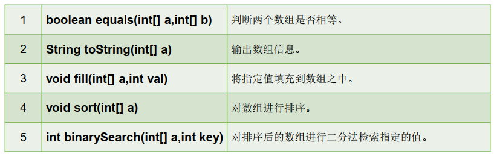

## 6、数组的常见异常

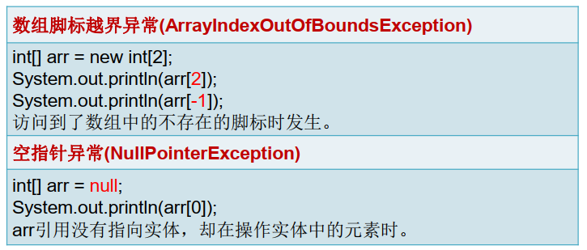

# 四、面向对象

Java面向对象的三条主线

1.   Java的类以及类的成员：属性、方法、构造器、代码块、内部类
2.  面向对象的三大特征：封装、继承、多态
3.  其他关键字的学习

## 1、属性

### 1.1 属性（成员变量）和局部变量的区别

**相同点：**

-   定义变量的格式：数据类型  变量名 = 变量值
-   先声明，后使用
-   变量都有其对应的作用域 

**不同点：**

-   在类中声明的位置的不同
    -   属性：直接定义在类的一对{}内
    -   局部变量：声明在方法内、方法形参、代码块内、构造器形参、构造器内部的变量
-   关于权限修饰符的不同
    -   属性：可以在声明属性时，指明其权限，使用权限修饰符
    -   局部变量：不可以使用权限修饰符
-   默认初始化值的情况不同
    -   属性：类的属性，根据其类型，都有默认初始化值
        -   整型（byte、short、int、long）：0
        -   浮点型（float、double）：0.0
        -   字符型（char）：0  （或'\u0000'）
        -   布尔型（boolean）：false
        -   引用数据类型（类、数组、接口）：null
    -   局部变量：没有默认初始化值。意味着，我们在调用局部变量之前，一定要显式赋值。**特别地：形参在调用时，我们赋值即可。**
-   在内存中加载的位置不同
    -   属性：加载到堆空间中   （非static）
    -   局部变量：加载到栈空间

## 2 方法

### 2.1 方法的声明

**权限修饰符	返回值类型	方法名（形参列表）	{方法体}**

```txt
return关键字的使用：
1、使用范围：使用在方法体中
2、作用：① 结束方法；② 针对于有返回值类型的方法，使用"return 数据"方法返回所要的数据
3、注意点：return关键字后面不可以声明执行语句
```

### 2.2 方法的四个问题

#### 2.2.1 方法的重载

在同一个类下，当两个方法具有相同方法名，并且具有不同的参数列表时，可以将其中一个方法称为另一个方法的重载。

-   两个相同：一是同一个类；二是方法名相同
-   一个不同：参数列表不同。表现为：参数的类型不同；数量不同；当多个参数的类型不同时，若参数的顺序不同，也可以视为参数列表不同

方法的重载的设计是为了不同数据类型调用相同方法能够想要的结果

#### 2.2.2 形参可变长度的方法

形参可变长度的方法，也就是python中的不定长参数。当我们不确定方法需要多少个参数的时候就可以设置可变长度的形参

1.  格式：权限修饰符  返回值参数类型   方法名(不可变参数类型及参数列表, 可变参数类型...参数名){}

2.  可变长度参数从0个开始，可以传入任意多个参数

3.  可变长度参数的方法与同名方法之间构成方法的重载

4.  可变长度参数部分必须放在参数列表的最后面

5.  由于4的原因，一个方法的参数列表中只能申明一个可变长度参数

6.  可变长度参数的使用方法与方法参数部分使用数组是一致的

    -   JDK5.0以前：采用数组形参来定义方法，用于传入多个同一类型的变量，格式如下：

        ```java
        public static void test(int a, String books[]){}
        ```

    -   JDK5.0以后：增加了可变长度参数，用传入多个同一类型变量，格式如下：

        ```Java
        public static void test(String...books){}
        ```

        两种形式底层原理是一样的，可以通用

#### 2.2.3 方法的参数的值传递机制

**说明：**

-   方法：方法必须由其所在类或对象调用才有意义
-   形参：方法声明时的参数成为形参
-   实参：方法在被调用时，实际传给形参的数值

**Java中，参数的传递方式只有一种：值传递。也就是将实际参数的副本（复制出来的）传入方法内，而参数本身不受影响。**

**根据形参的数据类型不同，值传递时，传入的实参也不同**

-   **形参是基本数据类型：将实参基本数据类型变量的“数据值”传递给形参**
-   **形参是引用数据类型：将实参引用数据类型变量的“地址值”传递给形参**

#### 2.2.4 方法的递归调用

**递归：一个方法调用它自己**

## 3、面向对象特性之一：封装性

**意义：用户对类内部定义的属性或其他成员变量的直接操作会导致数据错误、混乱，甚至导致安全性问题；对类内部的成员变量的访问权限进行设置，即是面向对象的封装与隐藏**

**四种权限修饰符**

1.  private：被private修饰的类的成员变量（除代码块之外）只能在当前类中被调用或者被访问
2.  缺省：被缺省修饰的类的成员变量（除代码块之外）只能在同一个包下被调用或者被访问
3.  public：被public修饰的类的成员变量（除代码块之外）能被整个工程中的其他对象调用访问

**权限修饰符可以修饰的类的成员：属性、方法、构造器、内部类**

**说明：当权限修饰符修饰类时，有两种情况**

1.  外部类：**只能够被public和缺省修饰。**当一个类被Public修饰的时候，包含该类的Java源文件的文件名就必须是这个类的类名，否则编译不通过。由此也可知，在一个Java源文件中，被public修饰的外部类只能有一个。
2.  内部类：是Java类的成员变量之一，因此能够被**四种权限修饰符修饰。**

## 4、构造器

1.   构造器：为了保证对象成功初始化，Java像C++一样引入了构造器（constructor），即在创建对象时自动被调用的特殊方法。

2.   构造器的作用：① 创建对象；② 初始化对象的信息

3.  创建构造器的语法规则

    权限修饰符  构造器名(参数列表) {}

    **说明**

    -   构造器的名称与所在类的类名必须相同
    -   构造器没有返回值，不能在构造器内使用return，所以声明构造器时，不需要声明返回值类型
    -   构造器可以被四个权限修饰符修饰，但是不能被**static final synchronized abstract native**修饰

4.  构造器特性说明：

    -   根据参数列表的不同，构造器可以分为隐式无参构造器，即系统默认提供的，和显式定义的构造器（有参数或无参数）
    -   Java语言中，每一个类都至少有一个构造器
    -   默认构造器的修饰符与所属类的修饰符相同
    -   一旦显式定义了构造器，那么系统就不再提供默认构造器
    -   一个类可以显式定义很多构造器，这些构造器由于参数列表不同，因此彼此之间构成重载
    -   **父类的构造器不能被子类继承**

5.  JavaBean

    JavaBean是利用Java语言写成的可重用组件

    JavaBean的要求：

    -   类必须是具体的、公共的
    -   提供无参公共构造器
    -   有属性，提供相应的get和set方法，用于获取成员属性

## 5、this关键字

this 关键字指向的是当前对象的引用，this 关键字能够调用类的属性、方法和构造器。

**用法及作用：**

-   this.属性	指的是访问类中的成员变量，用来区分成员变量和局部变量的问题（重名问题）
-   this.方法名()     指的是访问类的成员方法
-   this([参数列表])     指的是访问类中的构造器。参数列表可有可无。有参数列表，调用的就是指定的有参数构造器；无参数列表调用的就是默认构造器

**说明：**

-   this 关键字在方法内部使用，表示的是这个方法所属对象的引用
-   this 关键字在构造器内部使用，表示该构造器正在初始化的对象

**注意：**

-   构造器中不能通过this([参数列表])调用构造器自己
-   **构造器中的this([参数列表])必须放在构造器中的首行**

## 6、package和import关键字

1.  package关键字

    package语句作为Java源文件的第一条语句，指明了该文件中定义的类所在的包	

    包对应文件系统 的目录，package语句中的“.”用来指明包（目录的层次）

    包名的写作规范一般是用小写单词标识。通常使用所在公司域名的倒置

2.  包的作用

    -   包帮助管理大型软件系统：将功能相近的类划分到同一个包中。比如：MVC设计模式
    -   包可以包含类和子包，用于划分项目层次便于管理
    -   解决类名冲突问题
    -   控制访问权限

3.  MVC设计模式

    MVC设计模式：将程序分成三个层次：视图模式层(view)、控制器层(controller)、数据模型层(model)

    视图模式层：显示数据

    控制器层：处理业务逻辑

    数据处理层：主要处理数据

## 7、面向对象特性之二：继承性

1.  多个类中存在相同属性和行为时，将这些内容抽取到单独一个类中，那么多个类无需再定义这些属性和行为，只要继承那个类即可。所以继承就是子类继承父类的特征和行为，使得子类对象（实例）具有父类的实例域和方法，或子类从父类继承方法，使得子类具有父类相同的行为。
2.  继承性的优点
    -   减少代码的冗余性，提高代码复用性
    -   便于功能的扩展
    -   继承性是多态的基石
3.  类的继承的格式：class A extends B{}
    -   当子类A继承了父类B以后，子类A中就获取了父类B中声明的所有属性和方法。特别的是，父类中声明为private的属性或方法，子类仍然是继承了，只是因为封装性的影响，使得子类无法直接调用父类中声明的private结构
    -   子类继承了父类以后，还可以声明自己特有的属性或方法：实现功能的拓展
4.  继承性的规定
    -   一个类可以被多个子类继承
    -   Java中类是具有单继承性的，即一个子类只能有一个父类
    -   子类直接继承的父类称为直接父类；间接继承的父类称为间接父类。
    -   子类继承了父类以后，就获得了直接父类和间接父类中申明的属性和方法
5.  继承的说明
    -   如果我们没有显式的声明一个类的父类的话，则此类继承于java.lang.Object类
    -   根据继承性的特性：Java中所有的类都直接或间接结成与java.lang.Object类，
    -   这也意味着，所有的类都具有java.lang.Object类的功能

## 8、方法的重写

1.  定义：子类可以根据需要对从父类中继承而来的方法进行改造。方法重写也称为覆盖，程序执行时，子类重写的方法会覆盖父类的方法。
2.  重写的要求：**子类：重写的方法；父类：被重写的方法**
    1.  子类重写的方法与父类被重写的方法，其方法名和形参列表必须相同
    2.  **子类重写的方法的返回值类型不能大于父类被重写方法的返回值类型**
        -   父类被重写方法返回值为void时，子类重写的方法的返回值也必须为void
        -   父类被重写方法返回值为基本数据类型时，子类重写的方法的返回值也必须为相同的基本数据类型
        -   父类被重写方法返回值为引用数据类型时，子类重写方法的返回值类型可以为其子类或其本类
    3.  **子类重写的方法访问权限不能小于父类被重写方法**
    4.  **子类重写的方法所抛出的异常类型不能大于父类被重写方法抛出的异常**
3.  **父类中被声明为private、static、final的方法无法被重写**
4.  **子类重写的方法抛出的异常类型不大于父类被重写的方法抛出的异常类型**

## 9、super关键字

1.  super关键字代表父类的引用，用于子类访问父类的属性、方法、构造器

    **注意：子类中的所有构造器都默认访问父类中的空参构造器**

2.  super关键字调用属性、方法、构造器的语法格式

    -   属性：super.属性
    -   方法：super.方法
    -   构造器：super(形参列表)

    **注意：与this关键字相同，当子类构造器在利用super关键字调用父类构造器时，super()语句必须放在构造器内的首行位置**

3.  super关键字的作用

    -   对于属性，当子类属性和父类属性出现同名情况，子类需要调用父类属性时，需显式利用super关键字调用父类属性，当然这种情况不太可能出现；（默认是this前缀）
    -   对于方法，由于子类能够重写父类方法，因此当子类需要调用父类方法时，需要显式利用super关键字调用父类方法
    -   对于构造器，当子类需要调用父类构造器时，则必须通过super关键字

4.  super关键字的特点

    -   super关键字不局限于直接父类
    -   如果直接父类和简介父类具有相同的成员，则默认访问的都是直接父类的成员，遵循就近原则
    -   由于this和super关键字都必须放在子类构造器首行，所以一个构造器中，super和this关键字只能有其一

5.  super关键字和this关键字的对比

    -   this关键字：
        -   代表本类对象，可以访问本类的属性、方法和构造器。this关键字主要是为了区分局部变量和成员变量，以及调用本类构造器。
        -   通过this关键字访问成员时，先从本类中查找，如果找不到，再从直接父类找，如果还找不到，继续往上追溯间接父类，直到找到为止。
    -   super关键字 ：
        -   代表父类引用，可以访问父类属性、方法和构造器。super关键字主要是为了区分子类和父类的成员变量，以及调用父类的构造器。
        -   同样，通过super调用父类成员时 ，先从直接父类中查找，如果找不到，则继续往上追溯查找间接父类，知道找到为止。

## 10、子类对象实例化的全过程

1.  从结果上来看：（继承性）

    子类继承父类以后，就获取了父类中声明的属性或方法，创建子类的对象，在堆空间中，就会加载所有父类中声明的属性

2.  从过程上看：

    当我们通过子类的构造器创建子类对象时，我们一定会直接或间接的调用其父类的构造器，进而调用父类的父类的构造器，直到调用了java.lang.Object类中的空参构造器为止，正因为加载过所有的父类结构，所以才能看到内存中的父类中的结构，子类对象才能考虑进行调用

## 11、面向对象特征之三：多态性

1.  多态的理解：一种事物的多种形态的表现，例如，人可以分为男人和女人

2.  多态的三个必要条件：

    -   继承
    -   方法的重写
    -   父类引用指向子类对象，例如:Person p = new Student();

    **注意：当使用多态方式调用方法时，首先检查父类中是否有该方法，如果没有，则编译报错；如果有，则在程序运行时，调用子类方法，这也称为动态绑定。**

3.  多态的优点：提高了代码的通用性，要学会举例

4.  程序执行的两个过程：编译和运行

    -   Java引用数据类型的变量有两种状态（类型）：编译时类型和运行时类型。

    -   编译时类型，由申明该变量的类型所决定。

    -   运行时类型，由实际赋值给该变量的对象决定。

    -   编译时，看赋值符号的左边

    -   运行时，看赋值符号的右边
    -   对于类中的成员方法：
        -   编译时，看引用变量所声明的类中是否包含所调用的方法；
        -   运行时，调用实际new的对象所属的类中的重写的方法。
    -   对于类中的成员属性：不具有多态性，只看引用变量所声明的类。

5.  虚拟方法调用：

    -   子类中定义了与父类同名同参数的方法，在多态的情况下，将此时父类的方法称为虚拟方法，
    -   父类根据赋给它的不同子类对象，动态调用属于子类的该方法。这样的方法调用在编译期是无法确定的

## 12、instanceof的使用

1.  instanceof是一个双目运算符，用于判断一个对象是否时一个类的实例

2.  语法格式：boolean result = obj instanceof class;

    其中 obj是一个对象或者是一个对象的引用，class是一个类或者接口

    当obj是class的实例化对象，或者obj所属的类是class的直接或间接子类，或者其接口的实例化对象，则结果result的值为true，否则为false

## 13、Object类

1.  Object类中有且仅有一个构造器：Object{}
2.  Object中常用的方法：
    -   public boolean equals(Object obj){}  对象的比较
    -   public String toString(){}  打印对象时调用
3.  对于public boolean equals(Object obj){}方法
    1.  比较运算符 == ：用于比较运算符两侧变量的值是否相同
        -   对于基本数据类型，在数据类型兼容的条件下，当两个变量的值相等时，返回true
        -   对于引用数据类型：比较的是两个变量的地址值，当变量地址值相同或者指向同一个对象时，返回true
    2.  equals()方法：根父类Object中的方法，所有的类都继承了equals()方法
        -   对于Java中常用的类，如File、Date、String、Arrays等，即继承了Object类又重写了eqals()方法的类而言，当这些类的对象调用equals()方法时，比较的时两个对象的内容是否相同。（equals()方法重写了）
        -   对于自定义的直接继承与Object类的类，由于直接继承了Object类中的equals()方法，因此，自定义类的对象调用equals()方法时，比较的仍是两个对象的地址值
4.  对于Object类中的public String toString(){}方法
    -   与equals()方法相同，toString()方法也是Object类中的方法，默认返回对象所属类的类名和该对象的引用地址
    -   对于Java中的常用类，都重写了Object类中的toString()方法，返回对应的Sting类型值
    -   在进行String与其他类型数据的连接操作时，自动调用toString()方法
    -   对于System.out.println()方法中，自动调用toString方法，基本类型除外

## 14、包装类

1.  包装类的8种类型

    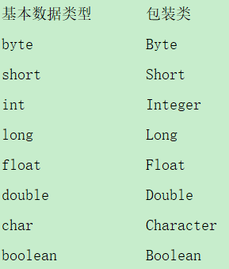

2.  基本数据类型、包装类、字符转之间的相互转化

    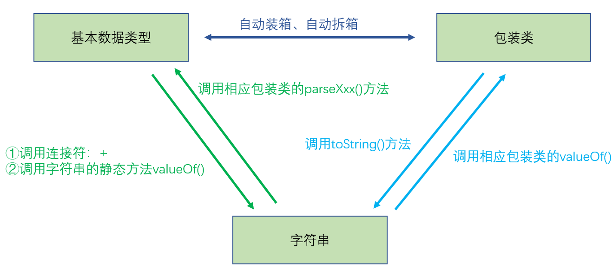

## 15、static关键字

1.  static关键字能够修饰属性、方法、代码块、内部类
2.  被static关键字修饰的结构所具有的特点：
    -   随着类的加载而加载
    -   优先于对象而存在
    -   被修饰的结构，被所有对象所共享
    -   访问权限允许时，可以不创建对象，直接被类调用
3.  static修饰属性：被修饰的属性为各对象实例所共有
4.  static修饰方法
    -   没有对象实例时，可以通过“类名.方法名”直接调用
    -   static方法内部只能调用static属性和static方法
    -   static方法无法被重写，static是类方法
5.  static使用注意点：
    -   **静态方法内不能使用this、super关键字**
    -   **静态属性和静态方法，从生命周期的角度去理解**

## 16、final关键字

1.  可以用来修饰：类、方法、变量
2.  具体而言：
    -   final 用来修饰一个类:此类不能被其他类所继承。比如：String类、System类、StringBuffer类
    -   final 用来修饰方法：表明此方法不可以被重写。比如：Object类中getClass();
    -   final 用来修饰变量：此时的"变量"就称为是一个常量
        -   final修饰属性：可以考虑赋值的位置：显式初始化、代码块中初始化、构造器中初始化
        -   final修饰局部变量：尤其是使用final修饰形参时，表明此形参是一个常量。当我们调用此方法时，给常量形参赋一个实参。一旦赋值以后，就只能在方法体内使用此形参，但不能进行重新赋值。

## 17、abstract关键字

1.  abstract关键字用于修饰类或者方法，被修饰的类称为抽象类，被修饰的方法称为抽象方法
2.  抽象类
    -   此类不能实例化
    -   抽象类中有构造器，虽然抽象类本身无法创建对象，但子类创建对象时，会调用父类（抽象类）的构造器
3.  抽象方法
    -   抽象方法只有方法的声明：没有方法体
    -   包含抽象方法的类一定时抽象类，而抽象类可以没有抽象方法
    -   当子类重写了父类中所有的抽象方法后，则该子类可以用于创建对象，即实例化。
    -   若子类没有重写父类中所有的抽象方法，则此子类也必须是抽象类，需要使用abstract关键字
4.  **注意：abstract不能用于修饰：属性、方法、构造器；abstract不能用于修饰私有方法、静态方法、final的方法、final的类**

## 18、interface关键字

1.  interface关键字用于声明接口结构，接口和类是并列的两个结构。

    **注意：接口中没有构造器**

2.  接口中能定义的成员

    -   JDK 7及以前，只能定义全局常量和抽象方法：
        -   全局常量：public static final，书写时可以省略不写
        -   抽象方法：public abstract，没有方法体
    -   JDK 8，除了定义全局常量和抽象方法之外，还可以定义静态方法、默认方法
        -   静态方法：public static，静态方法有方法体
        -   默认方法：public default，默认方法有方法体

3.  接口的使用：接口通过类实现（implements）的方式进行使用

    与抽象类相同：如果实现类覆盖了接口中的所有抽象方法，那么此实现类可以实例化；如果实现类没有覆盖接口中所有的抽象方法，那么此实现类必须定义成一个抽象类

4.  Java类与类之间只能单继承以及多层继承；Java接口与接口之间能够多继承以及多层继承；Java类与接口之间：一个类能够实现多个接口

5.  Java 8中关于接口的新规范

    -   接口中定义的静态方法，只能通过接口来调用

    -   通过实现类的对象，可以调用接口中的默认方法；如果实现类重写了接口中的默认方法，调用时，仍然调用的是重写以后的方法 (默认方法有点像类中的方法)

    -   通过实现类的对象，可以调用接口中的默认方法；如果实现类重写了接口中的默认方法，调用时，仍然调用的是重写以后的方法 (默认方法有点像类中的方法)

    -   如果子类（或实现类）继承的父类和实现的接口中声明了同名同参数的默认方法，那么子类在没有重写此方法的情况下，默认调用的是父类中的同名同参数的方法。-->类优先原则

    -   如果实现类实现了多个接口，而这多个接口中定义了同名同参数的默认方法，那么如果实现类没有重写此方法，编译会报错。-->接口冲突

    -   如何在子类（实现类）的方法中调用父类、接口中被重写的方法：

        ```java
        public void func(){
        	method(); // 调用自己定义的重写方法
        	super.method(); // 调用父类中声明的方法
        	CompareA.super.method();// 调用接口中的默认方法
        	CompareB.super.method();
        }
        ```

## 19、内部类

1.  定义：Java中允许将一个类A声明在另一个类B中，此时类A就是内部类，类B称为外部类

2.  内部类的分类：成员内部类（静态、非静态）  VS  局部内部类（方法内、代码块内、构造器内）

3.  成员内部类的理解：

    -   一方面，作为外部类的成员：
        -   调用外部类的结构
        -   可以被static修饰
        -   可以被四种权限修饰符修饰
    -   另一方面：作为一个类：
        -   类内部可以定义属性、方法、构造器等
        -   可以被final修饰，表示此类不能被继承
        -   可以被abstract修饰

4.  成员内部类：

    1.  如何创建成员内部类的对象？（静态内部类、非静态内部类）

        ```java
        class Person{
        	static class Dog{}
        	class Bird{}
        }
        // 创建静态的Dog内部类的实例
        Person.Dog dog = new Person.Dog();
        // 创建非静态的Bird内部类的实例
        Person.Bird bird = new Person.Bird();// 错误的
        Person p = new Person();
        Person.Bird bird = p.new Bird();
        ```

    2.  如何在成员内部类中调用外部类的结构？

        ```java
        class Person{
        	String name = "小明";
        	class Bird{
        		String name = "小明";
        		public void display(String name){
        			System.out.println(name);//方法的形参	
        			System.out.println(this.name);//内部类的属性
        			System.out.println(Person.this.name);//外部类的属性
        		}
        	}		
        }
        ```

5.  局部内部类的使用

6.  总结

    成员内部类和局部内部类，在编译后，都会生成字节码文件

    -   成员内部类：外部类$内部类名.class
    -   局部内部类：外部类$数字 内部类名.class

# 五、异常处理

## 1、异常概述

```Java
java.lang.Throwable
     |-----java.lang.Error:一般不编写针对性的代码进行处理。
     |-----java.lang.Exception:可以进行异常的处理
         |------编译时异常(checked)
                 |-----IOException
                     |-----FileNotFoundException
                 |-----ClassNotFoundException
         |------运行时异常(unchecked,RuntimeException)
                 |-----NullPointerException
                 |-----ArrayIndexOutOfBoundsException
                 |-----ClassCastException
                 |-----NumberFormatException
                 |-----InputMismatchException
                 |-----ArithmeticException
```

## 2、异常的处理

1.  java异常处理的抓抛模型

    -   过程一："抛"：程序在正常执行的过程中，一旦出现异常，就会在异常代码处生成一个对应异常类的对象。并将此对象抛出。一旦抛出对象以后，其后的代码就不再执行。

        **关于异常对象的产生：① 系统自动生成的异常对象 ② 手动的生成一个异常对象，并抛出（throw）**

    -   过程二："抓"：可以理解为异常的处理方式：① try-catch-finally  ② throws

2.  异常处理方式一：try-catch-finally

    ```java
    try{
         //可能出现异常的代码
    }catch(异常类型1 变量名1){
         //处理异常的方式1
    }catch(异常类型2 变量名2){
         //处理异常的方式2
    }catch(异常类型3 变量名3){
         //处理异常的方式3
    }
    ....
    finally{
         //一定会执行的代码
    }
    ```

    **说明：**

    1.  finally是可以省略的
    2.  使用try将可能出现异常代码包装起来，在执行过程中，一旦出现异常，就会生成一个对应异常类的对象，根据此对象的类型，去catch中进行匹配
    3.  一旦try中的异常对象匹配到某一个catch时，就进入catch中进行异常的处理。一旦处理完成，就跳出当前的try-catch结构（在没写finally的情况。继续执行其后的代码
    4.  catch中的异常类型如果没子父类关系，则谁声明在上，谁声明在下无所谓。catch中的异常类型如果满足子父类关系，则要求子类一定声明在父类的上面。否则，报错
    5.  常用的异常对象处理的方式： ① String  getMessage()    ② printStackTrace()
    6.  在try结构中声明的变量，在出了try结构以后，就不能再被调用，**变量的作用范围**
    7.  try-catch-finally结构可以嵌套

    **总结**

    1.  如何看待代码中的编译时异常和运行时异常？
        -   体会1：使用try-catch-finally处理编译时异常，使得程序在编译时就不再报错，但是运行时仍可能报错。相当于我们使用try-catch-finally将一个编译时可能出现的异常，延迟到运行时出现
        -   体会2：开发中，由于运行时异常比较常见，所以我们通常就不针对运行时异常编写try-catch-finally了。针对于编译时异常，我们说一定要考虑异常的处理
    2.  finally的再说明：
        1.  finally是可以省略的
        2.  finally中声明的是一定会被执行的代码。即使catch中又出现异常了，try中return语句，catch中return语句等情况
        3.  像数据库连接、输入输出流、网络编程Socket等资源，JVM是不能自动回收的，我们需要自己手动的进行资源的释放。此时的资源释放，就需要声明在finally中

3.  异常的处理方式二：

    "throws + 异常类型"写在方法的声明处。指明此方法执行时，可能会抛出的异常类型。

    一旦当方法体执行时，出现异常，仍会在异常代码处生成一个异常类的对象，此对象满足throws后异常类型时，就会被抛出。异常代码后续的代码，就不再执行！

4.  两种异常处理方式的对比

    try-catch-finally:真正的将异常给处理掉了。

    throws的方式只是将异常抛给了方法的调用者。并没真正将异常处理掉。

## 3 手动抛出异常

1.  在程序执行中，除了自动抛出异常对象的情况之外，我们还可以手动的throw一个异常类的对象。
2.  throw和throws的区别
    -   throw 表示抛出一个异常类的对象，生成异常对象的过程。声明在方法体内
    -   throws 属于异常处理的一种方式，声明在方法的声明处

## 4 自定义异常

# 六、多线程

## 1、基本概念

### 1.1 程序、进程、线程

-   程序（program）为了完成特定任务、用某种语言编写的一租之令的集合。即指一段静态的代码，是静态对象。
-   进程（process）是程序的一次执行过程，或者是正在运行的一个程序。是一个动态的过程：有它自身的产生、存在和消亡的过程。即声明周期。
-   线程（thread）,进程可进一步细化为线程，是一个程序内部的一条执行路劲。
    -   若一个进程同一时间并行执行多个线程，那么就是支持多线程的
    -   线程作为调度和执行的单位，每个线程拥有独立的运行站和程序计数器（pc），线程切换的开销小
    -   一个进程中的多个线程共享相同的内存单元/内存地址空间，他们从同一堆中分配对象，可以访问相同的变量和对象。这就使得线程间的通信更加简便、高效。与此同时，所带来的问题就是，多个线程操作共享的系统资源可能就会带来安全隐患。

### 1.2 单核CPU和多核CPU

-   单核CPU，其实是一种假的多线程，因为在一个时间单元内，也只能执行一个线程的任务。只有由于CPU的主频特别高，所以我们一般是感觉不出来的
-   多核CPU，能够更好的发挥多线程的效率。
-   一个Java应用程序，至少包含三个线程：①main()主线程，②gc()垃圾回收线程，③异常处理线程。

### 1.3 并行与并发

-   并行：多个CPU同时执行多个任务。比如多个人同时做不同的事
-   并发：一个CPU（分时复用）同时执行多个任务。多个人做同一件事

## 2、多线程的优点

以单核CPU为例，只是用单个线程先后完成多个任务，肯定比用多个线程来完成用的时间更多，那么为什么还是需要多线程呢？

多线程程序的优点：

-   提高应用程序的响应，这堆图形化界面更有意义，可以增强用户体验
-   提高计算机系统CPU的利用率
-   改善程序结构，将既长又复杂的进行分为多个线程，独立运行有利于理解和修改

## 3、多线程的创建和使用

Java语言的JVM允许程序运行多个线程，它通过Java.lang.Thread类来体现。

Thread类的特性：

1.  每个线程都是通过某个特定的Thread对象的run()方法来完成操作的，经常把run()方法的方法体称为线程体
2.  通过Thread对象的start()方法来启动这个线程，而不是直接调用run()

Thread类常用构造器：

-   Thread()：调用该构造器创建新的Thread对象
-   Thread(String threadname)：调用该构造器创建多线程，并为多线程指定线程实例名
-   Thread(Runnable target)：调用该构造器创建多线程，指定创建线程的目标对象，它是实现了Runable接口中的run()方法
-   Thread(Runnable target, String name)：调用该构造器创建多线程，指定创建线程的目标对象，它是实现了Runable接口中的run()方法，并为多线程指定线程实例名

### 3.1 方式一：继承Thread类

JDK1.5之前创建多线程的方式有两种方法：

1.  继承Thread类
2.  实现Runnable接口的方式

继承Thread类创建多线程的步骤：

1.  定义子类继承Thread类
2.  子类中重写Thread类中的run()方法
3.  创建Thread子类对象，即创建了线程对象
4.  调用线程对象的start()方法，启动线程，并调用run()方法

```java
/**
 * Author: shaco
 * Date: 2022/10/16
 * Desc: 创建多线程第一种方式：继承Thread类
 */
// TODO 1、创建子类继承Thread类
public class Create_Thread_Way_First extends Thread {
    // TODO 2、重写Thread类中的run()方法
    @Override
    public void run() {
        for (int i = 0; i < 100; i++) {
            if (i % 2 == 0) {
                System.out.println(i);
            }
        }
    }

    public static void main(String[] args) {
        // TODO 3、创建Thread子类对象
        Create_Thread_Way_First create_thread_way_first = new Create_Thread_Way_First();
        // TODO 4、利用Thread子类对象调用start()方法，启动多线程
        create_thread_way_first.start();
    }
}
```

==注意：==

1.  如果自己动手条用run()方法，那么就只是普通的方法调用，没有启动多线程模式
2.  run()方法由JVM调用，什么时候调用，执行的过程控制都有操作系统的CPU调度决定
3.  想要启动多线程，必须调用start()方法
4.  一个线程对象只能调用一次start()方法，用于启动多线程，如果重复调用了，那么将抛出异常"IllThreadStateException"

### 3.2 方式二：实现Runnable接口

实现Runnable接口创建多线程步骤：

1.  定义子类，实现Runnable接口
2.  子类中重写Runnalbe接口中的run()方法
3.  创建Runnable实现类的对象
4.  将Runnable实现类的对象作为Thread类构造器的参数，创建Thread类对象
5.  调用Thread类的start()方法：开启线程，调用Runnable子类接口的run()方法

```java
/**
 * Author: shaco
 * Date: 2022/10/16
 * Desc: 创建多线程方式二：实现Runnable接口
 */
// TODO 1、创建子类实现Runnable接口
public class Create_Thread_Way_Second implements Runnable {
    // TODO 2、重写接口中run()方法
    @Override
    public void run() {
        for (int i = 0; i < 100; i++) {
            if (i % 2 == 0) {
                System.out.println(i);
            }
        }
    }

    public static void main(String[] args) {
        // TODO 3、创建Runnable接口实现类的对象
        Create_Thread_Way_Second create_thread_way_second = new Create_Thread_Way_Second();

        // TODO 4、创建Thread类对象，并将Runnable实现类对象作为构造器的参数
        Thread thread = new Thread(create_thread_way_second);

        // TODO 5、调用start()方法启动多线程
        thread.start();
    }
}
```

==两种创建多线程方式的联系：==

```java
public class Thread implements Runnable {}
```

### 3.3 方式三：实现Callable接口

实现Callable接口创建多线程是JDK5.0新增的创建多线程的方式。

相比于继承Thread类，实现Callable接口创建多线程使得线程类只是实现了Callable接口，还可以继承其他类，在这种方式下，多个线程可以贡献同一个target对象，所以非常适合多个线程来处理同一份资源的情况，而缺点就是编码稍微复杂一点，其次是如果需要访问当前线程，那么必须使用Thread.currentThread()方法。

相比于实现Runnable接口，实现Callable接口创建多线程需要实现的方法是call()方法，对于call()方法，该方法必须有返回值（最后要不要返回值另说，重写call()方法必须有返回值），并且可以抛出异常，以及支持泛型。

此外对于实现Callable接口创建多线程还需要借助Future接口的唯一实现类FutureTask。Future接口可以对具体的Runnable、Callable任务的执行结果进行取消、查询是否已完成、获取运行结果等。FutureTask作为Future接口的唯一实现类，同时实现了Runnable和Future接口，即可以作为Runnable的实现类被线程执行，又可以作为Future接口的实现类获取实现Callable接口的线程的运行结果。

**实现Callable接口创建多线程的步骤：**

1.  创建线程类实现Callable接口
2.  重写call方法，将线程需要运行的代码写入其中
3.  创建线程类的对象
4.  创建FutureTask类的对象，并将线程类对象作为构造器参数传入
5.  创建多线程，并将FutureTask类的对象作为构造器参数传入
6.  启动线程
7.  额外的，通过FutureTask类的对象，我们可以通过调用get()方法获取线程运行结果，也就是call()方法的返回值

```java
package review;

import java.util.concurrent.Callable;
import java.util.concurrent.ExecutionException;
import java.util.concurrent.FutureTask;

/**
 * Author: shaco
 * Date: 2022/10/22
 * Desc: 实现Callable创建多线程
 */
// TODO 1、创建线程类实现Callable接口
public class ThreadCallable implements Callable {
    // TODO 2、重写call方法，将线程需要运行的代码写入其中
    @Override
    public Object call() throws Exception {
        int sum = 0;
        // 1 ~ 100以内的偶数求和
        for (int i = 0; i < 100; i++) {
            if (i % 2 == 0) {
                System.out.println(i);
                sum = sum + i;
            }
        }
        return sum;
    }

    public static void main(String[] args) {
        // TODO 3、创建线程类的对象
        ThreadCallable threadCallable = new ThreadCallable();
        // TODO 4、创建FutureTask类的对象，并将线程类对象作为构造器参数传入
        FutureTask futureTask = new FutureTask(threadCallable);
        //TODO 5、创建多线程，并将FutureTask类的对象作为构造器参数传入
        Thread thread = new Thread(futureTask);
        // TODO 6、启动线程
        thread.start();

        // TODO 额外的，通过FutureTask类的对象，我们可以通过调用get()方法获取线程运行结果，也就是call()方法的返回值
        Object o = null;
        try {
            o = futureTask.get();
            System.out.println("总和为" + o);
        } catch (InterruptedException e) {
            e.printStackTrace();
        } catch (ExecutionException e) {
            e.printStackTrace();
        }
    }
}
```

### 3.4 方式四：使用线程池创建多线程

经常创建和销毁、使用量特别大的资源，例如并发情况下的线程，对程序的性能影响很大。

常见的解决方案就是提前创建好多个线程，放入线程池中，使用时直接获取，使用完放回池子中。可以避免频繁创建和销毁，实现重复利用，类似于生活中的公共交通工具。

使用线程池创建多线程的好处是：

-   提高响应速度，即减少了创建新线程的时间
-   降低了资源的消耗，即重复利用线程池中的线程，不需要每次都创建
-   便于线程的管理：
    -   能够设置核心线程池的大小，调用corePoolSize()方法
    -   能够设置最大线程数，调用maximumPoolSize()方法
    -   能够设置线程的活跃时间，调用keepAliveTime()方法。即线程没有任务是最多保持多长时间后会终止

**线程池相关API**

JDK5.0开始提供了线程池相关的API：**ExecutorService**和**Executors**

**ExecutorService**：正真的线程池接口，常见子类是ThreadPoolExecutor，常用方法有：

-   void execute(Runnable command)：执行任务、命令，没有返回值，一般用来执行实现Runnable接口类的run()方法的代码
-   <T> Future<T> submit(Callable<T> task)：执行任务，有返回值，一般用来执行实现Callable接口类的call()方法的代码
-   void shutdown()：关闭连接池

**Executors**：工具类、线程池的工厂类，用于创建并返回不同类型的线程池，常用方法有：

-   Executors.newCachedThreadPool()：创建一个可以根据需要创建新线程的线程池
-   Executors.newFixThreadPool()：创建一个可以重用的具有固定的线程数的线程池
-   Executors.newSingleThreadExecutor()：创建一个只有一个线程的线程池
-   Executors.newScheduledThreadPool(n)：创建一个线程池，它可以安排在给定延迟后运行命令或者定期的执行任务

## 4、Thread类常用的方法

### 4.1 start()方法

方法定义：

```java
public synchronized void start()
```

方法的作用：启动当前线程；调用当前线程的run()

### 4.2 run()方法

方法定义：

```java
public void run()
```

方法的作用：通常需要重写Thread类中的此方法，将创建的线程要执行的操作声明在此方法中

### 4.3 currentThread()方法

方法定义：

```java
public static native Thread currentThread()
```

方法的作用：静态方法，返回执行当前代码的线程

### 4.4 getName()方法

方法定义：

```java
public final String getName()
```

方法的作用：获取当前线程的名字

### 4.5 setName(String name)方法

方法的定义：

```java
public final synchronized void setName(String name)
```

方法的作用：设置当前线程的名字

### 4.6 yield()方法

方法的定义：

```java
public static native void yield()
```

方法的作用：释放当前线程的cpu执行权

### 4.7 join(long millis)方法

方法的定义：

```Java
public final synchronized void join(long millis) throws InterruptedException
```

方法的作用：在线程a中调用线程b的join()，此时线程a就进入阻塞状态，直到线程b完全执行完以后，线程a才结束阻塞状态

### 4.8 stop()方法

方法的定义：

```java
public final void stop()
```

方法的作用：已过时。当执行此方法时，强制结束当前线程

### 4.9 sleep(long millitime)方法

方法的定义：

```java
public static native void sleep(long millis) throws InterruptedException
```

方法的作用：让当前线程“睡眠”指定的millitime毫秒。在指定的millitime毫秒时间内，当前线程是阻塞状态

### 4.10 isAlive()方法

方法的定义：

```java
public final native boolean isAlive()
```

方法的作用：判断当前线程是否存活

## 5、线程的优先级

在Thread类中有三个常量，用于描述线程的优先级。默认的线程优先级为5。此外，通过setPriority()方法和getPriority()方法，能够对线程的优先级进行设置。

值得注意的是，高优先级的线程要抢占低优先级线程cpu的执行权。但是只是从概率上讲，高优先级的线程高概率的情况下被执行。并不意味着只当高优先级的线程执行完以后，低优先级的线程才执行。

```java
public final static int MIN_PRIORITY = 1;
public final static int NORM_PRIORITY = 5;
public final static int MAX_PRIORITY = 10;
```

## 6、线程的分类

Java中的线程分为两类：一种是守护线程，一种是用户线程

==两者之间的区别==

-   守护线程和用户线程几乎在每个方面都是相同的，唯一的区别就是判断JVM什么时候离开
-   守护线程是用来服务用户线程的，通过在start()方法之前调用thread.setDaemon(true)可以把一个用户线程变成一个守护线程
-   Java垃圾回收就是一个典型的守护线程
-   当JVM中都是守护线程，当前JVM将退出

## 7、线程的生命周期

在Thread类中有一个内部枚举类state，state中定义的线程的6种状态，分别是NEW、RUNNABLE、BLOCKED、WAITING、TIME_WAITING、TERMINATED。

一般而言，我们对线程考虑了如下的五种状态：新建、就绪、运行、阻塞、死亡。它们之间的关系图如下：

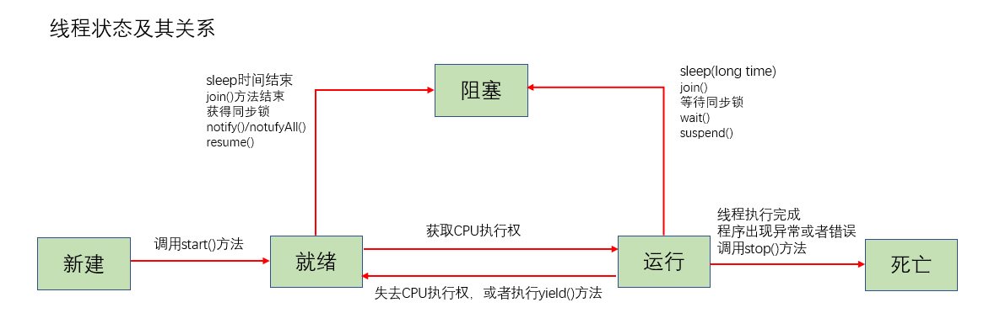

## 8、线程的同步

当多条语句在操作同一个线程共享数据时，一个线程对多条语句只执行了一部分，还没有执行完成，另一个线程参与进来执行，导致共享数据的错误。因此为了避免多线程执行过程中出现错误，必须要求：在一个线程正在执行操作共享数据的代码时，只有当前线程执行完成后，其他线程才可以参与执行。

### 8.1 多线程安全问题举例：卖票问题

有100张票，由三个窗口卖，要求，不能出现重票和错票。当出现线程安全问题时，就会出现重票和错票

```java
/**
 * Author: shaco
 * Date: 2022/10/16
 * Desc: 线程安全问题举例：卖票问题。继承Thread类举例
 */
public class Thread_Sync_ticket extends Thread {
    private int tickets = 100;

    private boolean flag = true;

    @Override
    public void run() {
        while (flag) {
            if (tickets > 0) {
                System.out.println(Thread.currentThread().getName() + "：卖第" + tickets + "票");
                tickets--;
            } else {
                flag = false;
            }
        }
    }

    public static void main(String[] args) {
        // 创建三个窗口
        Thread_Sync_ticket t1 = new Thread_Sync_ticket();
        Thread_Sync_ticket t2 = new Thread_Sync_ticket();
        Thread_Sync_ticket t3 = new Thread_Sync_ticket();

        // 给窗口命名
        t1.setName("窗口1");
        t2.setName("窗口2");
        t3.setName("窗口3");

        // 执行卖票过程
        t1.start();
        t2.start();
        t3.start();
    }
}
```

### 8.2 同步机制解决线程安全问题

在Java中，解决线程安全问题有两种方法，一种是同步机制，另一种是使用Lock的方式。同步机制又可以分为同步代码块和同步方法。

**同步代码块**

​	synchronized(同步监视器){需要被同步的代码}

说明：

-   操作共享数据的代码，即为需要被同步的代码。不要包含多了，也不能包含少了
-   共享数据：多个线程共同操作的变量，比如tickets就是共享数据
-   同步监视器，俗称：锁。任何一个类的对象都可以充当锁，但是有个要求，所有的线程必须使用同一把锁。

**同步方法**

如果操作共享数据的代码完整的声明在一个方法中，我们可以将此方法声明为同步的。

值得注意的是，同步方法依然涉及到同步监视器的问题，只是不需要我们显示的声明。**对于静态同步方法而言，同步监视器是当前类本身；对于非静态同步方法而言，同步监视器是this。**

#### 8.2.1 同步代码块解决继承Thread类出现的线程安全问题

```java
/**
 * Author: shaco
 * Date: 2022/10/16
 * Desc: 同步代码块解决线程安全问题，继承Thread类
 */
// 继承Thread类举例
public class Thread_Sync_Ticket_Extends extends Thread {
    // 需要注意的是，由于继承Thread类创建多线程需要创建多个继承类对象，为了使tickests成为公共数据，需要添加static关键字
    private static int tickets = 100; 
    private boolean flag = true;

    @Override
    public void run() {
        while (flag) {
            // 此处不能使用this作为同步监视器，原因在于继承Thread类创建多线程，需要创建多个继承类对象
            // 此时使用this的话，同步监视器并不是唯一的
            synchronized ("abc") {
                if (tickets > 0) {
                    System.out.println(Thread.currentThread().getName() + "：卖第" + tickets + "票");
                    tickets--;
                } else {
                    flag = false;
                }
            }
        }
    }

    public static void main(String[] args) {
        // 创建三个窗口
        Thread_Sync_Ticket_Extends t1 = new Thread_Sync_Ticket_Extends();
        Thread_Sync_Ticket_Extends t2 = new Thread_Sync_Ticket_Extends();
        Thread_Sync_Ticket_Extends t3 = new Thread_Sync_Ticket_Extends();

        // 给窗口命名
        t1.setName("窗口1");
        t2.setName("窗口2");
        t3.setName("窗口3");

        // 执行卖票过程
        t1.start();
        t2.start();
        t3.start();
    }
}
```


#### 8.2.2 同步代码块解决实现Runnable接口出现的线程安全问题

```Java
/**
 * Author: shaco
 * Date: 2022/10/16
 * Desc: 同步代码块解决线程安全问题，实现Runnable接口
 */
public class Thread_Sync_Ticket_Implements implements Runnable {
    private int tickets = 100;
    private boolean flag = true;

    @Override
    public void run() {
        while (flag) {
            synchronized (this) { // 此处可以使用this作为同步监视器
                if (tickets > 0) {
                    System.out.println(Thread.currentThread().getName() + "：卖第" + tickets + "票");
                    tickets--;
                } else {
                    flag = false;
                }
            }
        }
    }

    public static void main(String[] args) {
        Thread_Sync_Ticket_Implements thread_sync_ticket_implements = new Thread_Sync_Ticket_Implements();

        Thread t1 = new Thread(thread_sync_ticket_implements, "窗口1");
        Thread t2 = new Thread(thread_sync_ticket_implements, "窗口2");
        Thread t3 = new Thread(thread_sync_ticket_implements, "窗口3");

        t1.start();
        t2.start();
        t3.start();
    }
}
```


#### 8.2.3 同步方法解决继承Thread类出现的线程安全问题

```java
/**
 * Author: shaco
 * Date: 2022/10/16
 * Desc: 同步方法解决线程安全问题，继承Thread类
 */
// 继承Thread类举例
public class Thread_Sync_Ticket_Extends extends Thread {
    private static int tickets = 100;
    private static boolean flag = true;

    @Override
    public void run() {
        while (flag) {
            show();
        }
    }
	// 需要注意的是，对于同步方法而言，依然是要使用同步监视器的，只是不需要我们手动指明
    // 对于非静态同步方法而言，同步监视器是this，即当前对象
    // 对于静态同步方法而言，同步监视器是当前类对象
    // 由于继承Thread类创建多线程，创建了多个实现类对象，所以此处的同步方法需要变成静态同步方法
    public static synchronized void show() {
        if (tickets > 0) {
            System.out.println(Thread.currentThread().getName() + "：卖第" + tickets + "票");
            tickets--;
        } else {
            flag = false;
        }
    }

    public static void main(String[] args) {
        // 创建三个窗口
        Thread_Sync_Ticket_Extends t1 = new Thread_Sync_Ticket_Extends();
        Thread_Sync_Ticket_Extends t2 = new Thread_Sync_Ticket_Extends();
        Thread_Sync_Ticket_Extends t3 = new Thread_Sync_Ticket_Extends();

        // 给窗口命名
        t1.setName("窗口1");
        t2.setName("窗口2");
        t3.setName("窗口3");

        // 执行卖票过程
        t1.start();
        t2.start();
        t3.start();
    }
}
```


#### 8.2.4 同步方法解决实现Runnable接口出现的线程安全问题

```Java
	/**
 * Author: shaco
 * Date: 2022/10/16
 * Desc: 同步方法解决线程安全问题，实现Runnable接口
 */
public class Thread_Sync_Ticket_Implements implements Runnable {
    private int tickets = 100;
    private boolean flag = true;

    @Override
    public void run() {
        while (flag) {
            show();
        }
    }
	// 同样的道理，这个地方不需要写成静态方法，原因是，只创建了一个实现类的对象
    public synchronized void show() {
        if (tickets > 0) {
            System.out.println(Thread.currentThread().getName() + "：卖第" + tickets + "票");
            tickets--;
        } else {
            flag = false;
        }
    }

    public static void main(String[] args) {
        Thread_Sync_Ticket_Implements thread_sync_ticket_implements = new Thread_Sync_Ticket_Implements();

        Thread t1 = new Thread(thread_sync_ticket_implements, "窗口1");
        Thread t2 = new Thread(thread_sync_ticket_implements, "窗口2");
        Thread t3 = new Thread(thread_sync_ticket_implements, "窗口3");

        t1.start();
        t2.start();
        t3.start();
    }
}
```


#### 8.2.5 手动加锁Lock

从JDK5.0开始，Java提供了更强大的线程同步机制，通过显示定义同步锁对象来实现同步。同步锁使用Lock对象充当。

java.util.concurrent.locks.Lock接口是控制多个线程对共享资源进行访问的工具。锁提供了对共享资源的独占访问，每次只能由一个线程对Lock对象加锁，线程开始访问共享资源之前应先获得Lock对象。

ReentrantLock类是Lock接口的实现类之一，它拥有与snchronized相同的并发性和内存语义，在实现线程安全的控制中，比较常用的是ReentrantLock，可以显示加锁、释放锁。

使用Lock进行线程同步的基本步骤：

1.  创建ReentrantLock类的对象
2.  将同步代码放入try{}代码块中，同时在代码块之前调用ReentranLock类对象的lock()方法，获取同步监视器
3.  在finally{}代码块中调用ReentranLock类对象unlock()方法的，释放锁

代码示例：

```java
import java.util.concurrent.locks.ReentrantLock;

/**
 * Author: shaco
 * Date: 2022/10/16
 * Desc: 利用Lock接口解决线程安全问题，实现Runnable接口
 */
public class Thread_Sync_Ticket_Implements implements Runnable {
    private int tickets = 100;
    private boolean flag = true;
    // 1、创建ReentrantLock类的对象
    ReentrantLock reentrantLock = new ReentrantLock();

    @Override
    public void run() {
        while (flag) {
            // 2、调用lock()方法，获取同步监视器，并将同步代码放入try{}代码块中
            reentrantLock.lock();
            try {
                if (tickets > 0) {
                    System.out.println(Thread.currentThread().getName() + "：卖第" + tickets + "票");
                    tickets--;
                } else {
                    flag = false;
                }
            } finally {
                // 3、调用unlock()方法，释放同步监视器
                reentrantLock.unlock();
            }
        }
    }

    public static void main(String[] args) {
        Thread_Sync_Ticket_Implements thread_sync_ticket_implements = new Thread_Sync_Ticket_Implements();

        Thread t1 = new Thread(thread_sync_ticket_implements, "窗口1");
        Thread t2 = new Thread(thread_sync_ticket_implements, "窗口2");
        Thread t3 = new Thread(thread_sync_ticket_implements, "窗口3");

        t1.start();
        t2.start();
        t3.start();
    }
}
```

==注意：==

synchronized与Lock的区别：synchronized机制在执行完相应的同步代码以后，自动的释放同步监视器。Lock需要手动的启动同步（lock()，同时结束同步也需要手动的实现（unlock()）

### 8.3 单例模式线程安全解决

```java
/**
 * Author: shaco
 * Date: 2022/10/16
 * Desc: 单例模式（懒汉式）线程安全性解决
 */
public class Single_Case {
    // TODO 1、私有化构造器
    private Single_Case() {
    }

    // TODO 2、内部申明类的对象，并私有化
    // TODO 5、由于静态方法内部无法调用非静态结构，所以类的对应也必须声明为静态的
    private static Single_Case single_case = null;

    // TODO 3、提供公有化方法返回类的对象
    // TODO 4、由于类的构造器被私有化，外部无法创建对象，所以该公共方法必须声明为静态的，便于被调用
    public static Single_Case getSingle_case() {
        // 此处容易发生线程安全的问题
        // 改进
        if (single_case == null) {
            // 静态方法内部不能使用this关键字，此时多线程效率较低
            synchronized ("this") {
                if (single_case == null) {
                    single_case = new Single_Case();
                }
            }
        }
        return single_case;
    }
}
```

### 8.4 死锁问题

不同的线程分别占用对方需要的同步资源不放弃，都在等待对方放弃自己需要的同步资源，就形成了线程的死锁。出现死锁之后，不会出现异常，不会出现提示，只是所有的线程都处于阻塞状态，无法继续。

线程死锁举例

```Java
/**
 * Author: shaco
 * Date: 2022/10/16
 * Desc: 线程死锁举例
 */
public class Dead_Lock {
    public static void main(String[] args) {
        // 声明两个同步监视器对象
        String s1 = "abc";
        String s2 = "123";

        // 线程一：继承Thread类，使用匿名子类的方式
        new Thread() {
            @Override
            public void run() {
                synchronized (s1) {
                    System.out.println("第一个线程的第一个同步代码块");
                    try {
                        sleep(1000);
                    } catch (InterruptedException e) {
                        e.printStackTrace();
                    }
                    synchronized (s2) {
                        System.out.println("第一个线程的第二个同步代码块");
                    }
                }
            }
        }.start();

        // 线程二：实现Runnable接口，使用匿名子类的方式
        // 要记住，Thread类的构造器中，有一个带参构造器，其参数为Runnable接口类型
        new Thread(
                new Runnable() {
                    @Override
                    public void run() {
                        synchronized (s2) {
                            System.out.println("第二个线程的第一个同步代码块");
                            try {
                                // 需要注意的是，sleep()方法是在Thread类中申明的，Runnable接口中可没有
                                Thread.currentThread().sleep(1000);
                            } catch (InterruptedException e) {
                                e.printStackTrace();
                            }
                            synchronized (s1) {
                                System.out.println("第二个线程的第二个同步代码块");
                            }
                        }
                    }
                }
        ) {}.start();
    }
}
```

### 8.5 线程间的通信问题

线程间通信涉及到的三个方法：

1.  wait()方法：一旦执行此方法，当前线程就进入阻塞状态，并释放同步监视器
2.  notify()方法：一旦执行此方法，就会唤醒被wait()的一个线程，如果存在多个被wait()的线程，那么就唤醒优先级最高的那个
3.  notifyAll()方法：一旦执行此方法，就会唤醒被wait()的所有线程

**说明：**

-   wait()、notify()、notifyAll()三个方法必须在同步代码块或同步方法中使用
-   wait()、notify()、notifyAll()三个方法的调用者必须是同步代码块或者同步方法中的同步监视器，否则会出现IllegalMonitorStateException异常
-   wait()、notify()、notifyAll()三个方法是定义在java.lang.Object类中的方法

**==sleep()和wait()的区别==**

1.  两个方法声明的位置不同：Thread类中声明sleep() , Object类中声明wait()
2.  调用的要求不同：sleep()可以在任何需要的场景下调用。 wait()必须使用在同步代码块或同步方法中
3.  关于是否释放同步监视器：如果两个方法都使用在同步代码块或同步方法中，sleep()不会释放锁，wait()会释放锁

**生产者消费者问题**

生产者将产品交给店员，而消费者从店员处将产品取走，店员最多只能持有固定数量的产品，如果生产者试图生产更多的产品，店员会叫生产者停一下，如果店中有空位放产品了，再通知生产者继续生产；如果殿中没有产品，店员会告诉消费者等一下，如果殿中有了产品再通知消费者来取走产品。

```Java
package review;

/**
 * Author: shaco
 * Date: 2022/10/22
 * Desc: 线程间通信，消费者与生产者问题
 */
public class ThreadCommunication {
    public static void main(String[] args) {
        Clerk clerk = new Clerk();

        // 创建生产线程
        Productor productor = new Productor1(clerk);
        productor.start();

        // 创建消费线程
        Consumer consumer = new Consumer(clerk);
        new Thread(consumer).start();
    }
}

class Clerk {
    private int amount = 10;

    public synchronized void produce() { // 锁是Clerk类的对象
        if (amount < 20) {
            amount++;
            System.out.println("生产第" + amount + "个产品");
            // 当生产过一次产品就可以唤醒消费线程
            notify();
        } else {
            // 此时需要等待消费线程消费至少一个产品
            try {
                wait();
            } catch (InterruptedException e) {
                e.printStackTrace();
            }
        }
    }

    public synchronized void consumer() { // 锁是Clerk类的对象
        if (amount > 0) {
            System.out.println("消费第" + amount + "个产品");
            amount--;
            // 当消费了至少一个产品后就可以唤醒生产线程
            notify();
        } else {
            // 此时需要等待生产线程生产产品
            try {
                wait();
            } catch (InterruptedException e) {
                e.printStackTrace();
            }
        }
    }
}

class Productor1 extends Thread {
    private Clerk clerk;

    Productor(Clerk clerk) {
        this.clerk = clerk;
    }

    @Override
    public void run() {
        while (true) {
            clerk.produce();
        }
    }
}

class Consumer implements Runnable {
    public Clerk clerk;

    Consumer1(Clerk clerk) {
        this.clerk = clerk;
    }

    @Override
    public void run() {
        while (true) {
            clerk.consumer();
        }
    }
}
```

# 七、常用类

## 1、String类

String：字符串，使用一对""引起来表示。

### 1.1 String概述

```Java
// String类的部分定义
public final class String
    implements java.io.Serializable, Comparable<String>, CharSequence {
    /** The value is used for character storage. */
    private final char value[];

    /** Cache the hash code for the string */
    private int hash; // Default to 0

    /** use serialVersionUID from JDK 1.0.2 for interoperability */
    private static final long serialVersionUID = -6849794470754667710L;
}
```

根据String类的定义可以得到以下结论：

1.  String声明为final的，不可被继承
2.  String实现了Serializable接口：表示字符串是支持序列化的；实现了Comparable接口：表示String可以比较大小
3.  String内部定义了final char[] value用于存储字符串数据
4.  String：代表不可变的字符序列。简称：不可变性
    -   当对字符串重新赋值时，需要重写指定内存区域赋值，不能使用原有的value进行赋值
    -   当对现有的字符串进行连接操作时，也需要重新指定内存区域赋值，不能使用原有的value进行赋值
    -   当调用String的replace()方法修改指定字符或字符串时，也需要重新指定内存区域赋值，不能使用原有的value进行赋值
5.  **通过字面量的方式（区别于new）给一个字符串赋值，此时的字符串值声明在字符串常量池中**
6.  **字符串常量池中是不会存储相同内容的字符串的**

### 1.2 String类的创建方式

String类有三种创建方式：

-   通过字面量的方式创建字符串：栈空间中变量存储的地址直接指向方法区（字符串常量池）中的字符串常量
-   通过new的方式创建字符串：栈空间中变量存储的地址先指向堆空间中的一个value，这个value中存储的地址指向方法区（字符串常量池）中的字符串常量
-   通过已有的字符串进行拼接获得字符串：栈空间中变量存储的地址先指向堆空间中的一个value，这个value中存储的地址指向方法区（字符串常量池）中的字符串常量

**三种创建字符串方式的区别：**

```Java
@Test
public void test1() {
    //通过字面量定义的方式：此时的str1和str2的数据javaEE声明在方法区中的字符串常量池中。
    String str1 = "JavaEE1";
    String str2 = "JavaEE2";

    // 构造器的方式：此时的str3和str4保存的地址值，是数据在堆空间中开辟空间以后对应的地址值
    String str3 = new String("JavaEE3");
    String str4 = new String("JavaEE4");

    // 通过拼接字符串的方式：此时的str5，和str6保存的地址值是数据在堆空间中开辟空间以后对应的地址值
    String str5 = str1 + "hadoop";
    String str6 = str1 + str2;
}
```

**字符串内存解析**

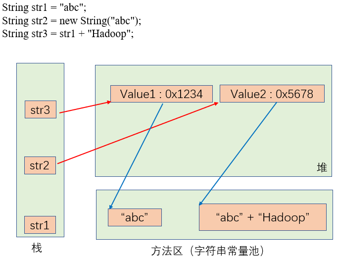

==字符串创建时内存解析结论==

-   方法区(Method Area)：用于存储类结构信息的地方，包括常量池、静态变量、构造函数等
-   字符串常量与字符串常量的拼接结果在常量池。且常量池中不会存在相同内容的常量（包括字符串常量和数值常量）
-   只要其中有一个字符串是变量，结果就在堆中
-   如果拼接的结果调用intern()方法，返回值就在常量池中

### 1.3 字符串对象的内存解析

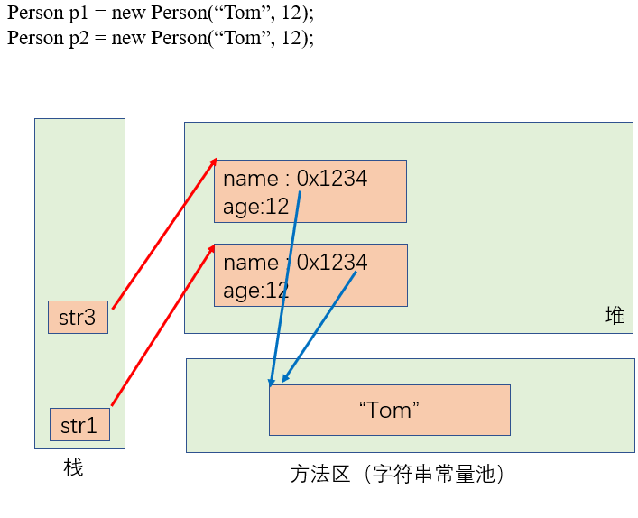

### 1.4 String使用陷阱及相关面试题

-   String str1 = "a";
    -   说明：在字符串常量池中创建了一个字面量为"a"的字符串
-   String str2 = str2 + "b";
    -   说明：实际上原来的字符串"a"已经丢弃了，现在在堆空间中产生了一个字符串str2 + "b"，也就是"ab"。如果多次执行这些改变字符串内容的操作，会导致大量副本字符串对象留存在内存中，降低效率。如果这样的操作放到循环中，会极大影响程序的性能
-   String str3 = "a" + "b";
    -   说明：str3指向字符串常量池中已经创建的"ab"字符串
-   String str4 = s1.intern();
    -   说明：堆空间的str1对象在调用intern()之后，会将常量池中已经存在的"ab"字符串赋值给str4

**字符串面试题**

```Java
// 程序运行结果是good和best
// 面试题考的是函数的值传递
public class StringTest {
    String str = new String("good");
    char[] ch = {'t', 'e', 's', 't'};

    public void change(String str, char ch[]) {
        str = "test ok";
        ch[0] = 'b';
    }

    public static void main(String[] args) {
        StringTest ex = new StringTest();
        ex.change(ex.str, ex.ch);
        System.out.println(ex.str);
        System.out.println(ex.ch);
    }
}
```

### 1.5 字符串常用构造器及方法

**常用构造器：**

```Java
public String()
public String(String original)
public String(char value[])
public String(char value[], int offset, int count)
public String(byte bytes[]) {}
public String(byte bytes[], int offset, int length) {}
public String(StringBuffer buffer) {}
public String(StringBuilder builder) {}
```

**常用方法：**

-   1、方法定义：

    ```Java
    public int length()
    ```

    方法作用：返回字符串的长度

-   2、方法定义：

    ```Java
     public char charAt(int index)
    ```

    方法作用：返回指定索引处的字符

-   3、方法定义：

    ```Java
    public boolean isEmpty() 
    ```

    方法作用：判断是否是空字符串

-   4、方法定义：

    ```Java
    public String toLowerCase()
    ```

    方法作用：将 String 中的所有字符转换为小写

-   5、方法定义：

    ```Java
    public String toUpperCase() 
    ```

    方法作用：将 String 中的所有字符转换为大写

-   6、方法定义：

    ```Java
    public String trim()
    ```

    方法作用：返回字符串的副本，忽略前导空白和尾部空白

-   7、方法定义：

    ```Java
    public boolean equals(Object anObject)
    ```

    方法作用：比较字符串的内容是否相同

-   8、方法定义：

    ```Java
    public boolean equalsIgnoreCase(String anotherString)
    ```

    方法作用：与equals方法类似，忽略大小写

-   9、方法定义：

    ```Java
    public String concat(String str)
    ```

    方法作用：将指定字符串连接到此字符串的结尾。 等价于用“+"

-   10、方法定义：

    ```Java
    public int compareTo(String anotherString)
    ```

    方法作用：比较两个字符串的大小，按顺序依次比较两个字符串的字符的ASIIC码值，当当左边字符串“大于”右边字符串时，返回正数，反之，返回负数

-   11、方法定义：

    ```Java
    public String substring(int beginIndex)
    ```

    方法作用：返回一个新的字符串，它是此字符串的从beginIndex开始截取到最后的一个子字符串

-   12、方法定义：

    ```Java
    public String substring(int beginIndex, int endIndex)
    ```

    方法作用：返回一个新字符串，它是此字符串从beginIndex开始截取到endIndex(不包含)的一个子字符串

-   13、方法定义：

    ```Java
    public boolean endsWith(String suffix) 
    ```

    方法作用：测试此字符串是否以指定的后缀结束

-   14、方法定义：

    ```Java
    public boolean startsWith(String prefix)
    ```

    方法作用：测试此字符串是否以指定的前缀开始

-   15、方法定义：

    ```Java
    public boolean startsWith(String prefix, int toffset)
    ```

    方法作用：测试此字符串从指定索引开始的子字符串是否以指定前缀开始

-   16、方法定义：

    ```Java
    public boolean contains(CharSequence s)
    ```

    方法作用：当且仅当此字符串包含指定的 char 值序列时，返回 true

-   17、方法定义：

    ```Java
    public int indexOf(String str)
    ```

    方法作用：返回指定子字符串在此字符串中第一次出现处的索引

-   18、方法定义：

    ```Java
    public int indexOf(String str, int fromIndex) 
    ```

    方法作用：返回指定子字符串在此字符串中第一次出现处的索引，从指定的索引开始

-   19、方法定义：

    ```Java
    public int lastIndexOf(int ch)
    ```

    方法作用：返回指定子字符串在此字符串中最右边出现处的索引

-   20、方法定义：

    ```Java
    public int lastIndexOf(int ch, int fromIndex)
    ```

    方法作用：返回指定子字符串在此字符串中指定索引到最后索引范围内最右边出现处的索引

==注意：indexOf和lastIndexOf方法如果未找到都是返回-1==

-   21、方法定义：

    ```Java
    public String replace(CharSequence target, CharSequence replacement) 
    ```

    方法作用：返回一个新的字符串，它是通过用 newChar 替换此字符串中出现的所有 oldChar 得到的

-   22、方法定义：

    ```Java
    public String replace(char oldChar, char newChar) 
    ```

    方法作用：返回一个新的字符串，它是通过用 newChar 替换此字符串中出现的所有 oldChar 得到的

-   23、方法定义：

    ```Java
    public String replace(CharSequence target, CharSequence replacement) 
    ```

    方法作用：使用指定的字面值替换序列替换此字符串所有匹配字面值目标序列的子字符串

-   24、方法定义：

    ```Java
    public String replaceFirst(String regex, String replacement)
    ```

    方法作用：使用给定的 replacement 替换此字符串匹配给定的正则表达式的第一个子字符串

-   25、方法定义：

    ```Java
    public String replaceAll(String regex, String replacement) 
    ```

    方法作用：使用给定的 replacement 替换此字符串所有匹配给定的正则表达式的子字符串

-   26、方法定义：

    ```Java
    public boolean matches(String regex) 
    ```

    方法作用：告知此字符串是否匹配给定的正则表达式

-   27、方法定义：

    ```Java
    public String[] split(String regex)
    ```

    方法作用：根据给定正则表达式的匹配拆分此字符串

-   28、方法定义：

    ```Java
    public String[] split(String regex, int limit) 
    ```

    方法作用：根据匹配给定的正则表达式来拆分此字符串，最多不超过limit个，如果超过了，剩下的全部都放到最后一个元素中

### 1.6 字符串与基本数据类型、包装类转换

**字符串转换成基本数据类型、包装类**

字符串转换成基本数据类型需要通过包装类进行，具体过程是，使用java.lang包中的包装类Byte、Short、Long、Float、Double类调用相应的静态方法**parseXxx(String str)**，可以将由"数字"字符组成的字符串转换程像一个的基本数据类型

**基本数据类型、包装类转换成字符串**

-   调用String类的**public String valueOf(int n)**，可以将Int类型转换成相应的字符串
-   相应的，调用String类的**valueOf(byte b)、valueOf(long l)、valueOf(float f)、valueOf(double d)、valueOf(boolean b)**可以将基本数据类型以及相应的包装类转换成字符串

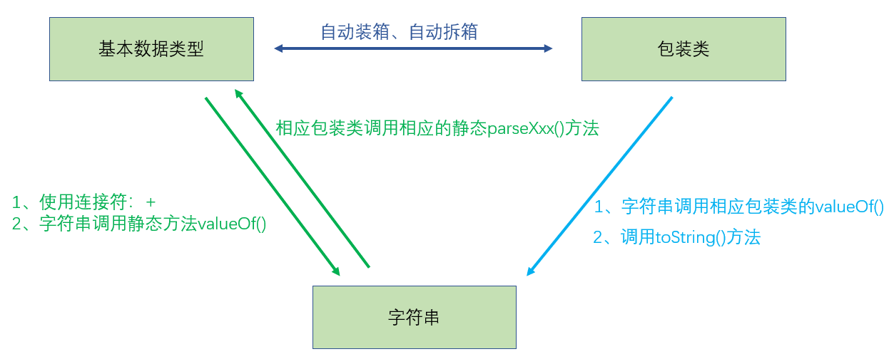

### 1.7 字符串与字符数组之间的转换

**字符串转换成字符数组**

字符串调用相应的方法能够转换成字符数组。

1.  方法定义

    ```Java
    public char[] toCharArray()
    ```

    方法作用：将字符串中的全部字符存放在一个字符数组中

2.  方法定义

    ```Java
    public void getChars(int srcBegin, int srcEnd, char dst[], int dstBegin)
    ```

    方法作用：将指定索引范围内的字符串存放到指定的字符数组的指定索引中

**字符数组转换成字符串**

-   使用String类的构造器

    ```Java
    public String(char value[]) // 将字符数组中的全部字符转换成字符串
    ```

    ```Java
    public String(char value[], int offset, int count) // 将字符数组中指定的部分字符转换成字符串
    ```

### 1.8 字符串与字节数组之间的转换

**字符串转换成字节数组**

字符串调用相应的方法能够转换成字节数组

-   方法定义：

    ```java
    public byte[] getBytes() // 使用运行环境默认的字符集将此字符串编码为byte序列，并将结果存储到一个新的byte数组中
    ```

    ```Java
    public byte[] getBytes(String charsetName) throws UnsupportedEncodingException // 使用指定的字符集将此字符串编码为byte序列，并将结果存储到一个新的byte数组中
    ```

**字节数组转换成字符串**

-   使用String类的构造器：将字节数组转换成字符数组字符串能够使用的构造器有很多，下面列举常用的两种

    ```Java
    public String(byte bytes[]) // 使用运行环境的默认字符集，将字节数组解码，并转换成一个字符串
    ```

    ```Java
    public String(byte bytes[], int offset, int length) // 使用运行环境的默认字符集，将字节数组指定部分进行解码，并转换成一个字符串
    ```


## 2、StringBuffer类和StringBuilder类

### 2.1 String、StringBuffer、StringBuilder三者的区别

-   String：不可变的字符序列；底层使用char[]存储
-   StringBuffer：可变的字符序列；线程安全的，效率低；底层使用char[]存储
-   StringBuilder：可变的字符序列；jdk5.0新增的，线程不安全的，效率高；底层使用char[]存储

**三者执行效率排序**

StringBuilder > StringBuffer > String

由于StringBufrrer和StringBuilder的区别仅在于线程是否安全，因此，以下以StringBuffer类为例，介绍StringBuffer和StringBuilder类

### 2.2 StringBuffer与StringBuIlder类的内存解析

以StringBuffer类为例

```java
String str1 = new String(); // char[] value = new char[0];
String str2 = new String("abc"); // char[] value = new char[]{'a','b','c'};

StringBuffer sb1 = new StringBuffer(); // char[] value = new char[16]; // 底层创建了一个长度为16的字符数组
StringBuffer sb2 = new StringBuffer("abc"); 
// char[] value = new char["abc".length() + 16];
// value.append('a');
// value.append('b');
// value.append('c');
```

**可变字符串的扩容问题**

当添加数据的可变字符串的底层数组盛不下时，那么需要对底层数组进行扩容。

默认情况下，扩容为原来容量的2倍 + 2，同时将原来数组中的元素赋值到新的数组中

### 2.3 StringBuffer与StringBuffer类的常用构造器和方法

以StringBuffer类为例，StringBuffer类的方法与StringBuffer类的方法相同，只不过都是同步方法。

**构造器**

```Java
public StringBuffer()
public StringBuffer(int capacity)
public StringBuffer(String str)
public StringBuffer(CharSequence seq)
```

```Java
public StringBuilder()
public StringBuilder(int capacity)
public StringBuilder(String str)
public StringBuilder(CharSequence seq)
```

-   1、方法定义：

    ```Java
    public synchronized void setCharAt(int index, char ch)
    ```

    方法作用：将参数字符串拼接到原字符串的后面（追加），==这个方法有很多重载方法==

-   2、方法的定义：

    ```Java
    public synchronized StringBuffer delete(int start, int end)
    ```

    方法作用：删除指定位置的内容，左闭右开

-   3、方法的定义：

    ```Java
    public synchronized void setCharAt(int index, char ch) 
    ```

    方法作用：将索引为n的元素设置为ch

-   4、方法的定义：

    ```Java
    public synchronized StringBuffer replace(int start, int end, String str)
    ```

    方法作用：把[start,end)位置替换为str。==StringBuffer只有这一个replace()方法==

-   5、方法的定义：

    ```Java
    public synchronized char charAt(int index)
    ```

    方法作用：以字符的形式返回StringBuffer索引为n的元素

-   6、方法的定义：

    ```Java
    public synchronized StringBuffer insert(int offset, Object obj)
    ```

    方法作用：在指定位置插入xxx，==这个方法有很多的重载方法==

-   7、方法的定义：

    ```Java
    public synchronized int length()
    ```

    方法作用：返回StringBuffer底层数组中字符的个数

-   8、方法的定义：

    ```Java
    public synchronized int capacity()
    ```

    方法作用：返回StringBuffer底层数组的长度

-   9、方法的定义：

    ```Java
    public synchronized String substring(int start)
    public synchronized String substring(int start, int end)
    ```

    方法作用：截取字符串

-   10、方法的定义：

    ```Java
    public int indexOf(String str)
    ```

    方法作用：返回指定字符串在StringBuffer中的第一次出现时的首字符的索引

-   11、方法的定义：

    ```Java
    public synchronized int indexOf(String str, int fromIndex)
    ```

    方法作用：返回指定字符串在StringBuffer中指定索引后第一次出现时的首字符的索引

-   12、方法的定义：

    ```Java
    public int lastIndexOf(String str) 
    ```

    方法作用：返回指定字符串在StringBuffer中最后一次出现处的索引

-   13、方法的定义：

    ```Java
    public synchronized int lastIndexOf(String str, int fromIndex)
    ```

    方法作用：返回指定字符串在StringBuffer中指定索引到最后索引范围内最后一次出现的索引

    ==indexOf()方法和lastIndexOf()方法以返回-1表示找不到给定的字符串==

-   14、方法的定义：

    ```Java
    public synchronized StringBuffer reverse()
    ```

    方法作用：将字符串反序

## 3、常用时间类

==**JDK8之前的时间API**==

### 3.1 System类中常用时间方法

-   方法定义：

    ```Java
    public static native long currentTimeMillis()
    ```

    方法作用：获取当前时间与1907-01-01 00:00:00之间以毫秒为单位的时间差，这种以毫秒为单位的时间通常被称为时间戳

### 3.2 java.util.Date类与java.sql.Date类

**java.util.Date类是java.sql.Date类的父类**

java.utli.Date类与java.sql.Date类都是用来表示特定的瞬间，其时间精度达到毫秒。区别在于java.util.Date类用于Java代码中，而java.sql.Date类用于将关系型数据库的数据映射到Java代码中所使用。

```Java
package exer;
import org.junit.Test;
import java.util.Date;
/**
 * Author: shaco
 * Date: 2022/10/29
 * Desc: 练习
 */
public class Demo {
    @Test
    public void test1() {
        // 1、java.util.Date类，需要掌握两个常用的构造器，和常用的两个方法
        // 使用两个不同构造器创建java.util.Date对象
        Date date1 = new Date();
        Date date2 = new Date(42183568456478L);
        System.out.println(date1); // 输出：Sat Oct 29 13:34:09 SGT 2022
        System.out.println(date2); // 输出：Thu Sep 30 01:54:16 SGT 3306

        // 使用两个常用的方法
        // 1、public String toString()：显示该java.util.Date对象表示的时间的年、月、日、时、分、秒、星期等信息
        System.out.println(date1.toString()); // 输出：Sat Oct 29 13:34:09 SGT 2022
        System.out.println(date2.toString()); // 输出：Thu Sep 30 01:54:16 SGT 3306

        // 2、public long getTime()：获取当前Date对象表示的时间所对应的毫秒数。（时间戳）
        System.out.println(date1.getTime()); // 输出：1667021649692
        System.out.println(date2.getTime()); // 输出：42183568456478

        // 2、java.sql.Date类，这个类有两个构造器，但是有一个过时了
        // 使用public Date(long date)构造器创建对象
        Date date3 = new java.sql.Date(13451734457L);
        System.out.println(date3); // 输出：1970-06-06

        // 使用两个常用的方法
        // 1、public String toString()：显示该java.sql.Date对象表示的时间的年月日信息
        System.out.println(date3.toString()); // 输出：1970-06-06

        // 2、public long getTime()：获取当前java.sql.Date对象表示的时间所对应的毫秒数。（时间戳）
        System.out.println(date3.getTime()); // 输出：13451734457

        // TODO 如何将java.util.Date对象转换成java.sql.Date？
        // 通过时间戳进行转换
        Date date4 = new Date();
        long time = date4.getTime();
        java.sql.Date date5 = new java.sql.Date(time);
        System.out.println(date4); // 输出：Sat Oct 29 13:46:19 SGT 2022
        System.out.println(date5); // 输出：2022-10-29
    }
}
```

### 3.3 java.text.SimpleDateFormat类

Date类的API不易于国际化，因此大部分的API都被废弃了，java.text.SimpleDateFormat类是一个不受环境影响的，用来格式化和解析日期的具体类。它能够将时间在日期和字符串之间相互转换。

**创建SimpleDateFormat类对象**

**两个常用SimpleDateFormat构造器**

```java
public SimpleDateFormat() // 默认构造器，其创造的对象会按默认格式对Date对象进行解析和格式化
public SimpleDateFormat(String pattern) // 其创造的对象能按指定格式对Date对象进行解析和格式化
```

**SimpleDateFormat类常用两个方法**

-   格式化方法：

    ```Java
    public final String format(Date date)
    ```

    方法作用：格式化方法，将Date对象格式化为字符串

-   解析方法：

    ```Java
    public Date parse(String source) throws ParseException
    ```

    方法作用：将字符串按照指定的格式解析成一个Date对象

### 3.4 java.util.Calendar类

java.util.Calendar类是一个抽象基类，主要用于完成日期字段之间相互操作。

**创建java.util.Calendar类**

1.  调用Calendar类的getInstance()方法，其底层创建的是Calendar子类GregorianCalendar的对象
2.  直接使用Calendar子类GregorianCalendar的构造器创建Calendar对象

```Java
@Test
public void test2() {
    // Calendar类，日历类，是一个抽象类
    // Calendar类常用的属性
    /*
     * Calendar.AM              从午夜到中午之前这段时间的AM_PM字段值
     * Calendar.PM              从中午到午夜之前这段时间的AM_PM字段值
     * Calendar.YEAR            年份
     * Calendar.MONTH           月份
     * Calendar.DATE            日期
     * Calendar.HOUR            小时(12小时制)
     * Calendar.MINUTE          分钟
     * Calendar.SECOND          秒
     * Calendar.WEEK_OF_YEAR    年内的某星期
     * Calendar.WEEK_OF_MONTH   月内的某星期
     * Calendar.DAY_OF_YEAR     年内的某天
     * Calendar.DAY_OF_MONTH    月内的某天
     * Calendar.DAY_OF_WEEK     星期内的某天(从周日开始计算)
     * Calendar.HOUR_OF_DAY     小时(24小时制)
     */
    // 创建一个Calendar对象
    Calendar c1 = Calendar.getInstance();
    // 调用Calendar对象的常用方法
    // 1. public int get(int field)  用于返回给定日历字段的值，其中field一般使用Calendar类的常用属性
    int year = c1.get(Calendar.YEAR);
    int month = c1.get(Calendar.MONTH);
    int days = c1.get(Calendar.DAY_OF_MONTH);
    int hours = c1.get(Calendar.HOUR);
    int hours_of_day = c1.get(Calendar.HOUR_OF_DAY);
    int minute = c1.get(Calendar.MINUTE);
    int second = c1.get(Calendar.SECOND);
    System.out.println("今天是" + year + "年" + month + "月" + days + "日，" + hours_of_day + "时(" + hours + "时)" + minute + "分" + second + "秒");
    // 从这个例子当中也可以知道，Calendar调用默认的getInstance()方法创建的Calendar对象，默认的时间就是当前时间

    // 2.public void set()系列的方法
    // ① public void set(int field, int value) 将Calendar对象的某一属性设置成指定属性
    c1.set(Calendar.DAY_OF_MONTH, 8);
    c1.set(Calendar.DAY_OF_WEEK, 3);
    int days1 = c1.get(Calendar.DAY_OF_MONTH);
    int days2 = c1.get(Calendar.DAY_OF_WEEK);
    System.out.println("一个月中的第：" + days1 + "天");
    System.out.println("一周中的第：" + days2 + "天");
    //② public final void set(int year, int month,int date) 将Calendar对象的年月日设置成指定的年月日
    c1.set(2022, 1, 7);
    year = c1.get(Calendar.YEAR);
    month = c1.get(Calendar.MONTH);
    days = c1.get(Calendar.DAY_OF_MONTH);
    System.out.println("今天是" + year + "年" + month + "月" + days + "日");
    // ③ public final void set(year, month, date, hourOfDay, minute) 设置指定的年月日，小时、分钟
    // ④ public final void set(year, month, date, hourOfDay, minute, second) 设置指定的年月日，时分秒

    // 3. public final void setTime(Date date) 将指定的Date类型时间转化成Calendar对象的时间
    // 4. public final Date getTime() 返回一个表示此Calendar时间值（从历元至现在的毫秒偏移量）的Date对象
    Date date = new Date(1638776783728L);
    System.out.println(date);
    System.out.println(date.getTime());
    c1.setTime(new Date(1638776783728L));
    System.out.println(c1.getTime());

    // 5. public void setTimeInMillis(long millis) 用给定的long类型值设置此 Calendar 的当前时间值。
    c1.setTimeInMillis(1638776783728L);
    System.out.println(c1.getTime());

    //6. public long getTimeInMillis() 返回此Calendar的时间戳，以毫秒为单位。
    Calendar c2 = Calendar.getInstance();
    long value = c2.getTimeInMillis();
    System.out.println(value);
}
```

==注意==

-   获取月份时：一月是0，二月是1，三月是2，以此类推，12月是11
-   获取星期时：周日是1，周二是2，以此类推，周六是7

==**JDK8之后的时间API**==

如果我们可以跟别人说：“我们在1592643933071见面，别晚了！”，那么就再简单不过了，但是我们希望时间与抽噎和四季有关，于是事情就变得复杂了。JDK1.0中有java.util.Date类，但是它的大多数方法再JDK1.1引入Calendar类之后被启用了。而Calendar类也存在很多问题：

-   可变性：像日期和时间这样的类应该是不可变的
-   偏移性：Date中的年份是从1900开始的，而月份都是从0开始的，星期都是从星期天开始的
-   格式化：格式化只对Date有用，Calendar则不行
-   此外它们也不是线程安全的，也无法处理闰秒等

==对日期和时间的操作一直是Java程序员最痛苦的地方之一==

在Java 8引入的java.time API是成功的，纠正了过去的缺陷。java.time中包含了多有关于**本地日期（LacalDate）、本地时间（LocalTime）、本地日期时间（LocalDateTime）、时区（ZonedDateTime）和持续时间（Duration）的类。**历史久远的Date类新增了toInstant()方法，用于把Date转换成新的表示形式。这些新增的本地化时间日期API极大简化了日期时间和本地化管理。

**新的时间日期API**

-   java.time：包含值对象的基础包
-   java.time.chrono：提供对不同的日历系统的访问
-   java.time.format：格式化和解析日期、时间
-   java.time.temporal：包括底层框架和扩展特性
-   java.time.zone：包含时区支持的类

**说明：**大多数开发者只会用到基础包和format包，也可能会用到temporal包。因此，尽管有68个新的公开类型，大多数开发者，大概将只会用到其中三分之一。

### 3.5 LocalDate,LocalTime,LocalDateTime类

三个类都是java.time包下的类，这三个类分别代表了：本地日期、本地时间、本地日期时间，具有相同的方法可以使用

**LocalDate,LocalTime,LocalDateTime的常用方法**

```Java
1.now()系列方法
> public static LocalDateTime now() // 从默认时区的系统时钟获取当前日期时间
> public static LocalDateTime now(ZoneId zone) // 从指定时区的系统时钟获取当前日期时间

2.of()系列方法，of()方法也是一个静态方法，用于根据指定的年月日、时分秒创建LocalDate,LocalTime,LocalDateTime对象具有多个重载方法
> public static LocalDateTime of(int year, Month month, int dayOfMonth, int hour, int minute)

3.getXxx()相关方法
> getDayOfMonth() 获得月份天数（1~31）
> getDayOfYear() 获得年份天数（1~366）
> getDayOfWeek() 获得周天数，也就是返回星期几
> getYear() 获得年份
> getMonthValue() 获得月份（1~12）
> getMonth() 获得月份，英文的单词
> getHour()\getMinute()\getSecond() 获取小时、分钟、秒

4.withXxx()系列方法  修改指定值
> public LocalDateTime withDayOfMonth(int dayOfMonth)/withDayOfYear(int dayOfYear) 
    将月份天数、年份天数修改为指定的值，并返回新的对象
> public LocalDateTime withMonth(int month)/withYear(int year) 
    将月份、年份修改为指定的值，并返回新的对象
> public LocalDateTime withHour(int hour)/withMinute(int minute)/withSecond(int second) 
    将小时、分钟、秒修改为指定的值，并返回新的对象

5.plusXxx()系列方法 增加指定的值
> public LocalDateTime plusYears(long years)/plusMonths(long months)/plusWeeks(long weeks)/plusDays(long days)/plusHours(long hours)/plusMinutes(long minutes)/plusSeconds(long seconds)
返回此 LocalDateTime 的副本，并添加指定的年、月、周、日、小时、分钟、秒数。

6.minusXxx()系列方法 减去指定的值
> public LocalDateTime minusYears(long years)/minusMonths(long months)/minusWeeks(long weeks)/minusDays(long days)/minusHours(long hours)/minusMinutes(long minutes)/minusSeconds(long seconds)
  返回此 LocalDateTime 的副本，并减去指定的年、月、周、日、小时、分钟、秒数。
```

### 3.6 java.time.Instant类

java.time.Instant类用于表示时间线上的一个瞬时点，可以被用来记录应用程序中的事件时间戳。

在处理日期和时间的时候，我们通常会想到年月日、时分秒，然而，这只是时间的一个模型，是面向人类的。第二种通用模型是面向及其的，或者说是连续的。在这个模型中，时间线中的一个点表示为一个很大的数，这有利于计算机的处理。

在UNIX中，这个数从1970-01-01 00:00:00开始，以秒为单位；在Java中，也从1970-01-01 00:00:00开始，不过以毫秒为单位。

java.time包通过值类型Instant提供及其视图，不提供处理人类意义上的时间单位，从概念上将，它只是简单的表示自1970-01-01 00:00:00（UTC）开始的秒数。

**常用方法**

-   1、方法定义：

    ```Java
    public static Instant now()  
    ```

    方法作用：获取具有本初子午线对应的标准时间的Instant对象

-   2、方法定义：

    ```java
    public java.time.OffsetDateTime atOffset(@NotNull java.time.ZoneOffset offset)  
    ```

    方法作用：基于当前时区的时间，再结合指定的偏移时区创建OffsetDateTime对象

-   3、方法定义：

    ```Java
    public long toEpochMilli() 
    ```

    方法作用：将此瞬间转换为自 1970-01-01T00:00:00Z 纪元以来的毫秒数

-   4、方法定义：

    ```Java
    public static Instant ofEpochMilli(long epochMilli) 
    ```

    方法作用：从 1970-01-01T00:00:00Z 的纪元使用指定的毫秒获取 Instant 的实例。从指定的毫秒中提取秒和纳秒

### 3.7 DateTimeFormatter类

DateTimeFormatter类用于格式化或解析LocalDate、LocalTime、LocalDateTime类的对象。该类提供了三种格式化或解析的形式：

-   预定义的标准格式，例如：ISO_LOCAL_DATE_TIME；ISO_LOCAL_DATE;ISO_LOCAL_TIME
-   本地化相关的格式，例如：ofLocalizedDateTime(FormatStyle.LONG)
-   自定义的格式，例如：ofPattern("yyyy-MM-dd hh:mm:ss")

该类中的format()和parse()方法分别提供格式化和解析的功能

```Java
package knowledge;

import org.junit.Test;

import java.time.LocalDateTime;
import java.time.format.DateTimeFormatter;
import java.time.format.FormatStyle;

public class DateTimeFormatterClass {
    @Test
    public void test() {
        // 创建LocalDateTime等对象
        LocalDateTime t1 = LocalDateTime.now();
        System.out.println(t1);

        // 方式一：预定义的标准格式。如：ISO_LOCAL_DATE_TIME;ISO_LOCAL_DATE;ISO_LOCAL_TIME
        // 创建DateTimeFormatter对象
        DateTimeFormatter formatter1 = DateTimeFormatter.ISO_LOCAL_DATE_TIME;
        String f1 = formatter1.format(t1);
        System.out.println(f1);

        // 方式二：本地化相关的格式。如：ofLocalizedDateTime()
        // FormatStyle.LONG / FormatStyle.MEDIUM / FormatStyle.SHORT :适用于LocalDateTime
        // 创建DateTimeFormatter对象
        DateTimeFormatter formatter2 = DateTimeFormatter.ofLocalizedDateTime(FormatStyle.LONG);
        String f2 = formatter2.format(t1);
        System.out.println(f2);

        // 方式三：定义的格式。如：ofPattern(“yyyy-MM-dd hh:mm:ss”)
        // 创建DateTimeFormatter对象
        DateTimeFormatter formatter3 = DateTimeFormatter.ofPattern("yyyy-MM-dd hh:mm:ss");
        String f3 = formatter3.format(t1);
        System.out.println(f3);
    }
}
```

## 4、Java比较器

为了使对象之间能够进行比较，那么对象所属的类必须实现Comparable接口或者在需要比较时通过传入Comparator接口的实现类对象指定比较大小的方式。

Java实现对象排序（大小比较）有两种方式：

-   自然排序：java.lang.Comparable
-   定制排序：java.util.Comparator

**自然排序：java.lang.Comparable**

实现Comparable接口的类必须重写comparaTo(Object obj)方法，两个对象即通过comparaTo(Object obj)方法的返回值来比较大小。如需按照从小到大进行排列，那么函数的返回值需要满足：如果当前对象this大于形参Object，则返回正整数；如果当前对象this小于形参obj，则返回负整数，如果当前对象this等于形参obj则返回0。

**Comparable的典型实现类：（默认按照从小到大排序）**

-   String：按照字符串中字符的Unicode值进行比较，字典排序
-   Charactor：按照字符的Unicode值进行比较
-   包装类及BigInteger、BigDecimal类，按照对应数值的大小进行
-   Date、Time等，后面的日期、时间大于前面的日期

**定制排序：java.util.Comparator**

当元素的类型没有实现java.lang.Comparable接口而又不方便修改代码、或者实现了java.lang.Comparable接口，但排序规则不适合当前操作，那么就需要使用Comparator接口了。

继承java.util.Comparator接口需要重写方法中的compara(Object o1, Object o2)方法，compara(Object o1, Object o2)用于比较o1和o2对象，如果需要按照从小到大进行排列，需要满足：如果方法返回正整数，表示o1大于o2；如果方法返回负整数，表示o1小于o2；如果方法返回0，表示o1等于o2。

Comparator接口的实现类对象可以作为参数传递给一些排序函数，或者构造器。

## 5、System类

System类代表系统，包含很多系统及的属性和方法，位于java.lang包。Syetem类构造器私有化，无法创建对象；属性及方法都时static，可以直接调用。

**属性：System类包含in、out、err三个属性，分别代表标准输入流，标准输出流和标准错误输出流**

**方法：**

-   方法定义：

    ```Java
    public static native long currentTimeMillis()
    ```

    方法作用：返回当前系统时间。即格林威治1970年1月1日0时0分0秒至今所间隔的毫秒数

-   方法定义：

    ```Java
    public static void exit(int status)
    ```

    方法作用：调用此方法时，退出程序（虚拟机），status为0时，表示正常退出，非零表示异常退出。该方法可以在图形化界面编程中实现程序的退出功能

-   方法定义：

    ```Java
    public static void gc()
    ```

    方法作用：调用此方法的目的是请求系统进行垃圾回收。至于是否立刻回收，取决于系统的垃圾回收算法以及系统执行时的情况。

-   方法定义：

    ```Java
    public static String getProperty(String key)
    ```

    方法作用：该方法可以根据传入的key值获取系统属性

    -   java.version    -->     Java运行时环境版本
    -   java.home       -->     java安装目录
    -   os.name         -->     操作系统名称
    -   os.version      -->     操作系统版本
    -   user.name       -->     用户的账户名称
    -   user.home       -->     用户的主目录
    -   user.dir        -->     用户的当前工作目录

## 6、Math类

java.lang.Math类包含了用于执行基本数学运算的方法，类中所有方法均为静态方法，属性均为全局变量（public static final）。

**属性：**

-   public static final double PI：圆周率
-   public static final double E：自然底数

**方法：**

-   public static double abs(double a)：返回a的绝对值
-   public static double ceil(double a)：返回大于等于a的最小整数，即向上取整
-   public static double floor(double a)：返回小于a的最大整数，即向下取整
-   public static double round(double a)：返回最接近参数的long，相当于四舍五入
-   public static double pow(double a, double b)：返回a的b次幂
-   public static double sqrt(double a)：返回a的平方根
-   public static double max(double a, double b)：返回a,b中的最大值
-   public static double min(double a, double b)：返回a,b中的最小值
-   public static double random()：返回[0,1)的随机值，取值范围呈现均匀分布

## 7、java.Math.BigInteger和java.Math.BigDecimal

**BigInteger类：可以表示不可变的任意精度的整数**

BigInteger类提供了所有Java的基本整数操作符的对应物，并提供了Java.lang.Math的所有相关方法。此外，BigInteger类还提供了：核运算、GCD计算、质数测试、素数生成、位操作以及一些其他的操作。

**构造器**

-   public BigInteger(String val):根据传入的字符串构建BigInteger对象

**方法**

-   public BigInteger abs()：返回此BigInteger的绝对值的BigInteger
-   public BigInteger add(BigInteger val)：返回(this + val)的BigInteger
-   public BigInteger subtract(BigInteger val)：返回(this - val)的BigInteger
-   public BigInteger multiply(BigInteger val)：返回(this * val)的BigInteger
-   public BigInteger divide(BigInteger val)：返回(this / val)的BigInteger
-   public BigInteger abs(BigInteger val)：返回(this % val)的BigInteger
-   public BigInteger pow(int exponent)：返回this的exponent次幂的BigInteger

**BigDecimal类：支持不可变、任意精度的有符号十进制浮点数**

**构造器**

-   public BigDecimal(double val)
-   public BigDecimal(String val)

**方法**

-   public BigDecimal add(BigDecimal val)：返回(this + val)的BigDecimal
-   public BigDecimal subtract(BigDecimal val)：返回(this - val)的BigDecimal
-   public BigDecimal multiply(BigDecimal val)：返回(this * val)的BigDecimal
-   public BigDecimal divide(BigDecimal val)：返回(this / val)的BigDecimal

## 8、java.util.Random类

用于产生随机数的类

**构造器**

-   public Random()：创建一个随机数生成器，默认以当前系统时间作为种子
-   public Random(long seed)：创建一个随机数生成器，使用传入参数seed作为种子

**方法**

-   int nextInt()：返回一个整数范围内的int型数据，数值满足均匀分布
-   int nextInt(int n)：返回一个int型随机数，范围为[0,n)之间
-   void nextBytes(byte[] bytes):生成随机字节并将其置于用户提供的byte数组中
-   long nextLong()：返回一个long型随机数，范围为long数据的范围，分布为均匀分布
-   float nextFloat()：返回下一个伪随机数，它是取自此随机数生成器序列的、在0.0和1.0之间均匀分布float值
-   double nextDouble()：返回下一个伪随机数，它是取自此随机数生成器序列的、在0.0和1.0之间均匀分布的 double值
-   boolean nextBoolean()：返回下一个伪随机数，它是取自此随机数生成器序列的均匀分布的boolean值
-   double nextGaussian()：返回下一个伪随机数，它是取自此随机数生成器序列的、呈高斯（“正态”）分布的double值，其平均值是0.0标准差是1.0

## 9、包装类

针对8种基本数据类型数据，Java定义了相应的应用类型--包装类，这样Java才是真正意义上的面向对象语言了。

-   byte    -->     Byte
-   short   -->     Short
-   int     -->     Integer
-   long    -->     Long
-   char    -->     Character
-   float   -->     Float
-   double  -->     Double
-   boolean -->     Boolean

**基本数据类型、包装类、字符串之间的相互转换**


**==注意包装类对象的缓存问题==**

包装类的数据在缓存值的范围内时，会直接从内存中去除对象，超出范围会创建新的对象。

-   Byte、Short、Integer、Long的缓存范围是：-128~127
-   Character的缓存范围是：0~127
-   Boolean的缓存范围是：true和false

## 10、数组工具类

java.util.Arrays数组工具类，提供了许多对数组进行操作的静态方法，并且每种方法都有许多的重载形式。

**常用方法**

-   查找：

    ```Java
    public static int binarySearch(int[] a, int key)
    ```

    方法作用：利用二分查找算法，查找数组a中是否存在key，若存在则返回key第一次出现的索引；若不存在，则返回-1

-   排序：

    ```Java
    public static void sort(int[] a)
    public static void sort(int[] a, int beginIndex, int endIndex)
    ```

    方法作用：① 在数组a的基础上直接进行排序，默认按照从小到大的顺序进行；② 在a的基础上，对[beginIndex, endIndex)范围内的元素按从小到大进行排序

-   复制：

    ```Java
    public static void copyOf(int[] a, int newLength)
    public static void copyOfRangeOf(int[] a, int from, int to)
    ```

    方法作用：① 根据数组a，复制一个长度为newLength的新数组，并返回新数组；② 将数组a中，索引范围为[from, to)的元素复制，并返回该复制的数组

-   填充：

    ```Java
    static void fill(int[] a, int val)
    static void fill(int[] a, int fromIndex, int toIndex, int val)
    ```

    方法作用：① 用val填充整个数组a；② 在数组a的基础上，用val填充数组a索引范围为[fromIndex, toIndex)的部分

-   其他：

    -   ```Java
        static boolean equals(int[] a, int[] b)
        ```

        方法作用：判断两个数组的长度和元素是否完全相同

    -   ```Java
        ststic String toString(int[] a)
        ```

        方法作用：将数组a的元素，拼接为一个字符串，并返回

# 八、枚举类

**枚举类：当一个类的对象是有限的确定的，我们称这样的类是枚举类。**

**当需要定义一组常量的时候，强烈推荐使用枚举类**

**如果枚举类中只有一个对象，那么可以作为单例模式的实现方式**

## 1、JDK8之前自定义枚举类

**基本步骤**

-   私有化类的构造器，保证不能在类的外部创建其对象
-   在类的内部创建枚举类的实例，并声明为：public static final
-   对象如果有实例变量，应该声明为private final，并在构造器中初始化

**对于枚举类的属性**

-   枚举类对象的属性不允许被改动，缩影应该使用private final修饰
-   枚举类的使用private fianl修饰的属性应该在构造器中为其赋值
-   若枚举类显示的定义了带参的构造器，则在列举出枚举值时，也必须对应的传入参数

```Java
package exer;

/**
 * Author: shaco
 * Date: 2022/10/30
 * Desc: 手动定义枚举类
 */
public class SeasonTest {
    // TODO 1、声明私有的、常量属性
    private final String SEASONNAME;
    private final String SEASONDESC;

    // TODO 2、私有化构造器，并为属性赋值
    private SeasonTest(String SEASONNAME, String SEASONDESC) {
        this.SEASONDESC = SEASONDESC;
        this.SEASONNAME = SEASONNAME;
    }

    // TODO 3、创建枚举类的有限的、明确的对象，同时利用构造器进行私有常量属性赋值
    public static final SeasonTest SPRING = new SeasonTest("春天", "春暖花开");
    public static final SeasonTest SUMMER = new SeasonTest("夏天", "夏日炎炎");
    public static final SeasonTest AUTUMN = new SeasonTest("秋天", "秋高气爽");
    public static final SeasonTest WINTER = new SeasonTest("冬天", "冬日暖阳");

    // 至此，枚举类其实已经创建完成，如果有别的需求可以正常声明
    // TODO 4、其他需求，重写toString()方法

    @Override
    public String toString() {
        return "SeasonTest{" +
                "SEASONNAME='" + SEASONNAME + '\'' +
                ", SEASONDESC='" + SEASONDESC + '\'' +
                '}';
    }
}
```

## 2、JDK8之后使用enum关键字定义枚举类

-   使用enum关键字定义的枚举类默认继承了java.lang.Enum类，因此使用enum关键字创建的枚举类不能再继承其他的类
-   枚举类的构造器只能使用private修饰
-   枚举类的所有实例对象必须在枚举类中显示列出，多个枚举类对象之间使用逗号分隔，使用分号结束。列出的实例对象，系统会自动添加public static fianl修饰
-   **必须在枚举类的第一行声明枚举类对象**

**JDK5中，可以在switch-case表达式中使用Enum定义的枚举类的对象作为表达式，case字句可以直接使用枚举值的名字，无需添加枚举类作为限定**

**使用enum关键字创建枚举类**

```Java
package exer;

/**
 * Author: shaco
 * Date: 2022/10/30
 * Desc: 使用eumn创建枚举类
 */
public enum SeasonEumn {
    // TODO 1、直接列举出该枚举类的有限个确定的对象，如果有属性，同时写上属性值
    SPRING("春天", "春暖花开"),
    SUMMER("夏天", "春暖花开"),
    AUTUMN("秋天", "春暖花开"),
    WINTER("冬天", "冬日暖阳");
    
    // TODO 2、根据枚举类对象的属性，添加对应的类成员属性，声明为私有的
    private String SeasonName;
    private String SeasonDesc;

    // TODO 3、由于枚举类声明了私有的成员属性，所以需要添加相应的构造器，为私有的属性赋值
    private SeasonEumn(String SeasonName, String SeasonDesc) {
        this.SeasonName = SeasonName;
        this.SeasonDesc = SeasonDesc;
    }
    
    // TODO 4、其他需求
    // 重写toString()方法

    @Override
    public String toString() {
        return "SeasonEumn{" +
                "SeasonName='" + SeasonName + '\'' +
                ", SeasonDesc='" + SeasonDesc + '\'' +
                '}';
    }
}
```

## 3、Enum枚举类的常用方法

-   values()方法：该方法会返回一个数组，数字元素的类型是枚举类的类型，元素为枚举类所包含的对象，数组长度是枚举类包含对象的个数。==注意：该方法并不是Enum类中定义的方法，而是编译器在编译时插入的方法，因此只能用枚举类直接调用==
-   valueOf(String str)：该方法根据传入的对象名称返回枚举类中定义的对象常量。要求字符串必须是枚举类对象的“名字”。如不是，会有运行时异常：IllegalArgumentException。
-   toString()：Enum类中的toString()方法只会返回对象的名称，该方法可以重写

## 4、枚举类实现接口

### 4.1 自定义枚举类实现接口

自定义类可以实现接口，并且被重写的方法根据其写法不同会产生不同的效果

-   重写方式一：在枚举类内只重写一个被重写的方法，那么枚举类的每个对象调用重写方法时，都只调用同一个重写方法
-   重写方式二：在枚举类的每个对象后面跟写一对大括号{}，在括号内重写被重写的方法，那么每个对象都可以重写不一样的内容。**除此之外还需要在枚举类内部再重写一个被重写的方法，虽然这个方法在实际中并不会被调用**

### 4.2 使用enmu关键字创建枚举类实现接口

enum关键字创建枚举类继承接口：与自定义创建枚举类继承接口同样有两种重写方式

-   方式一：与自定义创建枚举类相同
-   方式二：与自定义创建枚举类相同，唯一的不同是，enum关键字创建的枚举类不需要额外在枚举类的内部重写被重写的方法

# 九、注解（Annotation）

## 1、注解的概述

注解是代码里的特殊标记，这些标记可以在编译，类加载，运行时被读取，并执行相应的处理。通过注解，我们可以在不改变原有逻辑的情况下，在源文件中嵌入一些补充信息，代码分析工具、开发工具和部署工具可以通过这些补充信息进行验证或者进行部署。

Annotation可以像修饰符一样被使用，可用于修饰包、类、构造器、方法、成员变量、参数、局部变量的声明，这些信息被保存在Annotation的“name=value”对中。

在JavaSE阶段中，注解的使用较为简单，如标记过时的功能、忽略警告等，而在JavaEE/Android中都有着较为重要的应用，未来的开发模式也都是基于注解的，一定程度上，框架 = 注解 + 反射 + 设计模式。

**常见的注解示例**

注解大致可以分为三类：

-   生成文档相关的注解
-   在编译是进行格式检查（JDK内置的三个注解）：
    -   @override- 检查该方法是否是重写方法
    -   @Deprecated- 标记过时的方法
    -   @suppressWarnings- 指示编译器忽略注解中声明的警告
-   跟踪代码依赖性，实现替代配置文件功能

## 2、自定义注解

-   定义新的Annotation类型使用@interface关键字
-   自定义注解自动实现java.lang.annotation.Annotation接口
-   ==Annotation的成员变量在Annotation定义中以无参方法的形式来声明。==其方法名和返回值类型定义了该成员的名字和类型。其类型只能是八种基本数据类型、String类型、Class类型、enum类型、Annotation类型。可以在定义Annotation的成员变成时为其指定初始值（默认值），利用关键字default进行定义。

==注意：自定义注解必须配上注解的信息处理流程（反射）才有意义==

## 3、四种元注解

**元注解：用于修饰其他注解的注解**

1.   @Retention - 用于指定被修饰注解的生命周期，@Retention包含一个RetentionPolicy类型的成员变量，使用@Retention时必须为该注解的value成员变量赋值。RetentionPolicy是一个枚举类，包含三个成员变量：
    -   RetentionPolicy.SOURECE：在源文件中有效（即源文件保留），编译器会丢弃这种策略的注解
    -   RetentionPolicy.CLASS：在.class文件中有效（即.class文件中保留），当运行Java程序时，JVM不会保留注释，==注意：这是@Retention注解成员变量的默认值==
    -   RetentionPolicy.RUNTIME：在运行时有效（即运行时也保留），当运行Java程序时，JVM会保留注释，程序可以通过反射获取该注释
2.   @Target - 用于指定被修饰的注解能用于修饰哪些程序元素，@Target也有一个value变量
    -   TYPE - 用于描述类、接口、枚举类
    -   CONSTRUCTOR - 用于描述构造器
    -   PACKAGE - 用于描述包
    -   FIELD - 用于描述属性
    -   PARAMETER - 用于描述形式参数
    -   LOCAL_VARIABLE - 用于描述局部变量
    -   METHOD - 用于描述方法
3.   @Documented - 被修饰的注解能够被javadoc工具识别并保留，如API中，java.util.Date类中的一些方法被修饰为@Deprecated
4.   @Inherited - 被修饰的注解会具有继承性，如果某个类使用了被@Inherited修饰的注解，那么该类的子类会自动继承这个注解

## 4、注解的使用、JDK8中注解的新特性

# 十、集合

为了方便对多个对象进行操作，我们可以将对象存入Java容器：数组中。除了数组这种Java容器外还有很多容器也能够存储多个对象，如集合。

Java集合可以分为Collection和Map两种不同的体系

-   **Collection接口：单列集合，用于存储一个一个的对象**
    -   **List接口：由于存储有序的，可重复的数据，并且可以替换原有的数组，它的实现类都是可以扩容的，可变容器**
        -   **ArrayList(实现类)：是List接口的主要实现类，底层使用数组进行存储；线程不安全，执行效率高**
        -   **LinkedList(实现类)：底层使用双向链表进行数据存储；当需要进行不断的插入、删除等操作时适合使用这种类型集合**
        -   **Vector(实现类)：是List接口的古老实现类，线程安全，但效率较低；底层仍然使用数组进行对象的存储**
    -   **Set接口：存储无序的、不可重复的数据**
        -   **HashSet(实现类)：作为Set接口的主要实现类，底层仍然使用数组进行数据的子类，线程不安全的，但可以存储null值**
            -   **linkedHashSet(实现类)：遍历其内部数据时，会按照添加数据的顺序进行遍历，其原因在于底层使用了数组和双向链表的方式进行数据存储**
        -   **SortedSet（接口）**
            -   **TreeSet(实现类)：只能存储相同类型的存储，对于存入的数据可以按照指定属性进行排序；其底层利用红黑树进行数据存储**
-   **Map接口：双列数据，存储key-value对的数据**
    -   **HashMap：作为Map的主要实现类；线程不安全的，效率高；存储null的key和value。JDK7及之前，底层使用数组+链表；JDK8之后，底层使用数组+链表+红黑树**
        -   **LinkedHashMap：保证在遍历map元素时，可以按照添加的顺序实现遍历。原因：在原有的HashMap底层结构基础上，添加了一对指针，指向前一个和后一个元素。对于频繁的遍历操作，此类执行效率高于HashMap**
    -   **TreeMap：保证按照添加的key-value对进行排序，实现排序遍历。此时考虑key的自然排序或定制排序。底层使用红黑树**
    -   **Hashtable：作为古老的实现类；线程安全的，效率低；不能存储null的key和value**
        -   **Properties:常用来处理配置文件。key和value都是String类型**

## 1、Collection集合

### 1.1、Collection集合与数组的区别和联系

-   Collection集合底层使用的是数组，区别在于，数组能够存储基本**数据类型**和**各种对象**，而集合存储的内容只能是对象，==因此集合在存储基本数据类型时，会将基本数据类型“装箱”成包装类再进行存储。==
-   数组一旦声明，那么就只能存储“一类”数据，而集合在不设置泛型的情况下，可以存储任何类型的数据（基本类型会“装箱”成包装类），当集合设置泛型后，就相当于数组，只是不能存储基本数据类型了。
-   数组一旦生命，那么数组的长度就确定了，而集合是“可变长”的数组，当需要存储的元素的个数超出集合底层的数组的长度时，会自动进行扩容。
-   由于Collection集合只存储对象，并且在一些抽象方法中难免要判断一个对象是否在集合中，或者对象的“内容”是否相同，因此，对于存入到Collection集合中的对象所在类需要重写equals()方法，因为Collection底层是使用equals()方法进行判断的。

### 1.2、Collection集合中定义的抽象方法

1.  方法定义：

    ```Java
    boolean add(E e);
    ```

    方法作用：向集合中添加对象obj，添加成功返回true，添加失败返回false

2.  方法定义：

    ```Java
    boolean addAll(Collection<? extends E> c);
    ```

    方法作用：将集合coll中的所有元素按顺序一个一个添加到当前集合中，添加成功返回true，添加失败返回false。

    ==注意：Add()和AddAll()的区别，Add()一次只添加一个元素，如果传入的参数是一个集合，那么将集合当作一个整体添加；而AddAll()会将一个集合中的元素按顺序一个一个添加到当前集合中==

3.  方法定义：

    ```java
    void clear();
    ```

    方法作用：将集合中的所有元素都清除，但仍然保留集合这个容器

4.  方法定义：

    ```Java
    boolean contains(Object o);
    ```

    方法作用：判断当前集合是否包含obj这个对象，如果包含返回true，如果不包含返回false

5.  方法定义：

    ```Java
    boolean containsAll(Collection<?> c);
    ```

    方法作用：判断当前对象是否包含集合coll中的全部元素，若包含返回true，若不包含返回false

    ==注意：contains()和containsAll()方法在进行对象的比较时，需要调用对象的equals()方法进行元素是否存在的判断，因此所有添加到集合中的对象所在类必须重写equals()方法==

6.  方法定义：

    ```Java
    boolean equals(Object o);
    ```

    方法作用：判断当前集合与形参集合对象所包含的元素的**个数、内容、顺序**都是否相同，若相同返回true，若不同，返回false

7.  方法定义：

    ```Java
    boolean isEmpty();
    ```

    方法作用：判断当前集合对象是否为空，是返回true，否返回false

8.  方法定义：

    ```Java
    boolean remove(Object o);
    ```

    方法作用：从当前集合中删除给定的对象obj，若删除成功返回true，删除失败返回false

9.  方法定义：

    ```Java
    boolean removeAll(Collection<?> c);
    ```

    方法作用：删除当前集合中，当前集合与参数集合的共有元素，相当于A - AB

10.  方法定义：

     ```Java
     int size();
     ```

     方法作用：返回当前集合中所含元素的个数

11.  方法定义：

     ```Java
     boolean retainAll(Collection<?> c);
     ```

     方法作用：求两个集合的交集，底层实现是删除当前集合中，参数集合中没有的元素

12.  方法定义：

     ```Java
     int hashCode();
     ```

     方法作用：返回当前对象的哈希值

13.  方法定义：

     ```Java
     Object[] toArray();
     ```

     方法作用：将集合对象转换成数组

14.  方法定义：

     ```Java
     <T> T[] toArray(T[] a);
     ```

     方法作用：将集合对象转换成数组

15.  方法定义：

     ```Java
     Iterator<E> iterator();
     ```

     方法作用：返回一个迭代器对象

### 1.3、迭代器接口Iterator

接口声明：

```Java
public interface Iterator<E>{
    boolean hasNext();
    
    E next();
    
    default void remove() {
        throw new UnsupportedOperationException("remove");
    }
    
    default void forEachRemaining(Consumer<? super E> action) {
        Objects.requireNonNull(action);
        while (hasNext())
            action.accept(next());
    }
}
```

-   Collection接口中的iterator()方法返回的Iterator类型的值是一个迭代器
-   集合对象每调用一次iterator()方法都会返回一个全新的迭代器
-   迭代器是设计模式的一种，主要用于遍历Collection集合中的元素
-   迭代器模式就是为容器而生，并且仅用于遍历集合对象

**Iterator接口中的常用方法**

-   **boolean hasNext()**：判断是否还有下一个遍历元素，若还有未被遍历的元素，返回true；否则，返回false。
-   Object next()：返回集合里的下一个元素
-   void remove()：删除集合里上一次next方法返回的元素

**注意：迭代器的位置不是在某一个元素上，而是在集合中第一个元素之前、两个元素之间或最后一个元素之后**

**除了利用迭代器进行集合的遍历，还可以利用增强far循环（JDK 5.0提供的新特性）进行集合的遍历**

```Java
for(Person p : coll){
    System.out.println(p);
}
```

**遍历集合的三种方式：以ArrayList为例**

```Java
package exercise;

import org.junit.Test;

import java.util.ArrayList;
import java.util.Iterator;

/**
 * Author: shaco
 * Date: 2022/11/5
 * Desc: 遍历集合的三种方式
 */
public class Demo {
    @Test
    public void test() {
        ArrayList arr = new ArrayList();
        arr.add(123);
        arr.add(new Integer(123));
        arr.add("abc");
        arr.add(true);
        arr.add(0.34);
        arr.add(new String[]{"abc", "456"});
        arr.add(new Circle());

        // TODO 1、普通for循环
        for (int i = 0; i < arr.size(); i++) {
            System.out.println(arr.get(i));
        }

        // TODO 2、迭代器
        Iterator iterator = arr.iterator();
        while (iterator.hasNext()) {
            System.out.println(iterator.next());
        }

        // TODO 3、增强for循环/forEach
        for (Object obj : arr) {
            System.out.println(obj);
        }

    }
}
```

### 1.4 集合和数组之间的相互转换

```Java
@Test
public void test2() {
    ArrayList arr = new ArrayList();
    arr.add(123);
    arr.add(new Integer(123));
    arr.add("abc");
    arr.add(true);
    arr.add(0.34);
    arr.add(new String[]{"abc", "456"});
    arr.add(new Circle());

    // TODO 1、集合转换成数组
    Object[] objects = arr.toArray();
    System.out.println(Arrays.toString(objects));

    // TODO 2、数组转换成集合
    // 第一种写法
    String[] str = new String[]{"abc", "123"};
    System.out.println(Arrays.asList(str));
    // 第二种写法
    System.out.println(Arrays.asList("hello java", "hello world"));

    //TODO 将基本类型数组转换成集合，有些地方需要注意
    // 第一种写法，如果将基本类型数组直接作为asList()方法的参数传入，那么asList()方法会直接将该数组作为一个对象转换成集合的一个元素
    int[] ints = {1, 2, 3, 3, 4};
    System.out.println(Arrays.asList(ints)); //[[I@5d6f64b1]
    // 第二种写法，如果将需要转换成集合元素的基本类型数据，一个个写入asList()方法中，那么这些基本类型数据会逐个转换成集合的元素
    System.out.println(Arrays.asList(1, 2, 3, 4, 5)); // [1, 2, 3, 4, 5]
}
```

## 2、List接口

List接口用于存储有序、可重复的单列数据。List接口除了继承父接口Collection中的抽象方法之外还定义了一系列与数组索引相关的方法。

### 2.1、List接口中的抽象方法

1.  方法定义：

    ```Java
    void add(int index, E element)
    ```

    方法作用：将元素插入到当前集合中索引为index的位置上。

2.  方法定义：

    ```Java
    boolean addAll(int index, Collection<? extends E> c);
    ```

    方法作用：将集合的所有元素一个一个插入到指定的索引位置上

3.  方法定义：

    ```Java
    E get(int index);
    ```

    方法作用：返回指定索引位置上的元素

4.  方法定义：

    ```Java
    E set(int index, E element);
    ```

    方法作用：将集合中指定索引处的元素设置为element

5.  方法定义：

    ```Java
    int indexOf(Object o);
    ```

    方法作用：返回对象o在集合中首次出现位置的索引

6.  方法定义：

    ```Java
    int lastIndexOf(Object o);
    ```

    方法作用：返回对象o在集合中最后一次出现位置索引

7.  方法定义：

    ```Java
    E remove(int index);
    ```

    方法作用：删除集合中指定位置处的对象，返回值即是所删除的对象

8.  方法定义：

    ```Java
    List<E> subList(int fromIndex, int toIndex);
    ```

    方法作用：返回[fromIndex,toIndex)索引范围内子List对象

### 2.2、List接口三个实现类的对比及源码分析

#### 2.2.1 ArrayList的源码分析：

-   JDK 7情况下

    -   ArrayList list = new ArrayList();//底层创建了长度是10的Object[]数组elementData
    -   list.add(123);//elementData[0] = new Integer(123);
    -   .......
    -   list.add(11);//如果此次的添加导致底层elementData数组容量不够，则扩容。
    -   默认情况下，扩容为原来的容量的1.5倍，同时需要将原有数组中的数据复制到新的数组中。

    **结论：建议开发中使用带参的构造器：ArrayList list = new ArrayList(int capacity)**

-   JDK 8中ArrayList的变化：

    -   ArrayList list = new ArrayList();//底层Object[] elementData初始化为{}。并没有创建长度为10的数组
    -   list.add(123);//第一次调用add()时，底层才创建了长度10的数组，并将数据123添加到elementData[0]
    -   ......
    -   后续的添加和扩容操作与jdk 7 无异。

==小结：JDK7中的ArrayList的对象的创建类似于单例的饿汉式，而JDK8中的ArrayList的对象的创建类似于单例的懒汉式，延迟了数组的创建，节省内存。==

#### 2.2.2 LinkedList的源码分析：

-   LinkedList list = new LinkedList(); 内部声明了Node类型的first和last属性，默认值为null

-   list.add(123);//将123封装到Node中，创建了Node对象。

-   其中，Node定义为：体现了LinkedList的双向链表的说法

    ```java
    private static class Node<E> {
       E item;
       Node<E> next;
       Node<E> prev;
       Node(Node<E> prev, E element, Node<E> next) {
       this.item = element;
       this.next = next;
       this.prev = prev;
       }
    }
    ```

#### 2.2.3 Vector的源码分析

jdk7和jdk8中通过Vector()构造器创建对象时，底层都创建了长度为10的数组。在扩容方面，默认扩容为原来的数组长度的2倍。

==三个类都是实现了List接口，存储数据的特点相同：存储有序的、可重复的数据==

## 3、Set接口

Set接口也是Collection接口的子接口之一，但Set接口中并没有额外定义其他抽象方法，其原因是Set接口的实现类不单使用数组来存储数据的，还使用到了链表，所以没有关于索引相关的别的方法。

**Set集合存储数据的特点是，无序，且不可重复**

==注意：向Set接口的实现类中存入数据时，必须重写数据对象所在类的hashCode()方法和equals()方法。==

==重写的要求是：重写的hashCode()和equals()尽可能保持一致性：相等的对象必须具有相等的散列码重写两个方法的小技巧：对象中用作 equals() 方法比较的 Field，都应该用来计算 hashCode 值。==

### 3.1 Set接口存储无序、不可重复数据的体现

以主要实现类HashSet为例进行说明：

HashSet存储数据的特点：

-   不能保证数据的存储顺序，也就是数据是无序的
-    HashSet不是线程安全的
-   HashSet可以存储null值

1.   无序性：不等于随机性。存储的数据在底层数组中并非按照数组索引的顺序添加，而是根据数据的哈希值决定的。
2.   不可重复性：保证添加的元素按照equals()判断时，不能返回true.即：相同的元素只能添加一个。

### 3.2 Set接口添加元素的过程：以HashSet为例

-   我们向HashSet中添加元素a，首先调用元素a所在类的hashCode()方法，计算元素a的哈希值，此哈希值接着通过某种算法计算出在HashSet底层数组中的存放位置（即为：索引位置），判断数组此位置上是否已经有元素：
    -   如果此位置上没有其他元素，则元素a添加成功。 --->情况1
    -   如果此位置上有其他元素b(或以链表形式存在的多个元素），则比较元素a与元素b（以及其他元素）的hash值：
        -   如果hash值不相同，则元素a添加成功。--->情况2
        -   如果hash值相同，进而需要调用元素a所在类的equals()方法：
            -   equals()返回true,元素a添加失败
            -   equals()返回false,则元素a添加成功。--->情况3

对于添加成功的情况2和情况3而言：元素a与已经存在指定索引位置上数据以链表的方式存储。

JDK7：元素a放到数组中，指向原来的元素。

JDK8：原来的元素在数组中，指向元素a

**总结：七上八下；HashSet底层：数组+链表的结构。**

### 3.3 LinkedHashSet的使用

LinkedHashSet在利用数组存储数据时，还维护了数据的双向链表，因此在遍历其数据时，会按照添加的顺序进行打印

LinkedHashSet作为HashSet的子类，在添加数据的同时，每个数据还维护了两个引用，记录此数据前一个数据和后一个数据。

**优点：对于频繁的遍历操作，LinkedHashSet效率高于HashSet**

### 3.4 TreeSet的使用

-   TreeSet底层使用红黑树进行数据存储，因此添加到TreeSet的数据对象都必须时同一类型的
-   此外，TreeSet会自动对添加的数据进行排序，所以数据所在类必须要继承Comparable接口，或者在创建TreeSet对象的时候向构造器中添加Comparator比较器对象

1.  向TreeSet中添加的数据，要求是相同类的对象。
2.  两种排序方式：自然排序（实现Comparable接口） 和 定制排序（Comparator）
3.  自然排序中，比较两个对象是否相同的标准为：compareTo()返回0，不再是equals()
4.  定制排序中，比较两个对象是否相同的标准为：compare()返回0，不再是equals()

## 4、Map接口

### 4.1 Map结构的理解

-   Map中的key：无序的、不可重复的，使用Set存储所有的key  ---> key所在的类要重写equals()和hashCode()（以HashMap为例）
-   Map中的value：无序的、可重复的，使用Collection存储所有的value --->value所在的类要重写equals()
-   一个键值对：key-value构成了一个Entry对象
-   Map中的entry：无序的、不可重复的，使用Set存储所有的entry

### 4.2 HashMap的底层实现原理，以JDK7为例说明：

-   HashMap map = new HashMap()
    -   在实例化以后，底层创建了长度是16的一维数组Entry[] table。
    -   ...可能已经执行过多次put...
-   map.put(key1,value1)
    -   首先，调用key1所在类的hashCode()计算key1哈希值，此哈希值经过某种算法计算以后，得到在Entry数组中的存放位置
    -   如果此位置上的数据为空，此时的key1-value1添加成功。 ----情况1
    -   如果此位置上的数据不为空，(意味着此位置上存在一个或多个数据(以链表形式存在)),比较key1和已经存在的一个或多个数据的哈希值：
        -   如果key1的哈希值与已经存在的数据的哈希值都不相同，此时key1-value1添加成功。----情况2
        -   如果key1的哈希值和已经存在的某一个数据(key2-value2)的哈希值相同，继续比较：调用key1所在类的equals(key2)方法，比较：
            -   如果equals()返回false:此时key1-value1添加成功。----情况3
            -   如果equals()返回true:使用value1替换value2

==关于情况2和情况3：此时key1-value1和原来的数据以链表的方式存储==

在不断的添加过程中，会涉及到扩容问题，当超出临界值（且要存放的位置非空）时，扩容。默认的扩容方式：扩容为原来容量的2倍，并将原有的数据复制过来。

### 4.3 JDK8 相较于JDK7在底层实现方面的不同：

1.   new HashMap()：底层没有创建一个长度为16的数组
2.   JDK8底层的数组是：Node[]，而非Entry[]
3.   首次调用put()方法时，底层创建长度为16的数组
4.   JDK7底层结构只有：数组+链表。JDK8中底层结构：数组+链表+红黑树。
    -   形成链表时，七上八下（ JDK7：新的元素指向旧的元素。JDK8：旧的元素指向新的元素）
    -   当数组的某一个索引位置上的元素以链表形式存在的数据个数 > 8 且当前数组的长度 > 64时，此时此索引位置上的所数据改为使用红黑树存储。

**HashMap重要常量**

-   DEFAULT_INITIAL_CAPACITY : HashMap的默认容量，16
-   DEFAULT_LOAD_FACTOR：HashMap的默认加载因子：0.75
-   threshold：扩容的临界值，=容量*填充因子：16 * 0.75 => 12
-   TREEIFY_THRESHOLD：Bucket中链表长度大于该默认值，转化为红黑树：8
-   MIN_TREEIFY_CAPACITY：桶中的Node被树化时最小的hash表容量：64

### 4.4 LinkedHashMap底层实现原理

```Java
static class Entry<K,V> extends HashMap.Node<K,V> {
    Entry<K,V> before, after;
    Entry(int hash, K key, V value, Node<K,V> next) {
        super(hash, key, value, next);
    }
}
```

### 4.5 Map中定义的方法

1.  方法定义

    ```java
    V put(K key, V value);
    ```

    方法作用：将指定key-value添加到当前map对象中

2.  方法定义：

    ```Java
    void putAll(Map<? extends K, ? extends V> m);
    ```

    方法作用：将m中的所有key-value对存放到当前map中

3.  方法定义：

    ```Java
    V remove(Object key);
    ```

    方法作用：移除指定key的key-value对，并返回value

4.  方法定义：

    ```Java
    void clear();
    ```

    方法作用：清空当前map中的所有数据

5.  方法定义：

    ```Java
    V get(Object key);
    ```

    方法作用：获取指定key对应的value

6.  方法定义：

    ```Java
    boolean containsKey(Object key);
    ```

    方法作用：判断当前map是否包含指定的key

7.  方法定义：

    ```Java
    boolean containsValue(Object value);
    ```

    方法作用：判断当前map是否包含指定的value

8.  方法定义：

    ```Java
    int size();
    ```

    方法作用：返回map中key-value对的个数

9.  方法定义：

    ```Java
    boolean isEmpty();
    ```

    方法作用：判断当前map是否为空

10.  方法定义：

     ```Java
     boolean equals(Object o);
     ```

     方法作用：判断当前map和参数对象obj是否相等

11.  方法定义：

     ```Java
     Set<K> keySet();
     ```

     方法作用：返回所有key构成的Set集合

12.  方法定义：

     ```Java
     Collection<V> values();
     ```

     方法作用：返回所有value构成的Collection集合

13.  方法定义：

     ```Java
     Set<Map.Entry<K, V>> entrySet();
     ```

     方法作用：返回所有key-value对构成的Set集合

## 5、Collections工具类

# 十一、泛型（Generic）

## 1、概述

**背景**

集合容器类在设计阶段、声明阶段不能确定这个容器到底实际存的是什么类型的对象，所以在JDK5之前只能把元素类型设计为Object，JDK5之后使用泛型来解决。因为这个时候除了元素的类型不确定，其他的部分是确定的，例如关于这个元素如何保存，如何管理等是确定的，因此此时把元素的类型设计成一个参数，这个类型参数叫做泛型。Collection<E>，List<E>，ArrayList<E>   这个<E>就是类型参数，即泛型。

所谓泛型，就是允许在定义类、接口等结构时，通过一个表示表示类中某个属性的类型或者某个方法的返回值及参数类型。这个类型参数将在使用时（例如，继承或实现这个接口，用这个类型声明变量、创建对象时）确定，即传入实际的类型参数，也成为类型实参。

从JDK5之后，Java引入了“参数化类型（Parameterized type）”的概念，允许我们在创建集合时，再指定集合元素的类型，正如List<String>，表明该List只能保存字符串类型的对象

JDK5改写了集合框架中的全部接口和类，为这些接口、类增加了泛型支持，从而可以在声明集合变量、创建集合对象时传入类型实参。

**使用泛型的优点**

-   解决元素存储的安全性问题，作为标签，使得存储的数据的类型不会错
-   解决获取数据元素时，需要类型强制转换问题
-   Java泛型可以保证如果程序在编译时没有发出警告，运行时就不会产生ClassCastException异常。同时，代码更加简洁、健壮

## 2、自定义泛型结构

### 2.1 自定义泛型类、接口

**自定义泛型类和自定义接口的区别还是在于类和接口的区别，以下以自定义泛型类为例**

```Java
package knowledge;

/**
 * Author: shaco
 * Date: 2022/11/19
 * Desc: 自定义泛型结构：类、方法。接口与类相似
 */
// TODO 自定义泛型类
public class GenericDemo<K, V> {
    // 属性
    private String id;
    private K key;
    private V value;

    // 构造器
    public GenericDemo() {
    }

    public GenericDemo(String id, K key, V value) {
        this.id = id;
        this.key = key;
        this.value = value;
    }

    // 方法
    public void setId(String id) {
        this.id = id;
    }

    public String getId() {
        return id;
    }

    public K getKey() {
        return key;
    }

    public void setKey(K key) {
        this.key = key;
    }

    public V getValue() {
        return value;
    }

    public void setValue(V value) {
        this.value = value;
    }

    // TODO 自定义泛型方法
    // 自定义泛型方法需要使用在方法的返回值处用泛型进行标注
    public <S> String function(S s) {
        return null;
    }

    public static void main(String[] args) {
        //  TODO 泛型类、方法的使用
        // 创建泛型类的对象的三种写法
        // 1、全写泛型和<>符号
        GenericDemo<String, String> stringStringGenericDemo1 = new GenericDemo<String, String>();
        // 2、省略泛型，只写<>符号
        GenericDemo<String, String> stringStringGenericDemo2 = new GenericDemo();
        // 3、泛型和<>符号全部省略
        GenericDemo<String, String> stringStringGenericDemo3 = new GenericDemo();
        
        String abc = stringStringGenericDemo1.function("abc");
    }
}
```

### 2.2 自定义泛型结构的注意点

-   泛型类可能有多个参数，此时应将多个参数一起放在<>内，如<K, V, T>

-   泛型类的构造器不需要带泛型符号

-   实例化后，操作原来泛型位置的结构必须与指定的泛型类型一致

-   泛型不同的引用不能相互赋值：

    ```java 
    ArrayList<String> arr1 = null;
    ArrayList<Integer> arr2 = null;
    // 以下语句报错
    arr1 = arr2;
    ```

-   泛型如果不指定，将被擦除，泛型对应的类型均按照Object处理，但不等价于Object

-   如果泛型结构式一个接口或者抽象类，那么不能创建直接创建泛型类型的对象

-   JDK7中，泛型的简化操作：

    ```java
    ArrayList<Fruit> flist = new ArrayList<>();
    ```

-   泛型的指定不能使用基本数据类型，可以使用包装类替换

-   在类、接口上申明的泛型，在本类或本接口中即代表某种类型，可以作为非静态属性的类型，非静态方法的参数类型、非静态方法的返回值类型。**但在静态方法中不能使用类的泛型**

-   异常类不能是泛型的

-   不能使用new E[]来创建泛型数组，创建泛型数组可以间接达到：

    ```java
    E[] elements = (E[]) new Object[capacity];
    ```

-   父类有泛型，子类可以选择保留泛型，也可以选择指定泛型类型，还可增加自己专属的泛型：

    -   子类不保留父类的泛型：① 没有类型 => 泛型擦除；② 具体类型 

    -   子类保留父类的泛型：泛型子类：① 全部保留；② 部分保留

    -   增加子类专属的泛型

        ```Java
        package knowledge;
        
        /**
         * Author: shaco
         * Date: 2022/11/19
         * Desc: 演示父类、子类泛型的关系
         */
        public class GenericDemo1 {
        
            class Father<T1, T2> {
            }
        
            // 子类还有自己专属的泛型
            // TODO 子类不保留父类的泛型，
            // 1、子类没有类型 => 泛型擦除
            class Son1<A, B> extends Father {
            } // 等价于class Son extends Father<Object, Object>
        
            // 2、具体类型
            class Son2<A, B> extends Father<String, Integer> {
            }
        
            // TODO 子类保留父类的泛型
            // 1、全部保留
            class Son3<A, B, T1, T2> extends Father<T1, T2> {
            }
        
            // 2、部分保留
            class Son4<A, B, T2> extends Father<String, T2> {
            }
        }
        ```

## 3、泛型在继承上的体现

-   虽然类A是类B的父类，但是G<A>和G<B>二者并不是子父类关系，二者是并列关系
-   但是，类A是类B的父类，那么A<G>是B<G>的父类

```Java
package knowledge;

import java.util.ArrayList;
import java.util.List;

/**
 * Author: shaco
 * Date: 2022/11/19
 * Desc: 演示泛型的继承问题
 */
public class GenericDemo2 {
    public static void main(String[] args) {
        // TODO 类A是类B的父类，但是G<A>和G<B>二者并不是子父类关系，二者是并列关系
        ArrayList<Father> father = null;
        ArrayList<Son> son = null;
        // 以下代码报错
        father = son;

        // TODO 类A是类B的父类，那么A<G>是B<G>的父类
        List<Father> fatherList = null;
        ArrayList<Father> fatherArrayList = null;
        fatherList = fatherArrayList;
    }

    class Father {
    }

    class Son {
    }
}
```

## 4、通配符的使用

**通配符：?**

**类A是类B的父类，G<A>和G<B>的共同父类是：G<?>**

==注意==

-   不能将通配符使用在泛型方法的声明上，返回值类型也不能使用通配符
-   不能用在泛型类的声明上
-   不能用在创建对象上

```java
package knowledge;

import java.util.ArrayList;
import java.util.List;

/**
 * Author: shaco
 * Date: 2022/11/19
 * Desc: 通配符的使用
 */
public class GenericDemo3 {
    public void test3() {
        List<Object> list1 = null;
        List<String> list2 = null;

        List<?> list = null;

        //编译通过
        list = list1;
        list = list2;

        //
        List<String> list3 = new ArrayList<>();
        list3.add("AA");
        list3.add("BB");
        list3.add("CC");
        list = list3;
        //添加(写入)：对于List<?>，除了添加null之外，不能向其内部添加数据
        // 以下代码编译报错
        list.add("DD");
        list.add('?');

        list.add(null);

        //获取(读取)：允许读取数据，读取的数据类型为Object。
        Object o = list.get(0);
        System.out.println(o);
    }
}
```

## 5、有条件的通配符的使用

**<?> 允许所有泛型的引用调用**

**通配符指定上限（使用extends）：使用时指定的类型必须是继承某个类，或者实现某个接口，即<=**

**通配符指定下限（使用super）：使用时指定的类型不能小于操作的类，即>=**

-   ```java
    <? extends Number> 
    // 只允许泛型为Number以及Number子类的应用调用
    ```

-   ```Java
    <? super Number> 
    // 只允许泛型为Number以及Number父类的应用调用
    ```

-   ```java
    <? extends Comparable>
    // 只允许泛型为实现Comparable接口的实现类的引用调用
    ```

# 十二、IO流

## 1、File类的使用

### 1.1 File类概述

File类的对象封装了系统中文件或目录的相关信息，即文件的元数据信息。

-   File类的一个对象，代表硬盘中实际存在的一个文件或一个文件目录；无论该路径下是否存在真实文件或目录，都不影响File对象的创建。原因是File类对象代表的文件或文件目录当前还是存在于内存中
-   File类声明在java.io包下
-   File类中涉及到关于文件或文件目录的创建、删除、重命名、修改时间、文件大小等方法，并未涉及到写入或读取文件内容的操作。如果需要读取或写入文件内容，必须使用IO流来完成
-   后续File类的对象常会作为参数传递到流的构造器中，指明读取或写入的"终点"

### 1.2 File类的常用构造器

-   ```java
    // 以filePath为路径创建File对象，可以是相对路径或绝对路径。若为相对路径，则是相对于当前module的路径
    public File(String pathname)
    ```

-   ```java
    // 以parentPath为父路径，child为子路径创建File对象
    public File(String parent, String child)
    ```

-   ```java
    // 根据一个父File对象和子文件路径创建File对象
    public File(File parent, String child)
    ```

-   ```java
    // 通过给定的URI创建File类对象
    public File(URI uri)
    ```

==说明1：路径分隔符==

-   Windows和DOS系统默认使用"\\"(斜杆)来表示路径分隔符
-   UNIX和URL使用"/"(反斜杠)来表示路径分隔符
-   为了解决此问题，File类提供一个常量：public static final String separator，此常量会根据操作系统，动态提供分隔符

==说明2：相对路径/绝对路径==

-   在IDEA中，如果在Junit单元测试方法中使用相对路径，那么这个相对路径是相对于module的路径；如果是在main方法中使用相对路径，那么这个相对路径相对的是当前工程
-   在eclipse中，不论是单元测试方法还是还是main方法，都是相对当前工程的路径

### 1.3 File类常用方法

**获取属性类方法**

-   ```java
    // 获取文件的绝对路径，返回File对象
    public File getAbsoluteFile()
    ```

-   ```java
    // 获取文件的绝对路径，返回路径的字符串
    public String getAbsolutePath()
    ```

-   ```java
    // 获取File对象中封装的路径，返回路径字符串
    public String getPath()
    ```

-   ```java
    // 获取文件或文件夹的名称
    public String getName()
    ```

-   ```java
    // 获取当前路径的上级（父级）路径。若无，返回null
    public String getParent()
    ```

-   ```java
    // 获取文件长度（即：字节数）。不能获取目录的长度
    public long length()
    ```

-   ```java
    // 获取最后一次的修改时间，毫秒值
    public long lastModified()
    ```

    ==以下两个方法适用于文件目录==

-   ```java 
    // 获取指定目录下的所有文件或者文件目录的名称数组
    public String[] list()
    ```

-   ```java
    // 获取指定目录下的所有文件或者文件目录的File数组
    public File[] listFiles()
    ```

**判断类方法**

-   ```java
    // 判断是否是文件目录
    public boolean isDirectory()
    ```

-   ```java
    // 判断是否是文件
    public boolean isFile()
    ```

-   ```java
    // 判断文件或文件目录是否存在
    public boolean exists()
    ```

-   ```java
    // 判断文件或文件目录是否可读
    public boolean canRead()
    ```

-   ```java
    // 判断文件或文件目录是否可写
    public boolean canWrite()
    ```

-   ```java
    // 判断文件或文件目录是否隐藏
    public boolean isHidden()
    ```

**创建、删除类方法：创建硬盘中对应的文件或文件目录**

-   ```java
    // 按当前File对象所包含的路径信息进行对象创建，
    // 若路径在硬盘中并不存在，报错：找不到文件路径；
    // 若当前路径下已经含有相应的文件，则不创建文件，返回false
    public boolean createNewFile()
    ```

-   ```java
    // 按当前File对象所包含的路径信息创建文件夹
    // 成功返回true，失败返回false
    public boolean mkdir()
    // mkdir()方法一次只能创建一级文件夹；
    // mkdir()创建文件夹时，若上层文件夹不存在则创建失败，返回false
    ```

-   ```java
    // 按当前File对象所包含的路径信息创建文件夹，成功返回true，失败返回false
    public boolean mkdirs()
    // mkdirs()方法会按当前File的路径信息一次性创建文件夹，
    // 若上层文件夹不存在或者路径缺失（部分文件夹存在或失败）一并创建
    ```

    删除==磁盘中==的文件或文件目录

-   ```java
    // 删除文件或者文件夹
    public boolean delete()
    // 删除一次只能删除一级文件夹；若文件不存在则删除失败
    ```

-   ```java
    // 给文件或文件目录重命名
    public boolean renameTo(File f)
    // renameTo()方法可以进行文件的重命名，也可以进行文件的移动
    // 其实文件的重命名和移动的底层是相同的过程，和Linux的mv命令相同
    ```

    ==注意：要想renameTo()返回true，那么当前File（this）必须在硬盘中存在，而目标File（f）在硬盘中不能存在==

    **关于文件夹的两个方法**

-   ```java
    // 获取指定目录下的所有文件或者文件目录的名称数组
    public String[] list()
    ```

-   ```java
    // 获取指定目录下的所有文件或者文件目录的File数组
    public File[] listFiles()
    ```

## 2、IO流

IO流的存在相当于数据管道，连接数据池和数据目的地

### 2.1 IO流的分类

-   按数据传输单位的不同，可以分为字节流（byte）和字符流（char）
-   按站立角度不同，可以分为输入流和输出流
-   按角色不同，可以分为节点流和处理流

### 2.2 IO流四大抽象基类及IO体系

**字节输入流：InputStream**

**字节输出流：OutputStream**

**字符输入流：Reader**

**字符输出流：Writer**

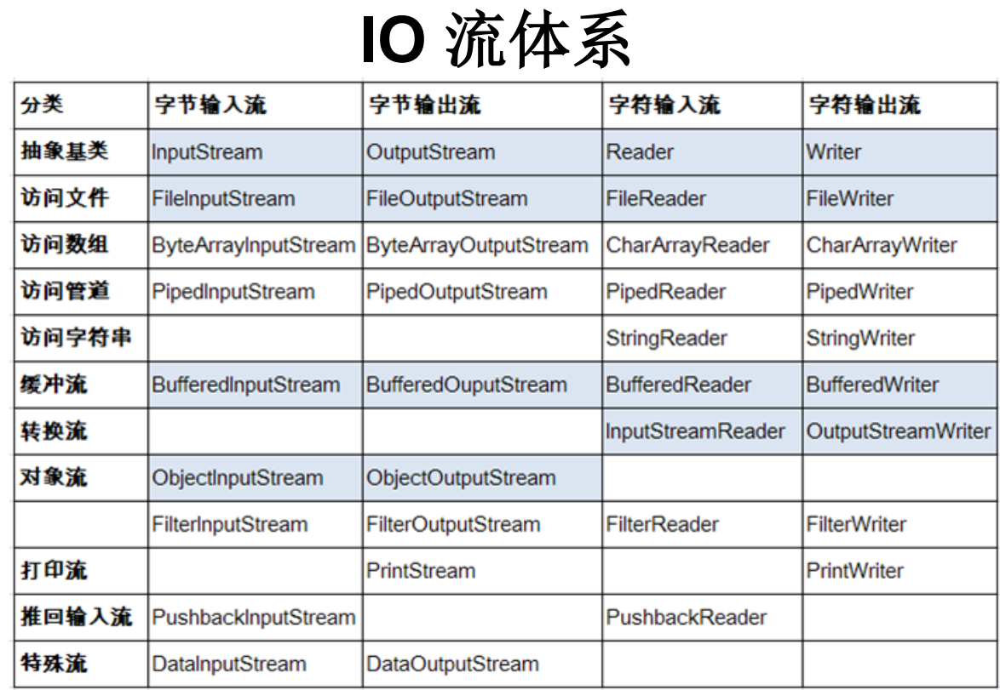

**说明：对于纯文本文件，使用字符流去处理；对于非纯文本文件，使用字节流去处理**

### 2.3 抽象基类中定义的方法

**输入流：InputStream / Reader**

-   public int read()
-   public int read(byte[] b)
-   public int read(byte[] b, int offset, int len)

说明：

-   程序中的IO资源不属于内存里的资源，垃圾回收机制无法回收该资源，所以需要显式地关闭IO资源
-   程序从文件中读取数据时，该文件在硬盘中必须存在
-   输入流中，被被读取的文件必须存在，否则报FileNotFound异常

**InputStream**

-   方法定义：

    ```Java
    public int read()
    ```

    方法说明：从输入流中读取数据的下一个字节。返回0~255范围内的int字节值。read()方法的返回值就是该从流中读取的数据，因为没有“容器”来装，所以只能返回，如果因为已经到达流末尾而没有可用的字节，则返回-1

-   方法定义：

    ```Java
    public int read(byte[] b)
    ```

    方法说明：从输入流中将最多b.length个字节的数据读入一个byte数组中。因为read(byte[] b)方法传入了一个用于数据存储的数组，所以，读入的数据会放入数组中；并且其方法的返回值表示实际读取的字节数，如果因为已经到达流末尾而没有可用的字节，则返回-1

-   方法定义：

    ```Java
    public int read(byte[] b, int offset, int len)
    ```

    方法说明：与read(byte[] b)方法相同，区别在于，存放数据是从偏置offset开始，存放指定长度len的字节数

-   方法定义：

    ```Java
    public void close() throws IOException
    ```

    方法说明：关闭此输入流，并释放与该流相关的所有系统资源

**对read()方法的说明：read()方法中应该是有一个指针的，每读取一个字节都会向下移动一次，直到遇到null**

**Reader**

```java
public int read()
```

```java
public int read(char[] b)
```

```java
public int read(char[] b, int offset, int len)
```

```java
public void close() throws IOException
```

Read的read()方法与InputStream的read()方法基本相同，不同点在于，Read的read()方法一次读取的单个字符，范围在0~65535之间；多出的部分，进行高位截取，低位保留（也该不会有这种情况）

**输出流：OutputStream / Writer**

两者的方法基本相似，区别在于，字符输出流能够输出字符串

**OutputStream**

-   public void write(int b)：将指定的字节写入此输出流。一次只能写入一个byte范围大小的数据，超出的高位将被忽略
-   public void write(byte[] b)：将b.length长度的字节从数组中写入输出流
-   public void write(byte[] b, int offset, int len)：从指定索引开始，写入len个字节到流中
-   public void flush() throws IOException：刷新此输出流，并强制写出所有缓冲字节到其指定目标
-   public void close() throws IOException：关闭此流，并释放与之相关的所有系统资源

**Writer**

-   public void write(int b)：写入单个字符，16位的数据会被写入，高于16位的数据将被截取
-   public void write(char[] c)：将字符数组写入到流中
-   public void write(char[] c, int offset, int len)：从偏置offset开始写入len个字符到流中

对于写入到流的操作，也可以直接写入字符，也可以写入字符串

-   public void write(String str)：写入一个完整的字符串
-   public void write(String[] str, int offset, int len)：写入一个字符串的一部分
-   public void flush()：刷新该流的缓冲，并立即将其写入文件中
-   public void close() throws IOException：关闭此输出流并释放与之相关的所有系统资源

**说明：对于字符流，其输入输出存在一个缓冲区，用于减少硬盘与内存的交互次数，提高效率**

### 2.4 节点流

以文件流讲解利用IO流进行数据读取写入的数据的步骤

```Java
// TODO 读取文件
// 1、创建数据节点，即数据源或数据目的地
File file = new File("hello.txt");

// 2、创建（节点）流，将数据源或数据目的地连接起来，以字节流为例
// File对象经常作为流构造器的参数
FileInputStream fis = new FileInputStream(file); 

// 3、读取数据
int a = fis.read();

// 4、关闭资源，并处理异常
fis.close();

// TODO 写入文件
// 1、创建流对象和数据存放文件
FileOutputStream fos = new FileOutputStream("hello1.txt");

// 2、将文件写入流中
fos.write(16);

// 3、关闭流资源
fos.close();
```

**说明：**

-   写入文件路径时，可以使用"\\"或者"/"或者Fiel.separator
-   在写入（将数据输出到硬盘上，输出流）一个文件时，
    -   如果使用构造器FileOutputStream(File file)，并写入目录下有同名文件时，该同名文件将被覆盖
    -   如果使用FileOutputStream(File file, boolean true)，那么会在同名文件中进行追加写入操作
-   在读取文件时，必须保证被读写的文件已经存在，否则报异常

### 2.5 缓冲流

是一种处理流，作用是提高节点流的读取速度。基本原理是提供了一个缓冲区，在数据读写时减少内存与硬盘的交互次数，进而提高效率。

**处理流是一种作用在其他流上的流**

-   缓冲字节输入流：BufferedInputStream
-   缓冲字节输出流：BufferedOutputStream
-   缓冲字符输入流：BufferedReader
-   缓冲字符输出流：BufferedWriter

**说明1**

缓冲字符输入流BufferedReader除了重载的read()方法外，还有一个readline()方法

-   public String readLine() throws IOException：一次性读入一行字符，并用字符串进行返回

缓冲字符输出流BufferedReader除了重载的write()方法以外，还有一个newLine()方法

-   public void newLine() throws IOException:向内存中写入一个换行

**说明2**

利用缓冲流进行数据读取和写入时，需要创建两个流。一个是节点流，一个是缓冲流。创建时，先创建节点流，再创建缓冲流；关闭时，先关闭缓冲流，再关闭节点流

### 2.6 转换流

也是一种处理流，其作用是将字节输入流、字节输出流转换成字符输入流、字符输出流。可以按照指定的编码或解码方式

-   字符输入转换流：InputStreamReader，将一个字节输入流转换成字符输入流
-   字符输出转换流：OutputStreamWriter，将一个字符输出流转换成字节输出流

说明：转换流是一种字符流，并且没有字节流。看其结尾部分

**构造器**

还有其他的构造器，很少用

-   InputStreamReader(FileInputStream fis)：将节点流所对应的字节流按IDEA默认的解码方式转换成字符流读进内存中的变量中
-   InputStreamReader(FileInputStream fis, String decode)：将节点流所对应的字节流按指定的编码方式转换成字符流读进内存变量中

-   OutputStreamReader(FileOutputStream fos)：将原本以字符流输出的数据按IDEA默认的编码方式转换成字节流写入到内存中
-   OutputStreamReader(FileOutputStream fos, String encode)：将原本以字符流输出的数据按指定的编码方式转换成字节流写入到内存中

**字符集**

-   ASCII：美国标准信息交换码，用一个字节的7位可以表示
-   ISO8859-1：拉丁码表。欧洲码表，用一个字节的8位表示
-   GB2312：中国的中文编码表。最多两个字节编码所有字符
-   GBK：中国的中文编码表升级，融合了更多的中文文字符号。最多两个字节编码
-   Unicode：国际标准码，融合了目前人类使用的所有字符。为每个字符分配唯一的字符码。所有的文字都用两个字节来表示。
-   UTF-8：变长的编码方式，可用1-4个字节来表示一个字符。

**说明：**

Unicode只是一个字符集，包含了全人类所有使用的字符，但其本身存在一些问题无法直接落地。而UTF-8、UTF-16、UTF-32都是其落地的具体体现

### 2.7 其他流

-   输入输出流
-   数据流
-   对象流
-   随机存取文件流

## 十三、反射

