<h1 align = "center">Linux & Shell
</h1>


# 一、Linux概述

## 1、虚拟机简介

虚拟机(英文全称：Virtual Machine)是指通过软件模拟的具有完整硬件系统功能的、运行在一个完全隔离环境中的完整计算机系统，目前流行的虚拟机软件有VMware(VMWare ACE)、Virtual Box和Virtual PC，它们都能在Windows系统上虚拟出多个计算机，每个虚拟计算机可以独立运行，可以安装各种软件与应用等。

## 2、Linux简介

Linux是一套免费使用和自由传播的类Unix操作系统，是一个多用户、多任务、支持多线程和多CPU的操作系统。它能运行主要的UNIX工具软件、应用程序和网络协议。它支持32位和64位硬件。Linux继承了Unix以网络为核心的设计思想，是一个性能稳定的多用户网络操作系统。

简单来说，Linux是一个操作系统

## 3、Linux发行版

Linux 发行版是一个由 Linux 内核、GNU 工具、附加软件和软件包管理器组成的操作系统，它也可能包括显示服务器和桌面环境，以用作常规的桌面操作系统。这个术语之所以是 “Linux 发行版”，是因为像 Debian、Ubuntu 这样的机构“发行”了 Linux内核以及所有必要的软件及实用程序（如网络管理器、软件包管理器、桌面环境等），使其可以作为一个操作系统使用。

所以，“Linux” 是内核，而 “Linux 发行版”是操作系统。这就是为什么它们有时也被称为基于 Linux 的操作系统的原因。

## 4、虚拟机和Linux的安装

为了学习和利用操作系统，我们首先需要创建一个Linux操作系统，因此首先需要创建一个虚拟机（或者拿一台安装了Linux系统的真机）。

模拟虚拟机的软件：VMware

Linux操作系统的发行版：CentOS 7

安装过程：

​	① 先安装虚拟机

​	② 在虚拟机中划分磁盘区域，先将磁盘划分好，然后再安装Linux操作系统

## 5、虚拟机网络连接的三种方式

-   桥接方式：仿照物理主机上的网络配置，相当于在你电脑连接的局域网中多添加一台设备，虚拟机和你的电脑处于同一局域网内（同一网段），属于同级。桥接模式时，虚拟机的IP必须和主机在统一网段，且子网掩码、网关与DNS也要和主机网卡一致。
-   NAT(Network Address Transaction, NAT)：以物理机（你的电脑）作为媒介（相当于交换机）访问外部网络，虚拟机就像物理机的下级，在物理机的基础下再创建（虚拟）一个局域网。假如不在局域网内，只有一个ip，那可以采用NAT模式，在局域网中也可以使用NAT模式，不过相比于桥接模式，NAT模式更消耗性能。
-   仅主机模式(Host-Only)：虚拟主机只能访问物理机，不能访问Internet,这是一个完全隔离网络的模式，Host-only相当于使用双绞线直接连接虚拟机和物理机（最原始的网络结构）

## 6、Linux的远程连接

1、远程登录Linux服务器的原因

2、Linux与远程管理软件--XShell

​	Xshell是目前最好的远程登录到Linux操作系统的软件，流畅的速度并且完美解决了中文乱码的问题，是目前程序员首选的软件。

Xshell是一个强大的安全终端模拟软件，它支持 SSH1, SSH2, 以及 Microsoft Windows平台的TELNET 协议。

Xshell可以在Windows 面下用来访问远端不同系统下的服务器，从而比较好的达到远程控制终端的目的。

3、文件传输软件--Xftp

​	Xftp是一个用于MS Windows平台的强大的FTP和SFTP文件传输程序。Xftp能安全地在Unix/Linux和Windows PC之间传输文件。

# 二、Linux操作系统的文件与目录结构

Linux的文件系统是采用级层式的树状目录结构，在此结构中的最上层是根目录“/”，然后在此目录下再创建其他的目录。在 Linux 世界里，一切皆文件（即使是一个硬件设备，也是使用文件来标识）。深刻理解 linux 树状文件目录是非常重要的。

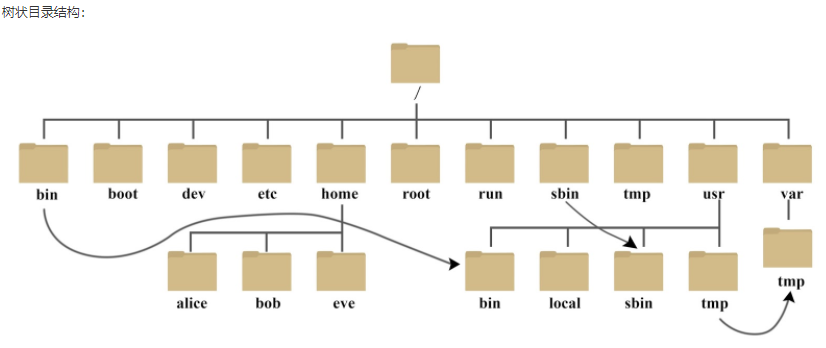

-   $\textcolor{red}{/bin}$

    -   bin 是 Binaries (二进制文件) 的缩写，该目录存放二进制可执行文件(ls，cat，mkdir等)，常用命令一般都在该文件夹下

-   /sbin

    -   s是super user的意思，该目录也是存放二进制可执行文件的目录，区别于/bin目录，/sbin存放的命令是系统管理员使用的系统管理程序

-   $\textcolor{red}{/home}$

    -   存放所有用户文件的根目录，是用户主目录的基点，比如用户user的主目录就是/home/user，可以用~user表示。在Linux中，每一个用户都有一个自己的目录，一般该目录是以用户的账号命名的

-   $\textcolor{red}{/root}$

    -   该目录是系统管理员，也称作超级权限者的用户主目录

-   /lib

    -   系统开机所需要最基本的动态连接共享库，其作用类似于Windows里的DLL文件，几乎所有的应用程序都需要用到这些共享库

-   /lost + found

    -   这个目录一般情况下是空的，当系统非法关机后，这里就存放了一些文件

-   $\textcolor{red}{/etc}$

    -   etc 是 Etcetera(等等) 的缩写，这个目录用来存放所有的系统管理所需要的配置文件和子目录

-   $\textcolor{red}{/usr}$

    -   usr 是 unix shared resources(共享资源) 的缩写，这是一个非常重要的目录，用户的很多应用程序和文件都放在这个目录下，类似于 windows 下的 program files 目录。

-   $\textcolor{red}{/boot}$

    -   这里存放的是启动 Linux 时使用的一些核心文件，包括一些连接文件以及镜像文件

-   /proc

    -   proc 是 Processes(进程) 的缩写，/proc 是一种伪文件系统（也即虚拟文件系统），存储的是当前内核运行状态的一系列特殊文件，这个目录是一个虚拟的目录，它是系统内存的映射，我们可以通过直接访问这个目录来获取系统信息。

    -   这个目录的内容不在硬盘上而是在内存里，我们也可以直接修改里面的某些文件，比如可以通过下面的命令来屏蔽主机的ping命令，使别人无法ping你的机器：

        ```shell
        echo 1 > /proc/sys/net/ipv4/icmp_echo_ignore_all
        ```

-   /srv

    -   service的缩写，该目录存放一些服务启动之后需要提取的数据

-   /sys

    -   这是 Linux2.6 内核的一个很大的变化。该目录下安装了 2.6 内核中新出现的一个文件系统 sysfs 。

        sysfs 文件系统集成了下面3种文件系统的信息：针对进程信息的 proc 文件系统、针对设备的 devfs 文件系统以及针对伪终端的 devpts 文件系统。

        该文件系统是内核设备树的一个直观反映。

        当一个内核对象被创建的时候，对应的文件和目录也在内核对象子系统中被创建。

-   /tmp

    -   tmp 是 temporary(临时) 的缩写这个目录是用来存放一些临时文件的

-   /dev

    -   dev 是 Device(设备) 的缩写, 该目录下存放的是 Linux 的外部设备，在 Linux 中访问设备的方式和访问文件的方式是相同的

-   /media(CentOS6)

    -   linux 系统会自动识别一些设备，例如U盘、光驱等等，当识别后，Linux 会把识别的设备挂载到这个目录下
    -   ==CentOS7迁移到/run/media下==

-   $\textcolor{red}{/mnt}$

    -   系统提供该目录是为了让用户临时挂载别的文件系统的，我们可以将光驱挂载在 /mnt/ 上，然后进入该目录就可以查看光驱里的内容了

-   $\textcolor{red}{/opt}$

    -   opt 是 optional(可选) 的缩写，这是给主机额外安装软件所摆放的目录。比如你安装一个ORACLE数据库则就可以放到这个目录下。默认是空的。

-   $\textcolor{red}{/var}$

    -   var 是 variable(变量) 的缩写，这个目录中存放着在不断扩充着的东西，我们习惯将那些经常被修改的目录放在这个目录下。包括各种日志文件

# 三、VI、Vim编辑器的使用

所有的Linux操作系统都自带Vi编辑器，可以用于文件编辑；Vim编辑器是Vi的升级版，它不仅兼容vi的所有指令，而且还有一些新的特性在里面。

相同的是Vi和Vim都是多模式编辑器。

Vi和Vim编辑器特点：Linux下标配的一个纯字符界面的文本编辑器，由于不是图形界面，相关的操作都要通过键盘输入命令来完成。

Vim编辑器向下兼容了Vi编辑器，因此笔记只针对Vim编辑器进行介绍

1.  启动Vim编辑器

    ```bash
    > vim 文件名
    # 如果文件存在，则打开该文件，如果参文件不存在，则会新建该文件（不是立即创建，而是在保存的时候创建）
    ```

2.  Vim编辑器的三种模式

    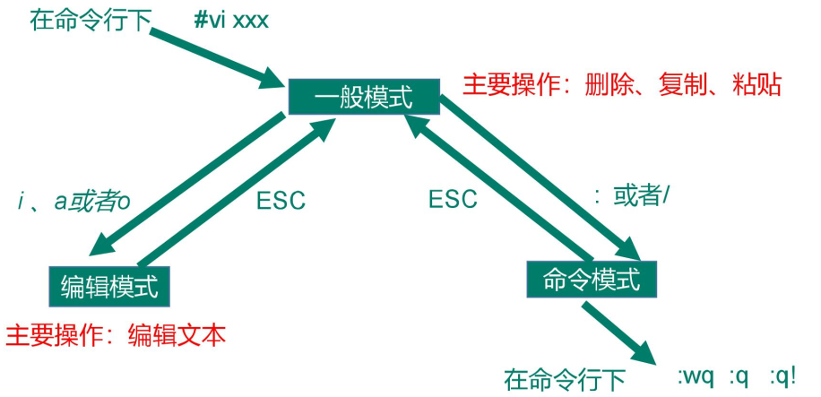

    1.  正常模式：这是默认的模式。以vim打开一个文件就直接进入一般模式了

        在这个模式中，你可以使用『上下左右』按键来移动光标，你可以使用『删除字符』或『删除整行』来处理档案内容，也可以使用『复制、贴上』来处理你的文件数据。在正常模式下可以使用快捷键

    2.  插入模式（编辑模式）：在正常或命令行模式下，按下i（insert）, I , o , O , a , A , r , R等任何一个字母之后才会进入编辑模式， 一般来说按 i 即可

        -   i：在当前光标所在位置插入随后输入的文本，光标后的文本相应向后移动
        -   I：在光标所在行的行首插入随后输入的文本，行首是改行的第一个非空白字符，相当于光标移动到首行执行
        -   o：在光标所在行的下面插入新的一行，光标停在空行行首，等待输入的文本
        -   O：在光标所在行的上面插入新的一行，光标停在空行的行首，等待输入的文本
        -   a：在当前光标所在位置之后插入随后输入的文本
        -   A：在光标所在行的行尾插入随后输入的文本，相当于光标移动到行尾再执行a命令

    3.  命令行模式：在正常模式下，输入':'进入命令行模式，在这个模式当中，可以提供你相关指令，完成读取、存盘、替换、离开 vim 、显示行号等的操作

        ​	相关命令：w --> write    q --> quit

        -   w：写入
        -   q：退出（如果文件未保存，则不允许退出）
        -   q!：不保存退出（强行退出）
        -   wq：保存并退出
        -   x：保存并退出

3.  Vim编辑器的使用

    1.  设置行号：

        ```bash
        # 命令行模式
        > set nu 		# 设置行号
        > set nonu		# 取消设置行号
        ```

    2.  光标移动：

        ```bash
        # 正常模式下，逐个字符移动光标
        # h：向左移动
        # l：向右移动
        # j：向下移动
        # k：向上移动
        ```

        ```bash
        # 正常模式下，以单词为单位移动光标
        # w：移动到下一个单词的词首
        # e：跳至当前或下一个单词的词尾
        # b：跳至当前或上一个单词的词首
        ```

        ```bash
        # 正常模式下，行内跳转
        # 0：跳至绝对行首
        # $：跳至绝对行尾
        # ^：跳至行首第一个非空白字符处
        ```

        ```bash
        # 正常模式下，文档内跳转
        > G		# 跳转到文档尾行行首
        > ~G	# 跳转到指定的第~行的行首
        > gg 	# 跳转到文档首行行首
        ```

    3.  复制粘贴：

        ```bash
        # 正常模式下
        > yy 	# 复制当前行
        > ~yy	# 复制从当前行向下的~行
        > y$	# 复制当前行，从光标开始到行尾的内容
        > y^	# 复制当前行，从光标开始到行首非空白字符的内容
        > yw	# 复制当前单词及单词后的1个空格
        > p		# 对于整行复制，在光标的下一行粘贴一次复制的内容；对于行部分内容复制，在光标后面粘贴复制内容
        > ~p	# 在光标的下一行粘贴~此复制的内容
        ```

    4.  单字符操作：剪切/删除，替换

        ```bash
        # 正常模式下
        # 剪切
        > x		# 后向剪切字符，即多次使用该命令，是操作一行中后面的字符
        > X		# 前向前且字符，即多次使用该命令，是操作一行中前面的字符
        > p		# 粘贴剪切的字符
        
        # 替换
        > r		# 替换一个字符，按下r后，输入字符
        > R 	# 根据后续输入的字符内容，替换多个字符
        
        # 命令行模式
        :%s/old/new/g	# 用新的内容替换旧的内容。/g表示全局替换
        ```

    5.  删除：

        ```bash
        # 正常模式下
        > dd 	# 删除当前行
        > d$	# 删除从光标开始到行尾的内容
        > d^	# 删除从光标开始到行首的内容
        > dw	# 删除从光标开始到当前单词结束的所有字符，包括单词后的空格
        > ~dd	# 删除从当前行向下的~行
        ```

    6.  撤回操作：Windows的ctrl + z

        ```bash
        # 正常模式
        > u		# 撤销最近的一次操作
        > ~u	# 撤销最近的~此操作
        ```

    7.  文档内查找：

        ```bash
        # 命令行模式
        > /被查找的关键字
        # Enter --> 查找
        # n --> 查找下一个
        ```

    8.  取消高亮：

        ```bash
        # 命令模式
        :noh 	# 取消高亮
        ```


# 四、Linux系统管理

计算机中，一个正在执行的程序或命令，被叫做"进程"(process)。

启动之后一直存在、常驻内存的进程，一般被称作"服务"(service)。

## 1、CentOS 6版本的service服务管理

**基本语法：service 服务名 start|stop|restart|status**

服务文件所在位置：在/etc/init.d目录是用于存放CentOS 6服务文件的目录。在当前的CentOS 7版本中，发现，该目录下只有两个文件，说明在CentOS 7版本中只保留了CentOS 6的两个服务，其余的服务在CentOS 7中进行了调整或者兼容。

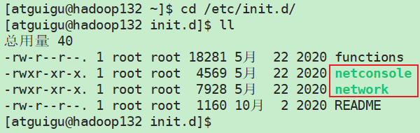

Linux中，服务开机自启动配置：

```bash
# 常用命令
chkconfig			  	   # 查看所有服务的自启配置
chkconfig 服务名 off		 # 关掉指定服务的自动启动
chkconfig 服务名 on		 # 开启指定服务的自动启动
chkconfig [服务名] --list   # 查看指定服务开机启动状态
```

值得说明的是，chkconfig是CentOS 6的服务自启配置命令，只对于SysV服务有效，对于CentOS 7的原生systemd服务无效，要想配置systemd服务，需要使用systemctl命令。

## 2、CentOS 7版本的service服务管理

**基本语法：systemctl start|stop|status|restart 服务名**

CentOS 7版本中，服务文件所在位置为：/usr/lib/systemd/system

CentOS 7版本中，设置服务开机自启动：

```bash
# 常用命令
systemctl list-unit-files		# 查看所有服务开启启动状态
systemctl disable 服务名		  # 关掉指定服务的开机自启动
systemctl enable 服务名		  # 开启指定服务的开机自启动
```

## 3、Linux操作系统的运行级别

```txt
00  系统的关机级别                 poweroff.target   # init 0 -- 进入到关机模式
01  系统的单用户模式               rescue.target     # 用于修复系统 或 重置密码信息  没有网络
02  系统的多用户模式               multi-user.target # 没有网络
03  系统的多用户模式               multi-user.target # 正常系统运行级别 多用户模式级别  有网络
04  预留级别                      multi-user.target
05  图形化界面级别                 graphical.target
06  系统的重启级别                 reboot.target
```

```bash
# 查看当前系统运行级别
runlevel
# 切换系统当前级别
init levelNum
```

## 4、Linux操作系统的关机与重启

```bash
# 常用命令
sync			# 将数据由内存中同步到硬盘
halt			# 停机，关闭系统，但不断电
poweroff		# 关机，断电
reboot			# 重启，相当于shutdown -r now
```

```bash
# shutdown命令
# 基本语法格式
shutdown [选项] 参数
# 选项
	# -h 关机后停机
	# -r 重新启动
# 参数
	# now 立刻执行操作
	# 时间 时间可以以分钟为单位进行指定，也可以指定具体的时刻。用于进行定时设置。参数的默认值是1分钟
```

# 五、Linux常用基本命令

shell可以看作是一个命令解释器，为我们提供了交互式的文本控制台界面。我们可以通过终端控制台来输入命令，由shell进行解释，并最终交给内核执行。

**Linux中的命令有很多，其中一部分命令是系统基础功能命令，是直接内嵌在shell中，会随着系统加载启动而加载，这部分命令一般被称为内置命令，例如：cd、exit。相应的,其他命令则被称为外部命令，例如：ls**

## 1、帮助命令

### 1.1 man帮助命令

**语法格式：**

man [命令或配置文件]

**功能：**

获得帮助信息

**显示说明：**

-   NAME：命令的名称和单行描述
-   SYNOPSIS：怎样使用命令
-   DESCRIPTION：命令功能的深入探讨
-   EXAMPLES：命令的使用案例
-   SEE ALSO：相关主题（通常是手册页）

### 1.2 help帮助命令

**语法格式：**

help 内置命令

**功能：**

获得shell内置命令的帮助信息

**使用help获取非内置命令的帮助信息**

**语法格式：**

命令 --help

**功能：**

获取命令的帮助信息

### 1.3 type查看命令类型命令

**语法格式：**

type 命令

**功能：**

获取命令的类型信息

>   Linux常用快捷键
>
>   ctrl + l	清屏，向上滚动
>
>   reset	  清屏，重置终端

## 2、文件操作命令（1）

### 2.1 pwd，显示当前工作目录的绝对路径

**pwd：print working directory**

**语法格式：**

pwd

**功能：**

显示当前工作目录的绝对路径

### 2.2 ls，列出目录内容

**ls：list**

**语法格式：**

ls [选项] [目录或文件]

**选项及功能：**

-   -a：显示全部文件及目录，包含隐藏文件
-   -l：列出文件及目录的详细信息

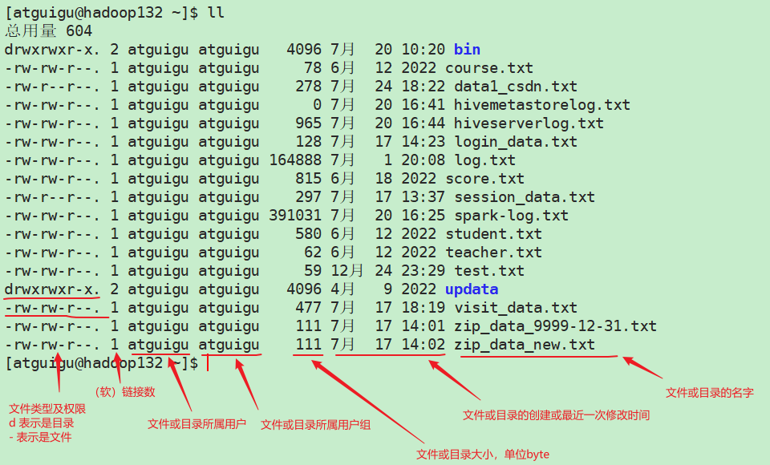

### 2.3 cd，切换目录

**cd：change directory**

**语法格式：**

cd [参数]

**参数及功能：**

-   cd 绝对路径/相对路径：切换路径
-   cd ~ / cd：回到当前用户的home目录
-   cd -：回到上一次所在的目录
-   cd ..：回到当前目录的上一级目录
-   cd -P 路径：跳转到实际物理路径，而非软连接路径

### 2.4 mkdir，创建一个新的目录

**mkdir，make directory**

**语法格式：**

mkdir [选项] 目录路径及目录名

**选项及功能：**

-   -p 创建目录，当指定的目录不存在时，一并创建出来

**说明：mkdir默认只能创建一级目录**

**rmdir，删除一个空的目录**

### 2.5 touch，创建空文件

**语法格式：**

touch 文件目录及文件名

**功能：直接在指定的目录下创建一个空的文件**

### 2.6 cp，复制文件或目录

**cp：copy**

**语法格式：**

cp [选项] 源文件或目录 目标文件或目录

**选项及功能：**

-   -r：递归复制整个文件夹

### 2.7 rm，删除文件或目录

**rm：remove**

**语法格式：**

rm [选项] 文件或目录

**选项及功能：**

-   -r：递归删除目录中的所有内容
-   -f：强制执行删除操作，屏蔽删除文件或目录的警告
-   -v：显示之令的详细执行过程

### 2.8 mv，移动或重命名文件与目录

**mv：move**

**语法格式：**

mv 源文件或目录 目标文件或目录

## 3、文件操作命令（2）

### 3.1 cat，一次性查看文件全部内容

**cat：catch**

**语法格式：**

cat [选项] 文件名

**选项及功能：**

-   -n：查看文件内容并显示行号

### 3.2 more，分屏查看文件问内容

more命令是一个基于VI编辑器的文本过滤器，它以全屏幕的方式按页显示文本文件内容。

**语法格式：**

more 文件名

**快捷键说明：**

```txt
space		向下翻一页
enter		向下翻一行
q			退出more，不再显示该文件内容
ctrl + F	向下滚动一屏
ctrl + B	返回上一屏
=			输出当前行的行号
:f			输出文件名和当前行的行号
```

### 3.3 less，分屏显示文件内容

less之令用来分屏查看文件内容，它的功能与more类似，但是比more之令更加强大，支持各种终端显示。less指令在显示文件内容时，并不是一次将整个文件加载之后才显示，而是根据显示需要，加载内容，对于显示大型文件具有较高的效率。

**语法格式：**

less 文件名

**快捷键说明：**

```txt
space		向下翻一页
pagedown	向下翻一页
pageup		向上翻一页
/被查找关键字	向下搜索关键字。n：向下查找；N：向上查找
?被查找关键字	向上搜索关键字。n：向上查找；N：向下查找
=			显示当前行号以及文件其他相关信息
G			跳转文件的末尾
g			跳转到文件的开头
q			退出less
```

### 3.4 echo，控制台打印

**语法格式：**

echo [选项] 内容

**选项及功能：**

-   -e：支持反斜线（\）控制的转义字符

### 3.5 head，显示文件头部内容

head用于从头输出文件的内容，默认情况下，输出文件前10行内容

**基本语法：**

head 文件名	# 查看文件前10行的内容

head -n 5 文件名	# 查看文件前5行内容

### 3.6 tail，显示文件尾部内容

tail用于从尾部输出文件的内容，默认情况下，输出文件后10行的内容

**语法格式：**

tail 文件名	# 查看文件后10行的内容

tail -n 5 文件名	# 查看文件后5行的内容

tail -f 文件名	# 显示文件最新追加的内容，监视文件变化

### 3.7 输出重定向

```bash
# 输出重定向，>
# 将输出内容重定向到指定的文件中，覆盖写入
ls -al > abc.txt	# 将ls -al命令的输出内容，覆盖写入到abc.txt文件中

# 输出冲定向，追加，>>
# 将输出内容重定向到指定文件中，追加写入
ls -al >> abc.txt	# 将ls -al命令的输出内容，追加写入到abc.txt文件中
```

### 3.8 软连接

### 3.9 history，查看历史执行命令

```bash
# history命令的使用
history		# 查看历史所有的执行过的命令
history 30	# 查看最近30个已执行的命令
history -c	# 删除所有的命令执行记录
!历史命令编号	# 执行该历史命令
```

## 4、时间类命令

### 4.1 date命令

**使用date获取当前时间**

```bash
# 使用date获取当前时间
date			# 显示当前时间
date +%Y		# 显示当前4位年份
date +%y		# 显示当前2位年份
date +%M		# 显示当前的分钟数
date +%m		# 显示当前的月份
date +%D		# 显示月、日、2位年，例如，12/25/22
date +%d		# 显示当天是一个月的第几天
date +%H		# 显示当前的小时，24小时制
date +%h		# 显示当前的月份，例如，12月
date +%S		# 显示当前的秒数
date +%s		# 显示当前时间的时间戳，单位：秒
date "+%Y-%m-%d %H:%M:%S" 	# 显示年月日时分秒
```

**使用date获取非当前时间**

```bash
# 使用date获取非当前时间
date -d '1 days ago' 	# 显示前一天时间
date -d '-1 days ago' 	# 显示当前天的后一天时间
```

**使用date设置系统时间**

```bash
# 使用date设置系统时间
date -s 字符串时间	# 将系统时间设置为指定时间
# 使用ntpdate自动更新时间
ntpdate ip地址	# 同步指定服务器（ip）的时间
```

### 4.2 cal命令

**cal：calendar**

**语法格式：**

cal [选项]

**选项及功能：**

-   具体的某一年	显示这一年的日历

## 5、用户管理命令

Linux系统是一个多用户多任务的操作系统，任何一个要使用系统资源的用户，都必须首先向系统管理员申请一个账号，然后以这个账号的身份进入系统。

### 1、用户相关管理命令

#### 1.1 添加用户

```bash
# 添加用户，并指定用户组组名和家目录
useradd [-g groupId/groupName] [-d homeDirector] userName
# 不显式指明用户组组名时，用户组组名即为用户名；不显式指明家目录时，以/home/userName作为家目录
```

#### 1.2 修改用户密码

```bash
# 修改用户密码
passwd userName
```

#### 1.3 删除用户

```bash
# 删除用户
userdel [-r] userName
# 选项-r表示删除用户的同时，删除家目录。一般情况下不删除家目录
```

#### 1.4 查询用户信息

```bash
# 查询用户信息
id userName
# 当用户存在时，展示用户id，用户所属组id，用户所属组名称
# 当用户不存在时，展示无此用户
```

#### 1.5 切换用户

```bash
# 切换用户
su userName
# 从权限较低的用户切换到权限高的用户，需要输入密码
# 从权限高的用户切换到权限低的用户，不需要输入密码
# 当su没有带用户名，那么默认切换到root用户

exit
# 返回原来的用户，无视权限
```

#### 1.6 查看当前登录的用户

```bash
# 查看当前登录的用户
whoami # 显示自身用户名称
who am i # 显示登录用户的用户名以及登录时间
```

#### 1.7 修改用户所在用户组

```bash
# 修改用户所在用户组
usermod -g newGroupName uesrName
```


### 2、用户组相关管理命令

Linux系统中的用户组就是具有相同特性的用户的集合。

值得注意的时用户的角色时通过UID和GID识别的，特别时UID，在运维工作中，一个UID是唯一表示一个系统用户的账号。

**用户分类：**

-   超级用户root（UID = 0）:默认是root用户，其UID和GID均为0。在每台unix/linux操作系统中都是唯一且真实存在的，通过它可以登录系统，可以操作系统中任何文件和命令。拥有最高的管理权限。在生产环境，一般禁止root账号远程登录SSH连接服务器，以加强系统安全。
-   程序用户（UID = 1~499）:与真实用户区分开来，这类用户的最大特点是安装系统后默认就会存在的，且默认情况不能登录系统，它们是系统正常运行必不可少的，他们的存在主要是方便系统管理，满足相应的系统进程都文件属主的要求。例如系统默认的bin、adm、nodoby、mail用户等。
-   普通用户（1000~65535）:这类用户一般是由具备系统管理员root的权限的运维人员添加的。

==安装Linux操作系统的过程中，如果创建了用户，该用户会直接被添加到wheel用户组中，作为管理员用户。==

用户与用户组的关系：

-   一对一：即一个用户可以存在一个组中，也可以是组中的唯一成员。比如，root。
-   一对多：即一个用户可以存在多个组中，这个用户就具有这些组。
-   多对一：即多个用户可以存在一个组中，这些用户具有该组的共同权限。
-   多对多：即多用户可以存在于多个组中。并且几个用户可以归属相同的组；其实多对多的关系是前面三条的扩展。

**用户组管理相关命令**

-   添加用户组：groupadd groupName
-   删除用户组：groupdel groupName
-   修改组信息：groupmod -n newGroupName oldGroupName

### 3、用户及用户组的相关配置文件

Linux系统的账户文件主要有：/etc/passwd、/etc/shadow、/etc/group、/etc/gshadow四个文件

**用户相关配置文件：**

-   /etc/passwd：用户的配置文件，保存用户账户的基本信息。每行的含义：[用户名:口令:用户标识号:组标识号:注释性描述:家目录:使用的Shell类型]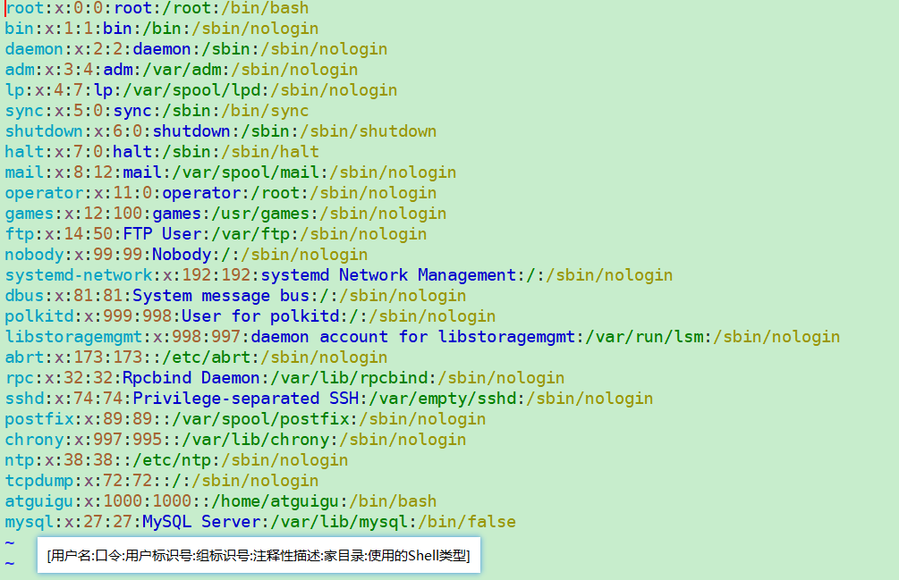
-   /etc/shadow ：用户影子口令文件。每行的含义 ：[用户名:加密口令:最后一次修改时间:最小时间间隔:最大时间间隔:警告时间:不活动时间:失效时间:保留]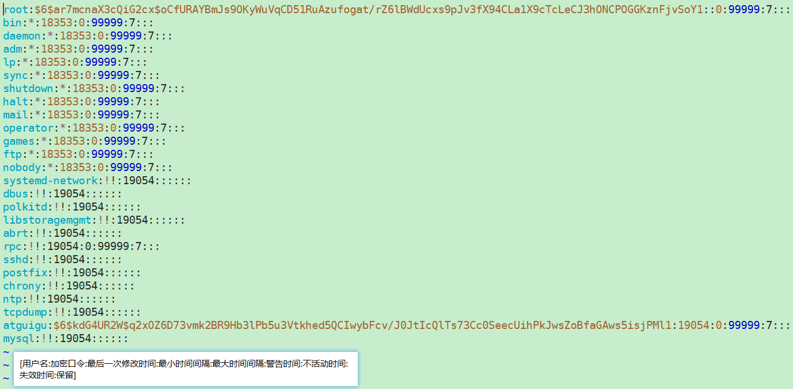

**用户组相关配置文件：**

-   /etc/group ：组(group)的配置文件，记录Linux包含的组的信息。每行含义：[组名:口令:组标识号(组账户GID号,用户组ID):组内用户列表]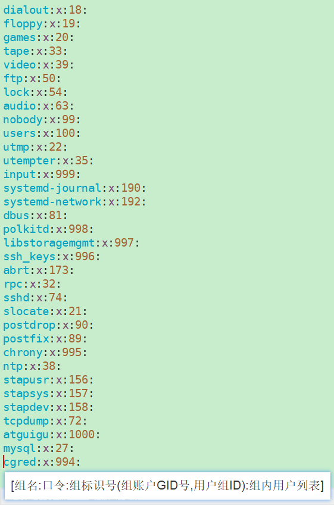
-   /etc/gshadow ：用户组影子文件。/etc/gshaow是/etc/group的加密文件，比如用户组的管理密码就是存放在这个文件

## 6、文件权限类

Linux系统是一种典型的多用户系统，不同的用户处于不同的低位，拥有不同的权限。为了保护系统的安全性，Linux系统对不同的用户访问同一文件（包括目录文件）的权限做了不同的规定。

在linux中的每个用户必须属于一个组，不能独立于组外。

在linux中每个文件都有所有者、所在组等概念。

一般文件的所有者是文件的创建者，所在组为所有者所在的组。

通过Linux指令可以查看文件的所有者，也可以修改文件的所有者；可以查看文件的所在组，也可以修改文件的所在组。

### 1、文件权限即属性说明

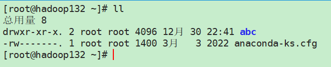

**第一部分：前10个字符**

-   第1个字符：表示文件类型。需要说明的是，Linux中，一切皆文件，目录也是一种文件。

    ```txt
    -	普通文件
    d	目录
    l	链接文件
    c	字符设备类文件，即穿行端口的接口设备，例如键盘、鼠标等
    d	块涉及文件，即存储数据以提供系统存储的接口设备，简单而言就是硬盘
    ```

-   第2 ~ 4个字符：表示文件所有者对该文件所拥有的权限

-   第5~7个字符：表示文件所在组对该文件所拥有的权限，即所属组的其他用户对该文件的权限

-   第8~10个字符：表示文件其他组对该文件所拥有的权限，即文件其他组的用户对该文件的权限

==文件权限说明==

权限有三种：r、w、x，分别表示可读、可写、可执行。r、w、x作用到文件和目录有着不同的效果。

**作用于文件：**

-   r：代表用户对该文件可读取，可查看
-   w：表示用户可以对该文件内容进行修改，但不表示可以删除该文件。删除一个文件的前提是，用户必须具有对该文件所在目录具有写的权限。
-   x：表示文件本身是可执行文件

**作用于目录：**

-   r：表示用户可以读取该目录，可以通过ls指令查看该目录内容
-   w：表示该目录可写，即用户可以在该目录内通过mkdir、rm、mv等命令在目录内创建、删除、移动文件等
-   x：表示用户可以进入该目录

文件的权限可以用数字表示：r = 4；w = 2；x = 1

**第二部分：文件信息**

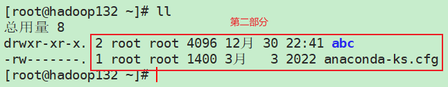

**按顺序说明：**

-   数字1、2：对于文件而言，表示该文件的硬链接数；对于目录而言，表示该目录下有多少个子目录，注意这是不包含文件
-   root  root：第一个root表示该文件的所有者，第二个root表示该文件的所在组
-   4096、1400：对于文件而言，表示该文件的大小；对于目录而言，表示目录的大小，单位是byte
-   12月 30 22：41：表示文件或目录的创建时间或最近一次的修改时间

### 2、文件权限及属性相关的命令

#### 2.1 文件权限修改

**第一种方式：利用+、-、=修改文件权限**

**说明：**

-   **u表示文件的所有者，g表示文件所属组的用户，o表示其他用户组的用户，a表示所有用户**
-   **+表示授予权限，-表示收回权限，=表示赋予用户权限**

**举例：**

```bash
chmod   u=rwx,g=rx,o=x   file/files  # 表示赋予file/files所有用户rwx，所在组用户rx，其他组用户x权限
chmod   o+w    file/files # 表示赋予其他组用户w的权限
chmod   a-x    file/files #表示收回所有用户x权限
```

**第二种方式：通过数字变更权限**

**举例：**

```bash
chmod   751  file/files # 表示赋予file/files所有用户rwx，所在组用户rx，其他组用户x权限
```

#### 2.2 文件属性修改

**修改文件、目录的所有者**

```bash
# 修改文件、目录的所有者
chown [-R] userName file/files	# 选项-R表示将文件或目录下所有文件的所有者改变

# 修改文件、目录的所在组
chgrp [-R] grpName file/files	# 选项-R表示将文件或目录下所有文件的所在组改变
```

## 7、搜索类命令

### 7.1 find命令

find命令，从指定目录向下递归地遍历各个子目录，将满足条件地文件和子目录显示在终端。

```bash
# find命令
find [搜索范围] [选项] [搜索内容]
# 说明
# 搜索范围：可以使用绝对路径，也可以使用相对路径。当不指定搜索范围时，默认搜索当前路径
# 选项：
# -name	按照指定文件的名称进行搜索，可以使用通配符'*'，'?'，使用通配符时，需要使用双引号，将搜索内容引用，以便于解析
# -user	按照文件所属的用户进行查找，查找属于当前用户的文件或目录
# -size	按照文件大小进行查找。+表示大于指定的文件大小，-表示小于指定的文件大小
# 例如，查找文件大小大于20k的文件：find -size +20k
```

### 7.2 locate命令

locate指令利用事先建立的系统中所有文件名称的locate数据库，实现快速定位给定的文件。locate指定不需要遍历整个文件系统，查询速度块。

但是locate数据库每天只会定义更新一次，因此为了保证查询结果的准确度，管理员必须定期更新locate数据库。

更新locate数据库的命令：updatedb

```bash
# locate命令
locate 目标搜索文件
```

### 7.3 grep命令以及管道符"|"

grep是一种强大的文本搜索工具，它能使用正则表达式搜索文本，并把匹配的文本所在行打印出来。

```bash
# grep命令
grep [选项] 目标搜索内容 源文件
# 选项-n用于显示匹配行以及行号
# 选项-i可以忽略字母大小写进行搜索
# |：管道符号，将符号前的命令的执行结果作为符号后的命令的执行对象
```


## 8、打包压缩类命令

### 8.1 gzip命令

gzip命令，将单个文件进行压缩，生成.gz文件，并删除源文件

```bash
# gzip命令，压缩文件
gzip fileName	# 将指定的（单个）文件压缩程.gz文件，并删除源文件

# gunzip命令，解压缩文件
gunzip fileName.gz	# 将指定的.gz压缩文件解压，并删除.gz文件
```

### 8.2 zip命令

将单个文件进行压缩，或者将多个文件进行打包后，再进行压缩，生成.zip文件

```bash
# zip命令
zip [选项] 目录/或文件列表	# 将目录进行压缩，或者将多个文件构成的文件列表打包成一个文件，随后进行压缩
# 选项：
# -r	递归压缩目录，即将指定目录下的所有文件以及子目录全部压缩
# -m	将文件压缩后，删除原始文件，相当于把文件移动到压缩文件中
# -v	显示详细的压缩过程
# -p	在压缩过程中，不显示命令的执行过程
# -#	表示压缩级别，压缩级别取值为1~9，随着压缩级别变高，压缩效率会越来越高，压缩速度会越来曼
# -u	更新压缩文件，即向压缩文件中添加新的文件

# unzip指令，将.zip文件解压
unzip [选项] .zip文件
# 选项：
# -d 路径		将解压的结果放在指定的路径下
```

### 8.3 tar命令

tar命令用于打包文件，不过通过指定参数可以将打包的文件进一步压缩，也可以对已压缩文件进行解压缩。

打包和压缩，打包是指将一大堆文件或目录变成一个总的文件；压缩则是将一个大的文件通过一些压缩算法变成一个小文件。

为什么要区分这两个概念？

这源于 Linux 中很多压缩程序只能针对一个文件进行压缩，这样当你想要压缩一大堆文件时，你得先将这一大堆文件先打成一个包（tar命令），然后再用压缩程序进行压缩（gzip bzip2命令）。

```bash
# tar命令
tar [选项] 指定打包/压缩后，文件的名称
# 选项：
# -c	产生.tar打包文件
# -v	显示打包、压缩过程的详细信息
# -f	指定压缩后的文件名
# -z	打包的同时进行压缩
# -x	解包.tar文件
# -C	解压到指定的路径
```

## 9、文件、磁盘查看类命令

### 9.1 查看文件及目录信息

-   ll：查看当前或指定路径下的文件及目录信息
-   tree：以树状结构展示当前目录或指定路径下所有文件及子目录的文件结构

### 9.2 查看磁盘占用情况

**du：disk usage**

**du用于查看文件和目录的大小（也就是磁盘占用空间）**

```bash
# du命令
du [选项] [文件/目录]	# 递归显示当前路径下所有子目录或指定目录下所有子目录的大小，包含隐藏目录
# 选项
# -h 	以人们较容易阅读的GByte，MByte，KByte等格式显示
# -a	递归显示当前路径下所有子目录以及子文件或指定目录下所有子目录和子文件的大小，包含隐藏目录和隐藏文件
# -c	显示所有的文件和子目录占用的磁盘空间后，在最后一行展示磁盘空间占用的总和
# -s	只显示磁盘空间占用的总和
# --max-depth=n	指定统计子目录的层级为第n层
```

**df：disk free**

**df用于查看磁盘空间的使用情况**

```bash
# df命令
df [选项]	# 列出文件系统的整体磁盘使用量，检查文件系统的磁盘空间占用情况
# 选项
# -h	以人们较容易阅读的GByte，MByte，KByte等格式显示
```

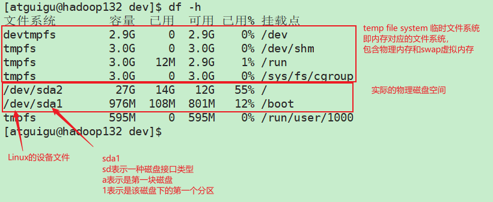

### 9.3 查看内存信息

```bash
# free命令
free -h	# 查看内存使用情况
```

### 9.4 磁盘挂载类命令

-   **lsblk：list block，查看设备挂载情况**

    -   **lsblk -f：查看详细的设备挂载情况，显示文件系统信息**

    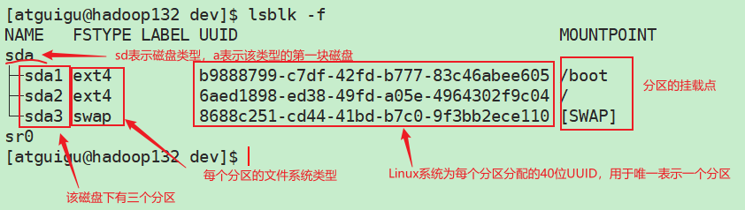

-   **mount/umount：挂载/卸载**

-   **fdisk：对磁盘进行分区操作**

-   **mkfs：为分区配置文件系统**

## 10、进程管理类命令

进程是正在执行的一个程序或命令，每一个进程都是一个运行的实体，都有自己的地址空间，并占用一定的系统资源。

无论是Windows操作系统还是Linux操作系统，进程都可以分为前台进程和后台进程，前台进程能在终端进行显示和操作，后台进程一般是系统进程，用于启动其他进程的进程，所以，后台进程即系统进程，也被称作守护进程。

### 1、ps，查看当前系统进程状态

**ps：process status**

**语法格式：ps [选项]，查看当前用户调用的进程，以及与当前终端控制台相关的进程**

-   **a：列出所有用户的前台进程**
-   **x：列出当前用户的所有进程，包含前台进程和后台进程**
-   **u：以用户友好的显示风格，展示结果**
-   **-e：列出所有用户的所有前台进程和后台进程**
-   **-u：列出指定用户的所有前台和后台进程**
-   **-f：显示完整格式的进程列表**

**说明：选项a、x、u为BSD风格的选项，-e、-u、-f为标准的UNIX风格注释**

**常用的组合：**

-   **ps aux：查看系统中所有进程**

    -   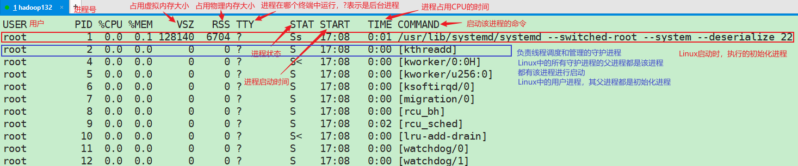

    -   USER：该进程是由哪个用户启动的

    -   PID：该进程的ID号

    -   %CPU：该进程占用CPU资源的百分比，占用越高，进程越耗费资源

    -   %MEM：该进程占用物理内存的百分比，占用越高，进程越耗费资源

    -   VSZ：该进程占用的虚拟内存大小，单位KB

    -   RSS：该进程占用物理内存的大小，单位KB

        **说明：在Linux中，对进程占用内存有一套完整的管理算法。对于不活跃的进程会从物理内存中移动到虚拟内存中**

    -   TTY：该进程是在哪个终端中运行的。对于CentOS来说，tty1是图形化终端，tty2 ~ tty6是本地的字符界面终端（黑窗口），pts/0~255代表虚拟终端（远程登录窗口，如XShell）

    -   STAT：进程状态。常见的状态有：R：运行状态；S：睡眠状态；T：暂停状态；Z：僵尸状态；s：表示该进程包含子进程；l：表示该进程是多线程进程；+：表示是前台进程；<：表示进程具有高的优先级；N：表示进程的优先级较低

    -   START：该进程的启动时间

    -   TIME：该进程占用CPU的时长

    -   COMMAND：产生该进程的命令

-   **ps -ef：查看系统中所有进程，该命令能展示父子进程之间的关系**

    -   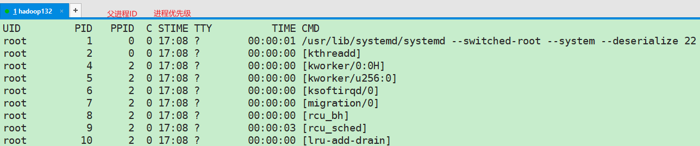
    -   PPID：父进程ID
    -   C：CPU用于计算执行的优先级因子，数值越大，表明进程是CPU密集型运算，执行优先级会降低；数值越小，表明进程是I/O密集型运算，执行优先级会提高

### 2、kill，终止系统当前的进程

**kill命令**

-   **kill [选项] 进程号：通过进程号关闭进程。选项-9表示强制终止进程**
-   **killall 进程名称：通过进程名终止进程，也支持通配符**

### 3、pstree，查看进程树

**语法格式：**

**pstree [选项]**

**选项及功能：**

-   **-p：显示进程的PID**
-   **-u：显示进程的所属用户**

### 4、top，实时监控系统进程状态

**语法格式：**

**top [选项]**

**选项及功能：**

-   **-d #：指定top命令每隔指定秒数进行一次更新。默认情况下，top命令每隔3秒会执行一次**
-   **-i：使top不显式任何闲置或僵死进程。限制或僵死进程是指，在上次top命令执行到这次top命令执行的时间间隔中，没有活跃的进程**
-   **-p：通过指定进程PID来监控指定的进程状态**

**top交互界面的操作：**

-   **P：以CPU使用率进行排序，默认以CPU使用率进行排序**
-   **M：以内存的使用率进行排序**
-   **N：以PID进行排序**
-   **q：退出top命令**

## 11、netstat，查看网络状态和端口占用信息

**语法格式：**

**netstat [选项]**

**选项及功能：**

-   **-a：显示所有正在监听和未监听的套接字**
-   **-n：拒绝显示别名，能显示数字的全部转化成数字**
-   **-l：仅列出监听的服务状态**
-   **-p：显示端口由哪个进程占用**

## 12、crontab，系统定时任务

# 六、Linux包管理

## 1、RPM包管理工具

RPM（RedHat Package Manager）.ReaHat软件包管理工具，类似Windows操作系统中的setup.exe，是Linux操作系统里面的打包安装工具，它虽然是RedHat的表示，但理念是通用的。

RPM包的名称格式：

Apache-1.3.23-11.i386.rpm 

-   "Apache"：软件名称
-   "1.3.23-11"软件版本号，主版本和次版本
-   "i386"是软件所运行的硬件平台，Intel32未处理器的同城
-   "rpm"文件扩展名，代表RPM包

### 1.1RPM常用命令

```bash
# RPM常用命令
# 查询软件安装信息
rpm -qa				# 查询已安装的所有rpm软件包
rpm -qi	RPM软件名称	# 查询指定软件的详细安装信息

# 卸载软件
rpm -e RPM软件包			# 卸载软件
rpm -e -nodeps RPM软件包	# 无视其他软件对该软件包的依赖关系，强制卸载软件

# 安装软件
rpm -ivh RPM软件包全名	# 安装软件
# -q	# query，查询
# -i	# install，安装；information，信息。如果该选项在-q选项后面，表示软件包的详细信息；如果该选项在-q选项前面，那么该选项表示安装
# -v	# --verbose，显示安装过程的详细信息
# -h	# --hash，显示安装的进度条
# --nodeps	# 安装前不检查依赖
```

## 2、YUM包管理工具

YUM（Yellow dog Updater, Modified）是一个在Fedora和RedHat以及CentOS中的Shell前端软件包管理器。基于RPM包管理，能够从指定的服务器自动下载RPM包并且安装，可以自动处理依赖性关系，并且一次安装所有依赖的软件包，无序繁琐地一次次下载，安装。

### 2.1 YUM的常用命令

**语法格式：**

**yum [y] [参数]**

**选项说明：**

**-y：对所有提问都回答“yes”**

**参数说明：**

-   **install：安装RPM软件包**
-   **update：更新RPM软件包**
-   **check-update：检查是否由可用的更新RPM软件包**
-   **remove：删除指定的RPM软件包**
-   **list：显示软件包信息**
-   **clean：清理过期的缓存**
-   **deplist：显示yum软件包的所有依赖关系**

# 七、Shell编程

Shell是一个命令行解释器，它接收应用程序或 用户命令，然后调用操作系统内核，使CPU执行相应的命令。

Shell是一个功能相当强大编程语言，易编写、易调试、灵活性强。

Linux操作系统提供的Shell解析器：

​				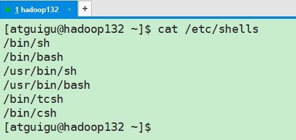

CentOS默认的解析器是bash，sh是bash的软连接。

## 1、Shell脚本的执行方式

**==脚本格式：==**

**Shell脚本以#!/bin/bash开头，用以指定脚本解析器。CentOS默认的脚本解析器为bash。**

**创建脚本，及执行脚本：**

```bash
# 创建脚本文件，Shell脚本默认以.sh为后缀
vim hello.sh

#!/bin/bash
echo hello,world

# 执行脚本
# 方式一：使用bash命令或sh命令，后跟脚本的相对或绝对路径，这种方式执行脚本不需要脚本具有x权限
bash hello.sh
sh hello.sh

# 方式二：直接使用脚本的绝对路径或相对路径执行脚本，这种方式执行脚本需要脚本具有x权限
hello.sh

# 方式三：使用source命令或.命令执行脚本
source hello.sh
. hello.sh
```

**三种脚本执行方式的区别：**

前两种方式都是在当前Shell中打开一个子Shell来执行脚本内容，当脚本内容结束，则关闭子Shell，回到父Shell中。

第三种方式，可以是脚本内容在当前Shell中执行，无需打开子Shell。

开子Shell与不开Shell的区别在于，环境变量的继承关系：除了全局变量外，子Shell无法获取父系统中的局部变量。此外子Shell中申明的变量（无论是否是全局变量还是局部变量）、修改父Shell中的变量，都对父Shell无效。

## 2、变量

### 2.1 概述

**变量的分类：**

-   

**变量的相关命令：**

-   env / printenv：查看系统当前用户所有的全局环境变量
-   set：查看系统定义的所有变量
-   unset：删除指定的变量或函数

**常用系统变量：**

-   PAHT：指定命令的搜索路径
-   HOME：指定用户的主工作目录，即用户登录到Linux系统中时，默认的目录
-   HOSTNAME：当前主机的名称，许多应用程序如果要用到主机名的话，通常是从这个环境变量中来获取的
-   SHELL：当前用户使用的是那种Shell
-   USER：当前用户

### 2.2 用户自定义变量

-   定义变量：

    变量名=变量值

    **需要注意的是，等于号前后不能有空格**

-   撤销变量：

    unset 变量名

-   声明静态变量：

    readonly 变量名=变量值

    **这类变量不能unset**

-   变量定义规则：

    -   变量名称可以由字母、数字和下划线组成，但是不能以数字开头，环境变量建议大写
    -   **等号两侧不能有空格**
    -   在bash中，变量默认类型都是字符串类型，无法直接进行数值运算
    -   变量的值如果有空格，需要使用双引号或单引号括起来。==**使用单引号，bash不会解析引号内的变量；使用双引号，bash会解析引号内的变量**==

-   使用export将局部变量提升为全局变量，将用户变量提升为系统变量

**变量使用示例**

```shell
# 声明用户自定义变量
a=3

# 修改变量
a=5

# 使用变量
echo $a

# 撤销变量
unset a

# 声明静态变量，只读变量
readonly b=10

# 使用''或""声明变量
str1="hello, world"
str2='hello, shell'

# 提升变量的作用域
export str1
```

### 2.3 特殊变量

-   \$n：n为数字，\$0表示当前脚本（以绝对路径表示）；\$1 ~ \$9表示第一到第九个参数，十以上的参数需要用{}，例如\${10}。
-   \$#：代表输入参数的个数，常用于循环，判断参数的个数的个数是否正确，以及加强脚本的健壮性。
-   \$*与\$@
    -   \$*：表示命令行中的所有参数，\$\*把所有的参数当作一个整体
    -   \$@：表示命令行的所有参数，\$@把所有参数分开看待，类似于把命令行中的参数包装为一个数组
    -   **==当\$\*和\$@在使用的时候，没有被双引号引用起来的时候，这两个特殊变量的使用没有任何差异，都是将输入参数一个一个进行处理；当\$\*和\$@在使用的时候被双引号引用起来，那么\$\*会将所有参数看作是一个整体，而\$@会将所有参数一个个使用==**
-   \$?：该命令执行时，最近一次执行的命令的返回状态，如果这个变量的值为0，那么表示最近一次执行的命令正确执行；如果这个值不为0，那么说明上个命令执行不正确

## 3、表达式与运算符

### 3.1 运算表达式

-   **\$((运算表达式))或者\$[运算表达式]**

    -   **\$((运算表达式))与\$[运算表达式]的区别：**

        \$((运算表达式))，运算表达式中能够使用==、!=、<、<=、>、>=等比较运算符

        \$[运算表达式]，运算表达式中不能使用==、!=、<、<=、>、>=这类比较运算符，只能使用-eq、-nq、-lt、-le、-gt、-ge等表达式

-   **expr 运算表达式**

    -   **使用\$((运算表达式))或\$[运算表达式]，与使用expr 运算表达式的区别：**

        -   前者的运算表达式中，变量与运算符之间有无空格都可以；后者的运算表达式中必须使用空格隔开，相当于变量和运算符都是expr命令的参数

        -   对于运算结果的输出，前者需要使用echo命令，后者不需要echo命令，后者若使用echo命令，那么将按照字符串进行输出

        -   expr命令不适合带括号的计算，因为需要使用着重号``来充当小括号，或者使用\$()来获取括号内表达式的计算结果

**使用案例**

```shell
# 计算算式(3 + 4) * 5的值
# 计算算式的值，并直接输出到控制台上
# 方式一：
echo $(((3 + 4)* 5))
echo $[(3+4) * 5]

# 方式二：expr命令
expr `expr 3 + 4` \* 5
expr $(expr 3 + 4) \* 5

# 计算算式的值，并赋给一个变量
a=$(((3 + 4) * 5))
b=$[(3 + 4) * 5]
c=$(expr `expr 3 + 4` \* 5)
```

### 3.2 运算符

-   算术运算符：
    -   加减乘除：+、-、\\*、/、%
    -   幂运算：**
    -   自增、自减：++、--。可前置可后置
-   比较运算符：Shell的比较运算符与Java中的比较运算符有很大的不同，在下一节“条件判断”中进行介绍
-   逻辑运算符：与Java相同
    -   取反、或、与：!、||、&&

**需要说明的是，Shell中，0表示true，非0表示false**

## 4、条件判断

对某个条件进行判断的方式有两种：

-   使用test命令进行条件判断：

    ```shell
    test condition
    ```

-   使用[]进行条件判断：

    ```shell
    [ condition ]
    ```

    **使用[]进行条件判断的说明：**

    -   **condition前后都要有空格**
    -   **当condition为空时，返回结果是false；当condition不为空，并且不是比较语句时，返回结果为true，例如[ hello ]，返回结果为true；当condition不为空，并且是比较语句时，根据比较结果返回对应结果**

**Shell中，各类数据类型的比较**

-   **字符串之间的比较**
    -   **=：用于判断两个字符串是否相同，相同返回true，不相同返回false**
    -   **!=：用于判断两个字符串是否不同，如果不同返回true，如果相同返回false**
-   **数值之间的比较**
    -   **-eq：equal，相等判断**
    -   **-nq：not equal，不相等判断**
    -   **-lt：less than，小于判断**
    -   **-le：less equal，小于等于判断**
    -   **-gt：greater than，大于判断**
    -   **-ge：greater equal，大于等于判断**
-   **文件权限的判断**
    -   **-r：判断指定文件是否具有读（read）的权限**
    -   **-w：判断指定文件是否具有写（write）的权限**
    -   **-x：判断指定的文件是否具有执行（execute）的权限**
-   **文件类型的判断**
    -   **-e：判断文件是否存在（existence）**
    -   **-f：判断文件是否存在并且是一个常规的文件（file）**
    -   **-d：判断文件是否存在并且是一个目录（directory）**

## 5、流程控制

### 5.1 if条件判断

**基本语法格式**

```shell
# if条件判断，基本语法格式
# 单分支if条件判断，有两种写法
# 第一种写法
if [ condition ]; then
	echo "程序逻辑"
fi ;

# 第二中写法
if [ condition ]
then
	echo "程序逻辑"
fi ;

# 双分支if-else条件判断
if [ condition ]
then
	echo "程序逻辑1"
else
	echo "程序逻辑2"
fi ;

# 多分支if-elif-...条件判断
if [ condition1 ]
then
	echo "程序逻辑1"
elif [ condition2 ]
	echo "程序逻辑2"
elif [ condition3 ]
	echo "程序逻辑3"
fi ;
```

**说明：**

-   **[ condition ]，括号和条件判断表达式之间必须要有空格，并且条件表达式之间也必须有空格**

-   **fi后面有一个空格**

-   **当条件表达式由多个条件判断构成时，有两种写法**

    ```shell
    # 两个条件判断构成的条件表达式
    # 写法一：
    if [ condition1 ] && [ condition2 ]
    # 写法二：
    if [condition1 -a condition2 ]
    # 选项-a表示逻辑与，即and
    # 选项-o表示逻辑或，即or
    ```

    **编写脚本，判断是哪个用户，并进行相应的判断**

    ```shell
    #!/bin/bash
    # 判断是不是java用户，如果是，那么看看它的属性是什么
    if [ "$1"x = "java"x ]; then
            echo -e 是java用户\\n
            if [ $2 -lt 18 ]; then
                    echo "少年"
            elif [ $2 -lt 35 ]; then
                    echo "青年"
            else
                    echo "中老年"
            fi
    elif [ "$1"x = "scala"x ]; then
            echo "是scala用户"
    else
            echo "是python用户"
    fi
    ```

### 5.2 case条件分支

**基本语法**

```shell
# case条件分支基本语法
case $变量名 in
"值1")
	echo 程序逻辑1
;;
"值2")
	echo 程序逻辑2
;;
"值3")
	echo 程序逻辑3
;;
......
*)
	echo 如果变量没有匹配给定的值，那么执行此分支的代码
;;
esac
```

**说明：**

-   case行尾必须为"in"，每一个模式匹配必须以右括号")"结束
-   双分号";;"表示命令序列结束，相当于java的break
-   最后的"*)"表示默认模式，相当于java的default

**编写脚本，针对不同输入，做出相应的输出**

```bash
#!/bin/bash
case $1 in
"start")
        echo "启动服务"
;;

"stop")
        echo "停止服务"
;;

"status")
        echo "查看服务状态"
;;

"restart")
        echo "重启服务"
;;

*)
        echo "其他状态"
;;

esac
```

### 5.3 for循环

**语法格式1**

```shell
# for循环语法格式1
for ((初始值;循环控制条件;循环变量的变化))
do
	echo 程序逻辑
done
```

**编写脚本，计算从1到指定数的累计和**

```shell
#!/bin/bash
# 求从1到给定值的累加和
for (( a=1; $a <= $1; a=$(($a+1)) ))
do
        sum=$(($sum+$a))
done
echo $sum
```

**语法格式2**

```shell
# for循环语法格式2
for 变量 in 值1 值2 值3...
do
	echo 程序逻辑
done
```

**区分特殊变量\$\*和\$@**

**编写脚本，打印所有输入的值**

**演示一：特殊变量不使用双引号引起来**

```shell
# $*和$@不使用双引号引起来
#!/bin/bash
# 演示特殊变量$*和$@的区别
# 打印所有输入的值
echo '========$*======='
for a in $*
do
        echo $a
done

echo '========$@======='
for b in $@
do
        echo $b
done
```

**输出结果：**

```txt
========$*=======
a
b
c
d
e
========$@=======
a
b
c
d
e
```

**演示二：特殊变量使用双引号引起来**

```shell
# $*和$@使用双引号引起来
#!/bin/bash
# 演示特殊变量$*和$@的区别
# 打印所有输入的值
echo '========$*======='
for a in "$*"
do
        echo $a
done

echo '========$@======='
for b in "$@"
do
        echo $b
done
```

**输出结果**

```txt
========$*=======
a b c d e
========$@=======
a
b
c
d
e
```

**==以上演示说明：当特殊变量\$\*和\$@不使用双引号引起来的时候，二者没有任何区别，都是将输入的参数一个一个处理==**

### 5.4 关于{}的使用

**编写脚本，求1到100的累计和**

```shell
#!/bin/bash
# 求1到100的累计和
sum=0
for a in {1..100}
do
        sum=$[ $sum+$a ]
done
echo $sum
```

**输出结果：5050**

#### 5.4.1 使用{}生成序列

**格式：{#..#}，按照ASCII表的顺序进行生成，如{a..c}表示a b c，也可以{c..a}倒叙的形式生成c b a。也可以设置数据生成的步长**

```shell
echo {1..10}
# 1 2 3 4 5 6 7 8 9 10

echo {z..a}
# z y x w v u t s r q p o n m l k j i h g f e d c b a

echo {1..20..2}
# 1 3 5 7 9 11 13 15 17 19

echo {001..20..2}
# 001 003 005 007 009 011 013 015 017 019

# 生成文件
echo {1..5}.txt 
# 1.txt 2.txt 3.txt 4.txt 5.txt
```

#### 5.4.2 序列展开

**格式：{#,#,#}。如{a,b,c}**

```shell
# 根据需要生成文件
touch {a,c,e,f}.txt 
ls
# a.txt  c.txt  e.txt  f.txt

# 生成 /tmp/a1, /tmp/a2, /tmp/a1/a, /tmp/a1/b等四个目录
mkdir -p  /tmp/{a1/{a,b},a2}
# 生成 /tmp/a1, /tmp/a2, /tmp/a1/a, /tmp/a1/b等四个目录
tree
# .
# ├── a1
# │   ├── a
# │   └── b
# └── a2

mkdir -p /tmp/{x,y}_{m,n}
ls
# x_m  x_n  y_m  y_n

# 复制httpd.conf文件生成名为httpd.conf.bak的文件
cp httpd.conf{,.bak}
ls
# http.conf  http.conf.bak
```

### 5.5 while循环

**语法格式**

```shell
# while循环
while [ 条件判断表达式 ]
do 
	echo 程序逻辑
done
```

**编写脚本，计算从1到100的累加和**

```shell
#!/bin/bash
# 计算从1到100的累加和
a=$1
b=$2
sum=0
while [ $a -le $b ]
do
        sum=$[ $sum + $a ]
        a=$[ $a + 1]
done
echo $sum
```

## 6、read，读取控制台输入

**语法格式**

**read [选项] [参数]**

**选项说明：**

-   -p：指定读取时的提示符或提示信息
-   -t：指定读取时，等待的时间，单位为秒。如果不配置选项-t，表示一直等待下去

**参数说明：**

变量：指定将读取的内容赋值给指定的变量

**编写脚本，获取控制台输入信息，并打印**

```bash
#!/bin/bash
# 获取控制台输入信息，并打印
read -t 10 -p "请输入你的名字：" a
echo "welcome $a"
```

## 7、函数

脚本是一种重量级的复杂化的函数；函数是一种轻量级的更加灵活的脚本。

### 7.1 basename函数

**基本语法：**

basename [string / pathname] [suffix]

**功能描述：**

basename命令会删除掉所有的前缀包括最后一个'/'字符，然后将字符串显示出来。basename可以理解为取路径里的文件名称

**选项：**

suffix为后缀，如果制定了后缀，那么basename会将pathname或string中的后缀去掉

### 7.2 dirname函数

**基本语法：**

dirname 文件绝对路径

**功能描述：**

从给定的，包含绝对路径的文件名中去除文件名（也就是非目录的部分），然后返回剩下的路径（目录部分）

dirname可以理解为取文件路径的绝对路径名称

**==函数basename和函数dirname，其本质就是字符串剪切，所以在使用的时候一定要注意相对路径和软连接的问题==**

### 7.3 自定义函数

```shell
# 自定义函数格式
[function] functionname[()]
{
	Action;
	[return int;]
}
```

**说明：**

-   在函数调用前，必须先声明函数
-   函数的返回值可以通过return显式添加，也可以不使用return，此时，默认以函数最后一条命令运行结果，作为函数返回值
-   函数的返回值只能通过系统变量\$?获取
-   函数的返回值取值范围只能是整数，范围为：0~255

### 7.4 命令替换（重要）

**==使用\$？能够获取函数的返回值，为了能够获取函数运行的结果（比如其中的echo的内容），那么需要使用命令转换$()。同理，为了获取数值类型变量的运算结果，也需要使用命令转换==**

**\$()与``的区别**

```shell
# $()与``的区别
# 在bash中，$()与``都是用来做命令替换的
# 命令替换是指，先完成引号内的命令行，然后将其结果替换出来，在重组成新的命令行
echo today is $(date "+%Y-%m-%d")
# today is 2017-11-07
echo today is `date "+%Y-%m-%d"`
# today is 2017-11-07

# $()与``在操作上，都能够达到相同的效果，推荐使用$()
# 需要说明的是并不是所有的类unix系统都支持这种方式，但是``都是支持的
```

**\$与${}的区别**

```shell
# $和${}的作用都是变量替换
[root@hadoop132 ~] A=B
[root@hadoop132 ~] echo A
A
[root@hadoop132 ~] echo $A
B
[root@hadoop132 ~] echo ${A}
B

# $和${}的效果相同，但是${}的{}相当于一个界限符，可以很好的划分界限，以免混淆
[root@hadoop132 ~] DIR_NAME=abc
[root@hadoop132 ~] echo hello_${DIR_NAME}_java
hello_abc_java
```

**\$(())与\$[]的区别**

```shell
# $(())与$[]都是用来做数值替换的
# 区别在于
# $(())中的表达式可以使用==、!=、<、<=、>、>=等比较运算符
# $[]中的表达式不能使用==、!=、<、<=、>、>=等比较运算符，应该使用的是-eq、-nq、-lt、-le、-gt、-ge等关系运算符
```

# 八、正则表达式入门

正则表达式使用单个字符串来描述、匹配一系列符合某个语法挥着的字符串，在很多文本编辑器里，正则表达式通常被用来检索、替换那些符合某个模式的文本。在Linux中，grep，sed，awk等文本处理工具都支持通过正则表达式进行模式匹配。

**精确匹配举例：**

```shell
[root@hadoop132 ~] cat /etc;/passwd | grep atguigu
```

## 常用特殊字符

## 1、^

**^匹配一行的开头**

```shell
# 匹配出所有以字符a开头的行
[root@hadoop132 ~] cat /etc/passwd | grep ^a
```

## 2、\$

**\$匹配一行的结束**

```shell
# 匹配出所有以字符串bash结尾的行
[root@hadoop132 ~] cat /etc/passwd | grep bash$
```

**==^\$匹配什么内容？==**

**会匹配出所有的空行**

## 3、.

**.匹配一个任意的字符，换句话说，.表示一个任意的字符。类似于SQL中的下划线通配符**

```shell
# 匹配出包含以r开头，以t结尾的长度为4的行
[root@hadoop132 ~] cat /etc/passwd | grep r..t
```

## 4、\*

**\*不单独使用，它和上一个字符一起使用，表示匹配上一个字符出现0次或人任意次。类似于SQL中的百分号通配符**

```shell
# 匹配出包含字符r和字符t，r在t前面的所有行
[root@hadoop132 ~] cat /etc/passwd | grep ro*t
```

**==.*匹配什么内容？==**

**会匹配出任意字符串**

## 5、字符区间，[]

[]匹配某个范围内的一个字符

```txt
[6,8]		匹配6或者8
[0-9]		匹配一个0到9的数字
[0-9]*		匹配任意长度的数字字符串
[a-z]		匹配一个a-z之间的字符
[a-z]		匹配任意长度的字母字符串
[a-c,h-m]	匹配a到c，或者h到m之间的任意字符
```

## 6、\

**\表示转移，并不会单独使用。由于所有特殊字符都有其特定的匹配模式，当我们向匹配某一特殊字符本身时，就会出现困难，此时我们就要将转移字符和特殊字符连用，来表示其本身字符**

# 九、Linux文本处理工具——grep、sed、awk

awk、grep、sed是linux操作文本的三大利器，合称文本三剑客，也是必须掌握的linux命令之一。三者的功能都是处理文本，但侧重点各不相同，其中属awk功能最强大，但也最复杂。grep更适合单纯的查找或匹配文本，sed更适合编辑匹配到的文本，awk更适合格式化文本，对文本进行较复杂格式处理。

## 1、使用grep

#### 1.1 什么是grep和egrep

Linux系统中grep命令是一种强大的文本搜索工具，它能使用**正则表达式**搜索文本，并把匹配的行打印出来（匹配到的标红）。grep全称是Global Regular Expression Print，表示全局正则表达式版本，它的使用权限是所有用户。

grep的工作方式是这样的，它在一个或多个文件中搜索字符串模板。如果字符串模板包括空格，则必须被引号引用，字符串模板后的所有字符串文本被看作被搜索的文件名。搜索的结果被送到标准输出，不影响原文件内容。

grep可用于shell脚本，因为grep通过返回一个状态值来说明搜索的状态，如果模板搜索成功，则返回0，如果搜索不成功，则返回1，如果搜索的文件不存在，则返回2。我们利用这些返回值就可进行一些自动化的文本处理工作。

**egrep = grep -E：扩展的正则表达式。** 表示，除了**\\< ,\ \> , \\b** 使用其他正则都可以去掉'\\'。

#### 1.2 grep语法

##### 1.2.1 命令格式及功能

```shell
# grep命令格式
grep [option] pattern file
# pattern表示需要搜索的具体字符串或者正则表达式
# file用于指定搜索的文件
# 该命令用于过滤、搜索特定的字符。可使用正则表达式
```

##### 1.2.2 命令选项

**grep命令的option选项**

\<n\>表示数字n

```shell
# 测试用文件
[root@hadoop132 ~]# cat test.txt 
hello java!
hello scala!
hello python!
hello shell!
hello C
```

```shell
# -A<n>		显示除了符合范本样式的那一行之外，还显示该行之后的n行
# -B<n>		显示除了符合范本样式的那一行之外，还显示该行之前的n行
# -C<n>		显示除了符合范本样式的那一行之外，还显示该行前后的n行

# -A<n>
[root@hadoop132 ~]# grep -A1 p test.txt 
hello python!
hello shell!

# -B<n>
[root@hadoop132 ~]# grep -B1 p test.txt 
hello scala!
hello python!

# C<n>
[root@hadoop132 ~]# grep -C1 p test.txt 
hello scala!
hello python!
hello shell!
```

```shell
# -c		统计匹配的行数
[root@hadoop132 ~]# grep -c p test.txt 
1
```

```shell
# -e		实现多个选项间的逻辑或的关系
[root@hadoop132 ~]# grep -e java -e shell test.txt 
hello java!
hello shell!
```

```shell
# -E		表示grep现在使用扩展正则表达式
```

```shell
# -f file		从file中获取pattern
# -F			相当于-f file
```

```shell
# -i		--ignore-case 忽略字符大小写的差别
[root@hadoop132 ~]# grep -i c test.txt 
hello scala!
hello C
```

```shell
# -n		显示匹配的行号
[root@hadoop132 ~]# grep -n scal test.txt 
2:hello scala!
```

```shell
# -o 		仅显示匹配到的字符串
[root@hadoop132 ~]# grep -o hello test.txt 
hello
hello
hello
hello
hello
```

```shell
# -s		不显式错误信息
```

```shell
# -v		显示不被pattern匹配到的行，相当于反向搜索
[root@hadoop132 ~]# grep -v scala test.txt 
hello java!
hello python!
hello shell!
hello C
```

```shell
# -w		匹配整个单词
[root@hadoop132 ~]# grep -w java test.txt 
hello java!
# 如果将java换成ja，则匹配不到任何数据
```

## 1.2 使用sed

sed 是一种流编辑器，它一次处理**一行**内容。处理时，把当前处理的行存储在临时缓冲区中，称为“**模式空间**”（patternspace ），接着用sed 命令处理缓冲区中的内容，**处理完成后，把缓冲区的内容送往屏幕**，==换句话说，除了将处理完成后的内容打印到控制台中，sed命令默认还会将当前处理的行（原始文件中的行）打印到控制台中==。然后读入下行，执行下一个循环。如果没有使诸如‘D’ 的特殊命令，那会在两个循环之间清空模式空间，但不会清空**保留空间**。这样不断重复，直到文件末尾。**文件内容并没有改变**，除非你使用**重定向存储输出或-i**。

功能：主要用来自动编辑一个或多个文件, 简化对文件的反复操作

### 命令格式及功能

```shell
# sed命令格式
sed [option] 脚本命令 file(s)
# 脚本命令由地址定界和编辑命令构成
# 地址定界：[address]，指定文本的匹配规则，就是用于指定对哪些文本进行处理
# 编辑命令：指对匹配到的文本进行什么样的操作
# 此外脚本命令中的一些字符，如果有必要，需要进行转义处理
```

### **常用选项**

```shell
# 常用option
# -n			不输出模式空间内容到屏幕，即不自动打印，只打印匹配到的行。
# -e 脚本命令	 该选项会将气候跟的脚本命令添加到已有的命令中，相当于or
# -f 脚本命令	 该选项会将气候文件中的脚本命令添加到已有的命令中			
# -r			支持扩展的正则表达式
# -i			直接将处理的结果写入文件，该选项会直接修改源文件
# -i.bak		在将处理的结果写入文件之前备份一份
```

### **地址定界**

**地址定界用来表明该脚本命令作用到文本中的具体行，默认情况下，sed命令会作用于文本数据的所有行，如果只想将命令作用于特定或某些行，则必须写明地址定界部分。**

**地址定界表示方法有两种：**

-   **以数字形式指定行区间**
-   **用文本模式指定具体行区间**

**这两种形式都可以使用如下的两种格式：**

```shell
# 地址定界的表示格式

# [address]脚本命令

# 或者

# [address]{
# 	多个脚本命令
# }

# 多个脚本命令使用分号';'隔开
```

#### **1、以数字形式指定行区间**

当使用数字方式的行地址定界时，可以用行在文本流中的行位置来引用。sed 会将文本流中的第一行编号为 1，然后继续按顺序为接下来的行分配行号。

在脚本命令中，指定的地址可以是**单个行号**，或是用**起始行号、逗号以及结尾行号**指定的一定区间范围内的行。

```shell
# 使用举例
[root@hadoop132 ~]# cat demo
aaaAA
bbbBB
aaaCC
AABBCCDD
hello world

# 只打印第2行的内容
[root@hadoop132 ~]# sed -n "2p" demo
bbbBB

# 只打印第2行到第4行的内容
[root@hadoop132 ~]# sed -n "2,4p" demo
bbbBB
aaaCC
AABBCCDD

# 没有办法将需要打印或需要进行操作的行枚举出来
# 例如，只打印第2行和第4行，目前来看，sed做不到

# 只打印最后一行
# 注意，在这里使用单引号，原因是使用双引号，会对$进行解析，这会导致错误
[root@hadoop132 ~]# sed -n '$p' demo
AABBCCDD

# 打印第2行到最后一行
[root@hadoop132 ~]# sed -n '2,$p' demo
bbbBB
aaaCC
AABBCCDD
```

#### **2、使用文本模式指定行区间**

```shell
# 格式
# /pattern/command

# parttern支持正则表达式
```

#### **3、其他地址定界表达**

-   不给地址：对全文进行处理

-   单地址：

    -   \<num\>：表示第num行
    -   /pattern/：pattern是一个具体字符串，或者是一个正则表达式，用于指定想要匹配的内容

-   地址范围：

    -   \<num1\>,\<num2\>：从第num1行到第num2行

    -   \<num1\>,+\<num2\>：同上，从第num1行到第num2行

    -   /pattern1/,/pattern2/：用于指定多个字符串匹配条件

    -   \<num\>,/pattern/：同时指定行数和字符串匹配模式。这是或的关系

        ```shell
        # 地址定界：<num>,/pattern/：同时指定行数和字符串匹配模式。
        # 使用举例
        [root@hadoop132 ~]# cat demo
        aaaAA
        bbbBB
        aaaCC
        AABBCCDD
        hello world
        
        # 只打印第2行，或含有BB的行
        [root@hadoop132 ~]# sed -n "2,/BB/p" demo
        bbbBB
        aaaCC
        AABBCCDD
        ```

-   \~：步进

    -   sed -n "1~2p"：从第1行开始，每隔2行打印一次

### **脚本命令command**

以脚本命令为主线，配合常用option

-   **p：打印文本命令**

    ```shell
    # 命令格式
    
    # sed [address]p
    
    # [address]表示地址定界
    
    # p命令表示搜索符合条件的行，并输出改行的内容
    
    # 使用举例：
    [root@hadoop132 ~]# cat demo
    aaa
    bbb
    aaa
    AABBCCDD
    
    # 当搜索不到指定文本时
    [root@hadoop132 ~]# sed "/hello/p" demo 
    aaa
    bbb
    aaa
    AABBCCDD
    
    # 当能够搜索到指定文本时
    [root@hadoop132 ~]# sed "/aa/p" demo 
    aaa
    aaa
    bbb
    aaa
    aaa
    AABBCCDD
    
    # 配合-n选项使用，能够只打印匹配到的行
    [root@hadoop132 ~]# sed -n "/aaa/p" demo 
    aaa
    aaa
    ```

    

-   **s：查找替换命令，替换指定的字符或字符串**

    ```shell
    # 命令格式
    
    # sed [address]s/pattern/replacement/flags
    
    # 其中，address是地址定界，用于指定要操作的具体行
    # s/pattern/replacement/flags是编辑命令command
    	# pattern 指的是需要替换的内容
    	# replacement 指的是要替换的新内容
    	# 命令中常用的 flags 标记如下：
    		# n		取值为1~512 之间的数字，表示指定要替换的字符串出现第几次时才进行替换，例如，一行中有3个A，但用户只想替换第二个A，这时就用可以指定标记为2就可以实现
    		# g		对数据中所有匹配道的内容进行替换。如果没有g，那么只会在第一次匹配成功的时候做替换操作。例如，一行数据中有 3 个 A，则只会替换第一个 A
    		# p		打印替换命令中，指定的模式匹配，匹配到的行。此标记通常与 -n 选项一起使用
    		# w file	将缓冲区中的内容写到指定的file文件中
    		
    # 使用举例
    [root@hadoop132 ~]# cat demo 
    aaaAA
    bbbBB
    aaaCC
    AABBCCDD
    
    # 使用新文本替换地址定界后（进行了模式匹配后）每行中第2次出现的旧文本
    # 此处不能使用-n选项，否则控制台没有打印结果
    [root@hadoop132 ~]# sed "/AA/s/C/shell/2" demo 
    aaaAA
    bbbBB
    aaaCC
    AABBCshellDD
    
    # 使用新文本替换地址定界后（进行了模式匹配后）所有的能匹配上的字符串
    [root@hadoop132 ~]# sed "/AA/s/C/shell/g" demo
    aaaAA
    bbbBB
    aaaCC
    AABBshellshellDD
    
    # 将查找替换后的内容写入到指定的文件中
    [root@hadoop132 ~]# sed "/AA/s/C/shell/w demo1" demo
    aaaAA
    bbbBB
    aaaCC
    AABBshellCDD
    [root@hadoop132 ~]# cat demo1 
    AABBshellCDD
    
    # 使用s命令时，替换类似文件路径的字符串会比较麻烦，因为需要对斜杆'\'进行转义
    [root@hadoop132 ~]# sed 's/\/bin\/bash/\/bin\/csh/' /etc/passwd
    ```

    

-   **c：查找替换命令，整行整行替换。将指定行中的所有内容，替换成该选项后面的字符串**

    ```shell
    # 命令格式
    
    # sed [address]c\用于替换的新文本
    
    # 使用举例
    [root@hadoop132 ~]# cat demo
    aaaAA
    bbbBB
    aaaCC
    AABBCCDD
    
    # 将包含aaa的行，全部替换成hello world
    [root@hadoop132 ~]# sed "/aaa/c\hello world" demo
    hello world
    bbbBB
    hello world
    AABBCCDD
    ```

    

-   **d：删除命令，将地址定界出的所有内容全部删除。这里的删除并不是对原文件进行修改，而是将sed命令的输出内容删除，sed命令只有使用特定的选项或者输出重定位符才会修改原文件**

    ```shell
    #  命令格式
     
    # sed [address]d
    
    # 使用举例
    [root@hadoop132 ~]# cat demo
    aaaAA
    bbbBB
    aaaCC
    AABBCCDD
    
    # 删除地址定界匹配到的行的所有内容
    [root@hadoop132 ~]# sed "/aaa/d" demo
    bbbBB
    AABBCCDD
    ```

-   **a：在指定行后面追加一行；i：在指定行前面插入一行**

    ```shell
    # 命令格式 
    
    # sed [address]a\newText
    # sed [address]i\newText
    
    # 使用举例
    [root@hadoop132 ~]# cat demo
    aaaAA
    bbbBB
    aaaCC
    AABBCCDD
    
    # 在指定行之前插入一行
    [root@hadoop132 ~]# sed "/aaa/i\hello" demo
    hello
    aaaAA
    bbbBB
    hello
    aaaCC
    AABBCCDD
    
    # 在指定行之后追加一条数据
    [root@hadoop132 ~]# sed "/aaa/a\hello shell" demo
    aaaAA
    hello shell
    bbbBB
    aaaCC
    hello shell
    AABBCCDD
    
    # 在指定行之前插入多条数据，或者
    # 在指定行之后追加多条数据
    [root@hadoop132 ~]# sed "/aaa/i\hello shello\\nhello world" demo
    hello shello
    hello world
    aaaAA
    bbbBB
    hello shello
    hello world
    aaaCC
    AABBCCDD
    ```

-   **y：字符转换命令。y命令是唯一一个可以处理单个字符的sed命令**

    ```shell
    # 命令格式
    
    # sed[address]y/inchars/outchars/
    # 注意，末尾有一个反斜杠
    
    # y命令会对inchars和outchars值进行一对一的映射
    # 即inchars中的第一个字符会被转换为outchars中的第一个字符，第二个字符会被转换成outchars中的第二个字符...
    # 这个映射过程会一直持续到处理完指定字符
    # 如果inchars和outchars的长度不同，则sed会产生一条错误消息
    
    # 此外，y命令也是一个全局命令，换句话说，它会在文本中找到所有指定的字符，并自动进行转换。并且我们无法控制替换字符的位置
    
    # 使用举例
    [root@hadoop132 ~]# cat demo
    aaaAA
    bbbBB
    aaaCC
    AABBCCDD
    
    # 将demo整个文件中的a、b、c字符替换成x、y、z
    [root@hadoop132 ~]# sed "y/abc/xyz/" demo
    xxxAA
    yyyBB
    xxxCC
    AABBCCDD
    ```

-   **w：将匹配并处理后的行写入到指定文件中，注意，这是覆盖写，不是追加**

    ```shell
    # 命令格式
    
    # sed [address]w filename
    
    # 使用举例
    [root@hadoop132 ~]# cat demo
    aaaAA
    bbbBB
    aaaCC
    AABBCCDD
    [root@hadoop132 ~]# cat demo1
    hello world
    
    # 将包含aaa的行全部写入到demo1中
    [root@hadoop132 ~]# sed "/aaa/w demo1" demo
    aaaAA
    bbbBB
    aaaCC
    AABBCCDD
    [root@hadoop132 ~]# cat demo1 
    aaaAA
    aaaCC
    ```

-   **r：用于将一个独立文件的数据插入到当前数据流的指定位置，这个指定位置由地址定界决定**

    ```shell
    # 命令格式
    
    # sed [address]r filename
    
    # 使用举例
    [root@hadoop132 ~]# cat demo
    aaaAA
    bbbBB
    aaaCC
    AABBCCDD
    [root@hadoop132 ~]# cat demo1
    hello world
    hello shell
    
    # 将demo1文件中的内容添加到包含aaa的每一行的后面
    [root@hadoop132 ~]# sed "/aaa/r demo1" demo
    aaaAA
    hello world
    hello shell
    bbbBB
    aaaCC
    hello world
    hello shell
    AABBCCDD
    ```

-   **q：使 sed 命令在第一次匹配任务结束后，退出 sed 程序，不再进行对后续数据的处理**

    ```shell
    #  命令格式
    
    # sed [address]q filename
    
    # 使用举例
    [root@hadoop132 ~]# cat demo
    aaaAA
    bbbBB
    aaaCC
    AABBCCDD
    
    # 匹配到含有bbb的行之后，退出sed命令
    [root@hadoop132 ~]# sed "/bbb/q" demo
    aaaAA
    bbbBB
    ```

## 1.3 使用awk
