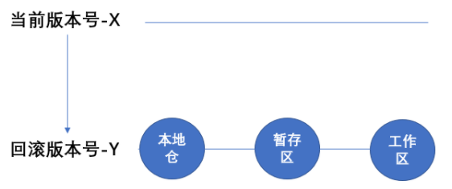

<h1 align = "center">Git
</h1>

# 一、Git

## 1、Git概述

Git是一个免费的、开源的分布式版本控制系统，可以快速高效地处理从小型到大型的各种项目。

Git易于学习，占地面积小，性能极快。 它具有廉价的本地库，方便的暂存区域和多个工作流分支等特性。其性能优于Subversion、CVS、Perforce和ClearCase等版本控制工具。

**分布式版本控制工具**

像 Git这种分布式版本控制工具，客户端提取的不是最新版本的文件快照，而是把代码仓库完整地镜像下来（本地库）。这样任何一处协同工作用的文件发生故障，事后都可以用其他客户端的本地仓库进行恢复。因为每个客户端的每一次文件提取操作，实际上都是一次对整个文件仓库的完整备份。

**Git工作机制**

​			

**Git和代码托管中心**

代码托管中心是基于网络服务器的远程代码仓库，一般我们简单称为远程库。

-   局域网：GitLab
-   互联网：GitHub（外网）、Gitee码云（国内网站）

## 2、Git常用命令

### 1、设置用户签名

```shell
# global表示全局的意思
git config --global user.name 用户名
git config --global user.email 邮箱
```

签名的作用是区分不同操作者身份。用户的签名信息在每一个版本的提交信息中能够看到，以此确认本次提交是谁做的。Git首次安装必须设置一下用户签名，否则无法提交代码。

这里设置用户签名和将来登录GitHub（或其他代码托管中心）的账号没有任何关系。

### 2、初始化本地库

```shell
git init
```

初始化本地库，就是创建Git本地库。在某个目录下建立了本地库，那么Git管理系统就能够跟踪、管理、记录这个目录里面所有文件的改动。

换句话说，初始化本地库，就是让Git来接管该目录的元数据信息。

### 3、查看本地库状态及日志

```shell
# 查看状态
git status

# 查看可引用的历史版本记录
git reflog

# 查看历史提交记录
git log
```

### 4、添加暂存区

```shell
# 将一个或多个文件添加暂存区
git add filename(s)
git add . # 将当前目录下所有文件加入到暂存区，包括子目录中的文件
```

### 5、提交本地库

```shell
# -m选项用于添加提交信息
git commit -m "info" filename
```

### 6、版本回退

-   git reset --soft：soft参数是指将本地仓回滚到Y版本，但是暂存区和工作区保持不变。此时本地仓回滚到Y版本号commit完成的那一刻
-   git reset --mixed 或 git reset：表示本地仓库和暂存区，都回滚到Y版本号。工作区代码不受影响
    -   
-   git reset --hard：本地仓、暂存区、工作区，三区都回滚。如果本地有未提交的代码，千万不要使用这个命令，否则会导致本地代码丢失

### 7、分支操作

在版本控制过程中，同时推进多个任务，为每个任务，我们就可以创建每个任务的单独分支。使用分支意味着程序员可以把自己的工作从开发主线上分离开来，开发自己分支的时候，不会影响主线分支的运行。对于初学者而言，分支可以简单理解为副本，一个分支就是一个单独的副本。

分支底层其实也是指针的引用。

各个分支在开发过程中，如果某一个分支开发失败，不会对其他分支有任何影响。失败的分支删除重新开始即可。

​	

**分支操作：**

```shell
# 查看分支
git branch -v

# 创建分支
# 创建名称未branchname的分支
git branch branchname

# 删除分支
git branch -d branchname
git branch -D branchname
# 如果分支上有未合并的更改，或者未推送的提交，那么删除分支会失败，此时可以使用-D强行删除分支

# 切换分支
# 切换到指定的branchname分支上
git checkout branchname

# 合并分支
# 将branchname分支合并到master分支上，需要站在master分支上，合并branchname分支

# 切换回master分支
git checkout master
# 合并branchname分支
git merge branchname
```

**注意：到目前位置，我们都是在本地工作区 -> 暂存区 -> 本地仓库中进行分支操作**

**分支合并冲突：当分支A修改了文件x.file，同时分支B也修改了文件x.file，当把分支B合并到分支A的时候，就会出现分支合并冲突。**

**Git指针的说明：HEAD指针指向分支指针，分支指针指向版本**

## 3、Git团队协作机制

### 1、团队内协作


### 2、跨团队协作


# 二、GitHub

GitHub网址：https://github.com/

## 1、创建远程仓库

## 2、远程仓库操作

```shell
# git remote -v				 			查看当前所有远程地址别名
# git remote add 别名	远程地址    		为远程地址起别名
# git remote remove/rm 别名			   删除指定的别名
# git remote rename old别名 new别名		  将指定的别名修改为新的别名
# git push 远程地址 分支 					将指定的本地分支上的内容推送到远程仓库中对应的分支中（如果没有分支，自动生成）
# git clone 远程地址		 			 将远程仓库的所有内容（所有分支）克隆到本地
# git pull 远程地址 远程分支名			  将远程仓库对于分支最新内容拉下来后与当前本地分支直接合并
```

-   **git remote -v**
    -   查看当前所有远程地址的别名
-   **git remote add alias remote_address**
    -   为指定的远程地址起别名
-   **git push alias_or_remote_address branch_name**
    -   将指定的本地分支上的内容推送到远程仓库中对应的分支中，如果远程仓库没有对应的分支，那么会自动创建分支
-   **git clone remote_address**
    -   将远程仓库的内容克隆到本地。如果想要克隆成功，那么首先远程仓库下的根目录不能在本地存在，如果存在，那么也不能有子目录或者文件存在，否则，克隆会失败
-   **git pull alias_or_remote_address branch_name**
    -   将远程仓库中指定的分支的拉取下来，并和当前本地工作区的分支合并，随后自动进行添加暂存区和提交本地仓库。此外，站在A分支上拉取远程仓库B分支的代码，是可以拉取成功的，不过远程仓库B分支的代码会合并本地A分支的代码的

**git pull与git clone的区别和联系：**

**git pull拉取远程仓库的代码时，可以指定拉取分支的代码；git clone拉取代码时，会一次性将远程仓库的所有内容，包含所有分支的代码拉取，除此之外，还会初始化本地仓库，创建别名**

# 三、IDEA集成Git/GitHub

## 1、配置Git忽略文件

**为什么需要配置Git忽略的文件？**

对于一些与项目实际功能无关，不参与服务器上的部署运行的文件，例如IDEA运行环境配置文件.iml、目录.idea或者Maven工程的target目录等，我们把它们忽略掉，那么能够屏蔽IDE工具之间的差异问题。

**如何忽略这些文件？**

1.   创建忽略规则文件，**xxx.ignore**

    ​	这个文件的存放位置原则上在哪里都可以，为便于让~/.gitconfig文件引用，建议放在用户的home目录下。

    ​	**忽略规则文件模板**

    ```txt
    # Compiled class file
    *.class
    
    # Log file
    *.log
    
    # BlueJ files
    *.ctxt
    
    # Mobile Tools for Java (J2ME)
    .mtj.tmp/
    
    # Package Files #
    *.jar
    *.war
    *.nar
    *.ear
    *.zip
    *.tar.gz
    *.rar
    
    # virtual machine crash logs, see http://www.java.com/en/download/help/error_hotspot.xml
    hs_err_pid*
    
    .classpath
    .project
    .settings
    target
    .idea
    *.iml
    ```

2.   在.gitconfig文件中引用忽略配置文件（该文件在windows当前用户的家目录下）

    ```txt
    [user]
    	name = panqinggao
    	email = pan_qinggao@163.com
    [core]
    	excludesfile = C:/Users/asus/git.ignore
    注意：这里要使用“正斜线（/）”，不要使用“反斜线（\）”
    ```

## 2、IDEA集成Git/GitHub

### 2.1、在IDEA中配置Git运行程序

1.   在plugins中下载Git插件，并在版本控制工具中找到Git，并配置Git运行程序并测试
2.   初始化git

### 2.2 IDEA操作Git

1.   添加暂存区（两种方式）
    -   右键项目或文件，Git -> add
    -   选中项目或文件，顶部导航栏，VCS -> Git -> add
2.   提交本地库（两种方式）
    -   右键项目或文件，Git -> Commit File
    -   选中项目或文件，顶部导航栏，VCS -> Git -> Commit File
3.   切换版本
    -   IDEA右下角，Git -> log，查看已提交的版本，选中需要切换的版本，右键 -> Checkout Revision 版本号
4.   创建分支（三种方式）
    -   右键选中文件或项目，Git -> Repository -> Branches -> New Branch，输入分支名，创建分支
    -   顶部导航栏，Git -> Branches -> New Branch，输入分支名，创建分支
    -   右下脚，点击Git当前的分支名，默认master，New Branch，输入分支名，创建分支
5.   切换分支
    -   右下角，点击Git当前的分支名，选择想要切换的分支，点击Checkout
6.   合并分支：将B分支合并到A分支
    -   切换回A分支，点击右下角，点击B分支，选择Merge into Current

## 3、 IDEA操作GitHub

### 1、设置GitHub账号

1.   Settings -> Plugins -> 安装GitHub插件 
2.   Settings -> Version Control -> GitHub -> 右上角"+"，添加GitHub账号

### 2、IDEA操作GitHub

**GitHub上没有仓库，使用IDEA分享项目能直接将项目上传GitHub，并且会直接创建远程仓库**

1.   分享项目到GitHub

    -   顶部导航栏，VCS -> Import into Version Control -> Share Project on GitHub -> 设置仓库名称、可见范围和描述 -> share

2.   推送远程仓库

    -   顶部导航栏快捷方式
    -   顶部导航烂，VCS -> Git -> push，需要配置远程仓库的URL和分支名

    **注意：**

    ​	**push是将本地库代码推送到远程库，如果本地库代码跟远程库代码版本不一致，push的操作是会被拒绝的。也就是说，要想push成功，一定要保证本地库的版本要比远程库的版本高！**

    ​	**因此一个成熟的程序员在动手改本地代码之前，一定会先检查下远程库跟本地代码的区别！如果本地的代码版本已经落后，切记要先pull拉取一下远程库的代码，将本地代码更新到最新以后，然后再修改，提交，推送！**

3.   拉取远程仓库到本地

    -   顶部导航烂，VCS -> Git -> pull，需要配置远程仓库的URL和分支名

4.   克隆远程仓库到本地

    -   顶部导航烂，VCS -> Git -> clone，需要指定要克隆的远程仓库的URL

# 四、IDEA集成Gitee/GitLab
