<h1 align = "center">Flink
</h1>

# 一、Flink简介

# 二、Flink部署和运行模式

在不同的部署模式下，Flink各组件的启动以及资源获取的方式都有所不同，为此Flink提供了三种不同的部署模式。而在不同的运行环境下，Flink的资源调度和服务启停也都有所不同，Flink根据不同的场景也提供了不同运行模式。

## 2.1、部署模式

为满足不同场景中，集群资源分配和占用方式的需求，Flink提供了不同的部署模式。这些模式的主要区别在于：集群的生命周期以及资源的分配方式，以及Flink应用中main方法到底在哪里执行：Client还是JobManager。

>   **==一段Flink代码就是一个应用（Application）。==**
>
>   **==在一个Application中可以存在多个作业（Job），一个Job由流式执行环境、Sink算子、数据处理操作、Source算子、流式数据处理执行。==**
>
>   **==一个Job包含多个Flink算子，一个算子即是一个任务（Task）==**
>
>   **==一个算子由于并行度的属性，所以一个算子可以有很多并行子任务。==**

### 2.1.1 会话模式（Session Mode）

会话模式最为符合常规思维：先启动一个Flink集群，保持一个会话，在这个会话中通过Client提交Application，进而提交Job。

这样做的好处是，我们只需要一个集群，所有的Job提交之后都放到这个集群中去运行，集群的生命周期是超越Job的，Job执行结束后，就释放资源，集群依然运行。

其缺点也是显而易见的，因为资源是共享的，所以当资源不够时，新提交的Job就会失败。此外，如果一个发生故障导致TaskManager宕机，那么所有Job都会受到影响。

### 2.1.2 单作业模式（Per-Job Mode）

会话模式会因为资源共享导致很多问题，所以为了隔离每个Job所需要的资源，Flink还提供了单作业模式。

单作业模式中，为每个提交的Job创建一个集群，由客户端执行main()方法，解析出DataFlowGraph和JobGraph，然后启动集群，并将解析出来的Job提交给JobManager，进而分发给TaskManager执行。Job 执行完成后，集群就会关闭，该集群的资源就会释放出来。

单作业模式中，每个Job都有自己的JobManager管理，占用独享的资源，即使发生故障，也不会影响其他作业的运行。

需要注意的是，Flink本身无法直接这样运行，所以单作业模式一般都需要借助一些资源调度框架来启动集群，如，YARN、Kubernetes等。

### 2.1.3 应用模式（Application Mode）

会话模式和单作业模式下，应用代码都是在Client中执行，然后将执行的二进制数据和相关依赖提交给JobManager。这种方式存在的问题是，Client需要占用大量的网络带宽，去下载依赖和将二进制数据发送给JobManager，并且很多情况下提交Job用的都是同一个Client，这样就会加重Client所在节点的资源消耗。

Flink解决这个问题的思路就是：把产生问题的组件干掉，把Client干掉，直接把Application提交到JobManager上运行，进而解析出DataGraph和JobGraph。除此之外，应用模式与单作业模式没有区别，都是提交Job之后才创建集群，单作业模式使用Client执行代码并提交Job，应用模式直接由JobManager执行应用程序，即使Application包含多个Job，也只创建一个集群。

## 2.2、运行模式

==**本文档所使用Flink版本为Flink 1.13**==

### 2.2.1 Local模式（本地模式）

Local模式部署非常简单，直接下载并解压Flink安装包即可，不用行进额外的配置。因此，Local模式下，Flink的数据均存储在本地。

**Local模式的部署只需要一台节点，以下以Hadoop132节点为例，介绍部署步骤：**

-   **使用xftp工具将Flink压缩包flink-1.13.0-bin-scala_2.12.tgz上传到/opt/software目录下**

-   **解压到/opt/moudle目录下：`tar -zxvf /opt/software/flink-1.13.0-bin-scala_2.12.tgz -C /opt/module/`**

-   **对flink解压包进行重命名，添加-local后缀，表示Local运行模式：`mv /opt/software/flink-1.13.0/ /opt/module/flink-1.13.0-local`**

-   **配置环境变量：`vim /etc/profile.d/my_env.sh`**

    ```txt
    #FLINK_HOME
    export FLINK_HOME=/opt/module/flink-1.13.0-local
    export PATH=$PATH:$FLINK_HOME/bin
    ```

-   **执行文件，让环境变量生效：`source /etc/profile`**

-   **执行命令，启动Flink Local模式：`start-cluster.sh`。`start-cluster.sh`脚本将会依次启动以下服务：**

    ```bash
    [justlancer@hadoop132 ~]$ start-cluster.sh 
    Starting cluster.
    Starting standalonesession daemon on host hadoop132.
    Starting taskexecutor daemon on host hadoop132.
    ```

-   **hadoop132节点此时应该运行的服务有：**

    ```txt
    ============== hadoop132 =================
    1971 Jps
    1594 StandaloneSessionClusterEntrypoint
    1871 TaskManagerRunner
    ============== hadoop133 =================
    1142 Jps
    ============== hadoop134 =================
    1140 Jps
    ```

-   **此时访问`hadoop132:8081`可以对Flink进行监控和任务提交**

-   **执行命令，停止Flink Local模式：`stop-cluster.sh`**

### 2.2.2 Standalone模式（独立部署模式）

Standalone模式是一种独立运行的集群模式，这种模式下，Flink不依赖任何外部的资源管理平台，集群的资源调度、数据处理、容错机制和一致性检查点等都由集群自己管理。Standalone模式的优点是，不需要任何外部组件，缺点也很明显，当集群资源不足或者出现故障，由于没有故障自动转移和资源自动调配，需要手动处理，会导致Flink任务失败。

区别于Local模式，Standalone模式需要进行集群配置，配置集群JobManager节点和TaskManager节点。

Flink集群规划

|  hadoop132  |  hadoop133  |  hadoop134  |
| :---------: | :---------: | :---------: |
| JobManager  |    **—**    |    **—**    |
| TaskManager | TaskManager | TaskManager |

-   **再解压一份Flink解压包：`tar -zxvf /opt/software/flink-1.13.0-bin-scala_2.12.tgz -C /opt/module/`**

-   **对Flink解压包进行重命名，添加-standalone后缀，表示Standalone运行模式：`mv /opt/module/flink-1.13.0 /opt/module/flink-1.13.0-standalone`**

-   **修改之前的FLINK_HOME环境变量：`vim /etc/profile.d/my_env.sh` **

    ```txt
    #FLINK_HOME
    export FLINK_HOME=/opt/module/flink-1.13.0-standalone
    export PATH=$PATH:$FLINK_HOME/bin
    ```

-   **执行命令，使环境变量生效：`source /etc/profile`**

-   **JobManager节点配置：`vim /opt/module/flink-1.13.0-standalone/conf/flink-conf.yaml`**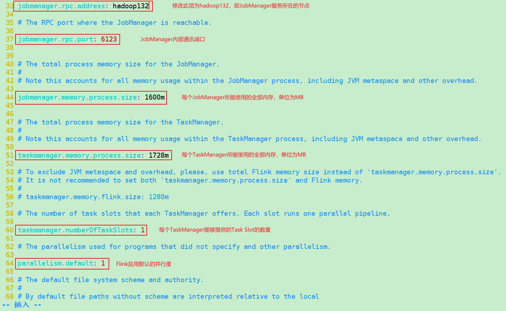

-   **TaskManager节点配置：`vim /opt/module/flink-1.13.0-standalone/conf/workers`**

    ```txt
    hadoop132
    hadoop133
    hadoop134
    ```

-   **分发flink-1.13.0-standalone目录：`xsync /opt/module/flink-1.13.0-standalone/`**

-   **在hadoop133、hadoop134节点中配置环境变量：`vim /etc/profile.d/my_env.sh`**

    ```txt
    #FLINK_HOME
    export FLINK_HOME=/opt/module/flink-1.13.0-standalone
    export PATH=$PATH:$FLINK_HOME/bin
    ```

**==至此，Flink Standalone运行模式已经配置完成，下面将进行集群启动和停止==**

#### 2.2.2.1 Standalone运行模式下的会话模式（Standalone - Session模式）

-   **来到JobManager服务所在的hadoop132节点，执行命令，启动Flink Standalone运行模式的会话模式：`start-cluster.sh`。`start-cluster.sh`脚本将依次启动以下服务：**

    ```txt
    [justlancer@hadoop132 ~]$ start-cluster.sh 
    Starting cluster.
    Starting standalonesession daemon on host hadoop132.
    Starting taskexecutor daemon on host hadoop132.
    Starting taskexecutor daemon on host hadoop133.
    Starting taskexecutor daemon on host hadoop134.
    ```

-   **此时各节点应该运行的服务有：**

    ```txt
    ============== hadoop132 =================
    1524 StandaloneSessionClusterEntrypoint
    1962 Jps
    1838 TaskManagerRunner
    ============== hadoop133 =================
    1472 Jps
    1410 TaskManagerRunner
    ============== hadoop134 =================
    1468 Jps
    1407 TaskManagerRunner
    ```

    >   **==注意一：`start-cluster.sh`脚本将在<u>本地节点</u>启动一个JobManager，并通过ssh连接到workers文件中所有的worker节点，在每一个节点上启动TaskManager。因此，在`flink-conf.yaml`配置文件中，配置项`jobmanager.rpc.address`所指定的JobManager所在节点并不是实际的JobManager所在的节点，而是`start-cluster.sh`脚本执行的节点才是JobManager服务所在的节点。==**
    >
    >   **==注意二：在虚拟机上操作时，如果在测试了Local模式后，立刻进行Standalone模式的部署，在执行`start-cluster.sh`脚本时，可能会出现启动的仍旧是Local模式的Flink服务，而不是Standalone模式的Flink集群，即使你的环境变量配置的没有问题。出现这个问题的原因不清楚，解决这个问题的方法是，重启虚拟机即可。==**

-   **访问`hadoop132:8081`，进入Standalone模式的Web UI，对Flink集群进行监控**

-   **执行命令，停止Standalone - Session模式的Flink集群：`stop-cluster.sh`**

>   **Standalone运行模式下没有单作业部署模式，一方面，Flink本身无法直接以单作业模式启动集群，需要借助资源调度组件；另一方面，Flink本身也没有提供相应的脚本启动单作业模式。**

#### 2.2.2.2 Standalone运行模式下的应用模式（Standalone - Application模式）

正如前面对应用模式的介绍，应用模式下，直接将Application提交到JobManager上运行，进而解析出DataFlowGraph和JobGraph。应用模式下，需要为每一个Application创建一个Flink集群，进而开启一个JobManager。当该JobManager执行结束后，该Flink集群也就关闭了。

因此，应用模式下，当开启Flink集群时，必需要向Flink提供包含Application的jar包。

-   **利用xftp组件，将已经写好的Flink应用——WordCount提交到/opt/module/flink-1.13.0-standalone/lib目录下**

    ```java
    import org.apache.flink.api.common.functions.FlatMapFunction;
    import org.apache.flink.api.java.functions.KeySelector;
    import org.apache.flink.api.java.tuple.Tuple2;
    import org.apache.flink.streaming.api.datastream.DataStreamSource;
    import org.apache.flink.streaming.api.datastream.KeyedStream;
    import org.apache.flink.streaming.api.datastream.SingleOutputStreamOperator;
    import org.apache.flink.streaming.api.environment.StreamExecutionEnvironment;
    import org.apache.flink.util.Collector;
    
    /**
     * Author: shaco
     * Date: 2023/1/30
     * Desc: 入门案例：有界流的World Count
     */
    public class D1_WorldCount_Bounded {
        public static void main(String[] args) throws Exception{
            // TODO 1、创建流式执行环境
            StreamExecutionEnvironment env = StreamExecutionEnvironment.getExecutionEnvironment();
    
            // TODO 2、读取文件
            // 以下方法是按行读取文件的
            DataStreamSource<String> inputDS = env.readTextFile("input\\text1_world.txt");
    
            // TODO 3、对读取的每一行数据进行拆分，拆分成不同的单词
            SingleOutputStreamOperator<Tuple2<String, Integer>> worldOfOne = inputDS.flatMap(
                    new FlatMapFunction<String, Tuple2<String, Integer>>() {
                        @Override
                        public void flatMap(String value, Collector<Tuple2<String, Integer>> out) throws Exception {
                            // 单词分解
                            // 需要注意的是，数据是一行一行读取，并被处理的
                            String[] worldList = value.split(" ");
    
                            // 遍历单词数组，并添加到Tuple中
                            for (String world : worldList) {
                                // 将(world,1)输出
                                out.collect(Tuple2.of(world, 1));
                            }
                        }
                    }
            );
    
            // TODO 4、分组
            KeyedStream<Tuple2<String, Integer>, String> keyedStream = worldOfOne.keyBy(new KeySelector<Tuple2<String, Integer>, String>() {
                @Override
                public String getKey(Tuple2<String, Integer> value) throws Exception {
                    return value.f0;
                }
            });
    
            // TODO 5、聚合
            SingleOutputStreamOperator<Tuple2<String, Integer>> sum = keyedStream.sum(1);
    
            sum.print();
    
            // TODO 6、执行流式数据处理
            env.execute();
        }
    }
    ```

-   **在hadoop132节点执行命令启动 JobManager：`standalone-job.sh start --job-classname D1_WorldCount_Bounded`。此处D1_WorldCount_Bounded为Flink Application的全类名。**

-   **访问`hadoop132:8081`，可以看到Application已经提交并处于Running状态，但此时数据并没有执行，原因是没有TaskManager服务启动。**

>   **由于WordCount应用是有限流数据处理，在启动TaskManager后，任务就会开始执行，当任务执行结束后JobManager就会自动停止并释放资源，此时就看不到Web UI了。**

-   **可以在hadoop132、hadoop133、hadoop134中的任意一个节点上启动TaskManager：`taskmanager.sh start`**
-   **当启动了TaskManager后，任务将很快执行完成，JobManager就会释放资源，此时需要手动停止TaskManager：`taskmanager.sh stop`**

>   **==需要注意的是，当JobManager长时间等不到TaskManager启动，获取不到任务执行的资源，那么JobManager会自动关闭。==**
>
>   **==手动关闭JobManager：`standalone-job.sh stop --job-classname <Flink Application的全类名>`==**

#### 2.2.2.3 Standalone运行模式的高可用部署（Standalone - HA模式）

Standalone的HA模式是通过在集群中配置并运行多个JobManager的方式避免出现单点故障的问题。

-   **修改`/opt/module/flink-1.13.0-standalone/conf/flink-conf.yaml`文件，增加配置：**

    ```txt
    high-availability: zookeeper
    # 该配置项需要指定namenode的内部通信端口，需要与hdfs-site.xml中的配置项保持同步
    high-availability.storageDir: hdfs://hadoop132:8020/flink/standalone/ha
    # 配置Zookeeper集群的连接地址，其端口号也需要和配置文件中的保持一致
    high-availability.zookeeper.quorum: hadoop132:2181,hadoop133:2181,hadoop134:2181
    high-availability.zookeeper.path.root: /flink-standalone
    high-availability.cluster-id: /cluster_justlancer_flink
    ```

-   **修改配置文件`/opt/module/flink-1.13.0-standalone/conf/masters`，配置JobManager服务所在节点的列表：**

    ```txt
    hadoop132:8081
    hadoop133:8081
    ```

-   **分发修改后的配置文件：`xsync /opt/module/flink-1.13.0-standalone/conf/flink-conf.yaml`，`xsync /opt/module/flink-1.13.0-standalone/conf/masters`**

>   **注意，Standalone - HA模式需要使用Zookeeper集群进行状态监控，同时，需要Hadoop集群存储数据。本次测试使用的Hadoop集群，HDFS和YARN均为高可用部署，其部署步骤与Zookeeper部署步骤参见`Hadoop_HDFS&YARN_HA部署文档.md`**

>   **注意：在Flink 1.8.0版本之前，Flink如果需要使用Hadoop的相关组件，那么需要安装Hadoop进行支持。从Flink 1.8版本开始，Flink不再提供基于Hadoop编译的安装包，如果需要Hadoop环境支持，需要自行在官网上下载Hadoop相关本版的组件，例如需要Hadoop 2.7.5环境的支持，需要下载`flink-shaded-hadoop-2-uber-2.7.5-10.0.jar`等类似的jar包，并将该jar包上传至Flink的lib目录下。在Flink 1.11.0版本之后，增加了很多重要的新特性，其中就包括增加了对Hadoop 3.0.0以及更高版本的支持，不再提供相关Hadoop编译的安装包，而是通过配置环境变量完成与Hadoop的集成。**
>
>   **本次测试过程中，Flink版本为Flink 1.13，Hadoop版本为Hadoop 3.1.3，而Standalone - HA模式需要使用HDFS服务，因此需要对环境变量`HADOOP_HOME`添加额外的配置。**

-   **对环境变量`HADOOP_HOME`进行补充配置，hadoop132、hadoop133、hadoop134均需要配置：`vim /etc/profile.d/my_env.sh`**

    ```txt
    #HAOODP_HOME
    export HADOOP_HOME=/opt/module/hadoop-3.1.3-ha
    export PATH=$PATH:$HADOOP_HOME/bin:$HADOOP_HOME/sbin
    # 以下两个环境变量为Flink集成Hadoop环境所需要的环境变量
    export HADOOP_CONF_DIR=${HADOOP_HOME}/etc/hadoop
    export HADOOP_CLASSPATH=`hadoop classpath`
    ```

-   **执行文件，使环境变量生效：`source /etc/profile`**

-   **启动Zookeeper集群：`zk_mine.sh start`**

-   **启动Hadoop HA集群，HDFS HA集群一定要启动，YARN HA可以不用启动，暂时用不到：`start-dfs.sh`**

>   **==注意：以下进行Standalone HA集群的启动，其本质是Standalone - Session模式的高可用配置，是在Standalone - Session模式的基础上，对JobManager进行了HA配置。对于Standalone - Application模式，没有HA配置，原因在于Standalone - Application模式是在Application提交之后才创建Flink集群的。在没有资源调度框架的支持下，无法实现JobManager的HA配置。==**

-   **启动Standalone HA集群：`start-cluster.sh`，此时，各节点启动服务如下：**

    ```bash
    [justlancer@hadoop132 ~]$ start-cluster.sh 
    Starting HA cluster with 2 masters.
    Starting standalonesession daemon on host hadoop132.
    Starting standalonesession daemon on host hadoop133.
    Starting taskexecutor daemon on host hadoop132.
    Starting taskexecutor daemon on host hadoop133.
    Starting taskexecutor daemon on host hadoop134.
    ```

-   **检查各节点所启动的服务，应该有：**

    ```txt
    ============== hadoop132 =================
    4273 JournalNode
    5475 TaskManagerRunner
    3844 NameNode
    4004 DataNode
    4484 DFSZKFailoverController
    5591 Jps
    3546 QuorumPeerMain
    5098 StandaloneSessionClusterEntrypoint
    ============== hadoop133 =================
    2928 DataNode
    3650 StandaloneSessionClusterEntrypoint
    3188 DFSZKFailoverController
    3063 JournalNode
    4007 TaskManagerRunner
    2808 NameNode
    4108 Jps
    2621 QuorumPeerMain
    ============== hadoop134 =================
    1832 QuorumPeerMain
    2457 TaskManagerRunner
    2012 DataNode
    2527 Jps
    ```

-   **访问Flink的Web UI，访问`hadoop132:8081`，或者`hadoop133:8081`均看到Flink的Web页面，均可在页面上提交任务以及监控任务运行状态。如果需要查看哪个节点为leader，那么需要查看Zookeeper的节点信息。**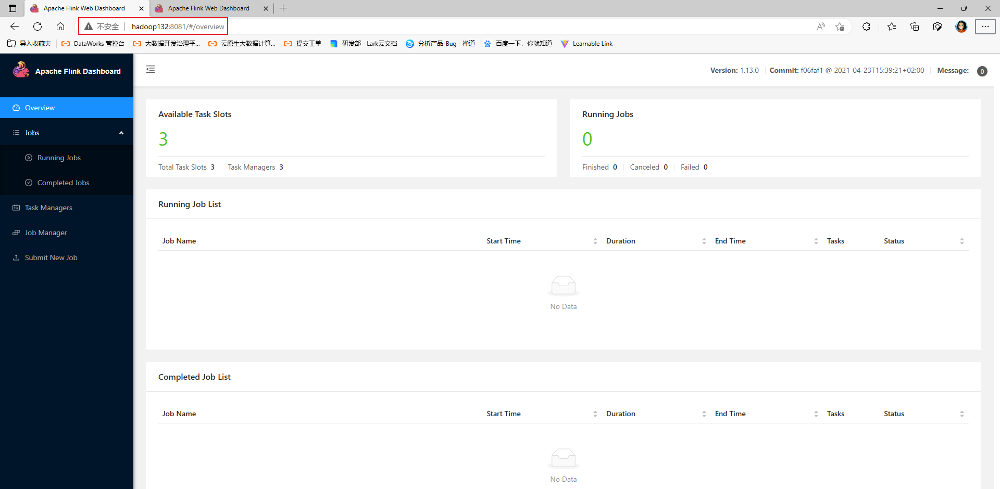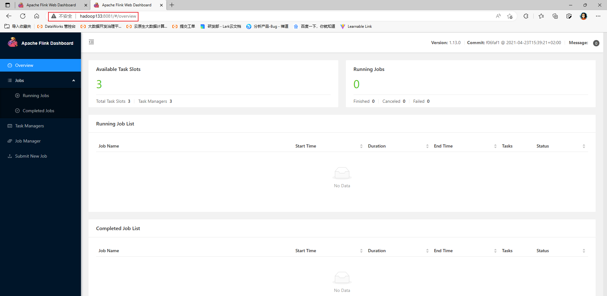

-   **在Zookeeper中查看JobManager的主备信息：**

    -   **登录Zookeeper：`zkCli.sh -server hadoop132:2181`**

    -   **查看/flink-standalone节点下的信息：`get /flink-standalone/cluster_justlancer_flink/leader/rest_server_lock`**

        ```txt
        [zk: hadoop132:2181(CONNECTED) 7] get /flink-standalone/cluster_justlancer_flink/leader/rest_server_lock
        ��whttp://hadoop132:8081srjava.util.UUID����m�/J
                                                        leastSigBitsJ
                                                                     mostSigBitsxp��&U|�ɡ
        ���E7
        ```

-   **停止Standclone - HA模式：`stop-cluster.sh`**

-   **停止HDFS集群：`stop-dfs.sh`**

-   **停止zookeeper集群：`zk_mine.sh stop`**

### 2.2.3 YARN模式

Standalone模式由Flink自身提供资源调度，无需其他框架，但存在的问题是，当集群资源不够时，Flink任务提交就会失败，需要进行手动的资源扩充。

另一方面，Flink是大数据计算框架，不是资源调度框架，在需要的时候，只需要和现有的资源调度框架进行集成就好，将专业的事情交给专业的框架来做。

目前，国内使用最为广泛的资源调度框架是YARN，国外使用较为广泛的资源框架是MESOS。还有使用Kubernetes（k8s）进行的容器化部署。以下介绍Flink集成YARN是如何进行集群部署的。

**注意：以下所使用的Hadoop集群是HA部署模式**

>   **正如上面所说，在Flink 1.11版本之后，如果Flink需要集成Hadoop的服务，那么不需要下载相关的Hadoop组件jar包，只需要通过环境变量的配置即可实现Flink对Hadoop环境的依赖。**
>
>   **因此，一定要在有Flink服务的节点配置Hadoop的环境变量：**
>
>   ```txt
>   #HAOODP_HOME
>   export HADOOP_HOME=/opt/module/hadoop-3.1.3-ha
>   export PATH=$PATH:$HADOOP_HOME/bin:$HADOOP_HOME/sbin
>   # 以下两个环境变量为Flink集成Hadoop环境所需要的环境变量
>   export HADOOP_CONF_DIR=${HADOOP_HOME}/etc/hadoop
>   export HADOOP_CLASSPATH=`hadoop classpath`
>   ```

Flink YARN运行模式前置准备工作：

-   **同样，再解压一份Flink解压包：`tar -zxvf /opt/software/flink-1.13.0-bin-scala_2.12.tgz -C /opt/module/`**

-   **对Flink解压包进行重命名，添加-yarn后缀，表示YARN运行模式：`mv /opt/module/flink-1.13.0 /opt/module/flink-1.13.0-yarn`**

-   **修改之前的FLINK_HOME环境变量：`vim /etc/profile.d/my_env.sh`**

    ```txt
    #FLINK_HOME
    export FLINK_HOME=/opt/module/flink-1.13.0-yarn
    export PATH=$PATH:$FLINK_HOME/bin
    ```

-   **配置上述Hadoop的环境变量：`vim  /etc/profile.d/my_env.sh`**

    ```txt
    #HAOODP_HOME
    export HADOOP_HOME=/opt/module/hadoop-3.1.3-ha
    export PATH=$PATH:$HADOOP_HOME/bin:$HADOOP_HOME/sbin
    # 以下两个环境变量为Flink集成Hadoop环境所需要的环境变量
    export HADOOP_CONF_DIR=${HADOOP_HOME}/etc/hadoop
    export HADOOP_CLASSPATH=`hadoop classpath`
    ```

-   **执行文件，使环境变量生效：`source /etc/profile`**

**==Flink YARN运行模式不需要修改其他配置文件==**

#### 2.2.3.1 YARN运行模式下的会话模式（YARN - Session模式）

不同于YARN的其他模式，YARN -Session模式需要先启动一个YARN会话，进而在会话中来启动Flink集群。

-   **启动Zookeeper集群：`zk_mine.sh start`**

-   **启动HDFS HA集群：`start-dfs.sh`**

-   **启动YARN HA集群：`start-yarn.sh`**

-   **向YARN集群申请资源，开启YARN会话，进而会自动启动Flink集群：`yarn-session.sh -nm test`**

    ```txt
    # 参数说明
    -nm(--name)					配置在YARN UI界面上显示的任务名称
    
    -d(--detached)				分离模式，YARN会话会前台占用一个客户端会话，使用该参数，可以使YARN会话后台运行
    -jm(--jobManagerMemory)		配置JobManager所需要的内存，默认单位是MB
    -tm(--taskManagerMemory)	配置TaskManager所使用的内存，默认单位是MB
    -qu(--queue)				指定YARN队列名称		
    ```

    >   **在Flink 1.11.0版本之前可以使用-n参数和-s参数分别指定TaskManager数量和Slot数量。从Flink 1.11.0版本开始，便不再使用-n参数和-s参数。YARN会按照需求，动态分配TaskManager和Slot。所以YARN - Session模式是动态分配资源的。**

-   **YARN - Session启动后，会给出一个Web UI地址以及一个YARN Application ID**

    ```txt
    ......
    2023-03-01 10:15:44,724 INFO  org.apache.flink.yarn.YarnClusterDescriptor                  [] - Submitting application master application_1677636908998_0001
    2023-03-01 10:15:45,052 INFO  org.apache.hadoop.yarn.client.api.impl.YarnClientImpl        [] - Submitted application application_1677636908998_0001
    2023-03-01 10:15:45,053 INFO  org.apache.flink.yarn.YarnClusterDescriptor                  [] - Waiting for the cluster to be allocated
    2023-03-01 10:15:45,056 INFO  org.apache.flink.yarn.YarnClusterDescriptor                  [] - Deploying cluster, current state ACCEPTED
    2023-03-01 10:15:52,417 INFO  org.apache.flink.yarn.YarnClusterDescriptor                  [] - YARN application has been deployed successfully.
    2023-03-01 10:15:52,418 INFO  org.apache.flink.yarn.YarnClusterDescriptor                  [] - Found Web Interface hadoop132:36564 of application 'application_1677636908998_0001'.
    JobManager Web Interface: http://hadoop132:36564
    ```

-   **开启YARN - Session会话后，就可以通过命令行或者Flink Web UI进行作业提交**

>   **==Flink 作业提交方式和过程将在最后进行介绍。==**

-   **YARN - Session会话的关闭：**
    -   **当YARN - Session会话前台启动时，直接关闭前台会话即可停止YARN - Session**
    -   **当使用-d参数，使YARN - Session会话后台启动时，使用命令可以停止YARN - Session会话：`echo "stop" | yarn-session.sh -id application_XXXXX_XXX`。其中，`application_XXXXX_XXX`为YARN Application ID**


#### 2.2.3.2 YARN运行模式下的单作业模式（YARN - Per Job模式）

在集成了Hadoop环境之后，可以使用YARN进行资源调度，所以可以部署YARN运行模式的单作业部署模式。

YARN运行模式的单作业部署模式无需额外的配置，通过不同的脚本命令即可启动Flink集群。

-   **利用xftp工具将需要执行的Flink应用jar包上传到/opt/module/flink-1.13.0-yarn/lib目录下。本次测试，依然使用上面的WordCount示例。**

-   **执行命令，提交Application：`flink run -d -t yarn-per-job -c D1_WorldCount_Bounded wc_flink-1.0.jar`**

    ```txt
    # 命令格式，及参数说明
    flink run -d -t yarn-per-job -c <Application的入口类的全类名> <Application所在jar包>
    -d 		表示分离模式，使用该参数能够使YARN - Per Job模式的会话后台运行
    -t 		用于指定单作业模式
    ```

-   **当Application提交完成之后，启动日志会给出一个YARN Application ID，通过YARN ResourceManager Web UI界面，可以查看任务执行情况。点击`Tracking UI`，能够进入Flink Web UI界面，对任务进行监控或取消任务**

>   **==注意：上述Flink应用需要读取一个本地文件，是一个有界数据流任务处理，在提交任务之后，由于在Linux上没有该文件，所以会自动失败，但不影响Flink集群启动。后续将会把该任务替换成无界流数据处理任务。==**
>
>   **==注意：不建议使用这种部署模式，因为在Flink 1.15版本之后，Flink就不再支持单作业模式了，如果获取单作业模式的优势，需要部署应用模式。==**

-   **查看YARN任务中正在执行的Flink Per Job任务：`flink list -t yarn-per-job -Dyarn.application.id=<YARN Application ID>`**
-   **取消正在运行的Flink任务：`flink cancel -t yarn-per-job -Dyarn.application.id=<YARN Application ID>`**

>   **注意：YARN会为Application中的每一个Job开启一个Flink集群，当Job执行完成时，该Job所在的Flink集群就会自动释放资源。**

#### 2.2.3.3 YARN运行模式下的应用模式（YARN - Application模式）

应用模式和会话模式、单作业模式相同，不需要额外的进行配置，直接执行Application提交命令即可。

-   **执行命令，提交Application：`flink run-application -t yarn-application -c <Application的入口类的全类名> <Application所在jar包>`**
-   **同样，当Application提交完成后，启动日志会给出YARN Application ID，通过YARN ResourceManager Web UI界面，可以查看任务执行情况。同样，点击`Tracking UI`，能够进入Flink Web UI界面，对任务任务进行监控或取消。**
-   **查看YARN任务中正在执行的Flink Application任务：`flink list -t yarn-application -Dyarn.application.id=<YARN Application ID>`**
-   **取消正在运行的Flink任务：`flink cancel -t yarn-application -Dyarn.application.id=<YARN Application ID>`**

>   **说明：在任务提交过程中，可以通过yarn.provided.lib.dirs配置项来将jar包上传到Flink集群所有节点都能访问的地址，一般是HDFS，这种方式下jar包可以预先上传到HDFS，而不需要单独发送到Flink集群，这使得Application提交更加轻量。**
>
>   **命令格式：`flink run-application -t yarn-application -Dyarn.provided.lib.dirs=<远程地址> <jar包所在地址>`**
>
>   **例如：`flink run-application -t yarn-application -Dyarn.provided.lib.dirs="hdfs://myhdfs/my-remote-flink-dist-dir" hdfs://myhdfs/jars/my-application.jar`**

#### 2.2.3.4 YARN运行模式下的高可用模式（YARN - HA模式）

不同于Standalone - HA模式，是同时启动多个JobManager以避免单点故障的问题。YARN - HA模式是利用YARN的重试次数来实现高可用的，当JobManager宕机后，YARN会尝试重启JobManager。

此外，Standalone - HA模式，一般只适用于Standalone的会话模式，而YRAN - HA模式适用于Session模式、Per Job模式以及Application模式。

YARN - HA模式需要进行额外的参数配置：

-   **在yarn-site.xml文件中添加额外的配置：`vim /opt/module/hadoop-3.1.3-ha/etc/hadoop/yarn-site.xml `**

    ```xml
    <property>
        <name>yarn.resourcemanager.am.max-attempts</name>
        <value>5</value>
        <description>The maximum number of application master execution attempts.</description>
    </property>
    ```

-   **分发配置好的yarn-site.xml文件：`xsync /opt/module/hadoop-3.1.3-ha/etc/hadoop/yarn-site.xml `**

-   **在flink-conf.yaml文件中添加高可用配置：`vim /opt/module/flink-1.13.0-yarn/conf/flink-conf.yaml`**

    ```yaml
    # yarn-site.xml 中配置的是 JobManager 重启次数的上限, flink-conf.xml 中的次数一般小于这个值
    yarn.application-attempts: 4 # 该参数默认值为2
    high-availability: zookeeper
    high-availability.storageDir: hdfs://hadoop132:8020/flink/yarn/ha
    high-availability.zookeeper.quorum: hadoop132:2181,hadoop133:2181,hadoop134:2181
    high-availability.zookeeper.path.root: /flink-yarn
    ```

    >   **==注意：Flink YARN - HA模式需要Hadoop环境的支持，所以一定要配置环境变量HADOOP_CLASSPATH和HADOOP_CONF_DIR==**
    >
    >   ```txt
    >   export HADOOP_CONF_DIR=${HADOOP_HOME}/etc/hadoop
    >   export HADOOP_CONF_DIR=`hadoop classpath`
    >   ```

-   **分发配置好的flink-conf-yaml文件：`xsync /opt/module/flink-1.13.0-yarn/conf/flink-conf.yaml`**

-   **启动Zookeeper集群：`zk_mine.sh start`**

-   **启动HDFS HA集群：`start-dfs.sh`**

-   **启动YARN HA集群：`start-yarn.sh`**

##### 2.2.3.4.1 Flink on YARN HA - Session模式

-   **启动YARN - Session - HA模式：`yarn-session.sh -nm test`。HA部署下，会话模式启动后仍旧会给出Flink Web UI，当JobManager宕机并被YARN重启后，Web UI会发生变化，而已提交的任务会自动重新提交。Web UI发生变化后，可以通过YARN ResourceManger界面的`Tracking UI`重新进入。**
-   **使用命令行或者Web UI可以进行任务提交**
-   **停止YRAN会话：**
    -   **当会话是前台启动时，可以直接终止会话**
    -   **当会话是后台启动时，启动日志会给出停止YARN会话的命令：`echo "stop" | yarn-session.sh -id application_XXXXX_XXX`**

##### 2.2.3.4.2 Flink on YARN HA - Per Job模式

-   **不同于Session模式，Per Job模式直接提交任务即可：`flink run -t yarn-per-job -c <Flink Application 的全类名> <Flink Application 所在jar包>`**
-   **当Flink任务执行完成时，会自动停止该Flink集群，也可以通过Flink Web UI手动停止，或者通过YARN命令停止Flink集群所对应的任务**

##### 2.2.3.4.3 Flink on YARN HA - Application模式

-   **与Per Job模式相同，Application模式直接提交任务即可：`flink run-application -t yarn-application -c <Flink Application 的全类名> <Flink Application 所在jar包>`**
-   **当Flink任务执行完成时，会自动停止该Flink集群，也可以通过Flink Web UI手动停止，或者通过YARN命令停止Flink集群所对应的任务**

## 2.3、Flink任务提交方式和流程

Flink任务提交方式分为两种，一种是通过Flink集群的Web UI进行任务提交；另一种方式是通过命令行的方式。

在不同的运行模式以及部署模式下，Flink任务的命令行提交方式略有不同，以下将逐一介绍。

### 2.3.1 通过Web UI的方式提交任务

通过Web UI的方式提交任务通常用于Session部署模式中，原因在于，通常先要能访问Web UI。对于Per Job模式和Application模式，需要先启动Hadoop环境（HDFS和YARN），然后直接向YARN提交任务，当YARN为该Flink任务分配好资源，并部署了JobManager后，用户才能访问Web UI。所以这两种模式都是任务提交后才能访问Web UI，因此不能通过Web UI的方式提交任务，只能使用命令行提交任务。对于Session模式，首先需要先启动一个YARN Session，当YARN Session启动好之后，便可以访问Web UI，并通过Web UI提交任务。

综上，适合通过Web UI提交任务的模式有：Local、Standalone - Session、Flink on YARN (HA) - Session。

-   **访问Web UI地址，并点击左侧导航栏：`Submit New Job`**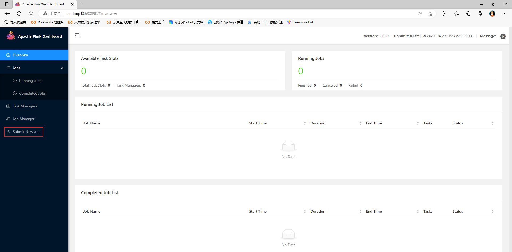
-   **点击右上角`Add New`上传Flink任务对应的jar包**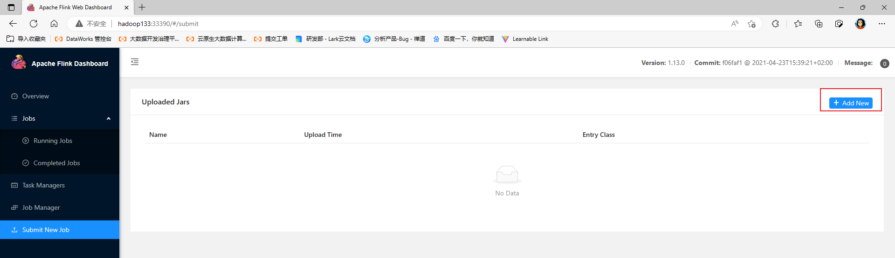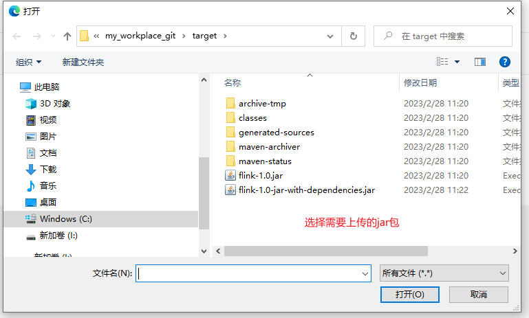
-   **点击提交的jar包，进行提交参数设置，并提交任务**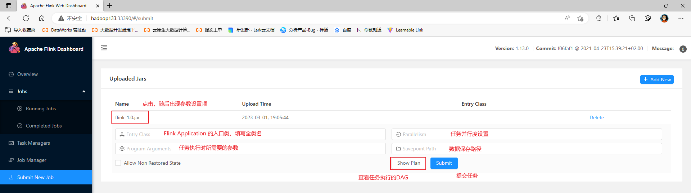

-   **任务提交完成后，可以通过左侧导航栏的JobManager和TaskManager对任务进行监控和撤销**

### 2.3.2 通过命令行的方式提交任务

Per Job模式和Application模式只能通过命令行的方式提交任务，在前面测试时已经展示，现在统一进行介绍。

-   **Standalone - Session模式：==先启动YARN会话，随后部署JobManager，最后提交任务==**
    -   **启动Flink服务：`start-cluster.sh`**
    -   **提交任务：`flink rum -m <Flink服务（IP:port）> -c <Flink Application 全类名> <Flink Application 所在jar包>`**

>   ==**Standalone没有Per Job模式**==

-   **Standalone - Application模式：==直接提交任务==**

    -   **将Flink Application 所在jar包上传到Flink Standalone集群任意节点的\${FLINK_HOME}/lib目录下**

    -   **提交任务，启动JobManager：`standalone-job.sh start --job-classname <Flink Application 所在jar包>`**

    -   **启动TaskManager：`taskmanager.sh start`**

        ```txt
        # 停止JobManager
        standalone-job.sh stop
        # 停止TaskManager
        taskmanager.sh stop
        ```

-   **Standalone HA - Session模式：==同Standalone - Session==**

-   **Flink on YARN (HA) - Session模式：==先开启YARN会话，随后部署JobManager，最后提交任务==**

    -   **申请开启YARN Session：`yarn-session.sh`**
    -   **提交任务：`flink run -c <Flink Application 的全类名> <Flink Application 所在jar包>`**

    >   **==终止任务需要根据YARN ResouceManger中的Application ID进行停止，如果停止YARN Session任务，那么所有的Job都将停止，如果只停止指定的Job，那么不会对其他Job产生影响。==**

-   **Flink on YARN (HA) - Per Job模式：==直接向YARN提交任务==**

    -   **提交任务：`flink run -t yarn-per-job -c <Flink Application的全类名> <Flink Application 所在jar包>`**
    -   **停止任务：`flink cancel -t yarn-per-job -Dyarn.application.id=<YARN Application ID> `**
    -   **查看任务的运行状态：`flink list -t yarn-per-job -Dyarn.application.id=<YARN Application ID>`**

-   **Flink on YARN (HA) - Application模式：==直接向YARN提交任务==**

    -   **提交任务：`flink run-application -t yarn-application -c <Flink Application的全类名> <Flink Application 所在jar包>`**
    -   **停止任务：`flink cancel -t yarn-application -Dyarn.application.id=<YARN Application ID>`**
    -   **查看任务的运行状态：`flink list -t yarn-application -Dyarn.application.id=<YARN Application ID>`**

# 三、Flink运行时架构

Flink是一个需要有效分配和管理计算资源，用以进行流数据处理的分布式系统。虽然集成了所有常见的资源调度组件，例如，YARN、Kubernetes、Mesos，但也可以部署为Standalone，甚至Local模式运行。

下面将对Flink的体系架构，各个主要组件如何协调工作，以执行流数据处理，以及如何从故障中恢复。

## 3.1、Flink体系架构

Flink运行时架构主要包含两个主要的组件：JobManager和TaskManager。

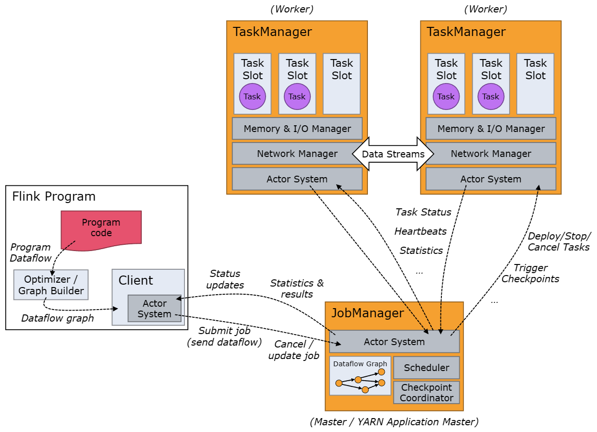


严格来讲，Client并不是Flink应用执行和运行时架构的一部分，而是用于准备和向JobManager发送DataFlowGraph的组件。随后，Client可以和Flink集群断开连接（detached mode），也可以与Flink集群保持连接（attached mode）。Client可以作为Java或者Scala应用程序的一部分运行，或者在命令行中运行。

JobManager和TaskManager拥有不同的启动方式：直接在机器上作为Standalone集群启动、在容器中启动、或者通过YARN等资源框架管理并启动。TaskManager在启动之后会向JobManager汇报自己的状态以及资源情况，进而能够被JobManager分配任务。

### 3.1.1 JobManager

JobManager有许多与协调Flink应用程序，分布式执行时相关的职责：JobManager决定何时调度下一个task(或一组task)，对已完成的task或执行失败做出反应，协调checkpoint，协调故障恢复等等。JobManager由三个不同的部分组成:

#### 3.1.1.1 JobMaster

JobMaster是JobManager中最核心的组件，负责管理单个Job的执行。Flink集群中可以同时运行多个Job，每个Job都有自己的JobMaster。

在Job提交时，Client会将jar包和已经解析好的DataFlowGraph和JobGraph发送给JobMaster，随后JobMaster会将JobGraph转换成ExecutionGraph，并分发到TaskManager中执行。在Job运行的过程中，JobMaster还会负责所有需要中央协调的操作，比如CheckPoints的协调。

#### 3.1.1.2 ResourceManager

ResourceManager主要负责资源的分配和管理，一个Flink进群中只有一个。在Flink集群中，资源主要指的是TaskManager的Task Slots，Task Slot是Flink集群资源调度的基本单位，主要包含CPU资源和内存资源。Flink集群运行的每一个Task都必须要分配到一个Slot上。

需要注意的是，要区分Flink的ResourceManager和YARN的ResourceManager。

Flink的ResourceManager，针对不同的环境和资源调度框架，都提供了具体的实现。

在Standalone部署模式下，TaskManager是通过配置文件指定的，在Flink集群启动的那一刻，TaskManager的启动数量和节点位置就已经确定，随后启动成功的TaskManager会向JobManager的ResourceManager注册自己，并汇报Task Slots的使用状态。因此，Flink的ResourceManager只能分配可用的Task Slots，当Task Slots不够时，无法独立启动新的TaskManager，以提供Task Slots。

在集成资源调度框架后，例如，Flink on YARN (HA)部署模式，当新提交的Job申请资源时，ResourceManager会将空闲的Task Slots分配给JobMaster，用以执行新提交的Job。当没有足够的Task Slots时，Flink的ResourceManager会向YARN的ResourceManager发送请求，YARN的ResourceManager将会开启Container，并部署TaskManager，以提供Task Slots。

此外，Flink的ResourceManager还负责停止空闲的TaskManager，释放集群资源。

#### 3.1.1.3 Discatcher

Dispatcher提供了一个用于提交Flink Application的REST接口，并会为每个提交的Job启动一个新的 JobMaster。它还运行 Flink WebUI 用来提供Job执行信息。

### 3.1.2 TaskManager

TaskManager又被称为workers，用于进行数据流的具体计算任务，同时能够缓冲数据流，以及与其他TaskManager进行数据交换。

## 3.2、Job提交流程

Job总体提交流程

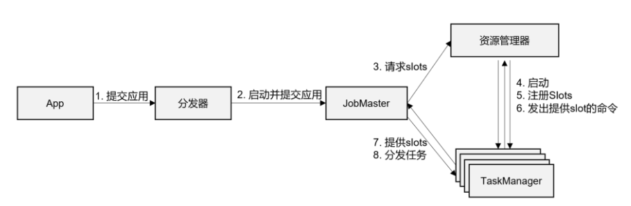

-   **由Client通过Discatcher提供的REST接口，将Job提交给JobManager**
-   **随后Discatcher启动JobMaster，将jar包和解析好的DataFlowGraph和JobGraph提交给JobMaster**
-   **JobMaster将JobGraph解析成ExecutionGraph，并计算ExecutionGraph执行所需要的Task Slots数量，并向Flink ResourceManager申请Task Slots**
-   **Flink ResourceManager申请资源：**
    -   **Standalone部署模式下，Flink ResourceManager将判断当前Flink集群中空闲的Task Slots是否能够满足需求，如果满足，给JobMaster分配资源，如果不满足，由于无法自动启动TaskManager，所以该JobMaster只能等待资源分配**
    -   **YARN部署模式下，Flink ResourceManager向YARN ResourceManager申请资源，YARN ResourceManager将开启Container，部署TaskManager，并向Flink ResourceManager注册可用Task Slots，Flink ResourceManager获取到足够的Task Slots注册后，将开始执行任务**
-   **JobMaster将需要执行的任务分发给TaskManager，开始执行任务**

Standalone运行模式下，Job提交流程较为简单，由Flink ResourceManager进行资源管理，当资源充足时，直接执行Job，当资源不足时，需要等待其他任务执行完成并释放资源。

YARN运行模式下，不同部署模式下，任务提交流程略有不同。

在Flink on YARN (HA) - Session模式下，首先需要运行一个YARN Application，与之对应地启动一个Container，用于部署JobManager（由于没有任务提交，所以不会启动TaskManager），即开启一个YARN会话，随后进行任务提交，任务提交过程与总体提交流程基本相同。Session模式下，Application通过Client解析成一个或多个Job，随后提交给JobManager。

在Flink on YARN (HA) - Per Job模式下，不需要启动YARN Session，Client直接将Job提交给YARN ResourceManager，随后开启Container，部署JobManager和TaskManager，最后执行任务。Per Job模式下，Application通过Client解析成一个或多个Job，随后提交到YARN ResourceManager。

Flink on YARN (HA) - Application模式与Flink on YARN (HA) - Per Job模式基本相似，只是提交给YARN ResourceManager的不再是具体的Job，而是整个Application。一个Application包含一个或多个Job，这些Job都将在JobManager中被解析出来，并为每个Job启动对应的JobMaster。

## 3.3、其他重要概念

除了以上介绍的整体架构和核心组件，Flink还有一系列概念需要介绍，这对理解Flink代码是如何一步一步转换成可执行Task，每个Flink Application将转换成多少个Task，以及需要多少Task Slots才能满足Application的运行至关重要，只有清楚这些问题，才能依据实际的业务情况，对Flink集群进行合理的资源配置。

### 3.3.1、Parallelism（并行度）

Flink Application的程序结构是为每一条数据定义了一连串的数据处理操作，这些操作被称为Operator，或者”算子“。数据在进入Flink集群后，会依次调用这些Operator。所以Flink Application程序的执行就好像是”铁打的算子，流水的数据“。

在Job提交过程中，Flink程序会被映射成所有Operator按照逻辑顺序连在一起的一个DAG，这个DAG被称为DataFlow Graph。在Flink Web UI上提交完作业后，点击”show plan“就可以看到对应的DataFlow Graph。

Flink Application的程序结构都以Source Operator开始，以Sink Operator结束，中间加以数据处理操作。除了Source Operator和Sink Operator外，数据处理操作不一定是一个Transformation Operator，只有进行数据转换处理的方法调用，才是Transformation Operator。代码中有一些方法的调用，数据是没有进行转换的，只是对数据属性进行了设置，或者是数据发送方式的定义。例如，keyBy()方法调用，broadcast()方法调用。

正如上述所说，Flink对数据的处理方式是：算子不动，数据流动。为了实现流式数据的分布式计算，Flink将Operator复制多份，并分发到多个节点上，流式数据到来后，可以随机进入任何一个节点中进行处理，也可以通过设置进入指定的节点中进行处理。这样，一个Operator任务就被拆分成多个并行的子任务，这些子任务会在不同的节点中进行运算。

在Flink执行过程中，每一个Operator可以包含一个或者多个subTask，这些subTask会在不同的线程、不同的物理机或不同的容器中完全独立地执行。

Operator的subTask的个数称为该Operator的并行度。

一个流程序的并行度，可以认为是所有Operator中最大的并行度。

一个流程序中，不同的Operator可以具有不同的并行度。

**==并行度的设置以及优先级，以下优先级从高到低==**

-   **为每一个Operator单独设置并行度：Operator直接调用`setParallelism()`方法**
-   **为Application设置全局并行度：流执行环境调用`setParallelism()`方法**
-   **提交Application时，设置并行度：**
    -   **Web UI提交，在对应输入框中直接添加并行度**
    -   **命令行提交，使用-p参数，设置并行度**
-   **`flink-conf.yaml`配置文件中配置默认并行度：配置`parallelism.default`配置项**

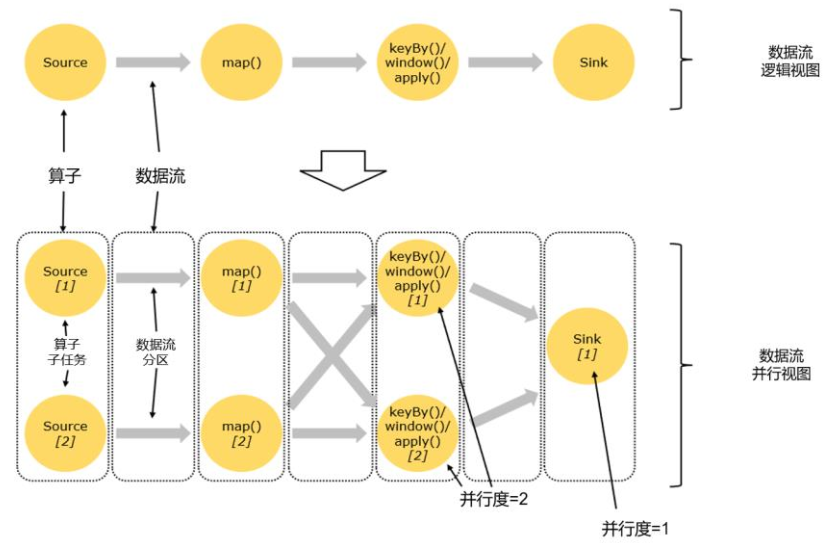

### 3.3.2、Operator Chain（算子链）

根据DataFlow Graph和Operator的并行度，能够计算出每个Application将会产生多少个并行子任务，那么这些并行子任务需要多少的Task Slot呢？这需要考虑到算子之间数据的传输问题。

类似于Spark的宽依赖和窄依赖。

在Flink中，如果上游Operator的数据向下游Operator发送不需要进行Shuffle时，那么会将上游Operator和下游Operator合并成一个”大“的Task，这个”大“的Task将会被放到同一个Task Slot中进行执行，这个”大”的Task称为Operator Chain。基于Operator的合并能够有效减少线程之间的切换和基于缓存的数据交换，在减少延时的同时提高数据处理效率。

如果上游Operator的数据向下游Operator发送需要进行Shuffle时，那么就无法进行Operator合并。

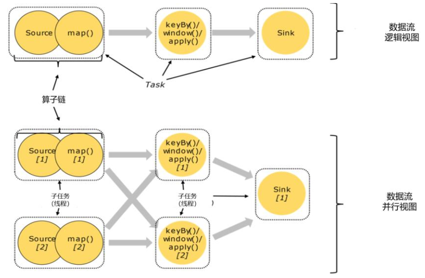

### 3.3.3、DataFlowGraph、Job Graph、Execution Graph和Physical Graph

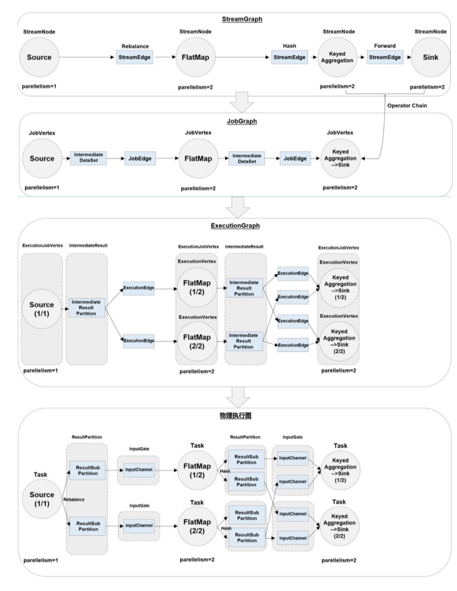

-   **DataFlow Graph**

    根据Flink Application代码生成的最初的DAG，用来表示程序的拓扑结构。DataFlowGraph中的节点完全对应代码中的Operator操作。

    一般在Client中生成。

-   **Job Graph**

    DataFlow Graph经过优化后形成Job Graph，主要优化为：根据是否满足窄依赖关系，将多个符合条件的Operator合并在一起，形成Operator China，减少Shuffle过程带来的时间和资源的损耗。

    Job Graph确定了当前Job中所有任务的划分。

    一般在Client中生成，并提交到JobMaster。

-   **Execution Graph**

    JobMaster收到Job Graph后，根据并行度的设置，会形成ExecutionGraph，是调度层最为核心的数据结构。Execution Graph的形成最主要解决了Task之间数据传递的方式。

-   **Physical Graph**

    Execution Graph生成之后，会由JobMaster分发给TaskManager，各个TaskManager会根据Execution Graph部署任务，最终的物理执行过程会形成Physical Graph，这是具体执行层面的图，并不是一个具体的数据结构。

    Physical Graph主要是在Execution Graph的基础上，进一步确定数据存放的位置和收发的具体方式。Physical Graph形成之后，TaskManager就可以对传递来的数据进行计算和处理了。

### 3.3.4、Task和Task Slot

每个 worker（TaskManager）都是一个JVM 进程，可以在单独的线程中执行一个或多个 subTask。为了控制一个TaskManager中接受Task的，就有了所谓的Task Slots（至少一个）。

每个Task Slot代表TaskManager中资源的固定子集。例如，具有3个Slot的TaskManager会将其托管内存的1/3用于每个Slot。分配资源意味着subTask不会与其他Job的subTask竞争托管内存。

通过调整Task Slot的数量，用户可以定义subTask如何互相隔离。每个TaskManager有一个Slot，这意味着每个Task组都在单独的 JVM 中运行（例如，可以在单独的容器中启动）。具有多个Slot意味着更多subTask共享同一JVM。同一JVM中的Task共享TCP连接（通过多路复用）和心跳信息。它们还可以共享数据集和数据结构，从而减少了每个Task的开销。

默认情况下，Flink允许subTask共享Slot，即便它们是不同的Task的subTask，只要是来自于同一Job即可。结果就是一个Slot可以支持整个Job的Task链路。允许Slot共享有两个主要优点：

-   Flink集群所需的Task Slot和作业中使用的最大并行度恰好一样。无需计算程序总共包含多少个Task（具有不同并行度）
-   容易获得更好的资源利用。如果没有Slot 共享，非密集subTask（Source / map()）将占用与密集型subTask（Window）一样多的资源。通过Slot共享，可以充分利用分配的资源，同时确保繁重的subTask在TaskManager之间公平分配

# 四、DataStream API

Flink 有非常灵活的分层API设计，其中的核心层就是DataStream / DataSet API。由于新版本已经实现了流批一体，DataSet API将被弃用，官方推荐统一使用 DataStream API 处理流数据和批数据。**==下面主要并且默认介绍基本的DataStream API用法。==**

DataStream（数据流）本身是Flink中一个用来表示数据集合的类（Class），编写Flink代码其实就是基于这种数据类型的处理，所以这套核心API就以DataStream命名。对于批处理和流处理，都可以用这同一套API来实现。

DataStream在用法上有些类似于Java集合，但又有所不同。Flink Application在代码中往往并不关心DataStream中具体的数据，而只是用API定义出一连串的操作来处理它们，即数据流的“转换”。

一个Flink Application，其实就是对DataStream的各种转换。具体来说，程序结构基本上由以下几部分构成：

-   **创建流执行环境（Execution Environment）**  
-   **读取数据源（Source）**
-   **定义数据转换操作（Transformations）**
-   **定义计算结果的输出（Sink）**
-   **执行流/批数据处理（Execute）**

其中，获取环境和执行流/批数据处理，都可以认为是针对执行环境的操作，所以在编写Flink Application的过程中，主要关注Execution Environment、Source、Transform、Sink。

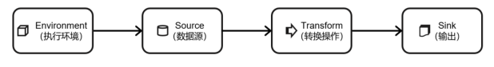

## 4.0、引入Flink项目的依赖

为了能在IDEA开发环境中编写并运行Flink代码，需要在module的pom.xml中引入Flink项目的相关依赖，包含，flink-java、flink-streaming-java，以及flink-clients（Flink客户端，可以省略）。另外为了便于查看运行日志，还引入slf4j和log4j进行日志管理。

```xml
<properties>
    <flink.version>1.13.0</flink.version>
    <java.version>1.8</java.version>
    <!-- 定义Scala版本。Flink底层实现是Java代码，但Flink架构中使用了Akka来实现底层的分布式通信，而Akka是使用Scala开发的 -->
    <scala.binary.version>2.12</scala.binary.version>
    <slf4j.version>1.7.30</slf4j.version>
</properties>

<dependencies>
    <!-- 引入 Flink 相关依赖-->
    <!-- flink-java -->
    <dependency>
        <groupId>org.apache.flink</groupId>
        <artifactId>flink-java</artifactId>
        <version>${flink.version}</version>
    </dependency>

    <!-- flink-streaming -->
    <dependency>
        <groupId>org.apache.flink</groupId>
        <artifactId>flink-streaming-java_${scala.binary.version}</artifactId>
        <version>${flink.version}</version>
    </dependency>

    <!-- flink-client -->
    <dependency>
        <groupId>org.apache.flink</groupId>
        <artifactId>flink-clients_${scala.binary.version}</artifactId>
        <version>${flink.version}</version>
    </dependency>

    <!-- 引入日志管理相关依赖-->
    <dependency>
        <groupId>org.slf4j</groupId>
        <artifactId>slf4j-api</artifactId>
        <version>${slf4j.version}</version>
    </dependency>

    <dependency>
        <groupId>org.slf4j</groupId>
        <artifactId>slf4j-log4j12</artifactId>
        <version>${slf4j.version}</version>
    </dependency>

    <dependency>
        <groupId>org.apache.logging.log4j</groupId>
        <artifactId>log4j-to-slf4j</artifactId>
        <version>2.14.0</version>
    </dependency>
</dependencies>

<!-- 配置打包插件 -->
<build>
        <plugins>
                <plugin>
                        <groupId>org.apache.maven.plugins</groupId>
                        <artifactId>maven-assembly-plugin</artifactId>
                        <version>3.0.0</version>

                        <configuration>
                                <descriptorRefs>
                                        <descriptorRef>jar-with-dependencies</descriptorRef>
                                </descriptorRefs>
                        </configuration>

                        <executions>
                                <execution>
                                        <id>make-assembly</id>
                                        <phase>package</phase>
                                        <goals>
                                                <goal>single</goal>
                                        </goals>
                                </execution>
                        </executions>
                </plugin>
        </plugins>
</build>
```

配置日志管理：在src/main/resources目录下创建文件`log4j.properties`，添加以下内容

```txt
log4j.rootLogger=error, stdout
log4j.appender.stdout=org.apache.log4j.ConsoleAppender
log4j.appender.stdout.layout=org.apache.log4j.PatternLayout
log4j.appender.stdout.layout.ConversionPattern=%-4r [%t] %-5p %c %x - %m%n
```

## 4.1、创建执行环境（Execution Environment）

Flink Application可以在不同的上下文环境中运行：本地JVM、远程集群。不同的环境，Application的提交运行过程会有所不同，所以，在提交作业执行计算时，必须先获取当前Flink的运行环境，从而建立与Flink服务之间的联系。只有获取运行环境的上下文信息，才能将具体的任务调度到不同的TaskManager执行。

**流执行环境的创建均是调用`StreamExecutionEnvironment`类的静态方法来创建的。**

-   **调用`getExecutionEnvironment()`方法创建流执行环境：最常用的创建执行环境的方法**

    ```java
    // 有重载方法
    StreamExecutionEnvironment env = StreamExecutionEnvironment.getExecutionEnvironment();
    ```

    `getExecutionEnvironment()`方法会根据当前运行的上下文直接得到执行环境。即，如果程序是独立运行的，就返回一个本地执行环境；如果是创建了jar包，然后从命令行调用jar并提交到集群执行，那么就返回集群的执行环境。

-   **调用`createLocalEnvironment()`方法创建本地执行环境：**

    ```java
    // 有重载方法
    LocalStreamEnvironment env = StreamExecutionEnvironment.createLocalEnvironment();
    ```

-   **调用`createRemoteEnvironment(String host, int port, String... jarFiles)`方法创建集群执行环境**

    ```java
    // 有重载方法
    StreamExecutionEnvironment env = StreamExecutionEnvironment
                    .createRemoteEnvironment(
                            "host", // 集群地址，JobManager所在节点地址
                            port, // 端口号，JobManager进程的端口号
                            "jarFiles" // Application所在的jar包，可变形参，能同时添加多个jar包
                    );
    ```

**执行环境创建后，可以对执行环境进行配置，例如，全局并行度设置，算子链禁用，声明时间语义，以及配置容错机制。**

>   **==批处理执行环境的创建（了解）==**
>
>   类似于流执行环境的创建，批执行环境的创建是通过调用`ExecutionEnvironment`类的静态方法。
>
>   ```java
>   // 批执行环境的创建
>   ExecutionEnvironment executionEnvironment = ExecutionEnvironment.getExecutionEnvironment();
>   LocalEnvironment localEnvironment = ExecutionEnvironment.createLocalEnvironment();
>   CollectionEnvironment collectionsEnvironment = ExecutionEnvironment.createCollectionsEnvironment();
>   ExecutionEnvironment remoteEnvironment = ExecutionEnvironment.createRemoteEnvironment(
>           "host", // 集群地址，JobManager所在节点的地址
>           6123, // JobManager的服务端口
>           "jars" // Flink Application所在jar包
>   );
>   ```
>
>   在Flink 1.12.0版本中，Flink DataStream API新增了一个重要特性，可以支持不同的执行模式，通过简单的设置就可以让Flink程序在流处理和批处理之间切换，进而实现了API上的批流统一，因此从Flink 1.12.0版本开始，DataSet API就开始逐步弃用了。
>
>   -   **流执行模式（STREAMING）**
>
>       这是DataStream API的默认模式，一般用于需要持续实时处理的无界数据流 。
>
>   -   **批执行模式（BATCH）**
>
>       专门用于批处理的执行模式, 这种模式下， Flink 处理作业的方式类似于 MapReduce 框架。
>
>       ```bash
>       # 通过命令行配置BATCH执行模式
>       # 通过命令提交任务时，利用参数-Dexecution.runtime-mode配置执行模式
>       flink run -Dexecution.runtime-mode=BATCH ...
>       ```
>
>       ```java
>       // 在代码中配置执行模式
>       StreamExecutionEnvironment env = StreamExecutionEnvironment.getExecutionEnvironment();
>       env.setRuntimeMode(RuntimeExecutionMode.BATCH);
>       ```
>
>   -   **自动模式（AUTOMATIC）**
>
>       在这种模式下，将由程序根据输入数据源是否有界，来自动选择执行模式。
>
>       配置执行模式的方式，同上。

## 4.2、Source Operator

Flink程序中，Source用于对接数据源，将数据读取到Flink集群中，进行才能够进行数据处理。

Flink可以从各种来源获取数据，然后构建 DataStream 进行转换处理。一般将数据的输入来源称为数据源(data source)，而读取数据的算子就是源算子（Source Operator）。

### 4.2.1 从集合中读取数据

这是最简单的数据读取方式。在代码中直接创建Java集合，将需要被Flink读取的数据添加到集合中，最后通过流执行环境对象调用`fromCollection()`方法，将数据读取到Flink中。

从集合中读取数据，相当于将数据临时存储到内存中，作为数据源使用，一般用于测试。

```Java
/**
 * @author shaco
 * @create 2023-03-03 10:54
 * @desc 从集合中读取数据
 */
public class C001_ReadMemorySource {
    public static void main(String[] args) throws Exception {
        // TODO 1、创建流式执行环境
        StreamExecutionEnvironment env = StreamExecutionEnvironment.getExecutionEnvironment();
        // 设置全局并行度为1，便于控制台数据打印
        env.setParallelism(1);

        // TODO 2、创建集合，作为数据源
        ArrayList<String> arrayListSource = new ArrayList<>();
        arrayListSource.add("hello world");
        arrayListSource.add("hello java");
        arrayListSource.add("hello scala");
        arrayListSource.add("hello python");
        arrayListSource.add("hello shell");
        arrayListSource.add("hello flink");
        arrayListSource.add("hello spark");

        // TODO 3、从集合中读取数据源
        DataStreamSource<String> stringDataStreamSource = env.fromCollection(arrayListSource);

        // TODO 4、直接在控制台打印数据源
        stringDataStreamSource.print();

        // TODO 5、执行流式数据处理
        env.execute();
    }
}
```

除了将数据添加到集合，再通过`fromCollection()`方法读取数据外，还可以通过`fromElements()`方法，直接读取列举的元素。

```Java
/**
 * @author shaco
 * @create 2023-03-03 10:54
 * @desc 从集合中读取数据
 */
public static void main(String[] args) throws Exception {
    // TODO 1、创建流执行环境
    StreamExecutionEnvironment env = StreamExecutionEnvironment.getExecutionEnvironment();
    env.setParallelism(1);

    // TODO 2、利用fromElement()方法，读取数据源
    DataStreamSource<String> stringDataStreamSource = env.fromElements(
            "hello world",
            "hello java",
            "hello scala",
            "hello python",
            "hello flink"
    );

    // TODO 3、控制台打印数据流
    stringDataStreamSource.print();

    // TODO 4、执行流数据处理
    env.execute();
}
```

### 4.2.2 读取文本文件

读取文本文件可以读取本地文本文件，也可以读取文件系统的文件。

利用流执行环境对象调用`readTextFile()`方法，传入文本文件的路径，进行数据读取。

**需要说明的是，在IDEA开发环境中读取文件系统中的文本文件时，需要添加相关的依赖，例如读取Hadoop的文件，需要添加以下的依赖：**

```xml
<dependency>
    <groupId>org.apache.hadoop</groupId>
    <artifactId>hadoop-client</artifactId>
    <version>2.7.5</version>
</dependency>
```

在读取文本文件之前首先要准备文本文件。创建文件`input/text2_world.txt`，并添加以下内容

```txt
hello world
hello java
hello scala
hello python
hello shell
hello hadoop
hello flume
hello hive
hello kafka
hello dataX
hello maxwell
hello spark
hello flink
```

将文件上传到Hadoop文件系统中：`hadoop -put /home/justlancer/text2_world.txt /input`

```java
/**
 * @author shaco
 * @create 2023-03-03 13:22
 * @desc 读取文本文件作为数据源
 */
public class C002_ReadCharacterFileSource {
    public static void main(String[] args) throws Exception {
        // TODO 1、创建流执行环境
        StreamExecutionEnvironment env = StreamExecutionEnvironment.getExecutionEnvironment();
        env.setParallelism(1);

        // TODO 2、读取文本文件
        // 读取本地文本文件
        DataStreamSource<String> stringDSLocal = env.readTextFile("C:\\my_workplace_git\\flink_api\\input\\text2_world.txt");
        // 读取文件系统中的文本文件
        DataStreamSource<String> stringDSFileSystem = env.readTextFile("hdfs://hadoop132:8020/flink_input/text2_world.txt");

        // TODO 3、打印数据流
        stringDSLocal.print(">>>>");
        stringDSFileSystem.print("====");

        // TODO 4、执行流数据处理
        env.execute();
    }
}
```

### 4.2.3 读取Socket文本流数据

从文本文件中读取数据，可以模拟有界数据流；为了模拟无界数据流，可以读取Socket文本流数据。

读取Socket文本流数据是通过流执行环境调用`socketTextStream()`方法，传入地址和端口号，进行数据读取。

```java
/**
 * @author shaco
 * @create 2023-03-03 14:47
 * @desc 读取socket文本流
 */
public class C003_ReadSocketTextSource {
    public static void main(String[] args) throws Exception {
        // TODO 1、创建流执行环境
        StreamExecutionEnvironment env = StreamExecutionEnvironment.getExecutionEnvironment();
        env.setParallelism(1);

        // TODO 2、读取Socket文本流
        DataStreamSource<String> socketTextStream = env.socketTextStream("hadoop132", 9999);

        // TODO 3、打印数据流
        socketTextStream.print();

        // TODO 4、执行流数据处理
        env.execute();
    }
}
```

### 4.2.4 读取Kafka

Flink框架并没有为Kafka数据源提供内嵌的实现方法，因此只能通过调用`addSource()`方法、实现`SourceFunction`接口。虽然Flink没有提供内嵌方法，但Flink提供了一个连接工具`flink-connertor-kafka`，直接实现了一个消费者`FlinkKakfaConsumer`，用于读取Kafka的数据。

读取Kafka的数据需要开启Kafka服务，这里以Kafka集群为例。

-   **启动Zookeeper集群：`zk_mine.sh start`**

-   **启动Kafka集群：`kf_mine.sh start`**

-   **创建测试用Kafka主题`first`，分区数1，副本数1：`kafka-topics.sh --bootstrap-server hadoop132:9092 --create --topic first --partitions 1 --replication-factor 1`**

-   **开启Kafka生产者客户端：`kafka-console-producer.sh --bootstrap-server hadoop132:9092 --topic first`**

-   **编写读取Kafka数据的Flink代码，并运行：**

    ```Java
    /**
     * @author shaco
     * @create 2023-03-06 11:51
     * @desc 读取Kafka数据源
     */
    public class C004_ReadKafkaSource {
        public static void main(String[] args) throws Exception {
            // TODO 1、创建流执行环境
            StreamExecutionEnvironment env = StreamExecutionEnvironment.getExecutionEnvironment();
            env.setParallelism(1);
    
            // TODO 2、配置Kafka消费者属性，以及创建FlinkKafkaConsumer对象
            // Kafka消费主题
            String topic = "first";
    
            // Kafka连接属性
            Properties kafkaProperties = new Properties();
            kafkaProperties.put("bootstrap.servers", "hadoop132:9092,hadoop133:9092"); // 集群连接地址
            kafkaProperties.put("group.id", "test"); // 设置消费者组
            kafkaProperties.put("key.deserializer", "org.apache.kafka.common.serialization.StringDeserializer");  //  key的反序列化
            kafkaProperties.put("value.deserializer", "org.apache.kafka.common.serialization.StringDeserializer");  // value的反序列化
            kafkaProperties.put("auto.offset.reset", "latest"); // 消费偏移量，最新处开始
    
            FlinkKafkaConsumer<String> stringFlinkKafkaConsumer = new FlinkKafkaConsumer<String>(
                    topic,
                    new SimpleStringSchema()
                    , kafkaProperties
            );
    
            // TODO 3、读取Kafka数据源
            DataStreamSource<String> stringKafkaDS = env.addSource(stringFlinkKafkaConsumer);
    
            // TODO 4、打印数据流到控制台
            stringKafkaDS.print();
    
            // TODO 5、执行流数据处理
            env.execute();
        }
    }
    ```

-   **在Kafka生产者端随意发送消息，查看IDEA控制台打印结果**

### 4.2.5 自定义Source

在测试时，如果以上现有Source的实现还不能满足需求，那么可以自定义Source，并通过流执行环境调用`addSource()`方法，读取自定义数据源。

具体步骤为，自定义类实现`SourceFunction`接口，并重写其两个抽象方法`run()`和`cancel()`。

-   **`run()`方法，在方法中，通过`SourceContext`对象调用`collect()`可以发送数据。为了模拟流式数据，一般需要在`run()`方法中定义一个`while()循环，不断向下游发送数据`**
-   **`cancel()`方法，用于取消向下游发送数据，当Flink程序终止时，会自动调用该方法，也可以在需要的时候创建对象，手动调用`cancel()`方法。典型的自定义流式数据源：在类中声明一个`Boolean`类型的变量`isRunning`，在`run()`方法的`while()`循环中调用，在`cancel()`方法中改变`isRunning`的取值。**

>   **定义流式数据的数据结构，即定义一个类**
>
>   ```java
>   public class WebPageAccessEvent {
>       public String userName;
>       public String url;
>       public String accessTime;
>   
>       public WebPageAccessEvent(){
>   
>       }
>   
>       public WebPageAccessEvent(String userName, String url, String accessTime) {
>           this.userName = userName;
>           this.url = url;
>           this.accessTime = accessTime;
>       }
>   
>       @Override
>       public String toString() {
>           return "WebPageAccessEvent{" +
>                   "userName='" + userName + '\'' +
>                   ", url='" + url + '\'' +
>                   ", accessTime=" + accessTime +
>                   '}';
>       }
>   }
>   ```
>
>   **Flink POJO类的特点：**
>
>   -   共有类
>   -   共有属性
>   -   无参构造器
>   -   属性可序列化
>
>   Flink会将具有这些特点的类作为一种特殊的POJO数据类型来对待，以便于数据的解析和序列化。类中重写toString()方法只是为了便于测试观察数据。
>
>   POJO类类似于Scala中的样例类。

**自定义数据源：**

```Java
/**
 * @author shaco
 * @create 2023-03-03 15:30
 * @desc 自定义网页访问事件数据源
 */
public class WebPageAccessEventSource implements SourceFunction<WebPageAccessEvent> {
    // 自定义数据源，每隔一秒发送一次数据，总共发送100条数据
    public Boolean isRunning = true;
    public Integer count = 0;

    public final String[] users = {"Anna", "Bob", "Carter", "David", "Eric", "Frank", "Green", "Helen", "Jerry", "Kitty"};
    public final String[] urls = {"./start", "./market", "./advertising", "./introduction", "./home", "./login", "./register", "./customer", "./searcher", "./set", "./detail", "./feedback"};
    public String user;
    public String url;

    @Override
    public void run(SourceContext<WebPageAccessEvent> ctx) throws Exception {
        Random random = new Random();
        DateTimeFormatter dateTimeFormatter = DateTimeFormatter.ofPattern("yyyy-MM-dd hh:mm:ss");

        while (isRunning && count <= 100) {
            user = users[random.nextInt(users.length)];
            url = urls[random.nextInt(urls.length)];
            LocalDateTime now = LocalDateTime.now();
            String dateTime = dateTimeFormatter.format(now);

            ctx.collect(new WebPageAccessEvent(user, url, dateTime));
            count++;

            Thread.sleep(1000);
        }

        WebPageAccessEventSource stopObject = new WebPageAccessEventSource();
        stopObject.cancel();
    }

    @Override
    public void cancel() {
        isRunning = false;
    }
}
```

**读取自定义数据源：**

```java
/**
 * @author shaco
 * @create 2023-03-03 15:27
 * @desc 读取用户自定义数据源
 */
public class C005_UserDefinedSource {
    public static void main(String[] args) throws Exception {
        // TODO 1、创建流执行环境
        StreamExecutionEnvironment env = StreamExecutionEnvironment.getExecutionEnvironment();
        env.setParallelism(1);

        // TODO 2、读取自定义数据源
        DataStreamSource<WebPageAccessEvent> webPageAccessEventDS = env.addSource(new WebPageAccessEventSource());

        // TODO 3、打印数据流
        webPageAccessEventDS.print();

        // TODO 4、执行流数据处理
        env.execute();
    }
}
```

**==值得说明的是，通过实现`SourceFunction`接口创建的数据源，其并行度默认为1，并且无法设置并行度，强行设置并行度，会报错。如果想创建并行数据源，那么需要继承`RichParallelSourceFunction`抽象类，同样实现`run()`方法和`cancel()`方法即可，代码逻辑与实现`SourceFunction`接口完全相同。==**

**自定义并行数据源：**

```Java
/**
 * @author shaco
 * @create 2023-03-03 17:18
 * @desc 自定义网页访问事件并行数据源
 */
public class ParallelWebPageAccessEventSource extends RichParallelSourceFunction<WebPageAccessEvent> {
    // 自定义数据源，每隔一秒发送一次数据，总共发送100条数据
    public Boolean isRunning = true;
    public Integer count = 0;

    public final String[] users = {"Anna", "Bob", "Carter", "David", "Eric", "Frank", "Green", "Helen", "Jerry", "Kitty"};
    public final String[] urls = {"./start", "./market", "./advertising", "./introduction", "./home", "./login", "./register", "./customer", "./searcher", "./set", "./detail", "./feedback"};
    public String user;
    public String url;

    @Override
    public void run(SourceContext ctx) throws Exception {
        Random random = new Random();
        DateTimeFormatter dateTimeFormatter = DateTimeFormatter.ofPattern("yyyy-MM-dd hh:mm:ss");

        while (isRunning && count <= 100) {
            user = users[random.nextInt(users.length)];
            url = urls[random.nextInt(urls.length)];
            LocalDateTime now = LocalDateTime.now();
            String dateTime = dateTimeFormatter.format(now);

            ctx.collect(new WebPageAccessEvent(user, url, dateTime));
            count++;

            Thread.sleep(1000);

            ParallelWebPageAccessEventSource stopObject = new ParallelWebPageAccessEventSource();
            stopObject.cancel();
        }
    }

    @Override
    public void cancel() {
        isRunning = false;
    }
}
```

>**==Flink的数据类型系统==**
>
>Flink是一个分布式流式数据处理框架，其在处理数据时，必不可少的需要对数据进行网络传输和溢写磁盘，那么Flink就需要对数据进行序列化和反序列化，因此Flink必须要知道所处理的数据的数据类型是什么。
>
>Flink有自己一整套类型系统。Flink使用`TypeInformation`来统一表示数据类型。`TypeInformation`类是Flink中所有类型描述符的基类。它涵盖了类型的一些基本属性，并为每个数据类型生成特定的序列化器、反序列化器和比较器。
>
>Flink支持的数据类型：
>
>-   基本类型：所有 Java 基本类型及其包装类，再加上`Void`、 `String`、 `Date`、 `BigDecimal`和`BigInteger`
>-   数组类型：包括基本类型数组（PRIMITIVE_ARRAY）和对象数组(OBJECT_ARRAY)  
>-   复杂数据类型：
>    -   Java 元组类型（TUPLE）：这是Flink内置的元组类型，是Java API的一部分。最多25个字段，也就是从`Tuple0`~`Tuple25`，不支持空字段
>    -   Scala 样例类及Scala元组：不支持空字段
>    -   行类型（ROW）：可以认为是具有任意个字段的元组,并支持空字段
>    -   POJO： Flink自定义的类似于Java bean模式的类
>-   辅助类型：`Option`、 `Either`、 `List`、 `Map` 等
>-   泛型类型（GENERIC）
>
>POJO类型的定义：
>
>-   类是`public`和独立的，即也没有非静态的内部类
>-   拥有`public`的无参构造器
>-   类中的所有字段是`public`且非`final`的；或者有一个公共的getter和setter方法，这些方法需要符合Java bean的命名规范
>
>Flink支持任意Java和Scala类作为其数据类型。但是如果这些类没有按照POJO的格式进行定义，就会被Flink当作泛型来处理，此时，Flink只能获取泛型的外部数据类型，对类内部属性的数据类型无法获取，进而导致泛型擦除，并且这些内部属性的数据类型将不会由Flink进行序列化，而是由Kryo进行序列化。
>
>因此，对数据类型的使用，建议如下：
>
>-   简单数据类型，按需使用相应的包装类以及`Void`、 `String`、 `Date`、 `BigDecimal`和`BigInteger`
>
>-   复杂数据类型，一律申明成POJO类。
>
>-   Tuple类型较为特殊，简单的元组类型，其泛型正常申明即可。对于嵌套元组，需要使用Flink提供的`TypeHint`类。`TypeHint`类能够捕获泛型的类型信息，并一直记录下来，为运行时提供足够的信息。在使用时，通过调用`returns()`方法，明确指定DataStream中元素的数据类型。
>
>    ```java
>    .returns(new TypeHint<Tuple2<Integer, SomeType>>(){})
>    ```

## 4.3、Transformation Operator 

从数据源读取到数据之后，就可以调用各种Transformation Operator，将DataStream转换成新的DataStream，进行实现业务的处理逻辑。

**==正如上述所说，Flink是一个分部式大数据处理框架，对数据的数据类型非常关注。在Flink程序中，几乎每一处都涉及到泛型的使用，常用于标注输入数据、输出数据、中间状态等数据的数据类型，因此，请在编写Flink程序时，留意泛型的含义，特别是算子中传入的接口的泛型，因为这些接口的实现类对象就是数据处理的逻辑，其中的泛型决定了输入输出数据的数据类型。==**

### 4.3.1 基本转换算子

#### 4.3.1.1 映射—map

`map`，用于将数据流中的数据一一映射成新的数据，即，消费一个数据，就产出一个新的数据，不会多，也不会少。

**`map()`方法的定义：**

```java
public <R> SingleOutputStreamOperator<R> map(MapFunction<T, R> mapper) {

    TypeInformation<R> outType = TypeExtractor.getMapReturnTypes(clean(mapper), getType(), Utils.getCallLocationName(), true);

    return map(mapper, outType);
}
```

`map()`方法需要传入一个`MapFunction`类型的参数，这个参数定义了数据”映射“的规则。

**`MapFunction`接口的定义：**

**==通过`map()`方法的设置可以看出，`map()`方法的输入数据和输出数据的泛型不同，表明输入数据和输出数据的类型可以不同==**

```Java
// <T> 输入数据流的数据类型
// <O> 输出数据流的数据类型
public interface MapFunction<T, O> extends Function, Serializable {

    O map(T value) throws Exception;
}
```

**演示需求：获取每个访问事件WebPageAccessEvent的url**

```Java
/**
 * @author shaco
 * @create 2023-03-06 14:57
 * @desc map转换算子。需求：获取每个访问事件的url
 */
public class C006_MapTransformation {
    public static void main(String[] args) throws Exception {
        // TODO 1、创建流执行环境
        StreamExecutionEnvironment env = StreamExecutionEnvironment.getExecutionEnvironment();
        env.setParallelism(1);

        // TODO 2、创建数据源，简单起见，直接枚举数据
        DataStreamSource<WebPageAccessEvent> sampleDS = env.fromElements(
                new WebPageAccessEvent("Anna", "./start", "1000"),
                new WebPageAccessEvent("Bob", "./market", "2000"),
                new WebPageAccessEvent("Carter", "./advertising", "3000")
        );

        // TODO 3、调用map()方法，将WebPageAccessEvent类型的访问事件数据转换成String类型的url
        // 方式一：自定义实现类
        SingleOutputStreamOperator<String> mapDS1 = sampleDS.map(new MyMapFunction());

        // 方式二：传入匿名实现类
        SingleOutputStreamOperator<String> mapDS2 = sampleDS.map(
                new MapFunction<WebPageAccessEvent, String>() {
                    @Override
                    public String map(WebPageAccessEvent value) throws Exception {
                        return value.url;
                    }
                }
        );

        // 方式三：使用lambda表达式
        SingleOutputStreamOperator<String> mapDS3 = sampleDS.map(accessEvent -> accessEvent.url);

        // TODO 4、打印输出结果到控制台
        mapDS1.print("===");
        mapDS2.print(">>>");
        mapDS3.print("^^^");

        // TODO 5、执行流数据处理
        env.execute();
    }

    static class MyMapFunction implements MapFunction<WebPageAccessEvent, String> {
        @Override
        public String map(WebPageAccessEvent value) throws Exception {
            return value.url;
        }
    }
}
```

>**==说明一：Flink Transformation Operator对数据处理的基本思想==**
>
>**Flink是一个分布式流式数据处理框架，其数据处理过程的开启来自于事件触发，即Flink服务一直开启，来一条数据就会触发一次计算。正如前面所述，”铁打的算子，流水的数据“，Flink代码结构，由一系列算子构成，每一条数据到达一个算子时，算子就会执行一次，该数据就要被当前算子处理并加工一次，当前算子会将加工好的数据，再次发送到数据流中，然后由下游算子进行处理。在经过了所有的算子处理之后，得到的最终的形态，就是业务处理需求的最终结果。**
>
>**==说明二：`map`算子对数据处理的过程==**
>
>**`map`算子对数据进行”一一映射“的处理，在处理过程中，数据数量不会发生变化。数据映射的逻辑，需要在实现`MapFunction`接口，重写其`map()`方法时，进行定义。**
>
>**==说明三：实现`MapFunction`接口的方式选择：推荐使用匿名实现类的方式==**
>
>**如演示需求所示，实现`MapFunction`接口，定义数据映射的方式有三种，一、自定义实现类；二、匿名实现类；三、使用lambda表达式。**
>
>**推荐使用第二种匿名实现类，原因是，数据处理逻辑（此处是映射逻辑）一般只会使用一次，因此无需使用自定义实现类，如果多次使用同一种数据处理逻辑，那么可以将数据处理逻辑封装成一个类，即采用第一种方式自定义实现类。**
>
>**对于lambda表达式，不推荐使用，原因有二，一、对于输入数据或输出数据是简单数据类型，即没有使用嵌套泛型或者POJO类附加泛型等复杂情况，lambda表达式确实使用简单，但是当输入数据或输出数据使用了复杂数据类型时，会出现泛型擦除的情况，此时需要对数据类型通过调用`returns()`方法做补充的说明，否则程序会报错。二、lambda表达式体现的是函数式编程思想，Java是面向对象编程思想，笔者希望程序能够从始至终都使用一种编程思想。所以不推荐使用lambda表达式，后续的演示示例也将会采用匿名实现类的方式。**

#### 4.3.1.2 过滤—filter

`filter`，用于将符合条件的数据过滤出来。算子中，通过设置一个布尔条件表达式，对每一个元素进行判断，判断结果为true，那么就将元素正常发往下游，如果为false，那么就将被过滤掉。

**`filter()`方法的定义：**

**==从`filter()`方法的定义中，可以看到，输入数据与输出数据的泛型定义相同，表明`filter`算子只能对数据进行过滤，不能改变数据的类型。当然，也并不建议在`filter`算子中进行逻辑处理，这并不是设计`filter`算子的目的。==**

```Java
public SingleOutputStreamOperator<T> filter(FilterFunction<T> filter) {
    return transform("Filter", getType(), new StreamFilter<>(clean(filter)));
}
```

**`FilterFunction`接口的定义：**

```Java
public interface FilterFunction<T> extends Function, Serializable {

    boolean filter(T value) throws Exception;
}
```

**演示需求：过滤出Bob用户的访问数据。**

```Java
/**
 * @author shaco
 * @create 2023-03-09 10:37
 * @desc filter算子。需求，过滤出Bob用户的访问数据
 */
public class C007_FilterTransformation {
    public static void main(String[] args) throws Exception {
        // TODO 1、创建流执行环境
        StreamExecutionEnvironment env = StreamExecutionEnvironment.getExecutionEnvironment();
        env.setParallelism(1);

        // TODO 2、创建数据源，直接枚举数据
        DataStreamSource<WebPageAccessEvent> sampleDS = env.fromElements(
                new WebPageAccessEvent("Anna", "./start", "1000"),
                new WebPageAccessEvent("Bob", "./market", "2000"),
                new WebPageAccessEvent("Carter", "./advertising", "3000")
        );

        // TODO 3、调用filter()方法，过滤出Bob用户的访问数据
        SingleOutputStreamOperator<WebPageAccessEvent> filterDB = sampleDS.filter(
                new FilterFunction<WebPageAccessEvent>() {
                    @Override
                    public boolean filter(WebPageAccessEvent value) throws Exception {
                        return "Bob".equals(value.userName);
                    }
                }
        );

        // TODO 4、在控制台打印流数据
        filterDB.print();

        // TODO 5、执行流数据处理
        env.execute();
    }
}
```

#### 4.3.1.3 扁平映射—flatMap

`flatMap`，用于将每一个数据拆分成0个或多个数据，随后对这些数据进行转换处理。不同于`map`和`filter`，由于提前不确定会将数据拆分成多少个元素，因此，`flatMap`并不是默认地将数据自动发往下游，而是通过一个收集器`Collector`，由用户在需要发送数据的时候调用其`collect()`方法，`collect()`方法可以被调用一次或者多次。

**`flatMap()`方法的定义：**

**==通过泛型设置可以看出，`flatMap()`方法的输入数据和输出数据的泛型不同，表明输入数据和输出数据的类型可以不同==**

```java
public <R> SingleOutputStreamOperator<R> flatMap(FlatMapFunction<T, R> flatMapper) {

    TypeInformation<R> outType =
            TypeExtractor.getFlatMapReturnTypes(
                    clean(flatMapper), getType(), Utils.getCallLocationName(), true);

    return flatMap(flatMapper, outType);
}
```

**`FlatMapFunction`接口的定义：**

```Java
public interface FlatMapFunction<T, O> extends Function, Serializable {

    void flatMap(T value, Collector<O> out) throws Exception;
}
```

**需求演示：过滤掉Bob用户的数据，Anna用户的数据不做任何处理，直接发送下游，Carter用户的数据，删除其操作时间**

```Java
/**
 * @author shaco
 * @create 2023-03-09 11:00
 * @desc flatMap算子。需求，过滤掉Bob用户的数据，Anna用户的数据不做任何处理，直接发送下游，Carter用户的数据，删除其操作时间
 */
public class C008_FlatMapTransformation {
    public static void main(String[] args) throws Exception {
        // TODO 1、创建流执行环境
        StreamExecutionEnvironment env = StreamExecutionEnvironment.getExecutionEnvironment();
        env.setParallelism(1);

        // TODO 2、创建数据源，直接枚举数据
        DataStreamSource<WebPageAccessEvent> sampleDS = env.fromElements(
                new WebPageAccessEvent("Anna", "./start", "1000"),
                new WebPageAccessEvent("Bob", "./market", "2000"),
                new WebPageAccessEvent("Carter", "./advertising", "3000")
        );

        // TODO 3、调用flatMap()方法，过滤掉Bob用户的数据，Anna用户的数据不做任何处理，直接发送下游，Carter用户的数据，删除其操作时间
        SingleOutputStreamOperator<String> flatMapDB = sampleDS.flatMap(
                new FlatMapFunction<WebPageAccessEvent, String>() {
                    @Override
                    public void flatMap(WebPageAccessEvent value, Collector<String> out) throws Exception {
                        if ("Anna".equals(value.userName)) {
                            out.collect(value.toString());
                        } else if ("Carter".equals(value.userName)) {
                            out.collect(value.userName + ": " + value.url);
                        }
                    }
                }
        );

        // TODO 4、在控制台打印流数据
        flatMapDB.print();

        // TODO 5、执行流数据处理
        env.execute();
    }
}
```

### 4.3.2 聚合算子

#### 4.3.2.0 数据分区—keyBy

分组聚合，先分组，后聚合。不论是在Flink中，还是在Spark、Hadoop中，所有的聚合操作，都必须先对数据进行分组，因为，聚合只需要将符合条件的某一类数据进行聚合。对数据进行分组，能够有效提高聚合效率。

在Flink中，使用`keyBy()`方法对数据流进行分组，通过指定分组“键”，可以将一个数据流在逻辑层面划分成不同的分区，在物理层面，就是将具有不同“键”的数据分配到不同的Task Slot中，交由不同的并行子任务处理。

Flink在获取到用户指定的分组“键”后，将计算分组”键“的hash code，并对分区数取模，来确定数据将被发送到哪个分区中。所以，如果指定的key是POJO的话，必须要重写其`hashCode()`方法。

对于`keyBy()`方法所需要的分组”键“，有很多不同的方法来指定key，例如，对于Tuple类型的数据，可以通过指定位置或者多个位置的组合来指定分组”键“；对于POJO类型，只能指定名称来指定分组”键“；也可以使用lambda表达式或者实现一个`KeySelector`接口，用于指定分组”键“。

**==文档将统一通过实现`KeySelector`接口的方式来指定分组”键“。==**

**==经过分组后的数据流，后续将一致称为“键控流”。==**

**`keyBy()`方法的定义：**

**==`KeyedStream`类虽然也是继承自`DataStream`，但`keyBy()`方法不是算子。==**

```Java
// <T> 输入数据的类型
// <K> 输出数据的类型
public <K> KeyedStream<T, K> keyBy(KeySelector<T, K> key) {
    Preconditions.checkNotNull(key);
    return new KeyedStream<>(this, clean(key));
}
```

#### 4.3.2.1 简单聚合

Flink基于`KeyedStream`数据流，内置了一些较为基本的聚合算子，这些算子在使用时，不需要像基本转换算子那样，实现自定义接口类对象，只需要指定聚合字段就可以了，指定聚合字段的方式有两种，一是指定位置，二是指定名称。对于Tuple类型的数据，两种方式均可以使用，在Tuple类型数据中，位置索引从0开始，字段的名称是f0, f1, f2, ...；对于POJO类型，只能通过字段名称进行指定，不能通过位置来指定，其中字段名称就是POJO的属性名称。

-   `sum()`：基于输入流，对指定字段做叠加求和操作
-   `min()`/`minBy()`：基于输入流，对指定字段求最小值
-   `max()`/`maxBy()`：基于输入流，对指定字段求最大值

**`min()`与`minBy()`、`max()`与`maxBy()`，都只能对Tuple类型的数据生效。它们的区别在于返回求值结果时的区别，将在下面用举例说明。**

**简单聚合`max()`示例**

```java
/**
 * @author shaco
 * @create 2023-03-09 11:39
 * @desc 简单聚合函数
 */
public class C009_SimpleAggregationTransformation {
    public static void main(String[] args) throws Exception {
        // TODO 1、创建流执行环境
        StreamExecutionEnvironment env = StreamExecutionEnvironment.getExecutionEnvironment();
        env.setParallelism(1);

        // TODO 2、创建数据源，直接枚举数据
        DataStreamSource<Tuple3<String, Integer, Integer>> aggregationDS = env.fromElements(
                Tuple3.of("a", 1, 10000),
                Tuple3.of("a", 4, 400),
            	Tuple3.of("a", 4, 500),
                Tuple3.of("a", 3, 300)
        );

        // TODO 3、按用户名称进行分组
        KeyedStream<Tuple3<String, Integer, Integer>, String> keyedDS = aggregationDS.keyBy(
                new KeySelector<Tuple3<String, Integer, Integer>, String>() {
                    @Override
                    public String getKey(Tuple3<String, Integer, Integer> value) throws Exception {
                        return value.f0;
                    }
                }
        );

        // TODO 5、聚合，并在控制台打印
        keyedDS.max("f1").print("~~~~");
        keyedDS.maxBy("f1").print("====");

        // TODO 6、执行流数据处理
        env.execute();
    }
}
```

**运行代码，得到结果为**

```txt
====> (a,1,10000)
====> (a,4,400)
====> (a,4,400)
====> (a,4,400)
~~~~> (a,1,10000)
~~~~> (a,4,10000)
~~~~> (a,4,10000)
~~~~> (a,4,10000)
```

从输出结果可以看到，`max()`方法返回的结果是，`max()`方法指定的那个字段中的最大值，如果是无界流，那么则是截止目前位置的最大值，其他字段的取值取Flink读取到的第一条数据的对应字段的取值。

**`maxBy()`方法返回的结果就接近一般的理解，即`maxBy()`方法是返回指定列最大的那个值关联的一整条记录，而不仅仅是那一列的那一个元素。**

#### 4.3.2.2 归约聚合

归约聚合是相较于简单聚合更为一般的聚合逻辑，简单聚合是基于已有的数据进行的数据聚合，而归约聚合在已有数据的基础上还添加了一个用于集合的初始值，在聚合过程中，初始值和第一个数据进行聚合，得到的结果再与第二个数据进行聚合，依此类推。因此在聚合过程中，需要使用一个中间状态，保存聚合的中间值，此处的中间值的使用，在Flink中就叫做状态编程，中间值还有一个称呼，叫做累加器（Accumulator）。

**`reduce()`方法的定义：**

**==通过泛型的设置，可以看出，`reduce()`方法的输入数据和输出数据的数据类型必须相同。==**

```Java
public SingleOutputStreamOperator<T> reduce(ReduceFunction<T> reducer) {
    ReduceTransformation<T, KEY> reduce =
            new ReduceTransformation<>(
                    "Keyed Reduce",
                    environment.getParallelism(),
                    transformation,
                    clean(reducer),
                    keySelector,
                    getKeyType());

    getExecutionEnvironment().addOperator(reduce);

    return new SingleOutputStreamOperator<>(getExecutionEnvironment(), reduce);
}
```

**`ReduceFunction`接口的定义：**

```Java
public interface ReduceFunction<T> extends Function, Serializable {

    T reduce(T value1, T value2) throws Exception;
}
```

**演示示例：使用reduce实现maxBy()，求当前访问量最大的用户。**

```Java
/**
 * @author shaco
 * @create 2023-03-09 16:46
 * @desc 归约聚合reduce，需求：使用reduce实现maxBy()，求当前访问量最大的用户
 */
public class C010_ReduceTransformation {
    public static void main(String[] args) throws Exception {
        // TODO 1、创建流执行环境
        StreamExecutionEnvironment env = StreamExecutionEnvironment.getExecutionEnvironment();
        env.setParallelism(1);

        // TODO 2、创建数据源，使用流式数据
        DataStreamSource<WebPageAccessEvent> webPageAccessEventDS = env.addSource(new WebPageAccessEventSource());

        // TODO 3、数据处理逻辑
        // 为提高数据传输效率，过滤掉无效的字段
        SingleOutputStreamOperator<Tuple2<String, Long>> mapDS = webPageAccessEventDS.map(
                new MapFunction<WebPageAccessEvent, Tuple2<String, Long>>() {
                    @Override
                    public Tuple2<String, Long> map(WebPageAccessEvent value) throws Exception {
                        return Tuple2.of(value.userName, 1L);
                    }
                }
        );

        // 统计出每个用户的访问量，先分组，然后计算每个用户的访问量
        SingleOutputStreamOperator<Tuple2<String, Long>> accessAmountDS = mapDS.keyBy(
                new KeySelector<Tuple2<String, Long>, String>() {
                    @Override
                    public String getKey(Tuple2<String, Long> value) throws Exception {
                        return value.f0;
                    }
                }
        ).reduce(
                new ReduceFunction<Tuple2<String, Long>>() {
                    @Override
                    public Tuple2<String, Long> reduce(Tuple2<String, Long> value1, Tuple2<String, Long> value2) throws Exception {
                        return Tuple2.of(value1.f0, value1.f1 + value2.f1);
                    }
                }
        );

        // 再将各个用户的统计数据放到一起进行比较，求出访问量最大的用户
        SingleOutputStreamOperator<Tuple2<String, Long>> maxAccessAmountDS = accessAmountDS.keyBy(new KeySelector<Tuple2<String, Long>, String>() {
            @Override
            public String getKey(Tuple2<String, Long> value) throws Exception {
                // 这里指定常量，目的是将所有用户的数据分到同一个组中
                return "userGroup";
            }
        }).reduce(
                new ReduceFunction<Tuple2<String, Long>>() {
                    @Override
                    public Tuple2<String, Long> reduce(Tuple2<String, Long> value1, Tuple2<String, Long> value2) throws Exception {
                        return value1.f1 > value2.f1 ? value1 : value2;
                    }
                }
        );

        // TODO 4、控制台打印
        maxAccessAmountDS.print();

        // TODO 5、执行流数据处理
        env.execute();
    }
}
```

## 4.4、富函数（Rich Function）

通过上述的演示示例，可以很清楚地看到Flink的程序结构：创建执行环境、获取数据源、数据处理操作、输出数据，最后执行流数据处理操作。

也能够看到Flink地编码风格，都是基于DataStream调用一个方法，用来表示将要执行的数据处理操作。方法中需要传入一个参数，这个参数都需要实现一个接口，并重写其唯一的抽象方法，方法的逻辑即数据处理的逻辑。**为便于叙述，以下称这类接口为函数式接口，其的实现类成为函数类。**

进一步地，可以看到所有的接口名都是`xxxFunction`的形式，并且这些接口全都继承自`Function`接口，`Function`接口中并没有定义抽象方法，只是一个标识接口。

**`Function`接口的继承树，展示了`Function`接口的部分子接口**

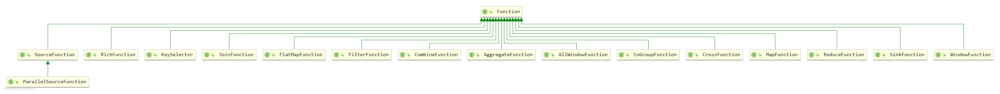

在继承树中，可以看到已经使用过的`SourceFunction`，`KeySelector`，`MapFunction`，`FilterFunction`等等，还有即将介绍的`RichFunction`。

在Flink中，所有的函数式接口都有其富函数版本，并且富函数类一般都是以抽象类的形式存在。

**`RichFunction`接口的继承树**


相对于一般的算子，富函数版本算子提供了两项极为强大的功能，一是，提供了算子生命周期相关的方法；二是提供了可以获取运行环境的上下文的方法。

**`RichFunction`接口的定义：**

```Java
public interface RichFunction extends Function {

    void open(Configuration parameters) throws Exception;

    void close() throws Exception;

    // ------------------------------------------------------------------------
    //  Runtime context
    // ------------------------------------------------------------------------

    /**
     * Gets the context that contains information about the UDF's runtime, such as the parallelism
     * of the function, the subtask index of the function, or the name of the task that executes the
     * function.
     *
     * <p>The RuntimeContext also gives access to the {@link
     * org.apache.flink.api.common.accumulators.Accumulator}s and the {@link
     * org.apache.flink.api.common.cache.DistributedCache}.
     *
     * @return The UDF's runtime context.
     */
    RuntimeContext getRuntimeContext();

    /**
     * Gets a specialized version of the {@link RuntimeContext}, which has additional information
     * about the iteration in which the function is executed. This IterationRuntimeContext is only
     * available if the function is part of an iteration. Otherwise, this method throws an
     * exception.
     *
     * @return The IterationRuntimeContext.
     * @throws java.lang.IllegalStateException Thrown, if the function is not executed as part of an
     *     iteration.
     */
    IterationRuntimeContext getIterationRuntimeContext();

    /**
     * Sets the function's runtime context. Called by the framework when creating a parallel
     * instance of the function.
     *
     * @param t The runtime context.
     */
    void setRuntimeContext(RuntimeContext t);
}
```

**方法介绍：**

-   **生命周期，指的是函数式接口的实现类对象的生命周期，从对象创建开始，到对象回收结束。每一个并行子任务都有自己的生命周期**
    -   **`open()`方法，方法定义的逻辑会随着生命周期的开始而被执行。因此，类似于文件IO，数据库连接，配置文件读取等只需要进行一次的操作适合定义在`open()`方法中**
    -   **`close()`方法，方法定义的逻辑会随着生命周期的结束而被执行，因此，类似于关闭数据库连接，释放资源的操作适合定义在`close()`方法中**
-   **运行时环境，指算子的并行子任务在运行时所处的环境，通过运行时环境的上下文对象，能够获取并行子任务相关的元数据信息，例如，并行子任务的名称、并行度、以及索引号。**
    -   **`getRuntimeContext()`方法，用于获取运行时上下文对象**
    -   **`getIterationRuntimeContext()`，用于获取运行时上下问对象，相较于`getRuntimeContext()`方法，`getIterationRuntimeContext()`方法获得的上下文对象能够获取更多的信息，例如累加器的值**
    -   **`setRuntimeContext(RuntimeContext t)`，用于设置运行时对象，一般不使用**

**演示示例：**

```Java
/**
 * @author shaco
 * @create 2023-03-10 14:43
 * @desc 富函数演示，使用RichMapFunction进行演示
 */
public class C011_RichMapFunction {
    public static void main(String[] args) throws Exception {
        // TODO 1、创建流执行环境
        StreamExecutionEnvironment env = StreamExecutionEnvironment.getExecutionEnvironment();
        env.setParallelism(2);

        // TODO 2、创建数据源，使用流式数据
        DataStreamSource<WebPageAccessEvent> webPageAccessEventDS = env.fromElements(
                new WebPageAccessEvent("Anna", "/home", "1000"),
                new WebPageAccessEvent("Bob", "/favor", "2000")
        );

        // TODO 3、富函数演示
        SingleOutputStreamOperator<String> mapDS = webPageAccessEventDS.map(
                new RichMapFunction<WebPageAccessEvent, String>() {
                    // 生命周期方法
                    @Override
                    public void open(Configuration parameters) throws Exception {
                        System.out.println("生命周期开始");
                    }

                    @Override
                    public void close() throws Exception {
                        System.out.println("生命周期结束");
                    }

                    @Override
                    public String map(WebPageAccessEvent value) throws Exception {
                        // 获取运行时环境上下文对象
                        RuntimeContext rc = getRuntimeContext();
                        // 获取任务id
                        System.out.println(rc.getJobId());
                        // 获取子任务索引号
                        System.out.println(rc.getIndexOfThisSubtask());
                        // 获取并行度
                        rc.getNumberOfParallelSubtasks();
                        // ......

                        return "null";
                    }
                }
        );

        mapDS.print();

        env.execute();
    }
}
```

## 4.5、Flink的数据分区

Flink的数据分区策略与Spark的分区策略相似，当上下游子任务的并行度不同时，那么必然会出现数据应该去往哪个分区的问题。Flink中针对数据分区的问题提供了5中策略，相应地内嵌了5种方法。

### 4.5.1 shuffle—随机分区

通过调用DataStream的`shuffle()`方法，将数据随机地分配到下游算子的并行任务中去。随机分区服从均匀分布，可以将数据均匀地发送到下游任务的并行子任务中。

### 4.5.2 Round-Robin—轮询分区

轮询分区，顾名思义，就是按顺序依次“发牌”。通过调用DataStream的`rebalance()`方法，可以将数据轮询重分区。轮询分区使用的是负载均衡算法，可以将输入流数据平均分配到下游的并行子任务中去。

### 4.5.3 rescale—重缩放分区

重缩放分区和轮询分区非常相似，其底层使用的也是轮询分区，但不同于轮询分区，是面向所有下游并行子任务进行“发牌”，重缩放分区只会面向下游部分并行子任务进行轮询“发牌”。

在重缩放分区中，上游并行子任务是“发牌人”，数据是“扑克牌”，下游并行子任务是”玩家“。轮询分区是，上游每一个“发牌人”面向下游所有”玩家“将自己手中的“牌”轮流发放；重缩放分区是上游每一个“发牌人”针对下游部分”玩家“进行轮询”发牌“。

至于上游”发牌人“会选择哪些”玩家“进行发牌，取决于”发牌人“和”玩家“的数量。

当”发牌人“的数量是”玩家“的整数倍时，每个”发牌人“都会对等量的”玩家“进行”发牌“。

而当”发牌人“数量和”玩家“数量不匹配时，目前不知道是怎样进行重缩放分区。

**另外，需要说明的是，轮询分区和重缩放分区的最为核心的不同点在于其并行子任务的连接机制不同。轮询分区时，上游所有的并行子任务都会与下游所有的并行子任务建立连接，而重缩放分区只会在进行数据分配的并行子任务之间建立连接。**

### 4.5.4 broadcast—广播

广播是一种很重要的数据分配方式，而不是分区方式，因为经过广播之后，每一个分区都会保留一份数据。通过调用DataStream的`broadcast()`，可以将数据复制并发送到下游的每一个并行子任务中。

更为重要的是，经过广播之后的数据流，称为广播流。

### 4.5.5 global—全局分区

全局分区也是一种特殊的分区方式。这种做法非常极端，通过调用`global()`方法，会将所有的输入流数据都发送到下游算子的第一个并行子任务中去。这就相当于强行让下游任务并行度变成了 1，会给下游算子的第一个并行子任务带来极大的压力。

### 4.5.6 自定义分区

当内嵌的分区方式还无法满足需求时，可以通过调用`partitionCustom()`方法来自定义分区策略。

`partitionCustom()`方法需要传入两个参数，第一个是分区器，第二个是分区字段。

**`partitionCustom()`方法定义：**

```Java
public <K extends Comparable<K>> PartitionOperator<T> partitionCustom(Partitioner<K> partitioner, KeySelector<T, K> keyExtractor) {
    final TypeInformation<K> keyType = TypeExtractor.getKeySelectorTypes(keyExtractor, getType());
    
    return new PartitionOperator<>(
            this,
            new Keys.SelectorFunctionKeys<>(keyExtractor, getType(), keyType),
            clean(partitioner),
            Utils.getCallLocationName()
    );
}
```

**演示示例：**

```Java
/**
 * @author shaco
 * @create 2023-03-10 16:12
 * @desc 用户自定义分区
 */
public class Demo2 {
    public static void main(String[] args) throws Exception {
        // 1、创建流执行环境
        StreamExecutionEnvironment env = StreamExecutionEnvironment.getExecutionEnvironment();

        // 2、读取数据源
        DataStreamSource<String> stringDataStreamSource = env.fromElements(
                "hello world",
                "hello java",
                "hello scala",
                "hello python",
                "hello flink"
        );

        // 3、为每条数据附上一个key
        SingleOutputStreamOperator<Tuple2<Integer, String>> mapDS = stringDataStreamSource.map(
                new RichMapFunction<String, Tuple2<Integer, String>>() {
                    @Override
                    public Tuple2<Integer, String> map(String value) throws Exception {
                        Tuple2 data = Tuple2.of(new Random().nextInt(10), value);
                        return data;
                    }
                }
        );

        // 4、进行自定义分区
        mapDS.partitionCustom(
                new Partitioner<Integer>() {
                    @Override
                    public int partition(Integer key, int numPartitions) {
                        // numPartitions是默认的分区数量，取值为CPU的核心数量
                        return key;
                    }
                },
                new KeySelector<Tuple2<Integer, String>, Integer>() {
                    @Override
                    public Integer getKey(Tuple2<Integer, String> value) throws Exception {
                        return value.f0;
                    }
                }
        ).print(">>>>");

        // 5、执行流数据处理
        env.execute();
    }
}
```

## 4.6、Sink Operator

Flink与外部数据的交互，无论是读取数据，还是将数据写出到外部系统，都非常容易。但是问题在于，Flink是一个分布式实时流数据处理框架，对稳定性和容错性要求极高，当Flink与外部系统交互，出现故障时该如何处理？

因此，对于读取数据，Flink内嵌了`addSource()`方法，对于写出数据，Flink相应的内嵌了`addSink()`方法。

在之前的演示示例中，经常使用的`print()`方法就是一种`Sink`算子。

Flink官方对常见的数据存储系统提供了预定义的Sink。

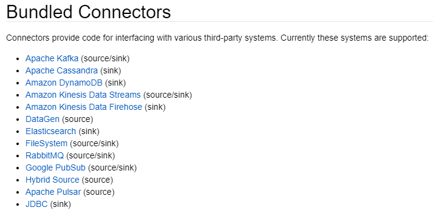

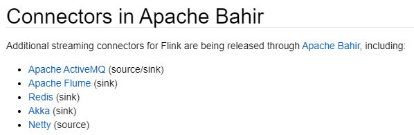

### 4.6.1、写入到本地文件

在较早的版本中，Flink提供了一些较为简单直接地将数据写入本地文件的方式，例如，`writeAsText()`、`writeAsCsv()`。但这些方法不支持同时写入一份文件，因此，降低了数据写入的效率，在后续版本中逐渐过时。

Flink为数据写入到本地文件专门提供了一个流式文件系统连接器：`StreamingFileSink`。`StreamingFileSink`继承自抽象类`RichSinkFunction`，并集成了Flink一致性检查点机制。

```Java
public class StreamingFileSink<IN> extends RichSinkFunction<IN> implements CheckpointedFunction, CheckpointListener {
}
```

`StreamingFileSink`为批处理和流处理提供了一个统一的Sink，它可以保证精确一次的状态一致性，大大改进了之前流式文件Sink的方式。它的主要操作是将数据写入桶（buckets），每个桶中的数据都可以分割成一个个大小有限的分区文件，这样一来就实现真正意义上的分布式文件存储。在代码中，可以通过各种配置来控制“分桶”的操作，默认的分桶方式是基于时间，每隔一个小时分一次桶。

>   **桶在本地文件中的体现是目录，分区文件是真正存储数据的文件。**

`StreamingFileSink`支持行编码（Row-encoded）和批量编码（Bulk-encoded），不同的编码方式决定的数据的存储方式，行编码表示数据在存储过程中，一条数据占据一行；批量编码一般将数据进行列式存储，例如列式存储Parquet。

两种不同的编码方式都有各自的构建器，通过`StreamingFileSink`调用不同的静态方法能够实现不同数据存储格式。

**演示示例**

```java
/**
 * Author: shaco
 * Date: 2023/3/12
 * Desc: Sink算子，写入到本地文件
 */
public class C012_WriteToLocalFileSink {
    public static void main(String[] args) throws Exception {
        // TODO 1、创建流执行环境
        StreamExecutionEnvironment env = StreamExecutionEnvironment.getExecutionEnvironment();
        // 此处的并行度设置，主要是为了限制以下Sink算子，如果不设置并行度，默认使用CPU核心数量，那么会有16个分区文件
        env.setParallelism(4);

        // TODO 2、获取数据源
        DataStreamSource<WebPageAccessEvent> webPageAccessEventDS = env.addSource(new WebPageAccessEventSource());

        // TODO 3、将数据转换成String
        SingleOutputStreamOperator<String> resDS = webPageAccessEventDS.map(
                new MapFunction<WebPageAccessEvent, String>() {
                    @Override
                    public String map(WebPageAccessEvent value) throws Exception {
                        return value.toString();
                    }
                }
        );

        // TODO 4、写入到本地文件中
        // 行编码模式
        resDS.addSink(
                // 此处的泛型方法，泛型表示需要进行持久化的数据的数据类型
                StreamingFileSink.<String>forRowFormat(new Path("./output/"), new SimpleStringEncoder<>("UTF-8"))
                        .withRollingPolicy(
                                DefaultRollingPolicy.builder()
                                        // 文件回滚策略设置
                                        .withInactivityInterval(TimeUnit.MINUTES.toMillis(5)) // 设置非活跃时间间隔，单位：毫秒
                                        .withRolloverInterval(TimeUnit.MINUTES.toMillis(15)) // 设置文件回滚间隔，单位：毫秒
                                        .withMaxPartSize(1024 * 1024 * 1024) // 设置文件大小，单位：字节
                                        .build()
                        )
                        .build()
        );

        // TODO 流数据处理执行
        env.execute();
    }
}
```

**输出结果**

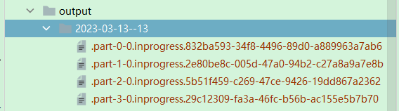

### 4.6.2、输出到Kafka

Flink预定义Source和Sink都对Kafka做了实现（都在`flink-connector-kafka-2.12`包中），并且Flink与Kafka的连接提供了端到端的精确一次性语义保证。因此Flink与Kafka通常都是成对出现。

>   **Flink写出到Kafka时，在`addSink()`方法中，传入的参数是FlinkKafkaProducer，继承自抽象类TwoPhaseCommitSinkFunction，这是一个实现了“两阶段提交”的RichSinkFunction。两阶段提交提供了Flink向Kafka写入数据的事务型保证，能够真正做到精确一次性的状态一致性。**

**演示示例：写入到Kafka**

```Java
/**
 * @author shaco
 * @create 2023-03-13 14:40
 * @desc Sink算子，写出到Kafka
 */
public class C013_WriteToKafkaSink {
    public static void main(String[] args) throws Exception {
        // TODO 1、创建流执行环境
        StreamExecutionEnvironment env = StreamExecutionEnvironment.getExecutionEnvironment();
        env.setParallelism(1);

        // TODO 2、读取数据源
        DataStreamSource<WebPageAccessEvent> webPageAccessEventDS = env.addSource(new WebPageAccessEventSource());

        // TODO 3、转换成String直接写入到Kafka
        SingleOutputStreamOperator<String> mapDS = webPageAccessEventDS.map(
                new MapFunction<WebPageAccessEvent, String>() {
                    @Override
                    public String map(WebPageAccessEvent value) throws Exception {
                        return value.toString();
                    }
                }
        );

        mapDS.addSink(
                new FlinkKafkaProducer<String>("hadoop132:9092", "sink_topic", new SimpleStringSchema())
        );

        // TODO 4、执行流数据处理
        env.execute();
    }
}
```

### 4.6.3、输出到Redis

### 4.6.4、输出到Elasticsearch

### 4.6.5、输出到MySQL（JDBC）

将数据写入到MySQL，以及其他JDBC协议的关系型数据库中，需要添加两项依赖，一是Flink的JDBC连接器，二是关系型数据库的JDBC 驱动。

```xml
<!-- Flink JDBC 连接器依赖包-->
<dependency>
    <groupId>org.apache.flink</groupId>
    <artifactId>flink-connector-jdbc_${scala.binary.version}</artifactId>
    <version>${flink.version}</version>
</dependency>
<!-- MySQL依赖包 -->
<dependency>
    <groupId>mysql</groupId>
    <artifactId>mysql-connector-java</artifactId>
    <version>8.0.26</version>
</dependency>
```

**演示示例，将数据写入到MySQL**

```Java
/**
 * @author shaco
 * @create 2023-03-13 19:25
 * @desc Sink算子演示，写入到MySQL
 */
public class C014_WriteToMySQLSink {
    public static void main(String[] args) throws Exception {
        // TODO 1、创建流执行环境
        StreamExecutionEnvironment env = StreamExecutionEnvironment.getExecutionEnvironment();
        env.setParallelism(1);

        // TODO 2、获取数据源
        DataStreamSource<WebPageAccessEvent> webPageAccessEventDS = env.fromElements(
                new WebPageAccessEvent("Anna", "./home", "1000"),
                new WebPageAccessEvent("Bob", "./favor", "2000")
        );

        // TODO 3、将数据写入到MySQL中
        webPageAccessEventDS.addSink(
                JdbcSink.sink(
                        "INSERT INTO demo (user, url) VALUES (?, ?)",
                        new JdbcStatementBuilder<WebPageAccessEvent>() {
                            @Override
                            public void accept(PreparedStatement preparedStatement, WebPageAccessEvent webPageAccessEvent) throws SQLException {
                                preparedStatement.setString(1, webPageAccessEvent.userName);
                                preparedStatement.setString(2, webPageAccessEvent.url);
                            }
                        },
                        new JdbcConnectionOptions.JdbcConnectionOptionsBuilder()
                                .withUrl("jdbc:mysql://localhost:3306/test")
                                .withDriverName("com.mysql.cj.jdbc.Driver")
                                .withUsername("root")
                                .withPassword("1234")
                                .build()
                )
        );

        // TODO 4、执行流数据处理
        env.execute();
    }
}
```

### 4.6.6、输出到HDFS

### 4.6.7、自定义Sink

在进行自定义Sink地时候需要考虑从一致性检查点进行故障恢复的问题，对于开发者而言这是较为复杂的事情，因此，不建议自定义Sink。如果需求特殊，必须进行自定义Sink，那么只能牺牲一定的数据准确性。

# 五、时间语义、水位线、窗口

Flink是一个分布式流式数据处理框架，分布式设计带来了更高的吞吐量，而流式数据处理对Flink系统在时间处理方面提出了更高的要求。

**Flink中的时间语义：**

-   **事件时间：是指数据生成时的时间。**
-   **摄入时间：数据进入Flink系统时的时间**
-   **处理时间：是指数据被Flink系统处理时的时间**

**在Flink中，时间的单位都是毫秒。**

**==Flink官方建议使用事件时间==**

**水位线：Flink中用来衡量数据流进展的标记，称作“水位线（Watermark）”。**

水位线是一种特殊的数据，是插入数据流中的一个标记点，其内容是一个时间戳。

**水位线的特性：**

-   水位线是插入到数据流中的一个标记， 可以认为是一个特殊的数据
-   水位线主要的内容是一个时间戳，用来表示当前数据流的进展
-   水位线是基于数据的时间戳生成的
-   水位线的时间戳必须单调递增，以确保任务的数据时钟一直向前推进
-   水位线可以通过设置延迟，来保证正确处理乱序数据
-   水位线的含义是，当水位线到达时间`t1`，表示在时间`t1`（包含`t1`）之前的所有数据均已经达到

## 5.1、水位线的生成策略

根据数据流的不同，会有不同的水位线生成策略。对于有序数据流而言，数据按时间顺序一个一个到来，水位线生成只需要根据数据的时间戳；对于无需数据流而言，由于存在迟到的数据，为了保证数据计算的正确性，需要对迟到数据进行处理，因此在水位线生成时，需要配置数据的乱序程度。

水位线的生成需要依据数据的时间戳，因此水位线生成分为两步，第一步，为数据赋予时间戳，第二步，设置水位线生成策略，生成水位线。

在DataStream API中，调用`assignTimestampAndWatermarks()`方法，用于为数据分配时间戳，以及设置水位线生成策略。Flink对有序数据流和无需数据流提供了内置的水位线生成策略，在使用过程中调用相应的方法即可。

值得说明的是，Flink内置的水位线生成策略都是周期性生成水位线，周期时长是200ms。通过流执行环境的可以设置水位线生成周期：`env.getConfig().setAutoWatermarkInterval(300);`。

**水位线生成代码演示：**

```Java
/**
 * @author shaco
 * @create 2023-03-14 20:19
 * @desc 水位线生成，代码演示
 */
public class C015_GenerateWatermark {
    public static void main(String[] args) throws Exception {
        SimpleDateFormat sdf = new SimpleDateFormat("yyyy-MM-dd hh:mm:ss");

        // TODO 1、创建流执行环境
        StreamExecutionEnvironment env = StreamExecutionEnvironment.getExecutionEnvironment();
        env.setParallelism(1);

        // TODO 2、读取数据源
        DataStreamSource<WebPageAccessEvent> webPageAccessEventDS = env.addSource(new WebPageAccessEventSource());

        // TODO 3、为数据赋予时间戳，并设置水位线生成策略
        // Flink提供的两种水位线生成策略
        // 有序数据流水位线生成
        SingleOutputStreamOperator<WebPageAccessEvent> watermarkGenerateWay1 = webPageAccessEventDS.assignTimestampsAndWatermarks(
                // 泛型方法，泛型表示数据流中的数据类型
                WatermarkStrategy.<WebPageAccessEvent>forMonotonousTimestamps()
                        .withTimestampAssigner( // 分配时间戳
                                new SerializableTimestampAssigner<WebPageAccessEvent>() {
                                    @Override
                                    public long extractTimestamp(WebPageAccessEvent element, long recordTimestamp) {
                                        Long timeStamp = null;
                                        try {
                                            timeStamp = sdf.parse(element.accessTime).getTime() * 1000;
                                        } catch (Exception e) {
                                            e.printStackTrace();
                                        }
                                        return timeStamp;
                                    }
                                }
                        )
        );

        // 乱序数据流水位线生成
        SingleOutputStreamOperator<WebPageAccessEvent> watermarkGenerateWay2 = webPageAccessEventDS.assignTimestampsAndWatermarks(
                WatermarkStrategy.<WebPageAccessEvent>forBoundedOutOfOrderness(Duration.ofMillis(300))
                        .withTimestampAssigner( // 分配时间戳
                                new SerializableTimestampAssigner<WebPageAccessEvent>() {
                                    @Override
                                    public long extractTimestamp(WebPageAccessEvent element, long recordTimestamp) {
                                        Long timeStamp = null;
                                        try {
                                            timeStamp = sdf.parse(element.accessTime).getTime() * 1000;
                                        } catch (Exception e) {
                                            e.printStackTrace();
                                        }
                                        return timeStamp;
                                    }
                                }
                        )
        );

        // TODO 4、打印到控制台
        // watermarkGenerateWay1.print(">>>>>");
        // watermarkGenerateWay2.print("-----");

        // TODO 5、执行流数据处理
        // env.execute();
    }
}
```

当Flink内置的水位线生成策略无法满足的需求的时候，可以自定义水位线生成策略，但一般不建议。

**自定义水位线生成策略演示：**

```Java
/**
 * @author shaco
 * @create 2023-03-14 21:24
 * @desc 自定义水位线生成策略
 */
public class Demo03 {
    public static void main(String[] args) {
        SimpleDateFormat sdf = new SimpleDateFormat("yyyy-MM-dd hh:mm:ss");

        // TODO 1、创建流执行环境
        StreamExecutionEnvironment env = StreamExecutionEnvironment.getExecutionEnvironment();
        env.setParallelism(1);

        // TODO 2、读取数据源
        DataStreamSource<WebPageAccessEvent> webPageAccessEventDS = env.addSource(new WebPageAccessEventSource());

        // TODO 3、自定义水位线生成策略
        SingleOutputStreamOperator<WebPageAccessEvent> webPageAccessEventSingleOutputStreamOperator = webPageAccessEventDS.assignTimestampsAndWatermarks(new CustomerWatermarkStrategy());
    }

    public static class CustomerWatermarkStrategy implements WatermarkStrategy<WebPageAccessEvent> {

        @Override
        public WatermarkGenerator<WebPageAccessEvent> createWatermarkGenerator(WatermarkGeneratorSupplier.Context context) {
            WatermarkGenerator<WebPageAccessEvent> CustomerWatermarkGenerator = new WatermarkGenerator<WebPageAccessEvent>() {
                @Override
                public void onEvent(WebPageAccessEvent event, long eventTimestamp, WatermarkOutput output) {
                    // 如果需要定义非周期性生成的水位线，在这里进行定义，并使用output发送出去
                    // 那么就不需要在onPeriodicEmit方法中写水位线生成策略了
                }

                @Override
                public void onPeriodicEmit(WatermarkOutput output) {
                    // 如果需要定义周期性生成的水位线，在这里进行定义，并使用output发送出去
                    // 那么就不需要在onPeriodicEmit方法中写水位线生成策略了
                }
            };

            return CustomerWatermarkGenerator;
        }
    }
}
```

**水位线在不同算子并行子任务之间的传递**

水位线是一种特殊的标记，会随着数据在任务之间进行传递。如果不同算子之间的“依赖关系”是“窄依赖”，那么数据和水位线的传递就都很简单。但是生产环境中，不同算子之间的血缘关系并不是“窄依赖”，而是“宽依赖”，因此水位线的传递不是直传。

下游算子的每一个并行子任务都将维护一个“List状态”，用于保存上游每个并行子任务传递的水位线，然后将“List状态”中的最小的水位线作为当前并行子任务的水位线，并且，会将更新后的水位线向下游广播。

在Flink中，水位线承担了时钟的角色。也就是说，如果需要知道现在时间推进到了什么时候，需要去查看当前任务的水位线。在后续的窗口操作中，窗口的闭合，以及定时器的出发都需要通过水位线来判断是否达到了触发的时间。

水位线默认的计算公式是：水位线 = 观察到的最大事件事件 - 延时时间（数据乱序程度） - 1毫秒

其中，减去1毫秒是为了在窗口操作中，将窗口的时间限定为左闭右开，这样就能避免不必要的歧义。

在数据流开始之前，Flink会插入一个大小是`-Long.MAX_VALUE`的水位线，在数据流结束的时候，Flink会插入一个`Long.MAX_VALUE`的水位线，保证所有窗口闭合以及所有的定时器都被触发。

对于有界数据流，Flink在读取数据的时候，会插入两次水位线，在最开始时插入`-Long.MAX_VALUE`的水位线，在最后插入`-Long.MAX_VALUE`的水位线，这样就能保证触发所有的定时器了。

## 5.2、窗口操作

### 5.2.1 窗口基本介绍

Flink定义时间语义和水位线，目的是为了对数据做基于时间的相关处理，其中最为常见的操作就是窗口操作。

在前面的演示示例中，每当一条新的数据到来，经过Flink处理后就会处理该数据，并将处理结果输出（打印控制台）。然而当大量数据同时到来，频繁地更新结果，会给Flink系统带来很大的压力。对此，解决方法就是，收集一段时间的数据，然后定期更新结果，而不是每次新数据到来都更新数据。这其实就是开启了一个“窗口”，将符合条件的数据全部收集到之后，当达到一定条件就对“窗口”中的数据进行计算，并输出结果。

区别于Hive、Spark中数据窗口的理解，在Flink中，窗口是一个桶，数据到来后，如果数据满足这个桶的条件，那么这条数据就会被分配到这个桶中，数据源源不断的到来，时间也不断地向前推进，当到达窗口指定的时间后，窗口就会关闭，进而停止收集数据，然后触发计算并输出结果。

**窗口的分类：**

-   **时间窗口：以时间点来定义窗口的开始和结束，窗口中的数据是一段时间内的数据，这个时间可以是事件时间，也可以是处理时间。**
    -   **滑动窗口：窗口大小固定，滑动步长不确定**
    -   **滚动窗口：当滑动窗口的滑动步长等于窗口大小时，滑动窗口就成为了滚动窗口**
    -   **会话窗口：利用会话超时失效的机制来定义窗口。当第一条数据到来之后会开启会话窗口，如果在设置的会话超时时间内有数据到来，那么会话窗口就会一直开启，如果会话超时时间内没有接收到数据，那么会话窗口就会关闭。会话超时时间外的数据再次到来时，会开启新的超时会话窗口。在有迟到数据的情况下，会话窗口非常复杂。**
-   **计数窗口：基于窗口收集到的数据的个数，来决定窗口的启停状态。**
-   **全局窗口：会把相同key的所有数据都分配到同一个窗口中，换句话说，就和没有分配窗口一样，因为窗口把所有数据都放到一起了。对于无界流数据，全局窗口没有结束的时候，因此不会触发计算，如果需要全局窗口进行计算处理，需要自定义触发器（Trigger）。计数窗口的底层实现是基于全局窗口。**

### 5.2.2 窗口API介绍

在介绍窗口API前，先对数据流的分类做一个整理，数据流可以分为：键控流（Keyed-Stream）、非键控流（Non-Keyed-Stream）、广播流（Broadcast-Stream）。

在Flink中，虽然对键控流和非键控流都提供了相应的API，但Flink并不推荐使用非键控流，原因是，在一些场景下，非键控流会将所有的数据分配到一个并行子任务中，这会给Flink数据处理带来性能上的压力。因此，在不必要的情况下，都推荐使用键控流。

无论是键控流还是非键控流，其窗口API的调用过程都是相同的，都是数据流调用API设置窗口类型（开窗口），随后调用窗口函数，定义窗口收集的数据的计算逻辑。

-   **键控流窗口API**

```java 
stream.keyBy(...)
	  .window(...)
	  .xxx(...)
```

-   **非键控流窗口API**

```java
stream.windowAll(...)
      .xxx(...)
```

-   **窗口分配器**

在调用API开窗口时，需要传入一个`WindowAssigner`，即窗口分配器，Flink为上述介绍的窗口提供了不同的预定义，在程序开发时，只需根据需要进行调用即可。

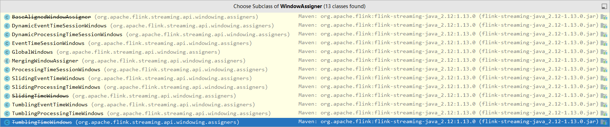

需要留意的是，这些窗口分配器的构造器都是私有的，一般都是通过调用其静态方法，获取其实现类对象。

-   **窗口函数**

数据流调用`window()`方法或者`windowAll()`方法之后，返回结果都是`WindowedStream`，`WindowedStream`需要调用聚合函数才能再次返回`SingleOutputStreamOperator`。

-   **增量窗口函数：**

区别于批处理，增量窗口函数在窗口每到来一条数据就会调用一次，对数据进行一次计算。也区别于一般的`Flink`程序，每到来一条数据就计算一次，并输出结果，增量窗口函数只会在窗口关闭时，将窗口计算结果输出。因此，增量窗口函数是是事件驱动型，窗口每到来一条数据就会对数据进行一次计算，当窗口关闭时，将计算的结果进行输出。

常见的增量窗口函数与之前介绍的算子基本相同：`sum`、`min`、`max`、`minBy`、`maxBy`、`reduce`、`aggregate`。

**==值得说明的是，`sum`、`min`、`max`、`minBy`、`maxBy`、`reduce`等算子的底层实现都是通过实现`aggregate`算子的函数式接口`AggregateFunction`实现的。==**

**`AggregateFunction`接口的定义：**

```Java
public interface AggregateFunction<IN, ACC, OUT> extends Function, Serializable {

    ACC createAccumulator();

    ACC add(IN value, ACC accumulator);

    OUT getResult(ACC accumulator);

    ACC merge(ACC a, ACC b);
}
```

`AggregateFunction`接口定义了三种泛型和四个抽象方法。其中泛型`IN`表示输入数据的类型，泛型`ACC`表示中间计算结果的类型，即累加器的类型，泛型`OUT`表示向下游输出数据的数据类型。

**抽象方法说明：**

-   **`createAccumulator()`：初始化累加器，即定义累加器的初始状态，该方法在整个聚合过程中只会被调用一次**
-   **`add()`：定义输入数据和累加器之间的计算规则，返回值仍旧为一个累加器。该方法在聚合过程中，每到来一条数据就会进行一次调用**
-   **`getResult()`：定义从累加器中获取输出结果的逻辑，这个方法在聚合过程中，只在窗口闭合，需要向下游输出结果时进行调用**
-   **`merge()`：用于定义合并两个累加器的数据的逻辑。这个方法只会在需要进行窗口合并的时候才会被调用，例如会话窗口的使用时，会涉及到窗口合并**

这些算子在窗口中对数据的处理也是一样的流程，都是来一条数据就计算一次结果，但不同于一般的流数据处理，在窗口中，数据的虽然是来一条就计算一次，但其计算结果用累加器保存，只有当窗口关闭，需要对外输出结果时，才会直接将累加器的结果对外输出。

**演示示例：使用`reduce`窗口函数，每10秒计算一次用户的PV**

```Java
/**
 * @author shaco
 * @create 2023-03-17 10:57
 * @desc 窗口操作，窗口分配器 + 窗口函数，演示需求：每10秒钟计算一次用户的PV
 */
public class C016_WindowAssignerAndReduce {
    public static void main(String[] args) throws Exception {
        // TODO 1、创建流执行环境
        StreamExecutionEnvironment env = StreamExecutionEnvironment.getExecutionEnvironment();
        env.setParallelism(1);

        // TODO 2、获取数据源
        DataStreamSource<WebPageAccessEvent> webPageAccessEventDS = env.addSource(new WebPageAccessEventSource());

        // TODO 3、为数据分配时间戳，设置水位线生成策略
        SimpleDateFormat sdf = new SimpleDateFormat("yyyy-MM-dd hh:mm:ss");
        SingleOutputStreamOperator<WebPageAccessEvent> webPageAccessEventDSWithTime = webPageAccessEventDS.assignTimestampsAndWatermarks(
                WatermarkStrategy.<WebPageAccessEvent>forBoundedOutOfOrderness(Duration.ofSeconds(5))
                        .withTimestampAssigner(
                                new SerializableTimestampAssigner<WebPageAccessEvent>() {
                                    @Override
                                    public long extractTimestamp(WebPageAccessEvent element, long recordTimestamp) {
                                        long parseTime = 0L;
                                        try {
                                            Date parse = sdf.parse(element.accessTime);
                                            parseTime = parse.getTime();
                                        } catch (Exception e) {
                                            e.printStackTrace();
                                        }
                                        return parseTime;
                                    }
                                }
                        )
        );

        // TODO 4、对WebPageAccessEvent进行映射，并进行分组
        SingleOutputStreamOperator<Tuple2<String, Long>> reduceDS = webPageAccessEventDSWithTime.map(
                new MapFunction<WebPageAccessEvent, Tuple2<String, Long>>() {
                    @Override
                    public Tuple2<String, Long> map(WebPageAccessEvent value) throws Exception {
                        return Tuple2.of(value.userName, 1L);
                    }
                }
        )
                .keyBy( // 按用户分组
                        new KeySelector<Tuple2<String, Long>, String>() {
                            @Override
                            public String getKey(Tuple2<String, Long> value) throws Exception {
                                return value.f0;
                            }
                        }
                )
                .window(SlidingEventTimeWindows.of(Time.seconds(10), Time.seconds(15))) // 事件时间的滑动窗口，窗口大小10，滑动步长15
                // .window(SlidingProcessingTimeWindows.of(Time.seconds(10), Time.seconds(15))) // 处理时间的滚动窗口，窗口大小10，滑动步长15
                // .window(TumblingEventTimeWindows.of(Time.seconds(10)) // 事件时间的滑动窗口，窗口大小10
                // .window(TumblingProcessingTimeWindows.of(Time.seconds(10)) // 处理时间的滑动窗口，窗口大小10
                .reduce(
                        new ReduceFunction<Tuple2<String, Long>>() {
                            @Override
                            public Tuple2<String, Long> reduce(Tuple2<String, Long> value1, Tuple2<String, Long> value2) throws Exception {
                                // 每10秒计算一次用户PV
                                return Tuple2.of(value1.f0, value1.f1 + value2.f1);
                            }
                        }
                );

        // TODO 5、输出到控制台
        webPageAccessEventDSWithTime.print();
        reduceDS.print(">>>>>>");

        // TODO 6、执行流数据处理
        env.execute();
    }
}
```

**演示示例：使用`aggregate`窗口函数计算PV/UV，即人均重复访问量**

```Java
/**
 * @author shaco
 * @create 2023-03-17 14:12
 * @desc 窗口操作，窗口分配器 + 窗口函数，演示需求：使用aggregate()，求人均重复访问量，即PV/UV
 * PV是所有站点的访问量，UV是是独立用户数量
 */
public class C017_WindowAssignerAndAggregate {
    public static void main(String[] args) throws Exception {
        // TODO 1、创建流执行环境
        StreamExecutionEnvironment env = StreamExecutionEnvironment.getExecutionEnvironment();
        env.setParallelism(1);

        // TODO 2、读取数据源，并分配时间戳和设置水位线生成策略
        SingleOutputStreamOperator<WebPageAccessEvent> webPageAccessEventDS = env.addSource(new WebPageAccessEventSource())
                .assignTimestampsAndWatermarks(
                        WatermarkStrategy.<WebPageAccessEvent>forBoundedOutOfOrderness(Duration.ofSeconds(5))
                                .withTimestampAssigner(
                                        new SerializableTimestampAssigner<WebPageAccessEvent>() {
                                            @Override
                                            public long extractTimestamp(WebPageAccessEvent element, long recordTimestamp) {
                                                return CustomerTimeUtils.stringToTimestamp(element.accessTime, "yyyy-MM-dd hh:mm:ss");
                                            }
                                        }
                                )
                );

        // TODO 3、由于需要计算全部站点的访问量，因此，需要将所有的用户访问都放在一个数据流中，又因为Flink推荐使用键控流，因此，此处将所有数据直接分到同一个组里面
        SingleOutputStreamOperator<Double> aggregateDS = webPageAccessEventDS
                .keyBy(
                        new KeySelector<WebPageAccessEvent, Boolean>() {
                            @Override
                            public Boolean getKey(WebPageAccessEvent value) throws Exception {
                                return true;
                            }
                        }
                )
                .window(TumblingEventTimeWindows.of(Time.seconds(10)))
                .aggregate(
                        new AggregateFunction<WebPageAccessEvent, Tuple2<HashSet<String>, Long>, Double>() {
                            @Override
                            public Tuple2<HashSet<String>, Long> createAccumulator() {
                                // 初始化累加器
                                return Tuple2.of(new HashSet<String>(), 0L);
                            }

                            @Override
                            public Tuple2<HashSet<String>, Long> add(WebPageAccessEvent value, Tuple2<HashSet<String>, Long> accumulator) {
                                // 进行计算
                                accumulator.f0.add(value.userName);
                                return Tuple2.of(accumulator.f0, accumulator.f1 + 1L);
                            }

                            @Override
                            public Double getResult(Tuple2<HashSet<String>, Long> accumulator) {
                                return accumulator.f1 / (double) accumulator.f0.size();
                            }

                            @Override
                            public Tuple2<HashSet<String>, Long> merge(Tuple2<HashSet<String>, Long> a, Tuple2<HashSet<String>, Long> b) {
                                // 合并累加器，有一些情况下，需要对多条流的累加器进行合并，需要定义合并规则
                                // 比如说，在会话窗口中，就需要进行窗口合并
                                a.f0.addAll(b.f0);
                                return Tuple2.of(a.f0, a.f1 + b.f1);
                            }
                        }
                );

        // TODO 4、打印结果到控制台
        webPageAccessEventDS.print();
        aggregateDS.print(">>>>>>");

        // TODO 5、执行流数据处理
        env.execute();
    }
}
```

-   **全量窗口函数：**

在特殊的需求和场景下，数据的计算必须要等到所有数据到齐之后才能进行计算，那么此时就不能使用增量窗口函数，需要使用全量窗口函数。

全量窗口函数会将所有数据都收集到之后，再根据计算逻辑对数据进行计算，这是一种批处理思想。

键控流的全窗口函数有两个`WindowFunction`和`ProcessWindowFunction`。`WindowFunction`出现较早，基于`WindowedStream`调用`apply()`方法传入`WindowFunction`接口的实现类，便能使用全窗口函数。

-   **全窗口函数`WindowFunction`**

```java
stream.keyBy(...)
	  .window(...)
	  .apply(new MyWindowFunction)
```

**`WindowFunction`接口的定义**

```java
public interface WindowFunction<IN, OUT, KEY, W extends Window> extends Function, Serializable {

    void apply(KEY key, W window, Iterable<IN> input, Collector<OUT> out) throws Exception;
}
```

**接口中定义了四个泛型，泛型`IN`表示输入数据的类型，泛型`OUT`表示输出数据的类型，泛型`KEY`表示键控流`key`的数据类型，而`W`表示窗口的类型，对于时间窗口，一般使用`TimeWindow`作为改泛型的数据类型；对于其他类型的窗口，如计数窗口，会话窗口，则使用`GlobalWindow`作为改泛型的数据类型。**

**`WindowFunction`接口定义的抽象方法`apply()`有一个参数`input`，类型为`Iterable<IN>`，该参数即为进入当前窗口的所有数据构成的一个迭代器集合。另一个参数`window`，类型为`w`，改参数即为当前窗口对象，利用该参数调用相应的方法，能够获取当前窗口的相关信息。而参数`out`，类型为`Collettor<OUT>`，则是用于将数据向下游输出数据。**

**演示示例：使用`WindowFunction`计算：每隔20秒统计一次UV**

```Java
/**
 * @author shaco
 * @create 2023-04-11 15:19
 * @desc 窗口操作，全量窗口函数WindowFunction，需求：每隔20s统计一次UV
 */
public class C018_WindowAssignerAndWindowFunction {
    public static void main(String[] args) throws Exception {
        // TODO 1、获取流数据处理环境
        StreamExecutionEnvironment env = StreamExecutionEnvironment.getExecutionEnvironment();
        env.setParallelism(1);

        // TODO 2、获取数据源，并分配事件的事件戳和设置水位线生成策略
        DataStreamSource<WebPageAccessEvent> webPageAccessEventDS = env.addSource(new WebPageAccessEventSource());
        SingleOutputStreamOperator<WebPageAccessEvent> eventDS = webPageAccessEventDS.assignTimestampsAndWatermarks(
                WatermarkStrategy
                        .<WebPageAccessEvent>forBoundedOutOfOrderness(Duration.ZERO)
                        .withTimestampAssigner(new SerializableTimestampAssigner<WebPageAccessEvent>() {
                            @Override
                            public long extractTimestamp(WebPageAccessEvent element, long recordTimestamp) {
                                return CustomerTimeUtils.stringToTimestamp(element.accessTime, "yyyy-MM-dd hh:mm:ss");
                            }
                        })
        );

        // TODO 3、利用键控流统计UV：开事件时间滚动窗口，窗口大小20s
        KeyedStream<WebPageAccessEvent, String> webPageAccessEventKDS = eventDS.keyBy(
                new KeySelector<WebPageAccessEvent, String>() {
                    @Override
                    public String getKey(WebPageAccessEvent value) throws Exception {
                        return "true";
                    }
                }
        );

        SingleOutputStreamOperator<String> resultDS = webPageAccessEventKDS.window(TumblingEventTimeWindows.of(Time.seconds(20)))
                .apply(
                        new WindowFunction<WebPageAccessEvent, String, String, TimeWindow>() {
                            @Override
                            public void apply(String s, TimeWindow window, Iterable<WebPageAccessEvent> input, Collector<String> out) throws Exception {
                                HashSet<String> userColl = new HashSet<>();
                                Long count = 0L;
                                for (WebPageAccessEvent event : input) {
                                    if (!userColl.contains(event.userName)) {
                                        userColl.add(event.userName);
                                        count++;
                                    }
                                }
                                long end = window.getEnd();
                                long start = window.getStart();
                                out.collect(start + " ~ " + end + "，" + count);
                            }
                        }
                );

        // TODO 4、打印控制台
        eventDS.print();
        resultDS.print(">>>>");

        // TODO 5、执行流数据处理
        env.execute();
    }
}
```

-   **全量窗口函数`ProcessWindowFunction`**

```java
stream.keyBy(...)
	  .window(...)
	  .process(new MyProcessWindowFunction)
```

**`ProcessWindowFunction`抽象类的定义**

```java
public abstract class ProcessWindowFunction<IN, OUT, KEY, W extends Window> extends AbstractRichFunction {

    private static final long serialVersionUID = 1L;

    /**
     * Evaluates the window and outputs none or several elements.
     *
     * @param key The key for which this window is evaluated.
     * @param context The context in which the window is being evaluated.
     * @param elements The elements in the window being evaluated.
     * @param out A collector for emitting elements.
     * @throws Exception The function may throw exceptions to fail the program and trigger recovery.
     */
    public abstract void process(KEY key, Context context, Iterable<IN> elements, Collector<OUT> out) throws Exception;

    /**
     * Deletes any state in the {@code Context} when the Window expires (the watermark passes its
     * {@code maxTimestamp} + {@code allowedLateness}).
     *
     * @param context The context to which the window is being evaluated
     * @throws Exception The function may throw exceptions to fail the program and trigger recovery.
     */
    public void clear(Context context) throws Exception {}

    /** The context holding window metadata. */
    public abstract class Context implements java.io.Serializable {
        /** Returns the window that is being evaluated. */
        public abstract W window();

        /** Returns the current processing time. */
        public abstract long currentProcessingTime();

        /** Returns the current event-time watermark. */
        public abstract long currentWatermark();

        /**
         * State accessor for per-key and per-window state.
         *
         * <p><b>NOTE:</b>If you use per-window state you have to ensure that you clean it up by
         * implementing {@link ProcessWindowFunction#clear(Context)}.
         */
        public abstract KeyedStateStore windowState();

        /** State accessor for per-key global state. */
        public abstract KeyedStateStore globalState();

        /**
         * Emits a record to the side output identified by the {@link OutputTag}.
         *
         * @param outputTag the {@code OutputTag} that identifies the side output to emit to.
         * @param value The record to emit.
         */
        public abstract <X> void output(OutputTag<X> outputTag, X value);
    }
}
```

**类中定义了四种泛型，泛型`IN`表示输入数据的类型；泛型`OUT`表示输出数据的类型；泛型`KEY`表示当前窗口用于计算哪个`key`的数据；泛型`W`表示当前窗口的类型。**

**类中定义的抽象方法`process()`有四个参数，参数`KEY key`表示键控流的`key`；参数`Context context`表示当前窗口的上下文对象，该对象包含了当前窗口的所有元数据信息；参数`Iterable<IN> elements`表示当前窗口收集到的所有数据构成的可迭代对象；参数`Collector<OUT> out`是一个用于向下游发送数据的收集器。**

**抽象类`ProcessWindowFunction`是Flink八个处理函数之一，相较于一般的窗口函数或者算子而言，处理函数提供了更为丰富的信息，使得开发者拥有更大的开发自由度，而处理函数提供的丰富信息来源于其内部定义的抽象内部类`Context`。**

**对于`ProcessWindowFuntion`而言，抽象内部类`Context`能够：**

-   **获取当前窗口对象：`.window()`**
-   **获取当前的处理时间：`.currentProcessintTime()`**
-   **获取当前的事件时间水位线：`.currentWatermark()`**
-   **获取当前窗口的状态，以及与当前`key`有关的状态：`.windowState()`**
-   **获取当前`key`的全局状态：`.globalState()`**
-   **向侧输出流发送数据：`.output()`**

**==处理函数`ProcessWindowFunction`无法获取时间相关的服务，因此无法进行定时器相关的代码设计。==**

**演示示例：使用`ProcessWindowFunction`计算：每隔20秒统计一次UV**

```Java
/**
 * @author shaco
 * @create 2023-04-12 10:21
 * @desc 窗口操作，全量窗口函数ProcessWindowFunction，需求：每隔20s统计一次UV
 */
public class C019_WindowAssignerAndProcessWindowFunction {
    public static void main(String[] args) throws Exception {
        // TODO 1、获取流数据处理环镜
        StreamExecutionEnvironment env = StreamExecutionEnvironment.getExecutionEnvironment();
        env.setParallelism(1);

        // TODO 2、获取数据源，并为数据源设置事件时间戳，并设置水位线生成策略
        DataStreamSource<WebPageAccessEvent> inputDS = env.addSource(new WebPageAccessEventSource());
        SingleOutputStreamOperator<WebPageAccessEvent> DS = inputDS.assignTimestampsAndWatermarks(
                WatermarkStrategy.<WebPageAccessEvent>forBoundedOutOfOrderness(Duration.ofSeconds(0))
                        .withTimestampAssigner(
                                new SerializableTimestampAssigner<WebPageAccessEvent>() {
                                    @Override
                                    public long extractTimestamp(WebPageAccessEvent element, long recordTimestamp) {
                                        return CustomerTimeUtils.stringToTimestamp(element.accessTime, "yyyy-MM-dd hh:mm:ss");
                                    }
                                }
                        )
        );

        // TODO 3、开窗，进行数据统计，开启20秒滚动窗口
        SingleOutputStreamOperator<String> process = DS.keyBy(
                new KeySelector<WebPageAccessEvent, String>() {
                    @Override
                    public String getKey(WebPageAccessEvent value) throws Exception {
                        return "true";
                    }
                }
        ).window(TumblingEventTimeWindows.of(Time.seconds(20)))
                .process(
                        new ProcessWindowFunction<WebPageAccessEvent, String, String, TimeWindow>() {
                            @Override
                            public void process(String s, Context context, Iterable<WebPageAccessEvent> elements, Collector<String> out) throws Exception {
                                HashSet<String> userColl = new HashSet<>();

                                for (WebPageAccessEvent event : elements) {
                                    userColl.add(event.userName);
                                }

                                long end = context.window().getEnd();
                                long start = context.window().getStart();
                                out.collect("窗口：" + start + " ~ " + end + " " + userColl.size() + "");

                            }
                        }
                );

        process.print(">>>>");
        inputDS.print();

        env.execute();
    }
}
```

-   **增量聚合函数和全量窗口函数的结合使用**

增量窗口函数对每一条到达窗口的数据都立刻进行计算，将计算结果更新到累加器中，因此数据计算速度快；全量窗口函数则需要收集到所有数据之后才进行计算，但能够提供窗口信息，相当于全量窗口函数只进行数据收集，并提供该窗口的所有元数据信息，至于需要做怎样的计算则是完全由开发者定义，这样的设计使得窗口计算更为灵活。

为了兼顾增量窗口函数和全量窗口函数的优点，数据流开窗后，调用`reduce()`或`aggregate()`方法传入增量窗口函数时，还可以传入全量窗口函数，进而将增量窗口函数和全量窗口函数结合使用。

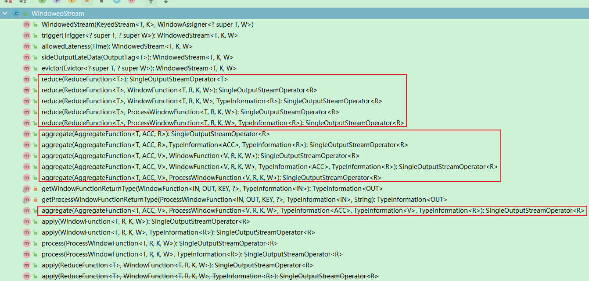

在数据收集的过程中，每到来一条数据都将调用一次增量窗口函数，对数据进行一次计算，并将结果保存到累加器中；等到窗口触发计算时，则将累加器的结果传递到全量窗口函数的迭代器中，随后对结果进行输出。因此在迭代器中只会有一个数据。

**演示示例：增量窗口函数，全量窗口函数结合使用：统计10秒内，url的点击数量，每隔5秒更新一次结果。**

```Java
/**
 * @author shaco
 * @create 2023-04-12 18:04
 * @desc 窗口操作，增量窗口函数和全量窗口函数结合使用，统计10秒内，url的点击数量，每隔5秒更新一次
 */
public class C020_WindowOperateIncreseAndFullWindowFunciton {
    public static void main(String[] args) throws Exception {
        // TODO 1、获取流数据执行环境
        StreamExecutionEnvironment env = StreamExecutionEnvironment.getExecutionEnvironment();
        env.setParallelism(1);

        // TODO 2、读取数据源，设置时间戳，设置水位线生成策略
        DataStreamSource<WebPageAccessEvent> webPageAccessEventDS = env.addSource(new WebPageAccessEventSource());
        SingleOutputStreamOperator<WebPageAccessEvent> webPageAccessEventTDS = webPageAccessEventDS.assignTimestampsAndWatermarks(
                WatermarkStrategy.<WebPageAccessEvent>forBoundedOutOfOrderness(Duration.ofSeconds(0))
                        .withTimestampAssigner(
                                new SerializableTimestampAssigner<WebPageAccessEvent>() {
                                    @Override
                                    public long extractTimestamp(WebPageAccessEvent element, long recordTimestamp) {
                                        return CustomerTimeUtils.stringToTimestamp(element.accessTime, "yyyy-MM-dd hh:mm:ss");
                                    }
                                }
                        )
        );

        // TODO 3、数据处理
        // 按键分组，根据url进行分组
        KeyedStream<WebPageAccessEvent, String> webPageAccessEventKDS = webPageAccessEventTDS.keyBy(
                new KeySelector<WebPageAccessEvent, String>() {
                    @Override
                    public String getKey(WebPageAccessEvent value) throws Exception {
                        return value.url;
                    }
                }
        );

        // 开窗，开滑动窗口，窗口大小10，滑动步长5
        SingleOutputStreamOperator<UrlClickCountWindow> urlClick = webPageAccessEventKDS.window(SlidingEventTimeWindows.of(Time.seconds(10), Time.seconds(5)))
                .aggregate(
                        new AggregateFunction<WebPageAccessEvent, Long, Long>() {
                            @Override
                            public Long createAccumulator() {
                                return 0L;
                            }

                            @Override
                            public Long add(WebPageAccessEvent value, Long accumulator) {
                                return accumulator + 1;
                            }

                            @Override
                            public Long getResult(Long accumulator) {
                                return accumulator;
                            }

                            @Override
                            public Long merge(Long a, Long b) {
                                return null;
                            }
                        }
                        ,
                        // 输出数据类型为UrlClickCountWindow，各属性分别代表：窗口开始时间，窗口结束时间，url，url点击的次数
                        new ProcessWindowFunction<Long, UrlClickCountWindow, String, TimeWindow>() {
                            @Override
                            public void process(String url, Context context, Iterable<Long> elements, Collector<UrlClickCountWindow> out) throws Exception {
                                long start = context.window().getStart();
                                long end = context.window().getEnd();
                                out.collect(new UrlClickCountWindow(start, end, url, elements.iterator().next()));
                            }
                        }
                );

        // TODO 4、打印输出流到控制台
        urlClick.print(">>>>");

        // TODO 5、执行流数据处理
        env.execute();
    }
}
```

**自定义输出`POJO`类**

```Java
/**
 * @author shaco
 * @create 2023-04-12 20:14
 * @desc 定义一个输出用的POJO类，用于测试用例C020的输出
 */
public class UrlClickCountWindow {
    public Long start;
    public Long end;
    public String url;
    public Long count;

    public UrlClickCountWindow() {
    }

    public UrlClickCountWindow(Long start, Long end, String url, Long count) {
        this.start = start;
        this.end = end;
        this.url = url;
        this.count = count;
    }

    public Long getStart() {
        return start;
    }

    public void setStart(Long start) {
        this.start = start;
    }

    public Long getEnd() {
        return end;
    }

    public void setEnd(Long end) {
        this.end = end;
    }

    public String getUrl() {
        return url;
    }

    public void setUrl(String url) {
        this.url = url;
    }

    public Long getCount() {
        return count;
    }

    public void setCount(Long count) {
        this.count = count;
    }

    @Override
    public boolean equals(Object o) {
        if (this == o) return true;
        if (o == null || getClass() != o.getClass()) return false;
        UrlClickCountWindow that = (UrlClickCountWindow) o;
        return Objects.equals(start, that.start) &&
                Objects.equals(end, that.end) &&
                Objects.equals(url, that.url) &&
                Objects.equals(count, that.count);
    }

    @Override
    public int hashCode() {
        return Objects.hash(start, end, url, count);
    }

    @Override
    public String toString() {
        return "UrlClickCountWindow{" +
                "start=" + start +
                ", end=" + end +
                ", url='" + url + '\'' +
                ", count=" + count +
                '}';
    }
}
```

