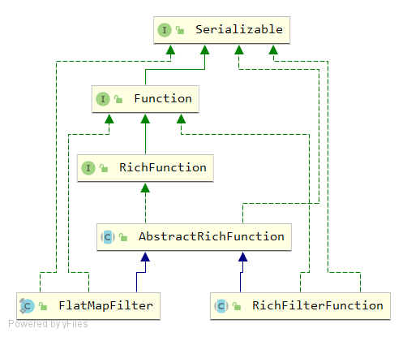
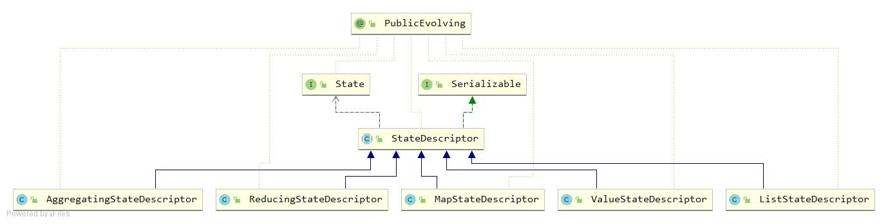
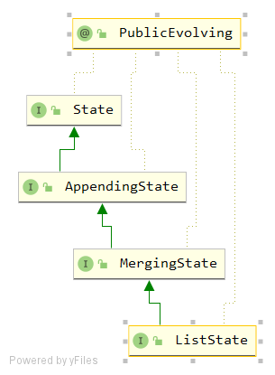

<h1 align = "center">Flink
</h1>

# 一、Flink简介

# 二、Flink部署和运行模式

在不同的部署模式下，`Flink`各组件的启动以及资源获取的方式都有所不同，为此`Flink`提供了三种不同的部署模式。而在不同的运行环境下，`Flink`的资源调度和服务启停也都有所不同，`Flink`根据不同的场景也提供了不同运行模式。

## 2.1、部署模式

为满足不同场景中，集群资源分配和占用方式的需求，`Flink`提供了不同的部署模式。这些模式的主要区别在于：集群的生命周期以及资源的分配方式，以及`Flink`应用中`main`方法到底在哪里执行：`Client`还是`JobManager`。

>   **==一段Flink代码就是一个应用（`Application`）。==**
>
>   **==在一个`Application`中可以存在多个作业（`Job`），一个`Job`由流式执行环境、`Sink`算子、数据处理操作、`Source`算子、流式数据处理执行。==**
>
>   **==一个`Job`包含多个`Flink`算子，一个算子即是一个任务（Task）==**
>
>   **==一个算子由于并行度的属性，所以一个算子可以有很多并行子任务。==**

### 2.1.1 会话模式（`Session Mode`）

会话模式最为符合常规思维：先启动一个`Flink`集群，保持一个会话，在这个会话中通过`Client`提交`Application`，进而提交`Job`。

这样做的好处是，我们只需要一个集群，所有的`Job`提交之后都放到这个集群中去运行，集群的生命周期是超越`Job`的，`Job`执行结束后，就释放资源，集群依然运行。

其缺点也是显而易见的，因为资源是共享的，所以当资源不够时，新提交的`Job`就会失败。此外，如果一个发生故障导致`TaskManager`宕机，那么所有`Job`都会受到影响。

### 2.1.2 单作业模式（`Per-Job Mode`）

会话模式会因为资源共享导致很多问题，所以为了隔离每个`Job`所需要的资源，`Flink`还提供了单作业模式。

单作业模式中，为每个提交的`Job`创建一个集群，由客户端执行`main()`方法，解析出`DataFlowGraph`和`JobGraph`，然后启动集群，并将解析出来的`Job`提交给`JobManager`，进而分发给`TaskManager`执行。`Job `执行完成后，集群就会关闭，该集群的资源就会释放出来。

单作业模式中，每个`Job`都有自己的`JobManager`管理，占用独享的资源，即使发生故障，也不会影响其他作业的运行。

需要注意的是，`Flink`本身无法直接这样运行，所以单作业模式一般都需要借助一些资源调度框架来启动集群，如，`YARN`、`Kubernetes`等。

### 2.1.3 应用模式（`Application Mode`）

会话模式和单作业模式下，应用代码都是在`Client`中执行，然后将执行的二进制数据和相关依赖提交给`JobManager`。这种方式存在的问题是，`Client`需要占用大量的网络带宽，去下载依赖和将二进制数据发送给`JobManager`，并且很多情况下提交`Job`用的都是同一个`Client`，这样就会加重`Client`所在节点的资源消耗。

`Flink`解决这个问题的思路就是：把产生问题的组件干掉，把`Client`干掉，直接把`Application`提交到`JobManager`上运行，进而解析出`DataGraph`和`JobGraph`。除此之外，应用模式与单作业模式没有区别，都是提交`Job`之后才创建集群，单作业模式使用`Client`执行代码并提交`Job`，应用模式直接由`JobManager`执行应用程序，即使`Application`包含多个`Job`，也只创建一个集群。

## 2.2、运行模式

==**本文档所使用`Flink`版本为`Flink 1.13`**==

### 2.2.1 `Local`模式（本地模式）

`Local`模式部署非常简单，直接下载并解压Flink`安装`包即可，不用行进额外的配置。因此，`Local`模式下，`Flink`的数据均存储在本地。

**`Local`模式的部署只需要一台节点，以下以`Hadoop132`节点为例，介绍部署步骤：**

-   **使用`xftp`工具将Flink压缩包`Flink-1.13.0-bin-scala_2.12.tgz`上传到`/opt/software`目录下**

-   **解压到`/opt/moudle`目录下：`tar -zxvf /opt/software/Flink-1.13.0-bin-scala_2.12.tgz -C /opt/module/`**

-   **对`Flink`解压包进行重命名，添加`-local`后缀，表示`Local`运行模式：`mv /opt/software/Flink-1.13.0/ /opt/module/Flink-1.13.0-local`**

-   **配置环境变量：`vim /etc/profile.d/my_env.sh`**

    ```txt
    #`Flink`_HOME
    export `Flink`_HOME=/opt/module/`Flink`-1.13.0-local
    export PATH=$PATH:$`Flink`_HOME/bin
    ```

-   **执行文件，让环境变量生效：`source /etc/profile`**

-   **执行命令，启动`Flink Local`模式：`start-cluster.sh`。`start-cluster.sh`脚本将会依次启动以下服务：**

    ```bash
    [justlancer@hadoop132 ~]$ start-cluster.sh 
    Starting cluster.
    Starting standalonesession daemon on host hadoop132.
    Starting taskexecutor daemon on host hadoop132.
    ```

-   **`hadoop132`节点此时应该运行的服务有：**

    ```txt
    ============== hadoop132 =================
    1971 Jps
    1594 StandaloneSessionClusterEntrypoint
    1871 TaskManagerRunner
    ============== hadoop133 =================
    1142 Jps
    ============== hadoop134 =================
    1140 Jps
    ```

-   **此时访问`hadoop132:8081`可以对Flink进行监控和任务提交**

-   **执行命令，停止`Flink Local`模式：`stop-cluster.sh`**

### 2.2.2 `Standalone`模式（独立部署模式）

`Standalone`模式是一种独立运行的集群模式，这种模式下，`Flink`不依赖任何外部的资源管理平台，集群的资源调度、数据处理、容错机制和一致性检查点等都由集群自己管理。`Standalone`模式的优点是，不需要任何外部组件，缺点也很明显，当集群资源不足或者出现故障，由于没有故障自动转移和资源自动调配，需要手动处理，会导致`Flink`任务失败。

区别于`Local`模式，`Standalone`模式需要进行集群配置，配置集群`JobManager`节点和`TaskManager`节点。

`Flink`集群规划

|  `hadoop132`  |  `hadoop133`  |  `hadoop134`  |
| :-----------: | :-----------: | :-----------: |
| `JobManager`  |     **—**     |     **—**     |
| `TaskManager` | `TaskManager` | `TaskManager` |

-   **再解压一份`Flink`解压包：`tar -zxvf /opt/software/Flink-1.13.0-bin-scala_2.12.tgz -C /opt/module/`**

-   **对`Flink`解压包进行重命名，添加`-standalone`后缀，表示Standalone运行模式：`mv /opt/module/Flink-1.13.0 /opt/module/Flink-1.13.0-standalone`**

-   **修改之前的`Flink_HOME`环境变量：`vim /etc/profile.d/my_env.sh` **

    ```txt
    #`Flink`_HOME
    export `Flink`_HOME=/opt/module/`Flink`-1.13.0-standalone
    export PATH=$PATH:$`Flink`_HOME/bin
    ```

-   **执行命令，使环境变量生效：`source /etc/profile`**

-   **`JobManager`节点配置：`vim /opt/module/Flink-1.13.0-standalone/conf/Flink-conf.yaml`**

-   **`TaskManager`节点配置：`vim /opt/module/Flink-1.13.0-standalone/conf/workers`**

    ```txt
    hadoop132
    hadoop133
    hadoop134
    ```

-   **分发`Flink-1.13.0-standalone`目录：`xsync /opt/module/Flink-1.13.0-standalone/`**

-   **在`hadoop133`、`hadoop134`节点中配置环境变量：`vim /etc/profile.d/my_env.sh`**

    ```txt
    #`Flink`_HOME
    export `Flink`_HOME=/opt/module/`Flink`-1.13.0-standalone
    export PATH=$PATH:$`Flink`_HOME/bin
    ```

**==至此，`Flink Standalone`运行模式已经配置完成，下面将进行集群启动和停止==**

#### 2.2.2.1 `Standalone`运行模式下的会话模式（`Standalone - Session`模式）

-   **来到`JobManager`服务所在的`hadoop132`节点，执行命令，启动`Flink Standalone`运行模式的会话模式：`start-cluster.sh`。`start-cluster.sh`脚本将依次启动以下服务：**

    ```txt
    [justlancer@hadoop132 ~]$ start-cluster.sh 
    Starting cluster.
    Starting standalonesession daemon on host hadoop132.
    Starting taskexecutor daemon on host hadoop132.
    Starting taskexecutor daemon on host hadoop133.
    Starting taskexecutor daemon on host hadoop134.
    ```

-   **此时各节点应该运行的服务有：**

    ```txt
    ============== hadoop132 =================
    1524 StandaloneSessionClusterEntrypoint
    1962 Jps
    1838 TaskManagerRunner
    ============== hadoop133 =================
    1472 Jps
    1410 TaskManagerRunner
    ============== hadoop134 =================
    1468 Jps
    1407 TaskManagerRunner
    ```

    >   **==注意一：`start-cluster.sh`脚本将在<u>本地节点</u>启动一个JobManager，并通过ssh连接到workers文件中所有的worker节点，在每一个节点上启动TaskManager。因此，在`Flink-conf.yaml`配置文件中，配置项`jobmanager.rpc.address`所指定的JobManager所在节点并不是实际的JobManager所在的节点，而是`start-cluster.sh`脚本执行的节点才是JobManager服务所在的节点。==**
    >
    >   **==注意二：在虚拟机上操作时，如果在测试了Local模式后，立刻进行Standalone模式的部署，在执行`start-cluster.sh`脚本时，可能会出现启动的仍旧是Local模式的Flink服务，而不是Standalone模式的Flink集群，即使你的环境变量配置的没有问题。出现这个问题的原因不清楚，解决这个问题的方法是，重启虚拟机即可。==**

-   **访问`hadoop132:8081`，进入`Standalone`模式的`Web UI`，对`Flink`集群进行监控**

-   **执行命令，停止`Standalone - Session`模式的`Flink`集群：`stop-cluster.sh`**

>   **Standalone运行模式下没有单作业部署模式，一方面，Flink本身无法直接以单作业模式启动集群，需要借助资源调度组件；另一方面，Flink本身也没有提供相应的脚本启动单作业模式。**

#### 2.2.2.2 `Standalone`运行模式下的应用模式（`Standalone - Application`模式）

正如前面对应用模式的介绍，应用模式下，直接将`Application`提交到`JobManager`上运行，进而解析出`DataFlowGraph`和`JobGraph`。应用模式下，需要为每一个`Application`创建一个`Flink`集群，进而开启一个`JobManager`。当该`JobManager`执行结束后，该`Flink`集群也就关闭了。

因此，应用模式下，当开启`Flink`集群时，必需要向`Flink`提供包含`Application`的`jar`包。

-   **利用`xftp`组件，将已经写好的`Flink`应用——`WordCount`提交到/opt/module/Flink-1.13.0-standalone/lib目录下**

    ```java
    import org.apache.`Flink`.api.common.functions.FlatMapFunction;
    import org.apache.`Flink`.api.java.functions.KeySelector;
    import org.apache.`Flink`.api.java.tuple.Tuple2;
    import org.apache.`Flink`.streaming.api.datastream.DataStreamSource;
    import org.apache.`Flink`.streaming.api.datastream.KeyedStream;
    import org.apache.`Flink`.streaming.api.datastream.SingleOutputStreamOperator;
    import org.apache.`Flink`.streaming.api.environment.StreamExecutionEnvironment;
    import org.apache.`Flink`.util.Collector;
    
    /**
     * Author: shaco
     * Date: 2023/1/30
     * Desc: 入门案例：有界流的World Count
     */
    public class D1_WorldCount_Bounded {
        public static void main(String[] args) throws Exception{
            // TODO 1、创建流式执行环境
            StreamExecutionEnvironment env = StreamExecutionEnvironment.getExecutionEnvironment();
    
            // TODO 2、读取文件
            // 以下方法是按行读取文件的
            DataStreamSource<String> inputDS = env.readTextFile("input\\text1_world.txt");
    
            // TODO 3、对读取的每一行数据进行拆分，拆分成不同的单词
            SingleOutputStreamOperator<Tuple2<String, Integer>> worldOfOne = inputDS.flatMap(
                    new FlatMapFunction<String, Tuple2<String, Integer>>() {
                        @Override
                        public void flatMap(String value, Collector<Tuple2<String, Integer>> out) throws Exception {
                            // 单词分解
                            // 需要注意的是，数据是一行一行读取，并被处理的
                            String[] worldList = value.split(" ");
    
                            // 遍历单词数组，并添加到Tuple中
                            for (String world : worldList) {
                                // 将(world,1)输出
                                out.collect(Tuple2.of(world, 1));
                            }
                        }
                    }
            );
    
            // TODO 4、分组
            KeyedStream<Tuple2<String, Integer>, String> keyedStream = worldOfOne.keyBy(new KeySelector<Tuple2<String, Integer>, String>() {
                @Override
                public String getKey(Tuple2<String, Integer> value) throws Exception {
                    return value.f0;
                }
            });
    
            // TODO 5、聚合
            SingleOutputStreamOperator<Tuple2<String, Integer>> sum = keyedStream.sum(1);
    
            sum.print();
    
            // TODO 6、执行流式数据处理
            env.execute();
        }
    }
    ```

-   **在`hadoop132`节点执行命令启动 `JobManager`：`standalone-job.sh start --job-classname D1_WorldCount_Bounded`。此处`D1_WorldCount_Bounded`为`Flink Application`的全类名。**

-   **访问`hadoop132:8081`，可以看到`Application`已经提交并处于`Running`状态，但此时数据并没有执行，原因是没有`TaskManager`服务启动。**

>   **由于`WordCount`应用是有限流数据处理，在启动`TaskManager`后，任务就会开始执行，当任务执行结束后`JobManager`就会自动停止并释放资源，此时就看不到`Web UI`了。**

-   **可以在`hadoop132`、`hadoop133`、`hadoop134`中的任意一个节点上启动`TaskManager`：`taskmanager.sh start`**
-   **当启动了`TaskManager`后，任务将很快执行完成，`JobManager`就会释放资源，此时需要手动停止`TaskManager`：`taskmanager.sh stop`**

>   **==需要注意的是，当`JobManager`长时间等不到`TaskManager`启动，获取不到任务执行的资源，那么`JobManager`会自动关闭。==**
>
>   **==手动关闭`JobManager：standalone-job.sh stop --job-classname <Flink Application的全类名>`==**

#### 2.2.2.3 `Standalone`运行模式的高可用部署（`Standalone - HA`模式）

`Standalone`的`HA`模式是通过在集群中配置并运行多个`JobManager`的方式避免出现单点故障的问题。

-   **修改`/opt/module/Flink-1.13.0-standalone/conf/Flink-conf.yaml`文件，增加配置：**

    ```txt
    high-availability: zookeeper
    # 该配置项需要指定namenode的内部通信端口，需要与hdfs-site.xml中的配置项保持同步
    high-availability.storageDir: hdfs://hadoop132:8020/`Flink`/standalone/ha
    # 配置Zookeeper集群的连接地址，其端口号也需要和配置文件中的保持一致
    high-availability.zookeeper.quorum: hadoop132:2181,hadoop133:2181,hadoop134:2181
    high-availability.zookeeper.path.root: /`Flink`-standalone
    high-availability.cluster-id: /cluster_justlancer_`Flink`
    ```

-   **修改配置文件`/opt/module/Flink-1.13.0-standalone/conf/masters`，配置JobManager服务所在节点的列表：**

    ```txt
    hadoop132:8081
    hadoop133:8081
    ```

-   **分发修改后的配置文件：`xsync /opt/module/Flink-1.13.0-standalone/conf/Flink-conf.yaml`，`xsync /opt/module/Flink-1.13.0-standalone/conf/masters`**

>   **注意，`Standalone - HA`模式需要使用`Zookeeper`集群进行状态监控，同时，需要`Hadoop`集群存储数据。本次测试使用的`Hadoop`集群，`HDFS`和`YARN`均为高可用部署，其部署步骤与`Zookeeper`部署步骤参见`Hadoop_HDFS&YARN_HA部署文档.md`**

>   **注意：在`Flink 1.8.0`版本之前，`Flink`如果需要使用`Hadoop`的相关组件，那么需要安装`Hadoop`进行支持。从`Flink 1.8`版本开始，`Flink`不再提供基于`Hadoop`编译的安装包，如果需要`Hadoop`环境支持，需要自行在官网上下载`Hadoop`相关本版的组件，例如需要`Hadoop 2.7.5`环境的支持，需要下载`Flink-shaded-hadoop-2-uber-2.7.5-10.0.jar`等类似的`jar`包，并将该`jar`包上传至`Flink`的`lib`目录下。在`Flink 1.11.0`版本之后，增加了很多重要的新特性，其中就包括增加了对`Hadoop 3.0.0`以及更高版本的支持，不再提供相关`Hadoop`编译的安装包，而是通过配置环境变量完成与`Hadoop`的集成。**
>
>   **本次测试过程中，`Flink`版本为`Flink 1.13`，`Hadoop`版本为`Hadoop 3.1.3`，而`Standalone - HA`模式需要使用`HDFS`服务，因此需要对环境变量`HADOOP_HOME`添加额外的配置。**

-   **对环境变量`HADOOP_HOME`进行补充配置，`hadoop132`、`hadoop133`、`hadoop134`均需要配置：`vim /etc/profile.d/my_env.sh`**

    ```txt
    #HAOODP_HOME
    export HADOOP_HOME=/opt/module/hadoop-3.1.3-ha
    export PATH=$PATH:$HADOOP_HOME/bin:$HADOOP_HOME/sbin
    # 以下两个环境变量为`Flink`集成Hadoop环境所需要的环境变量
    export HADOOP_CONF_DIR=${HADOOP_HOME}/etc/hadoop
    export HADOOP_CLASSPATH=`hadoop classpath`
    ```

-   **执行文件，使环境变量生效：`source /etc/profile`**

-   **启动`Zookeeper`集群：`zk_mine.sh start`**

-   **启动`Hadoop HA`集群，`HDFS HA`集群一定要启动，`YARN HA`可以不用启动，暂时用不到：`start-dfs.sh`**

>   **==注意：以下进行`Standalone HA`集群的启动，其本质是`Standalone - Session`模式的高可用配置，是在`Standalone - Session`模式的基础上，对`JobManager`进行了`HA`配置。对于`Standalone - Application`模式，没有`HA`配置，原因在于`Standalone - Application`模式是在`Application`提交之后才创建`Flink`集群的。在没有资源调度框架的支持下，无法实现`JobManager`的HA配置。==**

-   **启动`Standalone HA`集群：`start-cluster.sh`，此时，各节点启动服务如下：**

    ```bash
    [justlancer@hadoop132 ~]$ start-cluster.sh 
    Starting HA cluster with 2 masters.
    Starting standalonesession daemon on host hadoop132.
    Starting standalonesession daemon on host hadoop133.
    Starting taskexecutor daemon on host hadoop132.
    Starting taskexecutor daemon on host hadoop133.
    Starting taskexecutor daemon on host hadoop134.
    ```

-   **检查各节点所启动的服务，应该有：**

    ```txt
    ============== hadoop132 =================
    4273 JournalNode
    5475 TaskManagerRunner
    3844 NameNode
    4004 DataNode
    4484 DFSZKFailoverController
    5591 Jps
    3546 QuorumPeerMain
    5098 StandaloneSessionClusterEntrypoint
    ============== hadoop133 =================
    2928 DataNode
    3650 StandaloneSessionClusterEntrypoint
    3188 DFSZKFailoverController
    3063 JournalNode
    4007 TaskManagerRunner
    2808 NameNode
    4108 Jps
    2621 QuorumPeerMain
    ============== hadoop134 =================
    1832 QuorumPeerMain
    2457 TaskManagerRunner
    2012 DataNode
    2527 Jps
    ```

-   **访问`Flink`的`Web UI`，访问`hadoop132:8081`，或者`hadoop133:8081`均看到`Flink`的`Web`页面，均可在页面上提交任务以及监控任务运行状态。如果需要查看哪个节点为`leader`，那么需要查看`Zookeeper`的节点信息。**

-   **在`Zookeeper`中查看`JobManager`的主备信息：**

    -   **登录`Zookeeper：zkCli.sh -server hadoop132:2181`**

    -   **查看`/Flink-standalone`节点下的信息：`get /Flink-standalone/cluster_justlancer_Flink/leader/rest_server_lock`**

        ```txt
        [zk: hadoop132:2181(CONNECTED) 7] get /`Flink`-standalone/cluster_justlancer_`Flink`/leader/rest_server_lock
        ��whttp://hadoop132:8081srjava.util.UUID����m�/J
                                                        leastSigBitsJ
                                                                     mostSigBitsxp��&U|�ɡ
        ���E7
        ```

-   **停止`Standclone - HA`模式：`stop-cluster.sh`**

-   **停止`HDFS`集群：`stop-dfs.sh`**

-   **停止`zookeeper`集群：`zk_mine.sh stop`**

### 2.2.3 `YARN`模式

`Standalone`模式由`Flink`自身提供资源调度，无需其他框架，但存在的问题是，当集群资源不够时，`Flink`任务提交就会失败，需要进行手动的资源扩充。

另一方面，`Flink`是大数据计算框架，不是资源调度框架，在需要的时候，只需要和现有的资源调度框架进行集成就好，将专业的事情交给专业的框架来做。

目前，国内使用最为广泛的资源调度框架是`YARN`，国外使用较为广泛的资源框架是`MESOS`。还有使用`Kubernetes（k8s）`进行的容器化部署。以下介绍Flink集成`YARN`是如何进行集群部署的。

**注意：以下所使用的`Hadoop`集群是`HA`部署模式**

>   **正如上面所说，在`Flink 1.11`版本之后，如果`Flink`需要集成`Hadoop`的服务，那么不需要下载相关的`Hadoop`组件jar包，只需要通过环境变量的配置即可实现`Flink`对`Hadoop`环境的依赖。**
>
>   **因此，一定要在有Flink服务的节点配置Hadoop的环境变量：**
>
>   ```txt
>   #HAOODP_HOME
>   export HADOOP_HOME=/opt/module/hadoop-3.1.3-ha
>   export PATH=$PATH:$HADOOP_HOME/bin:$HADOOP_HOME/sbin
>   # 以下两个环境变量为`Flink`集成Hadoop环境所需要的环境变量
>   export HADOOP_CONF_DIR=${HADOOP_HOME}/etc/hadoop
>   export HADOOP_CLASSPATH=`hadoop classpath`
>   ```

`Flink YARN`运行模式前置准备工作：

-   **同样，再解压一份`Flink`解压包：`tar -zxvf /opt/software/Flink-1.13.0-bin-scala_2.12.tgz -C /opt/module/`**

-   **对`Flink`解压包进行重命名，添加`-yarn`后缀，表示`YARN`运行模式：`mv /opt/module/Flink-1.13.0 /opt/module/Flink-1.13.0-yarn`**

-   **修改之前的`Flink_HOME`环境变量：`vim /etc/profile.d/my_env.sh`**

    ```txt
    #`Flink`_HOME
    export `Flink`_HOME=/opt/module/`Flink`-1.13.0-yarn
    export PATH=$PATH:$`Flink`_HOME/bin
    ```

-   **配置上述`Hadoop`的环境变量：`vim  /etc/profile.d/my_env.sh`**

    ```txt
    #HAOODP_HOME
    export HADOOP_HOME=/opt/module/hadoop-3.1.3-ha
    export PATH=$PATH:$HADOOP_HOME/bin:$HADOOP_HOME/sbin
    # 以下两个环境变量为`Flink`集成Hadoop环境所需要的环境变量
    export HADOOP_CONF_DIR=${HADOOP_HOME}/etc/hadoop
    export HADOOP_CLASSPATH=`hadoop classpath`
    ```

-   **执行文件，使环境变量生效：`source /etc/profile`**

**==`Flink YARN`运行模式不需要修改其他配置文件==**

#### 2.2.3.1 `YARN`运行模式下的会话模式（`YARN - Session`模式）

不同于`YARN`的其他模式，`YARN -Session`模式需要先启动一个`YARN`会话，进而在会话中来启动Flink集群。

-   **启动`Zookeeper`集群：`zk_mine.sh start`**

-   **启动`HDFS HA`集群：`start-dfs.sh`**

-   **启动`YARN HA`集群：`start-yarn.sh`**

-   **向`YARN`集群申请资源，开启`YARN`会话，进而会自动启动`Flink`集群：`yarn-session.sh -nm test`**

    ```txt
    # 参数说明
    -nm(--name)					配置在YARN UI界面上显示的任务名称
    
    -d(--detached)				分离模式，YARN会话会前台占用一个客户端会话，使用该参数，可以使YARN会话后台运行
    -jm(--jobManagerMemory)		配置JobManager所需要的内存，默认单位是MB
    -tm(--taskManagerMemory)	配置TaskManager所使用的内存，默认单位是MB
    -qu(--queue)				指定YARN队列名称		
    ```

    >   **在`Flink 1.11.0`版本之前可以使用`-n`参数和`-s`参数分别指定`TaskManager`数量和`Slot`数量。从`Flink 1.11.0`版本开始，便不再使用`-n`参数和`-s`参数。`YARN`会按照需求，动态分配`TaskManager`和`Slot`。所以`YARN - Session`模式是动态分配资源的。**

-   **`YARN - Session`启动后，会给出一个`Web UI`地址以及一个`YARN Application ID`**

    ```txt
    ......
    2023-03-01 10:15:44,724 INFO  org.apache.`Flink`.yarn.YarnClusterDescriptor                  [] - Submitting application master application_1677636908998_0001
    2023-03-01 10:15:45,052 INFO  org.apache.hadoop.yarn.client.api.impl.YarnClientImpl        [] - Submitted application application_1677636908998_0001
    2023-03-01 10:15:45,053 INFO  org.apache.`Flink`.yarn.YarnClusterDescriptor                  [] - Waiting for the cluster to be allocated
    2023-03-01 10:15:45,056 INFO  org.apache.`Flink`.yarn.YarnClusterDescriptor                  [] - Deploying cluster, current state ACCEPTED
    2023-03-01 10:15:52,417 INFO  org.apache.`Flink`.yarn.YarnClusterDescriptor                  [] - YARN application has been deployed successfully.
    2023-03-01 10:15:52,418 INFO  org.apache.`Flink`.yarn.YarnClusterDescriptor                  [] - Found Web Interface hadoop132:36564 of application 'application_1677636908998_0001'.
    JobManager Web Interface: http://hadoop132:36564
    ```

-   **开启`YARN - Session`会话后，就可以通过命令行或者`Flink Web UI`进行作业提交**

>   **==`Flink `作业提交方式和过程将在最后进行介绍。==**

-   **`YARN - Session`会话的关闭：**
    -   **当`YARN - Session`会话前台启动时，直接关闭前台会话即可停止`YARN - Session`**
    -   **当使用`-d`参数，使`YARN - Session`会话后台启动时，使用命令可以停止`YARN - Session`会话：`echo "stop" | yarn-session.sh -id application_XXXXX_XXX`。其中，`application_XXXXX_XXX`为`YARN Application ID`**


#### 2.2.3.2 `YARN`运行模式下的单作业模式（`YARN - Per Job`模式）

在集成了`Hadoop`环境之后，可以使用`YARN`进行资源调度，所以可以部署`YARN`运行模式的单作业部署模式。

`YARN`运行模式的单作业部署模式无需额外的配置，通过不同的脚本命令即可启动`Flink`集群。

-   **利用`xftp`工具将需要执行的`Flink`应用`jar`包上传到`/opt/module/Flink-1.13.0-yarn/lib`目录下。本次测试，依然使用上面的`WordCount`示例。**

-   **执行命令，提交`Application：Flink run -d -t yarn-per-job -c D1_WorldCount_Bounded wc_Flink-1.0.jar`**

    ```txt
    # 命令格式，及参数说明
    `Flink` run -d -t yarn-per-job -c <Application的入口类的全类名> <Application所在jar包>
    -d 		表示分离模式，使用该参数能够使YARN - Per Job模式的会话后台运行
    -t 		用于指定单作业模式
    ```

-   **当`Application`提交完成之后，启动日志会给出一个`YARN Application ID`，通过`YARN ResourceManager Web UI`界面，可以查看任务执行情况。点击`Tracking UI`，能够进入`Flink Web UI`界面，对任务进行监控或取消任务**

>   **==注意：上述`Flink`应用需要读取一个本地文件，是一个有界数据流任务处理，在提交任务之后，由于在`Linux`上没有该文件，所以会自动失败，但不影响`Flink`集群启动。后续将会把该任务替换成无界流数据处理任务。==**
>
>   **==注意：不建议使用这种部署模式，因为在`Flink 1.15`版本之后，`Flink`就不再支持单作业模式了，如果获取单作业模式的优势，需要部署应用模式。==**

-   **查看`YARN`任务中正在执行的`Flink Per Job`任务：`Flink list -t yarn-per-job -Dyarn.application.id=<YARN Application ID>`**
-   **取消正在运行的`Flink`任务：`Flink cancel -t yarn-per-job -Dyarn.application.id=<YARN Application ID>`**

>   **注意：`YARN`会为`Application`中的每一个`Job`开启一个`Flink`集群，当`Job`执行完成时，该`Job`所在的`Flink`集群就会自动释放资源。**

#### 2.2.3.3 `YARN`运行模式下的应用模式（`YARN - Application`模式）

应用模式和会话模式、单作业模式相同，不需要额外的进行配置，直接执行`Application`提交命令即可。

-   **执行命令，提交`Application：Flink run-application -t yarn-application -c <Application的入口类的全类名> <Application所在jar包>`**
-   **同样，当`Application`提交完成后，启动日志会给出`YARN Application ID`，通过`YARN ResourceManager Web UI`界面，可以查看任务执行情况。同样，点击`Tracking UI`，能够进入`Flink Web UI`界面，对任务任务进行监控或取消。**
-   **查看`YARN`任务中正在执行的`Flink Application`任务：`Flink list -t yarn-application -Dyarn.application.id=<YARN Application ID>`**
-   **取消正在运行的`Flink`任务：`Flink cancel -t yarn-application -Dyarn.application.id=<YARN Application ID>`**

>   **说明：在任务提交过程中，可以通过`yarn.provided.lib.dirs`配置项来将`jar`包上传到`Flink`集群所有节点都能访问的地址，一般是`HDFS`，这种方式下jar包可以预先上传到`HDFS`，而不需要单独发送到`Flink`集群，这使得`Application`提交更加轻量。**
>
>   **命令格式：`Flink run-application -t yarn-application -Dyarn.provided.lib.dirs=<远程地址> <jar包所在地址>`**
>
>   **例如：`Flink run-application -t yarn-application -Dyarn.provided.lib.dirs="hdfs://myhdfs/my-remote-Flink-dist-dir" hdfs://myhdfs/jars/my-application.jar`**

#### 2.2.3.4 `YARN`运行模式下的高可用模式（`YARN - HA`模式）

不同于`Standalone - HA`模式，是同时启动多个`JobManager`以避免单点故障的问题。`YARN - HA`模式是利用`YARN`的重试次数来实现高可用的，当`JobManager`宕机后，`YARN`会尝试重启`JobManager`。

此外，`Standalone - HA`模式，一般只适用于`Standalone`的会话模式，而`YRAN - HA`模式适用于`Session`模式、`Per Job`模式以及`Application`模式。

`YARN - HA`模式需要进行额外的参数配置：

-   **在`yarn-site.xml`文件中添加额外的配置：`vim /opt/module/hadoop-3.1.3-ha/etc/hadoop/yarn-site.xml `**

    ```xml
    <property>
        <name>yarn.resourcemanager.am.max-attempts</name>
        <value>5</value>
        <description>The maximum number of application master execution attempts.</description>
    </property>
    ```

-   **分发配置好的`yarn-site.xml`文件：`xsync /opt/module/hadoop-3.1.3-ha/etc/hadoop/yarn-site.xml `**

-   **在`Flink-conf.yaml`文件中添加高可用配置：`vim /opt/module/Flink-1.13.0-yarn/conf/Flink-conf.yaml`**

    ```yaml
    # yarn-site.xml 中配置的是 JobManager 重启次数的上限, `Flink`-conf.xml 中的次数一般小于这个值
    yarn.application-attempts: 4 # 该参数默认值为2
    high-availability: zookeeper
    high-availability.storageDir: hdfs://hadoop132:8020/`Flink`/yarn/ha
    high-availability.zookeeper.quorum: hadoop132:2181,hadoop133:2181,hadoop134:2181
    high-availability.zookeeper.path.root: /`Flink`-yarn
    ```

    >   **==注意：`Flink YARN - HA`模式需要`Hadoop`环境的支持，所以一定要配置环境变量`HADOOP_CLASSPATH`和`HADOOP_CONF_DIR`==**
    >
    >   ```txt
    >   export HADOOP_CONF_DIR=${HADOOP_HOME}/etc/hadoop
    >   export HADOOP_CONF_DIR=`hadoop classpath`
    >   ```

-   **分发配置好的`Flink-conf-yaml`文件：`xsync /opt/module/Flink-1.13.0-yarn/conf/Flink-conf.yaml`**

-   **启动`Zookeeper`集群：`zk_mine.sh start`**

-   **启动`HDFS HA`集群：`start-dfs.sh`**

-   **启动`YARN HA`集群：`start-yarn.sh`**

##### 2.2.3.4.1 `Flink on YARN HA - Session`模式

-   **启动`YARN - Session - HA`模式：`yarn-session.sh -nm test`。`HA`部署下，会话模式启动后仍旧会给出`Flink Web UI`，当`JobManager`宕机并被`YARN`重启后，`Web UI`会发生变化，而已提交的任务会自动重新提交。`Web UI`发生变化后，可以通过`YARN ResourceManger`界面的`Tracking UI`重新进入。**
-   **使用命令行或者`Web UI`可以进行任务提交**
-   **停止`YRAN`会话：**
    -   **当会话是前台启动时，可以直接终止会话**
    -   **当会话是后台启动时，启动日志会给出停止YARN会话的命令：`echo "stop" | yarn-session.sh -id application_XXXXX_XXX`**

##### 2.2.3.4.2 `Flink on YARN HA - Per Job`模式

-   **不同于`Session`模式，`Per Job`模式直接提交任务即可：`Flink run -t yarn-per-job -c <Flink Application 的全类名> <Flink Application 所在jar包>`**
-   **当`Flink`任务执行完成时，会自动停止该`Flink`集群，也可以通过`Flink Web UI`手动停止，或者通过`YARN`命令停止`Flink`集群所对应的任务**

##### 2.2.3.4.3 `Flink on YARN HA - Application`模式

-   **与`Per Job`模式相同，`Application`模式直接提交任务即可：`Flink run-application -t yarn-application -c <Flink Application 的全类名> <Flink Application 所在jar包>`**
-   **当`Flink`任务执行完成时，会自动停止该`Flink`集群，也可以通过`Flink Web UI`手动停止，或者通过`YARN`命令停止`Flink`集群所对应的任务**

## 2.3、Flink任务提交方式和流程

`Flink`任务提交方式分为两种，一种是通过`Flink`集群的`Web UI`进行任务提交；另一种方式是通过命令行的方式。

在不同的运行模式以及部署模式下，`Flink`任务的命令行提交方式略有不同，以下将逐一介绍。

### 2.3.1 通过`Web UI`的方式提交任务

通过`Web UI`的方式提交任务通常用于`Session`部署模式中，原因在于，通常先要能访问`Web UI`。对于`Per Job`模式和`Application`模式，需要先启动`Hadoop`环境（`HDFS`和`YARN`），然后直接向`YARN`提交任务，当`YARN`为该`Flink`任务分配好资源，并部署了`JobManager`后，用户才能访问`Web UI`。所以这两种模式都是任务提交后才能访问`Web UI`，因此不能通过`Web UI`的方式提交任务，只能使用命令行提交任务。对于`Session`模式，首先需要先启动一个`YARN Session`，当`YARN Session`启动好之后，便可以访问`Web UI`，并通过`Web UI`提交任务。

综上，适合通过`Web UI`提交任务的模式有：`Local`、`Standalone - Session`、`Flink on YARN (HA) - Session`。

-   **访问`Web UI`地址，并点击左侧导航栏：`Submit New Job`**
-   **点击右上角`Add New`上传`Flink`任务对应的`jar`包**
-   **点击提交的`jar`包，进行提交参数设置，并提交任务**

-   **任务提交完成后，可以通过左侧导航栏的`JobManager`和`TaskManager`对任务进行监控和撤销**

### 2.3.2 通过命令行的方式提交任务

`Per Job`模式和`Application`模式只能通过命令行的方式提交任务，在前面测试时已经展示，现在统一进行介绍。

-   **`Standalone - Session`模式：==先启动`YARN`会话，随后部署`JobManager`，最后提交任务==**
    -   **启动`Flink`服务：`start-cluster.sh`**
    -   **提交任务：`Flink rum -m <Flink服务（IP:port）> -c <Flink Application 全类名> <Flink Application 所在jar包>`**

>   ==**`Standalone`没有`Per Job`模式**==

-   **`Standalone - Application`模式：==直接提交任务==**

    -   **将`Flink Application` 所在`jar`包上传到`Flink Standalone`集群任意节点的`\${Flink_HOME}/lib`目录下**

    -   **提交任务，启动`JobManager`：`standalone-job.sh start --job-classname <Flink Application 所在jar包>`**

    -   **启动`TaskManager：`taskmanager`.sh start`**

        ```txt
        # 停止JobManager
        standalone-job.sh stop
        # 停止TaskManager
        taskmanager.sh stop
        ```

-   **`Standalone HA - Session`模式：==同`Standalone - Session`==**

-   **`Flink on YARN (HA) - Session`模式：==先开启`YARN`会话，随后部署`JobManager`，最后提交任务==**

    -   **申请开启`YARN Session`：`yarn-session.sh`**
    -   **提交任务：`Flink run -c <Flink Application 的全类名> <Flink Application 所在jar包>`**

    >   **==终止任务需要根据`YARN ResouceManger`中的`Application ID`进行停止，如果停止`YARN Session`任务，那么所有的`Job`都将停止，如果只停止指定的`Job`，那么不会对其他`Job`产生影响。==**

-   **`Flink on YARN (HA) - Per Job`模式：==直接向`YARN`提交任务==**

    -   **提交任务：`Flink run -t yarn-per-job -c <Flink Application的全类名> <Flink Application 所在jar包>`**
    -   **停止任务：`Flink cancel -t yarn-per-job -Dyarn.application.id=<YARN Application ID> `**
    -   **查看任务的运行状态：`Flink list -t yarn-per-job -Dyarn.application.id=<YARN Application ID>`**

-   **`Flink on YARN (HA) - Application`模式：==直接向`YARN`提交任务==**

    -   **提交任务：`Flink run-application -t yarn-application -c <Flink Application的全类名> <Flink Application 所在jar包>`**
    -   **停止任务：`Flink cancel -t yarn-application -Dyarn.application.id=<YARN Application ID>`**
    -   **查看任务的运行状态：`Flink list -t yarn-application -Dyarn.application.id=<YARN Application ID>`**

# 三、Flink运行时架构

`Flink`是一个需要有效分配和管理计算资源，用以进行流数据处理的分布式系统。虽然集成了所有常见的资源调度组件，例如，`YARN`、`Kubernetes`、`Mesos`，但也可以部署为`Standalone`，甚至`Local`模式运行。

下面将对`Flink`的体系架构，各个主要组件如何协调工作，以执行流数据处理，以及如何从故障中恢复。

## 3.1、Flink体系架构

`Flink`运行时架构主要包含两个主要的组件：`JobManager`和`TaskManager`。


严格来讲，`Client`并不是`Flink`应用执行和运行时架构的一部分，而是用于准备和向`JobManager`发送`DataFlowGraph`的组件。随后，`Client`可以和`Flink`集群断开连接（`detached mode`），也可以与Flink集群保持连接（`attached mode`）。`Client`可以作为`Java`或者`Scala`应用程序的一部分运行，或者在命令行中运行。

`JobManager`和`TaskManager`拥有不同的启动方式：直接在机器上作为`Standalone`集群启动、在容器中启动、或者通过`YARN`等资源框架管理并启动。`TaskManager`在启动之后会向`JobManager`汇报自己的状态以及资源情况，进而能够被`JobManager`分配任务。

### 3.1.1 `JobManager`

`JobManager`有许多与协调`Flink`应用程序，分布式执行时相关的职责：`JobManager`决定何时调度下一个`task`(或一组`task`)，对已完成的`task`或执行失败做出反应，协调`checkpoint`，协调故障恢复等等。`JobManager`由三个不同的部分组成:

#### 3.1.1.1 JobMaster

`JobMaster`是`JobManager`中最核心的组件，负责管理单个`Job`的执行。`Flink`集群中可以同时运行多个`Job`，每个`Job`都有自己的`JobMaster`。

在`Job`提交时，`Client`会将`jar`包和已经解析好的`DataFlowGraph`和`JobGraph`发送给`JobMaster`，随后`JobMaster`会将`JobGraph`转换成`ExecutionGraph`，并分发到`TaskManager`中执行。在`Job`运行的过程中，`JobMaster`还会负责所有需要中央协调的操作，比如`CheckPoints`的协调。

#### 3.1.1.2 `ResourceManager`

`ResourceManager`主要负责资源的分配和管理，一个`Flink`进群中只有一个。在`Flink`集群中，资源主要指的是`TaskManager`的`Task Slots`，`Task Slot`是`Flink`集群资源调度的基本单位，主要包含`CPU`资源和内存资源。`Flink`集群运行的每一个`Task`都必须要分配到一个`Slot`上。

需要注意的是，要区分`Flink`的`ResourceManager`和`YARN`的`ResourceManager`。

`Flink`的`ResourceManager`，针对不同的环境和资源调度框架，都提供了具体的实现。

在`Standalone`部署模式下，`TaskManager`是通过配置文件指定的，在`Flink`集群启动的那一刻，`TaskManager`的启动数量和节点位置就已经确定，随后启动成功的`TaskManager`会向`JobManager`的`ResourceManager`注册自己，并汇报`Task Slots`的使用状态。因此，`Flink`的`ResourceManager`只能分配可用的`Task Slots`，当`Task Slots`不够时，无法独立启动新的`TaskManager`，以提供`Task Slots`。

在集成资源调度框架后，例如，`Flink on YARN (HA)`部署模式，当新提交的`Job`申请资源时，`ResourceManager`会将空闲的`Task Slots`分配给`JobMaster`，用以执行新提交的`Job`。当没有足够的`Task Slots`时，`Flink`的`ResourceManager`会向`YARN`的`ResourceManager`发送请求，`YARN`的`ResourceManager`将会开启`Container`，并部署`TaskManager`，以提供`Task Slots`。

此外，`Flink`的`ResourceManager`还负责停止空闲的`TaskManager`，释放集群资源。

#### 3.1.1.3 `Discatcher`

`Dispatcher`提供了一个用于提交`Flink Application`的`REST`接口，并会为每个提交的`Job`启动一个新的` JobMaster`。它还运行 `Flink Web UI `用来提供`Job`执行信息。

### 3.1.2 `TaskManager`

`TaskManager`又被称为`workers`，用于进行数据流的具体计算任务，同时能够缓冲数据流，以及与其他`TaskManager`进行数据交换。

## 3.2、Job提交流程

`Job`总体提交流程


-   **由`Client`通过`Discatcher`提供的`REST`接口，将`Job`提交给`JobManager`**
-   **随后`Discatcher`启动`JobMaster`，将`jar`包和解析好的`DataFlowGraph`和`JobGraph`提交给`JobMaster`**
-   **`JobMaster`将`JobGraph`解析成`ExecutionGraph`，并计算`ExecutionGraph`执行所需要的`Task Slots`数量，并向`Flink ResourceManager`申请`Task Slots`**
-   **`Flink ResourceManager`申请资源：**
    -   **`Standalone`部署模式下，`Flink ResourceManager`将判断当前`Flink`集群中空闲的`Task Slots`是否能够满足需求，如果满足，给`JobMaster`分配资源，如果不满足，由于无法自动启动`TaskManager`，所以该`JobMaster`只能等待资源分配**
    -   **`YARN`部署模式下，`Flink ResourceManager`向`YARN ResourceManager`申请资源，`YARN ResourceManager`将开启`Container`，部署`TaskManager`，并向`Flink ResourceManager`注册可用`Task Slots`，`Flink ResourceManager`获取到足够的`Task Slots`注册后，将开始执行任务**
-   **`JobMaster`将需要执行的任务分发给`TaskManager`，开始执行任务**

`Standalone`运行模式下，`Job`提交流程较为简单，由`Flink ResourceManager`进行资源管理，当资源充足时，直接执行`Job`，当资源不足时，需要等待其他任务执行完成并释放资源。

`YARN`运行模式下，不同部署模式下，任务提交流程略有不同。

在`Flink on YARN (HA) - Session`模式下，首先需要运行一个`YARN Application`，与之对应地启动一个`Container`，用于部署`JobManager`（由于没有任务提交，所以不会启动`TaskManager`），即开启一个`YARN`会话，随后进行任务提交，任务提交过程与总体提交流程基本相同。`Session`模式下，`Application`通过`Client`解析成一个或多个`Job`，随后提交给`JobManager`。

在`Flink on YARN (HA) - Per Job`模式下，不需要启动`YARN Session`，`Client`直接将`Job`提交给`YARN ResourceManager`，随后开启`Container`，部署`JobManager`和`TaskManager`，最后执行任务。`Per Job`模式下，`Application`通过`Client`解析成一个或多个`Job`，随后提交到`YARN ResourceManager`。

`Flink on YARN (HA) - Application`模式与`Flink on YARN (HA) - Per Job`模式基本相似，只是提交给`YARN ResourceManager`的不再是具体的`Job`，而是整个`Application`。一个`Application`包含一个或多个`Job`，这些`Job`都将在`JobManager`中被解析出来，并为每个`Job`启动对应的`JobMaster`。

## 3.3、其他重要概念

除了以上介绍的整体架构和核心组件，Flink还有一系列概念需要介绍，这对理解Flink代码是如何一步一步转换成可执行`Task`，每个`Flink Application`将转换成多少个`Task`，以及需要多少`Task Slots`才能满足`Application`的运行至关重要，只有清楚这些问题，才能依据实际的业务情况，对`Flink`集群进行合理的资源配置。

### 3.3.1、`Parallelism`（并行度）

`Flink Application`的程序结构是为每一条数据定义了一连串的数据处理操作，这些操作被称为`Operator`，或者”算子“。数据在进入`Flink`集群后，会依次调用这些`Operator`。所以`Flink Application`程序的执行就好像是”铁打的算子，流水的数据“。

在`Job`提交过程中，`Flink`程序会被映射成所有`Operator`按照逻辑顺序连在一起的一个`DAG`，这个`DAG`被称为`DataFlow Graph`。在`Flink Web UI`上提交完作业后，点击”`show plan`“就可以看到对应的`DataFlow Graph`。

`Flink Application`的程序结构都以`Source Operator`开始，以`Sink Operator`结束，中间加以数据处理操作。除了`Source Operator`和`Sink Operator`外，数据处理操作不一定是一个`Transformation Operator`，只有进行数据转换处理的方法调用，才是`Transformation Operator`。代码中有一些方法的调用，数据是没有进行转换的，只是对数据属性进行了设置，或者是数据发送方式的定义。例如，`keyBy()`方法调用，`broadcast()`方法调用。

正如上述所说，`Flink`对数据的处理方式是：算子不动，数据流动。为了实现流式数据的分布式计算，`Flink`将`Operator`复制多份，并分发到多个节点上，流式数据到来后，可以随机进入任何一个节点中进行处理，也可以通过设置进入指定的节点中进行处理。这样，一个`Operator`任务就被拆分成多个并行的子任务，这些子任务会在不同的节点中进行运算。

在`Flink`执行过程中，每一个`Operator`可以包含一个或者多个`subTask`，这些`subTask`会在不同的线程、不同的物理机或不同的容器中完全独立地执行。

`Operator`的`subTask`的个数称为该`Operator`的并行度。

一个流程序的并行度，可以认为是所有`Operator`中最大的并行度。

一个流程序中，不同的`Operator`可以具有不同的并行度。

**==并行度的设置以及优先级，以下优先级从高到低==**

-   **为每一个`Operator`单独设置并行度：`Operator`直接调用`setParallelism()`方法**
-   **为`Application`设置全局并行度：流执行环境调用`setParallelism()`方法**
-   **提交`Application`时，设置并行度：**
    -   **`Web UI`提交，在对应输入框中直接添加并行度**
    -   **命令行提交，使用`-p`参数，设置并行度**
-   **`Flink-conf.yaml`配置文件中配置默认并行度：配置`parallelism.default`配置项**


### 3.3.2、`Operator Chain`（算子链）

根据`DataFlow Graph`和`Operator`的并行度，能够计算出每个`Application`将会产生多少个并行子任务，那么这些并行子任务需要多少的`Task Slot`呢？这需要考虑到算子之间数据的传输问题。

类似于`Spark`的宽依赖和窄依赖。

在`Flink`中，如果上游`Operator`的数据向下游`Operator`发送不需要进行`Shuffle`时，那么会将上游`Operator`和下游`Operator`合并成一个”大“的`Task`，这个”大“的`Task`将会被放到同一个`Task Slot`中进行执行，这个”大”的`Task`称为`Operator Chain`。基于`Operator`的合并能够有效减少线程之间的切换和基于缓存的数据交换，在减少延时的同时提高数据处理效率。

如果上游`Operator`的数据向下游`Operator`发送需要进行`Shuffle`时，那么就无法进行`Operator`合并。


### 3.3.3、`DataFlowGraph`、`Job Graph`、`Execution Graph`和`Physical Graph`


-   **`DataFlow Graph`**

    根据`Flink Application`代码生成的最初的`DAG`，用来表示程序的拓扑结构。`DataFlowGraph`中的节点完全对应代码中的`Operator`操作。

    一般在`Client`中生成。

-   `**Job Graph**`

    `DataFlow Graph`经过优化后形成`Job Graph`，主要优化为：根据是否满足窄依赖关系，将多个符合条件的`Operator`合并在一起，形成`Operator China`，减少`Shuffle`过程带来的时间和资源的损耗。

    `Job Graph`确定了当前`Job`中所有任务的划分。

    一般在`Client`中生成，并提交到`JobMaster`。

-   **`Execution Graph`**

    `JobMaster`收到`Job Graph`后，根据并行度的设置，会形成`ExecutionGraph`，是调度层最为核心的数据结构。`Execution Graph`的形成最主要解决了`Task`之间数据传递的方式。

-   **`Physical Graph`**

    `Execution Graph`生成之后，会由`JobMaster`分发给`TaskManager`，各个`TaskManager`会根据`Execution Graph`部署任务，最终的物理执行过程会形成`Physical Graph`，这是具体执行层面的图，并不是一个具体的数据结构。

    `Physical Graph`主要是在`Execution Graph`的基础上，进一步确定数据存放的位置和收发的具体方式。`Physical Graph`形成之后，`TaskManager`就可以对传递来的数据进行计算和处理了。

### 3.3.4、`Task`和`Task Slot`

每个 `worker`（`TaskManager`）都是一个`JVM` 进程，可以在单独的线程中执行一个或多个 `subTask`。为了控制一个`TaskManager`中接受`Task`的，就有了所谓的`Task Slots`（至少一个）。

每个`Task Slot`代表`TaskManager`中资源的固定子集。例如，具有3个`Slot`的`TaskManager`会将其托管内存的1/3用于每个`Slot`。分配资源意味着`subTask`不会与其他`Job`的`subTask`竞争托管内存。

通过调整`Task Slot`的数量，用户可以定义`subTask`如何互相隔离。每个`TaskManager`有一个`Slot`，这意味着每个`Task`组都在单独的 `JVM` 中运行（例如，可以在单独的容器中启动）。具有多个`Slot`意味着更多`subTask`共享同一`JVM`。同一`JVM`中的`Task`共享`TCP`连接（通过多路复用）和心跳信息。它们还可以共享数据集和数据结构，从而减少了每个`Task`的开销。

默认情况下，`Flink`允许`subTask`共享`Slot`，即便它们是不同的`Task`的`subTask`，只要是来自于同一`Job`即可。结果就是一个`Slot`可以支持整个`Job`的`Task`链路。允许`Slot`共享有两个主要优点：

-   `Flink`集群所需的`Task Slot`和作业中使用的最大并行度恰好一样。无需计算程序总共包含多少个`Task`（具有不同并行度）
-   容易获得更好的资源利用。如果没有`Slot` 共享，非密集`subTask（Source / map()）`将占用与密集型`subTask（Window）`一样多的资源。通过`Slot`共享，可以充分利用分配的资源，同时确保繁重的`subTask`在`TaskManager`之间公平分配

# 四、DataStream API

`Flink `有非常灵活的分层`API`设计，其中的核心层就是`DataStream / DataSet API`。由于新版本已经实现了流批一体，`DataSet API`将被弃用，官方推荐统一使用 `DataStream API `处理流数据和批数据。**==下面主要并且默认介绍基本的`DataStream API`用法。==**

`DataStream`（数据流）本身是Flink中一个用来表示数据集合的类（`Class`），编写Flink代码其实就是基于这种数据类型的处理，所以这套核心`API`就以`DataStream`命名。对于批处理和流处理，都可以用这同一套API来实现。

`DataStream`在用法上有些类似于`Java`集合，但又有所不同。`Flink Application`在代码中往往并不关心`DataStream`中具体的数据，而只是用`API`定义出一连串的操作来处理它们，即数据流的“转换”。

一个`Flink Application`，其实就是对`DataStream`的各种转换。具体来说，程序结构基本上由以下几部分构成：

-   **创建流执行环境（`Execution Environment`）**  
-   **读取数据源（`Source`）**
-   **定义数据转换操作（`Transformations`）**
-   **定义计算结果的输出（`Sink`）**
-   **执行流/批数据处理（`Execute`）**

其中，获取环境和执行流/批数据处理，都可以认为是针对执行环境的操作，所以在编写`Flink Application`的过程中，主要关注`Execution Environment`、`Source`、`Transform`、`Sink`。


## 4.0、引入Flink项目的依赖

为了能在`IDEA`开发环境中编写并运行`Flink`代码，需要在`module`的`pom.xml`中引入`Flink`项目的相关依赖，包含，`Flink-java`、`Flink-streaming-java`，以及`Flink-clients`（`Flink`客户端，可以省略）。另外为了便于查看运行日志，还引入`slf4j`和`log4j`进行日志管理。

```xml
<properties>
    <`Flink`.version>1.13.0</`Flink`.version>
    <java.version>1.8</java.version>
    <!-- 定义Scala版本。`Flink`底层实现是Java代码，但`Flink`架构中使用了Akka来实现底层的分布式通信，而Akka是使用Scala开发的 -->
    <scala.binary.version>2.12</scala.binary.version>
    <slf4j.version>1.7.30</slf4j.version>
</properties>

<dependencies>
    <!-- 引入 `Flink` 相关依赖-->
    <!-- `Flink`-java -->
    <dependency>
        <groupId>org.apache.`Flink`</groupId>
        <artifactId>`Flink`-java</artifactId>
        <version>${`Flink`.version}</version>
    </dependency>

    <!-- `Flink`-streaming -->
    <dependency>
        <groupId>org.apache.`Flink`</groupId>
        <artifactId>`Flink`-streaming-java_${scala.binary.version}</artifactId>
        <version>${`Flink`.version}</version>
    </dependency>

    <!-- `Flink`-client -->
    <dependency>
        <groupId>org.apache.`Flink`</groupId>
        <artifactId>`Flink`-clients_${scala.binary.version}</artifactId>
        <version>${`Flink`.version}</version>
    </dependency>

    <!-- 引入日志管理相关依赖-->
    <dependency>
        <groupId>org.slf4j</groupId>
        <artifactId>slf4j-api</artifactId>
        <version>${slf4j.version}</version>
    </dependency>

    <dependency>
        <groupId>org.slf4j</groupId>
        <artifactId>slf4j-log4j12</artifactId>
        <version>${slf4j.version}</version>
    </dependency>

    <dependency>
        <groupId>org.apache.logging.log4j</groupId>
        <artifactId>log4j-to-slf4j</artifactId>
        <version>2.14.0</version>
    </dependency>
</dependencies>

<!-- 配置打包插件 -->
<build>
        <plugins>
                <plugin>
                        <groupId>org.apache.maven.plugins</groupId>
                        <artifactId>maven-assembly-plugin</artifactId>
                        <version>3.0.0</version>

                        <configuration>
                                <descriptorRefs>
                                        <descriptorRef>jar-with-dependencies</descriptorRef>
                                </descriptorRefs>
                        </configuration>

                        <executions>
                                <execution>
                                        <id>make-assembly</id>
                                        <phase>package</phase>
                                        <goals>
                                                <goal>single</goal>
                                        </goals>
                                </execution>
                        </executions>
                </plugin>
        </plugins>
</build>
```

配置日志管理：在`src/main/resources`目录下创建文件`log4j.properties`，添加以下内容

```txt
log4j.rootLogger=error, stdout
log4j.appender.stdout=org.apache.log4j.ConsoleAppender
log4j.appender.stdout.layout=org.apache.log4j.PatternLayout
log4j.appender.stdout.layout.ConversionPattern=%-4r [%t] %-5p %c %x - %m%n
```

## 4.1、创建执行环境（Execution Environment）

`Flink Application`可以在不同的上下文环境中运行：本地`JVM`、远程集群。不同的环境，`Application`的提交运行过程会有所不同，所以，在提交作业执行计算时，必须先获取当前`Flink`的运行环境，从而建立与`Flink`服务之间的联系。只有获取运行环境的上下文信息，才能将具体的任务调度到不同的`TaskManager`执行。

**流执行环境的创建均是调用`StreamExecutionEnvironment`类的静态方法来创建的。**

-   **调用`getExecutionEnvironment()`方法创建流执行环境：最常用的创建执行环境的方法**

    ```java
    // 有重载方法
    StreamExecutionEnvironment env = StreamExecutionEnvironment.getExecutionEnvironment();
    ```

    `getExecutionEnvironment()`方法会根据当前运行的上下文直接得到执行环境。即，如果程序是独立运行的，就返回一个本地执行环境；如果是创建了`jar`包，然后从命令行调用`jar`并提交到集群执行，那么就返回集群的执行环境。

-   **调用`createLocalEnvironment()`方法创建本地执行环境：**

    ```java
    // 有重载方法
    LocalStreamEnvironment env = StreamExecutionEnvironment.createLocalEnvironment();
    ```

-   **调用`createRemoteEnvironment(String host, int port, String... jarFiles)`方法创建集群执行环境**

    ```java
    // 有重载方法
    StreamExecutionEnvironment env = StreamExecutionEnvironment
                    .createRemoteEnvironment(
                            "host", // 集群地址，JobManager所在节点地址
                            port, // 端口号，JobManager进程的端口号
                            "jarFiles" // Application所在的jar包，可变形参，能同时添加多个jar包
                    );
    ```

**执行环境创建后，可以对执行环境进行配置，例如，全局并行度设置，算子链禁用，声明时间语义，以及配置容错机制。**

>   **==批处理执行环境的创建（了解）==**
>
>   类似于流执行环境的创建，批执行环境的创建是通过调用`ExecutionEnvironment`类的静态方法。
>
>   ```java
>   // 批执行环境的创建
>   ExecutionEnvironment executionEnvironment = ExecutionEnvironment.getExecutionEnvironment();
>   LocalEnvironment localEnvironment = ExecutionEnvironment.createLocalEnvironment();
>   CollectionEnvironment collectionsEnvironment = ExecutionEnvironment.createCollectionsEnvironment();
>   ExecutionEnvironment remoteEnvironment = ExecutionEnvironment.createRemoteEnvironment(
>           "host", // 集群地址，JobManager所在节点的地址
>           6123, // JobManager的服务端口
>           "jars" // `Flink` Application所在jar包
>   );
>   ```
>
>   在`Flink 1.12.0`版本中，`Flink DataStream API`新增了一个重要特性，可以支持不同的执行模式，通过简单的设置就可以让`Flink`程序在流处理和批处理之间切换，进而实现了`API`上的批流统一，因此从`Flink 1.12.0`版本开始，`DataSet API`就开始逐步弃用了。
>
>   -   **流执行模式（`STREAMING`）**
>
>       这是`DataStream API`的默认模式，一般用于需要持续实时处理的无界数据流 。
>
>   -   **批执行模式（`BATCH`）**
>
>       专门用于批处理的执行模式, 这种模式下， Flink 处理作业的方式类似于 `MapReduce `框架。
>
>       ```bash
>       # 通过命令行配置BATCH执行模式
>       # 通过命令提交任务时，利用参数-Dexecution.runtime-mode配置执行模式
>       `Flink` run -Dexecution.runtime-mode=BATCH ...
>       ```
>
>       ```java
>       // 在代码中配置执行模式
>       StreamExecutionEnvironment env = StreamExecutionEnvironment.getExecutionEnvironment();
>       env.setRuntimeMode(RuntimeExecutionMode.BATCH);
>       ```
>
>   -   **自动模式（`AUTOMATIC`）**
>
>       在这种模式下，将由程序根据输入数据源是否有界，来自动选择执行模式。
>
>       配置执行模式的方式，同上。

## 4.2、Source Operator

`Flink`程序中，`Source`用于对接数据源，将数据读取到`Flink`集群中，进行才能够进行数据处理。

`Flink`可以从各种来源获取数据，然后构建 `DataStream `进行转换处理。一般将数据的输入来源称为数据源(`data source`)，而读取数据的算子就是源算子（`Source Operator`）。

### 4.2.1 从集合中读取数据

这是最简单的数据读取方式。在代码中直接创建`Java`集合，将需要被Flink读取的数据添加到集合中，最后通过流执行环境对象调用`fromCollection()`方法，将数据读取到`Flink`中。

从集合中读取数据，相当于将数据临时存储到内存中，作为数据源使用，一般用于测试。

```Java
/**
 * @author shaco
 * @create 2023-03-03 10:54
 * @desc 从集合中读取数据
 */
public class C001_ReadMemorySource {
    public static void main(String[] args) throws Exception {
        // TODO 1、创建流式执行环境
        StreamExecutionEnvironment env = StreamExecutionEnvironment.getExecutionEnvironment();
        // 设置全局并行度为1，便于控制台数据打印
        env.setParallelism(1);

        // TODO 2、创建集合，作为数据源
        ArrayList<String> arrayListSource = new ArrayList<>();
        arrayListSource.add("hello world");
        arrayListSource.add("hello java");
        arrayListSource.add("hello scala");
        arrayListSource.add("hello python");
        arrayListSource.add("hello shell");
        arrayListSource.add("hello `Flink`");
        arrayListSource.add("hello spark");

        // TODO 3、从集合中读取数据源
        DataStreamSource<String> stringDataStreamSource = env.fromCollection(arrayListSource);

        // TODO 4、直接在控制台打印数据源
        stringDataStreamSource.print();

        // TODO 5、执行流式数据处理
        env.execute();
    }
}
```

除了将数据添加到集合，再通过`fromCollection()`方法读取数据外，还可以通过`fromElements()`方法，直接读取列举的元素。

```Java
/**
 * @author shaco
 * @create 2023-03-03 10:54
 * @desc 从集合中读取数据
 */
public static void main(String[] args) throws Exception {
    // TODO 1、创建流执行环境
    StreamExecutionEnvironment env = StreamExecutionEnvironment.getExecutionEnvironment();
    env.setParallelism(1);

    // TODO 2、利用fromElement()方法，读取数据源
    DataStreamSource<String> stringDataStreamSource = env.fromElements(
            "hello world",
            "hello java",
            "hello scala",
            "hello python",
            "hello `Flink`"
    );

    // TODO 3、控制台打印数据流
    stringDataStreamSource.print();

    // TODO 4、执行流数据处理
    env.execute();
}
```

### 4.2.2 读取文本文件

读取文本文件可以读取本地文本文件，也可以读取文件系统的文件。

利用流执行环境对象调用`readTextFile()`方法，传入文本文件的路径，进行数据读取。

**需要说明的是，在`IDEA`开发环境中读取文件系统中的文本文件时，需要添加相关的依赖，例如读取`Hadoop`的文件，需要添加以下的依赖：**

```xml
<dependency>
    <groupId>org.apache.hadoop</groupId>
    <artifactId>hadoop-client</artifactId>
    <version>2.7.5</version>
</dependency>
```

在读取文本文件之前首先要准备文本文件。创建文件`input/text2_world.txt`，并添加以下内容

```txt
hello world
hello java
hello scala
hello python
hello shell
hello hadoop
hello flume
hello hive
hello kafka
hello dataX
hello maxwell
hello spark
hello `Flink`
```

将文件上传到`Hadoop`文件系统中：`hadoop -put /home/justlancer/text2_world.txt /input`

```java
/**
 * @author shaco
 * @create 2023-03-03 13:22
 * @desc 读取文本文件作为数据源
 */
public class C002_ReadCharacterFileSource {
    public static void main(String[] args) throws Exception {
        // TODO 1、创建流执行环境
        StreamExecutionEnvironment env = StreamExecutionEnvironment.getExecutionEnvironment();
        env.setParallelism(1);

        // TODO 2、读取文本文件
        // 读取本地文本文件
        DataStreamSource<String> stringDSLocal = env.readTextFile("C:\\my_workplace_git\\`Flink`_api\\input\\text2_world.txt");
        // 读取文件系统中的文本文件
        DataStreamSource<String> stringDSFileSystem = env.readTextFile("hdfs://hadoop132:8020/`Flink`_input/text2_world.txt");

        // TODO 3、打印数据流
        stringDSLocal.print(">>>>");
        stringDSFileSystem.print("====");

        // TODO 4、执行流数据处理
        env.execute();
    }
}
```

### 4.2.3 读取`Socket`文本流数据

从文本文件中读取数据，可以模拟有界数据流；为了模拟无界数据流，可以读取`Socket`文本流数据。

读取`Socket`文本流数据是通过流执行环境调用`socketTextStream()`方法，传入地址和端口号，进行数据读取。

```java
/**
 * @author shaco
 * @create 2023-03-03 14:47
 * @desc 读取socket文本流
 */
public class C003_ReadSocketTextSource {
    public static void main(String[] args) throws Exception {
        // TODO 1、创建流执行环境
        StreamExecutionEnvironment env = StreamExecutionEnvironment.getExecutionEnvironment();
        env.setParallelism(1);

        // TODO 2、读取Socket文本流
        DataStreamSource<String> socketTextStream = env.socketTextStream("hadoop132", 9999);

        // TODO 3、打印数据流
        socketTextStream.print();

        // TODO 4、执行流数据处理
        env.execute();
    }
}
```

### 4.2.4 读取`Kafka`

`Flink`框架并没有为`Kafka`数据源提供内嵌的实现方法，因此只能通过调用`addSource()`方法、实现`SourceFunction`接口。虽然`Flink`没有提供内嵌方法，但Flink提供了一个连接工具`Flink-connertor-kafka`，直接实现了一个消费者`FlinkKakfaConsumer`，用于读取`Kafka`的数据。

读取`Kafka`的数据需要开启`Kafka`服务，这里以`Kafka`集群为例。

-   **启动`Zookeeper`集群：`zk_mine.sh start`**

-   **启动`Kafka`集群：`kf_mine.sh start`**

-   **创建测试用`Kafka`主题`first`，分区数1，副本数1：`kafka-topics.sh --bootstrap-server hadoop132:9092 --create --topic first --partitions 1 --replication-factor 1`**

-   **开启`Kafka`生产者客户端：`kafka-console-producer.sh --bootstrap-server hadoop132:9092 --topic first`**

-   **编写读取`Kafka`数据的`Flink`代码，并运行：**

    ```Java
    /**
     * @author shaco
     * @create 2023-03-06 11:51
     * @desc 读取Kafka数据源
     */
    public class C004_ReadKafkaSource {
        public static void main(String[] args) throws Exception {
            // TODO 1、创建流执行环境
            StreamExecutionEnvironment env = StreamExecutionEnvironment.getExecutionEnvironment();
            env.setParallelism(1);
    
            // TODO 2、配置Kafka消费者属性，以及创建`Flink`KafkaConsumer对象
            // Kafka消费主题
            String topic = "first";
    
            // Kafka连接属性
            Properties kafkaProperties = new Properties();
            kafkaProperties.put("bootstrap.servers", "hadoop132:9092,hadoop133:9092"); // 集群连接地址
            kafkaProperties.put("group.id", "test"); // 设置消费者组
            kafkaProperties.put("key.deserializer", "org.apache.kafka.common.serialization.StringDeserializer");  //  key的反序列化
            kafkaProperties.put("value.deserializer", "org.apache.kafka.common.serialization.StringDeserializer");  // value的反序列化
            kafkaProperties.put("auto.offset.reset", "latest"); // 消费偏移量，最新处开始
    
            `Flink`KafkaConsumer<String> string`Flink`KafkaConsumer = new `Flink`KafkaConsumer<String>(
                    topic,
                    new SimpleStringSchema()
                    , kafkaProperties
            );
    
            // TODO 3、读取Kafka数据源
            DataStreamSource<String> stringKafkaDS = env.addSource(string`Flink`KafkaConsumer);
    
            // TODO 4、打印数据流到控制台
            stringKafkaDS.print();
    
            // TODO 5、执行流数据处理
            env.execute();
        }
    }
    ```

-   **在`Kafka`生产者端随意发送消息，查看`IDEA`控制台打印结果**

### 4.2.5 自定义`Source`

在测试时，如果以上现有`Source`的实现还不能满足需求，那么可以自定义`Source`，并通过流执行环境调用`addSource()`方法，读取自定义数据源。

具体步骤为，自定义类实现`SourceFunction`接口，并重写其两个抽象方法`run()`和`cancel()`。

-   **`run()`方法，在方法中，通过`SourceContext`对象调用`collect()`可以发送数据。为了模拟流式数据，一般需要在`run()`方法中定义一个`while()循环，不断向下游发送数据`**
-   **`cancel()`方法，用于取消向下游发送数据，当Flink程序终止时，会自动调用该方法，也可以在需要的时候创建对象，手动调用`cancel()`方法。典型的自定义流式数据源：在类中声明一个`Boolean`类型的变量`isRunning`，在`run()`方法的`while()`循环中调用，在`cancel()`方法中改变`isRunning`的取值。**

>   **定义流式数据的数据结构，即定义一个类**
>
>   ```java
>   public class WebPageAccessEvent {
>       public String userName;
>       public String url;
>       public String accessTime;
>   
>       public WebPageAccessEvent(){
>   
>       }
>   
>       public WebPageAccessEvent(String userName, String url, String accessTime) {
>           this.userName = userName;
>           this.url = url;
>           this.accessTime = accessTime;
>       }
>   
>       @Override
>       public String toString() {
>           return "WebPageAccessEvent{" +
>                   "userName='" + userName + '\'' +
>                   ", url='" + url + '\'' +
>                   ", accessTime=" + accessTime +
>                   '}';
>       }
>   }
>   ```
>
>   **`Flink POJO`类的特点：**
>
>   -   共有类
>   -   共有属性
>   -   无参构造器
>   -   属性可序列化
>
>   `Flink`会将具有这些特点的类作为一种特殊的`POJO`数据类型来对待，以便于数据的解析和序列化。类中重写`toString()`方法只是为了便于测试观察数据。
>
>   `POJO`类类似于`Scala`中的样例类。

**自定义数据源：**

```Java
/**
 * @author shaco
 * @create 2023-03-03 15:30
 * @desc 自定义网页访问事件数据源
 */
public class WebPageAccessEventSource implements SourceFunction<WebPageAccessEvent> {
    // 自定义数据源，每隔一秒发送一次数据，总共发送100条数据
    public Boolean isRunning = true;
    public Integer count = 0;

    public final String[] users = {"Anna", "Bob", "Carter", "David", "Eric", "Frank", "Green", "Helen", "Jerry", "Kitty"};
    public final String[] urls = {"./start", "./market", "./advertising", "./introduction", "./home", "./login", "./register", "./customer", "./searcher", "./set", "./detail", "./feedback"};
    public String user;
    public String url;

    @Override
    public void run(SourceContext<WebPageAccessEvent> ctx) throws Exception {
        Random random = new Random();
        DateTimeFormatter dateTimeFormatter = DateTimeFormatter.ofPattern("yyyy-MM-dd hh:mm:ss");

        while (isRunning && count <= 100) {
            user = users[random.nextInt(users.length)];
            url = urls[random.nextInt(urls.length)];
            LocalDateTime now = LocalDateTime.now();
            String dateTime = dateTimeFormatter.format(now);

            ctx.collect(new WebPageAccessEvent(user, url, dateTime));
            count++;

            Thread.sleep(1000);
        }

        WebPageAccessEventSource stopObject = new WebPageAccessEventSource();
        stopObject.cancel();
    }

    @Override
    public void cancel() {
        isRunning = false;
    }
}
```

**读取自定义数据源：**

```java
/**
 * @author shaco
 * @create 2023-03-03 15:27
 * @desc 读取用户自定义数据源
 */
public class C005_UserDefinedSource {
    public static void main(String[] args) throws Exception {
        // TODO 1、创建流执行环境
        StreamExecutionEnvironment env = StreamExecutionEnvironment.getExecutionEnvironment();
        env.setParallelism(1);

        // TODO 2、读取自定义数据源
        DataStreamSource<WebPageAccessEvent> webPageAccessEventDS = env.addSource(new WebPageAccessEventSource());

        // TODO 3、打印数据流
        webPageAccessEventDS.print();

        // TODO 4、执行流数据处理
        env.execute();
    }
}
```

**==值得说明的是，通过实现`SourceFunction`接口创建的数据源，其并行度默认为1，并且无法设置并行度，强行设置并行度，会报错。如果想创建并行数据源，那么需要继承`RichParallelSourceFunction`抽象类，同样实现`run()`方法和`cancel()`方法即可，代码逻辑与实现`SourceFunction`接口完全相同。==**

**自定义并行数据源：**

```Java
/**
 * @author shaco
 * @create 2023-03-03 17:18
 * @desc 自定义网页访问事件并行数据源
 */
public class ParallelWebPageAccessEventSource extends RichParallelSourceFunction<WebPageAccessEvent> {
    // 自定义数据源，每隔一秒发送一次数据，总共发送100条数据
    public Boolean isRunning = true;
    public Integer count = 0;

    public final String[] users = {"Anna", "Bob", "Carter", "David", "Eric", "Frank", "Green", "Helen", "Jerry", "Kitty"};
    public final String[] urls = {"./start", "./market", "./advertising", "./introduction", "./home", "./login", "./register", "./customer", "./searcher", "./set", "./detail", "./feedback"};
    public String user;
    public String url;

    @Override
    public void run(SourceContext ctx) throws Exception {
        Random random = new Random();
        DateTimeFormatter dateTimeFormatter = DateTimeFormatter.ofPattern("yyyy-MM-dd hh:mm:ss");

        while (isRunning && count <= 100) {
            user = users[random.nextInt(users.length)];
            url = urls[random.nextInt(urls.length)];
            LocalDateTime now = LocalDateTime.now();
            String dateTime = dateTimeFormatter.format(now);

            ctx.collect(new WebPageAccessEvent(user, url, dateTime));
            count++;

            Thread.sleep(1000);

            ParallelWebPageAccessEventSource stopObject = new ParallelWebPageAccessEventSource();
            stopObject.cancel();
        }
    }

    @Override
    public void cancel() {
        isRunning = false;
    }
}
```

>**==`Flink`的数据类型系统==**
>
>`Flink`是一个分布式流式数据处理框架，其在处理数据时，必不可少的需要对数据进行网络传输和溢写磁盘，那么`Flink`就需要对数据进行序列化和反序列化，因此`Flink`必须要知道所处理的数据的数据类型是什么。
>
>`Flink`有自己一整套类型系统。`Flink`使用`TypeInformation`来统一表示数据类型。`TypeInformation`类是`Flink`中所有类型描述符的基类。它涵盖了类型的一些基本属性，并为每个数据类型生成特定的序列化器、反序列化器和比较器。
>
>`Flink`支持的数据类型：
>
>-   基本类型：所有 `Java `基本类型及其包装类，再加上`Void`、 `String`、 `Date`、 `BigDecimal`和`BigInteger`
>-   数组类型：包括基本类型数组`PRIMITIVE_ARRAY`和对象数组`OBJECT_ARRAY`
>-   复杂数据类型：
>    -   `Java `元组类型`TUPLE`：这是`Flink`内置的元组类型，是`Java API`的一部分。最多`25`个字段，也就是从`Tuple0 ~ Tuple25`，不支持空字段
>    -   `Scala `样例类及`Scala`元组：不支持空字段
>    -   行类型`ROW`：可以认为是具有任意个字段的元组,并支持空字段
>    -   `POJO`： `Flink`自定义的类似于`Java bean`模式的类
>-   辅助类型：`Option`、 `Either`、 `List`、 `Map` 等
>-   泛型类型`GENERIC`
>
>`POJO`类型的定义：
>
>-   类是`public`和独立的，即也没有非静态的内部类
>-   拥有`public`的无参构造器
>-   类中的所有字段是`public`且非`final`的；或者有一个公共的`getter`和`setter`方法，这些方法需要符合`Java bean`的命名规范
>
>`Flink`支持任意`Java`和`Scala`类作为其数据类型。但是如果这些类没有按照`POJO`的格式进行定义，就会被`Flink`当作泛型来处理，此时，`Flink`只能获取泛型的外部数据类型，对类内部属性的数据类型无法获取，进而导致泛型擦除，并且这些内部属性的数据类型将不会由`Flink`进行序列化，而是由`Kryo`进行序列化。
>
>因此，对数据类型的使用，建议如下：
>
>-   简单数据类型，按需使用相应的包装类以及`Void`、 `String`、 `Date`、 `BigDecimal`和`BigInteger`
>
>-   复杂数据类型，一律申明成`POJO`类。
>
>-   `Tuple`类型较为特殊，简单的元组类型，其泛型正常申明即可。对于嵌套元组，需要使用`Flink`提供的`TypeHint`类。`TypeHint`类能够捕获泛型的类型信息，并一直记录下来，为运行时提供足够的信息。在使用时，通过调用`returns()`方法，明确指定`DataStream`中元素的数据类型。
>
>    ```java
>    .returns(new TypeHint<Tuple2<Integer, SomeType>>(){})
>    ```

## 4.3、Transformation Operator 

从数据源读取到数据之后，就可以调用各种`Transformation Operator`，将`DataStream`转换成新的`DataStream`，进行实现业务的处理逻辑。

**==正如上述所说，Flink是一个分部式大数据处理框架，对数据的数据类型非常关注。在`Flink`程序中，几乎每一处都涉及到泛型的使用，常用于标注输入数据、输出数据、中间状态等数据的数据类型，因此，请在编写`Flink`程序时，留意泛型的含义，特别是算子中传入的接口的泛型，因为这些接口的实现类对象就是数据处理的逻辑，其中的泛型决定了输入输出数据的数据类型。==**

### 4.3.1 基本转换算子

#### 4.3.1.1 映射—`map`

`map`，用于将数据流中的数据一一映射成新的数据，即，消费一个数据，就产出一个新的数据，不会多，也不会少。

**`map()`方法的定义：**

```java
public <R> SingleOutputStreamOperator<R> map(MapFunction<T, R> mapper) {

    TypeInformation<R> outType = TypeExtractor.getMapReturnTypes(clean(mapper), getType(), Utils.getCallLocationName(), true);

    return map(mapper, outType);
}
```

`map()`方法需要传入一个`MapFunction`类型的参数，这个参数定义了数据”映射“的规则。

**`MapFunction`接口的定义：**

**==通过`map()`方法的设置可以看出，`map()`方法的输入数据和输出数据的泛型不同，表明输入数据和输出数据的类型可以不同==**

```Java
// <T> 输入数据流的数据类型
// <O> 输出数据流的数据类型
public interface MapFunction<T, O> extends Function, Serializable {

    O map(T value) throws Exception;
}
```

**演示需求：获取每个访问事件`WebPageAccessEvent`的`url`**

```Java
/**
 * @author shaco
 * @create 2023-03-06 14:57
 * @desc map转换算子。需求：获取每个访问事件的url
 */
public class C006_MapTransformation {
    public static void main(String[] args) throws Exception {
        // TODO 1、创建流执行环境
        StreamExecutionEnvironment env = StreamExecutionEnvironment.getExecutionEnvironment();
        env.setParallelism(1);

        // TODO 2、创建数据源，简单起见，直接枚举数据
        DataStreamSource<WebPageAccessEvent> sampleDS = env.fromElements(
                new WebPageAccessEvent("Anna", "./start", "1000"),
                new WebPageAccessEvent("Bob", "./market", "2000"),
                new WebPageAccessEvent("Carter", "./advertising", "3000")
        );

        // TODO 3、调用map()方法，将WebPageAccessEvent类型的访问事件数据转换成String类型的url
        // 方式一：自定义实现类
        SingleOutputStreamOperator<String> mapDS1 = sampleDS.map(new MyMapFunction());

        // 方式二：传入匿名实现类
        SingleOutputStreamOperator<String> mapDS2 = sampleDS.map(
                new MapFunction<WebPageAccessEvent, String>() {
                    @Override
                    public String map(WebPageAccessEvent value) throws Exception {
                        return value.url;
                    }
                }
        );

        // 方式三：使用lambda表达式
        SingleOutputStreamOperator<String> mapDS3 = sampleDS.map(accessEvent -> accessEvent.url);

        // TODO 4、打印输出结果到控制台
        mapDS1.print("===");
        mapDS2.print(">>>");
        mapDS3.print("^^^");

        // TODO 5、执行流数据处理
        env.execute();
    }

    static class MyMapFunction implements MapFunction<WebPageAccessEvent, String> {
        @Override
        public String map(WebPageAccessEvent value) throws Exception {
            return value.url;
        }
    }
}
```

>**==说明一：`Flink Transformation Operator`对数据处理的基本思想==**
>
>**`Flink`是一个分布式流式数据处理框架，其数据处理过程的开启来自于事件触发，即`Flink`服务一直开启，来一条数据就会触发一次计算。正如前面所述，”铁打的算子，流水的数据“，`Flink`代码结构，由一系列算子构成，每一条数据到达一个算子时，算子就会执行一次，该数据就要被当前算子处理并加工一次，当前算子会将加工好的数据，再次发送到数据流中，然后由下游算子进行处理。在经过了所有的算子处理之后，得到的最终的形态，就是业务处理需求的最终结果。**
>
>**==说明二：`map`算子对数据处理的过程==**
>
>**`map`算子对数据进行”一一映射“的处理，在处理过程中，数据数量不会发生变化。数据映射的逻辑，需要在实现`MapFunction`接口，重写其`map()`方法时，进行定义。**
>
>**==说明三：实现`MapFunction`接口的方式选择：推荐使用匿名实现类的方式==**
>
>**如演示需求所示，实现`MapFunction`接口，定义数据映射的方式有三种，一、自定义实现类；二、匿名实现类；三、使用`lambda`表达式。**
>
>**推荐使用第二种匿名实现类，原因是，数据处理逻辑（此处是映射逻辑）一般只会使用一次，因此无需使用自定义实现类，如果多次使用同一种数据处理逻辑，那么可以将数据处理逻辑封装成一个类，即采用第一种方式自定义实现类。**
>
>**对于`lambda`表达式，不推荐使用，原因有二，一、对于输入数据或输出数据是简单数据类型，即没有使用嵌套泛型或者`POJO`类附加泛型等复杂情况，`lambda`表达式确实使用简单，但是当输入数据或输出数据使用了复杂数据类型时，会出现泛型擦除的情况，此时需要对数据类型通过调用`returns()`方法做补充的说明，否则程序会报错。二、`lambda`表达式体现的是函数式编程思想，`Java`是面向对象编程思想，笔者希望程序能够从始至终都使用一种编程思想。所以不推荐使用`lambda`表达式，后续的演示示例也将会采用匿名实现类的方式。**

#### 4.3.1.2 过滤—`filter`

`filter`，用于将符合条件的数据过滤出来。算子中，通过设置一个布尔条件表达式，对每一个元素进行判断，判断结果为`true`，那么就将元素正常发往下游，如果为`false`，那么就将被过滤掉。

**`filter()`方法的定义：**

**==从`filter()`方法的定义中，可以看到，输入数据与输出数据的泛型定义相同，表明`filter`算子只能对数据进行过滤，不能改变数据的类型。当然，也并不建议在`filter`算子中进行逻辑处理，这并不是设计`filter`算子的目的。==**

```Java
public SingleOutputStreamOperator<T> filter(FilterFunction<T> filter) {
    return transform("Filter", getType(), new StreamFilter<>(clean(filter)));
}
```

**`FilterFunction`接口的定义：**

```Java
public interface FilterFunction<T> extends Function, Serializable {

    boolean filter(T value) throws Exception;
}
```

**演示需求：过滤出`Bob`用户的访问数据。**

```Java
/**
 * @author shaco
 * @create 2023-03-09 10:37
 * @desc filter算子。需求，过滤出Bob用户的访问数据
 */
public class C007_FilterTransformation {
    public static void main(String[] args) throws Exception {
        // TODO 1、创建流执行环境
        StreamExecutionEnvironment env = StreamExecutionEnvironment.getExecutionEnvironment();
        env.setParallelism(1);

        // TODO 2、创建数据源，直接枚举数据
        DataStreamSource<WebPageAccessEvent> sampleDS = env.fromElements(
                new WebPageAccessEvent("Anna", "./start", "1000"),
                new WebPageAccessEvent("Bob", "./market", "2000"),
                new WebPageAccessEvent("Carter", "./advertising", "3000")
        );

        // TODO 3、调用filter()方法，过滤出Bob用户的访问数据
        SingleOutputStreamOperator<WebPageAccessEvent> filterDB = sampleDS.filter(
                new FilterFunction<WebPageAccessEvent>() {
                    @Override
                    public boolean filter(WebPageAccessEvent value) throws Exception {
                        return "Bob".equals(value.userName);
                    }
                }
        );

        // TODO 4、在控制台打印流数据
        filterDB.print();

        // TODO 5、执行流数据处理
        env.execute();
    }
}
```

#### 4.3.1.3 扁平映射—`flatMap`

`flatMap`，用于将每一个数据拆分成0个或多个数据，随后对这些数据进行转换处理。不同于`map`和`filter`，由于提前不确定会将数据拆分成多少个元素，因此，`flatMap`并不是默认地将数据自动发往下游，而是通过一个收集器`Collector`，由用户在需要发送数据的时候调用其`collect()`方法，`collect()`方法可以被调用一次或者多次。

**`flatMap()`方法的定义：**

**==通过泛型设置可以看出，`flatMap()`方法的输入数据和输出数据的泛型不同，表明输入数据和输出数据的类型可以不同==**

```java
public <R> SingleOutputStreamOperator<R> flatMap(FlatMapFunction<T, R> flatMapper) {

    TypeInformation<R> outType =
            TypeExtractor.getFlatMapReturnTypes(
                    clean(flatMapper), getType(), Utils.getCallLocationName(), true);

    return flatMap(flatMapper, outType);
}
```

**`FlatMapFunction`接口的定义：**

```Java
public interface FlatMapFunction<T, O> extends Function, Serializable {

    void flatMap(T value, Collector<O> out) throws Exception;
}
```

**需求演示：过滤掉`Bob`用户的数据，`Anna`用户的数据不做任何处理，直接发送下游，`Carter`用户的数据，删除其操作时间**

```Java
/**
 * @author shaco
 * @create 2023-03-09 11:00
 * @desc flatMap算子。需求，过滤掉Bob用户的数据，Anna用户的数据不做任何处理，直接发送下游，Carter用户的数据，删除其操作时间
 */
public class C008_FlatMapTransformation {
    public static void main(String[] args) throws Exception {
        // TODO 1、创建流执行环境
        StreamExecutionEnvironment env = StreamExecutionEnvironment.getExecutionEnvironment();
        env.setParallelism(1);

        // TODO 2、创建数据源，直接枚举数据
        DataStreamSource<WebPageAccessEvent> sampleDS = env.fromElements(
                new WebPageAccessEvent("Anna", "./start", "1000"),
                new WebPageAccessEvent("Bob", "./market", "2000"),
                new WebPageAccessEvent("Carter", "./advertising", "3000")
        );

        // TODO 3、调用flatMap()方法，过滤掉Bob用户的数据，Anna用户的数据不做任何处理，直接发送下游，Carter用户的数据，删除其操作时间
        SingleOutputStreamOperator<String> flatMapDB = sampleDS.flatMap(
                new FlatMapFunction<WebPageAccessEvent, String>() {
                    @Override
                    public void flatMap(WebPageAccessEvent value, Collector<String> out) throws Exception {
                        if ("Anna".equals(value.userName)) {
                            out.collect(value.toString());
                        } else if ("Carter".equals(value.userName)) {
                            out.collect(value.userName + ": " + value.url);
                        }
                    }
                }
        );

        // TODO 4、在控制台打印流数据
        flatMapDB.print();

        // TODO 5、执行流数据处理
        env.execute();
    }
}
```

### 4.3.2 聚合算子

#### 4.3.2.0 数据分区—`keyBy`

分组聚合，先分组，后聚合。不论是在`Flink`中，还是在`Spark`、`Hadoop`中，所有的聚合操作，都必须先对数据进行分组，因为，聚合只需要将符合条件的某一类数据进行聚合。对数据进行分组，能够有效提高聚合效率。

在`Flink`中，使用`keyBy()`方法对数据流进行分组，通过指定分组“键”，可以将一个数据流在逻辑层面划分成不同的分区，在物理层面，就是将具有不同“键”的数据分配到不同的`Task Slot`中，交由不同的并行子任务处理。

`Flink`在获取到用户指定的分组“键”后，将计算分组”键“的`hash code`，并对分区数取模，来确定数据将被发送到哪个分区中。所以，如果指定的`key`是`POJO`的话，必须要重写其`hashCode()`方法。

对于`keyBy()`方法所需要的分组”键“，有很多不同的方法来指定`key`，例如，对于`Tuple`类型的数据，可以通过指定位置或者多个位置的组合来指定分组”键“；对于`POJO`类型，只能指定名称来指定分组”键“；也可以使用`lambda`表达式或者实现一个`KeySelector`接口，用于指定分组”键“。

**==文档将统一通过实现`KeySelector`接口的方式来指定分组”键“。==**

**==经过分组后的数据流，后续将一致称为“键控流”。==**

**`keyBy()`方法的定义：**

**==`KeyedStream`类虽然也是继承自`DataStream`，但`keyBy()`方法不是算子。==**

```Java
// <T> 输入数据的类型
// <K> 输出数据的类型
public <K> KeyedStream<T, K> keyBy(KeySelector<T, K> key) {
    Preconditions.checkNotNull(key);
    return new KeyedStream<>(this, clean(key));
}
```

#### 4.3.2.1 简单聚合

`Flink`基于`KeyedStream`数据流，内置了一些较为基本的聚合算子，这些算子在使用时，不需要像基本转换算子那样，实现自定义接口类对象，只需要指定聚合字段就可以了，指定聚合字段的方式有两种，一是指定位置，二是指定名称。对于`Tuple`类型的数据，两种方式均可以使用，在`Tuple`类型数据中，位置索引从0开始，字段的名称是`f0`, `f1`, `f2`, ...；对于`POJO`类型，只能通过字段名称进行指定，不能通过位置来指定，其中字段名称就是`POJO`的属性名称。

-   `sum()`：基于输入流，对指定字段做叠加求和操作
-   `min()`/`minBy()`：基于输入流，对指定字段求最小值
-   `max()`/`maxBy()`：基于输入流，对指定字段求最大值

**`min()`与`minBy()`、`max()`与`maxBy()`，都只能对Tuple类型的数据生效。它们的区别在于返回求值结果时的区别，将在下面用举例说明。**

**简单聚合`max()`示例**

```java
/**
 * @author shaco
 * @create 2023-03-09 11:39
 * @desc 简单聚合函数
 */
public class C009_SimpleAggregationTransformation {
    public static void main(String[] args) throws Exception {
        // TODO 1、创建流执行环境
        StreamExecutionEnvironment env = StreamExecutionEnvironment.getExecutionEnvironment();
        env.setParallelism(1);

        // TODO 2、创建数据源，直接枚举数据
        DataStreamSource<Tuple3<String, Integer, Integer>> aggregationDS = env.fromElements(
                Tuple3.of("a", 1, 10000),
                Tuple3.of("a", 4, 400),
            	Tuple3.of("a", 4, 500),
                Tuple3.of("a", 3, 300)
        );

        // TODO 3、按用户名称进行分组
        KeyedStream<Tuple3<String, Integer, Integer>, String> keyedDS = aggregationDS.keyBy(
                new KeySelector<Tuple3<String, Integer, Integer>, String>() {
                    @Override
                    public String getKey(Tuple3<String, Integer, Integer> value) throws Exception {
                        return value.f0;
                    }
                }
        );

        // TODO 5、聚合，并在控制台打印
        keyedDS.max("f1").print("~~~~");
        keyedDS.maxBy("f1").print("====");

        // TODO 6、执行流数据处理
        env.execute();
    }
}
```

**运行代码，得到结果为**

```txt
====> (a,1,10000)
====> (a,4,400)
====> (a,4,400)
====> (a,4,400)
~~~~> (a,1,10000)
~~~~> (a,4,10000)
~~~~> (a,4,10000)
~~~~> (a,4,10000)
```

从输出结果可以看到，`max()`方法返回的结果是，`max()`方法指定的那个字段中的最大值，如果是无界流，那么则是截止目前位置的最大值，其他字段的取值取Flink读取到的第一条数据的对应字段的取值。

**`maxBy()`方法返回的结果就接近一般的理解，即`maxBy()`方法是返回指定列最大的那个值关联的一整条记录，而不仅仅是那一列的那一个元素。**

#### 4.3.2.2 归约聚合

归约聚合是相较于简单聚合更为一般的聚合逻辑，简单聚合是基于已有的数据进行的数据聚合，而归约聚合在已有数据的基础上还添加了一个用于集合的初始值，在聚合过程中，初始值和第一个数据进行聚合，得到的结果再与第二个数据进行聚合，依此类推。因此在聚合过程中，需要使用一个中间状态，保存聚合的中间值，此处的中间值的使用，在Flink中就叫做状态编程，中间值还有一个称呼，叫做累加器（`Accumulator`）。

**`reduce()`方法的定义：**

**==通过泛型的设置，可以看出，`reduce()`方法的输入数据和输出数据的数据类型必须相同。==**

```Java
public SingleOutputStreamOperator<T> reduce(ReduceFunction<T> reducer) {
    ReduceTransformation<T, KEY> reduce =
            new ReduceTransformation<>(
                    "Keyed Reduce",
                    environment.getParallelism(),
                    transformation,
                    clean(reducer),
                    keySelector,
                    getKeyType());

    getExecutionEnvironment().addOperator(reduce);

    return new SingleOutputStreamOperator<>(getExecutionEnvironment(), reduce);
}
```

**`ReduceFunction`接口的定义：**

```Java
public interface ReduceFunction<T> extends Function, Serializable {

    T reduce(T value1, T value2) throws Exception;
}
```

**演示示例：使用`reduce`实现`maxBy`()，求当前访问量最大的用户。**

```Java
/**
 * @author shaco
 * @create 2023-03-09 16:46
 * @desc 归约聚合reduce，需求：使用reduce实现maxBy()，求当前访问量最大的用户
 */
public class C010_ReduceTransformation {
    public static void main(String[] args) throws Exception {
        // TODO 1、创建流执行环境
        StreamExecutionEnvironment env = StreamExecutionEnvironment.getExecutionEnvironment();
        env.setParallelism(1);

        // TODO 2、创建数据源，使用流式数据
        DataStreamSource<WebPageAccessEvent> webPageAccessEventDS = env.addSource(new WebPageAccessEventSource());

        // TODO 3、数据处理逻辑
        // 为提高数据传输效率，过滤掉无效的字段
        SingleOutputStreamOperator<Tuple2<String, Long>> mapDS = webPageAccessEventDS.map(
                new MapFunction<WebPageAccessEvent, Tuple2<String, Long>>() {
                    @Override
                    public Tuple2<String, Long> map(WebPageAccessEvent value) throws Exception {
                        return Tuple2.of(value.userName, 1L);
                    }
                }
        );

        // 统计出每个用户的访问量，先分组，然后计算每个用户的访问量
        SingleOutputStreamOperator<Tuple2<String, Long>> accessAmountDS = mapDS.keyBy(
                new KeySelector<Tuple2<String, Long>, String>() {
                    @Override
                    public String getKey(Tuple2<String, Long> value) throws Exception {
                        return value.f0;
                    }
                }
        ).reduce(
                new ReduceFunction<Tuple2<String, Long>>() {
                    @Override
                    public Tuple2<String, Long> reduce(Tuple2<String, Long> value1, Tuple2<String, Long> value2) throws Exception {
                        return Tuple2.of(value1.f0, value1.f1 + value2.f1);
                    }
                }
        );

        // 再将各个用户的统计数据放到一起进行比较，求出访问量最大的用户
        SingleOutputStreamOperator<Tuple2<String, Long>> maxAccessAmountDS = accessAmountDS.keyBy(new KeySelector<Tuple2<String, Long>, String>() {
            @Override
            public String getKey(Tuple2<String, Long> value) throws Exception {
                // 这里指定常量，目的是将所有用户的数据分到同一个组中
                return "userGroup";
            }
        }).reduce(
                new ReduceFunction<Tuple2<String, Long>>() {
                    @Override
                    public Tuple2<String, Long> reduce(Tuple2<String, Long> value1, Tuple2<String, Long> value2) throws Exception {
                        return value1.f1 > value2.f1 ? value1 : value2;
                    }
                }
        );

        // TODO 4、控制台打印
        maxAccessAmountDS.print();

        // TODO 5、执行流数据处理
        env.execute();
    }
}
```

## 4.4、富函数（Rich Function）

通过上述的演示示例，可以很清楚地看到Flink的程序结构：创建执行环境、获取数据源、数据处理操作、输出数据，最后执行流数据处理操作。

也能够看到`Flink`地编码风格，都是基于`DataStream`调用一个方法，用来表示将要执行的数据处理操作。方法中需要传入一个参数，这个参数都需要实现一个接口，并重写其唯一的抽象方法，方法的逻辑即数据处理的逻辑。**为便于叙述，以下称这类接口为函数式接口，其的实现类成为函数类。**

进一步地，可以看到所有的接口名都是`xxxFunction`的形式，并且这些接口全都继承自`Function`接口，`Function`接口中并没有定义抽象方法，只是一个标识接口。

**`Function`接口的继承树，展示了`Function`接口的部分子接口**


在继承树中，可以看到已经使用过的`SourceFunction`，`KeySelector`，`MapFunction`，`FilterFunction`等等，还有即将介绍的`RichFunction`。

在Flink中，所有的函数式接口都有其富函数版本，并且富函数类一般都是以抽象类的形式存在。

**`RichFunction`接口的继承树**



相对于一般的算子，富函数版本算子提供了两项极为强大的功能，一是，提供了算子生命周期相关的方法；二是提供了可以获取运行时环境的上下文的方法。

**`RichFunction`接口的定义：**

```Java
public interface RichFunction extends Function {

    void open(Configuration parameters) throws Exception;

    void close() throws Exception;

    // ------------------------------------------------------------------------
    //  Runtime context
    // ------------------------------------------------------------------------

    /**
     * Gets the context that contains information about the UDF's runtime, such as the parallelism
     * of the function, the subtask index of the function, or the name of the task that executes the
     * function.
     *
     * <p>The RuntimeContext also gives access to the {@link
     * org.apache.`Flink`.api.common.accumulators.Accumulator}s and the {@link
     * org.apache.`Flink`.api.common.cache.DistributedCache}.
     *
     * @return The UDF's runtime context.
     */
    RuntimeContext getRuntimeContext();

    /**
     * Gets a specialized version of the {@link RuntimeContext}, which has additional information
     * about the iteration in which the function is executed. This IterationRuntimeContext is only
     * available if the function is part of an iteration. Otherwise, this method throws an
     * exception.
     *
     * @return The IterationRuntimeContext.
     * @throws java.lang.IllegalStateException Thrown, if the function is not executed as part of an
     *     iteration.
     */
    IterationRuntimeContext getIterationRuntimeContext();

    /**
     * Sets the function's runtime context. Called by the framework when creating a parallel
     * instance of the function.
     *
     * @param t The runtime context.
     */
    void setRuntimeContext(RuntimeContext t);
}
```

**方法介绍：**

-   **生命周期，指的是函数式接口的实现类对象的生命周期，从对象创建开始，到对象回收结束。每一个并行子任务都有自己的生命周期**
    -   **`open()`方法，方法定义的逻辑会随着生命周期的开始而被执行。因此，类似于文件`IO`，数据库连接，配置文件读取等只需要进行一次的操作适合定义在`open()`方法中**
    -   **`close()`方法，方法定义的逻辑会随着生命周期的结束而被执行，因此，类似于关闭数据库连接，释放资源的操作适合定义在`close()`方法中**
-   **运行时环境，指算子的并行子任务在运行时所处的环境，通过运行时环境的上下文对象，能够获取并行子任务相关的元数据信息，例如，并行子任务的名称、并行度、以及索引号。**
    -   **`getRuntimeContext()`方法，用于获取运行时上下文对象**
    -   **`getIterationRuntimeContext()`，用于获取运行时上下文对象，相较于`getRuntimeContext()`方法，`getIterationRuntimeContext()`方法获得的上下文对象能够获取更多的信息，例如累加器的值**
    -   **`setRuntimeContext(RuntimeContext t)`，用于设置运行时对象，一般不使用**

**演示示例：**

```Java
/**
 * @author shaco
 * @create 2023-03-10 14:43
 * @desc 富函数演示，使用RichMapFunction进行演示
 */
public class C011_RichMapFunction {
    public static void main(String[] args) throws Exception {
        // TODO 1、创建流执行环境
        StreamExecutionEnvironment env = StreamExecutionEnvironment.getExecutionEnvironment();
        env.setParallelism(2);

        // TODO 2、创建数据源，使用流式数据
        DataStreamSource<WebPageAccessEvent> webPageAccessEventDS = env.fromElements(
                new WebPageAccessEvent("Anna", "/home", "1000"),
                new WebPageAccessEvent("Bob", "/favor", "2000")
        );

        // TODO 3、富函数演示
        SingleOutputStreamOperator<String> mapDS = webPageAccessEventDS.map(
                new RichMapFunction<WebPageAccessEvent, String>() {
                    // 生命周期方法
                    @Override
                    public void open(Configuration parameters) throws Exception {
                        System.out.println("生命周期开始");
                    }

                    @Override
                    public void close() throws Exception {
                        System.out.println("生命周期结束");
                    }

                    @Override
                    public String map(WebPageAccessEvent value) throws Exception {
                        // 获取运行时环境上下文对象
                        RuntimeContext rc = getRuntimeContext();
                        // 获取任务id
                        System.out.println(rc.getJobId());
                        // 获取子任务索引号
                        System.out.println(rc.getIndexOfThisSubtask());
                        // 获取并行度
                        rc.getNumberOfParallelSubtasks();
                        // ......

                        return "null";
                    }
                }
        );

        mapDS.print();

        env.execute();
    }
}
```

## 4.5、Flink的数据分区

`Flink`的数据分区策略与`Spark`的分区策略相似，当上下游子任务的并行度不同时，那么必然会出现数据应该去往哪个分区的问题。`Flink`中针对数据分区的问题提供了5中策略，相应地内嵌了5种方法。

### 4.5.1 `shuffle`—随机分区

通过调用DataStream的`shuffle()`方法，将数据随机地分配到下游算子的并行任务中去。随机分区服从均匀分布，可以将数据均匀地发送到下游任务的并行子任务中。

### 4.5.2 `Round-Robin`—轮询分区

轮询分区，顾名思义，就是按顺序依次“发牌”。通过调用`DataStream`的`rebalance()`方法，可以将数据轮询重分区。轮询分区使用的是负载均衡算法，可以将输入流数据平均分配到下游的并行子任务中去。

### 4.5.3 `rescale`—重缩放分区

重缩放分区和轮询分区非常相似，其底层使用的也是轮询分区，但不同于轮询分区，是面向所有下游并行子任务进行“发牌”，重缩放分区只会面向下游部分并行子任务进行轮询“发牌”。

在重缩放分区中，上游并行子任务是“发牌人”，数据是“扑克牌”，下游并行子任务是”玩家“。轮询分区是，上游每一个“发牌人”面向下游所有”玩家“将自己手中的“牌”轮流发放；重缩放分区是上游每一个“发牌人”针对下游部分”玩家“进行轮询”发牌“。

至于上游”发牌人“会选择哪些”玩家“进行发牌，取决于”发牌人“和”玩家“的数量。

当”发牌人“的数量是”玩家“的整数倍时，每个”发牌人“都会对等量的”玩家“进行”发牌“。

而当”发牌人“数量和”玩家“数量不匹配时，目前不知道是怎样进行重缩放分区。

**另外，需要说明的是，轮询分区和重缩放分区的最为核心的不同点在于其并行子任务的连接机制不同。轮询分区时，上游所有的并行子任务都会与下游所有的并行子任务建立连接，而重缩放分区只会在进行数据分配的并行子任务之间建立连接。**

### 4.5.4 `broadcast`—广播

广播是一种很重要的数据分配方式，而不是分区方式，因为经过广播之后，每一个分区都会保留一份数据。通过调用`DataStream`的`broadcast()`，可以将数据复制并发送到下游的每一个并行子任务中。

更为重要的是，经过广播之后的数据流，称为广播流。

### 4.5.5 `global`—全局分区

全局分区也是一种特殊的分区方式。这种做法非常极端，通过调用`global()`方法，会将所有的输入流数据都发送到下游算子的第一个并行子任务中去。这就相当于强行让下游任务并行度变成了 1，会给下游算子的第一个并行子任务带来极大的压力。

### 4.5.6 自定义分区

当内嵌的分区方式还无法满足需求时，可以通过调用`partitionCustom()`方法来自定义分区策略。

`partitionCustom()`方法需要传入两个参数，第一个是分区器，第二个是分区字段。

**`partitionCustom()`方法定义：**

```Java
public <K extends Comparable<K>> PartitionOperator<T> partitionCustom(Partitioner<K> partitioner, KeySelector<T, K> keyExtractor) {
    final TypeInformation<K> keyType = TypeExtractor.getKeySelectorTypes(keyExtractor, getType());
    
    return new PartitionOperator<>(
            this,
            new Keys.SelectorFunctionKeys<>(keyExtractor, getType(), keyType),
            clean(partitioner),
            Utils.getCallLocationName()
    );
}
```

**演示示例：**

```Java
/**
 * @author shaco
 * @create 2023-03-10 16:12
 * @desc 用户自定义分区
 */
public class Demo2 {
    public static void main(String[] args) throws Exception {
        // 1、创建流执行环境
        StreamExecutionEnvironment env = StreamExecutionEnvironment.getExecutionEnvironment();

        // 2、读取数据源
        DataStreamSource<String> stringDataStreamSource = env.fromElements(
                "hello world",
                "hello java",
                "hello scala",
                "hello python",
                "hello `Flink`"
        );

        // 3、为每条数据附上一个key
        SingleOutputStreamOperator<Tuple2<Integer, String>> mapDS = stringDataStreamSource.map(
                new RichMapFunction<String, Tuple2<Integer, String>>() {
                    @Override
                    public Tuple2<Integer, String> map(String value) throws Exception {
                        Tuple2 data = Tuple2.of(new Random().nextInt(10), value);
                        return data;
                    }
                }
        );

        // 4、进行自定义分区
        mapDS.partitionCustom(
                new Partitioner<Integer>() {
                    @Override
                    public int partition(Integer key, int numPartitions) {
                        // numPartitions是默认的分区数量，取值为CPU的核心数量
                        return key;
                    }
                },
                new KeySelector<Tuple2<Integer, String>, Integer>() {
                    @Override
                    public Integer getKey(Tuple2<Integer, String> value) throws Exception {
                        return value.f0;
                    }
                }
        ).print(">>>>");

        // 5、执行流数据处理
        env.execute();
    }
}
```

## 4.6、Sink Operator

`Flink`与外部数据的交互，无论是读取数据，还是将数据写出到外部系统，都非常容易。但是问题在于，`Flink`是一个分布式实时流数据处理框架，对稳定性和容错性要求极高，当`Flink`与外部系统交互，出现故障时该如何处理？

因此，对于读取数据，`Flink`内嵌了`addSource()`方法，对于写出数据，`Flink`相应的内嵌了`addSink()`方法。

在之前的演示示例中，经常使用的`print()`方法就是一种`Sink`算子。

`Flink`官方对常见的数据存储系统提供了预定义的`Sink`。


### 4.6.1、写入到本地文件

在较早的版本中，`Flink`提供了一些较为简单直接地将数据写入本地文件的方式，例如，`writeAsText()`、`writeAsCsv()`。但这些方法不支持同时写入一份文件，因此，降低了数据写入的效率，在后续版本中逐渐过时。

`Flink`为数据写入到本地文件专门提供了一个流式文件系统连接器：`StreamingFileSink`。`StreamingFileSink`继承自抽象类`RichSinkFunction`，并集成了`Flink`一致性检查点机制。

```Java
public class StreamingFileSink<IN> extends RichSinkFunction<IN> implements CheckpointedFunction, CheckpointListener {
}
```

`StreamingFileSink`为批处理和流处理提供了一个统一的`Sink`，它可以保证精确一次的状态一致性，大大改进了之前流式文件`Sink`的方式。它的主要操作是将数据写入桶（`buckets`），每个桶中的数据都可以分割成一个个大小有限的分区文件，这样一来就实现真正意义上的分布式文件存储。在代码中，可以通过各种配置来控制“分桶”的操作，默认的分桶方式是基于时间，每隔一个小时分一次桶。

>   **桶在本地文件中的体现是目录，分区文件是真正存储数据的文件。**

`StreamingFileSink`支持行编码（`Row-encoded`）和批量编码（`Bulk-encoded`），不同的编码方式决定的数据的存储方式，行编码表示数据在存储过程中，一条数据占据一行；批量编码一般将数据进行列式存储，例如列式存储`Parquet`。

两种不同的编码方式都有各自的构建器，通过`StreamingFileSink`调用不同的静态方法能够实现不同数据存储格式。

**演示示例**

```java
/**
 * Author: shaco
 * Date: 2023/3/12
 * Desc: Sink算子，写入到本地文件
 */
public class C012_WriteToLocalFileSink {
    public static void main(String[] args) throws Exception {
        // TODO 1、创建流执行环境
        StreamExecutionEnvironment env = StreamExecutionEnvironment.getExecutionEnvironment();
        // 此处的并行度设置，主要是为了限制以下Sink算子，如果不设置并行度，默认使用CPU核心数量，那么会有16个分区文件
        env.setParallelism(4);

        // TODO 2、获取数据源
        DataStreamSource<WebPageAccessEvent> webPageAccessEventDS = env.addSource(new WebPageAccessEventSource());

        // TODO 3、将数据转换成String
        SingleOutputStreamOperator<String> resDS = webPageAccessEventDS.map(
                new MapFunction<WebPageAccessEvent, String>() {
                    @Override
                    public String map(WebPageAccessEvent value) throws Exception {
                        return value.toString();
                    }
                }
        );

        // TODO 4、写入到本地文件中
        // 行编码模式
        resDS.addSink(
                // 此处的泛型方法，泛型表示需要进行持久化的数据的数据类型
                StreamingFileSink.<String>forRowFormat(new Path("./output/"), new SimpleStringEncoder<>("UTF-8"))
                        .withRollingPolicy(
                                DefaultRollingPolicy.builder()
                                        // 文件回滚策略设置
                                        .withInactivityInterval(TimeUnit.MINUTES.toMillis(5)) // 设置非活跃时间间隔，单位：毫秒
                                        .withRolloverInterval(TimeUnit.MINUTES.toMillis(15)) // 设置文件回滚间隔，单位：毫秒
                                        .withMaxPartSize(1024 * 1024 * 1024) // 设置文件大小，单位：字节
                                        .build()
                        )
                        .build()
        );

        // TODO 流数据处理执行
        env.execute();
    }
}
```

**输出结果**


### 4.6.2、输出到`Kafka`

`Flink`预定义`Source`和`Sink`都对`Kafka`做了实现（都在`Flink-connector-kafka-2.12`包中），并且`Flink`与`Kafka`的连接提供了端到端的精确一次性语义保证。因此`Flink`与`Kafka`通常都是成对出现。

>   **`Flink`写出到`Kafka`时，在`addSink()`方法中，传入的参数是`FlinkKafkaProducer`，继承自抽象类`TwoPhaseCommitSinkFunction`，这是一个实现了“两阶段提交”的`RichSinkFunction`。两阶段提交提供了`Flink`向`Kafka`写入数据的事务型保证，能够真正做到精确一次性的状态一致性。**

**演示示例：写入到`Kafka`**

```Java
/**
 * @author shaco
 * @create 2023-03-13 14:40
 * @desc Sink算子，写出到Kafka
 */
public class C013_WriteToKafkaSink {
    public static void main(String[] args) throws Exception {
        // TODO 1、创建流执行环境
        StreamExecutionEnvironment env = StreamExecutionEnvironment.getExecutionEnvironment();
        env.setParallelism(1);

        // TODO 2、读取数据源
        DataStreamSource<WebPageAccessEvent> webPageAccessEventDS = env.addSource(new WebPageAccessEventSource());

        // TODO 3、转换成String直接写入到Kafka
        SingleOutputStreamOperator<String> mapDS = webPageAccessEventDS.map(
                new MapFunction<WebPageAccessEvent, String>() {
                    @Override
                    public String map(WebPageAccessEvent value) throws Exception {
                        return value.toString();
                    }
                }
        );

        mapDS.addSink(
                new FlinkKafkaProducer<String>("hadoop132:9092", "sink_topic", new SimpleStringSchema())
        );

        // TODO 4、执行流数据处理
        env.execute();
    }
}
```

### 4.6.3、输出到`Redis`

### 4.6.4、输出到`Elasticsearch`

### 4.6.5、输出到`MySQL（JDBC）`

将数据写入到`MySQL`，以及其他`JDBC`协议的关系型数据库中，需要添加两项依赖，一是`Flink`的`JDBC`连接器，二是关系型数据库的`JDBC `驱动。

```xml
<!-- `Flink` JDBC 连接器依赖包-->
<dependency>
    <groupId>org.apache.`Flink`</groupId>
    <artifactId>`Flink`-connector-jdbc_${scala.binary.version}</artifactId>
    <version>${`Flink`.version}</version>
</dependency>
<!-- MySQL依赖包 -->
<dependency>
    <groupId>mysql</groupId>
    <artifactId>mysql-connector-java</artifactId>
    <version>8.0.26</version>
</dependency>
```

**演示示例，将数据写入到`MySQL`**

```Java
/**
 * @author shaco
 * @create 2023-03-13 19:25
 * @desc Sink算子演示，写入到MySQL
 */
public class C014_WriteToMySQLSink {
    public static void main(String[] args) throws Exception {
        // TODO 1、创建流执行环境
        StreamExecutionEnvironment env = StreamExecutionEnvironment.getExecutionEnvironment();
        env.setParallelism(1);

        // TODO 2、获取数据源
        DataStreamSource<WebPageAccessEvent> webPageAccessEventDS = env.fromElements(
                new WebPageAccessEvent("Anna", "./home", "1000"),
                new WebPageAccessEvent("Bob", "./favor", "2000")
        );

        // TODO 3、将数据写入到MySQL中
        webPageAccessEventDS.addSink(
                JdbcSink.sink(
                        "INSERT INTO demo (user, url) VALUES (?, ?)",
                        new JdbcStatementBuilder<WebPageAccessEvent>() {
                            @Override
                            public void accept(PreparedStatement preparedStatement, WebPageAccessEvent webPageAccessEvent) throws SQLException {
                                preparedStatement.setString(1, webPageAccessEvent.userName);
                                preparedStatement.setString(2, webPageAccessEvent.url);
                            }
                        },
                        new JdbcConnectionOptions.JdbcConnectionOptionsBuilder()
                                .withUrl("jdbc:mysql://localhost:3306/test")
                                .withDriverName("com.mysql.cj.jdbc.Driver")
                                .withUsername("root")
                                .withPassword("1234")
                                .build()
                )
        );

        // TODO 4、执行流数据处理
        env.execute();
    }
}
```

### 4.6.6、输出到`HDFS`

### 4.6.7、自定义`Sink`

在进行自定义`Sink`地时候需要考虑从一致性检查点进行故障恢复的问题，对于开发者而言这是较为复杂的事情，因此，不建议自定义`Sink`。如果需求特殊，必须进行自定义`Sink`，那么只能牺牲一定的数据准确性。

# 五、时间语义、水位线、窗口

`Flink`是一个分布式流式数据处理框架，分布式设计带来了更高的吞吐量，而流式数据处理对`Flink`系统在时间处理方面提出了更高的要求。

**`Flink`中的时间语义：**

-   **事件时间：是指数据生成时的时间。**
-   **摄入时间：数据进入`Flink`系统时的时间**
-   **处理时间：是指数据被`Flink`系统处理时的时间**

**在`Flink`中，时间的单位都是毫秒。**

**==`Flink`官方建议使用事件时间==**

**水位线：`Flink`中用来衡量数据流进展的标记，称作“水位线（`Watermark`）”。**

水位线是一种特殊的数据，是插入数据流中的一个标记点，其内容是一个时间戳。

**水位线的特性：**

-   水位线是插入到数据流中的一个标记， 可以认为是一个特殊的数据
-   水位线主要的内容是一个时间戳，用来表示当前数据流的进展
-   水位线是基于数据的时间戳生成的
-   水位线的时间戳必须单调递增，以确保任务的数据时钟一直向前推进
-   水位线可以通过设置延迟，来保证正确处理乱序数据
-   水位线的含义是，当水位线到达时间`t1`，表示在时间`t1`（包含`t1`）之前的所有数据均已经达到

## 5.1、水位线的生成策略

根据数据流的不同，会有不同的水位线生成策略。对于有序数据流而言，数据按时间顺序一个一个到来，水位线生成只需要根据数据的时间戳；对于无需数据流而言，由于存在迟到的数据，为了保证数据计算的正确性，需要对迟到数据进行处理，因此在水位线生成时，需要配置数据的乱序程度。

水位线的生成需要依据数据的时间戳，因此水位线生成分为两步，第一步，为数据赋予时间戳，第二步，设置水位线生成策略，生成水位线。

在`DataStream API`中，调用`assignTimestampAndWatermarks()`方法，用于为数据分配时间戳，以及设置水位线生成策略。`Flink`对有序数据流和无需数据流提供了内置的水位线生成策略，在使用过程中调用相应的方法即可。

值得说明的是，`Flink`内置的水位线生成策略都是周期性生成水位线，周期时长是`200 ms`。通过流执行环境的可以设置水位线生成周期：`env.getConfig().setAutoWatermarkInterval(300);`。

**水位线生成代码演示：**

```Java
/**
 * @author shaco
 * @create 2023-03-14 20:19
 * @desc 水位线生成，代码演示
 */
public class C015_GenerateWatermark {
    public static void main(String[] args) throws Exception {
        SimpleDateFormat sdf = new SimpleDateFormat("yyyy-MM-dd hh:mm:ss");

        // TODO 1、创建流执行环境
        StreamExecutionEnvironment env = StreamExecutionEnvironment.getExecutionEnvironment();
        env.setParallelism(1);

        // TODO 2、读取数据源
        DataStreamSource<WebPageAccessEvent> webPageAccessEventDS = env.addSource(new WebPageAccessEventSource());

        // TODO 3、为数据赋予时间戳，并设置水位线生成策略
        // `Flink`提供的两种水位线生成策略
        // 有序数据流水位线生成
        SingleOutputStreamOperator<WebPageAccessEvent> watermarkGenerateWay1 = webPageAccessEventDS.assignTimestampsAndWatermarks(
                // 泛型方法，泛型表示数据流中的数据类型
                WatermarkStrategy.<WebPageAccessEvent>forMonotonousTimestamps()
                        .withTimestampAssigner( // 分配时间戳
                                new SerializableTimestampAssigner<WebPageAccessEvent>() {
                                    @Override
                                    public long extractTimestamp(WebPageAccessEvent element, long recordTimestamp) {
                                        Long timeStamp = null;
                                        try {
                                            timeStamp = sdf.parse(element.accessTime).getTime() * 1000;
                                        } catch (Exception e) {
                                            e.printStackTrace();
                                        }
                                        return timeStamp;
                                    }
                                }
                        )
        );

        // 乱序数据流水位线生成
        SingleOutputStreamOperator<WebPageAccessEvent> watermarkGenerateWay2 = webPageAccessEventDS.assignTimestampsAndWatermarks(
                WatermarkStrategy.<WebPageAccessEvent>forBoundedOutOfOrderness(Duration.ofMillis(300))
                        .withTimestampAssigner( // 分配时间戳
                                new SerializableTimestampAssigner<WebPageAccessEvent>() {
                                    @Override
                                    public long extractTimestamp(WebPageAccessEvent element, long recordTimestamp) {
                                        Long timeStamp = null;
                                        try {
                                            timeStamp = sdf.parse(element.accessTime).getTime() * 1000;
                                        } catch (Exception e) {
                                            e.printStackTrace();
                                        }
                                        return timeStamp;
                                    }
                                }
                        )
        );

        // TODO 4、打印到控制台
        // watermarkGenerateWay1.print(">>>>>");
        // watermarkGenerateWay2.print("-----");

        // TODO 5、执行流数据处理
        // env.execute();
    }
}
```

当`Flink`内置的水位线生成策略无法满足的需求的时候，可以自定义水位线生成策略，但一般不建议。

**自定义水位线生成策略演示：**

```Java
/**
 * @author shaco
 * @create 2023-03-14 21:24
 * @desc 自定义水位线生成策略
 */
public class Demo03 {
    public static void main(String[] args) {
        SimpleDateFormat sdf = new SimpleDateFormat("yyyy-MM-dd hh:mm:ss");

        // TODO 1、创建流执行环境
        StreamExecutionEnvironment env = StreamExecutionEnvironment.getExecutionEnvironment();
        env.setParallelism(1);

        // TODO 2、读取数据源
        DataStreamSource<WebPageAccessEvent> webPageAccessEventDS = env.addSource(new WebPageAccessEventSource());

        // TODO 3、自定义水位线生成策略
        SingleOutputStreamOperator<WebPageAccessEvent> webPageAccessEventSingleOutputStreamOperator = webPageAccessEventDS.assignTimestampsAndWatermarks(new CustomerWatermarkStrategy());
    }

    public static class CustomerWatermarkStrategy implements WatermarkStrategy<WebPageAccessEvent> {

        @Override
        public WatermarkGenerator<WebPageAccessEvent> createWatermarkGenerator(WatermarkGeneratorSupplier.Context context) {
            WatermarkGenerator<WebPageAccessEvent> CustomerWatermarkGenerator = new WatermarkGenerator<WebPageAccessEvent>() {
                @Override
                public void onEvent(WebPageAccessEvent event, long eventTimestamp, WatermarkOutput output) {
                    // 如果需要定义非周期性生成的水位线，在这里进行定义，并使用output发送出去
                    // 那么就不需要在onPeriodicEmit方法中写水位线生成策略了
                }

                @Override
                public void onPeriodicEmit(WatermarkOutput output) {
                    // 如果需要定义周期性生成的水位线，在这里进行定义，并使用output发送出去
                    // 那么就不需要在onPeriodicEmit方法中写水位线生成策略了
                }
            };

            return CustomerWatermarkGenerator;
        }
    }
}
```

**水位线在不同算子并行子任务之间的传递**

水位线是一种特殊的标记，会随着数据在任务之间进行传递。如果不同算子之间的“依赖关系”是“窄依赖”，那么数据和水位线的传递就都很简单。但是生产环境中，不同算子之间的血缘关系并不是“窄依赖”，而是“宽依赖”，因此水位线的传递不是直传。

下游算子的每一个并行子任务都将维护一个“`List`状态”，用于保存上游每个并行子任务传递的水位线，然后将“`List`状态”中的最小的水位线作为当前并行子任务的水位线，并且，会将更新后的水位线向下游广播。

在`Flink`中，水位线承担了时钟的角色。也就是说，如果需要知道现在时间推进到了什么时候，需要去查看当前任务的水位线。在后续的窗口操作中，窗口的闭合，以及定时器的出发都需要通过水位线来判断是否达到了触发的时间。

水位线默认的计算公式是：水位线 = 观察到的最大事件事件 - 延时时间（数据乱序程度） - 1毫秒

其中，减去1毫秒是为了在窗口操作中，将窗口的时间限定为左闭右开，这样就能避免不必要的歧义。

在数据流开始之前，`Flink`会插入一个大小是`-Long.MAX_VALUE`的水位线，在数据流结束的时候，`Flink`会插入一个`Long.MAX_VALUE`的水位线，保证所有窗口闭合以及所有的定时器都被触发。

对于有界数据流，`Flink`在读取数据的时候，会插入两次水位线，在最开始时插入`-Long.MAX_VALUE`的水位线，在最后插入`-Long.MAX_VALUE`的水位线，这样就能保证触发所有的定时器了。

## 5.2、窗口操作

### 5.2.1 窗口基本介绍

`Flink`定义时间语义和水位线，目的是为了对数据做基于时间的相关处理，其中最为常见的操作就是窗口操作。

在前面的演示示例中，每当一条新的数据到来，经过`Flink`处理后就会处理该数据，并将处理结果输出（打印控制台）。然而当大量数据同时到来，频繁地更新结果，会给`Flink`系统带来很大的压力。对此，解决方法就是，收集一段时间的数据，然后定期更新结果，而不是每次新数据到来都更新数据。这其实就是开启了一个“窗口”，将符合条件的数据全部收集到之后，当达到一定条件就对“窗口”中的数据进行计算，并输出结果。

区别于`Hive`、`Spark`中数据窗口的理解，在`Flink`中，窗口是一个桶，数据到来后，如果数据满足这个桶的条件，那么这条数据就会被分配到这个桶中，数据源源不断的到来，时间也不断地向前推进，当到达窗口指定的时间后，窗口就会关闭，进而停止收集数据，然后触发计算并输出结果。

**窗口的分类：**

-   **时间窗口：以时间点来定义窗口的开始和结束，窗口中的数据是一段时间内的数据，这个时间可以是事件时间，也可以是处理时间。**
    -   **滑动窗口：窗口大小固定，滑动步长不确定**
    -   **滚动窗口：当滑动窗口的滑动步长等于窗口大小时，滑动窗口就成为了滚动窗口**
    -   **会话窗口：利用会话超时失效的机制来定义窗口。当第一条数据到来之后会开启会话窗口，如果在设置的会话超时时间内有数据到来，那么会话窗口就会一直开启，如果会话超时时间内没有接收到数据，那么会话窗口就会关闭。会话超时时间外的数据再次到来时，会开启新的超时会话窗口。在有迟到数据的情况下，会话窗口非常复杂。**
-   **计数窗口：基于窗口收集到的数据的个数，来决定窗口的启停状态。**
-   **全局窗口：会把相同`key`的所有数据都分配到同一个窗口中，换句话说，就和没有分配窗口一样，因为窗口把所有数据都放到一起了。对于无界流数据，全局窗口没有结束的时候，因此不会触发计算，如果需要全局窗口进行计算处理，需要自定义触发器（`Trigger`）。计数窗口的底层实现是基于全局窗口。**

### 5.2.2 窗口`API`介绍

在介绍窗口`API`前，先对数据流的分类做一个整理，数据流可以分为：键控流（`Keyed-Stream`）、非键控流（`Non-Keyed-Stream`）、广播流（`Broadcast-Stream`）。

在`Flink`中，虽然对键控流和非键控流都提供了相应的`API`，但`Flink`并不推荐使用非键控流，原因是，在一些场景下，非键控流会将所有的数据分配到一个并行子任务中，这会给`Flink`数据处理带来性能上的压力。因此，在不必要的情况下，都推荐使用键控流。

无论是键控流还是非键控流，其窗口`API`的调用过程都是相同的，都是数据流调用`API`设置窗口类型（开窗口），随后调用窗口函数，定义窗口收集的数据的计算逻辑。

-   **键控流窗口`API`**

```java 
stream.keyBy(...)
	  .window(...)
	  .xxx(...)
```

-   **非键控流窗口`API`**

```java
stream.windowAll(...)
      .xxx(...)
```

-   **窗口分配器**

在调用`API`开窗口时，需要传入一个`WindowAssigner`，即窗口分配器，`Flink`为上述介绍的窗口提供了不同的预定义，在程序开发时，只需根据需要进行调用即可。


需要留意的是，这些窗口分配器的构造器都是私有的，一般都是通过调用其静态方法，获取其实现类对象。

-   **窗口函数**

数据流调用`window()`方法或者`windowAll()`方法之后，返回结果都是`WindowedStream`，`WindowedStream`需要调用聚合函数才能再次返回`SingleOutputStreamOperator`。

-   **增量窗口函数：**

区别于批处理，增量窗口函数在窗口每到来一条数据就会调用一次，对数据进行一次计算。也区别于一般的`Flink`程序，每到来一条数据就计算一次，并输出结果，增量窗口函数只会在窗口关闭时，将窗口计算结果输出。因此，增量窗口函数是是事件驱动型，窗口每到来一条数据就会对数据进行一次计算，当窗口关闭时，将计算的结果进行输出。

常见的增量窗口函数与之前介绍的算子基本相同：`sum`、`min`、`max`、`minBy`、`maxBy`、`reduce`、`aggregate`。

**==值得说明的是，`sum`、`min`、`max`、`minBy`、`maxBy`、`reduce`等算子的底层实现都是通过实现`aggregate`算子的函数式接口`AggregateFunction`实现的。==**

**`AggregateFunction`接口的定义：**

```Java
public interface AggregateFunction<IN, ACC, OUT> extends Function, Serializable {

    ACC createAccumulator();

    ACC add(IN value, ACC accumulator);

    OUT getResult(ACC accumulator);

    ACC merge(ACC a, ACC b);
}
```

`AggregateFunction`接口定义了三种泛型和四个抽象方法。其中泛型`IN`表示输入数据的类型，泛型`ACC`表示中间计算结果的类型，即累加器的类型，泛型`OUT`表示向下游输出数据的数据类型。

**抽象方法说明：**

-   **`createAccumulator()`：初始化累加器，即定义累加器的初始状态，该方法在整个聚合过程中只会被调用一次**
-   **`add()`：定义输入数据和累加器之间的计算规则，返回值仍旧为一个累加器。该方法在聚合过程中，每到来一条数据就会进行一次调用**
-   **`getResult()`：定义从累加器中获取输出结果的逻辑，这个方法在聚合过程中，只在窗口闭合，需要向下游输出结果时进行调用**
-   **`merge()`：用于定义合并两个累加器的数据的逻辑。这个方法只会在需要进行窗口合并的时候才会被调用，例如会话窗口的使用时，会涉及到窗口合并**

这些算子在窗口中对数据的处理也是一样的流程，都是来一条数据就计算一次结果，但不同于一般的流数据处理，在窗口中，数据的虽然是来一条就计算一次，但其计算结果用累加器保存，只有当窗口关闭，需要对外输出结果时，才会直接将累加器的结果对外输出。

**演示示例：使用`reduce`窗口函数，每10秒计算一次用户的`PV`**

```Java
/**
 * @author shaco
 * @create 2023-03-17 10:57
 * @desc 窗口操作，窗口分配器 + 窗口函数，演示需求：每10秒钟计算一次用户的PV
 */
public class C016_WindowAssignerAndReduce {
    public static void main(String[] args) throws Exception {
        // TODO 1、创建流执行环境
        StreamExecutionEnvironment env = StreamExecutionEnvironment.getExecutionEnvironment();
        env.setParallelism(1);

        // TODO 2、获取数据源
        DataStreamSource<WebPageAccessEvent> webPageAccessEventDS = env.addSource(new WebPageAccessEventSource());

        // TODO 3、为数据分配时间戳，设置水位线生成策略
        SimpleDateFormat sdf = new SimpleDateFormat("yyyy-MM-dd hh:mm:ss");
        SingleOutputStreamOperator<WebPageAccessEvent> webPageAccessEventDSWithTime = webPageAccessEventDS.assignTimestampsAndWatermarks(
                WatermarkStrategy.<WebPageAccessEvent>forBoundedOutOfOrderness(Duration.ofSeconds(5))
                        .withTimestampAssigner(
                                new SerializableTimestampAssigner<WebPageAccessEvent>() {
                                    @Override
                                    public long extractTimestamp(WebPageAccessEvent element, long recordTimestamp) {
                                        long parseTime = 0L;
                                        try {
                                            Date parse = sdf.parse(element.accessTime);
                                            parseTime = parse.getTime();
                                        } catch (Exception e) {
                                            e.printStackTrace();
                                        }
                                        return parseTime;
                                    }
                                }
                        )
        );

        // TODO 4、对WebPageAccessEvent进行映射，并进行分组
        SingleOutputStreamOperator<Tuple2<String, Long>> reduceDS = webPageAccessEventDSWithTime.map(
                new MapFunction<WebPageAccessEvent, Tuple2<String, Long>>() {
                    @Override
                    public Tuple2<String, Long> map(WebPageAccessEvent value) throws Exception {
                        return Tuple2.of(value.userName, 1L);
                    }
                }
        )
                .keyBy( // 按用户分组
                        new KeySelector<Tuple2<String, Long>, String>() {
                            @Override
                            public String getKey(Tuple2<String, Long> value) throws Exception {
                                return value.f0;
                            }
                        }
                )
                .window(SlidingEventTimeWindows.of(Time.seconds(10), Time.seconds(15))) // 事件时间的滑动窗口，窗口大小10，滑动步长15
                // .window(SlidingProcessingTimeWindows.of(Time.seconds(10), Time.seconds(15))) // 处理时间的滚动窗口，窗口大小10，滑动步长15
                // .window(TumblingEventTimeWindows.of(Time.seconds(10)) // 事件时间的滑动窗口，窗口大小10
                // .window(TumblingProcessingTimeWindows.of(Time.seconds(10)) // 处理时间的滑动窗口，窗口大小10
                .reduce(
                        new ReduceFunction<Tuple2<String, Long>>() {
                            @Override
                            public Tuple2<String, Long> reduce(Tuple2<String, Long> value1, Tuple2<String, Long> value2) throws Exception {
                                // 每10秒计算一次用户PV
                                return Tuple2.of(value1.f0, value1.f1 + value2.f1);
                            }
                        }
                );

        // TODO 5、输出到控制台
        webPageAccessEventDSWithTime.print();
        reduceDS.print(">>>>>>");

        // TODO 6、执行流数据处理
        env.execute();
    }
}
```

**演示示例：使用`aggregate`窗口函数计算`PV/UV`，即人均重复访问量**

```Java
/**
 * @author shaco
 * @create 2023-03-17 14:12
 * @desc 窗口操作，窗口分配器 + 窗口函数，演示需求：使用aggregate()，求人均重复访问量，即PV/UV
 * PV是所有站点的访问量，UV是是独立用户数量
 */
public class C017_WindowAssignerAndAggregate {
    public static void main(String[] args) throws Exception {
        // TODO 1、创建流执行环境
        StreamExecutionEnvironment env = StreamExecutionEnvironment.getExecutionEnvironment();
        env.setParallelism(1);

        // TODO 2、读取数据源，并分配时间戳和设置水位线生成策略
        SingleOutputStreamOperator<WebPageAccessEvent> webPageAccessEventDS = env.addSource(new WebPageAccessEventSource())
                .assignTimestampsAndWatermarks(
                        WatermarkStrategy.<WebPageAccessEvent>forBoundedOutOfOrderness(Duration.ofSeconds(5))
                                .withTimestampAssigner(
                                        new SerializableTimestampAssigner<WebPageAccessEvent>() {
                                            @Override
                                            public long extractTimestamp(WebPageAccessEvent element, long recordTimestamp) {
                                                return CustomerTimeUtils.stringToTimestamp(element.accessTime, "yyyy-MM-dd hh:mm:ss");
                                            }
                                        }
                                )
                );

        // TODO 3、由于需要计算全部站点的访问量，因此，需要将所有的用户访问都放在一个数据流中，又因为`Flink`推荐使用键控流，因此，此处将所有数据直接分到同一个组里面
        SingleOutputStreamOperator<Double> aggregateDS = webPageAccessEventDS
                .keyBy(
                        new KeySelector<WebPageAccessEvent, Boolean>() {
                            @Override
                            public Boolean getKey(WebPageAccessEvent value) throws Exception {
                                return true;
                            }
                        }
                )
                .window(TumblingEventTimeWindows.of(Time.seconds(10)))
                .aggregate(
                        new AggregateFunction<WebPageAccessEvent, Tuple2<HashSet<String>, Long>, Double>() {
                            @Override
                            public Tuple2<HashSet<String>, Long> createAccumulator() {
                                // 初始化累加器
                                return Tuple2.of(new HashSet<String>(), 0L);
                            }

                            @Override
                            public Tuple2<HashSet<String>, Long> add(WebPageAccessEvent value, Tuple2<HashSet<String>, Long> accumulator) {
                                // 进行计算
                                accumulator.f0.add(value.userName);
                                return Tuple2.of(accumulator.f0, accumulator.f1 + 1L);
                            }

                            @Override
                            public Double getResult(Tuple2<HashSet<String>, Long> accumulator) {
                                return accumulator.f1 / (double) accumulator.f0.size();
                            }

                            @Override
                            public Tuple2<HashSet<String>, Long> merge(Tuple2<HashSet<String>, Long> a, Tuple2<HashSet<String>, Long> b) {
                                // 合并累加器，有一些情况下，需要对多条流的累加器进行合并，需要定义合并规则
                                // 比如说，在会话窗口中，就需要进行窗口合并
                                a.f0.addAll(b.f0);
                                return Tuple2.of(a.f0, a.f1 + b.f1);
                            }
                        }
                );

        // TODO 4、打印结果到控制台
        webPageAccessEventDS.print();
        aggregateDS.print(">>>>>>");

        // TODO 5、执行流数据处理
        env.execute();
    }
}
```

-   **全量窗口函数：**

在特殊的需求和场景下，数据的计算必须要等到所有数据到齐之后才能进行计算，那么此时就不能使用增量窗口函数，需要使用全量窗口函数。

全量窗口函数会将所有数据都收集到之后，再根据计算逻辑对数据进行计算，这是一种批处理思想。

键控流的全窗口函数有两个`WindowFunction`和`ProcessWindowFunction`。`WindowFunction`出现较早，基于`WindowedStream`调用`apply()`方法传入`WindowFunction`接口的实现类，便能使用全窗口函数。

-   **全窗口函数`WindowFunction`**

```java
stream.keyBy(...)
	  .window(...)
	  .apply(new MyWindowFunction)
```

**`WindowFunction`接口的定义**

```java
public interface WindowFunction<IN, OUT, KEY, W extends Window> extends Function, Serializable {

    void apply(KEY key, W window, Iterable<IN> input, Collector<OUT> out) throws Exception;
}
```

**接口中定义了四个泛型，泛型`IN`表示输入数据的类型，泛型`OUT`表示输出数据的类型，泛型`KEY`表示键控流`key`的数据类型，而`W`表示窗口的类型，对于时间窗口，一般使用`TimeWindow`作为改泛型的数据类型；对于其他类型的窗口，如计数窗口，会话窗口，则使用`GlobalWindow`作为改泛型的数据类型。**

**`WindowFunction`接口定义的抽象方法`apply()`有一个参数`input`，类型为`Iterable<IN>`，该参数即为进入当前窗口的所有数据构成的一个迭代器集合。另一个参数`window`，类型为`w`，改参数即为当前窗口对象，利用该参数调用相应的方法，能够获取当前窗口的相关信息。而参数`out`，类型为`Collettor<OUT>`，则是用于将数据向下游输出数据。**

**演示示例：使用`WindowFunction`计算：每隔20秒统计一次`UV`**

```Java
/**
 * @author shaco
 * @create 2023-04-11 15:19
 * @desc 窗口操作，全量窗口函数WindowFunction，需求：每隔20s统计一次UV
 */
public class C018_WindowAssignerAndWindowFunction {
    public static void main(String[] args) throws Exception {
        // TODO 1、获取流数据处理环境
        StreamExecutionEnvironment env = StreamExecutionEnvironment.getExecutionEnvironment();
        env.setParallelism(1);

        // TODO 2、获取数据源，并分配事件的事件戳和设置水位线生成策略
        DataStreamSource<WebPageAccessEvent> webPageAccessEventDS = env.addSource(new WebPageAccessEventSource());
        SingleOutputStreamOperator<WebPageAccessEvent> eventDS = webPageAccessEventDS.assignTimestampsAndWatermarks(
                WatermarkStrategy
                        .<WebPageAccessEvent>forBoundedOutOfOrderness(Duration.ZERO)
                        .withTimestampAssigner(new SerializableTimestampAssigner<WebPageAccessEvent>() {
                            @Override
                            public long extractTimestamp(WebPageAccessEvent element, long recordTimestamp) {
                                return CustomerTimeUtils.stringToTimestamp(element.accessTime, "yyyy-MM-dd hh:mm:ss");
                            }
                        })
        );

        // TODO 3、利用键控流统计UV：开事件时间滚动窗口，窗口大小20s
        KeyedStream<WebPageAccessEvent, String> webPageAccessEventKDS = eventDS.keyBy(
                new KeySelector<WebPageAccessEvent, String>() {
                    @Override
                    public String getKey(WebPageAccessEvent value) throws Exception {
                        return "true";
                    }
                }
        );

        SingleOutputStreamOperator<String> resultDS = webPageAccessEventKDS.window(TumblingEventTimeWindows.of(Time.seconds(20)))
                .apply(
                        new WindowFunction<WebPageAccessEvent, String, String, TimeWindow>() {
                            @Override
                            public void apply(String s, TimeWindow window, Iterable<WebPageAccessEvent> input, Collector<String> out) throws Exception {
                                HashSet<String> userColl = new HashSet<>();
                                Long count = 0L;
                                for (WebPageAccessEvent event : input) {
                                    if (!userColl.contains(event.userName)) {
                                        userColl.add(event.userName);
                                        count++;
                                    }
                                }
                                long end = window.getEnd();
                                long start = window.getStart();
                                out.collect(start + " ~ " + end + "，" + count);
                            }
                        }
                );

        // TODO 4、打印控制台
        eventDS.print();
        resultDS.print(">>>>");

        // TODO 5、执行流数据处理
        env.execute();
    }
}
```

-   **全量窗口函数`ProcessWindowFunction`**

```java
stream.keyBy(...)
	  .window(...)
	  .process(new MyProcessWindowFunction)
```

**`ProcessWindowFunction`抽象类的定义**

```java
public abstract class ProcessWindowFunction<IN, OUT, KEY, W extends Window> extends AbstractRichFunction {

    private static final long serialVersionUID = 1L;

    /**
     * Evaluates the window and outputs none or several elements.
     *
     * @param key The key for which this window is evaluated.
     * @param context The context in which the window is being evaluated.
     * @param elements The elements in the window being evaluated.
     * @param out A collector for emitting elements.
     * @throws Exception The function may throw exceptions to fail the program and trigger recovery.
     */
    public abstract void process(KEY key, Context context, Iterable<IN> elements, Collector<OUT> out) throws Exception;

    /**
     * Deletes any state in the {@code Context} when the Window expires (the watermark passes its
     * {@code maxTimestamp} + {@code allowedLateness}).
     *
     * @param context The context to which the window is being evaluated
     * @throws Exception The function may throw exceptions to fail the program and trigger recovery.
     */
    public void clear(Context context) throws Exception {}

    /** The context holding window metadata. */
    public abstract class Context implements java.io.Serializable {
        /** Returns the window that is being evaluated. */
        public abstract W window();

        /** Returns the current processing time. */
        public abstract long currentProcessingTime();

        /** Returns the current event-time watermark. */
        public abstract long currentWatermark();

        /**
         * State accessor for per-key and per-window state.
         *
         * <p><b>NOTE:</b>If you use per-window state you have to ensure that you clean it up by
         * implementing {@link ProcessWindowFunction#clear(Context)}.
         */
        public abstract KeyedStateStore windowState();

        /** State accessor for per-key global state. */
        public abstract KeyedStateStore globalState();

        /**
         * Emits a record to the side output identified by the {@link OutputTag}.
         *
         * @param outputTag the {@code OutputTag} that identifies the side output to emit to.
         * @param value The record to emit.
         */
        public abstract <X> void output(OutputTag<X> outputTag, X value);
    }
}
```

**类中定义了四种泛型，泛型`IN`表示输入数据的类型；泛型`OUT`表示输出数据的类型；泛型`KEY`表示当前窗口用于计算哪个`key`的数据；泛型`W`表示当前窗口的类型。**

**类中定义的抽象方法`process()`有四个参数，参数`KEY key`表示键控流的`key`；参数`Context context`表示当前窗口的上下文对象，该对象包含了当前窗口的所有元数据信息；参数`Iterable<IN> elements`表示当前窗口收集到的所有数据构成的可迭代对象；参数`Collector<OUT> out`是一个用于向下游发送数据的收集器。**

**抽象类`ProcessWindowFunction`是Flink八个处理函数之一，相较于一般的窗口函数或者算子而言，处理函数提供了更为丰富的信息，使得开发者拥有更大的开发自由度，而处理函数提供的丰富信息来源于其内部定义的抽象内部类`Context`。**

**对于`ProcessWindowFuntion`而言，抽象内部类`Context`能够：**

-   **获取当前窗口对象：`.window()`**
-   **获取当前的处理时间：`.currentProcessintTime()`**
-   **获取当前的事件时间水位线：`.currentWatermark()`**
-   **获取当前窗口的状态，以及与当前`key`有关的状态：`.windowState()`**
-   **获取当前`key`的全局状态：`.globalState()`**
-   **向侧输出流发送数据：`.output()`**

**==处理函数`ProcessWindowFunction`无法获取时间相关的服务，因此无法进行定时器相关的代码设计。==**

**演示示例：使用`ProcessWindowFunction`计算：每隔20秒统计一次`UV`**

```Java
/**
 * @author shaco
 * @create 2023-04-12 10:21
 * @desc 窗口操作，全量窗口函数ProcessWindowFunction，需求：每隔20s统计一次UV
 */
public class C019_WindowAssignerAndProcessWindowFunction {
    public static void main(String[] args) throws Exception {
        // TODO 1、获取流数据处理环镜
        StreamExecutionEnvironment env = StreamExecutionEnvironment.getExecutionEnvironment();
        env.setParallelism(1);

        // TODO 2、获取数据源，并为数据源设置事件时间戳，并设置水位线生成策略
        DataStreamSource<WebPageAccessEvent> inputDS = env.addSource(new WebPageAccessEventSource());
        SingleOutputStreamOperator<WebPageAccessEvent> DS = inputDS.assignTimestampsAndWatermarks(
                WatermarkStrategy.<WebPageAccessEvent>forBoundedOutOfOrderness(Duration.ofSeconds(0))
                        .withTimestampAssigner(
                                new SerializableTimestampAssigner<WebPageAccessEvent>() {
                                    @Override
                                    public long extractTimestamp(WebPageAccessEvent element, long recordTimestamp) {
                                        return CustomerTimeUtils.stringToTimestamp(element.accessTime, "yyyy-MM-dd hh:mm:ss");
                                    }
                                }
                        )
        );

        // TODO 3、开窗，进行数据统计，开启20秒滚动窗口
        SingleOutputStreamOperator<String> process = DS.keyBy(
                new KeySelector<WebPageAccessEvent, String>() {
                    @Override
                    public String getKey(WebPageAccessEvent value) throws Exception {
                        return "true";
                    }
                }
        ).window(TumblingEventTimeWindows.of(Time.seconds(20)))
                .process(
                        new ProcessWindowFunction<WebPageAccessEvent, String, String, TimeWindow>() {
                            @Override
                            public void process(String s, Context context, Iterable<WebPageAccessEvent> elements, Collector<String> out) throws Exception {
                                HashSet<String> userColl = new HashSet<>();

                                for (WebPageAccessEvent event : elements) {
                                    userColl.add(event.userName);
                                }

                                long end = context.window().getEnd();
                                long start = context.window().getStart();
                                out.collect("窗口：" + start + " ~ " + end + " " + userColl.size() + "");

                            }
                        }
                );

        process.print(">>>>");
        inputDS.print();

        env.execute();
    }
}
```

-   **增量聚合函数和全量窗口函数的结合使用**

增量窗口函数对每一条到达窗口的数据都立刻进行计算，将计算结果更新到累加器中，因此数据计算速度快；全量窗口函数则需要收集到所有数据之后才进行计算，但能够提供窗口信息，相当于全量窗口函数只进行数据收集，并提供该窗口的所有元数据信息，至于需要做怎样的计算则是完全由开发者定义，这样的设计使得窗口计算更为灵活。

为了兼顾增量窗口函数和全量窗口函数的优点，数据流开窗后，调用`reduce()`或`aggregate()`方法传入增量窗口函数时，还可以传入全量窗口函数，进而将增量窗口函数和全量窗口函数结合使用。


在数据收集的过程中，每到来一条数据都将调用一次增量窗口函数，对数据进行一次计算，并将结果保存到累加器中；等到窗口触发计算时，则将累加器的结果传递到全量窗口函数的迭代器中，随后对结果进行输出。因此在迭代器中只会有一个数据。

**演示示例：增量窗口函数，全量窗口函数结合使用：统计10秒内，`url`的点击数量，每隔5秒更新一次结果。**

```Java
/**
 * @author shaco
 * @create 2023-04-12 18:04
 * @desc 窗口操作，增量窗口函数和全量窗口函数结合使用，统计10秒内，url的点击数量，每隔5秒更新一次
 */
public class C020_WindowOperateIncreseAndFullWindowFunciton {
    public static void main(String[] args) throws Exception {
        // TODO 1、获取流数据执行环境
        StreamExecutionEnvironment env = StreamExecutionEnvironment.getExecutionEnvironment();
        env.setParallelism(1);

        // TODO 2、读取数据源，设置时间戳，设置水位线生成策略
        DataStreamSource<WebPageAccessEvent> webPageAccessEventDS = env.addSource(new WebPageAccessEventSource());
        SingleOutputStreamOperator<WebPageAccessEvent> webPageAccessEventTDS = webPageAccessEventDS.assignTimestampsAndWatermarks(
                WatermarkStrategy.<WebPageAccessEvent>forBoundedOutOfOrderness(Duration.ofSeconds(0))
                        .withTimestampAssigner(
                                new SerializableTimestampAssigner<WebPageAccessEvent>() {
                                    @Override
                                    public long extractTimestamp(WebPageAccessEvent element, long recordTimestamp) {
                                        return CustomerTimeUtils.stringToTimestamp(element.accessTime, "yyyy-MM-dd hh:mm:ss");
                                    }
                                }
                        )
        );

        // TODO 3、数据处理
        // 按键分组，根据url进行分组
        KeyedStream<WebPageAccessEvent, String> webPageAccessEventKDS = webPageAccessEventTDS.keyBy(
                new KeySelector<WebPageAccessEvent, String>() {
                    @Override
                    public String getKey(WebPageAccessEvent value) throws Exception {
                        return value.url;
                    }
                }
        );

        // 开窗，开滑动窗口，窗口大小10，滑动步长5
        SingleOutputStreamOperator<UrlClickCountWindow> urlClick = webPageAccessEventKDS.window(SlidingEventTimeWindows.of(Time.seconds(10), Time.seconds(5)))
                .aggregate(
                        new AggregateFunction<WebPageAccessEvent, Long, Long>() {
                            @Override
                            public Long createAccumulator() {
                                return 0L;
                            }

                            @Override
                            public Long add(WebPageAccessEvent value, Long accumulator) {
                                return accumulator + 1;
                            }

                            @Override
                            public Long getResult(Long accumulator) {
                                return accumulator;
                            }

                            @Override
                            public Long merge(Long a, Long b) {
                                return null;
                            }
                        }
                        ,
                        // 输出数据类型为UrlClickCountWindow，各属性分别代表：窗口开始时间，窗口结束时间，url，url点击的次数
                        new ProcessWindowFunction<Long, UrlClickCountWindow, String, TimeWindow>() {
                            @Override
                            public void process(String url, Context context, Iterable<Long> elements, Collector<UrlClickCountWindow> out) throws Exception {
                                long start = context.window().getStart();
                                long end = context.window().getEnd();
                                out.collect(new UrlClickCountWindow(start, end, url, elements.iterator().next()));
                            }
                        }
                );

        // TODO 4、打印输出流到控制台
        urlClick.print(">>>>");

        // TODO 5、执行流数据处理
        env.execute();
    }
}
```

**自定义输出`POJO`类**

```Java
/**
 * @author shaco
 * @create 2023-04-12 20:14
 * @desc 定义一个输出用的POJO类，用于测试用例C020的输出
 */
public class UrlClickCountWindow {
    public Long start;
    public Long end;
    public String url;
    public Long count;

    public UrlClickCountWindow() {
    }

    public UrlClickCountWindow(Long start, Long end, String url, Long count) {
        this.start = start;
        this.end = end;
        this.url = url;
        this.count = count;
    }

    public Long getStart() {
        return start;
    }

    public void setStart(Long start) {
        this.start = start;
    }

    public Long getEnd() {
        return end;
    }

    public void setEnd(Long end) {
        this.end = end;
    }

    public String getUrl() {
        return url;
    }

    public void setUrl(String url) {
        this.url = url;
    }

    public Long getCount() {
        return count;
    }

    public void setCount(Long count) {
        this.count = count;
    }

    @Override
    public boolean equals(Object o) {
        if (this == o) return true;
        if (o == null || getClass() != o.getClass()) return false;
        UrlClickCountWindow that = (UrlClickCountWindow) o;
        return Objects.equals(start, that.start) &&
                Objects.equals(end, that.end) &&
                Objects.equals(url, that.url) &&
                Objects.equals(count, that.count);
    }

    @Override
    public int hashCode() {
        return Objects.hash(start, end, url, count);
    }

    @Override
    public String toString() {
        return "UrlClickCountWindow{" +
                "start=" + start +
                ", end=" + end +
                ", url='" + url + '\'' +
                ", count=" + count +
                '}';
    }
}
```

### 5.2.3 其他窗口`API`介绍

#### 5.2.3.1 触发器

触发器是`WindowedStream`的专属方法，主要用于控制窗口什么时候触发计算，即定义什么时候调用窗口函数。基于`WindowedStream`调用`trigger()`方法即可自定义窗口的触发时机。`trigger()`方法需要传入一个`Trigger`类型的参数，该参数就是触发器。

`Trigger`是一个抽象类，具体定义如下：

```Java
public abstract class Trigger<T, W extends Window> implements Serializable {

    private static final long serialVersionUID = -4104633972991191369L;

    /**
     * Called for every element that gets added to a pane. The result of this will determine whether
     * the pane is evaluated to emit results.
     *
     * @param element The element that arrived.
     * @param timestamp The timestamp of the element that arrived.
     * @param window The window to which the element is being added.
     * @param ctx A context object that can be used to register timer callbacks.
     */
    public abstract TriggerResult onElement(T element, long timestamp, W window, TriggerContext ctx)
            throws Exception;

    /**
     * Called when a processing-time timer that was set using the trigger context fires.
     *
     * @param time The timestamp at which the timer fired.
     * @param window The window for which the timer fired.
     * @param ctx A context object that can be used to register timer callbacks.
     */
    public abstract TriggerResult onProcessingTime(long time, W window, TriggerContext ctx)
            throws Exception;

    /**
     * Called when an event-time timer that was set using the trigger context fires.
     *
     * @param time The timestamp at which the timer fired.
     * @param window The window for which the timer fired.
     * @param ctx A context object that can be used to register timer callbacks.
     */
    public abstract TriggerResult onEventTime(long time, W window, TriggerContext ctx)
            throws Exception;

    /**
     * Returns true if this trigger supports merging of trigger state and can therefore be used with
     * a {@link org.apache.`Flink`.streaming.api.windowing.assigners.MergingWindowAssigner}.
     *
     * <p>If this returns {@code true} you must properly implement {@link #onMerge(Window,
     * OnMergeContext)}
     */
    public boolean canMerge() {
        return false;
    }

    /**
     * Called when several windows have been merged into one window by the {@link
     * org.apache.`Flink`.streaming.api.windowing.assigners.WindowAssigner}.
     *
     * @param window The new window that results from the merge.
     * @param ctx A context object that can be used to register timer callbacks and access state.
     */
    public void onMerge(W window, OnMergeContext ctx) throws Exception {
        throw new UnsupportedOperationException("This trigger does not support merging.");
    }

    /**
     * Clears any state that the trigger might still hold for the given window. This is called when
     * a window is purged. Timers set using {@link TriggerContext#registerEventTimeTimer(long)} and
     * {@link TriggerContext#registerProcessingTimeTimer(long)} should be deleted here as well as
     * state acquired using {@link TriggerContext#getPartitionedState(StateDescriptor)}.
     */
    public abstract void clear(W window, TriggerContext ctx) throws Exception;

    // ------------------------------------------------------------------------

    /**
     * A context object that is given to {@link Trigger} methods to allow them to register timer
     * callbacks and deal with state.
     */
    public interface TriggerContext {

        /** Returns the current processing time. */
        long getCurrentProcessingTime();

        /**
         * Returns the metric group for this {@link Trigger}. This is the same metric group that
         * would be returned from {@link RuntimeContext#getMetricGroup()} in a user function.
         *
         * <p>You must not call methods that create metric objects (such as {@link
         * MetricGroup#counter(int)} multiple times but instead call once and store the metric
         * object in a field.
         */
        MetricGroup getMetricGroup();

        /** Returns the current watermark time. */
        long getCurrentWatermark();

        /**
         * Register a system time callback. When the current system time passes the specified time
         * {@link Trigger#onProcessingTime(long, Window, TriggerContext)} is called with the time
         * specified here.
         *
         * @param time The time at which to invoke {@link Trigger#onProcessingTime(long, Window,
         *     TriggerContext)}
         */
        void registerProcessingTimeTimer(long time);

        /**
         * Register an event-time callback. When the current watermark passes the specified time
         * {@link Trigger#onEventTime(long, Window, TriggerContext)} is called with the time
         * specified here.
         *
         * @param time The watermark at which to invoke {@link Trigger#onEventTime(long, Window,
         *     TriggerContext)}
         * @see org.apache.`Flink`.streaming.api.watermark.Watermark
         */
        void registerEventTimeTimer(long time);

        /** Delete the processing time trigger for the given time. */
        void deleteProcessingTimeTimer(long time);

        /** Delete the event-time trigger for the given time. */
        void deleteEventTimeTimer(long time);

        /**
         * Retrieves a {@link State} object that can be used to interact with fault-tolerant state
         * that is scoped to the window and key of the current trigger invocation.
         *
         * @param stateDescriptor The StateDescriptor that contains the name and type of the state
         *     that is being accessed.
         * @param <S> The type of the state.
         * @return The partitioned state object.
         * @throws UnsupportedOperationException Thrown, if no partitioned state is available for
         *     the function (function is not part os a KeyedStream).
         */
        <S extends State> S getPartitionedState(StateDescriptor<S, ?> stateDescriptor);

        /**
         * Retrieves a {@link ValueState} object that can be used to interact with fault-tolerant
         * state that is scoped to the window and key of the current trigger invocation.
         *
         * @param name The name of the key/value state.
         * @param stateType The class of the type that is stored in the state. Used to generate
         *     serializers for managed memory and checkpointing.
         * @param defaultState The default state value, returned when the state is accessed and no
         *     value has yet been set for the key. May be null.
         * @param <S> The type of the state.
         * @return The partitioned state object.
         * @throws UnsupportedOperationException Thrown, if no partitioned state is available for
         *     the function (function is not part os a KeyedStream).
         * @deprecated Use {@link #getPartitionedState(StateDescriptor)}.
         */
        @Deprecated
        <S extends Serializable> ValueState<S> getKeyValueState(
                String name, Class<S> stateType, S defaultState);

        /**
         * Retrieves a {@link ValueState} object that can be used to interact with fault-tolerant
         * state that is scoped to the window and key of the current trigger invocation.
         *
         * @param name The name of the key/value state.
         * @param stateType The type information for the type that is stored in the state. Used to
         *     create serializers for managed memory and checkpoints.
         * @param defaultState The default state value, returned when the state is accessed and no
         *     value has yet been set for the key. May be null.
         * @param <S> The type of the state.
         * @return The partitioned state object.
         * @throws UnsupportedOperationException Thrown, if no partitioned state is available for
         *     the function (function is not part os a KeyedStream).
         * @deprecated Use {@link #getPartitionedState(StateDescriptor)}.
         */
        @Deprecated
        <S extends Serializable> ValueState<S> getKeyValueState(
                String name, TypeInformation<S> stateType, S defaultState);
    }

    /**
     * Extension of {@link TriggerContext} that is given to {@link Trigger#onMerge(Window,
     * OnMergeContext)}.
     */
    public interface OnMergeContext extends TriggerContext {
        <S extends MergingState<?, ?>> void mergePartitionedState(
                StateDescriptor<S, ?> stateDescriptor);
    }
}
```

`Trigger`类中主要定义了四个抽象方法，和一个上下文接口，对于Flink预定义的`WindowAssigner`都提供了对应的`Trigger`实现。

-   **`onElement()`：窗口中，每到来一条数据都会调用一次该方法，方法返回值将决定窗口的生命周期**
-   **`onProcessingTime()`：在窗口中，每当处理时间定时器到达时，将调用该方法，方法返回值将决定窗口的生命周期**
-   **`onEventTime()`：在窗口中，每当事件时间定时器到达时，将调用该方法，方法返回值将决定窗口的生命周期**
-   **`clear()`：当窗口关闭时，将调用该方法，一般用于清理窗口状态`**
-   **`TriggerContext`接口，是触发器上下文接口，通过该接口可以获取当前的处理时间，水位线等，还可以注册定时器**

`TriggerResult`类，是`onElement()`、`onProcessingTime()`、`onEventTime()`三个方法的返回值类型，其本身是一个枚举类，用于定义窗口的生命周期。

-   **`CONTINUE`：窗口什么都不做**
-   **`FIRE_AND_PURGE`：调用窗口函数进行数据计算，并向下游发送数据；关闭窗口，并清空窗口**
-   **`FIRE`：调用窗口函数进行数据计算，并向下游发送数据**
-   **`PURGE`：仅关闭窗口，并清空窗口的数据，不进行数据计算**

#### 5.2.3.2 移除器

移除器同样是`WindowedStream`的专有属性，用于定义窗口进行数据计算前后，数据移除的逻辑。基于`WindowedStream`调用`evictor()`方法，需要传入一个`Evictor`类型的参数，该参数即为移除器。

`Evictor`是一个接口，其定义如下：

```Java
public interface Evictor<T, W extends Window> extends Serializable {

    /**
     * Optionally evicts elements. Called before windowing function.
     *
     * @param elements The elements currently in the pane.
     * @param size The current number of elements in the pane.
     * @param window The {@link Window}
     * @param evictorContext The context for the Evictor
     */
    void evictBefore(
            Iterable<TimestampedValue<T>> elements,
            int size,
            W window,
            EvictorContext evictorContext);

    /**
     * Optionally evicts elements. Called after windowing function.
     *
     * @param elements The elements currently in the pane.
     * @param size The current number of elements in the pane.
     * @param window The {@link Window}
     * @param evictorContext The context for the Evictor
     */
    void evictAfter(
            Iterable<TimestampedValue<T>> elements,
            int size,
            W window,
            EvictorContext evictorContext);

    /** A context object that is given to {@link Evictor} methods. */
    interface EvictorContext {

        /** Returns the current processing time. */
        long getCurrentProcessingTime();

        /**
         * Returns the metric group for this {@link Evictor}. This is the same metric group that
         * would be returned from {@link RuntimeContext#getMetricGroup()} in a user function.
         *
         * <p>You must not call methods that create metric objects (such as {@link
         * MetricGroup#counter(int)} multiple times but instead call once and store the metric
         * object in a field.
         */
        MetricGroup getMetricGroup();

        /** Returns the current watermark time. */
        long getCurrentWatermark();
    }
}
```

`Evictor`接口中主要定义了两个抽象方法：

-   **`evictBefore`：用于定义在窗口函数调用之前，数据的移除逻辑**
-   **`evictAfter`：用于定义在窗口函数调用之后，数据的移除逻辑**

#### 5.2.3.3 窗口延迟时间

一般而言，当水位线到达窗口的结束时间时，窗口就将调用窗口函数进行数据计算，并在计算完成后，向下游发送数据，并关闭窗口。为了保证乱序数据存在情况下，窗口计算的正确性，可以适当的调整窗口的等待时间。

当窗口设置了延迟时间后，当水位线到达窗口的结束时间时，窗口会调用一次窗口函数，对窗口已经收集到的数据进行一次计算，并向下游发送计算结果，但不会关闭窗口，此后每一条“迟到”数据到达窗口都将调用一次处理函数，并向下游发送一次最新的计算结果；当水位线到达“窗口结束时间 + 窗口延迟时间”时，窗口就将关闭，此时窗口的所有数据和状态都将被清空，此后的“迟到”数据都将被丢弃。

```java 
stream.keyBy(...)
	  .window(...)
	  .allowedLateness(Time.xxx)
```

#### 5.2.3.4 侧输出流

到目前为止，`Flink`对于“迟到”数据的处理，有两种处理方案，一是在设置水位线生成策略时，设置数据的乱序程度，这相当于数据流流速不变，但时间变慢了一定程度；二是在窗口计算时，设置窗口的延迟时间，增加窗口等待数据的时间，这相当于让窗口多等待一会数据。然而，窗口不能一直等待数据，总会存在窗口关闭后才到来的“迟到”数据，为了保证数据计算的准确性，Flink还提供了窗口关闭后“迟到”数据的处理方案。

侧输出流，将迟到的数据收集起来，作为另一条数据流，向下游发送。

使用侧输出流之前，需要为侧输出流定义一个“名称”，该名称将唯一标识侧输出流。随后基于`WindowedStream`调用`sideOutputLateData()`，并传入侧输出流“名称”，便可以将“迟到”数据收集到侧输出流中。最后基于窗口处理完成之后的`DataStream`，再调用`getSideOutput()`方法，并传入侧输出流“名称”，便可以获取侧输出流。

```java
// 申明侧输出流名称
OutputTag outputTag = new OutputTag<...>();

// 将迟到数据收集到侧输出流里
new_stream = stream.keyBy(...)
                   .window(...)
                   .sideOutputLateData(outputTag)
                   .aggregate(...)
    
// 获取侧输出流
DataStream ds = new_stream.getSideOutput(outputTag)
```

获取到由“迟到”数据构成的侧输出流，需要由开发者手动计算数据所属窗口，并将其手动与原窗口计算结果合并。

# 六、处理函数

`Flink`核心`API`对数据流的处理都是具体的，`map`算子用于对数据流进行映射，`filter`算子用于对数据流进行过滤等等。除了这些核心`API`，`Flink`还提供了更为底层的`API`，即处理函数。处理函数不定义任何数据处理的操作，只提炼出一个统一的处理操作的入口，向用户提供数据流中最基本元素：数据元素（`event`）、运行时上下文（`context`），运行时上下文能够提供时间（`time`）、状态（`state`）。处理函数相当于向用户提供了对数据流的所有信息以及控制权限，用户有了所有的信息以及权限，因此可以做任何的数据处理，实现业务需求。


## 6.1、处理函数分类

`Flink`中已知的数据流类型：

-   **读取数据源获得的数据流：`DataStream`**
-   **`DataStream`调用`keyBy()`方法后得到的键控流：`KeyedStream`**
-   **`KeyedStream`调用`window()`方法后得到的窗口数据流：`WindowedStream`**
-   **`DataStream`调用`WindowAll()`方法后得到的全窗口数据流：`AllWindowedStream`**
-   **`DataStream`调用`broadcast(final MapStateDescriptor<?, ?>... broadcastStateDescriptors)`方法后得到的广播流：`BroadcastStream`**

后续多流转换中还会有很多其他的数据流。

不同的数据流都可以直接调用`process()`方法，传入处理函数用于对数据进行处理。不同的流调用`process()`方法，传入的处理函数的本质基本相同，但不同的处理函数还是有着一些细微的差别。

`Flink`提供了8个处理函数，分别对应不同数据流调用`process()`方法需要传入的处理函数。

-   **`ProcessFuntion`：基本处理函数，`DataStream`调用`process()`方法时需要传入的参数类型**
-   **`KeyedProcessFuntion`：`KeyedStream`调用`process()`方法时需要传入的参数类型**
-   **`ProcessAllWindowFunction`：`AllWindowedStream`调用`process()`方法时需要传入的参数类型**
-   **`ProcessWindowFunction`：`WindowedStream`调用`process()`方法时需要传入的参数类型**
-   **`BroadcastProcessFunction`：**
-   **`KeyBroadcastProcessFunction`：**
-   **`CoProcessFunction`：**
-   **`ProcessJoinFunction`：**

所有的处理函数都是抽象类，都继承自`AbstractRichFunction`，因此处理函数都能够获取运行时上下文对象`RuntimeContext`，都具有生命周期方法`open()`和`close()`。此外各个处理函数都定义抽象内部类`Context`，通过调用方法能够获取定时服务`TimerService`，进而获取当前水位线、时间戳，以及进行定时器的注册和删除。此外，所有的处理函数都能够对数据进行侧输出流输出。

不同的处理函数基本定义都相似，但每个处理函数之间都有着细微的差别。


## 6.2、ProcessFunction

**`ProcessFunction`的定义**

```Java
public abstract class ProcessFunction<I, O> extends AbstractRichFunction {

    private static final long serialVersionUID = 1L;

    public abstract void processElement(I value, Context ctx, Collector<O> out) throws Exception;

    public void onTimer(long timestamp, OnTimerContext ctx, Collector<O> out) throws Exception {}


    public abstract class Context {

        public abstract Long timestamp();


        public abstract TimerService timerService();

        public abstract <X> void output(OutputTag<X> outputTag, X value);
    }


    public abstract class OnTimerContext extends Context {
        public abstract TimeDomain timeDomain();
    }
}
```

`ProcessFunction`类中定义了两种泛型，泛型`I`表示输入数据的类型，泛型`O`表示输出数据的类型。

**内部结构说明：**

-   **`processElement()`：该方法在每个数据元素到来时都将被调用，用于定义数据处理逻辑**
-   **`onTimer()`：该方法在定时器时间到达时被调用，用于定义定时操作逻辑**
-   **`class Context`：上下文环境**
    -   **`timestamp()`：用于获取当前正在被处理的元素的时间戳，或者是触发定时器的时间戳**
    -   **`timerService()`：用于获取处理函数特有的定时服务**
    -   **`output()`：用于将数据输出到侧输出流中**

>   **需要注意的是，在Flink中，只有`KeyedStream`才支持设置定时器的操作，所以`ProcessFunction`中即使有定时服务的定义，但也没有办法进行定时操作。**

**演示示例**

```java
/**
 * @author shaco
 * @create 2023-04-21 13:49
 * @desc 演示示例：ProcessFunction
 */
public class C021_ProcessFunction {
    public static void main(String[] args) throws Exception {
        // TODO 1、创建流数据执行环境
        StreamExecutionEnvironment env = StreamExecutionEnvironment.getExecutionEnvironment();
        env.setParallelism(1);

        // TODO 2、读取数据源，并分配时间戳，设置水位线生成策略
        SingleOutputStreamOperator<WebPageAccessEvent> webPageAccessEventDS = env.addSource(new WebPageAccessEventSource())
                .assignTimestampsAndWatermarks(
                        WatermarkStrategy.<WebPageAccessEvent>forBoundedOutOfOrderness(Duration.ofSeconds(0))
                                .withTimestampAssigner(
                                        new SerializableTimestampAssigner<WebPageAccessEvent>() {
                                            @Override
                                            public long extractTimestamp(WebPageAccessEvent element, long recordTimestamp) {
                                                return CustomerTimeUtils.stringToTimestamp(element.accessTime, "yyyy-MM-dd hh:mm:ss");
                                            }
                                        }
                                )
                );

        // TODO 3、直接调用process()方法
        // 定义侧输出流名称和数据类型
        OutputTag<WebPageAccessEvent> outputTag = new OutputTag<WebPageAccessEvent>("WebPagerAccessEventLate") {
        };

        SingleOutputStreamOperator<String> out = webPageAccessEventDS.process(
                new ProcessFunction<WebPageAccessEvent, String>() {
                    // 生命周期方法
                    @Override
                    public void open(Configuration parameters) throws Exception {
                        System.out.println("生命周期开始");
                    }

                    @Override
                    public void close() throws Exception {
                        System.out.println("生命周期结束");
                    }

                    @Override
                    public void processElement(WebPageAccessEvent value, Context ctx, Collector<String> out) throws Exception {
                        // 获取运行时上下文对象，并调用相应的方法
                        int numberOfParallelSubtasks = getRuntimeContext().getNumberOfParallelSubtasks();
                        System.out.println("当前并行子任务的编号是：" + numberOfParallelSubtasks);

                        // 使用上下文对象，
                        // 1、当前数据元素的时间戳
                        Long timestamp = ctx.timestamp();
                        System.out.println("当前数据元素的时间戳：" + timestamp);

                        // 2、获取定时服务，进行定时服务
                        TimerService timerService = ctx.timerService();
                        long processTime = timerService.currentProcessingTime();
                        long currentWatermark = timerService.currentWatermark();
                        // 下一行代码出错
                        // timerService.registerProcessingTimeTimer(timestamp + 10 * 1000);

                        // 3、将数据输出到侧输出流
                        ctx.output(outputTag, value);

                        // 向下游输出数据
                        out.collect(value.userName);
                    }

                    // 声明定时器数据执行逻辑
                    @Override
                    public void onTimer(long timestamp, OnTimerContext ctx, Collector<String> out) throws Exception {
                        // 定时器执行逻辑
                        System.out.println("定时器到达：" + timestamp);

                    }
                }
        );

        // 获取侧输出流，并打印
        out.getSideOutput(outputTag).print(">>>>");

        // 获取输出流，并打印
        out.print("^^^^");

        // TODO 4、执行流数据处理
        env.execute();
    }
}
```

**说明：第60行注册定时器的代码在运行时会报错：`Caused by: java.lang.UnsupportedOperationException: Setting timers is only supported on a keyed streams.`。表明`ProcessFunction`无法使用定时服务，实际上，在`Flink`中，所有非键控流的处理函数都无法使用定时服务。**

## 6.3、KeyedProcessFunction

**`KeyedProcessFunction`定义**

```Java
public abstract class KeyedProcessFunction<K, I, O> extends AbstractRichFunction {

    private static final long serialVersionUID = 1L;

    public abstract void processElement(I value, Context ctx, Collector<O> out) throws Exception;

    public void onTimer(long timestamp, OnTimerContext ctx, Collector<O> out) throws Exception {}

    public abstract class Context {

        public abstract Long timestamp();

        public abstract TimerService timerService();

        public abstract <X> void output(OutputTag<X> outputTag, X value);

        public abstract K getCurrentKey();
    }

    public abstract class OnTimerContext extends Context {

        public abstract TimeDomain timeDomain();

        @Override
        public abstract K getCurrentKey();
    }
}
```

**可以看到，`KeyedProcessFunction`的定义与`ProcessFunction`的定义基本相同，只多了泛型`K`和`getCurrentKey()`方法。但正如上面所说，`KeyedProcessFunction`是能够使用定时服务的。**

**演示示例**

```java
/**
 * @author shaco
 * @create 2023-04-21 14:46
 * @desc 演示示例，KeyedProcessFunction
 */
public class C022_KeyedProcessFunction {
    public static void main(String[] args) throws Exception {
        // TODO 1、创建流数据执行环境
        StreamExecutionEnvironment env = StreamExecutionEnvironment.getExecutionEnvironment();
        env.setParallelism(1);

        // TODO 2、读取数据源，并分配时间戳，设置水位线生成策略
        SingleOutputStreamOperator<WebPageAccessEvent> webPageAccessEventDS = env.addSource(new WebPageAccessEventSource())
                .assignTimestampsAndWatermarks(
                        WatermarkStrategy.<WebPageAccessEvent>forBoundedOutOfOrderness(Duration.ofSeconds(0))
                                .withTimestampAssigner(
                                        new SerializableTimestampAssigner<WebPageAccessEvent>() {
                                            @Override
                                            public long extractTimestamp(WebPageAccessEvent element, long recordTimestamp) {
                                                return CustomerTimeUtils.stringToTimestamp(element.accessTime, "yyyy-MM-dd hh:mm:ss");
                                            }
                                        }
                                )
                );

        // TODO 3、直接调用process()方法
        // 定义侧输出流名称和数据类型
        OutputTag<WebPageAccessEvent> outputTag = new OutputTag<WebPageAccessEvent>("WebPagerAccessEventLate") {
        };

        SingleOutputStreamOperator<String> out = webPageAccessEventDS
                .keyBy(
                        new KeySelector<WebPageAccessEvent, String>() {
                            @Override
                            public String getKey(WebPageAccessEvent value) throws Exception {
                                return "true";
                            }
                        }
                )
                .process(
                        new KeyedProcessFunction<String, WebPageAccessEvent, String>() {
                            // 声明周期方法
                            @Override
                            public void open(Configuration parameters) throws Exception {
                                System.out.println("生命周期开始");
                            }

                            @Override
                            public void close() throws Exception {
                                System.out.println("生命周期结束");
                            }

                            @Override
                            public void processElement(WebPageAccessEvent value, Context ctx, Collector<String> out) throws Exception {
                                // 获取运行时上下文对象，并调用相应的方法
                                int numberOfParallelSubtasks = getRuntimeContext().getNumberOfParallelSubtasks();
                                System.out.println("当前任务并行度：" + numberOfParallelSubtasks);

                                // 使用上下文对象
                                // 1、获取当前数据元素的key
                                String currentKey = ctx.getCurrentKey();
                                System.out.println("当前数据对应的key：" + currentKey);
                                System.out.println("当前数据的时间戳：" + ctx.timestamp());
                                // 2、获取时间服务对象
                                TimerService timerService = ctx.timerService();
                                long currentProcessingTime = timerService.currentProcessingTime();
                                long watermark = timerService.currentWatermark();
                                // 基于事件时间注册一个10s后的定时器
                                timerService.registerEventTimeTimer(ctx.timestamp() + 10 * 1000);

                                System.out.println("当前处理时间：" + currentProcessingTime);
                                System.out.println("当前水位线：" + watermark);

                                System.out.println("==========================");
                            }

                            // 定义定时器数据处理逻辑
                            @Override
                            public void onTimer(long timestamp, OnTimerContext ctx, Collector<String> out) throws Exception {
                                System.out.println(" >>>>>>>>>>>>>> 定时器到达，事件时间为：" + timestamp);
                            }
                        }
                );

        // 获取侧输出流，并打印
        out.getSideOutput(outputTag).print(">>>>");

        // 获取输出流，并打印
        out.print("^^^^");

        // TODO 4、执行流数据处理
        env.execute();
    }
}
```

**综合应用：统计最近10秒内访问量最高的`n`个`url`，每隔`5 s`更新一次计算结果**

```Java

```

## 6.4、ProcessAllWindowFunction

**`ProcessAllWindowFunction`的定义**

```Java
public abstract class ProcessAllWindowFunction<IN, OUT, W extends Window> extends AbstractRichFunction {

    private static final long serialVersionUID = 1L;

    public abstract void process(Context context, Iterable<IN> elements, Collector<OUT> out) throws Exception;

    public void clear(Context context) throws Exception {}

    public abstract class Context {

        public abstract W window();

        public abstract KeyedStateStore windowState();

        public abstract KeyedStateStore globalState();

        public abstract <X> void output(OutputTag<X> outputTag, X value);
    }
}
```

**窗口处理函数与基本处理函数在内部结构方面差别较大，主要区别在于窗口函数没有获取时间服务的方法。**

**内部结构说明**

-   **`process()`：当窗口关闭并触发计算时，调用该方法，用于对窗口收集到的数据进行数据处理**
-   **`clear()`：当窗口关闭时，调用该方法，用于清理窗口相关状态**
-   **`Context`：上下文环境**
    -   **`window()`：获取窗口对象，能够获取窗口相关的元数据信息**
    -   **`WindowState()`：获取`key`在窗口中的状态**
    -   **`globalState()`：获取`key`的全局状态**
    -   **`output()`：侧输出流**

**`ProcessAllWindowFunction`的`Context`内部类中并没有定义获取时间服务`TimerService`的方法，因此`ProcessAllWindowFunction`并不能使用时间服务，但这并不代表`ProcessAllWindowFunction`中没有时间服务。窗口本身就具备时间属性，其定时器在Flink内部已经定义好，即窗口结束时间。如果开发者需要自定义定时器该怎么办呢？可以基于`WindowedStream`调用`trigger()`方法，进行触发器的定义。**

## 6.5、ProcessWindowFunction

**`ProcessWindowFunction`的定义**

```Java
public abstract class ProcessWindowFunction<IN, OUT, KEY, W extends Window> extends AbstractRichFunction {

    private static final long serialVersionUID = 1L;

    public abstract void process(KEY key, Context context, Iterable<IN> elements, Collector<OUT> out) throws Exception;

    public void clear(Context context) throws Exception {}

    public abstract class Context implements java.io.Serializable {

        public abstract W window();

        public abstract long currentProcessingTime();

        public abstract long currentWatermark();

        public abstract KeyedStateStore windowState();

        public abstract KeyedStateStore globalState();

        public abstract <X> void output(OutputTag<X> outputTag, X value);
    }
}
```

**可以看到，`ProcessWindowFunction`的定义与`ProcessAllWindowFunction`几乎完全一样，只多出一个泛型`K`。**

## 6.6、CoProcessFunction

## 6.7、ProcessJoinFunction

## 6.8、BroadcastProcessFunction

## 6.9、KeyedBroadcastProcessFunction

# 七、状态编程

在流处理中，数据是连续不断的到来和计算的，每个任务进行计算处理时，可以基于当前数据直接转换得到输出结果；有时又需要依赖已有的数据进行结果的计算，这些数据将由算子的任务进行维护，被称为`Flink`任务的状态。

`Flink`任务的状态存储在内存中，相当于时子任务示例上的一个本地变量，能够被任务的业务逻辑访问和修改。但状态又不完全等同于`JVM`的本地变量，大数据场景下，必须使用分布式架构来做扩展，在低延时、高吞吐的基础上还需要保证任务的容错性，由此将带来一些列的问题。

-   状态的访问权限：`Flink`中，同一个并行子任务中可能会包含不同`key`的数据，这些数据同时访问和更改本地变量，将导致计算结果出错，因此状态不是单纯的本地变量
-   容错性：状态是保存在内存中，用于数据的高效计算，但只保存在内存中使得数据并不可靠，因此还需要对状态进行持久化保存，以便于状态的故障恢复
-   状态的扩展性：当任务的并行度进行调整（增大或者减小）时，还需要考虑到状态的重组调整

状态的管理并不是意见容易的事情，因此`Flink`本身已经预实现了一套完整的状态管理机制，将底层的核心功能全部封装起来，包括状态的高效存储和访问、持久化保存和故障恢复，以及资源调整时，状态的再分配。开发者使用Flink`状态`编程时，只需要调用相应的`API`即可方便的使用状态，或者配置状态的容错机制，进行将更多的精力放在业务逻辑上。

## 7.1、状态的分类

`Flink`状态可以分为两大类，`Managed State`和`Raw State`。`Managed State`由`Flink`统一管理，状态的存储和访问、故障恢复和重组等问题由`Flink`实现，开发者只需要调用相应接口使用状态即可；`Raw State`则是开发者自定义的状态，所有与状态相关的问题都由开发者进行实现。

`Managed State`又可分为键控状态`Keyed State`和算子状态`Operator State`，二者的区别在于状态的作用范围以及状态的类型不同。前者的作用范围为每一个`key`，状态类型有5种；后者的作用范围为并行子任务，状态类型只有3种。


## 7.2、Keyed State

`Keyed State`是并行子任务按照`key`来访问和维护的状态，各状态之间以`key`进行隔离。在底层`Keyed State`类似于一个分布式的`Map`数据结构，所有的状态会根据`key`保存成`key-value`的形式，当一条数据到来时，任务就会自动将状态的访问范围限定为当前`key`，从`Map`结构种读取相应的状态值。

此外，在算子的并行度发生改变时，状态也需要随之进行重组。不同`key`对应的`Keyed State`将进一步组成`Key Group`，每一个`Keyed Group`都将被分配到唯一的一个子任务中，所以`Keyed Group`的数量等于并行子任务的并行度。

**需要注意的是，必须基于`KeyedStream`才能进行状态的访问。状态的访问需通过运行时上下文对象，而运行时上下文对象的获取在富函数中定义，因此凡是实现了`RichFunction`接口的算子都能够进行状态编程。**

**状态编程的基本步骤：**

-   **声明状态描述器`StateDescriptor`，告诉Flink状态的名称和状态存储的数据的数据类型**
-   **调用`getRuntimeContext()`方法获取运行时上下文对象`RuntimeContext`**
-   **调用`RuntimeContext`中获取状态的方法，将状态描述器传入，即可得到对应的状态**

**`RuntimeContext`接口的定义：**

```Java
public interface RuntimeContext {

    // 获取当前作业（job）的id。注意：作业id会发生变化，特别是重启任务后
    JobID getJobId();

    // 返回当前算子对应的task的id，例如，map之后直接输出，那么id为：Map -> Sink: Print to Std. Out
    String getTaskName();

    // 返回当前并行子任务的公有组id
    MetricGroup getMetricGroup();

    // 返回当前task的并行子任务的数量
    int getNumberOfParallelSubtasks();

    // 返回当前task最大的并行子任务的数量
    int getMaxNumberOfParallelSubtasks();

    // 返回当前并行子task的索引
    int getIndexOfThisSubtask();

    // 返回当前并行子任务的尝试次数，默认值为0
    int getAttemptNumber();

    // 获取task与并行子task拼接而成的字符串，例如，MyTask (3/6)#1，其中，3是当前并行子task索引 + 1；6是当前task的并行子任务的数量；1是当前并行子任务的尝试次数
    String getTaskNameWithSubtasks();

    // 返回当前正在执行的job的执行配置对象
    ExecutionConfig getExecutionConfig();

    ClassLoader getUserCodeClassLoader();

    void registerUserCodeClassLoaderReleaseHookIfAbsent(String releaseHookName, Runnable releaseHook);

    // --------------------------------------------------------------------------------------------

    // 添加一个累加器
    <V, A extends Serializable> void addAccumulator(String name, Accumulator<V, A> accumulator);

    // 从当前本地运行环境中获取已存在的累加器
    <V, A extends Serializable> Accumulator<V, A> getAccumulator(String name);

    IntCounter getIntCounter(String name);

    LongCounter getLongCounter(String name);

    DoubleCounter getDoubleCounter(String name);

    Histogram getHistogram(String name);

    Set<ExternalResourceInfo> getExternalResourceInfos(String resourceName);

    // --------------------------------------------------------------------------------------------

    boolean hasBroadcastVariable(String name);

    <RT> List<RT> getBroadcastVariable(String name);

    <T, C> C getBroadcastVariableWithInitializer(String name, BroadcastVariableInitializer<T, C> initializer);

    DistributedCache getDistributedCache();

    // ------------------------------------------------------------------------
    //  Methods for accessing state
    // ------------------------------------------------------------------------

    <T> ValueState<T> getState(ValueStateDescriptor<T> stateProperties);

    <T> ListState<T> getListState(ListStateDescriptor<T> stateProperties);

    <T> ReducingState<T> getReducingState(ReducingStateDescriptor<T> stateProperties);

    <IN, ACC, OUT> AggregatingState<IN, OUT> getAggregatingState(AggregatingStateDescriptor<IN, ACC, OUT> stateProperties);

    <UK, UV> MapState<UK, UV> getMapState(MapStateDescriptor<UK, UV> stateProperties);
}
```

**测试：**

```Java
/**
 * @author shaco
 * @create 2023-04-23 16:00
 * @desc 测试富函数的运行时上下文对象
 */
public class Demo04 {
    public static void main(String[] args) throws Exception {
        // TODO 1、获取流式执行环境
        StreamExecutionEnvironment env = StreamExecutionEnvironment.getExecutionEnvironment();
        env.setParallelism(4);

        // TODO 2、读取数据源，设置时间戳，设置水位线生成策略，对数据按用户名进行分组
        KeyedStream<WebPageAccessEvent, String> webPageAccessEventDS = env.addSource(new WebPageAccessEventSource())
                .assignTimestampsAndWatermarks(
                        WatermarkStrategy.<WebPageAccessEvent>forBoundedOutOfOrderness(Duration.ofSeconds(0))
                                .withTimestampAssigner(
                                        new SerializableTimestampAssigner<WebPageAccessEvent>() {
                                            @Override
                                            public long extractTimestamp(WebPageAccessEvent element, long recordTimestamp) {
                                                return CustomerTimeUtils.stringToTimestamp(element.accessTime, "yyyy-MM-dd hh:mm:ss");
                                            }
                                        }
                                )
                ).keyBy(
                        new KeySelector<WebPageAccessEvent, String>() {
                            @Override
                            public String getKey(WebPageAccessEvent value) throws Exception {
                                return value.userName;
                            }
                        }
                );

        // TODO 3、进行运行时上下文对象的测试
        SingleOutputStreamOperator<String> map = webPageAccessEventDS.map(
                new RichMapFunction<WebPageAccessEvent, String>() {
                    @Override
                    public String map(WebPageAccessEvent value) throws Exception {
                        // 获取运行时上下文对象
                        RuntimeContext runtimeContext = getRuntimeContext();

                        // 1、获取当前job的id
                        JobID jobId = runtimeContext.getJobId();
                        System.out.println("当前job的id：" + jobId);

                        String taskName = runtimeContext.getTaskName();
                        System.out.println("当前task的id：" + taskName);

                        MetricGroup metricGroup = runtimeContext.getMetricGroup();
                        System.out.println("当前并行子任务的公有组id：" + metricGroup);

                        int numberOfParallelSubtasks = runtimeContext.getNumberOfParallelSubtasks();
                        System.out.println("当前task的并行子任务的数量：" + numberOfParallelSubtasks);

                        int maxNumberOfParallelSubtasks = runtimeContext.getMaxNumberOfParallelSubtasks();
                        System.out.println("当前task最大的并行子任务的数量：" + maxNumberOfParallelSubtasks);

                        int indexOfThisSubtask = runtimeContext.getIndexOfThisSubtask();
                        System.out.println("当前并行子task的索引：" + indexOfThisSubtask);

                        int attemptNumber = runtimeContext.getAttemptNumber();
                        System.out.println("当前并行子task的尝试次数（默认值为0）：" + attemptNumber);

                        System.out.println("============================");
                        return value.userName;
                    }
                }
        );

        // TODO 4、将输出数据打印控制台
        map.print("^^^^^^^");

        // TODO 5、执行流数据处理
        env.execute();
    }
}
```

**状态描述器的继承结构**



### 7.2.0 `State`接口

**`State`接口的继承结构：**


**==`State`接口==**

**`State`接口的定义：**

```Java
public interface State {

    void clear();
}
```

**`State`接口抽象方法的说明：**

-   **`clear()`：清空当前`key`对应的状态中的值，即置为`null`**

**==`AppendingState`接口==**

**`AppendingState`接口的定义：**

```Java
public interface AppendingState<IN, OUT> extends State {

    OUT get() throws Exception;

    void add(IN value) throws Exception;
}
```

**`AppendingState`接口抽象方法的说明：**

-   **`get()`：获取状态当前的值**
-   **`add(IN value)`：向当前状态中添加给定的`value`，如果是`ListState`，则向列表中追加；如果是聚合状态，则将当前`value`与状态中的值进行聚合**

**==`MergingState`接口==**

**`MergingState`接口是一个空接口。**

### 7.2.1 `ValueState`

**`ValueState`接口直接继承自`State`接口**

**`ValueStateDescriptor`定义方式：**

```java
ValueStateDescriptor<Long> valueStateDesc = new ValueStateDescriptor<>("valueStateDesc", Long.class);
```

**`ValueState`的定义**

```Java
public interface ValueState<T> extends State {

    T value() throws IOException;

    void update(T value) throws IOException;
}
```

**抽象方法说明：**

-   **`value()`：获取当前状态的值**
-   **`update(T value)`：根据传入的数据更新状态的值**

**==由于`ValueState`继承了`State`接口，因此还可以使用`clear()`方法进行状态重置。==**

**演示示例：统计每个用户的`PV`数据，从第一条数据到来开始，每隔`10 s`输出一次结果**

```java
/**
 * @author shaco
 * @create 2023-04-24 10:47
 * @desc 演示示例，值状态，需求：统计每个用户的PV数据，从第一条数据到来开始，每隔10s输出一次结果
 */
public class C024_ValueState {
    public static void main(String[] args) throws Exception {
        // TODO 1、创建流数据处理环境
        StreamExecutionEnvironment env = StreamExecutionEnvironment.getExecutionEnvironment();
        env.setParallelism(1);

        // TODO 2、读取数据源，设置时间戳，设置水位线生成策略，对数据按用户进行分组
        KeyedStream<WebPageAccessEvent, String> inputDS = env.addSource(new WebPageAccessEventSource())
                .assignTimestampsAndWatermarks(
                        WatermarkStrategy.<WebPageAccessEvent>forBoundedOutOfOrderness(Duration.ofSeconds(0))
                                .withTimestampAssigner(
                                        new SerializableTimestampAssigner<WebPageAccessEvent>() {
                                            @Override
                                            public long extractTimestamp(WebPageAccessEvent element, long recordTimestamp) {
                                                return CustomerTimeUtils.stringToTimestamp(element.accessTime, "yyyy-MM-dd hh:mm:ss");
                                            }
                                        }
                                )
                ).keyBy(
                        new KeySelector<WebPageAccessEvent, String>() {
                            @Override
                            public String getKey(WebPageAccessEvent value) throws Exception {
                                return value.userName;
                            }
                        }
                );

        // TODO 3、对数据进行逻辑处理
        SingleOutputStreamOperator<String> outDS = inputDS.process(
                new KeyedProcessFunction<String, WebPageAccessEvent, String>() {
                    // 注册一个值状态，用于存储数据到来时的时间戳，用于注册定时器
                    ValueState<Long> timerValueState;
                    // 注册一个值状态，用于存储来了多少个数据
                    ValueState<Long> countValueState;

                    @Override
                    public void open(Configuration parameters) throws Exception {
                        // 初始化状态
                        timerValueState = getRuntimeContext().getState(new ValueStateDescriptor<Long>("timerValueStateDescriptor", Long.class));
                        countValueState = getRuntimeContext().getState(new ValueStateDescriptor<Long>("countValueStateDescriptor", Long.class));
                    }

                    @Override
                    public void processElement(WebPageAccessEvent value, Context ctx, Collector<String> out) throws Exception {
                        // 当数据到达时，判断countValueState是否为null，为null，表明当前到达的数据是第一条数据
                        countValueState.update(countValueState.value() == null ? 1 : countValueState.value() + 1);
                        // 当数据到达时，判断timerValueState是否为null，为null，表明此时没有定时器，需要进行定时器注册
                        if (timerValueState.value() == null) {
                            ctx.timerService().registerEventTimeTimer(CustomerTimeUtils.stringToTimestamp(value.accessTime, "yyyy-MM-dd hh:mm:ss") + 10 * 1000);
                        }
                    }

                    @Override
                    public void onTimer(long timestamp, OnTimerContext ctx, Collector<String> out) throws Exception {
                        // 定时器触发，输出每个用户的PV数据
                        out.collect(ctx.getCurrentKey() + " / " + CustomerTimeUtils.timeStampToString(timestamp, "yyyy-MM-dd hh:mm:ss") + " / " + countValueState.value());

                        // 清理当前key的timerValueState状态，以便于下条数据到来时创建定时器
                        timerValueState.clear();
                    }
                }
        );

        // TODO 4、将输出结果打印到控制台
        inputDS.print(">>>>");
        outDS.print();

        // TODO 5、执行流数据处理
        env.execute();
    }
}
```

### 7.2.2 `ListState`

**`ListStateDescriptor`定义方式：**

```Java
ListStateDescriptor<Long> valueListStateDescriptor = new ListStateDescriptor<Long>("listStateName", Long.class);
```

**`ListState`接口的继承结构：**



**`ListState`接口的定义：**

```Java
public interface ListState<T> extends MergingState<T, Iterable<T>> {

    void update(List<T> values) throws Exception;

    void addAll(List<T> values) throws Exception;
}
```

**`ListState`接口的抽象方法说明：**

-   **`update(List<T> values)`：使用给定的`List`覆盖`ListState`中原有的`List`**
-   **`addAll(List<T> values)`：将给定`List`中的所有元素逐个追加到`ListState`中**

**==由于`ListState`接口继承了`AppendingState`接口，所以还可以使用`get()`方法和`add(IN value)`方法==**

**==由于`ListState`接口还继承了`State`接口，所以还可以使用`clear()`方法==**

**演示示例：使用`ListState`实现两条流的全外连接**

```Java

```

### 7.2.3 `MapState`

**`MapState`接口直接继承自`State`接口**

**`MapState`接口的定义：**

```Java
public interface MapState<UK, UV> extends State {

    UV get(UK key) throws Exception;

    void put(UK key, UV value) throws Exception;

    void putAll(Map<UK, UV> map) throws Exception;

    void remove(UK key) throws Exception;

    boolean contains(UK key) throws Exception;

    Iterable<Map.Entry<UK, UV>> entries() throws Exception;

    Iterable<UK> keys() throws Exception;

    Iterable<UV> values() throws Exception;

    Iterator<Map.Entry<UK, UV>> iterator() throws Exception;

    boolean isEmpty() throws Exception;
}
```

**`MapState`接口的抽象方法说明：**

**泛型`UK`和`UV`分别表示`Map`数据结构的`key`和`value`的类型**

-   **`uv get(UK key)`：查询给定`key`所对应的`value`**
-   **`void put(UK key, UV value)`：更新指定`key`的`value`值，如果给定的`key`不存在，那么将给定的`key-value`添加到状态中**
-   **`void putAll(Map<UK,UV> map)`：将给定的`Map`中的所有`key-value`逐一添加到状态中**
-   **`void remove(UK key)`：删除指定`key`的`key-value`**
-   **`boolean contains(UK key)`：判断状态中是否存在给定`key`的`key-value`**
-   **`Iterable<Map.Entry<UK, UV>> entries()`：返回状态中所有`key-value`构成的`Entry`**
-   **`Iterable<UK> keys()`：返回状态中所有`key`构成的可迭代对象，`Iterable<UK>`**
-   **`Iterable<UV> values()`：返回状态中所有`value`构成的可迭代对象，`Iterable<UV>`**
-   **`Iterator<Map.Entry<UK, UV>> iterator()`：返回状态中所有`key-value`构成的可迭代对象，`Iterable<Map.Entry<UK,UV>>`**
-   **`boolean isEmpty()`：判断状态是否为空**

**==由于`MapState`直接继承自`State`，所以还可以使用`clear()`方法==**

**演示示例：使用`MapState`实现滑动窗口**

```Java
/**
 * @author shaco
 * @create 2023-04-24 13:38
 * @desc 演示示例，Map状态，需求：实现滑动窗口，统计每个窗口中用户的访问次数
 */
public class C026_MapState {
    public static void main(String[] args) throws Exception {
        // TODO 1、创建流执行环境
        StreamExecutionEnvironment env = StreamExecutionEnvironment.getExecutionEnvironment();
        env.setParallelism(1);

        // TODO 2、读取数据源，设置时间戳，设置水位线生成策略，对数据按用户名分组
        KeyedStream<WebPageAccessEvent, String> inputDS = env.addSource(new WebPageAccessEventSource())
                .assignTimestampsAndWatermarks(
                        WatermarkStrategy.<WebPageAccessEvent>forBoundedOutOfOrderness(Duration.ofSeconds(0))
                                .withTimestampAssigner(
                                        new SerializableTimestampAssigner<WebPageAccessEvent>() {
                                            @Override
                                            public long extractTimestamp(WebPageAccessEvent element, long recordTimestamp) {
                                                return CustomerTimeUtils.stringToTimestamp(element.accessTime, "yyyy-MM-dd hh:mm:ss");
                                            }
                                        }
                                )
                ).keyBy(
                        new KeySelector<WebPageAccessEvent, String>() {
                            @Override
                            public String getKey(WebPageAccessEvent value) throws Exception {
                                return value.userName;
                            }
                        }
                );

        // TODO 3、业务逻辑的实现
        inputDS.process(new MyProcessFunction(5L * 1000, 5L * 1000))
                .print(">>>>");

        // TODO 4执行流数据处理
        inputDS.print("^^^^");
        env.execute();
    }

    private static class MyProcessFunction extends KeyedProcessFunction<String, WebPageAccessEvent, ArrayList<WebPageAccessEvent>> {
        private Long windowSize; // 单位：毫秒
        private Long windowStep; // 单位：毫秒

        public MyProcessFunction(Long windowSize, Long windowStep) {
            this.windowSize = windowSize;
            this.windowStep = windowStep;
        }

        // 声明Map状态，一个key可能有多个窗口
        MapState<Long, ArrayList<WebPageAccessEvent>> webEventMapState;

        @Override
        public void open(Configuration parameters) throws Exception {
            // 初始化Map状态，key表示窗口，取值为窗口的开始时间；value表示分配到该窗口的数据构成的集合
            webEventMapState = getRuntimeContext().getMapState(
                    new MapStateDescriptor<Long, ArrayList<WebPageAccessEvent>>(
                            "name",
                            TypeInformation.of(long.class),
                            TypeInformation.of(
                                    new TypeHint<ArrayList<WebPageAccessEvent>>() {
                                    }
                            )
                    )
            );
        }

        @Override
        public void processElement(WebPageAccessEvent value, Context ctx, Collector<ArrayList<WebPageAccessEvent>> out) throws Exception {
            // 当每条数据到来时，都需要确定该条数据属于哪个窗口
            // 因为是滑动窗口，所以情况有好几种
            Long windowStart;
            Long windowEnd;
            ArrayList<Tuple2<Long, Long>> windows = new ArrayList<>(); // 创建一个数组，用于存储一条数据属于哪些窗口

            // 1、size <= step时，会存在数据丢失的情况，并且数据只会存在一个窗口之中
            if (windowSize <= windowStep) {
                windowStart = CustomerTimeUtils.stringToTimestamp(value.accessTime, "yyyy-MM-dd hh:mm:ss") / windowStep * windowStep;
                windowEnd = windowStart + windowSize;
                if (CustomerTimeUtils.stringToTimestamp(value.accessTime, "yyyy-MM-dd hh:mm:ss") >= windowStart && CustomerTimeUtils.stringToTimestamp(value.accessTime, "yyyy-MM-dd hh:mm:ss") < windowEnd) {
                    // 如果数据的时间戳大于等于计算出来的窗口的开始时间并且小于窗口的结束时间，那么该数据就会被窗口收纳；否则，不会，也就是窗口步长大于窗口大小时会出现的情况
                    windows.add(Tuple2.of(windowStart, windowEnd));
                }
            } else { // size > step时，同一条数据会存在多条数据中
                Long lastWindowStart = CustomerTimeUtils.stringToTimestamp(value.accessTime, "yyyy-MM-dd hh:mm:ss") / windowStep * windowStep; // 数据所属最后一个窗口的开始时间
                for (Long everyWindowStartTime = lastWindowStart; everyWindowStartTime >= 0; everyWindowStartTime = everyWindowStartTime - windowStep) {
                    // 还得做判断，判断数据时间戳与窗口的左闭右开
                    Long everyWindowEndTime = everyWindowStartTime + windowSize;
                    if (CustomerTimeUtils.stringToTimestamp(value.accessTime, "yyyy-MM-dd hh:mm:ss") >= everyWindowStartTime && CustomerTimeUtils.stringToTimestamp(value.accessTime, "yyyy-MM-dd hh:mm:ss") < everyWindowEndTime) {
                        windows.add(Tuple2.of(everyWindowStartTime, everyWindowEndTime));
                    }
                }
            }

            // 现在进行开窗和定时器设置
            for (Tuple2<Long, Long> element : windows) {
                // 判断当前数据是不是当前窗口的第一条数据
                if (webEventMapState.get(element.f0) == null) {
                    // 是，将当前数据添加到Map状态中，并注册定时器
                    ArrayList<WebPageAccessEvent> webPageAccessEvents = new ArrayList<>();
                    webPageAccessEvents.add(value);
                    webEventMapState.put(element.f0, webPageAccessEvents);

                    ctx.timerService().registerEventTimeTimer(element.f0 + windowSize - 1);
                    System.out.println("定时器时间：" + (element.f0 + windowSize - 1));
                } else {
                    // 不是，将当前数据添加到Map状态中
                    ArrayList<WebPageAccessEvent> webPageAccessEvents = webEventMapState.get(element.f0);
                    webPageAccessEvents.add(value);
                    webEventMapState.put(element.f0, webPageAccessEvents);
                }
            }
        }

        // 定时器到达
        @Override
        public void onTimer(long timestamp, OnTimerContext ctx, Collector<ArrayList<WebPageAccessEvent>> out) throws Exception {
            // 将状态中的数据发送到下游
            out.collect(webEventMapState.get(timestamp - windowSize + 1));

            System.out.println("清理定时器：" + (timestamp - windowSize));

            // 清理指定的窗口
            webEventMapState.remove(timestamp - windowSize + 1);
        }
    }
}
```

### 7.2.4 `AggregatingState`


**`AggregatingState`接口是一个空接口，所以其能够使用的方法是其父接口中的方法，因此，只能调用`AppendingState`接口中的`get()`方法和`add()`方法。**

### 7.2.5 状态生存时间

在实际应用中， 很多状态会随着时间推移主键增长，如果不加以限制，最终将导致内存空间耗尽。一个常见的优化思路是直接在`Flink`代码中调用`clear()`方法清理掉状态。但是，有时候业务需求要求代码逻辑不能直接删除状态，为了应对这种场景，`Flink`为状态添加了一个属性`time-to-live,TTL`，即状态的生存时间，当状态在内存中的非活跃时间超过了状态的生存时间，那么该状态就会被打上已失效的标签。

在实际的处理过程中，在状态创建的时候，状态的失效时间 =  当前时间 + 状态生存时间，之后如果有对状态的访问和修改，那么可以再对失效时间进行更新。当设置的状态清除条件被触发时，就可以判断状态是否失效，从而进行状态的清除。

状态的生存时间是状态的属性之一，利用`StateDescriptor`调用`enableTimeToLive()`方法，传入状态生存时间配置对象`StateTtlConfig`，通过`StateTtlConfig`能够对状态生存时间的相关属性进行配置。

**`StateTtlConfig`类的定义：**

```java
public class StateTtlConfig implements Serializable {

    private static final long serialVersionUID = -7592693245044289793L;

    public static final StateTtlConfig DISABLED =
            newBuilder(Time.milliseconds(Long.MAX_VALUE))
                    .setUpdateType(UpdateType.Disabled)
                    .build();

    /**
     * This option value configures when to update last access timestamp which prolongs state TTL.
     */
    public enum UpdateType {
        /** TTL is disabled. State does not expire. */
        Disabled,
        /**
         * Last access timestamp is initialised when state is created and updated on every write
         * operation.
         */
        OnCreateAndWrite,
        /** The same as <code>OnCreateAndWrite</code> but also updated on read. */
        OnReadAndWrite
    }

    /** This option configures whether expired user value can be returned or not. */
    public enum StateVisibility {
        /** Return expired user value if it is not cleaned up yet. */
        ReturnExpiredIfNotCleanedUp,
        /** Never return expired user value. */
        NeverReturnExpired
    }

    /** This option configures time scale to use for ttl. */
    public enum TtlTimeCharacteristic {
        /**
         * Processing time, see also <code>
         * org.apache.`Flink`.streaming.api.TimeCharacteristic.ProcessingTime</code>.
         */
        ProcessingTime
    }

    private final UpdateType updateType;
    private final StateVisibility stateVisibility;
    private final TtlTimeCharacteristic ttlTimeCharacteristic;
    private final Time ttl;
    private final CleanupStrategies cleanupStrategies;

    private StateTtlConfig(
            UpdateType updateType,
            StateVisibility stateVisibility,
            TtlTimeCharacteristic ttlTimeCharacteristic,
            Time ttl,
            CleanupStrategies cleanupStrategies) {
        this.updateType = checkNotNull(updateType);
        this.stateVisibility = checkNotNull(stateVisibility);
        this.ttlTimeCharacteristic = checkNotNull(ttlTimeCharacteristic);
        this.ttl = checkNotNull(ttl);
        this.cleanupStrategies = cleanupStrategies;
        checkArgument(ttl.toMilliseconds() > 0, "TTL is expected to be positive.");
    }

    @Nonnull
    public UpdateType getUpdateType() {
        return updateType;
    }

    @Nonnull
    public StateVisibility getStateVisibility() {
        return stateVisibility;
    }

    @Nonnull
    public Time getTtl() {
        return ttl;
    }

    @Nonnull
    public TtlTimeCharacteristic getTtlTimeCharacteristic() {
        return ttlTimeCharacteristic;
    }

    public boolean isEnabled() {
        return updateType != UpdateType.Disabled;
    }

    @Nonnull
    public CleanupStrategies getCleanupStrategies() {
        return cleanupStrategies;
    }

    @Override
    public String toString() {
        return "StateTtlConfig{"
                + "updateType="
                + updateType
                + ", stateVisibility="
                + stateVisibility
                + ", ttlTimeCharacteristic="
                + ttlTimeCharacteristic
                + ", ttl="
                + ttl
                + '}';
    }

    @Nonnull
    public static Builder newBuilder(@Nonnull Time ttl) {
        return new Builder(ttl);
    }

    /** Builder for the {@link StateTtlConfig}. */
    public static class Builder {

        private UpdateType updateType = OnCreateAndWrite;
        private StateVisibility stateVisibility = NeverReturnExpired;
        private TtlTimeCharacteristic ttlTimeCharacteristic = ProcessingTime;
        private Time ttl;
        private boolean isCleanupInBackground = true;
        private final EnumMap<CleanupStrategies.Strategies, CleanupStrategies.CleanupStrategy>
                strategies = new EnumMap<>(CleanupStrategies.Strategies.class);

        public Builder(@Nonnull Time ttl) {
            this.ttl = ttl;
        }

        /**
         * Sets the ttl update type.
         *
         * @param updateType The ttl update type configures when to update last access timestamp
         *     which prolongs state TTL.
         */
        @Nonnull
        public Builder setUpdateType(UpdateType updateType) {
            this.updateType = updateType;
            return this;
        }

        @Nonnull
        public Builder updateTtlOnCreateAndWrite() {
            return setUpdateType(UpdateType.OnCreateAndWrite);
        }

        @Nonnull
        public Builder updateTtlOnReadAndWrite() {
            return setUpdateType(UpdateType.OnReadAndWrite);
        }

        /**
         * Sets the state visibility.
         *
         * @param stateVisibility The state visibility configures whether expired user value can be
         *     returned or not.
         */
        @Nonnull
        public Builder setStateVisibility(@Nonnull StateVisibility stateVisibility) {
            this.stateVisibility = stateVisibility;
            return this;
        }

        @Nonnull
        public Builder returnExpiredIfNotCleanedUp() {
            return setStateVisibility(StateVisibility.ReturnExpiredIfNotCleanedUp);
        }

        @Nonnull
        public Builder neverReturnExpired() {
            return setStateVisibility(StateVisibility.NeverReturnExpired);
        }

        /**
         * Sets the time characteristic.
         *
         * @param ttlTimeCharacteristic The time characteristic configures time scale to use for
         *     ttl.
         */
        @Nonnull
        public Builder setTtlTimeCharacteristic(
                @Nonnull TtlTimeCharacteristic ttlTimeCharacteristic) {
            this.ttlTimeCharacteristic = ttlTimeCharacteristic;
            return this;
        }

        @Nonnull
        public Builder useProcessingTime() {
            return setTtlTimeCharacteristic(ProcessingTime);
        }

        /** Cleanup expired state in full snapshot on checkpoint. */
        @Nonnull
        public Builder cleanupFullSnapshot() {
            strategies.put(CleanupStrategies.Strategies.FULL_STATE_SCAN_SNAPSHOT, EMPTY_STRATEGY);
            return this;
        }

        /**
         * Cleanup expired state incrementally cleanup local state.
         *
         * <p>Upon every state access this cleanup strategy checks a bunch of state keys for
         * expiration and cleans up expired ones. It keeps a lazy iterator through all keys with
         * relaxed consistency if backend supports it. This way all keys should be regularly checked
         * and cleaned eventually over time if any state is constantly being accessed.
         *
         * <p>Additionally to the incremental cleanup upon state access, it can also run per every
         * record. Caution: if there are a lot of registered states using this option, they all will
         * be iterated for every record to check if there is something to cleanup.
         *
         * <p>Note: if no access happens to this state or no records are processed in case of {@code
         * runCleanupForEveryRecord}, expired state will persist.
         *
         * <p>Note: Time spent for the incremental cleanup increases record processing latency.
         *
         * <p>Note: At the moment incremental cleanup is implemented only for Heap state backend.
         * Setting it for RocksDB will have no effect.
         *
         * <p>Note: If heap state backend is used with synchronous snapshotting, the global iterator
         * keeps a copy of all keys while iterating because of its specific implementation which
         * does not support concurrent modifications. Enabling of this feature will increase memory
         * consumption then. Asynchronous snapshotting does not have this problem.
         *
         * @param cleanupSize max number of keys pulled from queue for clean up upon state touch for
         *     any key
         * @param runCleanupForEveryRecord run incremental cleanup per each processed record
         */
        @Nonnull
        public Builder cleanupIncrementally(
                @Nonnegative int cleanupSize, boolean runCleanupForEveryRecord) {
            strategies.put(
                    CleanupStrategies.Strategies.INCREMENTAL_CLEANUP,
                    new IncrementalCleanupStrategy(cleanupSize, runCleanupForEveryRecord));
            return this;
        }

        /**
         * Cleanup expired state while Rocksdb compaction is running.
         *
         * <p>RocksDB compaction filter will query current timestamp, used to check expiration, from
         * `Flink` every time after processing {@code queryTimeAfterNumEntries} number of state
         * entries. Updating the timestamp more often can improve cleanup speed but it decreases
         * compaction performance because it uses JNI call from native code.
         *
         * @param queryTimeAfterNumEntries number of state entries to process by compaction filter
         *     before updating current timestamp
         */
        @Nonnull
        public Builder cleanupInRocksdbCompactFilter(long queryTimeAfterNumEntries) {
            strategies.put(
                    CleanupStrategies.Strategies.ROCKSDB_COMPACTION_FILTER,
                    new RocksdbCompactFilterCleanupStrategy(queryTimeAfterNumEntries));
            return this;
        }

        /**
         * Disable default cleanup of expired state in background (enabled by default).
         *
         * <p>If some specific cleanup is configured, e.g. {@link #cleanupIncrementally(int,
         * boolean)} or {@link #cleanupInRocksdbCompactFilter(long)}, this setting does not disable
         * it.
         */
        @Nonnull
        public Builder disableCleanupInBackground() {
            isCleanupInBackground = false;
            return this;
        }

        /**
         * Sets the ttl time.
         *
         * @param ttl The ttl time.
         */
        @Nonnull
        public Builder setTtl(@Nonnull Time ttl) {
            this.ttl = ttl;
            return this;
        }

        @Nonnull
        public StateTtlConfig build() {
            return new StateTtlConfig(
                    updateType,
                    stateVisibility,
                    ttlTimeCharacteristic,
                    ttl,
                    new CleanupStrategies(strategies, isCleanupInBackground));
        }
    }

    ......
}
```

**使用示例：`StateTtlConfig`类使用了建造者设计模式**

```Java
StateTtlConfig stateTtlConfig = StateTtlConfig.newBuilder(Time.hours(1))
                .setUpdateType(StateTtlConfig.UpdateType.OnReadAndWrite) // 设置状态生存时间更新策略，此设置为：创建、读、写状态都修改状态的生存时间
                .setStateVisibility(StateTtlConfig.StateVisibility.ReturnExpiredIfNotCleanedUp) // 设置状态的可见性，次设置为：如果访问失效状态，当状态未被清理，那么返回状态
                .setTtlTimeCharacteristic(StateTtlConfig.TtlTimeCharacteristic.ProcessingTime) // 设置状态的时间语义，目前`Flink`只支持处理时间语义
                .build();
ValueState<Long> longValueState = getRuntimeContext.getValueState(new ValueStateDescriptor<Long>("stateName", Long.class)
                .enableTimeToLive(stateTtlConfig));
```

**==需要注意的是，所有集合类型的状态，例如，`ListState`，`MapState`，在设置`TTL`时，都是针对每一项元素的，也就是说，`ListState`中的每一个元素，都有自己的失效时间，当元素失效时，只会清理自身，不会对状态中的其他元素造成影响。==**

## 7.3 Flink类型系统中的类

`JVM`运行时会有泛型擦除，`Flink`无法准确地获取到数据类型，因此，在使用`Java API`的时候，需要手动指定类型，在使用`Scala API`时无需指定。

### 7.3.1 `TypeInformation`

`TypeInformation`是Flink类型系统的核心，是生成序列化和反序列化工具`Comparator`的工具类。同时还是连接`schema`和编程语言内部类型系统的桥梁。

**`TypeInformation`的定义：**

```Java
public abstract class TypeInformation<T> implements Serializable {

    private static final long serialVersionUID = -7742311969684489493L;

    @PublicEvolving
    public abstract boolean isBasicType();

    @PublicEvolving
    public abstract boolean isTupleType();

    @PublicEvolving
    public abstract int getArity();

    @PublicEvolving
    public abstract int getTotalFields();

    @PublicEvolving
    public abstract Class<T> getTypeClass();

    @PublicEvolving
    public Map<String, TypeInformation<?>> getGenericParameters() {
        // return an empty map as the default implementation
        return Collections.emptyMap();
    }

    @PublicEvolving
    public abstract boolean isKeyType();

    @PublicEvolving
    public boolean isSortKeyType() {
        return isKeyType();
    }

    @PublicEvolving
    public abstract TypeSerializer<T> createSerializer(ExecutionConfig config);

    @Override
    public abstract String toString();

    @Override
    public abstract boolean equals(Object obj);

    @Override
    public abstract int hashCode();

    public abstract boolean canEqual(Object obj);

    // ------------------------------------------------------------------------

    /**
     * Creates a TypeInformation for the type described by the given class.
     *
     * <p>This method only works for non-generic types. For generic types, use the {@link
     * #of(TypeHint)} method.
     *
     * @param typeClass The class of the type.
     * @param <T> The generic type.
     * @return The TypeInformation object for the type described by the hint.
     */
    public static <T> TypeInformation<T> of(Class<T> typeClass) {
        try {
            return TypeExtractor.createTypeInfo(typeClass);
        } catch (InvalidTypesException e) {
            throw new `Flink`RuntimeException(
                    "Cannot extract TypeInformation from Class alone, because generic parameters are missing. "
                            + "Please use TypeInformation.of(TypeHint) instead, or another equivalent method in the API that "
                            + "accepts a TypeHint instead of a Class. "
                            + "For example for a Tuple2<Long, String> pass a 'new TypeHint<Tuple2<Long, String>>(){}'.");
        }
    }

    /**
     * Creates a TypeInformation for a generic type via a utility "type hint". This method can be
     * used as follows:
     *
     * <pre>{@code
     * TypeInformation<Tuple2<String, Long>> info = TypeInformation.of(new TypeHint<Tuple2<String, Long>>(){});
     * }</pre>
     *
     * @param typeHint The hint for the generic type.
     * @param <T> The generic type.
     * @return The TypeInformation object for the type described by the hint.
     */
    public static <T> TypeInformation<T> of(TypeHint<T> typeHint) {
        return typeHint.getTypeInfo();
    }
}
```

`TypeInformation`类是一个抽象类，在其内部除了定义了一系列的抽象方法，还定义了两个用于获取`TypeInformation`类实例化对象的静态方法。

-   **`public static <T> TypeInformation<T> of(Class<T> typeClass)`：从`Class`中创建**
-   **`public static <T> TypeInformation<T> of(TypeHint<T> typeHint)`：从`TypeHint`中创建**

**==以上两种方法无法获取带泛型的类型==**

**使用举例：将`Java`数据类型申明为Flink能够识别的`TypeInformation`**

```Java
TypeInformation<String> stringTypeInfo = TypeInformation.of(String.class);
TypeInformation<WebPageAccessEvent> of = TypeInformation.of(new TypeHint<WebPageAccessEvent>() {});
```


### 7.3.2 `TypeHint`

由于泛型类型在运行是会被`JVM`擦除掉，所以无法通过`TypeInformation`的`of()`方法指定带有泛型的类型。

为了支持泛型类型，`Flink`引入了`TypeHint`。

**`TypeHint`类的定义：**

```Java
public abstract class TypeHint<T> {

    /** The type information described by the hint. */
    private final TypeInformation<T> typeInfo;

    /** Creates a hint for the generic type in the class signature. */
    public TypeHint() {
        try {
            this.typeInfo = TypeExtractor.createTypeInfo(this, TypeHint.class, getClass(), 0);
        } catch (InvalidTypesException e) {
            throw new `Flink`RuntimeException(
                    "The TypeHint is using a generic variable."
                            + "This is not supported, generic types must be fully specified for the TypeHint.");
        }
    }

    // ------------------------------------------------------------------------

    /**
     * Gets the type information described by this TypeHint.
     *
     * @return The type information described by this TypeHint.
     */
    public TypeInformation<T> getTypeInfo() {
        return typeInfo;
    }

    // ------------------------------------------------------------------------

    @Override
    public int hashCode() {
        return typeInfo.hashCode();
    }

    @Override
    public boolean equals(Object obj) {
        return obj == this
                || obj instanceof TypeHint && this.typeInfo.equals(((TypeHint<?>) obj).typeInfo);
    }

    @Override
    public String toString() {
        return "TypeHint: " + typeInfo;
    }
}
```

**可以看到`TypeHint`是一个带泛型的抽象类，泛型`T`即是需要声明的带泛型的类型。**

**使用举例：将带泛型的`Java`数据类型声明为Flink能够识别的`TypeInformation`**

```Java
ArrayList<WebPageAccessEvent> arr = new ArrayList<>();
TypeInformation<WebPageAccessEvent> arrInfo1 = TypeInformation.of(new TypeHint<WebPageAccessEvent>() {});
TypeInformation<WebPageAccessEvent> arrInfo2 = new TypeHint<WebPageAccessEvent>() {}.getTypeInfo();
```

### 7.3.3 `Types`

在`Flink`中经常使用的类型已经预定义在`Types`中。

**`Types`类的定义：**

```Java
public class Types {

    /** Returns type information for {@link java.lang.Void}. Does not support a null value. */
    public static final TypeInformation<Void> VOID = BasicTypeInfo.VOID_TYPE_INFO;

    /** Returns type information for {@link java.lang.String}. Supports a null value. */
    public static final TypeInformation<String> STRING = BasicTypeInfo.STRING_TYPE_INFO;

    /**
     * Returns type information for both a primitive <code>byte</code> and {@link java.lang.Byte}.
     * Does not support a null value.
     */
    public static final TypeInformation<Byte> BYTE = BasicTypeInfo.BYTE_TYPE_INFO;

    /**
     * Returns type information for both a primitive <code>boolean</code> and {@link java.lang.Boolean}. Does not support a null value.
     */
    public static final TypeInformation<Boolean> BOOLEAN = BasicTypeInfo.BOOLEAN_TYPE_INFO;

    /**
     * Returns type information for both a primitive <code>short</code> and {@link java.lang.Short}.
     * Does not support a null value.
     */
    public static final TypeInformation<Short> SHORT = BasicTypeInfo.SHORT_TYPE_INFO;

    /**
     * Returns type information for both a primitive <code>int</code> and {@link java.lang.Integer}.
     * Does not support a null value.
     */
    public static final TypeInformation<Integer> INT = BasicTypeInfo.INT_TYPE_INFO;

    /**
     * Returns type information for both a primitive <code>long</code> and {@link java.lang.Long}.
     * Does not support a null value.
     */
    public static final TypeInformation<Long> LONG = BasicTypeInfo.LONG_TYPE_INFO;

    /**
     * Returns type information for both a primitive <code>float</code> and {@link java.lang.Float}.
     * Does not support a null value.
     */
    public static final TypeInformation<Float> FLOAT = BasicTypeInfo.FLOAT_TYPE_INFO;

    /**
     * Returns type information for both a primitive <code>double</code> and {@link java.lang.Double}. Does not support a null value.
     */
    public static final TypeInformation<Double> DOUBLE = BasicTypeInfo.DOUBLE_TYPE_INFO;

    /**
     * Returns type information for both a primitive <code>char</code> and {@link java.lang.Character}. Does not support a null value.
     */
    public static final TypeInformation<Character> CHAR = BasicTypeInfo.CHAR_TYPE_INFO;

    /** Returns type information for {@link java.math.BigDecimal}. Supports a null value. */
    public static final TypeInformation<BigDecimal> BIG_DEC = BasicTypeInfo.BIG_DEC_TYPE_INFO;

    /** Returns type information for {@link java.math.BigInteger}. Supports a null value. */
    public static final TypeInformation<BigInteger> BIG_INT = BasicTypeInfo.BIG_INT_TYPE_INFO;

    /** Returns type information for {@link java.sql.Date}. Supports a null value. */
    public static final TypeInformation<Date> SQL_DATE = SqlTimeTypeInfo.DATE;

    /** Returns type information for {@link java.sql.Time}. Supports a null value. */
    public static final TypeInformation<Time> SQL_TIME = SqlTimeTypeInfo.TIME;

    /** Returns type information for {@link java.sql.Timestamp}. Supports a null value. */
    public static final TypeInformation<Timestamp> SQL_TIMESTAMP = SqlTimeTypeInfo.TIMESTAMP;

    /** Returns type information for {@link java.time.LocalDate}. Supports a null value. */
    public static final TypeInformation<LocalDate> LOCAL_DATE = LocalTimeTypeInfo.LOCAL_DATE;

    /** Returns type information for {@link java.time.LocalTime}. Supports a null value. */
    public static final TypeInformation<LocalTime> LOCAL_TIME = LocalTimeTypeInfo.LOCAL_TIME;

    /** Returns type information for {@link java.time.LocalDateTime}. Supports a null value. */
    public static final TypeInformation<LocalDateTime> LOCAL_DATE_TIME =
            LocalTimeTypeInfo.LOCAL_DATE_TIME;

    /** Returns type information for {@link java.time.Instant}. Supports a null value. */
    public static final TypeInformation<Instant> INSTANT = BasicTypeInfo.INSTANT_TYPE_INFO;

    // CHECKSTYLE.OFF: MethodName


    // ====================================================================================================

    public static TypeInformation<Row> ROW(TypeInformation<?>... types) {
        return new RowTypeInfo(types);
    }


    public static TypeInformation<Row> ROW_NAMED(String[] fieldNames, TypeInformation<?>... types) {
        return new RowTypeInfo(types, fieldNames);
    }

    public static <T extends Tuple> TypeInformation<T> TUPLE(TypeInformation<?>... types) {
        return new TupleTypeInfo<>(types);
    }

    // ====================================================================================================

    /**
     * Returns type information for typed subclasses of `Flink`'s {@link
     * org.apache.`Flink`.api.java.tuple.Tuple}. Typed subclassed are classes that extend {@link
     * org.apache.`Flink`.api.java.tuple.Tuple0} till {@link org.apache.`Flink`.api.java.tuple.Tuple25}
     * to provide types for all fields and might add additional getters and setters for better
     * readability. Additional member fields must not be added. A tuple must not be null.
     *
     * <p>A tuple is a fixed-length composite type for storing multiple values in a deterministic
     * field order. Fields of a tuple are typed. Tuples are the most efficient composite type; a
     * tuple does not support null-valued fields unless the type of the field supports nullability.
     *
     * <p>The generic types for all fields of the tuple can be defined in a hierarchy of subclasses.
     *
     * <p>If `Flink`'s type analyzer is unable to extract a tuple type information with type
     * information for all fields, an {@link
     * org.apache.`Flink`.api.common.functions.InvalidTypesException} is thrown.
     *
     * <p>Example use:
     *
     * <pre>{@code
     *   class MyTuple extends Tuple2<Integer, String> {
     *
     *     public int getId() { return f0; }
     *
     *     public String getName() { return f1; }
     *   }
     * }
     *
     * Types.TUPLE(MyTuple.class)
     * </pre>
     *
     * @param tupleSubclass A subclass of {@link org.apache.`Flink`.api.java.tuple.Tuple0} till {@link
     *     org.apache.`Flink`.api.java.tuple.Tuple25} that defines all field types and does not add
     *     any additional fields
     */
    public static <T extends Tuple> TypeInformation<T> TUPLE(Class<T> tupleSubclass) {
        final TypeInformation<T> ti = TypeExtractor.createTypeInfo(tupleSubclass);
        if (ti instanceof TupleTypeInfo) {
            return ti;
        }
        throw new InvalidTypesException("Tuple type expected but was: " + ti);
    }

    /**
     * Returns type information for a POJO (Plain Old Java Object).
     *
     * <p>A POJO class is public and standalone (no non-static inner class). It has a public
     * no-argument constructor. All non-static, non-transient fields in the class (and all
     * superclasses) are either public (and non-final) or have a public getter and a setter method
     * that follows the Java beans naming conventions for getters and setters.
     *
     * <p>A POJO is a fixed-length and null-aware composite type. Every field can be null
     * independent of the field's type.
     *
     * <p>The generic types for all fields of the POJO can be defined in a hierarchy of subclasses.
     *
     * <p>If `Flink`'s type analyzer is unable to extract a valid POJO type information with type
     * information for all fields, an {@link
     * org.apache.`Flink`.api.common.functions.InvalidTypesException} is thrown. Alternatively, you
     * can use {@link Types#POJO(Class, Map)} to specify all fields manually.
     *
     * @param pojoClass POJO class to be analyzed by `Flink`
     */
    public static <T> TypeInformation<T> POJO(Class<T> pojoClass) {
        final TypeInformation<T> ti = TypeExtractor.createTypeInfo(pojoClass);
        if (ti instanceof PojoTypeInfo) {
            return ti;
        }
        throw new InvalidTypesException("POJO type expected but was: " + ti);
    }

    /**
     * Returns type information for a POJO (Plain Old Java Object) and allows to specify all fields
     * manually.
     *
     * <p>A POJO class is public and standalone (no non-static inner class). It has a public
     * no-argument constructor. All non-static, non-transient fields in the class (and all
     * superclasses) are either public (and non-final) or have a public getter and a setter method
     * that follows the Java beans naming conventions for getters and setters.
     *
     * <p>A POJO is a fixed-length, null-aware composite type with non-deterministic field order.
     * Every field can be null independent of the field's type.
     *
     * <p>The generic types for all fields of the POJO can be defined in a hierarchy of subclasses.
     *
     * <p>If `Flink`'s type analyzer is unable to extract a POJO field, an {@link
     * org.apache.`Flink`.api.common.functions.InvalidTypesException} is thrown.
     *
     * <p><strong>Note:</strong> In most cases the type information of fields can be determined
     * automatically, we recommend to use {@link Types#POJO(Class)}.
     *
     * @param pojoClass POJO class
     * @param fields map of fields that map a name to type information. The map key is the name of
     *     the field and the value is its type.
     */
    public static <T> TypeInformation<T> POJO(Class<T> pojoClass, Map<String, TypeInformation<?>> fields) {
        final List<PojoField> pojoFields = new ArrayList<>(fields.size());
        for (Map.Entry<String, TypeInformation<?>> field : fields.entrySet()) {
            final Field f = TypeExtractor.getDeclaredField(pojoClass, field.getKey());
            if (f == null) {
                throw new InvalidTypesException(
                        "Field '" + field.getKey() + "'could not be accessed.");
            }
            pojoFields.add(new PojoField(f, field.getValue()));
        }

        return new PojoTypeInfo<>(pojoClass, pojoFields);
    }

    public static <T> TypeInformation<T> GENERIC(Class<T> genericClass) {
        return new GenericTypeInfo<>(genericClass);
    }

    /**
     * Returns type information for Java arrays of primitive type (such as <code>byte[]</code>). The
     * array must not be null.
     *
     * @param elementType element type of the array (e.g. Types.BOOLEAN, Types.INT, Types.DOUBLE)
     */
    public static TypeInformation<?> PRIMITIVE_ARRAY(TypeInformation<?> elementType) {
        if (elementType == BOOLEAN) {
            return PrimitiveArrayTypeInfo.BOOLEAN_PRIMITIVE_ARRAY_TYPE_INFO;
        } else if (elementType == BYTE) {
            return PrimitiveArrayTypeInfo.BYTE_PRIMITIVE_ARRAY_TYPE_INFO;
        } else if (elementType == SHORT) {
            return PrimitiveArrayTypeInfo.SHORT_PRIMITIVE_ARRAY_TYPE_INFO;
        } else if (elementType == INT) {
            return PrimitiveArrayTypeInfo.INT_PRIMITIVE_ARRAY_TYPE_INFO;
        } else if (elementType == LONG) {
            return PrimitiveArrayTypeInfo.LONG_PRIMITIVE_ARRAY_TYPE_INFO;
        } else if (elementType == FLOAT) {
            return PrimitiveArrayTypeInfo.FLOAT_PRIMITIVE_ARRAY_TYPE_INFO;
        } else if (elementType == DOUBLE) {
            return PrimitiveArrayTypeInfo.DOUBLE_PRIMITIVE_ARRAY_TYPE_INFO;
        } else if (elementType == CHAR) {
            return PrimitiveArrayTypeInfo.CHAR_PRIMITIVE_ARRAY_TYPE_INFO;
        }
        throw new IllegalArgumentException("Invalid element type for a primitive array.");
    }

    /**
     * Returns type information for Java arrays of object types (such as <code>String[]</code>,
     * <code>Integer[]</code>). The array itself must not be null. Null values for elements are
     * supported.
     *
     * @param elementType element type of the array
     */
    @SuppressWarnings("unchecked")
    public static <E> TypeInformation<E[]> OBJECT_ARRAY(TypeInformation<E> elementType) {
        if (elementType == Types.STRING) {
            return (TypeInformation) BasicArrayTypeInfo.STRING_ARRAY_TYPE_INFO;
        }
        return ObjectArrayTypeInfo.getInfoFor(elementType);
    }

    /**
     * Returns type information for `Flink` value types (classes that implement {@link
     * org.apache.`Flink`.types.Value}). Built-in value types do not support null values (except for
     * {@link org.apache.`Flink`.types.StringValue}).
     *
     * <p>Value types describe their serialization and deserialization manually. Instead of going
     * through a general purpose serialization framework. A value type is reasonable when general
     * purpose serialization would be highly inefficient. The wrapped value can be altered, allowing
     * programmers to reuse objects and take pressure off the garbage collector.
     *
     * <p>`Flink` provides built-in value types for all Java primitive types (such as {@link
     * org.apache.`Flink`.types.BooleanValue}, {@link org.apache.`Flink`.types.IntValue}) as well as
     * {@link org.apache.`Flink`.types.StringValue}, {@link org.apache.`Flink`.types.NullValue}, {@link
     * org.apache.`Flink`.types.ListValue}, and {@link org.apache.`Flink`.types.MapValue}.
     *
     * @param valueType class that implements {@link org.apache.`Flink`.types.Value}
     */
    public static <V extends Value> TypeInformation<V> VALUE(Class<V> valueType) {
        return new ValueTypeInfo<>(valueType);
    }

    /**
     * Returns type information for a Java {@link java.util.Map}. A map must not be null. Null
     * values in keys are not supported. An entry's value can be null.
     *
     * <p>By default, maps are untyped and treated as a generic type in `Flink`; therefore, it is
     * useful to pass type information whenever a map is used.
     *
     * <p><strong>Note:</strong> `Flink` does not preserve the concrete {@link Map} type. It converts
     * a map into {@link HashMap} when copying or deserializing.
     *
     * @param keyType type information for the map's keys
     * @param valueType type information for the map's values
     */
    public static <K, V> TypeInformation<Map<K, V>> MAP(
            TypeInformation<K> keyType, TypeInformation<V> valueType) {
        return new MapTypeInfo<>(keyType, valueType);
    }

    /**
     * Returns type information for a Java {@link java.util.List}. A list must not be null. Null
     * values in elements are not supported.
     *
     * <p>By default, lists are untyped and treated as a generic type in `Flink`; therefore, it is
     * useful to pass type information whenever a list is used.
     *
     * <p><strong>Note:</strong> `Flink` does not preserve the concrete {@link List} type. It converts
     * a list into {@link ArrayList} when copying or deserializing.
     *
     * @param elementType type information for the list's elements
     */
    public static <E> TypeInformation<List<E>> LIST(TypeInformation<E> elementType) {
        return new ListTypeInfo<>(elementType);
    }

    /**
     * Returns type information for Java enumerations. Null values are not supported.
     *
     * @param enumType enumeration class extending {@link java.lang.Enum}
     */
    public static <E extends Enum<E>> TypeInformation<E> ENUM(Class<E> enumType) {
        return new EnumTypeInfo<>(enumType);
    }

    /**
     * Returns type information for `Flink`'s {@link org.apache.`Flink`.types.Either} type. Null values
     * are not supported.
     *
     * <p>Either type can be used for a value of two possible types.
     *
     * <p>Example use: <code>Types.EITHER(Types.VOID, Types.INT)</code>
     *
     * @param leftType type information of left side / {@link org.apache.`Flink`.types.Either.Left}
     * @param rightType type information of right side / {@link org.apache.`Flink`.types.Either.Right}
     */
    public static <L, R> TypeInformation<Either<L, R>> EITHER(
            TypeInformation<L> leftType, TypeInformation<R> rightType) {
        return new EitherTypeInfo<>(leftType, rightType);
    }

    // CHECKSTYLE.ON: MethodName
}
```

在`Types`类中，对于`Java`基本类型都是直接定义的常量，但对于`Tuple`、`POJO`和`Java`的集合类型都是定义的方法。

**演示示例：将`Tuple2<String,Integer>`类型声明为Flink能够识别的`TypeInformation`**

```Java
TypeHint<Tuple2<String, Integer>> typeHint1 = new TypeHint<Tuple2<String, Integer>>() {};
TypeInformation<Tuple> typeHint2 = Types.TUPLE(Types.STRING, Types.INT);
```

## 7.4、Operator State

另一大类受控状态就是算子状态。算子状态只正对当前算子并行任务有效，不需要考虑不同`key`的隔离。算子状态功能没有键控状丰富，应用场景也较少，方法调用也与键控状态有些区别。

### 7.4.1 `ListState`

算子状态中的`ListState`与键控状态中的`ListState`一样，都是将状态保存为列表，并且列表中的每一个元素都是完全独立的。

区别在于，键控状态的`ListState`在每个并行子任务上只有一个，所有到达该并行子任务的数据都能访问到该状态。

当算子并行度发生调整时，`ListState`中的所有元素都会被收集起来，形成一个”大列表“，然后再轮询发送给各个并行子任务。

### 7.4.2 `UnionListState`

`UnionListState`与`ListState`相似，不同点在于算子并行度发生变化时，`UnionListState`会将上游每个并行子任务的状态广播到下游算子的并行子任务中，下游算子的每一个并行子任务都将拿到上游所有并行子任务的状态，这样，可以根据需要自行选择要使用的状态。

### 7.4.3 `BroadcastState`

# 八、多流转换

无论是基本的简单转换和聚合，还是基于窗口的计算，都是对一条流进行数据的转换和计算，在实际的应用中，有时需要将多条数流进行合并处理，有时需要将一条流拆分出来，所以经常需要对数据流进行拆分或者合并的操作，为此，`Flink`为合流和分流分别提供了不同的预定义。

## 8.1、分流

分流，是将一条数据流拆分成完全独立的多条流，分流后，每条流中的数据构成一个完备事件组，各子数据流之间，数据互相排斥，各子数据流之间数据“之和”等于父流。

分流的实现方式有两种，一是通过条件筛选：对同一条流多次独立调用`filter()`方法，就能够得到拆分之后的数据流。这种实现非常简单，但数据会出现冗余，相当于将原始数据流复制三份，然后对每一份数据流分别做数据筛选，这种写法不够高效。

另一种写法是使用侧输出流进行分流：处理函数本身可以认为是一个转换算子，其输出数据类型是单一的、具体的，`DataStream`经过处理函数处理之后得到的仍然是一个`DataStream`。而侧输出流则不受闲置，可以任意定义输出数据的数据类型。

## 8.2、合流

### 8.2.1 数据的连接

#### 8.2.1 `union`

最简单的合流就是直接将多条数据流合并成一条数据流，基于`DataStream`调用`union()`方法，传入其他`DataStream`作为参数，返回结果依然是一个`DataStream`。

**`union()`方法的定义**

```Java
public final DataStream<T> union(DataStream<T>... streams) {
    List<Transformation<T>> unionedTransforms = new ArrayList<>();
    unionedTransforms.add(this.transformation);

    for (DataStream<T> newStream : streams) {
        if (!getType().equals(newStream.getType())) {
            throw new IllegalArgumentException(
                    "Cannot union streams of different types: "
                            + getType()
                            + " and "
                            + newStream.getType());
        }

        unionedTransforms.add(newStream.getTransformation());
    }
    return new DataStream<>(this.environment, new UnionTransformation<>(unionedTransforms));
}
```

从方法的定义可以看到，`union()`方法的参数是一个可变长参数，参数的类型是`DataStream`，因此使用`union()`方法能同时对多条数据流进行合并，但需要注意的是只能对同样数据类型的`DataStream`进行合并。

在多流合并过程中有一个问题需要考虑，即在事件时间语义下，数据流合并后，数据流的水位线是怎样确定的。

水位线的本质是，当水位线到达某一时刻，那么该时刻之前并且包含该时刻的所有数据都已到达，所以对于合流之后的水位线，也以多条数据流中数据最小的时间戳为准，类似于算子并行度发生变化时，水位线的传递规则一样。

#### 8.2.2 `connect`

使用`union()`进行数据流的合并，方法和流处理逻辑简单，但存在数据类型的限制，只能对同样数据类型的数据流进行合并，为了能对不同数据类型的数据流进行合并，`Flink`提供了更为底层、更为通用的数据流合并操作：`connect`。

`connect`合流操作能够对不同数据类型的数据流进行合并，但是一次只能合并两条数据流，并且在合流过程中，需要对参与合并的两条数据流分别定义各自的处理逻辑，使得两条数据流的输出数据类型相同，即达到合流的目的。换句话说，合流不仅是需要将两条流的数据合并到一起，还需要将两条流的数据类型也进行整合，使得合并后的数据流类型统一。

在代码层面，进行双流合并时，基于`DataStream`调用`connect()`方法，传入另一个`DataStream`做为参数，将得到一个`ConnectedStreams`，随后，基于`ConnectedStreams`可以调用`keyBy()`、`map()`、`flatMap()`、`process()`等方法，用于对参与合流的两条数据流进行数据类型统一处理。其中`keyBy()`方法，用于对两条流中的数据进行分组，返回值依然是`ConnectedStreams`，因此，虽然双流合并是基于`DataStream`进行的，但是依旧可以对流中的数据进行分组。此外，还可以在合并之前就将两条流分别调用`keyBy()`，得到`KeyedStream`后再进行双流合并；`map()`、`flatMap()`方法用于除了对数据流中的数据进行数据类型整合以外，还可以对数据进行映射、或扁平映射；而`process()`方法的出现，说明需要传入处理函数对数据进行处理，在双流合并中，需要的处理函数是`CoProcessFunction`，对于键控流的双流合并，所需要的处理函数是`KeyedCoProcessFunction`。

**`CoProcessFunction`的定义**

```Java
public abstract class CoProcessFunction<IN1, IN2, OUT> extends AbstractRichFunction {

    private static final long serialVersionUID = 1L;

    public abstract void processElement1(IN1 value, Context ctx, Collector<OUT> out) throws Exception;

    public abstract void processElement2(IN2 value, Context ctx, Collector<OUT> out) throws Exception;

    public void onTimer(long timestamp, OnTimerContext ctx, Collector<OUT> out) throws Exception {}

    public abstract class Context {

        public abstract Long timestamp();

        /** A {@link TimerService} for querying time and registering timers. */
        public abstract TimerService timerService();

        public abstract <X> void output(OutputTag<X> outputTag, X value);
    }


    public abstract class OnTimerContext extends Context {
        /** The {@link TimeDomain} of the firing timer. */
        public abstract TimeDomain timeDomain();
    }
}
```

**`KeyedCoProcessFunction`的定义**

```Java
public abstract class KeyedCoProcessFunction<K, IN1, IN2, OUT> extends AbstractRichFunction {

    private static final long serialVersionUID = 1L;

    public abstract void processElement1(IN1 value, Context ctx, Collector<OUT> out) throws Exception;

    public abstract void processElement2(IN2 value, Context ctx, Collector<OUT> out) throws Exception;

    public void onTimer(long timestamp, OnTimerContext ctx, Collector<OUT> out) throws Exception {}

    public abstract class Context {

        public abstract Long timestamp();

        /** A {@link TimerService} for querying time and registering timers. */
        public abstract TimerService timerService();

        public abstract <X> void output(OutputTag<X> outputTag, X value);

        /** Get key of the element being processed. */
        public abstract K getCurrentKey();
    }

    /**
     * Information available in an invocation of {@link #onTimer(long, OnTimerContext, Collector)}.
     */
    public abstract class OnTimerContext extends Context {
        /** The {@link TimeDomain} of the firing timer. */
        public abstract TimeDomain timeDomain();

        /** Get key of the firing timer. */
        @Override
        public abstract K getCurrentKey();
    }
}
```

从定义可以看出，无论是`CoProcessFunction`还是`KeyedCoProcessFunction`，都需要实现两个方法`processElement1`、`processElement2`，分别用于对第一条数据流和第二条数据流进行数据处理，其中，哪个`DataStream`调用`connect()`方法，哪个`DataStream`就是第一条流，而另外的那条流就是第二条流。此外，与其他处理函数相同的是，`CoProcessFunction`和`KeyedCoProcessFunction`都可以通过上下文对象来访问当前数据的`timeStamp`，当前数据到来时的水位线，也可以通过`TimeService`来注册定时器，同时，也提供了相应的`onTimer()`方法，用于定义定时器触发的处理操作。

**==需要注意的是，如果基于`ConnectedStreams`调用`process()`方法并传入处理函数 `CoProcessFunction`之前，并没有调用`keyBy()`方法对数据进行分组，那么在`CoProcessFuntion`中仍然不能使用定时服务，这里再一次体现了只有键控流才能够使用定时服务。==**

#### 8.2.3 `broadcast`

在前面介绍数据向下游算子传递的方式时，有一种方式为广播，基于`DataStream`调用`broadcast()`，即可将上游数据发送到下游算子所有并行子任务中。在调用`broadcast()`方法时，除了基本调用（不传递参数）将数据进行广播，还可以传递参数`MapStateDescriptr`，将数据广播的同时转换成广播流`BroadcastStream`。

将`DataStream`与`BroadcastStream`进行连接，可以得到广播连接流`BroadcastConnectedStream`。广播连接流一般用在需要动态定义某些规则或配置的场景，当规则时实时变动的，可以使用单独的一个流来获取动态规则流，并将其广播，但不同于简单的数据向下游发送，为了使下游中其他数据流使用这些规则数据，在广播数据的同时还应当将其存储起来以供使用，因此，`Flink`在其预定义的实现中，将这些数据广播并以`MapState`的形式存储这些数据，并称之为广播流。而下游算子中的数据要想使用这些数据，那么需要与这些广播流进行连接，得到的就是广播连接流。

**广播连接流基本使用方式**

```Java
// 定义广播流状态
MapStateDescriptor<String, String> broadcastState = new MapStateDescriptor<>("broadcastState", String.class, String.class);

// 将数据流转换成广播流
BroadcastStream<WebPageAccessEvent> broadcast = dataStream1.broadcast(broadcastState);

// 将数据流与广播流进行连接，使用非键控流演示
BroadcastConnectedStream<WebPageAccessEvent, WebPageAccessEvent> connect = stream1.connect(broadcast);
```

**数据流与广播流连接后得到的广播连接流`BroadcastConnectStream`可以调用`process()`方法，当然，传入的也是一个处理函数。基于不同的数据流，传入的处理函数也是不同的，对于非键控流，需要传入处理函数`BroadcastProcessFunction`，对于键控流，需要传入的处理函数是`KeyedBroadcastProcessFunction`。**

**`BroadcastProcessFunction`的定义**

```Java
public abstract class BroadcastProcessFunction<IN1, IN2, OUT> extends BaseBroadcastProcessFunction {

    private static final long serialVersionUID = 8352559162119034453L;

    public abstract void processElement(final IN1 value, final ReadOnlyContext ctx, final Collector<OUT> out) throws Exception;

    public abstract void processBroadcastElement(final IN2 value, final Context ctx, final Collector<OUT> out) throws Exception;

    public abstract class Context extends BaseBroadcastProcessFunction.Context {}

    public abstract class ReadOnlyContext extends BaseBroadcastProcessFunction.ReadOnlyContext {}
}
```

**`KeyedBroadcastProcessFunction`的定义**

```Java
public abstract class KeyedBroadcastProcessFunction<KS, IN1, IN2, OUT>
        extends BaseBroadcastProcessFunction {

    private static final long serialVersionUID = -2584726797564976453L;

    public abstract void processElement(
            final IN1 value, final ReadOnlyContext ctx, final Collector<OUT> out) throws Exception;

    public abstract void processBroadcastElement(
            final IN2 value, final Context ctx, final Collector<OUT> out) throws Exception;

    public void onTimer(final long timestamp, final OnTimerContext ctx, final Collector<OUT> out)
            throws Exception {
        // the default implementation does nothing.
    }

    public abstract class Context extends BaseBroadcastProcessFunction.Context {

        public abstract <VS, S extends State> void applyToKeyedState(
                final StateDescriptor<S, VS> stateDescriptor,
                final KeyedStateFunction<KS, S> function)
                throws Exception;
    }

    public abstract class ReadOnlyContext extends BaseBroadcastProcessFunction.ReadOnlyContext {

        /** A {@link TimerService} for querying time and registering timers. */
        public abstract TimerService timerService();

        /** Get key of the element being processed. */
        public abstract KS getCurrentKey();
    }

    /**
     * Information available in an invocation of {@link #onTimer(long, OnTimerContext, Collector)}.
     */
    public abstract class OnTimerContext extends ReadOnlyContext {

        public abstract TimeDomain timeDomain();

        /** Get the key of the firing timer. */
        @Override
        public abstract KS getCurrentKey();
    }
}
```

**可以看到`KeyedBroadcastProcessFunction`和`BroadcastProcessFunction`都需要实现两个抽象方法，而这两个抽象方法分别用于处理对应的两条流中的元素。**

### 8.2.2 数据的联结

不同于数据的连接，是将多条流的数据合并成一条流，总数据元素数量等于各子数据流数据元素之和，数据的联结是将符合条件的数据进行“配对”，将配对成功的数据进行输出。

数据的联结，其底层实现依然是使用数据的连接操作进行实现，由于这种数据使用场景较为常见，因此，`Flink`在其内部进行了预定义实现，这也使得数据联结的使用步骤也是较为固定的。

#### 8.2.2.1 窗口联结

**窗口联结的使用步骤：**

```java
stream1.join(stream2)
    .where(<keySelector>)
    .equalTo(<KeySelector>)
    .window(<WindowAssigner>)
    .apply(<JoinFunction>)
```

**基于`DataStream`调用`join()`方法，传入另一个`DataStream`，得到一个`JoinedStreams`，是随后分别调用`where()`和`equalTo()`方法，分别制定第一条流和第二条流中的`key`，然后调用`window()`方法，传入时间窗口，进行开窗，最后调用`apply()`，传入`JoinFunction`，定义对数据的处理逻辑。**

**在调用了`window()`方法后，就相当于开窗了，因此对于窗口中使用的触发器、延迟时间、移除器、延迟时间等，都可以使用。**

**需要说明的是`JoinFunction`是一个接口，因此并不是处理函数，其定义如下**

```Java
public interface JoinFunction<IN1, IN2, OUT> extends Function, Serializable {

    OUT join(IN1 first, IN2 second) throws Exception;
}
```

**该接口只有一个实现类：`RichJoinFunction`，其定义如下：**

```Java
public abstract class RichJoinFunction<IN1, IN2, OUT> extends AbstractRichFunction
        implements JoinFunction<IN1, IN2, OUT> {

    private static final long serialVersionUID = 1L;

    @Override
    public abstract OUT join(IN1 first, IN2 second) throws Exception;
}
```

**窗口联结的数据处理过程：**

**两条数据流到来之后，首先会按照`key`进行分组，进入对应的窗口中存储，当达到窗口结束时间时，`Flink`会先统计出窗口内两条流所有数据的所有组合，即对窗口中两条流所有数据进行一次笛卡尔积，然后对笛卡尔积结果进行遍历，将所有配对成功的数据作为参数传入`JionFunction`的`join()`方法，进行处理并得到结果。==所以，窗口中每有一对数据成功配对的数据，`JoinFunction`的`join()`方法就会调用一次，并输出一个结果。==**

#### 8.2.2.2 间隔联结

间隔联结，针对一条流的每个数据，开辟出其时间戳前后的一段时间间隔，在这段时间内，与另一条数据流中的数据进行配配对，如果在这段时间内，没有数据到来，那么将不会有成功配对的数据。

**由于间隔联结也是`Flink`预定义实现的，因此，其调用步骤也是基本固定**

```java
stream1.keyBy(<KeySelector>)
    .intervalJoin(stream2.keyBy(<KeySelector))
    .between(<Time>, <Time>)
    .process(<ProcessJoinFunction>)
```

**基于`DataStream`调用`keyBy()`方法，对数据流进行分组，得到`KeyedStream`，并调用`intervalJoin()`方法，传入另一个数据流的`KeyedStream`作为参数，随后调用`between()`方法，指定时间间隔的上下界，最后调用`process()`方法，定义对匹配成功数据的处理逻辑。**

**`ProcessJionFunction`是处理函数，其定义是：**

```Java
public abstract class ProcessJoinFunction<IN1, IN2, OUT> extends AbstractRichFunction {

    private static final long serialVersionUID = -2444626938039012398L;

    public abstract void processElement(IN1 left, IN2 right, Context ctx, Collector<OUT> out)
            throws Exception;

    public abstract class Context {

        /** @return The timestamp of the left element of a joined pair */
        public abstract long getLeftTimestamp();

        /** @return The timestamp of the right element of a joined pair */
        public abstract long getRightTimestamp();

        /** @return The timestamp of the joined pair. */
        public abstract long getTimestamp();

        public abstract <X> void output(OutputTag<X> outputTag, X value);
    }
}
```

**间隔联结的原理：**

**间隔联结中，需要指定时间上的上界`upperBound`和下界`lowerBound`。对于一条流中的任意一个数据元素`a`，可以开辟一段时间间隔：`[a.timestamp + lowerBound, a.timestamp + upperBound]`，即以`a`的时间戳作为中心，下至下界点，上至上界点，开辟一个时间上的左闭右闭区间，这段时间范围即为匹配另一条流数据的“窗口”。对于另一条流中的数据元素`b`，如果`b.timestamp ≥ a.timestamp +lowerBound` ，并且`b.timestamp ≤ a.timestamp + upperBound`，那么数据`a`和数据`b`就能够成功配对。当然，数据`a`和数据`b`的`key`必须相同，而且，间隔联结只支持事件时间语义。**

#### 8.2.2.3 窗口同组联结

除了窗口联结和间隔联结外，`Flink`还预定义了窗口同组联结操作，其用法与窗口联结非常类型，也是将两条流合并之后，开窗处理匹配的元素，`API`调用时只需要将`join()`方法替换成`coGroup()`就可以了。

**窗口同组联结调用步骤：**

```java
stream1.coGroup(stream2)
    .where(<KeySelector>)
    .equalTo(KeySelector>)
    .window(<windowAssigner>)
    .apply(<coGroupFunction>)
```

**`CoGroupFunction`的定义：**

```Java
public interface CoGroupFunction<IN1, IN2, O> extends Function, Serializable {

    void coGroup(Iterable<IN1> first, Iterable<IN2> second, Collector<O> out) throws Exception;
}
```

**`CoGroupFunction`定义的抽象方法`coGroup()`与`JoinFunction`定义的抽象方法`join()`相似，都有三个参数，分别表示两条流中的数据以及用于输出的收集器`Collector`。不同的是，`coGroup()`方法中，用于表示数据流中数据的参数不再是单独的每一组“配对”成功的数据了，而是传入了可便利的数据集合。换句话说，现在不会再去计算窗口中两条数据流中数据的笛卡尔积，而是直接把收集到的数据全部传入，至于做什么样的数据处理逻辑，则是用户完全自定义的，因此`coGroup()`方法只会在窗口关闭的时候被调用一次，而且即使一条流的数据没有任何另一条流的数据匹配，也可以出现在集合中。所以，窗口同组联结是更为通用的存在。**

# 九、容错机制

机器运行程序会因为各种软硬件的原因，在运行一段时间后程序可能异常退出。对于实时流处理，当程序失败时，不仅需要保证能够重启程序，还需要保证重启后，数据的“断点续传”，以及故障恢复的速度。在Flink中，有一套完整的容错机制`Fault Tolerance`来保证程序故障后的恢复，其中最重要的是检查点`Checkpoint`的设计。

## 9.1、检查点

区别于离线大数据组件，`Flink`程序都具有运行时`State`，默认情况下，为了快速访问状态，`Flink`将任务的状态保存在内存中，因此，当`Flink`程序失败时，内存中的状态都将丢失，这就意味着之前的计算全部白费，在任务重启之后，需要重新计算。因此，为了使`Flink`程序能够“断点续传”，在任务失败时不做重复计算，那么就需要将某个时间点的所有状态都保存下来，所保存的内容以及操作就是检查点。

检查点是`Flink`容错机制的核心，当遇到故障需要重启的时候，可以从检查点中读取之前任务的状态，这样就可以回到当时保存检查点的那一刻，进而继续进行数据处理。

**基于`Flink`实时数据处理的特性，在进行检查点保存时存在三个问题需要解决：**

-   **什么时候进行检查点保存**
-   **`Flink`中正在处理的数据怎么处理**
-   **`Flink`中众多并行子任务会做什么样的反应**

为了解决这些问题，`Flink`采用了基于`Chandy-Lamport`算法的分布式快照。当`JobManager`发出保存检查点的命令后，`Source`任务将向数据流中发送一个检查点分界线`Checkpoint Barrier`。

与水位线类型，检查点分界线也是一种特殊的数据，由`Source`算子发送到常规的数据流中，从时间的角度观察，其位置是固定的，不能超越前面的数据，也不能被后面的数据超越，检查点分界线中带有检查点`ID`，是当前检查点的唯一标识。

检查点分界线将数据流从逻辑上分成了两部分：检查点分界线之前到来的数据将导致状态的变更，会被包含在当前分界线所表示的检查点中；检查点分界线之后的数据将不会保存在当前分界线所表示的检查点中，而是会存储在下一个分界线代表的检查点中。

由于检查点分界线也是一种特殊的数据，在分布式流式数据处理中，仍然需要考虑其在不同算子并行子任务中的传递问题。

检查点分界线的实际意义是：分界线之前到来的数据都将使状态发生改变，而检查点保存的是更新后的状态。

为此，`Flink`采用了异步分界线快照算法，该算法的核心有两个原则：当上游任务向下游算子的多个并行子任务发送检查点分界线是，需要将其广播出去；当上游算子的多个并行子任务向下游算子的同一个并行子任务发送检查点分界线时，需要在下游任务执行分界线对其操作，即需要等待所有并行分区的所有的检查点分界点都到齐才会开始状态的保存。

由于下游算子的并行子任务需要等待上游算子所有并行子任务的检查点分界线，因此对下游算子并行子任务的数据处理速度有一定的影响。如果上游算子的某个并行子任务数据量过大，导致检查点分界线迟迟未能发送出去，将导致下游算子会堆积大量的缓冲数据，导致检查点需要很久才能保存完成，因此也会出现背压。

为此，`Flink 1.11`版本之后，提供了不对齐的检查点保存方式，可以将未处理的缓冲数据也保存进检查点。

**==需要注意的是，要想正确地从检查点中读取并恢复状态，必须知道每个算子任务状态的类型和拓扑结构，因此，为了能正确地从之前的检查点恢复状态，在改动程序、修复`bug`时要保证算子的类型和拓扑顺序不变。==**

## 9.2、检查点的配置项

默认情况下，`Flink`程序是禁用检查点的，如果需要`Flink`程序开启检查点功能，需要在执行环境中进行配置。

检查点的间隔时间是对处理性能和故障恢复速度的一个权衡，如果希望对性能的影响更小，可以调大时间间隔；如果希望故障恢复后迅速赶上实时的数据处理，那么就需要将间隔时间设置小一些。

-   **开启Flink程序检查点：使用流数据处理环境对象调用`enableCheckpointing()`方法，传入以毫秒为单位的时间间隔，表示每隔多长时间`JobManager`发送一次检查点保存指令，也是`TaskManager`发送检查点分界线的周期**

>   **开启了检查点之后，许多的检查点设置都可以通过检查点配置对象`CheckpointConfig`来进行配置，获取检查点配置对象通过流执行环境调用`getCheckpointConfig()`方法获得：**
>
>   ```java
>   CheckpointConfig envCheckpointConfig = env.getCheckpointConfig();
>   ```

-   **设置检查点保存路径：`Flink`提供了两种检查点保存类型，一种是堆内存，另一种是文档文件系统。默认情况下，`Flink`将检查点保存在`JobManager`的堆内存中。而在生产环境中，检查点一般保存在文件系统中。配置检查点存储路径，使用流执行环境对象调用`setCheckpointStorage()`方法，传入一个`CheckpointStorage`类型的参数，`CheckpointStorage`是一个枚举类**

    -   **将检查点保存到`JobManager`堆内存中：**

        ```java
        checkpointConfig.setCheckpointStorage(new JobManagerCheckpointStorage());
        ```

    -   **将检查点保存到外部文件系统中：**

        ```Java
        checkpointConfig.setCheckpointStorage(new FileSystemCheckpointStorage("hdfs://hadoop132:9820/`Flink`/checkpoint"));
        ```

-   **设置检查点模式：检查点一致性的保证级别，有精确一次`exactly-once`和至少一次`at-least-once`。默认级别为`exactly-once`，而对于大多数低延迟的流处理程序，`at-least-once`就足够使用了，而且数据处理效率会更高**

    ```Java
    // 至少一次
    envCheckpointConfig.setCheckpointingMode(CheckpointingMode.AT_LEAST_ONCE);
    // 精确一次
    envCheckpointConfig.setCheckpointingMode(CheckpointingMode.EXACTLY_ONCE);
    ```

-   **设置检查点超时时间：`Flink`进行检查点需要花费时间，该配置项用于配置进行检查点保存所花费的最大时间，超出该时间，检查点保存还未完成，默认情况下，Flink将丢弃该检查点**

    ```Java
    envCheckpointConfig.setCheckpointTimeout(5 * 1000L);
    ```

-   **最大并发检查点数量：用于指定同时运行的检查点数量有多少个**

    ```Java
    envCheckpointConfig.setMaxConcurrentCheckpoints(2);
    ```

-   **最小间隔时间：用于指定上一个检查点完成之后，间隔多长时间才能开始下一个检查点。该配置项的优先级高于开启检查点时的设置检查点间隔时间。==当配置了该参数后，当前最大并发检查点数量强制设置为1。==**

    ```Java
    envCheckpointConfig.setMinPauseBetweenCheckpoints(10 * 1000L);
    ```

-   **开启外部持久化存储：默认情况下，在`Job`失败的时候，`Flink`不会自动清理已保存的检查点 。该配置项用于配置`Job`失败时，是否需要将外部持久化的检查点进行清理。配置时，使用检查点配置对象`CheckpointConfig`调用`enableExternalizedCheckpoints()`，传入一个`ExternalizedCheckpointCleanup`类型的参数**

    **`ExternalizedCheckpointCleanup`是一个枚举类：**

    -   **`DELETE_ON_CANCELLATION`：在`Job`取消的时候会自动删除外部检查点，如果是`Job`失败退出，那么会保存检查点**
    -   **`RETAIN_ON_CANCELLATION`：作业取消的时候也会保存外部检查点**

    ```Java
    //  配置1：作业取消时，删除外部检查点；如果是作业失败退出，依然会保留检查点
    envCheckpointConfig.enableExternalizedCheckpoints(CheckpointConfig.ExternalizedCheckpointCleanup.DELETE_ON_CANCELLATION);
    //  配置2：作业取消时，也保留外部检查点
    envCheckpointConfig.enableExternalizedCheckpoints(CheckpointConfig.ExternalizedCheckpointCleanup.RETAIN_ON_CANCELLATION);
    ```

-   **检查点异常时是否让整个任务失败：用于指定检查点发生异常的时候，是否应该让任务直接失败退出，默认为`true`，即检查点失败直接将导致任务失败。可以设置为`false`，即检查点失败时，任务将丢弃检查点后继续运行**

    ```java
    // 配置检查点异常时是否让整个任务失败：配置为失败
    // 该方法已被弃用
    envCheckpointConfig.setFailOnCheckpointingErrors(false);
    ```

-   **配置检查点可以失败的次数：默认情况下，检查点可以失败的次数为0，即不允许检查点失败，该情况下，如果检查点失败，将导致整个任务失败。**

    ```java
    envCheckpointConfig.setTolerableCheckpointFailureNumber(0);
    ```

-   **配置不对齐检查点：不再执行检查点的分界线对齐操作，启用后，可以大幅减小并行子任务的检查点保存时间。==该配置要求检查点模式必须为`exctly-once`，并且并发检查点的个数为1==**

    ```java
    // 配置不对齐检查点，该方法的默认值为true，即开启不对齐检查点
    envCheckpointConfig.enableUnalignedCheckpoints(true);
    ```

**完整检查点配置实例：**

```Java
/**
 * Author: shaco
 * Date: 2023/5/6
 * Desc: 检查点配置
 */
public class C028_CheckPointConfig {
    public static void main(String[] args) {
        // TODO 获取流执行环境
        StreamExecutionEnvironment env = StreamExecutionEnvironment.getExecutionEnvironment();

        // 1、开启`Flink`检查点功能，设置每隔1分钟进行一次检查点。参数单位为毫秒
        env.enableCheckpointing(60 * 1000L);

        // TODO 获取检查点配置对象
        CheckpointConfig envCheckpointConfig = env.getCheckpointConfig();

        // 2、设置检查点保存路径
        // 保存到JobManager堆内存中
        envCheckpointConfig.setCheckpointStorage(new JobManagerCheckpointStorage());
        // 保存到外部文件系统中
        envCheckpointConfig.setCheckpointStorage(new FileSystemCheckpointStorage("hdfs://hadoop132:9820/`Flink`/checkpoint"));

        // 3、设置检查点模式：精确一次和至少一次
        // 至少一次
        envCheckpointConfig.setCheckpointingMode(CheckpointingMode.AT_LEAST_ONCE);
        // 精确一次
        envCheckpointConfig.setCheckpointingMode(CheckpointingMode.EXACTLY_ONCE);

        // 4、配置检查点超时时间，时间限制为5s
        envCheckpointConfig.setCheckpointTimeout(5 * 1000L);

        // 5、配置最大并发检查点数量：1
        envCheckpointConfig.setMaxConcurrentCheckpoints(1);

        // 6、设置检查点最小间隔时间：10 s
        envCheckpointConfig.setMinPauseBetweenCheckpoints(10 * 1000L);

        // 7、配置是否开启外部持久化存储
        //  配置1：作业取消时，删除外部检查点；如果是作业失败退出，依然会保留检查点
        envCheckpointConfig.enableExternalizedCheckpoints(CheckpointConfig.ExternalizedCheckpointCleanup.DELETE_ON_CANCELLATION);
        //  配置2：作业取消时，也保留外部检查点
        envCheckpointConfig.enableExternalizedCheckpoints(CheckpointConfig.ExternalizedCheckpointCleanup.RETAIN_ON_CANCELLATION);

        // 8、配置检查点异常时是否让整个任务失败：配置为失败
        envCheckpointConfig.setFailOnCheckpointingErrors(false);

        // 9、配置检查点可以失败的次数，默认情况下，可以失败的次数为0，即不允许检查点失败，如果失败，将导致任务失败
        envCheckpointConfig.setTolerableCheckpointFailureNumber(0);

        // 10、配置不对齐检查点，该方法的默认值为true，即开启不对齐检查点
        envCheckpointConfig.enableUnalignedCheckpoints(true);
    }
}
```

## 9.3、保存点

除了检查点外，`Flink`还提供了另一个非常独特的镜像保存功能：保存点`Savepoint`。保存点也是一个存盘的备份，其原理和算法与检查点完全相同，只是多了一些额外的元数据。事实上，保存点就是通过检查点的机制来创建流式作业状态的一致性镜像的。

保存点的快照是以算子`ID`和状态的名称组织起来的，相当于一个`key-value`，从保存点启动应用程序时，`Flink`会将保存点的状态重新分配给相应的算子任务。

**保存点的用途：**

保存点与检查点的最大区别在于其触发时机。检查点的触发时机由开发者设置，由Flink自动管理，定期创建，发生故障后，自动读取进行故障恢复，这是自动进行的。保存点不会自动创建，必须由用户明确地手动触发保存操作，是由开发者手动进行地。因此尽管两者原理一致，但用途有着很大的区别：检查点主要用来做故障恢复，是容错机制的核心；而保存点主要用来做有计划的手动备份和恢复。

保存点可以作为一个强大的运维工具来使用，在需要的时候创建一个保存点，然后停止应用，做一些调整或者出理之后再从保存点重启。

**具体使用场景有：**

-   **版本管理和归档存储：**对重要的节点进行手动备份，设置某一版本，归档存储应用程序的状态
-   **更新Flink版本：**当前`Flink`版本的底层架构已经非常稳定了，所以当`Flink`版本升级时，程序本身一般时兼容的，这时不需要重新执行所有的计算，只需要在停止应用的时候创建一个保存点，然后升级`Flink`版本，再从保存点启动就可以继续进行数据处理了
-   **更新应用程序：**除了更新`Flink`版本，也可以更新应用程序。但在更新应用程序的时候，需要保证算子或状态的拓扑结构和数据类型都是不变的，这样才能正常从保存的保存点去加载
-   **调整并行度：**如果应用运行过程中，需要的资源不足或者资源大量剩余，也可以通过保存点重启的方式，将应用程序的配置资源进行调整
-   **暂停应用程序：**有时候不需要调整集群或者更新程序，只是单纯地需要将应用停止，释放一些资源来处理优先级更高地应用，这时就可以使用保存点进行应用的暂停和重启

**==需要注意的时，保存点能够在程序更改的时候依然兼容，前提时状态的拓扑结构和数据类型不变，而保存点中状态都是以算子`ID`和状态名称这样的`key-value`进行组织的，对于没有设置`ID`的算子，`Flink`默认会自动进行设置，所以在重启应用后，可能会导致`ID`不同而无法兼容以前的状态，所以，为了便于后期的维护，开发者应该在程序中为每一个算子手动指定算子`ID`。==**

**==Flink中为算子指定`ID`，通过算子调用`uid()`方法，传入字符串参数作为算子的`ID`。==**

**保存点的使用**

保存点的使用非常简单，通过命令行工具来创建保存点，以及从保存点恢复作业。

-   **创建保存点：**
    -   **在命令行中执行命令：`Flink savepoint <jobID> [targetDirectory]`。其中`jobID`是需要做保存点的作业`ID`，`targetDirectory`是保存点的保存路径，是可选项**
    -   **对于保存点的默认路径，可以通过配置文件`Flink-conf.yaml`中的`state.savepoint.dir`配置项来进行配置**
    -   **对于单独的作业，也可以在代码中通过执行环境调用`setDefaultSavepointDir()`方法来进行配置**
    -   **由于保存点一般都是希望更改环境之后重启，所以创建保存点之后往往都是立刻停止作业，所以，除了对运行的作业创建保存，也可以在停止一个作业时直接创建保存点**
        -   **在命令行中执行命令：`Flink stop --savepointPath [targetDirectory] <jobID> `，将会在任务停止时创建保存点**
-   **从保存点中重启应用，在命令行中执行命令：`Flink run -s [savepointPath]`。在启动Flink应用时，添加参数`-s`用于指定保存点路径即可从保存点中启动任务，其他的启动参数完全不变。在`web UI`中进行作业提交时，可以填入的参数，除了入口类、并行度和运行参数，还有一个`Savepoint Path`，这就是从保存点启动应用的配置**

## 9.4、端到端的一致性

`Flink`中一致性的概念主要用在故障恢复的描述中，简单来说，一致性就是结果的正确性。对于分布式系统而言，强调的是不同节点中相同数据的副本应该总是一致的，也就是从不同的节点读取时总能得到相同的值；对于事物而言，要求提交更新操作后，能够读取到新的数据。

对于`Flink`来说，多个节点并行处理不同的任务，需要保证计算结果的正确性，就必须不漏掉一个数据，也不会重复计算任何一个数据。流式计算本身就是事件触发，来一条数据计算一条数据，所以正常处理的过程中结果肯定时正确的，但是在发生故障，需要恢复状态进行回滚时，就需要更多的保证机制。

`Flink`通过检查点的保存来保证故障恢复后结果的正确，所以需要讨论故障恢复后的状态一致性。

状态的一致性分为三种：最多一次、至少一次、精确一次。

对于开启了检查点的Flink系统而言，其内部的状态一致性能够做到**最多一次、至少一次、精确一次**。

然而，实际生产中，`Flink`需要从外部读取数据，将其处理之后再写出到外部系统，因此，只有`Flink`本身保证数据的精确一次性还远远不够。要想保证依赖于`Flink`框架的实时流数据处理系统的整体精确一次性，那么对外部系统还有一定的要求。

**对于`Source`端，要求外部数据源必须具有数据重放的能力，这样能够保证在故障恢复之后，数据不丢失。**

**对于`Sink`端，要求在任务失败时，对于两次检查点之间写入的数据能够进行撤销。**

因此，要求外部存储系统以及`Sink`连接器对数据的写出必须基于幂等写入或者事务写入。

**幂等写入**

幂等写入并没有真正解决数据重复计算、写入的问题，而是说，重复写入也没有关系，结果不会改变。所以这种方式主要的限制在于外部存储系统必须支持这样的幂等写入，比如`Redis`中的`key-value`存储，或者关系型数据库中更新操作。

需要注意的是，对于幂等写入，遇到故障恢复时，有可能出现短暂的不一致。因为检查点完成之后到发生故障之间的数据，其实已经写入了一遍，回滚的时候并不能撤回，因此，在外部系统读取写入的数据时，短时间内，结果会突然条回到之前的某个值，然后”重播“一段之前的数据。不过当数据重放超过发生故障的点的时候最终结果还是一致的。

**事务写入**

幂等写入能够保证数据重复写入也不会导致结果发生变化，而事务写入能够在任务失败时，将已写入的数据进行撤回，完全保证数据只写出一次。

事务的特性保证了所有操作必须完全成功，否则在每个操作中所作的所有更改都会被撤销。

在`Flink`流处理结果写入外部系统时，如果能够构建一个事务，让写入操作可以随着检查点来提交和回滚，那么自然就可以解决重复写入的问题。其基本思路就是，用一个事务来进行数据项外部系统的写入，这个事务是与检查点绑定在一起的。当`Sink`

任务遇到检查点分界线时，开始保存状态，同时，开启一个事务，将接下来所有数据都写入到这个事务中，等检查点保存完毕时，将事务提交，这样所有数据就成功写入了。如果中间过程出现故障，那么状态会回退到上一个检查点，而当前事务就会回滚，写入到外部的数据就会被撤销。

事务的实现方式有两种，一种是预写日志`WAL`，另一种是两阶段提交`2PC`。

**详细优缺点，看文档。**
