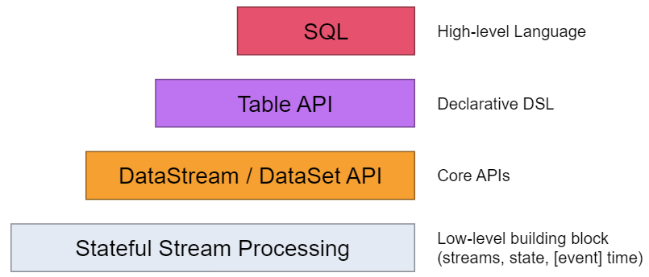
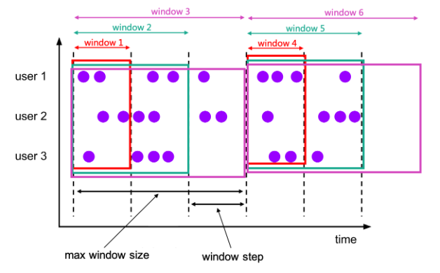

<h1 align = "center">Flink SQL CDC CEP
</h1>

# 一、Flink SQL

尽管`Flink`是流数据处理框架，但为了更为方便的开发，`Flink`也提供了对数据流的“表”处理支持，这就是更高层级的应用`API`，即`Flink Table API`和`Flink SQL`。

`Flink Table API`是一种基于表的`API`，这套`API`是内嵌在`Java`、`Scala`等语言中的一种声明式领域特定语言，也就是专门为处理表而设计的。在此基础上，`Flink`还基于`Apache Calcite`实现了对`SQL`的支持，因此，通过`Flink SQL`，开发者可以直接在`Flink`中写`Flink SQL`代码来实现业务需求。



类似于`Flink DataStream API`是基于`DataStream`进行数据转换和处理，`Flink SQL`是基于数据表进行数据处理和转换，在使用过程中，通过`Flink`获得数据表，然后对表调用相应的`Table API`或者写`Flink SQL`，就能够实现数据的处理和转换。

但区别于`Flink DataStrem API`的是，`Flink Table API`或`Flink SQL`对于数据表的输入和输出定义没有严格的顺序，在数据输出时，使用哪张表，哪张表就是输出表；在数据读入时，使用哪张表，哪张表就是读入表。

>   **在代码中使用`Flink Table API`或者`Flink SQL`时需要引入相关的依赖**
>
>   -   **桥接器：主要负责`Table API`和底层`DataStream API`的连接，根据开发语言的不同，分为`Java`版本和`Scala`版本**
>
>       ```xml
>       <dependency>
>           <groupId>org.apache.flink</groupId>
>           <artifactId>flink-table-api-java-bridge_${scala.binary.version}</artifactId>
>           <version>${flink.version}</version>
>       </dependency>
>       ```
>
>   -   **计划器：是`Table API`的核心组件，负责提供运行时环境，并生成程序的执行计划。`Flink`安装目录下的`lib`目录自带计划器，在`IDE`中引入是为了便于在本地`IDE`中使用并运行`Flink Table API`和`FlinK SQL`。由于`Flink`计划器中有部分代码由`Scala`语言实现，因此还需要引入一个`Scala`版本的流处理依赖**
>
>       ```xml
>       <dependency>
>           <groupId>org.apache.flink</groupId>
>           <artifactId>flink-table-planner-blink_${scala.binary.version}</artifactId>
>           <version>${flink.version}</version>
>       </dependency>
>       <dependency>
>           <groupId>org.apache.flink</groupId>
>           <artifactId>flink-streaming-scala_${scala.binary.version}</artifactId>
>           <version>${flink.version}</version>
>       </dependency>
>       ```
>
>   -   **为了能够实现自定义数据格式的序列化，需要引入以下依赖**
>
>       ```xml
>       <dependency>
>           <groupId>org.apache.flink</groupId>
>           <artifactId>flink-table-common</artifactId>
>           <version>${flink.version}</version>
>       </dependency>
>       ```

## 1.1、创建表执行环境

对于实时流数据处理而言，数据流和表在结构上是有所区别的，使用`Flink Table API`和`Flink SQL`需要一个特别的运行时环境，即表环境`TableEnvironment`。

表环境主要负责：

-   注册`Catalog`和表
-   执行`SQL`查询
-   注册用户自定义函数`UDF`
-   `DataStream`和表之间的转换

其中`Catalog`主要用于管理所有数据库和表的元数据，通过`Catalog`，可以方便地对数据库和表进行查询管理。在表环境中，可以由用户自定义`Catalog`，并在其中注册表和自定义函数，默认的`Catalog`名字是`default_catalog`。

`TableEnvironment`是`Table API`中提供的基本接口，有一个子接口`StreamTableEnvironment`。

使用`TableEnvironment`创建表执行环境实例时，需要调用接口的静态方法`create()`，传入`EnvironmentSettings`类型的参数即可。`EnvironmentSettings`类用于配置当前表执行环境的执行模式和计划器，其内部实现使用了建造者设计模式。执行模式有批执行模式和流执行模式，配置时，需分别调用静态内部类`Builder`的`inBatchMode()`方法和`inStreamingMode()`方法，默认情况下使用的是流执行模式。计划器有旧版计划器和新版的`Blink`计划器可以使用，默认情况下使用`Blink`计划器。

```Java
// 对环境进行配置
EnvironmentSettings build = EnvironmentSettings.newInstance()
        .inBatchMode()     // 创建批处理表执行环境
        .inStreamingMode() // 创建表处理执行环境
        .useOldPlanner()   // 使用旧版计划器，该方法已经过时
        .useAnyPlanner()   // 不显示设置计划器，默认情况使用Blink计划器
        .useBlinkPlanner() // 显示指定Blink计划器
        .build();
```

区别于`TableEnvironment`可以创建具有不同的执行模式和不同计划器的表执行环境，`StreamTableTableEnvironment`只能创建基于新版`Blink`计划器的流式执行环境，其创建方式与`TableEnvironment`创建表执行环境相同，都是调用其静态方法`create()`，传入`EnvironmentSettings`类型的参数即可。

除此之外，`StreamTableEnvironment`还能基于流式执行环境`StreamExecutionEnvironment`创建表执行环境。

**表执行环境创建：**

```Java
/**
 * @author shaco
 * @create 2023-05-09 16:25
 * @desc 创建表执行环境
 */
public class C029_CreateTableExecutionEnvironment {
    public static void main(String[] args) {
        // 1、使用TableEnvironment创建表执行环境
        // 对环境进行配置
        EnvironmentSettings build = EnvironmentSettings.newInstance()
                .inBatchMode()     // 创建批处理表执行环境
                .inStreamingMode() // 创建表处理执行环境
                .useOldPlanner()   // 使用旧版计划器，该方法已经过时
                .useAnyPlanner()   // 不显示设置计划器，默认情况使用Blink计划器
                .useBlinkPlanner() // 显示指定Blink计划器
                .build();

        TableEnvironment tableEnvironment = TableEnvironment.create(build);
        System.out.println(tableEnvironment);

        // 2、使用StreamTableEnvironment创建表执行环境
        // 先创建流执行环境
        StreamExecutionEnvironment env = StreamExecutionEnvironment.getExecutionEnvironment();
        StreamTableEnvironment streamTableEnvironment = StreamTableEnvironment.create(env, build);
        System.out.println(streamTableEnvironment);
    }
}
```

## 1.2、在表执行环境中创建表

表是关系型数据库中数据存储的基本形式，也是`SQL`执行的基本对象。`Flink`中表的概念也并不特殊，是由多个行`Row`数据构成，每个行又具有定义好的多个列。因此表就是固定类型的数据构成的二维矩阵。

在`Flink`中，为了对表进行管理，表环境中会维护一个`Catalog`，所有的表都是通过`Catalog`来进行注册创建的。表在环境中有唯一的`ID`，由三部分构成：`Catalog`名、数据库名、以及表名。默认情况下，`Catalog`名为`default_catalog`，数据库名为`default_database`，所以如果创建一个名为`test_tb`的表，其`ID`为`default_catalog.default_database.test_tb`。

具体表的创建方式有两种。

-   **通过连接器在表执行环境中注册表：**

    通过连接器连接到外部系统，然后定义出对应的表结构，是最为直接的表创建方式。当在表执行环境中读取定义好的表时，连接器就会从外部系统读取数据，并进行转换；而当向定义好的表中写入数据时，连接器也会将数据输出到外部系统中。

    在实际的代码操作中，需要使用表执行环境对象`tableEnv`调用`executeSql()`方法，传入字符串类型的表的`DDL`语句作为参数，就能在表环境中创建表。需要注意的是，区别于离线`SQL`的`DDL`，在`Flink`实时`SQL`中，其`DDL`语言中还需要通过`WITH`关键字指定连接到外部系统的连接器，不同的连接器有着不同的连接器配置参数。

    **通过连接器创建一张名为`test_tb1`的表：**

    ```Java
    tableEnv.executeSql("create table test_tb1 ( ... ) with ('connector' = ... , ...)")
    ```

    上述声明，没有定义`Catalog`和`Database`，因此取值都是默认的，表的完整`id`是：`default_catalog.default_database.test_tb1`。

    如果需要使用自定义的`Catalog`名和数据库名，可以在表执行环境中调用相应的方法，设置`Catalog`名和数据库名。设置后，在表环境中创建的所有表，其`Catalog`名和数据库名都将变成开发者设置的名称。

    ```Java
    tableEnv.useCatalog("custom_catalog");
    tableEnv.useDatabase("custome_database");
    ```

-   **使用虚拟表向表环境中注册表：**

    通过连接器的方式在表执行环境中注册表之后，就可以直接将表名用于`SQL`语句中，但执行`SQL`得到的结果是`Table`类型，是`Java`中的一个类，如果想要在后续直接使用得到的`Table`，那么就需要在表执行环境中注册这张表。

    使用表执行环境`tableEnv`调用`createTemporaryView()`方法，将字符串类型的需要注册的表名和`Table`类型的实例，作为参数传入，即可在表执行环境注册这张表，随后，便可以在后续的`SQL`中直接使用。

表的注册其实质是创建了一个虚拟表，与`SQL`语法中的视图非常相似，这张虚拟表并不会直接保存数据，只会在用到这张表的时候，会将其对应的查询语句嵌入到`SQL`中。

## 1.3、表查询

`Flink`表数据查询对应着流数据的转换，在`Flink`中有两种表数据查询方式，`SQL`查询和`Table API`查询。其中`Table API`的数据查询需要借用`Expression`，使用其作为数据查询造作语言并不方便，但完全使用`SQL`查询也是基于`Table`数据类型的，因此在表数据查询中，往往都是`SQL`查询和`Table API`结合使用，`SQL`查询用于数据查询，`Table API`用于对`Table`类型和`DataStream`类型之间的转换，以及向表环境中注册表。

使用`SQL`查询，需要使用表执行环境`tableEnv`调用`sqlQuery()`，将字符串类型的`SQL`查询语句作为参数传入，返回结果为`Table`。`Flink 1.13`版本支持标准`SQL`中绝大部分的用法，也提供了丰富的计算函数。

**简单的分组聚合**

```java
Table resTable = tableEnv.sqlQuery("select user, count(url) from my_table group by user");
```

除了基于表进行数据查询，还可向表执行环境中已注册的表中写入数据。使用表执行环境`tableEnv`调用`executeSql()`方法，传入`Insert into ... select ...`形式的`SQL`语句，返回结果为`TableResult`。

**==需要注意的是，无法直接插入具体的数据，只能将查询得到的结果再写入到指定的表中。例如：==**

```java
tableEnv.executeSql(
	" insert into outputTable " + 
    " select user, url " + 
    " from inputTable " + 
    " where user = 'Bob' "
);
```

无论是哪种方式得到的`Table`类型对象，都可以继续调用`Table API`进行数据查询和转换。但如果需要对表进行`SQL`查询操作，那么必须先在表执行环境中进行表注册。使用表执行环境`tableEnv`调用`createTemporaryView()`方法能够在表环境中对`Table`进行注册。

```java
tableEnv.createTemporaryView("table_name", myTable);
```

其中`table_name`是在表执行环境中注册的表名，可以在`SQL`中直接调用，而`myTable`即是`Java`中`Table`对象。

## 1.4、表数据输出

表的创建和查询，对应着流处理中的读取数据源`Source`和转换`Transform`，流处理中的`Sink`操作，对应表的输出操作。

在代码实现中，输出一张表最直接的方法是基于`Table`调用`executeInsert()`方法将`Table`中的数据写入到表执行环境中已注册的表中，其参数即为表执行环境中注册的表名。

```java
Table result = ...
result.executeInsert("table_name");
```

在底层实现中，表的输出是通过将数据写入到`TableSink`来实现的，`TableSink`是`Table API`中提供的一个用于向外部系统写入数据的通用接口，可以支持不同的文件格式，例如`CSV`、`Parquet`；不同的数据库系统，例如`JDBC`、`HBase`；以及消息队列，例如`Kafka`。在表执行环境中注册的表，在写入数据的时候就对应着一个`TableSink`。

**以上基于`Table`调用`executeInsert()`方法一般用于将整个`Table`所有字段的数据写入外部系统，为了能够有选择地将需要的字段数据写入到外部系统，可以如`1.3`节所示，通过表执行环境调用`executeSql()`方法，传入`Insert into ... select ...`形式的`SQL`语句，将所需要的字段写在`select`语句中，即可将所需要的字段数据写入到外部系统中。**

## 1.5、Table与DataStream之间的相互转换

**==需要注意的是，`Table`与`DataStream`之间的相互转换，只能基于流式表执行环境，因为对于批处理模式，无法直接转换成`DataStream`。==**

### 1.5.1 Table转换为DataStream

最简单的转换方式是基于表执行环境，调用`toDataStream()`方法，传入`Table`类型参数，返回值即为`DataStream`。

```Java
DataStream myDataStream = tableEnv.toDataStream(myTable, MyDataType.class);
```

**==需要注意的是，调用`toDataStream()`进行`Table`转`DataStream`，只适合一般的“仅插入流”，即数据流中的数据只能增，不能减。==**

为了解决由于分组聚合产生等操作产生的数据更新，需要基于表执行环境`tableEnv`调用`toChangelogStream()`方法，将`Table`转换成“更新日志流”。其原理是记录每一条数据的更新日志，将其更新日志进行打印输出。

```java
DataStream<Row> myDataStream = tableEnv.toChangelogStream(myTable);
```

### 1.5.2 DataStream转换成Table

最简单的将`DataStream`转换成`Table`的方式是，直接基于表执行环境`tableEnv`调用`fromDataStream()`方法，将`DataStream`作为参数传入，返回结果即是一个`Table`。

```java
Table myTable = tableEnv.fromDataStream(myDataStream);
```

在这里需要注意的是，将`DataStream`转换成`Table`时，数据类型的问题。在流中，数据类型由`Flink`支持的数据类型决定，因此，各种各样的数据类型映射到`Table`中之后会有着不同的数据类型呈现。关于数据类型的说明，将在后面进行叙述。

除此之外，对于更新日志流，也可将其转换成`Table`，基于表执行环境`tableEnv`调用`fromChangelogStream()`方法，将更新日志流作为参数传入，即可得到一个`Table`。需要注意的是，只能将更新日志流中数据类型为`Row`的数据流转换成`Table`，并且流中的每一条数据都需要指定当前行的`RowKind`，开发者直接使用比较少，一般都由连接器进行实现。

### 1.5.3 表环境中注册表

无论通过什么方式获得的`Table`，如果需要在`Flink SQL`中直接使用，那么需要在表执行环境中进行注册。

基于表执行环境`tableEnv`调用`createTemporaryView()`方法，传入需要在表环境中注册的表名和`Table`对象，即可在表环境中注册相应的表。

**除此之外，还可以直接将`DataStream`在表环境中进行注册，同样是调用`createTemporaryView()`方法，不过，此时需要将`DataStream`对象作为参数传入。**

## 1.6、Table支持的数据类型

整体来看，`DataStream`中支持的数据类型，`Table`中也都是支持的，只不过，在进行转换的时候需要注意一些细节。

-   **原子类型：**在`Flink`中，基本数据类型的包装类，和不可拆分的通用数据类型统一称为原子类型。原子类型的`DataStream`转换成`Table`之后，就是只有一列的表，其字段的数据类型可以由原子类型进行自动推断
-   **`Tuple`类型：**`Table`支持`Flink`中定义的元组类型`Tuple`，对应在表中的字段名默认为就是元组中元素的属性名，即`f0`、`f1`、`f2`等。
-   **`POJO`类型：**`POJO`中已经定义了可读性很强的字段名，所以，在将`POJO`类型的`DataStream`转换成`Table`时，默认情况下，会直接使用原始`POJO`中的字段名称。
-   **`Row`类型：**`Flink`中还定义了一个在关系型表中更加通用的数据类型`Row`，它是`Table`中数据的基本组织形式。`Row`类型也是一种符合类型，其长度固定，并且无法直接推断出每个字段的类型。所以在使用时必须指定具体的类型。除此之外，`Row`类型还需要附加一个属性`RowKind`，用于指定当前行在更新操作中的类型，这样，`Row`就可以用来表示更新日志流中的数据。

**需要注意的是，在将`DataStream`转换成`Table`的过程中，可以对数据的字段进行筛选、重新排序、以及重命名。**

## 1.7、Flink SQL中的特殊概念

### 1.7.1 动态表

流处理面对的数据是连续不断的，因此，流处理中的表与常见的关系型数据库中的表完全不同。将流数据转成成表的形式，那么表中的数据就会不断增长，因此，`Flink SQL`中的表称为动态表，这是`Flink Table API`和`Flink SQL`中的核心概念，为流数据处理提供了表和`SQL`支持。

### 1.7.2 持续查询

在`Flink`中，每到来一条数据，就将处理一条数据，`Flink`的核心思想在于事件触发。对于基于动态表的`Flink SQL`查询，由于数据是不断变化的，因此基于动态表的`SQL`也不是只执行一次，每一次数据到来都会执行，所得到的结果会基于上一次查询结果进行更新，因此在`Flink SQL`中的查询都是持续查询。

由于每次数据到来都会触发查询操作，因此可以认为一次查询面对的数据集，就是当前动态表中所有的数据，相当于对动态表做了一个快照，将其当作有限数据集，进行批处理。流式数据到来会触发连续不断的快照查询，像动画一样连贯起来，就构成了“持续查询”。

基于动态表的持续查询，其结果也是动态表。

### 1.7.3 数据流转换成动态表

为了能够使用`SQL`做流数据处理，必须先将数据流转换成动态表，以下将介绍数据流转换成动态表的基本原理和过程。

动态表不同于关系型数据库的数据表，不会对数据进行攒批操作，因此每来到一条数据，就会对数据进行一次处理，并下下游发送数据，如果下游是外部系统，就会将数据写入到外部系统中。因此，对于已经处理并得到结果的数据，由于已发送到下游，就无法直接进行改变，而新来的数据只能在其后面进行追加。所以为了对数据计算结果进行更新，那么就需要删除之前旧的数据，再将新的数据进行写入。

所以，将数据流转换成动态表时，其底层是通过一个只有插入操作的更新日志流来构建一个动态表的。

### 1.7.4 动态表转换成数据流

同关系型数据库中的数据表一样，动态表的数据变化也是通过`Insert`、`Delete`、`Update`操作实现的。将动态表转换成数据流或者向外部系统写入时，需要对这些更改操作进行编码，通过发送编码消息的方式通知下游要执行的操作。

在`Flink Table API`和`Flink SQL`中，支持三种编码方式：

-   `Append-Only`：仅追加流，仅通过`Insert`操作修改的动态表，可以直接转换成`Append-Only`流，这个流中的数据就是动态表中新增的每一行
-   `Retract`：撤回流。通过`Insert`、`Delete`和`Update`操作修改的动态表，可以转换成`Retract`流。其具体的编码规则时，`Insert`插入操作编码为`add`消息，`Delete`操作编码为`retract`消息，而`Update`操作则被编码为**被更改行的`retract`消息和更新后新行的`add`消息。**通过对数据操作的编码，可以将一个 动态表转换成`Retract`流。
-   `Upsert`：更新插入流。通过`Upsert`和`Delete`操作修改的动态表，可以转换成`Upsert`流。其具体的编码规则为，`Insert`插入操作和`Update`操作会同一地编码为`upsert`消息，而`Delete`删除操作则被编码为`delete`消息。

    在`Upsert`流中，不区分`Insert`插入操作和`Update`操作，但为了保证数据处理的正确性，需要动态表中有唯一键，通过键进行数据查询时，如果存在对应的数据就做`Update`操作，如果不存在就进行`Insert`操作。同理，对于接收`Upsert`流的外部系统，也需要支持流数据的键，这样才能保证每条数据处理的正确性。

需要注意的是，在代码中将动态表转换成`DataStream`时，只支持`Append-Only`和`Retract`流，不支持`Update`流，原因在于，`DataStream`中并没有键的定义，所以只能分别通过删除旧的消息和插入新的消息来表示更新操作。而在连接到外部系统时，可以支持不同的编码方法，这需要取决于外部系统本身的特性。

## 1.8、动态表的时间属性

`Flink Table`和`Flink SQL`的底层原理依然是基于数据流的`DataStream`，对于数据流，在进行基于时间的操作时，需要定义相关的时间语义和数据的时间戳信息。在`DataStream API`中，有用于为数据赋予时间戳以及设置水位线生成策略的`API`，而在`Flink Table API`和`SQL`中，基于动态表，会给表单独提供一个逻辑上的时间字段，用于在表处理程序中指示时间属性以及水位线生成策略。

时间属性是每个动态表`Schema`的一部分，可以在创建表的`DDL`中直接定义为一个字段，也可以在`DataStream`转换成表时进行定义。时间属性字段虽然是动态表`Schema`的一部分，但是也可以作为一个普通的字段进行使用。

时间属性字段的名称可以随意定义，但其数据类型为固定的`Timestamp`或者`Timestamp_ltz`，其中，后者表示带时区的`Timestamp`。

按照不同的时间语义，时间属性的声明可以分为事件时间和处理时间两种。

### 1.8.1 事件时间

在事件时间语义下，允许动态表根据每个数据中包含的时间戳，即事件时间来生成结果。对于乱序数据或迟到数据的处理，依然是通过设置水位线来表示事件事件的进展，在设置水位线的同时，同样可以设置一个延迟时间，用于处理乱序数据或迟到数据。

正如上述所说，事件事件属性可以在创建动态表的`DDL`中定义，也可以在数据流转换成动态表的代码中进行定义。

**创建动态表的`DDL`中定义事件时间属性**

**语法格式：**

```sql
CREATE TABLE <table_name>
(
	<column_name_1> <data_type>
	[,<column_name_2> <data_type> ...]
	, <time_column_name> TIMESTAMP(n) | TIMESTAMP_LTZ(n)
	, WATERMARK FOR <time_column_name> AS <time_column_name> - INTERVAL '<time_interval>' SECOND[s]
) WITH (
	...
);
```

与离线数据表的`DDL`不同，`Flink`动态表的定义多了一些关键字。

**建表语句说明：**

-   `time_column_name`：时间属性字段名，由用户自定义，如果与`Flink SQL`的关键字重名，需要添加着重号``

-   `TIMESTAMP(n) | TIMESTAMP_LTZ(n)`：时间属性字段名的数据类型，只能是`TIMESTAMP`或者`TIMESTAMP_LTZ`，`n`表示时间属性的精度，一般取`n = 3`，表示精确到毫秒

-   `WATERMARK FOR <time_column_name>`：`WATERMARK FOR <time_column_name>`，表示以时间时间属性字段`time_column_name`为基础，为数据流设置水位线生成策略

-   `AS `：`AS`关键字，不是取别名的意思，在这里，`AS`关键字用于定义**计算列**，其后跟一个数据计算表达式，其计算结果赋予到`AS`前面的变量中

    >   计算列由可以使用同一表中的其他列的表达式计算得来。表达式可以是非计算列的列名、常量、函数，也可以是用一个或多个运算符连接的上述元素的任意组合。表达式不能为子查询。

-   `<time_column_name> - INTERVAL '<time_interval>' SECOND[s]`：计算表达式，含义是，基于事件时间属性字段`time_column_name`设置了`time_interval`秒的水位线延迟。其中，用`INTERVAL`关键字定义的时间间隔表示水位线延迟时间，其单位由`SECOND`声明，在这里使用`SECOND`和`SECONDS`是相同的含义，除了使用`SECOND`声明时间单位为秒意以外，还可以用其他关键字声明时间单位。`time_interval`用户自定义的水位线延迟大小，取值数值类型，并且必须用单引号引用。因此`INTERVAL`关键字的完整格式为：`INTERVAL <value> <units>`

-   `WITH`：用于配置外部系统的连接属性，不同的外部系统，连接属性都不相同

**应用示例：创建一张动态表，设置事件时间属性，并基于事件时间属性字段设置`5`秒的水位线延迟**

```SQL
CREATE TABLE demo01(
	user_name String,
	age       Int,
	ts        Timestamp(3),
	WATERMARK FOR ts AS ts - INTERVAL '5' SECONDS
) WITH (
	...
);
```

对于事件时间属性，还有一点需要注意。一般情况下，如果数据中的时间是年月日时分秒的形式，那么就是不带时区信息的，可以将时间时间属性定义为一个`Timestamp`类型。如果数据中的时间是长整型的毫秒数，那么需要另外定义一个字段来表示事件时间属性，类型定义为`Timestamp_ltz`更为方便。

**应用示例：创建一张动态表，设置事件时间属性，并基于事件时间属性字段设置`5`秒的水位线延迟。数据中的时间为长整型的毫秒值**

```sql
CREATE TABLE demo01(
	user_name String,
	age       Int,
	ts        Bigint, -- 长整型毫秒值
    ts_ltz AS TO_TIMESTAMP_LTZ(ts,3),
	WATERMARK FOR ts_ltz AS ts_ltz - INTERVAL '5' SECONDS
) WITH (
	...
);
```

语句`ts_ltz AS TO_TIMESTAMP_LTZ(ts,3)`中的`AS`依然用于定义计算列，其中`TO_TIMESTAMP_LTZ()`为`Flink SQL`的内置函数，用于将长整型的时间戳转换为带时区的年月日时分秒形式的时间。

**在数据流转换为动态表时定义事件时间属性**

在基于表执行环境调用`fromDataStream()`方法创建动态表时，可以通过追加参数来定义表中的字段结构，这时，可以基于某个字段的`Expression`表达式调用`rowtime()`方法，用以表示将当前字段指定为事件时间属性。这个字段可以是数据本身固有的字段，那么这个字段就会被时间属性所覆盖，原有的数据类型也会转换为`Timestamp`；这个字段也可以是数据中本不存在、额外追加的逻辑字段。

但无论事件时间属性字段是否原本就存在还是不存在，这种方式只负责指定时间属性是哪个字段，而时间戳的提取和水位线的生成策略必须在之前的`DataStream`中就已经定义好了，而由于`DataStream`中，没有时区的概念，因此，`Flink`会将事件事件属性解析成不带时区的`Timestamp`类型，所有的时间值都将被当作`UTC`标准时间。

**应用示例：**

```java
// 方式一：数据中不存在时间字段，需要声明一个额外字段作为事件时间属性
// 数据流中的元素为一个Tuple2
// 自定义时间戳提取和设置水位线生成策略
DataStream<Tuple2<String, Integer>> stream1 = inputStream.assignTimestampAndWatermarks(...);

Table table1 = tableEnv.fromDataStream(stream1, $("user"), $("age"), $("ts").rowtime());

// 方式二：数据中存在时间字段，直接作为事件事件属性
// 数据流中的元素为一个Tuple3
DataStream<Tuple3<String, Integer, Long>> stream2 = inputStream.assignTimestampAndWatermarks(...);

Table table2 = tableEnv.fromDataStream(stream2, $("user"), $("age"), $("ts").rowtime());
```

### 1.8.2 处理时间

相较于事件时间，处理时间属性的声明就比较简单，由于处理事件是当前系统的事件，使用时不需要提取时间戳和设置水位线生成策略，因此在定义处理时间属性时，只需要额外声明一个字段，用于保存当前的处理时间即可。

与事件事件属性的定义相同，处理时间属性的定义也有两种方式。

**创建动态表的`DDL`中定义处理时间属性**

**语法格式：**

```SQL
CREATE TABLE <table_name>
(
	<column_name_1> <data_type>
	[,<column_name_2> <data_type> ...]
	, <time_column_name> AS PROCTIME()
) WITH (
	...
);
```

其中，处理时间属性字段名，由用户自行定义，而处理时间字段的值以计算列的形式进行定义。`PROCTIME()`也是`Flink SQL`的系统函数。

**在数据流转换成动态表时定义处理时间属性**

由于处理时间时系统当前时间，数据中必定不存在该字段，因此处理时间属性的定义不能基于已有的字段进行定义，只能在表结构所有字段的最后，作为额外的逻辑字段定义。

```java 
DataStream<Tuple2<String, Integer>> stream1 = inputStream.assignTimestampAndWatermarks(...);

Table table1 = tableEnv.fromDataStream(stream1, $("user"), $("age"), $("ts").proctime());
```

## 1.9、窗口的声明

`Flink DataStream API`中基于数据时间的典型操作就是窗口，窗口用于将无界数据流切割成有界的数据集随后进行聚合计算。`Flink Table API`和`Flink SQL`中也对窗口进行预实现。

**`Windowing Table-Valued Functions`，窗口表值函数**

从`Flink 1.13`版本开始，`Flink`开始使用窗口表值函数来定义窗口。窗口表值函数使`Flink`定义的多态表函数，可以将表进行扩展后返回，因此，表值函数可以看作是一个返回表的函数。

在`Flink 1.13`版本中，`Flink`提供了四个窗口表值函数：

-   滚动窗口表值函数
-   滑动窗口表值函数
-   累计窗口表值函数
-   会话窗口表值函数

除了会话窗口表值函数还未完全支持以外，其余三个窗口表值函数都已经较为成熟和稳定。

窗口表值函数更加符合`SQL`标准，性能上也得到了优化，拥有着更为强大的功能。窗口表值函数支持基于窗口的复杂计算，例如窗口`Top-N`问题、窗口连接等等。当然目前的窗口表值函数的功能还不完善，会话窗口和很多高级功能还不支持，但`Flink`开发团队正在对其快速的更新和完善，可以预见在未来的版本中，窗口表值函数将越来约强大，将会是窗口处理的唯一入口。

正如上述所说，表值函数是用于返回表的函数，基于原始表进行加工和处理并返回新的表。对于窗口表值函数而言，其作用用于对数据进行窗口分配，因此窗口表值函数返回的表相对于原始数据表增加了额外的3个列，分别是：

-   `window_start`：窗口起始时间
-   `window_end`：窗口结束时间
-   `window_time`：窗口最大时间，取值为`window_end - 1 ms`，即窗口能包含数据的最大时间戳

**滚动窗口表值函数**

**语法格式：**

```SQL
TUMBLE(TABLE <table_name>, DESCRIPTOR(<time_column_name>), INTERVAL '<time_interval>' HOUR)
```

**说明：**

`TUMBLE()`：滚动窗口表值函数，需要三个参数，分别是原始动态表的表名，逻辑时间字段名，以及滚动窗口的窗口大小。其中滚动窗口的窗口大小声明，也使用了`INTERVAL`关键字，其语法已经介绍，这里不做赘述。

**滑动窗口表值函数：**

**语法格式：**

```SQL
HOP(TABLE <table_name>, DESCRIPTOR(<time_column_name>), INTERVAL '<time_interval>' MINUTES, INTERVAL '<time_interval>' HOUR)
```

**说明：**

`HOP()`：滑动窗口表值函数，需要三个参数，分别是原始动态表的表名，逻辑时间字段名，以及滑动窗口的步长，和滑动窗口的大小。==注意字段的含义，第三个参数是滑动窗口的步长，第四个参数是滑动窗口的大小。==

**累计窗口表值函数：**

累计窗口，即窗口的起始边界固定，结束边界逐步向右移动的窗口。

**累积窗口示意图：**



**语法格式：**

```SQL
CUMULATE(TABLE <table_name>, DESCRIPTOR(<time_column_name>), INTERVAL '<time_interval>' MINUTES, INTERVAL '<time_interval>' HOUR)
```

**说明：**

`CUMULATE()`：累计窗口表值函数，需要三个参数，分别是原始动态表的表名，逻辑时间字段名，以及累积步长和窗口大小。同样，第三个参数为累积窗口的步长，第四个参数为累积窗口的大小。

## 1.10、窗口聚合查询

截止到目前为止，都在介绍如何创建一张动态表，以及使用表值函数基于已有的动态表创建新的动态表，但没有介绍关于动态表的数据查询。

对于基于动态表的`Flink SQL`而言，其`SQL`查询可以分为两类，一类是`SQL`原生的查询语法，即关系型数据库`SQL`、`Hive SQL`、`Spark SQL`等离线查询语法；另一类是`Flink SQL`特有的查询语法，主要是与时间相关的查询处理，一般体现在窗口的操作中。

对于`Flink SQL`为什么能够完全支持原生`SQL`语法，从其基本原理可以进行解释。

`Flink SQL`查询，是一种基于动态表的持续查询，动态表中每到来一条数据，就将触发`Flink SQL`执行一次。在`Flink SQL`执行时，动态表中的数据是不变的，相当于给动态表做了一个快照，此时的动态表可以当作静态表进行`SQL`查询，因此，对于本就是基于离线数据进行数据处理的原生`SQL`可以完美执行，查询结果将直接向下游发送。

这是一条数据到来后，`Flink SQL`做的一次处理。当流式数据源源不断地到来时，`Flink SQL`将源源不断地执行，得到地结果也将源源不断地向下游发送。为了保证数据的一致性，根据`Flink SQL`查询结果，`Flink`将选择合适的数据流编码方式发送数据。因此

### 1.10.1 分组聚合

`Flink SQL`中的分组聚合概念与原生`SQL`中分组聚合的概念相同，都是对数据按指定字段进行分组，随后进行聚合计算。区别在于`Flink SQL`中的分组聚合是一种更新查询，所得到的是一个动态表，其底层实现是基于`DataStream API`中`keyBy`之后的聚合转换。

在分组聚合查询中需要注意的是，由于是持续查询的过程，可能存在用于分组的`key`会不断增加的情况，因此计算结果所需要维护的状态也会持续增长。为了防止状态无限制增长耗尽资源，可以在表执行环境中为状态设置生存时间，即设置`TTL`。

### 1.10.2 窗口分组聚合

窗口分组聚合与原生`SQL`中的分组聚合相似，将无界数据流进行窗口分配后，窗口中的数据就是有界数据，对其进行的窗口分组聚合与原生`SQL`的分组聚合，在语法格式上唯一的区别是，需要将窗口信息字段：`window_start`、`window_end`、`window_time`作为分组字段。

**应用示例：每隔`1`小时，统计每隔用户点击`url`的次数**

```SQL
SELECT user_name, 
	   window_end,
       COUNT(url) as url_cnt
FROM TABLE(
	TUMBLE(
		TABLE EventTable,
		DESCRIPTOR(ts),
		INTERVALE '1' HOUR
	)
)
GROUP BY user_name, 
		 window_start, 
		 window_end;
```

### 1.10.3 窗口函数

`Flink SQL`中的窗口函数与原生`SQL`中的窗口函数相同，其底层处理思路也是相同的。

**语法格式：**

```SQL
<聚合函数> 
OVER(
	[PARTITION BY <column_name_01> [, <column_name_02, ...>]]
	ORDER BY <time_name_column>
    <行控制语句>
)
```

**参数说明：**

-   聚合函数：原生`SQL`中的能够使用的聚合函数都可以使用

-   `PARTITION BY`：用于指定分区的字段，为可选参数

-   `OEDER BY`：用于指定排序字段。在`Flink SQL`的流处理中，目前只支持按照时间属性字段进行升序排序，所以`ORDER BY`子句中的字段必须是定义好的时间属性字段。这是与原生`SQL`不同的地方

-   行控制语句：在`Flink SQL`中支持两种行控制方式，一种是基于是基于时间进行开窗，另一种是基于数据的数量进行开窗。需要注意的是，`Flink SQL`支持的上界只能是`CURRENT ROW`

    -   基于时间进行开窗口：当前行之前1小时的数据

        ```SQL
        RANGE BETWEEN INTERVAL '1' HOUR PRECEDING AND CURRENT ROW
        ```

    -   基于数据的数量开窗口：当前行之前的5行数据，包含当前行，总计是6行数据

        ```SQL
        ROWS BETWEEN 5 PRECEDING AND CURRENT ROW
        ```

        
