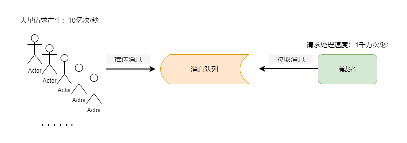
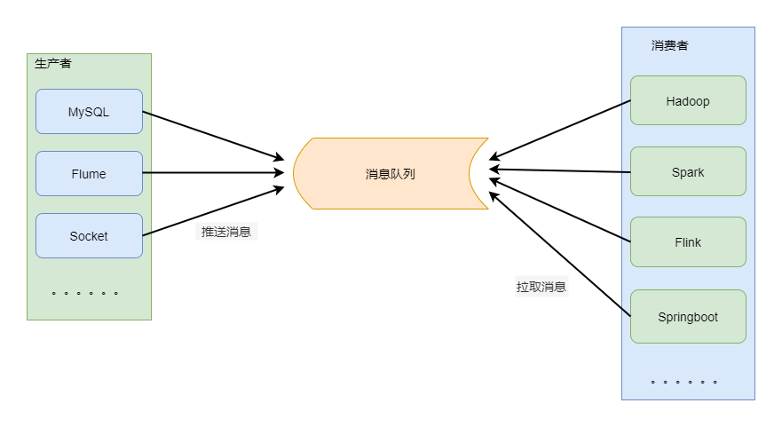
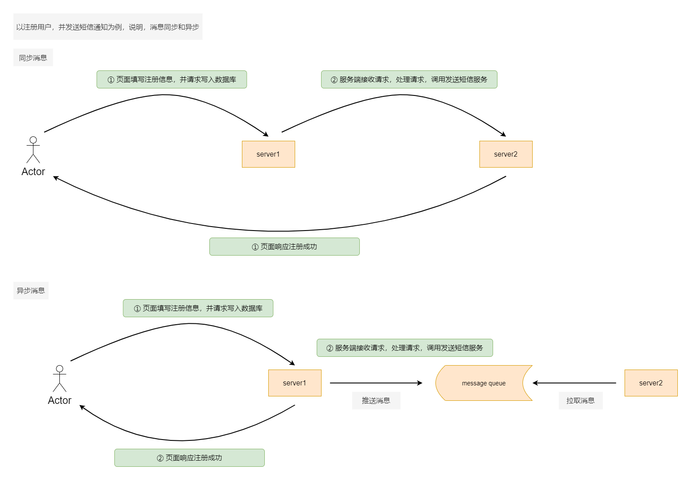
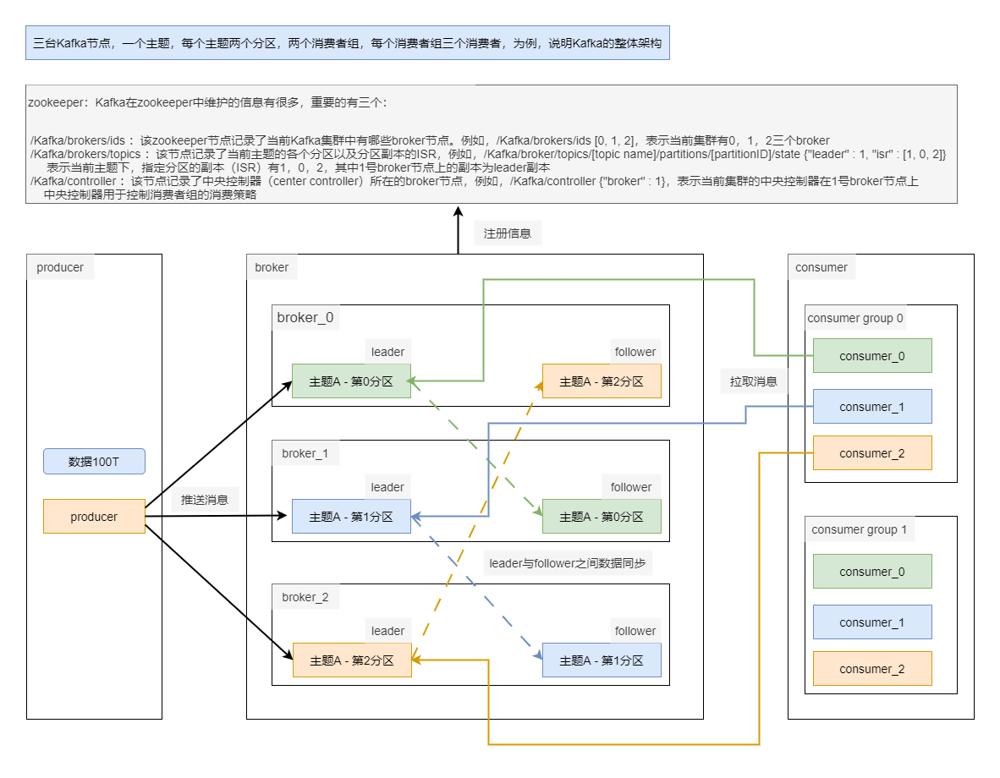
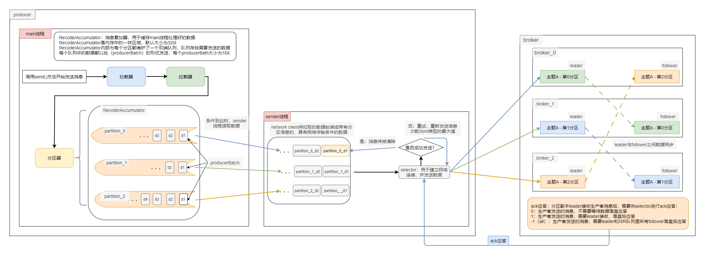
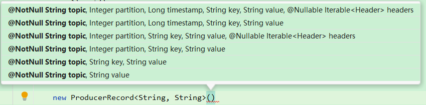
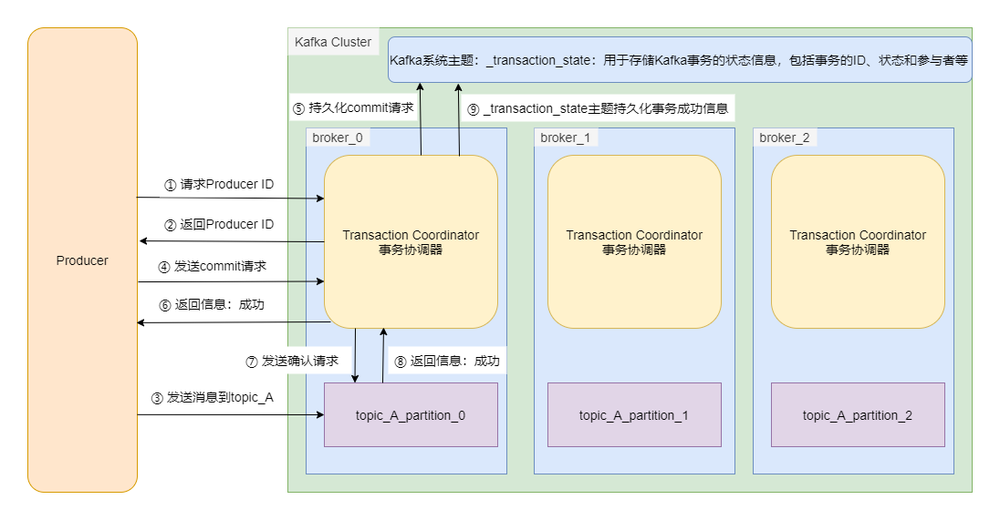
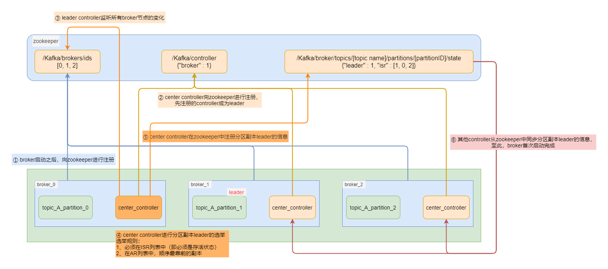
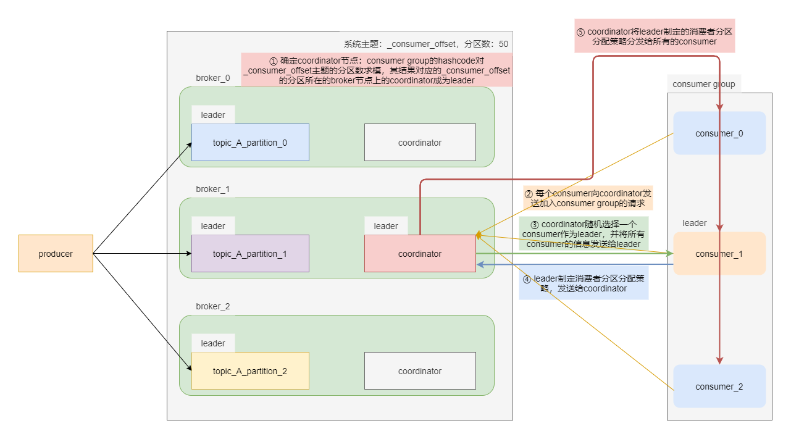
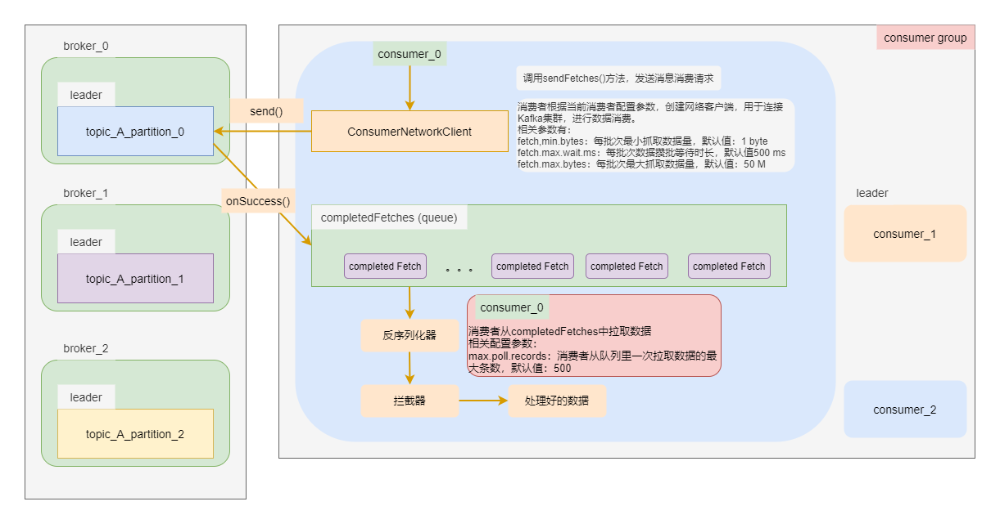

<h1 align = "center">Kafka
</h1>
# 一、概述

## 1.1、引言

`Kafka`是一个分布式的，基于发布/订阅模式的消息队列，主要应用于大数据实时处理领域。

发布/订阅模式：消息的发布者不会将消息直接发送给特定的订阅者，而是将待发布的消息分为不同的类别，存储在`Kafka`中，订阅者只订阅感兴趣的消息。

`Kafka`新定义：`Kafka`是一个开源的分布式事件流平台，被用于高性能数据管道、流分析、数据集成和关键任务应用。

目前较为常见的消息队列有`Kafka`、`RabbitMQ`、`RocketMQ`，在大数据场景中，主要使用`Kafka`作为消息队列，在`Java`后端开发中，主要采用`RabbitMQ`和`RocketMQ`。

消息队列作为消息中间件，将具体业务和底层逻辑解耦，例如，需要利用服务的人（前端），不需要知道底层逻辑（后端）的实现，只需要拿着中间件的结果使用就可以了。

消息队列的主要应用场景有三个：消峰、解耦和异步。

消息队列的使用也会带来一定的问题：使用消息队列后，会增加系统的复杂性和系统维护问题，以及系统使用过程中会出现的各种问题，主要问题是消息重复消费、消息丢失、消息顺序错乱等。

-   **消峰：**将高峰期的请求放入消息队列中，由消费者自行进行消息订阅或消费，能够解决客户端请求速度与服务端处理请求速度不匹配而引发的服务崩溃问题

-   **解耦：**消息的生产与消息的消费不直接对接，避免了消息生产者生产消息速度与消息消费者消息消费速度不匹配导致的数据积压问题



-   **异步：**消息发送者发出消息后，立即继续执行下一步，不需要等待消息接收者的返回消息或控制

## 1.2、Kafka相关概念

-   **主题`topic`：**
    -   `topic`是指一类消息的集合，在`Kafka`中用于分类管理消息的逻辑单元，类似于数据库管理系统中的库和表，只是逻辑上的概念
    -   `topic`作为`Kafka`中的核心概念，将生产者和消费者解耦。生产者向指定`topic`中发布消息，消费者订阅指定`topic`的消息
    -   `topic`可以被分区用以提高并发处理能力和可扩展性
-   **分区`partition`：**主题是许多消息的集合
    -   当消息特别多（即主题特别大），为了方便消息的管理，`Kafka`将主题进行分区管理
    -   一个主题能够被分为许多个分区，每个分区由一系列有序、不可变的消息组成，是一个有序队列
    -   每个主题的分区数可以在`Kafka`启动时加载的配置文件中配置，也可以在创建主题的时候进行设置，还可以在代码中进行设置
    -   每个分区又有一至多个副本，分区的副本分布在`Kafka`集群的不同`broker`上，以提高数据的可靠性
-   **`leader`：**每个分区所有副本中的”老大“，用于对接生产者，接收生产者发送的消息；也用于对接消费者，接收消费者发送的消费消息的请求
-   **`follower`：**每个分区所有副本中不是`leader`的副本，实时从`leader`中同步数据，当`leader`发生故障时，`Kafka`会从`follower`中选举出新的`leader`
-   **消息`Message`：**消息是`KafKa`数据传输的基本单位，由一个固定长度的消息头和一个可变长度的消息体构成。在旧版本中，每一条消息称为`Message`；在由`Java`重新实现的客户端中，每一条消息称为`Record`。消息头用于存储消息的元数据信息，例如，所在的主题、分区、时间戳等，消息体用于存储真实的消息数据
-   **`broker`：**`KafKa`集群就是由一个或者多个`KafKa`节点（或称为实例）构成，每一个`KafKa`节点称为`broker`。一个节点就是一台服务器上的`Kafka`服务。`broker`用于数据的接收、存储和发送。`broker`由`Scala`语言实现
-   **生产者`producer`：**消息的生产者，即向`broker`推送数据的客户端，一般是`Java`代码实现的
-   **消费者`consumer`**：消息的消费者，即从`broker`中拉取数据的客户端，一般也是`Java`代码实现
    -   每个消费者都有一个全局唯一的`id`，通过配置项`client.id`指定。在`Java`代码中必须显示指定消费者的消费者组`id`；在命令行中可以不用显示指定，`KafKa`会自动为该消费者生成一个全局唯一的`id`

-   **消费者组`consumer group`：**消费者组由多个消费者构成。消费组是`KafKa`实现对一个主题消息消费的手段，即消费者组是逻辑上的一个订阅者。单独的一个消费者也是主题的订阅者，因为`Kafka`会为单独的一个消费者设置消费者组，即这个消费者组只有这一个消费者
    -   在`KafKa`中，每个消费者都属于一个特定的消费者组，默认情况下，消费者属于默认的消费组`test-consumer-group`，通过`group.id`配置项，可以为每个消费者指定消费组
    -   在消费者组内，不同的消费者不能消费同一个主题相同分区的消息，换句话说，一个分区的消息只能由一个消费者消费，原因是进行并行消费，提高效率

## 1.3、Kafka基本架构

整体来看，`Kafka`框架包含四大组件：生产者`Producer`、消费者`Consumer`、`broker`集群和`zookeeper`集群。

在一台服务器上只能部署一个`Kafka`节点，每个`Kafka`节点都称为`broker`，多个`Kafka`节点构成`broker`集群。

一个完整的`Kafka`集群包含多个生产者，多个`broker`，多个消费者以及一个`zookeeper`集群。

-   **`zookeeper`：**`Kafka`通过`zookeeper`协调管理`Kafka`集群，主要用于存储`Kafka`集群的`broker`信息，记录`Kafka`集群由哪些`broker`构成；存储主题的分区副本`leader`信息以及分区副本`follower`的信息；此外还用于分区副本`leader`选举过程中的信息协调，以及消费者组中消费者挂掉时，其承担的分区数据消费任务的再分配。在`Kafka 2.8.0`版本之后，搭建`Kafka`集群可以不再依赖`zookeeper`集群。

-   **生产者：**是`Kafka`中的消息生产者，主要用于将外部需要写入`Kafka`的数据进行一定的处理，然后发送给`Kafka`的`broker`进行存储。这些数据在经过处理了后会带有主题信息，分区信息，用以确定数据将被发往哪个主题的哪个分区中
-   **消费者：**一般所说的消费者，是指消费者组，它是`Kafka`消息消费的逻辑单位。每个消费者都将属于一个消费者组；在同一个消费者组内，不同的消费者只能消费一个主题的不同分区
-   **`broker`：**`Kafka`集群中用于存储数据的组件。在`broker`中，用主题来对存入`Kafka`的数据进行分类；为了避免由于单一主题数据量过大，导致单`broker`节点存储的数据量过大，数据存取效率低下的问题，`Kafka`中可以对每个主题的数据进行切分，切出来的每一块数据称为一个分区`Partition`。此外，由于`Kafka`是一个分布式的消息队列，为了提高数据的可靠性，`Kafka`还可以对每个分区设置副本数量，但是，与`Hadoop`等大数据组件不同的是，`Kafka`中，分区副本之间是有所差别的，所有副本中有一个副本将会根据特定的选举机制称为分区副本的`leader`，用于对接生产者和消费者，而其他不是`leader`的副本称为`follower`，在`Kafka`正常运行时，从`leader`中同步数据，时刻与`leader`保持一致，当`leader`挂掉时，再通过选举机制选出一个`follower`成为`leader`

**`Kafka`总体工作流程**



# 二、Kafka快速入门

## 2.1、Kafka集群安装部署

参考：**大数据组件部署文档.md**

## 2.2、Kafka常用命令

**说明：**

-   **以下命令的使用均站在`./kafka`目录下，因此都将使用相对路径**
-   **`<>`表示必选项，`[]`表示可选项**

**==`Kafka`集群启停：==`Kafka`集群启动之前需要先启动`zookeeper`集群，因此停止`Kafka`集群时，需要先停止`Kafka`集群，再停止`zookeeper`集群。**

-   **`Kafka`集群启动命令：**`Kafka`集群启动需要指定集群配置文件

    ```bash
    ./bin/kafka-server-start.sh -daemon ./config/server.properties
    ```

-   **`Kafka`集群停止命令：**

    ```bash
    ./bin/kafka-server-stop.sh
    ```

**==`topic`相关命令：==**

-   **查看操作`topic`相关命令的参数：**

    ```bash
    ./bin/kafka-topics.sh
    ```

    -   **`--bootstrap-server <String: server toconnect to>`：**配置连接`Kafka`集群的主机名和端口号，该配置项必不可少

    -   **`--list`：**列举现有所有主题

    -   **`--topic <String: topic>`：**指定想要操作的主题的名称

    -   **`--create`：**表明此次对指定主题的操作是**创建**该主题

    -   **`--delete`：**表明此次对指定主题的操作是**删除**该主题

    -   **`--alter`：**表明此次对指定主题的操作是**修改**该主题的配置，例如，分区数、副本数等，因此，该参数还需要其他参数配合使用

    -   **`--describe`：**查看主题详细描述，分区数、副本数等

    -   **`--patitions <Integer: of partitions>`：**设置主题的分区数

    -   **`--replication-factor <Integer: replication factor>`：**设置分区副本数

    -   **`--config <String: name = value>`：**更新系统默认配置

        -   **查看当前`Kafka`集群中所有主题：**

            ```bash
            kafka-topics.sh --bootstrap-server hadoop132:9092 --list
            
            # out
            __consumer_offsets
            first
            sink_topic
            ```

        -   **创建名为`second`的主题：**创建主题时，需要指定主题的分区数和副本数

            ```bash
            kafka-topics.sh --bootstrap-server hadoop132:9092 --create --partitions 3 --replication-factor 3 --topic second
            ```

        -   **查看`second`主题的详情：**

            ```bash
            kafka-topics.sh --bootstrap-server hadoop132:9092 --describe --topic second
            
            # out
            Topic: second	TopicId: uSXoYxJ8SBSIbeGOUWnEWQ	PartitionCount: 3	ReplicationFactor: 3	Configs: segment.bytes=1073741824
            	Topic: second	Partition: 0	Leader: 3	Replicas: 3,2,4	Isr: 3,2,4
            	Topic: second	Partition: 1	Leader: 4	Replicas: 4,3,2	Isr: 4,3,2
            	Topic: second	Partition: 2	Leader: 2	Replicas: 2,4,3	Isr: 2,4,3
            ```

        -   **修改`second`主题的分区数：**分区数只能增加，不能减少

            ```bash
            kafka-topics.sh --bootstrap-server hadoop132:9092 --alter --partitions 4 --topic second
            ```

            **==分区副本数量的调整需要通过几个步骤，后续会进行说明==**

        -   **再次查看`second`主题的详情：**

            ```bash
            kafka-topics.sh --bootstrap-server hadoop132:9092 --describe --topic second
            
            # out
            Topic: second	TopicId: uSXoYxJ8SBSIbeGOUWnEWQ	PartitionCount: 4	ReplicationFactor: 3	Configs: segment.bytes=1073741824
            	Topic: second	Partition: 0	Leader: 3	Replicas: 3,2,4	Isr: 3,2,4
            	Topic: second	Partition: 1	Leader: 4	Replicas: 4,3,2	Isr: 4,3,2
            	Topic: second	Partition: 2	Leader: 2	Replicas: 2,4,3	Isr: 2,4,3
            	Topic: second	Partition: 3	Leader: 3	Replicas: 3,4,2	Isr: 3,4,2
            ```

        -   **删除`second`主题**

            ```bash
            kafka-topics.sh --bootstrap-server hadoop132:9092 --delete --topic second
            ```

**==生产者相关命令：==生产者的命令行操作只能模拟出一个生产者客户端用于发送消息，因此，相关参数只有配置`Kafka`集群地址和端口号，以及指定需要操作的主题。生产者相关命令需要使用`kafka-console-producer.sh`脚本**

-   **创建一个向`first`主题写入数据的生产者：**

    ```bash
    kafka-console-producer.sh --bootstrap-server hadoop132:9092 --topic first
    ```

**==消费者相关命令：==消费者的命令行操作只能模拟出一个消费者客户端（即消费者组）用于消费指定主题的消息，因此，相关参数也有配置`Kafka`集群地址和端口号，指定需要操作的主题，以及指定消费者组名称。**

-   **消费者相关命令需要使用`kafka-console-consumer.sh`脚本**

    -   **`--bootstrap-server <String: server toconnect to>`：**配置连接`Kafka`集群的主机名和端口号

    -   **`--topic <String: topic>`：**指定想要操作的主题的名称

    -   **`--group <String:consumer group id>`：**指定消费者组名称

    -   **`--from-beginning`：**从头开始消费数据

        -   **创建一个消费者（组），消费`first`主题的数据**

            ```bash
            kafka-console-consumer.sh --bootstrap-server hadoop132:9092 --topic first
            ```

# 三、生产者

## 3.1、生产者消息发送流程

生产者客户端由`Java`代码实现，在生产者客户端中，消息的发布依赖两个线程的协调运行，这两个线程分别是`main`线程和`sender`线程。

在`Kafka`生产者的逻辑中，`main`线程只关注向哪个分区中发送哪些消息；而`sender`线程只关注与哪个具体的`broker`节点建立连接，并将消息发送到所连接的`broker`中。

-   **主线程：**主线程中接受的外部系统数据，会分别经过拦截器、序列化器和分区器的加工，形成带有主题以及分区信息的消息，随后这些消息将被缓存到消息累加器中，准备发送到`broker`中
    -   **拦截器`interceptor`：**生产者拦截器可以在消息发送之前对消息进行定制化操作，如过滤不符合要求数据，修改消息内容，数据统计等
    
    -   **序列化器`serializer`：**数据进行网络传输和硬盘读写都需要进行序列化和反序列化
    
    -   **分区器`partitioner`：**对消息进行分区，便于发送到不同的分区中存储
    -   **消息累加器`RecoderAccumulator`：**①：用于缓存经`main`线程处理好的消息；②：`sender`线程会拉取其中的数据进行批量发送，进而提高效率
        -   `RecoderAccumulator`的缓存大小默认为`32 M`
        -   `RecoderAccumulator`内部为每个分区都维护了一个双端队列，即`Deque<ProduceBatch>`，消息写入缓存时，追加到队列的尾部
        -   每个双端队列中以批`ProducerBatch`的形式存储消息，默认情况下，`ProducerBatch`的大小为`16 K`
    -   **`ProducerBatch`：**一个消息批次，由多条消息合并而成，默认大小为`16 K`，`sender`从`RecoderAccumulator`中读取消息时，以`ProducerBatch`为单位进行读取，进而减少网络请求次数
-   **`sender`线程：**`sender`线程从`RecoderAccumulator`中拉取到`RecoderBatch`后，会将`<partition, Deque<Producer Batch>>`形式的消息转换成`<Node,List< ProducerBatch>`形式的消息，即将消息的分区信息转换成对应的`broker`节点，随后，进一步封装成`<Node, Request>`的形式，这样形式的消息具备网络传输的条件。其中`Request`是`Kafka`的协议请求。
    -   在`sender`线程中有一个用于缓存已经发出去但还没有收到服务端响应的请求的容器`InFlightRequests`。消息具备网络传输条件后，会被保存在`InFlightRequests`中，保存对象的具体形式为`Map<NodeId，Deque<Request>>`，其默认容量为`5`个。


**消息发送：**

数据经过`main`线程和`sender`线程的处理后，就具备了进行网络传输的条件，`Kafka`的`broker`在接收到消息后会对`sender`线程进行应答，即`ack`应答

**`ack(acknowledgment)`：生产者消息发送确认机制。`ack`有三个可选值`0，1，-1(all)`**

-   **`ack = 0`：**生产者发送消息后，不需要等待消息在`broker`节点写入磁盘。该应答级别安全性低，但效率高
-   **`ack = 1`：**生产者发送消息后，只需要分区副本中，`leader`分区接收，并写入磁盘，`broke`r便可以向生产者进行应答
-   **`ack = -1(all)`：**生产者发送消息后，需要`ISR`列表中，所有副本都把接收到的消息写入到磁盘后，`broker`才会向生产者进行应答。该应答级别安全性高，效率低

**`ISR(In-sync replicas)`：**同步副本。在最长滞后时间内（也就是一定时间内），能完成`leader`数据同步的副本称为同步副本。超过最长滞后时间，副本还未完成数据同步会被踢出`ISR`列表，加入`OSR`列表，当`OSR`列表中的副本完成`leader`副本中数据的同步，那么该副本会再次加入`ISR`列表

**`OSR(outof-sync replicas)`：**滞后同步副本

**`AR(all replicas)`：**全部副本。`AR = ISR + OSR`

当消息发送给`broker`并收到`broker`的`ack`应答，那么消息就发送成功，此时，`RecoderAccumulator`和`InFlightRequests`会删除相应的`ProducerBatch`；如果没有收到`ack`应答，那么消息发送失败，此时，`sender`线程会重新发送该消息，重试的次数默认为`int`类型的最大值，即“死磕”。

**生产者消息发送流程图**



## 3.2、生产者API

在`IDEA`中编写`Kafka`代码首先需要引入`Kafka`的依赖：此处引入的是`Kafka 3.0`版本

```xml
<dependency>
    <groupId>org.apache.kafka</groupId>
    <artifactId>kafka-clients</artifactId>
    <version>3.0.0</version>
</dependency>
```

### 3.2.1 生产者数据发送

编写生产者代码总共分为三步：一是创建生产者对象（即开启一个`Kafka`客户端）；二是发送数据；三是关闭资源（即关闭该`Kafka`客户端）。其中数据的发送有两种方式，一种是异步发送，一种是同步发送。这里所说的同步和异步，指的是外部数据与消息累加器`RecoderAccumulator`的同步和异步，同步发送时，外部数据发送到消息累加器后，还需要等待，消息从消息累加器成功发送给`broker`，才会发送下一条数据；而异步发送时，外部数据只需要成功发送给消息累加器，不管该数据有没有成功发送给`broker`，外部系统都可以继续向消息累加器发送数据。

此外，在同步发送和异步发送的基础上，还可分为，带回调的数据发送和不带回调的数据发送。回调的信息同样由消息累加器返回，主要包含数据将发送到哪个主题、哪个分区以及消息写入`Kafka`的时间。

同步数据发送和异步数据发送，在代码的体现上，主要在于，生产者调用`send()`方法发送数据时，有没有传入第二个`Callback`类型的参数。

**使用不同方式进行数据发送**

```java
import org.apache.kafka.clients.producer.*;
import org.apache.kafka.common.serialization.StringSerializer;

import java.util.Properties;
import java.util.concurrent.ExecutionException;

/**
 * @author shaco
 * @create 2023-05-17 21:39
 * @desc 生产者API：异步不带回调数据发送；带回调数据发送；同步不带回调数据发送；同步带回调数据发送
 */
public class Demo01_SendData {
    public static void main(String[] args) throws ExecutionException, InterruptedException {
        // TODO 0、Kafka生产者配置：通过ProducerConfig对象设置生产者的配置，并装入Properties集合中
        // 创建Properties集合
        Properties producerProp = new Properties();
        // 配置Kafka集群连接地址，一般配置集群中的两个节点的访问地址和端口号，必须
        producerProp.put(ProducerConfig.BOOTSTRAP_SERVERS_CONFIG,"hadoop132:9092,hadoop133:9092");

        // 配置数据的序列化方式，Kafka中的数据存储和反序列化一般使用字符串
        // Kafka中，数据一般以key-value的形式存在，所以需要分别配置key和value的序列化方式
        producerProp.put(ProducerConfig.KEY_SERIALIZER_CLASS_CONFIG, StringSerializer.class.getName());
        producerProp.put(ProducerConfig.VALUE_SERIALIZER_CLASS_CONFIG, StringSerializer.class.getName());

        // TODO 1、创建生产者对象
        KafkaProducer<String, String> producer = new KafkaProducer<String, String>(producerProp);

        // TODO 2、发送数据
        for (int i = 1;i < 5; i++) {
            ProducerRecord<String, String> record = new ProducerRecord<>("first", "hello world " + i);
            
            // TODO 不带回调的异步数据发送方式，只需要调用send()方法将数据发送出去即可
            producer.send(record);
            
            // TODO 带回调的异步数据发送方式，需要传入第二个Callback类型的参数
            producer.send(record, new Callback() {
                @Override
                public void onCompletion(RecordMetadata metadata, Exception exception) {
                    if (exception == null){ // 没有异常，说明数据发送成功
                        String topic = metadata.topic();
                        int partition = metadata.partition();
                        long timestamp = metadata.timestamp();
                        System.out.println("topic: " + topic + "，分区：" + partition + "，写入Kafka的时间：" + timestamp);
                    }
                }
            });
            
            // TODO 不带回调的同步数据发送方式，只需要基于异步发送方式，再调用get()方法即可
            producer.send(record).get(); // 注意要进行异常处理
            
            // TODO 带回调的同步数据发送方式，还需要传入第二个参数
            producer.send(record, new Callback() {
                @Override
                public void onCompletion(RecordMetadata metadata, Exception exception) {
                    if (exception == null){ // 没有异常，说明数据发送成功
                        String topic = metadata.topic();
                        int partition = metadata.partition();
                        long timestamp = metadata.timestamp();
                        System.out.println("topic: " + topic + "，分区：" + partition + "，写入Kafka的时间：" + timestamp);
                    }
                }
            }).get(); // 注意要进行异常处理
        }

        // TODO 3、关闭资源
        producer.close();
    }
}
```

**API相关说明：**

**创建生产者对象时，所需要的配置说明：**创建生产者对象，需要通过`ProducerConfig`对象对生产者相关属性进行配置，`ProducerConfig`中声明了许多常量，用于配置生产者对象的属性，常用属性声明如下：

```Java
public class ProducerConfig extends AbstractConfig {

    // Kafka集群连接地址
    public static final String BOOTSTRAP_SERVERS_CONFIG = CommonClientConfigs.BOOTSTRAP_SERVERS_CONFIG;

    // 数据的key的序列化方式
    public static final String KEY_SERIALIZER_CLASS_CONFIG = "key.serializer";

    // 数据的value的序列化方式
    public static final String VALUE_SERIALIZER_CLASS_CONFIG = "value.serializer";

    // 消息累加器中，每个双端队列里，ProducerBatch的大小，默认16K，达到该容量，sender线程将会来读取数据，发送给broker
    public static final String BATCH_SIZE_CONFIG = "batch.size";

    // ack应答级别，默认取值为-1(all)
    public static final String ACKS_CONFIG = "acks";

    // 消息累加器中，每个双端队列里，ProducerBatch等待
    public static final String LINGER_MS_CONFIG = "linger.ms";

    // 压缩方式，Kafka支持的压缩方式有：gzip，snappy，lz4，zstd，该配置项默认取值是none，即不开启压缩
    public static final String COMPRESSION_TYPE_CONFIG = "compression.type";

    // 配置sender线程中InFlightRequests的容量大小，建议配置数量 ≤ 5
    public static final String MAX_IN_FLIGHT_REQUESTS_PER_CONNECTION = "max.in.flight.requests.per.connection";

    // sender线程发送消息失败时，重试次数，默认值为int类型的最大值
    public static final String RETRIES_CONFIG = CommonClientConfigs.RETRIES_CONFIG;

    // 自定义的分区器，当开发者配置了该项，Kafka会自动调用该分区器
    public static final String PARTITIONER_CLASS_CONFIG = "partitioner.class";

    // 自定义拦截器
    public static final String INTERCEPTOR_CLASSES_CONFIG = "interceptor.classes";

    // 事务超时时间
    public static final String TRANSACTION_TIMEOUT_CONFIG = "transaction.timeout.ms";

    // 事务id，必须由用户指定
    public static final String TRANSACTIONAL_ID_CONFIG = "transactional.id";

}
```

**发送数据时，异步发送和同步发送、带回调和不带回调的说明：**上面已经对数据同步发送和异步发送做了说明，同步和异步主要是指外部数据系统与生产者内部消息累加器的数据同步和异步，在代码的体现上，同步数据发送需要在异步数据发送代码的基础上，调用`get()`方法即可。

带回调数据发送和不带回调的数据发送方式，是指数据在`main()`线程中进入消息累加器后，由消息累加器返回的数据发送的主题以及分区信息，同时，还包括数据进入`broker`的时间。在代码的体现上，带回调数据发送方式需要在不带回调数据发送方式的基础上，在`send()`方法中传入第二个参数：`Callback`，`Callback`是一个接口，声明了一个抽象方法`onCompletion()`，包含两个参数，其中`RecordMetadata`类型参数提供了消息的相关元数据信息；`Exception`类型参数则提供了数据发送过程中的异常信息，如果该参数不为`null`，那么表示有异常出现，数据发送失败。

**关于创建`KafkaProducer`时，定义的泛型的说明：**`Kafka`中的消息都由两部分构成，第一部分是消息头`head`，一般是数据的元数据信息，例如数据发往哪个主题的哪个分区。第二部分是消息体`body`，是消息本身序列化之后的字节数组。消息头和消息体的组织形式是`key-value`，所以，在创建`KafkaProducer`时，指定的两个泛型，分别表示`key`和`value`的类型。

### 3.2.2 生产者分区

在`Kafka`中，对主题进行分区有两方面的好处。在存储方面，将主题的每个分区存储在不同的`broker`节点上，通过合理控制分区数据量大小，能够合理使用存储资源；在计算方面，能够提高生产者数据发送的并行度，也能够提高消费者消费数据的并行度。

**生产者默认分区策略：**

对于程序开发者而言，当调用`send()`方法发送消息之后，消息就自然而然的发送到了`broker`中。然而在这一过程中，消息还需要经过拦截器、序列化器和分区器的一系列处理后才能被真正地发往`broker`。

在`Kafka`中，`ProducerRecord`对象代表生产者产生的消息，即一组键值对。根据其重载构造器，可以知悉`Kafka`的默认分区策略：



-   **当显示指明消息的分区编号，即传入`Integer partition`参数时，消息将被发往指定的分区中**
-   **当没有显示指明消息的分区编号，但指明消息（消息本身是`value`）的`key`，即传入`String key`参数时，`Kafka`会将`key`的`hashcode`值与分区数取余的结果作为分区编号**
-   **当既没有指明分区编号，也没有指定消息的`key`，`Kafka`会采用粘性分区策略`sticky partition`，即随机选择一个分区，向该分区中的`ProducerBatch(16K)`中写入数据，直到`ProducerBatch`被装满，或到达设置的时间，数据被`sender`线程读取，才会再选择一个分区进行使用（和上次不同的分区）**

**自定义分区：**

-   **创建一个类实现`Partitioner`接口，并实现其抽象方法`partition()`、`close()`、`configure()`**。其中`partition()`方法用于定义数据的分区逻辑
-   **在生产者配置中，添加自定义分区器参数**

**自定义分区演示：将包含`hello`字符串的消息发送到`first`主题的`0`号分区中，其他字符串发送`1`号分区：**

```java
import org.apache.kafka.clients.producer.*;
import org.apache.kafka.common.Cluster;
import org.apache.kafka.common.serialization.StringSerializer;
import java.util.Map;
import java.util.Properties;

/**
 * @author shaco
 * @version Flink 1.13.6，Flink CDC 2.2.1
 * @create 2023-05-18 19:59
 * @desc 自定义生产者分区器
 */
public class Demo02_CustomerPartitioner implements Partitioner {
    // TODO 实现三个抽象方法：partition()：定义分区逻辑；close()：关闭资源；configure()：不用管
    // 各参数含义：
    // @param topic         topic，即主题
    // @param key           消息的key
    // @param keyBytes      消息的key经过序列化之后的字节数组
    // @param value         消息的value
    // @param valueBytes    消息的value经过序列化之后的字节数组
    // @param cluster       Kafka集群的元数据，可用于查看主题、分区等元数据信息
    @Override
    public int partition(String topic, Object key, byte[] keyBytes, Object value, byte[] valueBytes, Cluster cluster) {
        String message = value.toString();
        int partition;
        if (message.contains("hello")) {
            partition = 0;
        } else {
            partition = 1;
        }
        return partition;
    }

    // 用于关闭资源
    @Override
    public void close() {

    }

    @Override
    public void configure(Map<String, ?> configs) {

    }

    public static void main(String[] args) {
        // 利用自定义分区器，进行数据发送
        // 0 Kafka生产者配置
        Properties properties = new Properties();

        // Kafka连接地址，以及序列化器
        properties.put(ProducerConfig.BOOTSTRAP_SERVERS_CONFIG, "hadoop132:9092");
        properties.put(ProducerConfig.KEY_SERIALIZER_CLASS_CONFIG, StringSerializer.class.getName());
        properties.put(ProducerConfig.VALUE_SERIALIZER_CLASS_CONFIG, StringSerializer.class.getName());

        // TODO 为了让Kafka使用自定义分区器进行数据发送，需要利用ProducerConfig对象进行配置
        properties.put(ProducerConfig.PARTITIONER_CLASS_CONFIG, "_case.producer.Demo02_CustomerPartitioner");

        // 1、创建Kafka生产者
        KafkaProducer<String, String> producer = new KafkaProducer<>(properties);

        // 2、发送数据
        String[] strings = {"hello", "hello", "hello", "hello", "world"};
        for (int i = 0; i < strings.length; i++) {
            ProducerRecord<String, String> message = new ProducerRecord<>("first", strings[i] + i);
            producer.send(message, new Callback() {
                @Override
                public void onCompletion(RecordMetadata metadata, Exception exception) {
                    if (exception == null) {
                        System.out.println("topic: " + metadata.topic() + "; partition: " + metadata.partition());
                    } else {
                        exception.printStackTrace();
                    }
                }
            });
        }

        // 3、关闭资源
        producer.close();
    }
}
```

## 3.3、Producer生产经验

### 3.3.1 优化：生产者提高吞吐量

在任何框架中，提高数据传输效率的核心原则都是一样的，即减少数据量，减少`IO`操作，减少网络请求次数（也就是减小资源开关次数）等。

**利用缓存手段，减少网络请求的次数，提高消息推送效率。可以配置的参数有三个：**

-   **`buffer.memory`：**`RecoderAccumulator`的大小，默认`32 M`
-   **`batch.size`：**`RecoderAccumulator`中，数据批次`ProducerBatch`的大小，默认值为`16 K`
-   **`linger.ms`：**`sender`线程从`RecoderAccumulator`中，读取`ProducerBatch`数据的时间间隔，默认值`0 ms`。也就是说，默认情况下，每有一条数据写入到`RecoderAccumulator`的`ProducerBatch`中，就会立刻被`sender`线程读取，并被发送给`broker`。当该配置项是默认值时，`batch.size`配置项相当于没有起作用。生产环境中，该配置项一般配置为`5 ~ 100 ms`

**使用数据压缩，减少数据传输量，也能够提高数据吞吐量，相应配置参数为：**

-   **`compression.type`：**默认值为`none`，即不开启压缩。`Kafka`支持的压缩方式有：`none`、`gzip`、`snappy`、`lz4`和`zstd`

**==这些参数都可以通过`ProducerConfig`对象进行设置==**

**需要说明的是，任何事务都有两面性，在提高吞吐量的同时也给`Kafka`的性能带来一定的影响。例如，配置了`linger.ms`配置项，能够对数据进行攒批，提高数据传输效率，但同时也会使得数据传输有一定延迟。对于数据压缩也是一样，压缩数据可以提高数据传输效率，但是也需要消耗一定的计算资源和时间。**

### 3.3.2 数据可靠性分析

数据可靠性主要是指数据是否会丢失，具体体现在数据是否能够被发往`broker`，并写入磁盘，这与`Kafka`的`ack`应答级别有关。

**数据发送的简要流程：**

-    生产者发送数据到`broker`中
-    `leader`接收数据
-    `leader`向磁盘中写入数据
-    `follower`将数据从`leader`中同步到本地磁盘
-    `ack`应答

**`ack`应答级别说明：前面也有说明**

-   **`ack = 0`，生产者发送的消息无需等待`broker`写入磁盘就判定数据发布成功，因此具有数据丢失的风险**
-   **`ack = 1`，生产者发布的消息在`leader`接收并写入磁盘中，判定为数据发布成功，如果在`leader`接收并写入磁盘后，在`follower`同步`leader`的数据之前，`leader`发生故障，也会出现数据丢失的风险**
-   **`ack = -1(all)`，生产者发布的消息在`ISR`列表中所有副本都同步并写入磁盘后，判定数据发布成功。当分区副本设置为`1`（只有`leader`，没有`follower`），或者`ISR`列表应答最小副本数量为`1`（就只剩下`leader`），那么此时的`ack`应答级别和`ack = 1`相同，因此也存在数据丢失的风险。**
    -   **`ISR`列表应答最小副本数量的配置参数：`min.insync.replicas`，默认为`1`。**

因此，彻底解决数可靠性问题，需要`Kafka`集群满足以下条件：

-   **`ack`应答级别设置为`1`或者`all`**
-   **`ISR`最小应答副本数量大于等于`2`：为了能满足这个要求，需要设置主题的分区副本数量也要大于等于`2`**

**==`ack`应答级别可以通过`ProducerConfig`进行配置==**

>   **`ISR(In-sync replicas)`：**同步副本。在最长滞后时间内（也就是一定时间内），能完成`leader`数据同步的副本称为同步副本。超过最长滞后时间，副本还未完成数据同步会被踢出`ISR`列表，加入`OSR`列表，当`OSR`列表中的副本完成`leader`副本中数据的同步，那么该副本会再次加入`ISR`列表
>
>   **`OSR(outof-sync replicas)`：**滞后同步副本
>
>   **`AR(all replicas)`：**全部副本。`AR = ISR + OSR`

### 3.3.3 数据重复性分析

**数据发送的简要流程：**

-    生产者发送数据到`broker`中
-    `leader`接收数据
-    `leader`向磁盘中写入数据
-    `follower`将数据从`leader`中同步到本地磁盘
-    `ack`应答

**数据重复性问题的原因仍在`ack`应答方面。当`ack = -1`时，在`leader`和`follower`都进行了数据同步和磁盘写入后，`leader`准备进行`ack`应答时，`leader`出现故障，那么此时会选举出新的`leader`，而生产者由于没有收到`ack`应答，判定数据传输失败，进而进行数据传输重试，因此在`broker`中会出现重复的数据。尽管这种事件出现的概率极小，但在涉及到高精度数据的领域，例如经济交易，也需要完全解决数据重复问题。**

**在`Kafka`中，解决数据重复性问题的手段主要有两种：幂等性和事务**

**==幂等性==**

>   幂等性是指对同一个操作进行多次执行所产生的结果是相同的。在计算机科学中，幂等性通常用于描述网络协议、`API`接口等操作的特性。例如，`HTTP`协议中的`GET`请求就是幂等的，因为对同一个`URL`进行多次`GET`请求所得到的结果是相同的。而`POST`请求则不是幂等的，因为对同一个`URL`进行多次`POST`请求所产生的结果可能不同。在`API`接口中，幂等性通常用于保证数据的一致性和可靠性，避免重复操作导致数据错误或重复。

幂等性是针对生产者的特性，可以保证生产者发送的消息不会重复。而实现幂等性的关键在于，服务端`broker`能否区分请求是否重复，进而过滤重复请求。而区分请求是否重复的关键有两点：一是请求中是否有唯一标识；二是是否记录已处理过的请求。对于第二点，`broker`只需要记录已处理过的请求即可，因此最为重要的是，需要为发送给`broker`的消息打上唯一标识。

**在`Kafka`中，消息有一个由一组编号构成的唯一标识：`<ProducerID, Partition, SequenceNumber>`**

-   **`ProducerID`：**每个生产者客户端启动时（也就是创建了一个`KafkaProducer`对象），`Kafka`都会为其分配一个唯一的`ProducerID`，该`ProducerID`对用户不可见，即不能被用户修改。`ProducerID`只在单会话中有效，换句话说，当生产者客户端关闭后，分配给该客户端的`ProducerID`也会随之失效，再重启该生产者客户端，`Kafka`会重新为其分配一个`ProducerID`
-   **`Partition`：**是消息的分区号
-   **`SequenceNumber`：**对于每个`ProducerID`，其对应的生产者客户端发送数据的每条数据都有一个从`0`开始单调递增的`SequenceNumber`

幂等性的原理正是借助消息的唯一标识来实现的。当生产者发送一条消息时，会为这条消息生成一个唯一的标识`ID`，并将这个`ID`和消息一起发送到`Kafka`集群。`Kafka`集群会根据这个`ID`来判断这条消息是否已经被发送过，如果已经发送过，则只会保留一条消息。如果这条消息是新的，则会将消息写入到`Kafka`的主题分区中。

利用幂等性，能够在单会话单分区内解决数据的重复问题，然而跨会话的数据传输仍旧会出现数据重复问题，原因正如上述所提及到的，重新开启会话，`Kafka`会为生产者分配新的`ProducerID`。为了解决跨会话数据重复性问题，`Kafka`引入了新特性：事务。

**`Kafka`中幂等性配置参数为`enable.idempotence`，默认值为`true`，即`Kafka`默认开启幂等性**

>   **会话（`Session`）是指在客户端和服务器之间建立的一种持久的连接，用于在一段时间内保持交互状态。创建一个生产者对象`KafkaProducer`就是创建了一个会话，当关闭生产者对象时，会话就结束了。**

**==事务==**

与`MySQL`中的事务概念相同，`Kafka`的事务也是指一组操作，要么全部成功，要么全部失败撤回。在`Kafka`中，事务是由生产者发起，用于保证消息的原子性和一致性。当生产者需要发送多条消息，并且这些消息需要保证原子性，即要么全部发送成功，要么全部发送失败，就可以使用`Kafka`事务。

`Kafka`事务的实现依赖于`Kafka`的事务日志和`Kafka`的幂等性机制。

**前置说明：**

在`Kafka`集群中，每个`broker`节点上都有一个事务协调器`Transaction Coordinator`，用来负责生产者事务，处理相关请求。在一个`Kafka`集群中，生产者一般会有很多，如果每个生产者的事务都由同一个`broker`节点上的事务协调器处理，那么会导致该`broker`节点负载过大。因此，在为生产者开启事务的时候，需要计算一下由哪个`broker`节点上事务协调器来负责这次事务。

具体的计算过程需要借助`Kafka`的系统主题`_transaction_state`，该系统主题用于存储`Kafka`事务的状态信息，包括事务的`ID`、状态和参与者等。系统主题的分区数都是`50`。计算时，首先通过生产者事务`ID`的`hashcode`值，对`_transaction_state`的分区数，也就是`50`，取模，得到的结果表示由`_transaction_state`主题的这个分区来负责这次事务，而该分区的分区副本`leader`所在的`broker`节点上的事务协调器即为此次生产者事务的负责人。因此，在使用生产者事务之前，需要为生产者配置一个唯一的事务`ID`。事务`ID`即使在生产者挂掉重启也不会改变，因此能够保证跨会话数据不重复。

需要说明的是，主题的分区数量与`broker`节点数量没有关系。当`broker`节点数小于主题分区数，那么会将分区均匀分不到各个`broker`节点上，无非是分配不均匀时，某些`broker`节点上的分区数比其他节点多`1`个。

>   **`Kafka`系统主题：**
>
>   -   **`__consumer_offsets`：用于存储消费者组的偏移量信息，即消费者在消费主题时的消费位置**
>   -   **`__transaction_state`：用于存储`Kafka`事务的状态信息，包括事务的`ID`、状态和参与者等**
>   -   **`__metadata`：用于存储`Kafka`集群的元数据信息，包括主题、分区、副本等**
>   -   **`__replica_state`：用于存储`Kafka`副本的状态信息，包括副本的`ID`、状态和位置等**
>   -   **`__admin`：用于存储`Kafka`集群的管理命令，包括创建主题、删除主题、修改配置等**

**`Kafka`利用事务保证数据不重复的流程及原理：**

-   首先，为生产者配置事务`ID`，随后确定此次事务的事务协调器
-   在事务协调器确定之后，生产者首先向事务协调器发送请求，请求分配`ProducerID`。幂等性需要的
-   事务协调器收到请求后，返回一个`ProducerID`
-   生产拿到`Producer ID`后，将开启一个事务，并开始正常向主题中发送数据。在这一过程中，生产者首先会将要发送的消息写入到事务日志中，随后，将这些消息发送给主题的分区`leader`，然后向事务协调器发送提交事务的请求，请求将事务日志写入系统主题`_transaction_state`中，此时在系统主题中，这次的事务将被标记为“已提交”，与此同时，事务协调器也将向生产者返回事务提交成功。这些都是预提交过程
-   随后，事务协调器将向分区`leader`发送请求，确认`leader`是否已经接收数据，并向生产者进行了`ack`应答。如果`leader`已经收到数据，并作出了`ack`应答，那么将返回成功信息，此时，事务协调器将在`_transaction_state`中持久化事务成功信息并关闭事务，表示此次事务成功提交

**幂等性能够保证单会话内数据不重复，那么事务是如何保证跨会话数据的不重复呢？**

当生产者宕机重启后，还是需要向事务协调器发送请求，请求`Producer ID`，此时，事务协调器首先会到`_transaction_state`中检查一下，有没有已提交但没有完成的事务，如果有，说明`leader`没有收到数据，那么事务协调器会将该未完成事务中的元数据信息返回给生产者，包括`Producer ID`，`Partition`，`Sequence Number`等，使得生产者的状态也恢复到宕机之前，因此，宕机之前和宕机之后，生产者的`Producer ID`相同，相当于仍旧在一个会话中，这样就保证了跨会话数据也不重复。

**生产者事务流程：**



**与`Kafka`事务相关的`API`主要有以下几个：**

-   **设置事务`ID`：**使用`KafkaProducer`的`transactional.id`属性设置事务`ID`，同一个事务`ID`下的消息会被视为同一个事务
-   **设置事务超时时间：**使用`KafkaProducer`的`transactionTimeoutMs`属性设置事务超时时间，超时后事务会被中止
-   **设置事务隔离级别：**使用`KafkaProducer`的`isolation.level`属性设置事务隔离级别，可选值为`read_committed`和`read_uncommitted`，默认为`read_uncommitted`
-   **开启事务：**使用`KafkaProducer`的`beginTransaction()`方法开启一个事务
-   **提交事务：**使用`KafkaProducer`的`commitTransaction()`方法提交事务，提交后消息才会被真正发送到Kafka集群
-   **中止事务：**使用`KafkaProducer`的`abortTransaction()`方法中止事务，中止后事务中的消息会被丢弃
-   **检查事务状态：**使用`KafkaProducer`的`inTransaction()`方法检查当前是否处于事务中

**演示案例：开启事务发送数据，如果遇到异常，回滚事务。同时对生产者进行一些的配置**

```Java
import org.apache.kafka.clients.producer.KafkaProducer;
import org.apache.kafka.clients.producer.ProducerConfig;
import org.apache.kafka.clients.producer.ProducerRecord;
import org.apache.kafka.common.serialization.StringDeserializer;
import java.util.Properties;

/**
 * Author: shaco
 * Date: 2023/5/20
 * Desc: 生产者事务：开启事务发送数据，如果遇到异常，回滚事务
 */
public class Demo03_ProducerTransaction {
    public static void main(String[] args) {
        // 0、生产者配置
        Properties prop = new Properties();

        // 配置Kafka集群连接地址
        prop.put(ProducerConfig.BOOTSTRAP_SERVERS_CONFIG,"hadoop132:9092");

        //配置key-value序列化方式
        prop.put(ProducerConfig.VALUE_SERIALIZER_CLASS_CONFIG, StringDeserializer.class.getName());
        prop.put(ProducerConfig.KEY_SERIALIZER_CLASS_CONFIG, StringDeserializer.class.getName());

        // 配置消息累加器RecoderAccumulator的大小，设置为64M，该参数的配置单位为字节
        prop.put(ProducerConfig.BUFFER_MEMORY_CONFIG,64*1024*1024);

        // 配置数据批ProducerBatch大小，配置为32K，参数的单位是字节
        prop.put(ProducerConfig.BATCH_SIZE_CONFIG,32*1024);

        // 配置ProducerBatch攒批，也就是等待数据的时间，配置为300 ms
        prop.put(ProducerConfig.LINGER_MS_CONFIG, 300);

        // 配置ACK应答级别
        prop.put(ProducerConfig.ACKS_CONFIG,"-1");

        // 使用并配置压缩方式
        prop.put(ProducerConfig.COMPRESSION_TYPE_CONFIG,"snappy");

        // TODO 配置事务ID，开启生产者事务必须配置，只有一个要求，Kafka集群中唯一即可，取值随意
        prop.put(ProducerConfig.TRANSACTIONAL_ID_CONFIG,"transaction_id");

        // 配置Kafka生产者事务超时时间，默认超时时间1分钟，配置单位毫秒
        prop.put(ProducerConfig.TRANSACTION_TIMEOUT_CONFIG,3 * 60 * 1000);

        // 1、创建生产者对象
        KafkaProducer<String, String> kafkaProducer = new KafkaProducer<>(prop);

        // 开启事务
        kafkaProducer.beginTransaction();

        try{
            // 发送数据
            for (int i = 1; i <= 5;i++){
                if (i!=3){
                    ProducerRecord<String, String> record = new ProducerRecord<>("first", "hello world " + i);
                    kafkaProducer.send(record);
                }
            }

            // 提交事务
            kafkaProducer.commitTransaction();
        }catch (Exception e){
            // 遇到异常，终止事务
            kafkaProducer.abortTransaction();
        }finally {
            // 关闭资源
            kafkaProducer.close();
        }
    }
}
```

**`Kafka`事务的使用可以保证消息的原子性和一致性，避免了消息发送过程中的数据丢失和重复发送等问题。但是，`Kafka`事务的使用也会增加一定的系统开销和延迟，因此需要根据实际情况进行权衡和选择。**

### 3.3.4 数据乱序分析及优化

对于`Kafka`而言，为了提高并行度设置了主题分区，分区之间毫无关系，各自为政，因此数据有序只针对分区内有序，分区间，`Kafka`无法保证数据有序。

数据乱序出现的地方在`sender`线程的`InFlightRequests`这个容器中，这个容器缓存着已发送但还没有收到`ack`应答的消息。当`InFlightRequests`中排在前面的消息发送失败，并进行重试时，排在后面的消息如果发送成功，那么就会出现数据乱序。

**数据乱序的解决：**

在`Kafka 1.x`版本之前，要想保证分区内数据有序，必须要将`InFlightRequests`的容量设置为`1`，即只让这个容器每次只发送一条数据，即使失败了，也必须等这条数据发送完成。

在`Kafka 1.x`版本之后，由于新增了幂等性，可以通过幂等性保证分区内有序。

当未开启幂等性时，为了保证分区内数据有序仍然需要将`InFlightRequests`的容量设置为`1`。

在开启了幂等性后，需要将·的容量设置小于等于`5`就能够保证分区内有序，原因在于，开启幂等性之后，`Kafka`服务端会缓存生产者发送的最近的`5`个数据，以及这些数据的元数据信息，那么服务端利用元数据信息中，数据的唯一标识`<Producer ID, Partition, Sequence Number>`中的`Sequence Number`，就能够对数据进行排序，就能够保证分区内数据有序。由于服务端只能保存生产者发送的最近的`5`个数据，因此，也需要`InFlightRequests`缓存的数据也必须小于等于`5`。

**配置`InFlightRequests`容量的参数为`max.in.flight.requests.per.connection`，该参数也能在`ProducerConfig`中进行配置。**

## 3.4 生产者常用配置参数

**以下配置项均是`Kafka producer-properties`配置文件的配置项，通过`ProducerConfig`也能够进行配置**

-   **`bootstrap.servers`：生产者连接集群所需的`broker`地址清单。可以设置`1`个或者多个，中间用逗号隔开。这里并非需要所有的`broker`地址，因为生产者从给定的`broker`里查找到其他`broker`信息，`zookeeper`或者`controler`中有相关信息**
-   **`key.serializer`：指定发送消息的`key`的序列化类型。一定要写全类名**
-   **`value.serializer`：指定发送消息的`value`的序列化类型。一定要写全类名**
-   **`buffer.memory`：`RecordAccumulator`缓冲区总大小，默认`32 M`**
-   **`batch.size`：当`RecordAccumulator`中`ProducerBatch`数据量达到`batch.size`(默认值`16 K`)时，形成一个`ProducerBatch`，以备`sender`进行网络传输**
-   **`linger.ms`：每隔`linger.ms`的间隔，在`RecordAccumulator`形成一个`ProducerBatch`，并添加到分区队列中，以备`sender`进行网络传输。默认值为`0 ms`**
-   **`acks`：`0`，生产者发送数据之前，无需获得数据写入磁盘的应答；`1`，生产者发送数据需要等待`leader`副本写入磁盘的应答；`-1 (all)`，生产者发送数据需要等待所有`ISR`列表中的副本写入磁盘的应答。默认值为`-1`**
-   **`retries`：当消息发送出现错误的时候，系统会重发消息，`retries`表示重试次数，默认是`int`最大值`2147483647`**
-   **`retry.backoff.ms`：两次重试之间的时间间隔，默认是`100 ms`**
-   **`enable.idempotence`：是否开启幂等性，默认`true`，开启幂等性**
-   **`compression.type`：生产者发送的数据的压缩方式。默认是`none`，也就是不压缩。支持压缩类型：`none`、`gzip`、`snappy`、`lz4`和`zstd`**
-   **`max.in.flight.requests.per.connection`：已经发出去但还没有收到`broker`响应的请求，即`InFlightRequests`的容量，默认为`5`，开启幂等性要保证该值是小于等于`5`**

# 四、Broker

`broker`由`Scala`语言实现，在Kafka集群中主要负责数据的存储。

## 4.1、zookeeper维护的Kafka节点信息

在`Kafka 2.8`版本之前，`Kafka`需要借助`zookeeper`来进行分布式数据一致性协调，而随着大数据的发展，数据量地激增，频繁地访问`zookeeper`成为了`Kafka`性能地瓶颈，因此，在`Kafka 2.8`版本之后，`Kafka`将所有保存在`zookeeper`中的信息保存在本地的系统主题中。

`zookeeper`中，`Kafka`节点所包含的信息有很多，需要重点关注的有三个节点信息。

-   **`/Kafka/brokers/ids` ：**该`zookeeper`节点记录了当前`Kafka`集群中有哪些`broker`节点。例如，**`/Kafka/brokers/ids [0, 1, 2]`**，表示当前集群有`0, 1, 2`三个`broker`
-   **`/Kafka/brokers/topics` ：**该节点记录了当前主题的各个分区以及分区副本的`ISR`。例如，`/Kafka/broker/topics/[topic name]/partitions/[partitionID]/state {"leader" : 1, "isr" : [1, 0, 2]}`，表示当前主题下，指定分区的副本`(ISR)`有`1, 0, 2`，其中`1`号`broker`节点上的副本为`leader`副本
-   **`/Kafka/controller `：**该节点记录了中央控制器`(center controller)`所在的`broker`节点，例如，`/Kafka/controller {"broker" : 1}`，表示当前集群的中央控制器在`1`号`broker`节点上中央控制器用于控制消费者组的消费策略

`zookeeper`在`Kafka`中的作用：

-   `broker`节点注册信息
-   主题注册信息
-   `leader`选举和`follower`信息同步管理，中央控制器注册信息
-   生产者负载均衡
-   消费者负载均衡
-   分区与消费者关系
-   消息消费进度`offset`管理，`Kafka 0.9`版本后由`Kafka`自己来管理，相关信息存储在系统主题中
-   消费者注册

## 4.2、broker启动流程

`broker`是`Kafka`集群中，用于存储数据的模块，每个主题都有`1`个至多个分区，每个分区也有一定数量的副本，不同于`Hadoop`中，数据存储副本是同一级别的，`Kafka`中，每个主题的分区副本有`leader`和`follower`之分，生产者和消费者都将与`leader`进行数据交互。因此，`broker`的启动最主要的问题在于如何选举产生`leader`，而在其运行时，最主要的问题在于当`leader`和`follower`宕机时该如何处理。

**`broker`启动流程：**

-   每个`broker`启动时，都会到`zookeeper`的`/kafka/brokers/ids`上节点进行注册，即创建属于自己的节点信息。节点信息包括`broker`的`IP`地址和端口号。`broker`注册的节点类型是临时节点，当`broker`宕机，相应节点会被删除
-   与此同时，也会进行中央控制器`center controller`注册，`controller`的注册方式是抢占式注册，一旦有`controller`在`zookeeper`上注册成功，那么该`controller`便成为所有`controller`的`leader`
-   选举出来的`leader controller`会对`broker`节点进行监听，即监听`zookeeper`的`/Kafka/brokers/ids`节点中的信息。除此之外，`leader controller`还将进行分区副本`leader`的选举。选举规则：
    -   **`broker`节点必须存活，即`leader`必须是`ISR`列表中的节点**
    -   **`broker`在`AR`列表中的顺序越靠前，成为`leader`的优先级越高**
-   分区副本`leader`确定后，`leader controller`会将分区副本`leader`的相关信息写入到`zookeeper`的`/kafka/bokers/topics/[topic]/partitions/[partitionID]/state`节点上，随后其他非`leader controller`到`zookeeper`该节点同步该节点的信息，以便于当`leader controller`挂掉，其他`controller`能够随时抢占注册成为`leader`，提供服务
-   至此，`Kafka broker`集群的首次启动完成，第一次分区副本`leader`选举完成

>   对于非第一次启动，由于`zookeeper`的节点中存储着各个分区副本的信息，因此非第一次启动分区副本的`leader`不会发生变化，但是由于`center controller`在`zookeeper`中是抢占式注册，所以每一次启动`Kafka`集群，`leader controller`都会不同。

**`broker`初始化流程**



-   当`leader`挂掉，`/kafka/brokers/ids`节点数据发生更新，`controller`监听该节点中`leader`属性的`broker`产生变化，那么会开始进行分区副本`leader`的选举。首先，从`/kafka/brokers/topics/[topic]/partitions/[partitionID]/state`节点中获取`ISR`列表和`leader`信息，重新开始分区副本`leader`的选举，选举规则依然不变，选举出`leader`后，依然将信息同步到该节点

## 4.3、分区副本leader和follower的故障处理

**相关概念：**

-   **`LEO(Log End Offset)`，标识当前日志文件中下一条待写入的消息的`offset`**
-   **`HW(High Watermark)`：所有副本中最小的`LEO`**

**follower故障时的数据同步:**

-   `follower`发生故障后会被踢出`ISR`，进入`OSR`
-   期间，`leader`继续接收数据，其他`follower`继续同步`leader`的数据
-   当故障的`follower`恢复后，会读取本地磁盘记录的`HW`，并将文件中`offset`高于`HW`的数据删除，并从`HW`开始同步`leader`的数据
-   当`follower`的数据同步跟上整个分区副本后，即可将该`follower`重新加入`ISR`列表。即`follower`的`LEO`大于等于该分区的`HW`

**注意：`follower`的`LEO`大于等于分区`HW`，表明`follower`已经跟上了`ISR`列表中同步`leader`数据最慢的`follower`，最慢的`follower`都能够在`ISR`中，那么该`follower`也能够在`ISR`中**

**`leader`故障时的数据同步**

-   当`leader`发生故障时，`controller`会重新选举出新的`leader`
-   以当前分区的`HW`为准，`ISR`中其他`follower`高于`HW`的数据会被截取掉
-   随后`leader`和`follower`开始正常工作

**注意：`leader`发生故障时的数据同步只能保证副本间数据的一致性，无法保证数据的可靠性**

## 4.4、broker文件管理机制

### 4.4.1 文件存储机制

-   **`topic`：**主题，`Kafka`中数据管理的逻辑单元，并不实际存储数据，类似数据库管理系统中的库和表

-   **`partition`：**分区，主题物理上的分组，一个主题能够分为多个`partition`，每一个`partition`是一个有序的队列
-   **`segment`：**分片，`partition`物理上的进一步细分，一个`partition`由多个`segment`组成
-   **`offset`**：偏移量。每个`partition`都由一系列有序的、不可变的消息组成，每条消息都用一个连续的序列号维护，用于标识该消息在`partition`中的位置

**`Kafka`文件存储机制：**

-   一个`topic`可以由多个`partition`组成，每个`partition`都是一个文件夹，其命名方式为：主题名-序列号，即`[topic_name]-[num]`，其中序列号从`0`开始
-   一个`partition`由多个`segment`组成，每个`segment`是一系列文件的集合，其命令方式为：`partition`全局的第一个`segment`从`0 (20个0)`开始，后续的每一个`segment`文件名是上一个`segment`文件中最后一条消息的`offset`值。这些文件包含主要的三个文件：`(20个0).index/.log/.timeindex`，其中`.log`是真实数据的存储文件，`.index`是数据的索引文件，`.timeindex`是每条数据的时间戳。默认条件下，每个`segment`文件大小为`1 G`，即`.log .index .timeindex`等文件大小之和为`1 G`

```txt
假设/kafka/data为Kafka中数据存储的根目录，即在Kafka配置文件中配置log.dir=/kafka/data

Kafka文件目录结构：以单topic，单分区，单segment为例，分区名为first

|---- first-0
    |---- 00000000000000000000.log
    |---- 00000000000000000000.index
    |---- 00000000000000000000.timeindex
    |---- ......
    
.log文件中存储具体的数据
.index文件维护了数据的相对offset，这样能够使得offset的值不会占用很大的空间；另外，.index文件还维护了数据的稀疏索引，这样的设计能够在降低索引维护成本的同时提高数据查询的效率，每当.log文件添加4K数据，.index文件就会维护一条索引
```

**相关参数：**

-   **`log.segment.bytes`：**每个`segment`的大小，默认是`1 G`
-   **`log.index.interval.bytes`：**`.index`维护索引的稀疏度，默认值为`4 K`，即`.log`文件每添加`4 K`数据，`.index`维护一条索引

### 4.4.2 文件清理机制

`segment`中的`.timeindex`文件维护了数据的时间戳，时间戳分为两类，`CreateTime`和`LogAppendTime`。`CreateTime`表示`producer`创建这条消息的时间；`logAppendTime`表示`broker`接收到这条消息的时间，严格来说，是`leader broker`将这条消息写入到`log`的时间。

引入时间戳主要为了解决三个问题：

-   日志保存`(log retention)`策略，`Kafka`默认间隔`7`天会删除过期日志。判断依据就是比较日志段文件`(log segment file)`的最新修改时间`(last modification time)`，如果最近一次修改发生于`7`天前，那么就会视该日志段文件为过期日志，执行清除操作
-   日志切分`(log rolling)`策略：与日志保存是一样的道理。当前日志段文件会根据规则对当前日志进行切分，即，创建一个新的日志段文件，并设置其为当前激活`(active)`日志段。其中有一条规则就是基于时间的`(log.roll.hours，默认是7天)`，即当前日志段文件的最新一次修改发生于`7`天前的话，就创建一个新的日志段文件，并设置为`active`日志段
-   流式处理`(Kafka streaming)`：流式处理中需要用到消息的时间戳

数据清理策略有两种：

-   `delete`，删除数据，将所有需要清理的数据都删除
-   `compact`，数据压缩，保留相同`key`中最新的那个`value`，其余的`value`都删除

配置参数：`log.cleanup.policy`  默认值为`delete`，表示默认删除需要清理的数据

数据清理单位有两种：

-   以`segment`文件为单位，删除数据时，将整个`segment`文件删除
-   以数据为单位，删除数据时，只删除满足清理条件的数据。使用场景为，一个`segment`文件中，一部分数据需要删除

数据清理条件有两种：基于`segment`删除

-   基于时间：`Kafka`默认清理条件，以`segment`中，所有数据中，最大时间戳为该`segment`文件的时间戳
-   基于文件大小：当所有的`segment`大小之后超过设置的大小，删除时间最早的`segment`

## 4.5、Kafka高效读写原理

-   `Kafka`本身是分布式集群，又采用了数据分区存储方式，数据并行读写，效率高
-   `Kafka`采用顺序写磁盘的方式进行数据存盘，即写磁盘过程，数据一直向文件末尾追加，写数据效率高
-   `Kafka`维护了数据的稀疏索引，在数据消费时，效率高
-   页缓存技术和零拷贝技术，减少了数据`IO`次数，提升了数据传输效率
    -   页缓存技术：在操作系统向硬盘写入数据时，会先将数据保存在页缓存（一块内存空间）中，页缓存再向硬盘中写入数据。同样，操作系统读取数据时，先在页缓存中查找，如果找不到再去硬盘中查找。实际上，页缓存是尽可能多的把空闲内存都当作磁盘缓存来使用
    -   零拷贝技术：在`Kafka`中，数据的处理操作都交给生产者和消费者，`broker`只进行数据存储，因此，在消费者消费数据时，存储在硬盘中的数据不需要重新添加到`broker`中，直接从页缓存通过网络传输到消费者

## 4.6、broker生产经验

在生产环境中，当需要对`Kafka`进行扩容时，就需要添加新的`Kafka`节点；当`Kafka`资源空闲太多时，也需要调整`Kafka`集群的规模。在服役新的`Kafka`节点和退役原有的`Kafka`节点的过程中，最重要的是`Kafka`节点的负载均衡。

在服役新节点时，新加入的`Kafka`节点数据存储较少，而原有的`Kafka`节点数据存储量较多。为了实现`Kafka`集群各节点的负载均衡，需要手动调整各个节点的数据存储。

在退役原有节点时，为了保证数据不丢失，也需要将退役节点的数据分配到未退役节点上，这也是需要手动调整各个节点数据存储。

此外，对于主题的分区和副本，通过命令行能够将分区数量增大，但不能减少，而副本数量的调整完全无法通过命令行直接实现，因此如果需要调整分区和副本的数量也需要手动进行。

### 4.6.1 服役和退役节点

服役和退役节点的过程是一样的，区别在于，生成负载均衡计划的时候，服役节点时，配置的节点数量是增加，退役节点时，配置的节点数量时减小的。

**以服役新节点为例，介绍负载均衡过程：对应操作的主题是`first`，假设`first`主题有`3`个分区，`2`个副本**

-   针对要进行负载均衡的主题，创建一个`json`文件，配置主题信息，文件绝对路径：`/home/justlancer/config.json/load_balancing_plan.json`。一般情况下，对于服役和退役节点需要对所有的主题进行负载均衡

    ```json
    {
      "topics": [
        {
          "topic": "first"
        }
      ],
      "version": 1
    }
    ```

-   生成负载均衡计划，执行命令：`bin/kafka-reassign-partitions.sh --bootstrap-server hadoop132:9092 --topics-to-move-json-file /home/justlancer/config.json/load_balancing_plan.json --broker-list "2,3,4,5" --generate `。可以得到主题当前数据存储的策略和新的数据存储策略

    ```txt
    Current partition replica assignment
    {"version":1,"partitions":[{"topic":"first","partition":0,"replicas":[3,4],"log_dirs":["any","any"]},{"topic":"first","partition":1,"replicas":[4,2],"log_dirs":["any","any"]},{"topic":"first","partition":2,"replicas":[2,3],"log_dirs":["any","any"]}]}
    
    Proposed partition reassignment configuration
    {"version":1,"partitions":[{"topic":"first","partition":0,"replicas":[3,2],"log_dirs":["any","any"]},{"topic":"first","partition":1,"replicas":[4,3],"log_dirs":["any","any"]},{"topic":"first","partition":2,"replicas":[5,4],"log_dirs":["any","any"]}]}
    ```

    在这里，新增了一个`broker`节点`5`，原本的`Kafka`集群各节点的`id`分别是`2`，`3`，`4`。详情见**大数据组件部署文档**。

-   将新的执行策略复制到一个新的文件中，文件绝对路径：`/home/justlancer/config.json/execute_load_balancing_plan.json`

-   执行负载均衡计划，即可将数据按照新的数据存储策略进行存储，执行命令：`bin/kafka-reassign-partitions.sh --bootstrap-server hadoop132:9092 --reassignment-json-file /home/justlancer/config.json/execute_load_balancing_plan.json --execute`

    **对于退役节点而言，只需要在生成负载均衡计划时，将`--broker-list`参数的值配置为退役节点后剩余节点的值即可，其余步骤都是相同的。**

### 4.6.2 手动调整分区副本存储策略

与服役、退役节点相似，手动调整分区副本存储策略，也需要执行负载均衡命令：`bin/kafka-reassign-partitions.sh --bootstrap-server hadoop132:9092 --reassignment-json-file <file_name> --execute`。区别在于，服役、退役节点能够通过Kafka命令进行自动生成执行计划，而手动调整分区副本存储策略，需要手动编写执行计划，其格式都是json格式，内容基本一致。

**手动编写分区副本执行计划：**

```json
{
    "version":1,
    "partitions":[
                    {"topic":"three","partition":0,"replicas":[0,1]},
                    {"topic":"three","partition":1,"replicas":[0,1]},
                    {"topic":"three","partition":2,"replicas":[1,0]},
                    {"topic":"three","partition":3,"replicas":[1,0]}
                ]
}
```

其中的分区数量和分区的副本数量及副本所在节点位置都可以手动进行配置。配置好执行计划后，再执行命令即可。

## 4.7、broker常用配置参数

-   `replica.lag.time.max.ms`：`follower`与`leader`通信或数据同步请求的时间间隔，超过时间间隔未发生通信，会将`follower`踢出`ISR`列表。默认时间`30 s`
-   `auto.leader.rebalance.enable`：是否允许定期进行`leader`选举，默认值为`true`。该参数表示，当满足一定条件时，重新选举，更换`leader`，就是以前有`leader`，换一个`leader`。
-   `leader.imbalance.per.broker.percentage`：当`broker`集群的不平衡率达到`10%`时，重新选举`leader`，更换以前的`leader`。默认值`10%`
    -   需要说明的是，频繁地更换`leader`会产生很多不必要的性能开销，而不开启`leader`重选举可能造成一些问题
-   `leader.imbalance.check.interval.seconds`：检查`broker`集群的不平衡率的时间间隔，默认值`300 s`
-   `log.segment.bytes`：`segment`文件大小配置项，默认值`1 G`
-   `log.index.interval.bytes`：`.index`文件中稀疏索引的稀疏度，默认值`4 K`
-   `log.retention.hours`：`log`数据保存时长，默认值`7`天
-   `log.retention.check.interval.ms`：检查数据保存时间是否超时，默认值`5 min`
-   `log.retention.bytes`：当所有`segment`文件大小之和超过设置的值，删除最早的`segment`文件，默认值为`-1`，表示无穷大。`segment`文件的时间以其中保存的最新的数据为其文件的时间，最新的数据即时间戳最大的数据
-   `log.cleanup.policy`：数据清理的策略，默认值`delete`，表示直接删除数据

# 五、消费者

## 5.1、消息队列消费数据方式

-   `pull`模式：即消费者主动去消息队列中拉取数据，这是`Kafka`采用的数据消费方式
    -   模式优点：能够让所有的消费者都能按自己的消费速度消费数据
    -   模式缺点：当消息队列中没有数据时，消费者会一直拉取空数据
-   `poll`模式：即消息队列主动向消费者推送消息
    -   模式优点：当消息队列没有数据时，消费者不会获取空数据
    -   模式缺点：无法适应所有消费者消费速度，会造成线程阻塞

## 5.2、消费者工作流程

### 5.2.1、消费者组初始化流程

消费者组初始化需要确定哪些消费者构成一个消费者组，以及消费者组中消费者消费分区数据的计划。这两项工作，需要一个协调者`Coordinator`来协助进行。

`Coordinator`一般指的是运行在`broker`上的`group Coordinator`，用于管理消费者组中各个消费者，每个`broker`上都有一个`Coordinator`实例，管理多个消费者组，主要用于`offset`偏移量管理和消费者组再平衡。

-   `coordinator`的确定：消费者组组`ID`的`hashcode`对系统主题`_consumer_offsets`分区数取余，得到的值所对应的`_consumer_offsets`的分区副本，在哪个`broker`节点上，该节点上的`coordinator`则用于管理该消费者组
-   消费者组`leader`确定：具有相同消费者组`ID`的消费者会在`coordinator`确定后，将消费请求发送给`coordinator`，`coordinator`收到所有消费者的信息后，会在这些消费者中随机选择一个消费者作为消费者`leader`，并将所要消费的主题信息发送给`leader`，随后，`leader`将制定主题的消费方案，并将消费方案再发送给`coordinator`，`coordinator`随后会将消费方案分发给消费者组中的每一个消费者，消费者接收到消费方案，就会开始数据消费
-   正常情况下，消费者会与`coordinator`保持心跳，每隔`3 s`产生一次通信。当消费者出现`45 s`内没有保持心跳时，`coordinator`会认为该消费者挂了，会将其移除当前消费者组。此时，该消费者所对应的分区数据，会由其他消费者进行消费，即出现再平衡，这个工作也是`coordinator`来处理。除此之外，当消费者消费分区数据所用时间超过`5 min`，该参数为`Kafka`默认值，也会出现再平衡

**消费者组初始化流程**



### 5.2.2、消费者数据消费流程

在消费者组初始化流程结束后，消费者开始消费数据

-   消费者首先调用`sendFetches()`方法，请求进行数据消费
-   随后，消费者将根据当前消费者的配置参数，创建相应的消费者网络连接客户端，用于连接`Kafka`集群，进行数据消费。相关参数有：
    -   `fetch.min.byte`：每批次最小抓取大小，默认`1 byte`
    -   `fetch.max.wait.ms`：消费者抓取数据的间隔时间，默认`500 ms`
    -   `fetch.max.byte`：每批次最大抓取大小，默认`50 MB`
-   建立连接后，消费者发送数据拉取请求到`Kafka`集群的`leader`中，`leader`通过回调函数将数据发送给网络连接客户端中的队列里，随后对数据进行处理
    -   首先，进行数据的反序列化
    -   随后，经过拦截器处理
    -   最后就形成了正常的数据
-   最后，消费者本身去队列里拉取数据，通过配置参数`max.poll.records`来控制一次拉取数据的最大条数，默认值为`500`

**消费者数据消费流程**



### 5.2.3、消费者组数据消费

**消费者组数据消费原则：**

-   任何一个消费者都属于一个消费者组，有的消费者组有多个消费者，有的消费者组只有一个消费者
-   消费者组内，不同消费者不能消费同一个分区的数据，一个消费者能够消费不同分区的数据
-   消费者组与消费者组之间的数据消费不冲突，即消费者组`A`中的消费者能够和消费者组`B`中的消费者同时消费同一个分区的数据

**消费者分区分配策略：**

`Kafka`有四种消费者分区分配策略：`Range`、`RoundRobin`、`Sticky`、`CooperativeStick`。

1.   **`Range`分区分配策略：**针对一个主题进行分区分配

    ```txt
    Range分区策略在制定分区分配计划前，会对主题分区和消费者组的消费者进行编号，如7个分区，3个消费者
    partition0      partition1      partition2      partition3      partition4      partition5      partition6
    consumer0       consumer1       consumer2
    
    首先计算每个消费者应该消费几个分区，如果除不尽，那么序号靠前的消费者会多消费一个分区，即：
    consumer0 : [partition0, partition1, partition2]
    consumer1 : [partition3, partition4]
    consumer2 : [partition5, partition6]
    ```

    在消费者挂掉的`45 s`内，在这`45 s`内，本该是该消费者的数据会在`45 s`后，整体随机分配给另一个存活的消费者。

    在消费者挂掉的`45 s`后，说明消费者退出该消费者组，生产者再发送的消息会以消费者组现存的消费者进行`Range`分配。

    `Range`分配策略的缺点是：当`Kafka`集群中只有一个主题，那顺序靠前的消费者负担还好，随着主题的数量增加，排序靠前的消费者的负担会越来越重，形成“数据倾斜”的问题

2.   **`RoundRobin`分区分配策略：**针对所有主题而言

    ```txt
    RoundRobin采用轮询的方式进行分区分配，将所有主题的所有分区和所有的消费者都列出来，然后进行排序，最后，通过轮询进行分区分配
    主题T0，有三个分区P0-0, P0-1, P0-2
    主题T1，有两个分区P1-0, P1-1
    主题T2，有四个分区P2-0, P2-1, P2-2, P2-3
    消费者C0，订阅主题T0，T1
    消费者C1，订阅主题T1，T2
    消费者C2，订阅主题T2，T0
    
    P0-0 --> P0-1 --> P0-2 --> P1-0 --> P1-1 --> P2-0 --> P2-1 --> P2-2 --> P2-3
    C0 --> C1 --> C2
    分配方式：
    P0-0分配给C0
    P0-1分配给C1，但是C1没有订阅T0，所以将P0-1分配给C2
    P0-2分配给C0
    P1-0分配给C1
    P1-1分配给C2，C2没有订阅T1，所以P1-1分配给C0
    P2-0分配给C1
    P2-1分配给C2
    P2-2分配给C0，C0没有订阅T2，所以P2-2分配给C1
    P2-3分配给C2
    所以有：
    C0 : P0-0, P0-2, P1-1
    C1 : P1-0, P2-0, P2-2
    C2 : P0-1, P2-1, P2-3
    ```

    当消费者挂掉，在`45 s`内，本该是该消费者的数据会在`45 s`后，根据分区编号会按照轮询的方式继续分配给其他的消费者

    而当消费者挂掉`45 s`后，`coordinator`会进行分区的再平衡

3.  **`Sticky`分区分配策略：**尽量均匀又随机地分配

    ```txt
    首先会尽量均衡地分配分区到消费者上面，在出现同一消费者组内消费者出现问题的时候，会尽量保持原有分配的分区不变化。
    partition0      partition1      partition2      partition3      partition4      partition5      partition6
    consumer0       consumer1       consumer2
    
    三个消费者会尽可能的均匀的获取分区任务，区别于Range的顺序分配，Sticky是随机进行分配的，例如
    consumer0 : partition0  partition1
    consumer1 : partition4  partition5  partition6
    consumer2 : partition2  partition3
    ```

    当消费者挂掉，在`45 s`内，挂掉的消费者的分区任务也会随机的均匀的分配到其他消费者中

    而在消费者挂掉`45 s`后，会进行再平衡：保持活着的消费者的分区任务不变，挂掉的消费者的分区任务均匀的随机的分配给其他消费者

## 5.3、数据消费偏移量offset

`offset`用于标记消费者消费数据的偏置，在`Kafka 0.9`版本之前，该数据维护在`zookeeper`中，在`Kafka 0.9`版本之后，该数据维护在`Kafka`的系统主题`_consumer_offsets`中。

`_consumer_offsets`主题里面采用`key`和`value`的方式存储数据。`key`是`group.id + topic + partitionNum`，`value`就是当前`offset`的值。每隔一段时间，`kafka`内部会对这个`topic`进行`compact`，也就是每个`group.id + topic + partitionNum`就保留最新数据。

### 5.3.1 offset自动提交

配置参数：

-   **`enable.auto.commit`：**默认值为`true`，表示默认打开自动提交
-   **`auto.commit.interval.ms`：**表示`Kafka`提交`offset`的时间间隔，默认值`5000`，表示每隔`5 s`提交一次`offset`

### 5.3.2 offset手动提交

手动提交`offset`分为同步提交和异步提交，两者的相同点是，都会将本次提交的一批数据最高的偏移量提交；不同点是，同步提交阻塞当前线程，一直到提交成功，并且会自动失败重试（由不可控因素导致，也会出现提交失败）；而异步提交则没有失败重试机制，故有可能提交失败。

这里所说的同步和异步，指的是消费者消费数据和消费者提交`offset`的过程。同步提交时，消费者必须等待`offset`提交成功才会提交会继续消费数据；异步提交时，消费者提交了`offset`就可以继续进行数据消费，不需要等待`offset`提交成功。

### 5.3.3 指定offset进行数据消费

配置参数：`auto.offset.reset = earliest | latest | none`

-   `earliest`：自动将偏移量重置为最早的偏移量，即从头开始消费
-   `latest`（默认值）：自动将偏移量重置为最新偏移量
-   `none`：如果未找到消费者组的先前偏移量，则向消费者抛出异常

以上参数在代码中可以通过`ConsumerConfig`进行直接配置，如果需要任意指定位置进行数据消费，那么需要通过消费者客户端`KafkaConsumer`调用`seek()`方法进行设置。需要注意的是，在指定`offset`进行消费之前，需要先获取每个消费者消费的分区信息，然后才能对每个分区进行`offset`指定，然而由于代码是从上到下直接运行的，有可能在获取分区时，消费者的分区分配还没有执行完，因此获取不到信息，所以，一般都需要进行一定的条件判断。

代码演示看**`5.4` 消费者`API`**

### 5.3.4 指定时间消费

`Kafka`中没有直接指定时间进行数据消费的`API`，一般是通过`API`将指定的时间转换成`offset`，进而进行消费。

### 5.3.5 消息的重复消费和漏消费

**消息的重复消费：**出现的原因是`offset`的自动提交。当消费者消费一条消息，并且未达到`offset`提交的条件时，消费者挂了，再次重启，消费者会从上一次`offset`开始消费，那么会出现重复消费的问题。

**消息的漏消费：**出现的原因是`offset`的手动提交。当消费者消费一条消息，并提交`offset`时，在消费者处理消息的过程中，消费者挂了，消息未消费完成，再次启动消费者，会出现消息漏消费。

**解决消息的重复消费和漏消费，需要将消息的消费过程和`offset`的提交过程整合成一个事务。**

## 5.4、消费者API

### 5.4.1 消费者数据消费

**常见的数据消费方式：订阅一个或多个主题；订阅主题的指定分区**

```Java
import org.apache.kafka.clients.consumer.ConsumerConfig;
import org.apache.kafka.clients.consumer.ConsumerRecord;
import org.apache.kafka.clients.consumer.ConsumerRecords;
import org.apache.kafka.clients.consumer.KafkaConsumer;
import org.apache.kafka.common.TopicPartition;
import org.apache.kafka.common.serialization.StringDeserializer;

import java.time.Duration;
import java.util.ArrayList;
import java.util.Properties;

/**
 * Author: shaco
 * Date: 2023/5/27
 * Desc: 消费者消费数据
 */
public class Demo04_PollMessage {
    public static void main(String[] args) {
        // 0、消费者配置
        Properties prop = new Properties();

        // 配置Kafka集群连接地址，必选项
        prop.put(ConsumerConfig.BOOTSTRAP_SERVERS_CONFIG,"hadoop132:9092");

        // 配置key和value的反序列化器，必选项
        prop.put(ConsumerConfig.KEY_DESERIALIZER_CLASS_CONFIG, StringDeserializer.class.getName());
        prop.put(ConsumerConfig.VALUE_DESERIALIZER_CLASS_CONFIG,StringDeserializer.class.getName());

        // TODO 配置消费者组名，必选项
        prop.put(ConsumerConfig.GROUP_ID_CONFIG,"test");

        // 1、创建一个消费者
        KafkaConsumer<String, String> kafkaConsumer = new KafkaConsumer<>(prop);

        // TODO 2、订阅消费的主题，可以一次订阅一个主题，也可以一次订阅多个主题
        // 该方式将消费订阅的主题的所有分区的数据
        ArrayList<String> subscribeTopics = new ArrayList<>();
        subscribeTopics.add("first");
        kafkaConsumer.subscribe(subscribeTopics);

        // TODO 2、订阅某个主题或某几个主题的指定的分区
        // 订阅first主题的0号分区
        // ArrayList<TopicPartition> topicCollections = new ArrayList<>();
        // topicCollections.add(new TopicPartition("first",0));
        // kafkaConsumer.assign(topicCollections);

        // 3、消费数据：当消费到"stop"时，停止消费
        boolean isflag = true;
        while (isflag){
            // 每隔一秒进行一次拉取
            ConsumerRecords<String, String> consumerRecords = kafkaConsumer.poll(Duration.ofSeconds(1));

            // 将消费到的数据打印在控制台上
            // 判断消费到的数据有没有stop
            for (ConsumerRecord<String, String> consumerRecord : consumerRecords) {
                if ("stop".equals(consumerRecord.value())){
                    isflag = false;
                }

                System.out.println(consumerRecord);
            }
        }
    }
}
```

**手动提交`offset`和自动提交`offset`**

```Java
import org.apache.kafka.clients.consumer.ConsumerConfig;
import org.apache.kafka.clients.consumer.ConsumerRecord;
import org.apache.kafka.clients.consumer.ConsumerRecords;
import org.apache.kafka.clients.consumer.KafkaConsumer;
import org.apache.kafka.common.serialization.StringDeserializer;
import java.time.Duration;
import java.util.ArrayList;
import java.util.Properties;

/**
 * Author: shaco
 * Date: 2023/5/27
 * Desc: 手动提交offset，自动提交offset
 */
public class Demo05_CommitOffset {
    public static void main(String[] args) {
        // 0、消费者配置
        Properties prop = new Properties();

        // 配置Kafka集群连接地址，必选项
        prop.put(ConsumerConfig.BOOTSTRAP_SERVERS_CONFIG,"hadoop132:9092");

        // 配置key和value的反序列化器，必选项
        prop.put(ConsumerConfig.KEY_DESERIALIZER_CLASS_CONFIG, StringDeserializer.class.getName());
        prop.put(ConsumerConfig.VALUE_DESERIALIZER_CLASS_CONFIG,StringDeserializer.class.getName());

        // TODO 配置消费者组名，必选项
        prop.put(ConsumerConfig.GROUP_ID_CONFIG,"test");

        // TODO 设置手动提交offset，每消费一批数据，提交一次offset。默认值是true，表示自动提交offset
        prop.put(ConsumerConfig.ENABLE_AUTO_COMMIT_CONFIG,"false");

        // 1、创建一个消费者
        KafkaConsumer<String, String> kafkaConsumer = new KafkaConsumer<>(prop);

        // TODO 2、订阅消费的主题，可以一次订阅一个主题，也可以一次订阅多个主题
        // 该方式将消费订阅的主题的所有分区的数据
        ArrayList<String> subscribeTopics = new ArrayList<>();
        subscribeTopics.add("first");
        kafkaConsumer.subscribe(subscribeTopics);

        // 3、消费数据：当消费到"stop"时，停止消费
        boolean isflag = true;
        while (isflag){
            // 每隔一秒进行一次拉取
            ConsumerRecords<String, String> consumerRecords = kafkaConsumer.poll(Duration.ofSeconds(1));

            // 将消费到的数据打印在控制台上
            // 判断消费到的数据有没有stop
            for (ConsumerRecord<String, String> consumerRecord : consumerRecords) {
                if ("stop".equals(consumerRecord.value())){
                    isflag = false;
                }

                System.out.println(consumerRecord);
            }

            // TODO 手动提交offset
            // 异步提交offset
            kafkaConsumer.commitAsync();
            // 同步提交offset
            // kafkaConsumer.commitSync();
        }
    }
}
```

**指定`offset`位置消费**

```java
import org.apache.kafka.clients.consumer.ConsumerConfig;
import org.apache.kafka.clients.consumer.ConsumerRecord;
import org.apache.kafka.clients.consumer.ConsumerRecords;
import org.apache.kafka.clients.consumer.KafkaConsumer;
import org.apache.kafka.common.TopicPartition;
import org.apache.kafka.common.serialization.StringDeserializer;

import java.time.Duration;
import java.util.ArrayList;
import java.util.HashSet;
import java.util.Properties;
import java.util.Set;

/**
 * Author: shaco
 * Date: 2023/5/27
 * Desc: 指定offset或指定时间进行数据消费
 */
public class Demo06_AssignOffset {
    public static void main(String[] args) {
// 0、消费者配置
        Properties prop = new Properties();

        // 配置Kafka集群连接地址，必选项
        prop.put(ConsumerConfig.BOOTSTRAP_SERVERS_CONFIG,"hadoop132:9092");

        // 配置key和value的反序列化器，必选项
        prop.put(ConsumerConfig.KEY_DESERIALIZER_CLASS_CONFIG, StringDeserializer.class.getName());
        prop.put(ConsumerConfig.VALUE_DESERIALIZER_CLASS_CONFIG,StringDeserializer.class.getName());

        // TODO 配置消费者组名，必选项
        prop.put(ConsumerConfig.GROUP_ID_CONFIG,"test");

        // 1、创建一个消费者
        KafkaConsumer<String, String> kafkaConsumer = new KafkaConsumer<>(prop);

        // TODO 2、订阅消费的主题，可以一次订阅一个主题，也可以一次订阅多个主题
        // 该方式将消费订阅的主题的所有分区的数据
        ArrayList<String> subscribeTopics = new ArrayList<>();
        subscribeTopics.add("first");
        kafkaConsumer.subscribe(subscribeTopics);

        // TODO 指定offset进行数据消费
        // 创建一个集合用来存储消费者消费的分区
        Set<TopicPartition> topicPartitions = new HashSet<>();

        // 由于消费者组初始化流程较为繁复，有可能代码执行到这里，Kafka集群中，消费者组还没有初始化完成，消费者分区分配策略还没能执行完成，所以需要进行逻辑判断
        while (topicPartitions.size() == 0){
            // 如果不能获取到消费者所消费的分区，那么一直进分区获取，并判断
            topicPartitions = kafkaConsumer.assignment();
        }

        // 为每个分区指定offset的消费位置，每个分区都从100的位置开始消费
        for (TopicPartition topicPartition : topicPartitions) {
            kafkaConsumer.seek(topicPartition, 100);
        }

        // 3、消费数据：当消费到"stop"时，停止消费
        boolean isflag = true;
        while (isflag){
            // 每隔一秒进行一次拉取
            ConsumerRecords<String, String> consumerRecords = kafkaConsumer.poll(Duration.ofSeconds(1));

            // 将消费到的数据打印在控制台上
            // 判断消费到的数据有没有stop
            for (ConsumerRecord<String, String> consumerRecord : consumerRecords) {
                if ("stop".equals(consumerRecord.value())){
                    isflag = false;
                }

                System.out.println(consumerRecord);
            }
        }
    }
}
```

**指定时间进行消费**

```java
import org.apache.kafka.clients.consumer.*;
import org.apache.kafka.common.TopicPartition;
import org.apache.kafka.common.serialization.StringDeserializer;

import java.time.Duration;
import java.util.*;

/**
 * Author: shaco
 * Date: 2023/5/27
 * Desc: 指定时间进行消费
 */
public class Demo07_AssignTimestamp {
    public static void main(String[] args) {
        // 0、消费者配置
        Properties prop = new Properties();

        // 配置Kafka集群连接地址，必选项
        prop.put(ConsumerConfig.BOOTSTRAP_SERVERS_CONFIG,"hadoop132:9092");

        // 配置key和value的反序列化器，必选项
        prop.put(ConsumerConfig.KEY_DESERIALIZER_CLASS_CONFIG, StringDeserializer.class.getName());
        prop.put(ConsumerConfig.VALUE_DESERIALIZER_CLASS_CONFIG,StringDeserializer.class.getName());

        // TODO 配置消费者组名，必选项
        prop.put(ConsumerConfig.GROUP_ID_CONFIG,"test");

        // 1、创建一个消费者
        KafkaConsumer<String, String> kafkaConsumer = new KafkaConsumer<>(prop);

        // TODO 2、订阅消费的主题，可以一次订阅一个主题，也可以一次订阅多个主题
        // 该方式将消费订阅的主题的所有分区的数据
        ArrayList<String> subscribeTopics = new ArrayList<>();
        subscribeTopics.add("first");
        kafkaConsumer.subscribe(subscribeTopics);

        // TODO 指定时间戳进行数据消费，需要将时间戳转换成offset
        // 创建一个集合用来存储消费者消费的分区
        Set<TopicPartition> topicPartitions = new HashSet<>();

        // 由于消费者组初始化流程较为繁复，有可能代码执行到这里，Kafka集群中，消费者组还没有初始化完成，消费者分区分配策略还没能执行完成，所以需要进行逻辑判断
        while (topicPartitions.size() == 0){
            // 如果不能获取到消费者所消费的分区，那么一直进分区获取，并判断
            topicPartitions = kafkaConsumer.assignment();
        }

        // TODO 对每个获取到的分区指定时间戳，即指定每个分区应该从哪个时间戳开始进行消费
        // 指定每个分区从1天前开始消费数据
        // 需要创建一个Map集合
        HashMap<TopicPartition, Long> topicPartitionLongHashMap = new HashMap<>();
        for (TopicPartition topicPartition : topicPartitions) {
            topicPartitionLongHashMap.put(topicPartition, System.currentTimeMillis() - 24 * 60 * 60 * 1000L);
        }

        // TODO 将时间戳转换成offset
        Map<TopicPartition, OffsetAndTimestamp> topicPartitionOffsetAndTimestampMap = kafkaConsumer.offsetsForTimes(topicPartitionLongHashMap);

        // TODO 指定每个分区的消费位置，将时间戳转换成的offset传进去
        for (TopicPartition topicPartition : topicPartitions) {
            // 获取该分区的时间戳偏移量对象
            OffsetAndTimestamp offsetAndTimestamp = topicPartitionOffsetAndTimestampMap.get(topicPartition);
            // 获取该时间戳对应的偏移量
            long offset = offsetAndTimestamp.offset();

            // 指定分区的消费offset
            kafkaConsumer.seek(topicPartition, offset);
        }

        // 3、消费数据：当消费到"stop"时，停止消费
        boolean isflag = true;
        while (isflag){
            // 每隔一秒进行一次拉取
            ConsumerRecords<String, String> consumerRecords = kafkaConsumer.poll(Duration.ofSeconds(1));

            // 将消费到的数据打印在控制台上
            // 判断消费到的数据有没有stop
            for (ConsumerRecord<String, String> consumerRecord : consumerRecords) {
                if ("stop".equals(consumerRecord.value())){
                    isflag = false;
                }

                System.out.println(consumerRecord);
            }
        }
    }
}
```

### 5.4.2 消费者常用类

**`ConsumerCongif`类中的常用参数**

```java
public class ConsumerConfig extends AbstractConfig {
    private static final ConfigDef CONFIG;

    // 配置消费者组id
    public static final String GROUP_ID_CONFIG = CommonClientConfigs.GROUP_ID_CONFIG;

    // 配置消费者一次拉取消息过程中，最多拉取多少条数据
    public static final String MAX_POLL_RECORDS_CONFIG = "max.poll.records";

    // 配置消费者两次拉取数据的最大时间间隔
    public static final String MAX_POLL_INTERVAL_MS_CONFIG = CommonClientConfigs.MAX_POLL_INTERVAL_MS_CONFIG;

    // 配置消费者与coordinator会话的超时时间，默认值是45000毫秒
    public static final String SESSION_TIMEOUT_MS_CONFIG = CommonClientConfigs.SESSION_TIMEOUT_MS_CONFIG;

    // 消费者与coordinator心跳的时间间隔，默认值3000毫秒
    public static final String HEARTBEAT_INTERVAL_MS_CONFIG = CommonClientConfigs.HEARTBEAT_INTERVAL_MS_CONFIG;

    // 配置Kafka集群连接地址
    public static final String BOOTSTRAP_SERVERS_CONFIG = CommonClientConfigs.BOOTSTRAP_SERVERS_CONFIG;

    // 是否进行offset自动提交，默认值是true，表示默认自动提交
    public static final String ENABLE_AUTO_COMMIT_CONFIG = "enable.auto.commit";

    // 自动提交的时间间隔，即每隔多长时间提交一次offset，默认值5000毫秒
    public static final String AUTO_COMMIT_INTERVAL_MS_CONFIG = "auto.commit.interval.ms";

    // 配置消费者分区分配策略，默认值是："org.apache.kafka.clients.consumer.ConsumerPartitionAssignor"，表示：粘性分区 + Range
    /*
        可用分区分配策略有：
            Range：org.apache.kafka.clients.consumer.RangeAssignor
            RoundRobin：org.apache.kafka.clients.consumer.RoundRobinAssignor
            Sticky：org.apache.kafka.clients.consumer.StickyAssignor
            CooperativeSticky：org.apache.kafka.clients.consumer.CooperativeStickyAssignor
    */
    public static final String PARTITION_ASSIGNMENT_STRATEGY_CONFIG = "partition.assignment.strategy";

    // 消费者网络连接客户端向broker拉取数据时，一次最少拉取的数据量是多少，默认值：1 byte
    public static final String FETCH_MIN_BYTES_CONFIG = "fetch.min.bytes";

    // 消费者网络连接客户端向broker拉取数据时，一次最多拉取的数据量是多少，默认值：50 * 1024 * 1024 byte
    public static final String FETCH_MAX_BYTES_CONFIG = "fetch.max.bytes";
    public static final int DEFAULT_FETCH_MAX_BYTES = 50 * 1024 * 1024;

    // 消费者网络连接客户端向broker拉取数据时，每批次数据攒批的最长等待时间，默认值：500毫秒
    public static final String FETCH_MAX_WAIT_MS_CONFIG = "fetch.max.wait.ms";

    // key的反序列化方式
    public static final String KEY_DESERIALIZER_CLASS_CONFIG = "key.deserializer";

    // value的反序列化方式
    public static final String VALUE_DESERIALIZER_CLASS_CONFIG = "value.deserializer";

    // 配置拦截器
    public static final String INTERCEPTOR_CLASSES_CONFIG = "interceptor.classes";

    // 消费者消息消费的隔离级别
    public static final String ISOLATION_LEVEL_CONFIG = "isolation.level";
    // 默认的隔离级别
    public static final String DEFAULT_ISOLATION_LEVEL = IsolationLevel.READ_UNCOMMITTED.toString().toLowerCase(Locale.ROOT);

    // 指定从什么地方开始消费数据
    // earliest：从最开始的地方消费，相当于--from-begining
    // latest：默认值，从最新的地方开始消费，主题中已有的数据不消费，再来新的数据就消费
    // none：如果没有找到相应的offset，抛出异常
    public static final String AUTO_OFFSET_RESET_CONFIG = "auto.offset.reset";

}
```

**消费者消费到的消息`ConsumerRecord`**

每个`ConsumerRecord`就代表一条消息，每次消费消息都会附带将消息的元数据信息，例如消息属于哪个主题、哪个分区等。消费者一次消费会拉取一批数据`ConsumerRecords`，里面有多条消息`ConsumerRecord`。

**`ConsumerRecord`类常用方法**

```Java
public class ConsumerRecord<K, V> {
    public static final long NO_TIMESTAMP = RecordBatch.NO_TIMESTAMP;
    public static final int NULL_SIZE = -1;

    public ConsumerRecord(String topic,
                          int partition,
                          long offset,
                          K key,
                          V value) {
        this(topic, partition, offset, NO_TIMESTAMP, TimestampType.NO_TIMESTAMP_TYPE, NULL_SIZE, NULL_SIZE, key, value,
            new RecordHeaders(), Optional.empty());
    }

    public ConsumerRecord(String topic,
                          int partition,
                          long offset,
                          long timestamp,
                          TimestampType timestampType,
                          int serializedKeySize,
                          int serializedValueSize,
                          K key,
                          V value,
                          Headers headers,
                          Optional<Integer> leaderEpoch) {
        if (topic == null)
            throw new IllegalArgumentException("Topic cannot be null");
        if (headers == null)
            throw new IllegalArgumentException("Headers cannot be null");

        this.topic = topic;
        this.partition = partition;
        this.offset = offset;
        this.timestamp = timestamp;
        this.timestampType = timestampType;
        this.serializedKeySize = serializedKeySize;
        this.serializedValueSize = serializedValueSize;
        this.key = key;
        this.value = value;
        this.headers = headers;
        this.leaderEpoch = leaderEpoch;
    }

    // 返回消息所在的主题
    public String topic() { return this.topic; }

    // 返回消息是哪个分区的
    public int partition() { return this.partition; }

    // 返回消息头header，该值不会为null。消息头中存放着消息的元数据信息
    public Headers headers() { return headers; }

    // 返回消息的key，可以为null
    public K key() { return key; }

    // 返回消息本身
    public V value() { return value; }

    // 返回消息在Kafka分区中的offset
    public long offset() { return offset; }

    // 返回该消息在的时间戳，是进入Kafka的时间戳
    public long timestamp() { return timestamp; }

    // 返回该消息时间戳的时间类型
    public TimestampType timestampType() { return timestampType; }

    // 返回key序列化之后的字节数，如果key为null，那么返回值为-1
    public int serializedKeySize() { return this.serializedKeySize; }

    // 返回value序列化之后的字节数，如果key为null，那么返回值为-1
    public int serializedValueSize() { return this.serializedValueSize; }

    public Optional<Integer> leaderEpoch() {
        return leaderEpoch;
    }

    @Override
    public String toString() {
        return "ConsumerRecord(topic = " + topic
               + ", partition = " + partition
               + ", leaderEpoch = " + leaderEpoch.orElse(null)
               + ", offset = " + offset
               + ", " + timestampType + " = " + timestamp
               + ", serialized key size = "  + serializedKeySize
               + ", serialized value size = " + serializedValueSize
               + ", headers = " + headers
               + ", key = " + key
               + ", value = " + value + ")";
    }
}
```

## 5.5、消费者常用配置参数

-   **`bootstrap.servers`：**向`Kafka`集群建立初始连接用到的`host/port`列表
-   **`key.serializer`：**指定发送消息的`key`的序列化类型。一定要写全类名
-   **`value.serializer`：**指定发送消息的`value`的序列化类型。一定要写全类名
-   **`group.id`：**标记消费者所属的消费者组
-   **`enable.auto.commit`：**是否开启`offset`自动提交，默认值`true`，表示开启自动提交`offset`
-   **`auto.commit.interval.ms`：**自动提交`offset`的时间间隔，默认`5 s`
-   **`auto.offset.reset`：**当消费者没有初始`offset`或者`offset`丢失，`offset`的处理方式
    -   `earliest`：自动将偏移量重置为最早的偏移量，即从头开始消费
    -   `latest`（默认值）：自动将偏移量重置为最新偏移量
    -   `none`：如果未找到消费者组的先前偏移量，则向消费者抛出异常
-   **`offsets.topic.num.partitions`：**`_consumer_offsets`主题的默认分区数
-   **`heartbeat.interval.ms`：**消费者与`coordinator`的心跳频率，默认`3 s`
-   **`session.timeout.ms`：**消费者与`coordinator`连接的超时时间，默认`45 s`
-   **`max.poll.interval.ms`：**消费者消费单批次数据的最长时间，默认值`5 min`
-   **`fetch.min.bytes`：**消费者抓取一个批次数据的最小容量，默认`1 byte`
-   **`fetch.max.bytes`：**消费者抓取一个批次数据的最大容量，默认`1 byte`
-   **`fetch.max.wait.ms`：**消费者抓取数据的等待时间，默认`500 ms`
-   **`max.poll.records`：**消费者从网络连接客户端的队列中，抓取一次数据所包含消息的条数，默认值`500`

## 5.6、消费者优化

消费者端的主要问题是消息积压问题。一方面，生产者生产速度太快，会导致`broker`出现消息积压；另一方面，消费者消费消息的速度太慢，也会导致`broker`出现消息积压。

**解决方案：**

-   解决消息生产速度过快：增加主题的分区数量，同时增加消费者的数量，以提升消息的并行度
-   解决消息消费速度过慢：合理设置消费者配置参数，如，一批次数据量大小，数据条数等

# 六、Kafka监控
