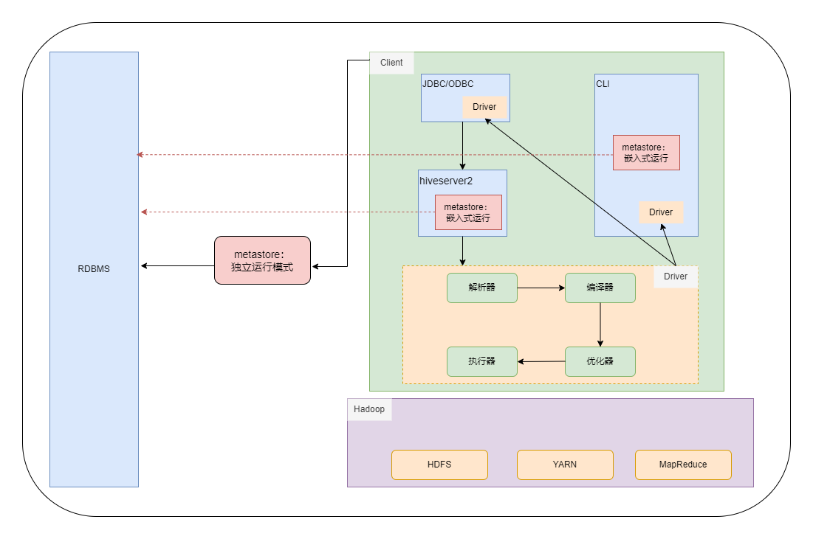

<h1 align = "center">Hive
</h1>

# 一、概述

## 1.1、Hive简介

`Hive`是由`Facebook`开源，基于`Hadoop`的一个数据仓库工具，可以将结构化的数据文件映射为一张表，并提供类`SQL`查询功能。需要注意的是，`Hive`只能对结构化的数据进行映射，非结构化数据解决不了。

**`Hive`的本质是将`Hive SQL`转化成`MapReduce`程序：**

-   `Hive`处理的数据存储在`HDFS`中
-   `Hive`分析数据的底层实现是`MapReduce`
-   执行程序运行在`YARN`上

**`Hive`优点：**

-   操作接口采用类`SQL`语法，简单、容易上手
-   避免了去写`MapReduce`，学习成本低

**`Hive`缺点：**

-   `Hive SQL`的表达能力有限：
    -   迭代算法无法表达
    -   `MapReduce`数据处理流程的限制，效率更高的算法无法实现
-   `Hive SQL`的效率比较低：
    -   `Hive SQL`是``MapReduce``的二次包装，其执行效率通常较低
    -   `Hive SQL`调优比较困难

**`Hive`特点：**

-   `Hive`执行延迟较高，通常用于数据分析以及对实时性要求不高的场景
-   `Hive`的优势在于大量数据的快速读取以及处理
-   `Hive`支持自定义函数，可根据自己的需求实现函数

## 1.2、Hive的基本架构

`Hive`的架构包含三个部分：`Hive`、`RDBMS`、`Hadoop`



**`Hive`端：**

-   `Client`：用户接口，提供用户连接`Hive`的方法，包含：`CLI(Command-Line Interface)`和`JDBC`连接两种客户端
    -   **`CLI`：命令行客户端，`CLI`客户端只能在安装了`Hive`节点的本地开启**
    -   **`JDBC/ODBC`：远程连接客户端，通常由用户远程连接`hiveserver2`，由`hiveserver2`代理用户访问`Hive`数据**
-   `Driver`：将`Hive SQL`转换成`MapReduce`任务的组件。在使用`CLI`客户端时，`Driver`运行在`CLI`客户端中；在使用`JDBC`或`ODBC`客户端时，`Driver`运行在`hiveserver2`中
    -   解析器`SQL Parser`：将`SQL`字符串转换成抽象语法树`AST`，这一步一般都用第三方工具库完成，比如`antlr`；对`AST`进行语法分析，比如表是否存在、字段是否存在、`SQL`语义是否有误
    -   编译器`Physical Plan`：将`AST`编译生成逻辑执行计划
    -   优化器`Query Optimizer`：对逻辑执行计划进行优化
    -   执行器`Execution`：把逻辑执行计划转换成可以运行的物理计划。对于`Hive`来说，就是`MapReduce/Spark`

**`Hadoop`：**使用`HDFS`存储数据，使用`YARN`调度`MapReduce`任务，使用`MapReduce`进行计算

**`RDBMS`：**一般使用`MySQL`作为元数据信息存储的关系型数据库。元数据信息一般包括表名、表所属的数据库，默认库名是`default`，表的拥有者、列、分区字段、表的类型（是否是外部表）、表的数据所在目录等

**==`Hive`相关服务介绍==**

**`metastore`服务**

`Hive`的`metastore`服务的作用是为`Hive`的`CLI`客户端或者`hiveserver2`服务提供元数据访问接口。

`metastore`有两种运行模式，分别是嵌入式模式和独立服务模式。

在嵌入式模式下，每个`Hive`客户端，都会在其本地启动一个`metastore`服务，并由`metastore`直接访问元数据库，并返回相应信息。因此，在进行`Hive`配置的时候，对于使用`metastore`嵌入式的`Hive`客户端所在的节点而言，需要在`hive-site.xml`配置文件中配置用于访问元数据库的配置信息，即以下配置：

```xml
<!-- jdbc连接的URL -->
<property>
    <name>javax.jdo.option.ConnectionURL</name>
    <value>jdbc:mysql://hadoop132:3306/metastore?useSSL=false</value>
</property>

<!-- jdbc连接的Driver-->
<property>
    <name>javax.jdo.option.ConnectionDriverName</name>
    <value>com.mysql.jdbc.Driver</value>
</property>

<!-- jdbc连接的username-->
<property>
    <name>javax.jdo.option.ConnectionUserName</name>
    <value>root</value>
</property>

<!-- jdbc连接的password -->
<property>
    <name>javax.jdo.option.ConnectionPassword</name>
    <value>1234</value>
</property>
```

在独立服务模式下，每个`Hive`的客户端将访问同一个`metastore`，由同一个`metastore`服务访问元数据库，并返回元数据信息，因此，在进行`Hive`配置时，只需要在需要开启`metastore`服务的节点上配置上述访问元数据库的配置信息，由该`metastore`直接访问元数据库，并返回元数据信息。

除此之外，还需要在需要开启`Hive`客户端的节点上配置访问`metastore`服务所需要的配置参数，即：

```xml
<!-- 指定连接metastore服务的地址 -->
<property>
    <name>hive.metastore.uris</name>
    <value>thrift://hadoop132:9083</value>
</property>
```

**`hiveserver2`服务**

`hiveserver2`服务的作用是提供`JDBC/ODBC`的访问接口，为开发者提供远程访问`Hive`数据的功能，即远程访问`Hadoop`的功能；访问`metastore`服务，获取元数据信息。

**在远程访问`Hive`数据时，客户端并未直接访问`Hadoop`集群，而是由`Hivesever2`代理访问。由于`Hadoop`集群中的数据具备访问权限控制，因此，客户端在访问`Hive`数据时，其用户身份有两种可能。一种可能的身份是：开启客户端的用户；另一种可能是开启`hiveserver2`服务的用户。**

**具体由哪个用户来访问`HDFS`的数据，由参数`hive.server2.enable.doAs`决定。该参数的含义是是否启用`hiveserver2`的用户模拟功能。如果启用，即配置该参数为`true`，那么`hiveserver2`会模拟成客户端的启动用户去访问`HDFS`；如果不启用，那么`hiveserver2`会直接使用启动`hiveserver2`的用户去访问`HDFS`。默认情况下，该参数是启用的。**

**需要注意的是，`hiveserver2`的模拟用户功能，依赖于`Hadoop`提供的代理用户功能`proxy user`，只有`Hadoop`中的代理用户才能模拟其他用户的身份访问`Hadoop`集群。**

**因此，在`Hadoop`集群中需要将`hiveserver2`的启动用户设置为`Hadoop`的代理用户。具体的配置操作为：修改`Hadoop`的配置文件`core-site.xml`，添加以下配置：**

```xml
<!--配置所有节点的tom用户都可作为代理用户-->
<!-- 配置哪个节点的哪个用户作为Hadoop的代理用户 -->
<property>
    <name>hadoop.proxyuser.tom.hosts</name>
    <value>*</value> <!-- 值配置节点的ip -->
</property>

<!--配置tom用户能够代理的用户组为任意组-->
<!-- 配置代理用户（现在是tom）能够代理哪个用户组的用户 -->
<property>
    <name>hadoop.proxyuser.tom.groups</name>
    <value>*</value>
</property>

<!--配置tom用户能够代理的用户为任意用户-->
<!-- 配置代理用户（现在是tom）能够代理具体的哪个用户 -->
<property>
    <name>hadoop.proxyuser.tom.users</name>
    <value>*</value>
</property>
```

**除此之外，还需要在需要启动`hiveserver2`服务的`Hive`节点配置`hiveserver2`的连接参数，即`url`和端口号。具体操作为在`hive-site.xml`文件中添加以下配置：**

```xml
<!-- 指定hiveserver2连接的host -->
<property>
	<name>hive.server2.thrift.bind.host</name>
	<value>hadoop102</value>
</property>

<!-- 指定hiveserver2连接的端口号 -->
<property>
	<name>hive.server2.thrift.port</name>
	<value>10000</value>
</property>
```

# 二、Hive的安装部署

**见“大数据组件部署文档.md”**

# 三、