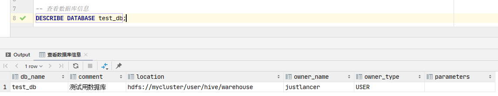

<h1 align = "center">Hive
</h1>

# 一、概述

## 1.1、Hive简介

`Hive`是由`Facebook`开源，基于`Hadoop`的一个数据仓库工具，可以将结构化的数据文件映射为一张表，并提供类`SQL`查询功能。需要注意的是，`Hive`只能对结构化的数据进行映射，非结构化数据解决不了。

**`Hive`的本质是将`Hive SQL`转化成`MapReduce`程序：**

-   `Hive`处理的数据存储在`HDFS`中
-   `Hive`分析数据的底层实现是`MapReduce`
-   执行程序运行在`YARN`上

**`Hive`优点：**

-   操作接口采用类`SQL`语法，简单、容易上手
-   避免了去写`MapReduce`，学习成本低

**`Hive`缺点：**

-   `Hive SQL`的表达能力有限：
    -   迭代算法无法表达
    -   `MapReduce`数据处理流程的限制，效率更高的算法无法实现
-   `Hive SQL`的效率比较低：
    -   `Hive SQL`是``MapReduce``的二次包装，其执行效率通常较低
    -   `Hive SQL`调优比较困难

**`Hive`特点：**

-   `Hive`执行延迟较高，通常用于数据分析以及对实时性要求不高的场景
-   `Hive`的优势在于大量数据的快速读取以及处理
-   `Hive`支持自定义函数，可根据自己的需求实现函数

## 1.2、Hive的基本架构

`Hive`的架构包含三个部分：`Hive`、`RDBMS`、`Hadoop`


**`Hive`端：**

-   `Client`：用户接口，提供用户连接`Hive`的方法，包含：`CLI(Command-Line Interface)`和`JDBC`连接两种客户端
    -   **`CLI`：命令行客户端，`CLI`客户端只能在安装了`Hive`节点的本地开启**
    -   **`JDBC/ODBC`：远程连接客户端，通常由用户远程连接`hiveserver2`，由`hiveserver2`代理用户访问`Hive`数据**
-   `Driver`：将`Hive SQL`转换成`MapReduce`任务的组件。在使用`CLI`客户端时，`Driver`运行在`CLI`客户端中；在使用`JDBC`或`ODBC`客户端时，`Driver`运行在`hiveserver2`中
    -   解析器`SQL Parser`：将`SQL`字符串转换成抽象语法树`AST`，这一步一般都用第三方工具库完成，比如`antlr`；对`AST`进行语法分析，比如表是否存在、字段是否存在、`SQL`语义是否有误
    -   编译器`Physical Plan`：将`AST`编译生成逻辑执行计划
    -   优化器`Query Optimizer`：对逻辑执行计划进行优化
    -   执行器`Execution`：把逻辑执行计划转换成可以运行的物理计划。对于`Hive`来说，就是`MapReduce/Spark`

**`Hadoop`：**使用`HDFS`存储数据，使用`YARN`调度`MapReduce`任务，使用`MapReduce`进行计算

**`RDBMS`：**一般使用`MySQL`作为元数据信息存储的关系型数据库。元数据信息一般包括表名、表所属的数据库，默认库名是`default`，表的拥有者、列、分区字段、表的类型（是否是外部表）、表的数据所在目录等

**==`Hive`相关服务介绍==**

**`metastore`服务**

`Hive`的`metastore`服务的作用是为`Hive`的`CLI`客户端或者`hiveserver2`服务提供元数据访问接口。

`metastore`有两种运行模式，分别是嵌入式模式和独立服务模式。

在嵌入式模式下，每个`Hive`客户端，都会在其本地启动一个`metastore`服务，并由`metastore`直接访问元数据库，并返回相应信息。因此，在进行`Hive`配置的时候，对于使用`metastore`嵌入式的`Hive`客户端所在的节点而言，需要在`hive-site.xml`配置文件中配置用于访问元数据库的配置信息，即以下配置：

```xml
<!-- jdbc连接的URL -->
<property>
    <name>javax.jdo.option.ConnectionURL</name>
    <value>jdbc:mysql://hadoop132:3306/metastore?useSSL=false</value>
</property>

<!-- jdbc连接的Driver-->
<property>
    <name>javax.jdo.option.ConnectionDriverName</name>
    <value>com.mysql.jdbc.Driver</value>
</property>

<!-- jdbc连接的username-->
<property>
    <name>javax.jdo.option.ConnectionUserName</name>
    <value>root</value>
</property>

<!-- jdbc连接的password -->
<property>
    <name>javax.jdo.option.ConnectionPassword</name>
    <value>1234</value>
</property>
```

在独立服务模式下，每个`Hive`的客户端将访问同一个`metastore`，由同一个`metastore`服务访问元数据库，并返回元数据信息，因此，在进行`Hive`配置时，只需要在需要开启`metastore`服务的节点上配置上述访问元数据库的配置信息，由该`metastore`直接访问元数据库，并返回元数据信息。

除此之外，还需要在需要开启`Hive`客户端的节点上配置访问`metastore`服务所需要的配置参数，即：

```xml
<!-- 指定连接metastore服务的地址 -->
<property>
    <name>hive.metastore.uris</name>
    <value>thrift://hadoop132:9083</value>
</property>
```

**`hiveserver2`服务**

`hiveserver2`服务的作用是提供`JDBC/ODBC`的访问接口，为开发者提供远程访问`Hive`数据的功能，即远程访问`Hadoop`的功能；访问`metastore`服务，获取元数据信息。

**在远程访问`Hive`数据时，客户端并未直接访问`Hadoop`集群，而是由`Hivesever2`代理访问。由于`Hadoop`集群中的数据具备访问权限控制，因此，客户端在访问`Hive`数据时，其用户身份有两种可能。一种可能的身份是：开启客户端的用户；另一种可能是开启`hiveserver2`服务的用户。**

**具体由哪个用户来访问`HDFS`的数据，由参数`hive.server2.enable.doAs`决定。该参数的含义是是否启用`hiveserver2`的用户模拟功能。如果启用，即配置该参数为`true`，那么`hiveserver2`会模拟成客户端的启动用户去访问`HDFS`；如果不启用，那么`hiveserver2`会直接使用启动`hiveserver2`的用户去访问`HDFS`。默认情况下，该参数是启用的。**

**需要注意的是，`hiveserver2`的模拟用户功能，依赖于`Hadoop`提供的代理用户功能`proxy user`，只有`Hadoop`中的代理用户才能模拟其他用户的身份访问`Hadoop`集群。**

**因此，在`Hadoop`集群中需要将`hiveserver2`的启动用户设置为`Hadoop`的代理用户。具体的配置操作为：修改`Hadoop`的配置文件`core-site.xml`，添加以下配置：**

```xml
<!--配置所有节点的tom用户都可作为代理用户-->
<!-- 配置哪个节点的哪个用户作为Hadoop的代理用户 -->
<property>
    <name>hadoop.proxyuser.tom.hosts</name>
    <value>*</value> <!-- 值配置节点的ip -->
</property>

<!--配置tom用户能够代理的用户组为任意组-->
<!-- 配置代理用户（现在是tom）能够代理哪个用户组的用户 -->
<property>
    <name>hadoop.proxyuser.tom.groups</name>
    <value>*</value>
</property>

<!--配置tom用户能够代理的用户为任意用户-->
<!-- 配置代理用户（现在是tom）能够代理具体的哪个用户 -->
<property>
    <name>hadoop.proxyuser.tom.users</name>
    <value>*</value>
</property>
```

**除此之外，还需要在需要启动`hiveserver2`服务的`Hive`节点配置`hiveserver2`的连接参数，即`url`和端口号。具体操作为在`hive-site.xml`文件中添加以下配置：**

```xml
<!-- 指定hiveserver2连接的host -->
<property>
	<name>hive.server2.thrift.bind.host</name>
	<value>hadoop102</value>
</property>

<!-- 指定hiveserver2连接的端口号 -->
<property>
	<name>hive.server2.thrift.port</name>
	<value>10000</value>
</property>
```

# 二、Hive的安装部署

## 2.1、Hive安装部署

**见“大数据组件部署文档.md”**

## 2.2、Hive常用技巧

### 2.2.1 Hive常用交互命令

```txt
usage: hive
 -d,--define <key=value>          Variable subsitution to apply to hive
                                  commands. e.g. -d A=B or --define A=B
                                  
    --database <databasename>     Specify the database to use
    
 -e <quoted-query-string>         SQL from command line
 
 -f <filename>                    SQL from files
 
 -H,--help                        Print help information
 
    --hiveconf <property=value>   Use value for given property
    
    --hivevar <key=value>         Variable subsitution to apply to hive
    
                                  commands. e.g. --hivevar A=B
                                  
 -i <filename>                    Initialization SQL file 指定一个初期化SQL来启动Hive
 
 -S,--silent                      Silent mode in interactive shell 不显式日志信息
 
 -v,--verbose                     Verbose mode (echo executed SQL to the console) 展示执行的SQL
```

### 2.2.2 Hive参数的配置

**`Hive`参数配置的三种方式：**

-   配置文件：

    -   系统默认配置文件：`hive-default.xml`
    -   用户自定义配置文件：`hive-site.xml`

    需要说明的是，用户自定义配置会覆盖默认配置，并且，`Hive`在启动的时候，已经不再加载默认的配置文件。因为`Hive`是作为`Hadoop`客户端启动的，所以`Hive`也会读入`Hadoop`配置，并且，`Hive`的配置将会覆盖`Hadoop`的配置。

-   命令行参数配置：

    -   在启动`Hive`的时候，通过使用命令参数`--hiveconf parameter = value`，可以配置`Hive`的参数
    -   查看当前`Hive`的参数值：`set parameter`

    需要注意的是，通过命令行进行配置的参数，只对当前`Hive`客户端有效。

-   参数声明方式：

    -   在`Hive SQL`中，通过`set`关键字，可以对参数进行设置：`set parameter = value`

    这种方式设置的参数也只是当前`Hive`客户端有效

### 2.2.3 Hive常见属性配置

-   `HIve CLI`客户端显示当前数据库名称和表头，需要在`hive-site.xml`配置文件中添加以下两个参数

    ```xml
    <property>
        <name>hive.cli.print.header</name>
        <value>true</value>
        <description>Whether to print the names of the columns in query output.</description>
    </property>
    <property>
        <name>hive.cli.print.current.db</name>
        <value>true</value>
        <description>Whether to include the current database in the Hive prompt.</description>
    </property>
    ```

-   `Hive`运行日志路径配置，需要修改`/opt/module/hive-3.1.3/conf/hive-log4j.properties`配置文件中`property.hive.log.dir`配置项的值

-   `Hive`的`JVM`堆内存设置，需要修改`/opt/module/hive-3.1.3/conf/hive-env.sh`中的`export HADOOP_HEAPSIZE`项

    ```txt
    export HADOOP_HEAPSIZE=2048
    ```

    新版本的`Hive`启动的时候，默认申请的`JVM`堆内存大小为`256 M`，`JVM`堆内存申请的太小，将导致`Hadoop Container`容器申请不到资源，或者申请占用的资源超出上限，进而失败。以及在开启本地模式，执行复杂的`SQL`时经常会报错：`java.lang.OutOfMemoryError: Java heap space`，因此最好调整一下`HADOOP_HEAPSIZE`这个参数

>   需要说明的是，默认情况下，配置文件hive-log4j.properties和hive-env.sh都有后缀.template，表示默认情况下，Hive不会读取该配置文件，因此在配置相应参数之前，需要先去掉后缀，使配置文件生效

-   关闭`Hadoop`虚拟内存检查，在`yarn-site.xml`配置文件中添加以下配置，并进行分发

    ```xml
    <property>
        <name>yarn.nodemanager.vmem-check-enabled</name>
        <value>false</value>
    </property>
    ```

# 三、Hive DDL

**==`Hive SQL`编写规范：本文档中介绍的`Hive`语法全部遵循以下规范==**

-   **`Hive`关键字使用大写字符；用户自定义内容，包含变量名（数据库名、表明、字段名、别名等）和属性名使用小写字符**
-   **使用`[]`表示可选项，使用`<>`表示用户填写内容**

## 3.1、数据库DDL

### 3.1.1 创建数据库

**语法格式：**

```hive
CREATE DATABASE [IF NOT EXISTS] <database_name>
[COMMENT <database_comment>]
[LOCATION <hdfs_path>]
[WITH DBPROPERTIES (<property_name> = <property_value>, ...)];
```

**关键字说明：**

-   `COMMENT`：数据库的说明与注释
-   `LOCATION`：数据库中数据在`Hadoop`上的存储路径，默认路径为：`${hive.metastore.warehouse.dir}/database_name.db`
-   `DBPROPERTIES`：用户自定义属性和属性值，例如，数据库的创建时间、地点、创建者、最近一次修改时间等。

**==创建数据库`test_db`用于数据库`DDL`演示：==**

```hive
-- 创建测试数据库
CREATE DATABASE IF NOT EXISTS test_db
    COMMENT '测试用数据库'
    LOCATION '/user/hive/warehouse/'
    WITH DBPROPERTIES ("creator" = "pqg", "create_time" = "2023-06-19","haha" = "hehe");
```

### 3.1.2 数据库查询

-   **展示所有数据库**

    **语法格式：**

    ```hive
    SHOW DATABASES [LIKE <'identifier_with_wildcards'];
    ```

    **关键字`LIKE`用于模糊匹配，其中，`*`表示任意个任意字符，`|`表示逻辑或**

-   **查看数据库信息**

    **语法：**

    ```hive
    DESCRIBE DATABASE [EXTENDED] <db_name>;
    -- OR
    DESC DATABASE [EXTENDED] <db_name>;
    ```

    **演示案例1**
    
    ```hive
    -- 查看数据库信息
    DESCRIBE DATABASE test_db;
    ```
    
    **`OUT`**
    
    **演示案例2**
    
    ```hive
    -- 查看数据库详细信息
    DESCRIBE DATABASE EXTENDED test_db;
    ```
    
    **`OUT`**

### 3.1.3 修改数据库

在`Hive`中，可以通过`ALTER DATABASE`命令修改数据库的某些信息，其中能够修改的信息包括：`DBPROPERTIES`、`LOCATION`、`OWNER USER`。需要注意的时，修改数据库的`LOCATION`，不会改变当前已有数据表的路径信息，对于之后创建的数据表，其存储路径将会存储在新的`LOCATION`中。

**语法格式：**

```hive
-- 修改DBPROPERTIES
ALTER DATABASE <database_name> SET DBPROPERTIES (<property_name> = <property_value>, ...);

-- 修改LOCATION
ALTER DATABASE <database_name> SET LOCATION <hdfs_path>;

-- 修改OWNER USER
ALTER DATABASE <database_name> SET OWNER USER <user_name>;
```

### 3.1.4 删除数据库

**语法格式：**

```hive
DROP DATABASE [IF EXISTS] <database_name> [RESTRICT|CASCADE];
```

**关键字说明**

-   `RESTRICT`：严格模式，如果数据库不为空，则会删除失败，默认为该模式
-   `CASCADE`：级联模式，若数据库不为空，则会将库中的表一并删除

### 3.1.5 切换数据库

**语法格式：**

```hive
USE <database_name>;
```

## 3.2、表DDL

### 3.2.1 创建表

#### 3.2.1.1 一般建表方式

**语法格式：**

```hive
CREATE [TEMPORARY] [EXTERNAL] TABLE [IF NOT EXISTS] [<db_name.>]<table_name>
[(<col_name> <DATA_TYPE> [COMMENT <col_comment>], ...)]
[COMMENT <table_comment>]
[PARTITIONED BY (<col_name> <data_type> [COMMENT <col_comment>], ...)]
[CLUSTERED BY (<col_name>, <col_name>, ...) 
[SORTED BY (<col_name> [ASC|DESC], ...)] INTO <int num_buckets> BUCKETS]
[ROW FORMAT <row_format>] 
[STORED AS <file_format>]
[LOCATION <hdfs_path>]
[TBLPROPERTIES (<property_name> = <property_value>, ...)]
```

**关键字说明：**

-   `TEMPORARY`：使用该关键字创建临时表。临时表只会在当前会话有效，会话结束后，表会被删除

-   `EXTERNAL`：使用该关键字将创建外部表，与之相对应的是创建内部表，也称为管理表

    -   外部表：`Hive`将接管外部表的元数据信息，不管理实际的数据。外部表删除时，只会删除元数据信息，不会删除实际的数据
    -   内部表（内部表）：`Hive`将接管内部表的元数据信息和实际的数据。内部表删除时，元数据信息和实际的数据都会被删除

-   `DATA_TYPE`：`Hive`支持的数据类型。`Hive`中，字段的数据类型可以分为基本数据类型和复杂数据类型

    -   基本数据类型

        | 数据类型    | 说明                                                | 定义                          |
        | ----------- | --------------------------------------------------- | ----------------------------- |
        | `tinyint`   | `1 byte`有符号整数                                  |                               |
        | `smallint`  | `2 byte`有符号整数                                  |                               |
        | `int`       | `4 byte`有符号整数                                  |                               |
        | `bigint`    | `8 byte`有符号整数                                  |                               |
        | `boolean`   | 布尔类型，`true`或者`false`                         |                               |
        | `float`     | 单精度浮点数                                        |                               |
        | `double`    | 双精度浮点数                                        |                               |
        | `decimal`   | 十进制精准数字类型                                  | `decimal(16,2)`               |
        | `varchar`   | 字符序列，需指定最大长度，最大长度的范围是[1,65535] | `varchar(32)`                 |
        | `string`    | 字符串，无需指定最大长度                            |                               |
        | `timestamp` | 时间类型                                            | 格式为：`yyyy-MM-dd hh:mm:ss` |
        | `date`      | 时间类型                                            | 格式为：`yyyy-MM-dd`          |
        | `binary`    | 二进制数据                                          |                               |

    -   复杂数据类型

        | 数据类型 | 说明                                   | 定义                          | 取值方式     |
        | -------- | -------------------------------------- | ----------------------------- | ------------ |
        | `array`  | 一组相同类型的值的集合                 | `array<string>`               | `arr[0]`     |
        | `map`    | 一组相同类型的键-值对集合              | `map<string, int>`            | `map['key']` |
        | `struct` | 由多个属性组成，属性有自己的名称和类型 | `struct<id:int, name:string>` | `struct.id`  |

    -   数据类型转换：`Hive`的基本数据类型可以做类型转换，转换的方式包括隐式转换以及显示转换

        -   隐式转换：具体规则如下：

            -   任何整数类型都可以隐式地转换为一个范围更广的类型，如`tinyint`可以转换成`int`，`int`可以转换成`bigint`
            -   所有整数类型、`float`和`string`类型都可以隐式地转换成`double`。`string`类型转换成`double`需要数据具备数值形式
            -   `tinyint`、`smallint`、`int`都可以转换为`float`
            -   `boolean`类型不可以转换为任何其它的类型

            详细的转换规则可查看官网：[Allowed Implicit Conversions](https://cwiki.apache.org/confluence/display/hive/languagemanual+types#LanguageManualTypes-AllowedImplicitConversions)

        -   显示转换：需要通过`cast`函数进行数据转换

            **语法格式：**

            ```hive
            cast(expr as <type>)
            ```

    -   `PARTITIONED BY`：创建分区表

    -   `CLUSTERED BY`：创建分桶表

    -   `SORTED BY...INTO...BUCKETS`：与`CLUSTERED BY`联合使用，设置分桶表的排序字段和分桶数量

    -   `ROW FORMAT`：用于指定`SERDE`，`SERDE`是`Serializer and Deserializer`的缩写，用于`Hive`读写`Hadoop`文件中每一行数据的序列化和反序列化的方式。需要注意的是`ROW FORMAT`用于指定Hive读取每一行数据的方式SERDE`详细的介绍可看官网： [Hive-Serde](https://cwiki.apache.org/confluence/display/Hive/DeveloperGuide#DeveloperGuide-HiveSerDe)

        `ROW FORMAT`语法介绍。`Hive`官方提供了两种`ROW FORMAT`的书写方式，一种是对于结构化数据的读取，另一种是对于半结构化数据的读取

        **结构化数据：**通过`DELIMITED`关键字对文件中的每个字段按照特定分隔符进行分割，`Hive`会使用默认的`SERDE`对每行数据进行序列化和反序列化

        **语法格式：**

        ```hive
        ROW FORAMT DELIMITED 
        [FIELDS TERMINATED BY <char field_separator>] 
        [COLLECTION ITEMS TERMINATED BY <char collection_separator>] 
        [MAP KEYS TERMINATED BY <char map_separator>] 
        [LINES TERMINATED BY <char line_separator>] 
        [NULL DEFINED AS <char replace_null>]
        ```

        **关键字介绍：**

        -   `FIELDS TERMINATED BY`：字段分隔符
        -   `COLLECTION ITEMS TERMINATED BY`：复杂数据类型`map`、`array`和`struct`中每个元素之间的分隔符
        -   `MAP KEYS TERMINATED BY`：`map`中，`key`和`value`之间的分隔符
        -   `LINES TERMINATED BY`：行分隔符
        -   `NULL DEFINED AS`：将空值替换为指定字符，默认的替换字符为：`\N`

        **半结构化数据：**通过`SERDE`关键字，指定`Hive`官方提供的内置`SERDE`或用户自定义`SERDE`，最为常见的内置`SERDE`为对`JSON`数据解析的`SERDE`，其`SERDE`的全类名为：`org.apache.hadoop.hive.serde2.JsonSerDe`

        **语法格式：**

        ```hive
        ROW FORMAT SERDE <serde_name> [WITH SERDEPROPERTIES (<property_name> = <property_value>,...)]
        ```

    -   `STORED AS`：指定`Hive`表数据在`Hadoop`中的文件存储格式，常见的文件格式有，`textfile`（默认值），`sequence file`，`orc file`，`parquet file`

        在`HDFS`中，不同存储的格式的文件，`Hadoop`读取和写入的所使用的`InputFormat`和`OutputFormat`均不一样，因此，指定数据的文件存储格式，其底层是指定了`Hadoop`读取这些**文件**的方式

    -   `LOCATION`：指定表所对应的`HDFS`路径，若不指定路径，其默认值为：`${hive.metastore.warehouse.dir}/db_name.db/table_name`

    -   `TBLPROPERTIES`：自定义表相关属性，使用`key-value`的形式进行定义

#### 3.2.1.2 CREATE TABLE  AS SELECT (CTAS)建表

该建表语法利用`SELECT`查询返回的结果直接建表，表的结构和查询语句的结构保持一致， `SELECT`语句的查询结果即为表的初始数据。

**语法格式：**

```hive
CREATE [TEMPORARY] TABLE [IF NOT EXISTS] <table_name> 
[COMMENT <table_comment>] 
[ROW FORMAT <row_format>] 
[STORED AS <file_format>] 
[LOCATION <hdfs_path>]
[TBLPROPERTIES (<property_name> = <property_value>, ...)]
[AS <select_statement>]
```

#### 3.2.1.3 CREATE TABLE LIKE建表

该建表语法将复刻一张已存在的表结构，与`CTAS`建表语法不同的是，该语法只能创建出表结构，无法在创建表的同时添加初始化数据。

**语法格式：**

```hive
CREATE [TEMPORARY] [EXTERNAL] TABLE [IF NOT EXISTS] [<db_name.>]<table_name>
[LIKE <exist_table_name>]
[ROW FORMAT <row_format>] 
[STORED AS <file_format>] 
[LOCATION <hdfs_path>]
[TBLPROPERTIES (<property_name> = <property_value>, ...)]
```

**演示案例：创建一张表**

```hive
-- 创建测试数据表
CREATE TABLE IF NOT EXISTS user_info
(
    id   int COMMENT '用户id',
    name varchar(20) COMMENT '用户姓名',
    age  int COMMENT '用户年龄',
    mail string COMMENT '用户邮箱'
)
    COMMENT '用户信息表'
;
```

### 3.2.2 查看表

#### 3.2.2.1 查看所有表

**语法格式：**

```hive
SHOW TABLES [IN <database_name>] [LIKE <identifier_with_wildcards>];
```

**演示案例：查看`test_db`数据库下的所有数据表**

```hive
-- 查看test_db数据库下的所有数据表
SHOW TABLES IN test_db;
```


#### 3.2.2.2 查看表信息

**语法格式：**

```hive
DESCRIBE | DESC [EXTENDED | FORMATTED] [<db_name.>]<table_name>
```

**演示：查看`user_info`表的信息以及详细信息**

```hive
-- 查看user_info表的信息
DESC user_info;
```


```hive
-- 查看user_info表的详细信息
DESC EXTENDED user_info;
```


#### 3.2.2.3 修改表

-   **重命名表**

    ```hive
    ALTER TABLE <table_name> RENAME TO <new_table_name>
    ```

-   **增加列：在指定表中新增一列，新增列置于末尾**

    ```hive
    ALTER TABLE <table_name> ADD COLUMNS (<col_name> <data_type> [COMMENT <col_comment>], ...)
    ```

-   **更新列：可以修改指定表的指定列的列名、数据类型、注释信息以及在表中的位置**

    **==需要说明的是，修改列在表中的位置，只会修改元数据信息，不会修改`Hadoop`中的数据，因此，非必要不要修改列的位置信息。如果修改了列的信息，那么需要手动修改`Hadoop`中数据==**

    ```hive
    ALTER TABLE <table_name> 
    CHANGE [COLUMN] <col_old_name> <col_new_name> <column_type> 
    [COMMENT <col_comment>] [FIRST | AFTER <column_name>]
    ```

-   **替换列：使用新的列集替换原来的全部列，同样也只是修改元数据信息**

    ```hive
    ALTER TABLE <table_name> 
    REPLACE COLUMNS (<col_name> <data_type> [COMMENT <col_comment>], ...)
    ```

#### 3.2.2.4 删除表

**语法格式：**

```hive
DROP TABLE [IF EXISTS] <table_name>;
```

#### 3.2.2.5 清空表

```hive
TRUNCATE [TABLE] <table_name>;
```

# 四、Hive DML

## 4.1、Load

`Load`语句用于将文件中的数据导入到`Hive`的数据表中

**语法格式：**

```hive
LOAD DATA [LOCAL] INPATH <file_path> [OVERWRITE] INTO TABLE <table_name> 
[PARTITION (<partcol1> = <val1>, <partcol2> = <val2> ...)];
```

**关键字说明：**

-   `LOCAL`：使用该关键字，表示将服务器节点本地文件的数据加载到`Hive`中，其本地根据不同的客户端类型会有所不同，如果是`Hive CLI`客户端，那么本地指的是`Hive CLI`所在的节点；如果使用`JDBC`客户端，那么本地指的是`hiveserver2`服务所在的节点。如果不使用`LOCAL`关键字，表示将`HDFS`中的文件加载到`Hive`中

    需要注意的是，如果使用`LOCAL`关键字，那么会将本地的文件复制一份到`HDFS`中；如果不使用`LOCAL`关键字，那么会将`HDFS`中的文件剪切到表的存储路径下

-   `OVERWRITE`：使用该关键字，表示新的文件数据将覆盖表原有的数据；不使用该关键字，表示向原有表中追加数据

-   `PARTITION`：表示上传到指定分区，若目标是分区表，需指定分区。

## 4.2、Insert

### 4.2.1 将给定Values插入表中

**语法格式：**

```hive
INSERT (INTO | OVERWRITE) TABLE <table_name> 
[PARTITION (<partcol1> [ = <val1> ], <partcol2> [ = val2 ] ...)] 
VALUES <values_row> [, <values_row> ...]
```

**`PARTITION`关键字说明**

使用`PARTITION`关键字表示向分区表中插入数据，其后需要跟上分区字段。

使用`partcol1 = val1`的形式指定分区，表示向指定的分区插入数据；使用`partcol1`的形式指定分区，表示进行动态分区，将根据分区字段的值，动态地将数据插入指定的分区中。

### 4.2.2 将查询结果插入表中

**语法格式：**

```hive
INSERT (INTO | OVERWRITE) TABLE <table_name> 
[PARTITION (<partcol1> = <val1>, <partcol2> = <val2> ...)] 
<select_statement>;
```

**关键字说明：**

-   `INTO`：将结果追加到目标表
-   `OVERWRITE`：用结果覆盖原有数据

### 4.2.3 将查询结果写入目标路径

**语法格式：**

```hive
INSERT OVERWRITE [LOCAL] DIRECTORY <directory> 
[ROW FORMAT <row_format>] 
[STORED AS <file_format>] 
<select_statement>;
```

## 4.3、Export & Import

`Export`导出语句可将表的数据和元数据信息一并导出到`HDFS`路径，`Import`可将`Export`导出的内容导入`Hive`，表的数据和元数据信息都会恢复。`Export`和`Import`可用于两个`Hive`实例之间的数据迁移。

**语法格式：**

```hive
-- 导出
EXPORT TABLE <table_name> TO <export_target_path>

-- 导入
IMPORT [EXTERNAL] TABLE <new_or_original_tablename> 
FROM <source_path> 
[LOCATION <import_target_path>]
```

**说明：**

-   导出语句中的目标路径`export_target_path`需要和导入语句中的源路径`source_path`保持一致
-   导入语句，相当于创建了一张`Hive`表，开发者可以控制这张表是否是外部表，以及存储路径

# 五、Hive DQL

**基本查询语法格式：**

```hive
SELECT [ALL | DISTINCT] select_expr1 [, select_expr2, ...]
FROM table_reference       
[WHERE where_condition]   
[GROUP BY col_list]        
[HAVING col_list]          
[ORDER BY col_list]        
[
    CLUSTER BY col_list | 
    [DISTRIBUTE BY col_list] [SORT BY col_list]
]
[LIMIT number]                
```

`Hive SQL`的语法格式与一般的关系型数据库的语法基本相似，因此，在`DQL`语法中，将会着重介绍`Hive`的特殊语法以及较为容易混淆的语法。对于基本查询语法，市面上已有许多`SQL`语法介绍，直接查看即可。

## 5.1、基本查询

### 5.1.1 LIMIT

一般查询将返回多行数据。使用`LIMIT`子句可以限制返回的行数。

```hive
SELECT *
FROM user_info
LIMIT 5 -- 表示返回查询结果的前5行
;

SELECT *
FROM user_info
LIMIT 2,3 -- 表示从第2行开始，向下抓取3行
; 
```

### 5.1.2 聚合函数

-   `count(*)`：统计所有行数，包含空值
-   `count(<column_name>)`：统计指定列一共有多少行，不包含空值
-   `max(<column_name>)`，返回指定列的除空值之外的最大值，如果所有数据都是空值，那么返回`null`
-   `min(<column_name>)`，返回指定列的除空值之外的最小值，如果所有数据都是空值，那么返回`null`
-   `sum(<column_name>)`，返回指定列除空值之外的所有数据的和，如果所有数据都是空值，那么返回`null`
-   `sum(<column_name>)`，返回指定列除空值之外的所有数据的平均值，如果所有数据都是空值，那么返回`null`

## 5.2、关系运算符

关系运算符主要使用在`where`和`having`字句中。

-   `A = B`：支持基本数据类型。如果`A`等于`B`则返回`true`，反之返回`false`。如果`null`参与计算，返回结果为`null`
-   `A <=> B`：支持基本数据类型。如果`A`和`B`都为`null`，返回结果为`true`；如果只有一方为`null`，返回结果为`null`。其他与`A = B`相同
-   `A <> B, A != B`：支持基本数据类型。`A`或者`B`为`null`则返回`null`；如果`A`不等于`B`，则返回`true`，反之返回`false`
-   `A < B`：支持基本数据类型。`A`或者`B`为`null`，则返回`null`；如果`A`小于`B`，则返回`true`，反之返回`false`
-   `A <= B`：支持基本数据类型。`A`或者`B`为`null`，则返回`null`；如果`A`小于等于`B`，则返回`true`，反之返回`false`
-   `A > B`：支持基本数据类型。  `A`或者`B`为`null`，则返回`null`；如果`A`大于`B`，则返回`true`，反之返回`false  `
-   `A >= B`：支持基本数据类型。`A`或者`B`为`null`，则返回`null`；如果`A`大于等于`B`，则返回`true`，反之返回`false`
-   `A [not] between B and C`：支持基本数据类型。如果`A`，`B`或者`C`任一为`null`，则结果为`null`。如果`A`的值大于等于`B`而且小于或等于`C`，则结果为`true`，反之为`false`。如果使用`not`关键字则可达到相反的效果。
-   `A is null`：支持所有数据类型。如果`A`为`null`，则返回`true`，反之返回`false`
-   `A is not null`：支持所有数据类型。如果`A`不等于`null`，则返回`true`，反之返回`false`
-   `A in (value1 [，value2, ...])`：支持所有数据类型。如果`A`的值存在于`in`列表中，返回`true`，否则返回`false`
-   `A [not] like B`：支持`string`类型。`B`是一个`SQL`下的简单正则表达式，也叫通配符模式，如果`A`与其匹配的话，则返回`true`；反之返回`false`。使用`%`表示任意多个字符，使用`_`表示一个字符
-   `A rlike B`, `A regexp B`：支持`string`类型。`B`是基于`java`的正则表达式，如果`A`与其匹配，则返回`true`；反之返回`false`。匹配使用的是`JDK`中的正则表达式接口实现的，因为正则也依据其中的规则。

## 5.3、逻辑运算符

-   `and`：逻辑与
-   `or`：逻辑或
-   `not`：逻辑非

## 5.4、排序

-   `ORDER BY`：全局排序，只创建一个`ReduceTask`任务

    `ORDER BY`子句在`SELECT`语句的最末尾，用于对所有数据进行排序，默认情况为升序排序`ASC`，使用`DESC`表示降序排序。一般情况下，单独使用`ORDER BY`将消耗大量内存资源，因此，一般将`ORDER BY`与`LIMIT`子句联合使用，在使用了`LIMIT`子句之后，`MapTask`任务会根据`LIMIT`限制的数据条数，提前将数据过滤，这样会使得`ReduceTask`不会消耗很多内存资源

-   `DISTRIBUTE BY`：设置分区字段，`MapReduce`将根据分区字段对数据进行分区

-   `SORT BY`：分区内排序。`SORT BY`为每一个分区创建一个排序文件，里面存放排序好的数据

-   `CLUSTER BY`：当`DISTRIBUTER BY`与`SORT BY`的字段相同时，可以使用`CLUSTER BY`替代

# 六、函数

`Hive`提供了大量的内置函数，按照其特点可大致分为如下几类：单行函数`UDF`、聚合函数`UDAF`、炸裂函数`UDTF`、窗口函数。

**与函数相关的命令：**

-   查看系统所有内置函数：

    ```hive
    SHOW FUNCTIONS;
    ```

-   查看内置函数的用法：

    ```hive
    DESCRIBE | DESC FUNCTION <function_name>
    ```

-   查看内置函数的详细信息：

    ```hive
    DESCRIBE | DESC FUNCTION EXTENDED <function_name>
    ```

## 6.1、算数运算函数

## 6.2、数值函数

## 6.3、字符串函数

**==需要注意的是，在`Hive`中，字符串的索引从`1`开始==**

## 6.4、日期函数

**==使用日期函数时，需要注意的是时区问题==**

## 6.5、流程控制函数

## 6.6、集合函数

**==需要声明的是，`Hive`不区分大小写==**

**`Array`相关函数：**

-   **`Array array(val1[, val2, …])`：声明一个数组**
-   **`boolean array_contains(Array<T>, value)`：判断集合中是否包含指定元素**
-   **`Array<T> sort_array(Array<T>)`**
-   **`int size(Array<T>)`：计算数组中元素的个数**
-   **`Array collect_list(col)`：将给定字段的数据构成一个数组，不去重**
-   **`Array collect_set(col)`：将给定字段的数据构成一个数组，去重**

**`Map`相关函数：**

-   **`Map map(key1, value1, key2, value2, ...)`：声明一个`map`集合**
-   **`Array<k> map_keys(Map<K.V>)`：返回集合中的全部`key`**
-   **`Array<V> map_keys(Map<K.V>)`：返回集合中的全部`value`**
-   **`int  size(Map<K.V>)`：返回`Map`集合中元素的个数**

**`Struct`相关函数：**

-   **`Struct struct(val1[, val2, val3, ...])`：声明`struct`中的各个属性**
-   **`Struct named_struct(name1, val1[, name2, val2, ...])`：同时声明``struct`的属性和值**

## 6.7、UDTF

**`UDTF(User Defined Table-Generating Functions)`：接收一行数据，输出一行或者多行数据**。

**`UDTF`一般与`lateral view`关键字联合使用**

-   **`T explode(ARRAY<T> a)`：返回`n`行数据，每行对应数组中的一个元素**
-   **`K,V explode(MAP<K,V> m)`：返回`n`行数据，每行对应每个`map`的`key-value`，其中一个字段是`map`的键，另一个字段是`map`的值**
-   **`int,T posexplode(ARRAY<T> a)`：返回`n`行数据，每行对应数据中的一个元素，以及该元素的索引**
-   **`T1,...,Tn inline(ARRAY<STRUCT<f1:T1,...,fn:Tn>> a)`：将结构体数组中的元素提取出来并插入到表的一个字段中，字段的值即为每个结构体对象**
-   **`T1,...,Tn/r stack(int r,T1 V1,...,Tn Vn)`：把`n`列转换成`r`行，每行有`n/r`个字段，其中`r`必须是个常数**
-   **`string1,...,stringN json_tuple(string jsonStr,string k1,...,string kn)`：从一个`JSON`字符串中获取多个键并作为一个元组返回，与`get_json_object`不同的是此函数能一次获取多个键值**
-   **`string 1,...,stringn parse_url_tuple(string urlStr,string p1,...,string pn)`：返回从`URL`中抽取指定`N`部分的内容，参数`url`是URL字符串，而参数`p1,p2,…`是要抽取的部分，这个参数包含`HOST`, `PATH`, `QUERY`, `REF`, `PROTOCOL`, `AUTHORITY`, `FILE`, `USERINFO`, `QUERY`**

## 6.8、窗口函数

## 6.9、自定义函数

当`Hive`提供的内置函数无法满足需求时，可以通过自定义函数来实现业务逻辑。

`Hive`的内置函数分为`UDF`、`UDAF`、`UDTF`和窗口函数，因此，自定义函数也可以定义这四类函数，但在一般的业务场景中，往往只需要自定义`UDF`函数，再结合其他内置函数就能够实现业务逻辑，因此，将着重介绍自定义`UDF`函数。

**[自定义函数`Hive`官方文档地址](https://cwiki.apache.org/confluence/display/Hive/HivePlugins)**

**自定义函数步骤：以自定义`UDF`为例：**

-   **导入`maven`依赖：**

    ```xml
    <!-- hive 3.1.2和3.1.3版本的函数没有什么区别，因此依赖的版本可以随意 -->
    <dependencies>
    	<dependency>
    		<groupId>org.apache.hive</groupId>
    		<artifactId>hive-exec</artifactId>
    		<version>3.1.3</version>
    	</dependency>
    </dependencies>
    ```

-   **继承`Hive`提供的抽象类，并实现抽象方法**

    -   **`UDF`：`org.apache.hadoop.hive.ql.udf.generic.GenericUDF`**

        ```java
            public ObjectInspector initialize(ObjectInspector[] arguments) throws UDFArgumentException {
                return null;
            }
        
            public Object evaluate(DeferredObject[] arguments) throws HiveException {
                return null;
            }
        
            public String getDisplayString(String[] children) {
                return null;
            }
        ```

        

    -   **`UDTF`：`org.apache.hadoop.hive.ql.udf.generic.GenericUDTF`**

        ```hive
            public void process(Object[] args) throws HiveException {
                
            }
        
            public void close() throws HiveException {
        
            }
        ```

-   **在`Hive`中注册并声明函数：**

    -   创建临时函数：

        -   将自定义函数打成`jar`包，并上传到`Hive`目录下，一般放在`Hive`的`lib`目录下

        -   将`jar`包添加到`hive`的`classpath`路径下。**注意该操作单会话内有效**

            ```hive
            ADD jar <jar_path>
            ```

        -   创建临时函数，并与自定义函数的全类名进行关联

            ```hive
            CREATE TEMPORARY FUNCTION <function_name>
            AS <full_class_name>
            ```

        -   随后便可以在该会话内使用自定义的临时函数

        -   **删除临时函数**

            ```hive
            DROP TEMPORARY FUNCTION <function_name>
            ```

        **==临时函数只在当前会话有效，与数据库没有关系。只要创建临时函数的会话不断开，在当前会话下，任意一个数据库都可以使用，其他会话全都不能使用。==**

    -   创建永久函数：

        -   将自定义函数打成`jar`包，并上传`HDFS`目录下

            与创建临时函数不同的时，在创建永久函数的时候，需要指定路径，并且因为元数据的原因，指定的路径还需要是`HDFS`的路径

        -   创建永久函数

            ```hive
            CREATE FUNCTION <function_name>
            AS <full_class_name>
            USING jar <jar_hdfs_path>
            ```

        -   随后边可以在`Hive`中使用永久函数

        -   删除永久函数

            ```hive
            DROP FUNCTION <function_name>
            ```

        **==需要注意的是，永久函数和会话没有关系，在创建了永久函数之后，其他会话也可以使用该函数。但区别与临时函数的是，永久函数由数据库之分，默认情况下，永久函数属于创建函数所在的数据库，如果位于其他数据库下，希望使用永久函数，那么需要指定永久函数的数据库名，因为默认情况下，永久函数会把当前数据库的库名加上。==**

# 七、分区表和分桶表

`Hive`中的分区就是将一张表的数据按照业务需要分散地存储到多个目录，每个目录就称之为该表的一个分区。因此，`Hive`中，分区表就是将数据分目录存储。

**完整的建表语句：**

```hive
CREATE [TEMPORARY] [EXTERNAL] TABLE [IF NOT EXISTS] [<db_name.>]<table_name>
[(<col_name> <DATA_TYPE> [COMMENT <col_comment>], ...)]
[COMMENT <table_comment>]
[PARTITIONED BY (<col_name> <data_type> [COMMENT <col_comment>], ...)]
[CLUSTERED BY (<col_name>, <col_name>, ...) 
[SORTED BY (<col_name> [ASC|DESC], ...)] INTO <int num_buckets> BUCKETS]
[ROW FORMAT <row_format>] 
[STORED AS <file_format>]
[LOCATION <hdfs_path>]
[TBLPROPERTIES (<property_name> = <property_value>, ...)]
```

其中，关键字`PARTITION`用于创建分区表，在创建分区表时，需要指定分区字段的名称和相应的数据类型。此外，指定分区字段时，可以指定多个分区，表示能够创建多级分区，在底层数据存储的体现上，表现为，一级分区目录下，存储着二级分区的目录。当分区层级较多时，依次类推。

## 7.1、分区表基本语法

### 7.1.1 创建分区表

### 7.1.2 分区表数据装载与查询

**数据装载**

与一般数据数据表的数据装载不同，向分区表中装载数据时，需要指定向哪个分区进行数据装载

-   **`load`方式：将本地或者`HDFS`上文件的数据装载到分区表的指定分区中**

    ```hive
    -- 语法格式
    LOAD DATA [LOCAL] INPATH <file_path> INTO TABLE <table_name> 
    PARTITION (<partition_col1> = <partition_value1> [, <partition_col2> = <partition_value2>, ...] );
    ```

-   **`insert`方式：将查询结果的数据装载到分区表的指定分区中**

    ```hive
    -- 语法格式
    INSERT INTO | OVERWRITE TABLE <table_name> 
    PARTITION (<partition_col1> = <partition_value1> [, <partition_col2> = <partition_value2>, ...])
    <select_statement>
    ```

**数据查询**

对分区表数据的查询中，只需要将分区字段作为普通的字段进行使用即可。建议在查询分区表数据时，在`WHERE`子句中对分区进行过滤，该操作将极大提升`Hive`的数据查询效率。

### 7.1.3 分区表操作命令

-   查看所有分区信息

    ```hive
    SHOW PARTITIONS <table_name>;
    ```

-   增加分区

    ```hive
    -- 增加一个分区
    ALTER TABLE <table_name> ADD PARTITION (<partition_col1> = <partition_value1>);
    
    -- 同时增加多个分区
    ALTER TABLE <table_name> ADD 
    PARTITION (<partition_col1> = <partition_value1>) 
    PARTITION (<partition_col2> = <partition_value2>)
    [PARTITION (<partition_col3> = <partition_value3>) ...]
    ;
    ```

-   删除分区

    ```hive
    -- 删除单个分区
    ALTER TABLE <table_name> DROP PARTITION (<partition_col1> = <partition_value1>);
    
    -- 删除多个分区，注意，分区之间需要用逗号隔开
    ALTER TABLE <table_name> DROP 
    PARTITION (<partition_col2> = <partition_value2>)
    [,PARTITION (<partition_col3> = <partition_value3>)
    , ...]
    ;
    ```

-   修复分区

    `Hive`将分区表的所有分区信息都保存在了元数据中，只有元数据与`HDFS`上的分区路径一致时，分区表才能正常读写数据。若手动创建或删除分区路径，`Hive`是感知不到的，这样会导致`Hive`的元数据和`HDFS`的分区路径不一致。除此之外，若分区表为外部表，执行`drop partition`命令后，分区元数据会被删除，而`HDFS`的分区路径不会被删除，同样会导致`Hive`的元数据和`HDFS`的分区路径不一致。

    而当元数据和`HDFS`路径不一致时，需要修复分区的元数据信息，分区表才能正常使用。

    **`ADD PARTITION`**

    如果手动创建`HDFS`的分区路径，`Hive`无法识别，可通过`ADD PARTITION`命令增加新增分区元数据信息，从而使元数据和分区路径保持一致

    **`DROP PARTITION`**

    如果手动删除`HDFS`的分区路径，`Hive`无法识别，可通过`DROP PARTITION`命令删除分区元数据信息，从而使元数据和分区路径保持一致

    **`MSCK`：`metastore check`**

    若分区元数据和HDFS的分区路径不一致，还可使用msck命令进行修复

    ```hive
    -- 语法格式
    MSCK REPAIRE TABLE <table_name> [ADD | DROP | SYNC PARTITIONS];
    ```

    **说明：**

    `MSCK REPAIRE TABLE <table_name>;`：等价于`MSCK REPAIRE TABLE <table_name> ADD PARTITIONS;`

    `MSCK REPAIRE TABLE <table_name> ADD PARTITIONS;`：该命令会增加`HDFS`路径存在但元数据缺失的分区信息

    `MSCK REPAIRE TABLE <table_name> DROP PARTITIONS;`：该命令会删除`HDFS`路径已经删除但元数据仍然存在的分区信息

    `MSCK REPAIRE TABLE <table_name> ADD PARTITIONS;`：该命令会同步`HDFS`路径和元数据分区信息，相当于同时执行上述的两个命令

## 7.2、动态分区

动态分区是指向分区表`INSERT`数据时，被写往的分区不指定具体的分区值，而是由每行数据的最后一个多出来的字段的值来动态决定当前数据发往哪个分区

使用动态分区，可只用一个`INSERT`语句将数据写入多个分区

**动态分区相关的参数**

-   **`hive.exec.dynamic.partition`：是否开启动态分区。默认值为`true`，表示开启动态分区**
-   **`hive.exec.dynamic.partition.mode`：严格模式和非严格模式。默认值为`strict`，表示严格模式。非严格模式取值为`nonstrict`。在严格模式下，使用动态分区要求必须指定至少一个分区为静态分区，即必须指定至少一个分区字段的值。在非严格模式下，允许所有的分区字段都使用动态分区**
-   **`hive.exec.max.dynamic.partitions`：一个`INSERT`语句可同时创建的最大的分区个数，默认值为`1000`**
-   **`hive.exec.max.dynamic.partitions.pernode`：单个`MapTask`或者`ReduceTask`可同时创建的最大的分区个数，默认为`100`**
-   **`hive.exec.max.created.files`：一个`INSERT`语句可以创建的最大的文件个数，默认值为`100000`**
-   **`hive.error.on.empty.partition=false`：当查询结果为空时且进行动态分区时，是否抛出异常，默认`false`，即不抛出异常**

## 7.3、分桶表

分区表是将数据按目录进行划分存储，而分桶表是将数据按文件进行划分存储。分区表与分桶表并不冲突，一张表既可以是分区表，同时，也可以是分桶表，这种情况下，数据的分桶将在每个目录下进行。

区别于分区表，分桶表的分桶字段必须是表中实际存在的字段。分区表中的分区字段虽然可以当作普通字段来使用，但其实并不是实际的字段，而是分区目录的目录名。

分桶表的基本原理是，首先为每行数据计算一个或多个指定字段的数据的`hash`值，然后模以一个指定的分桶数，最后将取模运算结果相同的行，写入同一个文件中，这个文件就称为一个分桶`bucket`。

**完整的建表语句**

```hive
CREATE [TEMPORARY] [EXTERNAL] TABLE [IF NOT EXISTS] [<db_name.>]<table_name>
[(<col_name> <DATA_TYPE> [COMMENT <col_comment>], ...)]
[COMMENT <table_comment>]
[PARTITIONED BY (<col_name> <data_type> [COMMENT <col_comment>], ...)]
[
    CLUSTERED BY (<col_name>, <col_name>, ...) 
   [SORTED BY (<col_name> [ASC|DESC], ...)] 
    INTO <int num_buckets> BUCKETS
]
[ROW FORMAT <row_format>] 
[STORED AS <file_format>]
[LOCATION <hdfs_path>]
[TBLPROPERTIES (<property_name> = <property_value>, ...)]
```

其中，`CLUSTERED BY`语句用来创建分桶表，创建分桶表时只需要传入一个或多个分桶字段即可

`SORTED BY`语句用来指定对分桶后的文件中的数据进行排序，可以指定一个或者多个字段，排序规则也可以指定升序排序或降序排序

`INTO`语句用来指定分桶的数量，即文件的个数

**分桶表的数据装载**

-   **`load`方式，将本地或者`HDFS`上文件的数据装载到分桶表中**

    `Hive 3.x`版本中，`load`数据可以直接跑`MapReduce`任务，因此，能够将一个文件或多个文件中的数据按分桶规则分别装载进不同的分桶中。而在`Hive 2.x`版本中，因为无法直接运行`MapReduce`任务，需要将数据传到一张表里，再通过查询的方式导入到分桶表里面。

    ```hive
    LOAD DATA [LOCAL] INPATH <file_path> INTO TABLE <table_name>;
    ```

-   **`INSERT`方式，这种方式一般用于将查询结果写入到一个分桶表中，因此只需要将分桶表作为普通的表写入到`SQL`语句中即可**

    ```hive
    INSERT INTO | OVERWRITE TABLE <table_name> 
    <select_statement>
    ```

