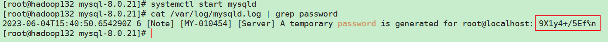

<h1 align = "center">Hadoop_HDFS&YARN_HA部署文档
</h1>

==**说明**==

**由于没有具体的服务器，部署文档以虚拟机进行**

**受限于计算机内存，本次部署的`Hadoop`集群规模为`3`台服务器**

# 一、技术选型

-   **`VMWare 16`**
-   **`CentOS 7`**
-   **`JDK 8`**
-   **`Hadoop-3.1.3`**
-   **`Zookeeper-3.5.7`**
    -   注意：`zookeeper`从`3.5.5`版本开始，软件包分为已编译包`-bin.tar.gz`和未编译的包`.tar.gz`，如果是未编译的包需要先进行编译之后才能使用，所以直接下载已编译包即可

-   **`Kafka-2.12-3.0.0`**
-   **`Flink 1.13`**
-   **`MySQL 8.0.21`**
-   **`Hive 3.1.3`**

# 二、集群规划（`HA`模式）

**`JournalNode`服务用于同步主备`NameNode`的`Eidts`编辑日志**

|    `hadoop132`    |  `hadoop133`  |    `hadoop134`    |
| :---------------: | :-----------: | :---------------: |
|    `Zookeeper`    |  `Zookeeper`  |    `Zookeeper`    |
|   `JournalNode`   | `JournalNode` |   `JournalNode`   |
|    `NameNode`     |  `NameNode`   |                   |
|    `DataNode`     |  `DataNode`   |    `DataNode`     |
| `ResourceManager` |               | `ResourceManager` |
|   `NodeManager`   | `NodeManager` |   `NodeManager`   |
|      `Kafka`      |    `Kafka`    |      `Kafka`      |
|      `Flink`      |    `Flink`    |      `Flink`      |
|      `Hive`       |               |                   |
|                   |  `metastore`  |                   |
|                   |               |   `hiveserver2`   |
|      `MySQL`      |               |                   |

# 三、虚拟机创建

<u>**基于`VMWare 16`创建`3`台虚拟机节点的步骤，略**</u>

<u>**为节约资源，三台虚拟机均为最小化安装，其中网络模式使用`NAT`模式**</u>

<u>**创建好的节点需要进行的配置：（三台节点均需要进行的配置）**</u>

**<u>以下操作均使用`root`用户进行</u>**

-   **安装软件包：`yum install -y epel-release`**

-   **安装`vim`编辑器：`yum install -y vim`**

-   **安装网络工具包：`yum install -y net-tools`**

-   **安装`rsync`同步工具：`yum install -y rsync`**

-   **静止防火墙开启自启：`systemctl disable firewalld`**

-   **网络配置：**

    -   **静态化IP地址：`vim /etc/sysconfig/network-scripts/ifcfg-ens33`**

        ```txt
        TYPE="Ethernet"
        PROXY_METHOD="none"
        BROWSER_ONLY="no"
        BOOTPROTO="static" # IP的配置方法[none|static|bootp|dhcp]（引导时不使用协议|静态分配IP|BOOTP协议|DHCP协议），此配置项设置为static
        DEFROUTE="yes"
        IPV4_FAILURE_FATAL="no"
        IPV6INIT="yes"
        IPV6_AUTOCONF="yes"
        IPV6_DEFROUTE="yes"
        IPV6_FAILURE_FATAL="no"
        IPV6_ADDR_GEN_MODE="stable-privacy"
        NAME="ens33"
        UUID="d6e62aa8-919e-4f14-8a0a-74d6953b61fe"
        DEVICE="ens33"
        ONBOOT="yes"
        IPADDR="192.168.200.132" # IP地址，三台节点的IP地址分别设置为192.168.200.132、192.168.200.132、192.168.200.132
        GATEWAY="192.168.200.2" # 网关
        DNS1="192.168.200.2" # 域名解析器
        ```

        **需要注意的是关于`IP`地址的网段，一般情况下，会和`Windows`系统的网段相同，安装好的虚拟机能直接与`Windows`进行通信，不需要额外设置。如果网段不同，那么需要将`VMWare`的`NAT`模式的网段与`Windows`的`VMnet8`的`IPv4`的网段设置成相同的**

-   **修改三台节点的主机名：`vim /etc/hostname`**

    ```txt
    hadoop132
    ```

    ```txt
    hadoop133
    ```

    ```
    hadoop134
    ```

-   **修改主机地址映射：`vim /etc/hosts`**

    ```txt
    192.168.200.132 hadoop132
    192.168.200.133 hadoop133
    192.168.200.134 hadoop134
    ```

-   **一般不会直接拿`root`用户操作，所以创建一个普通用户，但是需要配置一些权限**

    -   **创建用户：`useradd justlancer`**
    -   **配置密码：`passwd justlancer`。执行命令后，输入两次密码**
    -   **配置用户执行命令的相关权限：`vim /etc/sudoers`**

-   **创建`justlancer`用户需要使用的目录：**

    -   **创建软件包存放位置：`mkdir /opt/software`**
    -   **创建解压包存放位置：`mkdir /opt/module`**
    -   **修改文件所属用户：`chown justlancer /opt/software /opt/module`**
    -   **修改文件所属用户组：`chgrp justlancer /opt/software /opt/module`**

-   **至此，三台节点需使用`root`用户进行的配置基本完成，重启节点：`reboot`**

>   **==以下均为使用`justlancer`用户进行的操作==**
>
>   **==以下均为在`hadoop132`节点上进行的操作，在其他节点也需要进行同样的操作==**

-   **使用`justlancer`用户登录服务器**

-   **配置三台节点间的`ssh`免密登录：**

    -   **在任意一台节点用`ssh`登录任意一台其他节点，用以在`/home/justlancer`目录下创建`.ssh`文件，以`hadoop132`登录`hadoop133`为例（==这个操作只需要在三台节点中，任意一台节点执行一次即可==）：`[justlancer@hadoop132 ~]$ ssh hadoop133`**

    -   **进入`.ssh`目录：`cd /home/justlancer/.ssh`**

    -   **生成公钥和私钥，遇到提示连续三次输出回车即可：`ssh-keygen -t rsa`**

    -   **将生成的公钥发送到其他节点（包括自己），需执行三次`ssh-copy-id`命令：**

        ```bash
        [justlancer@hadoop132 .ssh]$ ssh-copy-id hadoop132
        [justlancer@hadoop132 .ssh]$ ssh-copy-id hadoop133
        [justlancer@hadoop132 .ssh]$ ssh-copy-id hadoop134
        ```

-   **编写集群间数据同步脚本，脚本名称`xsync`：**

    -   **`/home/justlancer`中创建`bin`目录：`mkdir /home/justlancer/bin`**

    -   **创建脚本文件并编写脚本：`vim /home/justlancer/bin/xsync`**

        ```bash
        #!/bin/bash
        
        #1. 判断参数个数
        if [ $# -lt 1 ]
        then
            echo Not Enough Arguement!
            exit;
        fi
        
        #2. 遍历集群所有机器
        for host in hadoop132 hadoop133 hadoop134
        do
            echo ====================  $host  ====================
            #3. 遍历所有目录，挨个发送
        
            for file in $@
            do
                #4. 判断文件是否存在
                if [ -e $file ]
                    then
                        #5. 获取父目录
                        pdir=$(cd -P $(dirname $file); pwd)
        
                        #6. 获取当前文件的名称
                        fname=$(basename $file)
                        ssh $host "mkdir -p $pdir"
                        rsync -av $pdir/$fname $host:$pdir
                    else
                        echo $file does not exists!
                fi
            done
        done
        ```
        
    -   **赋予脚本执行权限：`chmod u=rwx xsync`**
    
    -   **分发脚本自己：`xsync xsync`**

**==至此，集群安装部署的准备工作就完成了==**

# 四、安装Java运行环境

**==以下操作均在`hadoop132`节点上操作，完成之后进行文件分发==**

-   **利用`xftp`工具，将`JDK 8`安装包上传到`/opt/software`中**

-   **解压到`/opt/module`目录中：`tar -zxvf /opt/software/jdk-8u212-linux-x64.tar.gz -C /opt/moudule/`**

-   **配置环境变量：**

    -   **在`/etc/profile.d`目录下创建`.sh`文件，用于存放自己的环境变量：`vim /etc/profile.d/my_env.sh`**

        ```txt
        # JAVA_HOME
        export JAVA_HOME=/opt/module/jdk1.8.0_333
        export PATH=$PATH:$JAVA_HOME/bin
        ```

    -   **执行文件，让环境变量生效：`source /etc/profile`**

    -   **检查环境变量是否生效，如果打印`jdk`信息，则说明环境变量生效：`java -version`**

-   **编写查看各节点`Java`进程的脚本：`vim /home/justlancer/jpsall`**

    ```bash
    #!/bin/bash
    for machineIP in hadoop132 hadoop133 hadoop134; do
        echo "============== $machineIP ================="
        ssh $machineIP jps
    done
    ```

-   **赋予脚本执行权限：`chmod u=rwx /home/justlancer/jpsall`**

-   **分发文件：**

    -   **`JDK`：`xsync /opt/module/jdk1.8.0_212/`**
    -   **`/etc/profile.d/my_env.sh` 该文件位于`etc`目录下，使用`justlancer`用于分发文件，会存在问题，直接手动在各节点配置`Java`环境变量**

# 五、安装并配置Zookeeper集群

**==以下操作均在`hadoop132`节点上操作，完成之后进行文件分发。区别于其他集群，`Zookeeper`集群中`myid`配置文件是用于配置`Zookeeper`节点的身份，每个`Zookeeper`节点的配置内容是不同的==**

-   **利用`xftp`工具，将`apache-zookeeper-3.5.7-bin.tar.gz`上传到`/opt/software`中**

-   **解压到`/opt/module`目录中：`tar -zxvf /opt/software/apache-zookeeper-3.5.7-bin.tar.gz -C /opt/module/`**

-   **对`Zookeeper`解压包进行重命名，去掉`apache`前缀：`mv /opt/module/apache-zookeeper-3.5.7-bin/ /opt/module/zookeeper-3.5.7-bin/`**

-   **配置环境变量：`vim /etc/profile.d/my_env.sh`**

    ```txt
    #ZOOKEEPER_HOME
    export ZOOKEEPER_HOME=/opt/module/zookeeper-3.5.7-bin
    export PATH=$PATH:$ZOOKEEPER_HOME/bin
    ```

-   **执行文件，让环境变量生效：`source /etc/profile`**

-   **配置`Zookeeper`集群**

    -   **在`/opt/module/apache-zookeeper-3.5.7-bin/`目录下创建`zkData`目录，用于存放`Zookeeper`产生的数据：`mkdir /opt/module/zookeeper-3.5.7-bin/zkData`**

    -   **在`zkData`目录下创建`myid`文件，用于标识`Zookeeper`节点身份：`vim /opt/module/zookeeper-3.5.7-bin/zkData/myid`**

        ```txt
        2
        ```

        **==表示`hadoop132`节点上的`zookeeper`节点的身份为`2`==**

    -   **分发`myid`文件：`xsync /opt/module/zookeeper-3.5.7-bin/zkData/myid`**

    -   **修改`hadoop133`、`hadoop134`节点的`myid`**

        -   **`hadoop133`：`vim /opt/module/zookeeper-3.5.7-bin/zkData/myid`**

            ```txt
            3
            ```

        -   **`hadoop134`：`vim /opt/module/zookeeper-3.5.7-bin/zkData/myid`**

            ```txt
            4
            ```

    -   **重命名`zoo_sample.cfg`文件，并进行配置和分发**

        -   **重命名：`mv zoo_sample.cfg zoo.cfg`**
        -   **修改并添加配置：**
        -   **分发配置的文件，并去`hadoop133`、`hadoop134`节点删除`zoo_sample.cfg`文件**
            -   **分发zoo.cfg：`xsync /opt/module/zookeeper-3.5.7-bin/conf/zoo.cfg`**
            -   **在hadoop133、hadoop134节点上，删除zoo_sample.cfg：`rm /opt/module/zookeeper-3.5.7-bin/conf/zoo_sample.cfg`**

-   **编写`Zookeeper`集群群起群停脚本：`vim /home/justlancer/bin/zk_mine.sh`**

    ```bash
    #!/bin/bash
    # 群起群停zookeeper集群
    if [ $# -lt 1 ]; then
        echo '脚本缺少参数'
        exit;
    fi ;
    
    case $1 in
        'start' )
                for machineIP in hadoop132 hadoop133 hadoop134; do
                    echo "====================启动$machineIP zookeeper====================";
                    ssh $machineIP "/opt/module/zookeeper-3.5.7-bin/bin/zkServer.sh start"
                done
            ;;
        'stop' )
                for machineIP in hadoop132 hadoop133 hadoop134; do
                    echo "====================停止$machineIP zookeeper====================";
                    ssh $machineIP "/opt/module/zookeeper-3.5.7-bin/bin/zkServer.sh stop"
                done
            ;;
        * )
            echo '不是有效参数。参数仅包含<start><stop>'
            ;;
    esac
    ```

-   **赋予脚本执行权限：`chmod u=rwx /home/justlancer/bin/zk_mine.sh`**

-   **分发脚本：`xsync /home/justlancer/bin/zk_mine.sh`**

# 六、安装并配置Hadoop HA集群

**==以下操作均在`hadoop132`节点上操作，完成之后进行文件分发==**

-   **利用`xftp`工具，将`Hadoop-3.1.3.tar.gz`压缩包上传到`/opt/software`中**

-   **解压到`/opt/module`目录中：`tar -zxvf /opt/software/hadoop-3.1.3.tar.gz -C /opt/module/`**

-   **对`hadoop`解压包进行重命名，添加`-ha`后缀，表示为`Hadoop HA`所使用的`Hadoop`包：`mv /opt/module/hadoop-3.1.3/ /opt/module/hadoop-3.1.3-ha/`**

-   **配置环境变量：`vim /etc/profile.d/my_env.sh`**

    ```txt
    #HAOODP_HOME
    export HADOOP_HOME=/opt/module/hadoop-3.1.3-ha
    export PATH=$PATH:$HADOOP_HOME/bin:$HADOOP_HOME/sbin
    ```

-   **执行文件，让环境变量生效：`source /etc/profile`**

-   **配置`HDFS HA`和`YARN HA`，对`Hadoop`核心配置文件进行配置，并分发**

    -   **配置`core-site.xml`：`vim /opt/module/hadoop-3.1.3-ha/etc/hadoop/core-site.xml`**

        ```xml
        <!-- Hadoop HDFS高可用配置文件 -->
        <!-- core-site.xml文件配置 -->
        <configuration>
            <!-- 把多个 NameNode 的地址组装成一个集群，集群地址名称为：mycluster -->
            <property>
                <name>fs.defaultFS</name>
                <value>hdfs://mycluster</value>
            </property>
        
            <!-- 指定 Hadoop 运行时产生文件的存储目录 -->
            <property>
                <name>hadoop.tmp.dir</name>
                <value>/opt/module/hadoop-3.1.3-ha/ha-data</value>
            </property>
        
            <!-- 指定 zkfc 要连接的 zkServer 地址 -->
            <property>
                <name>ha.zookeeper.quorum</name>
                <value>hadoop132:2181,hadoop133:2181,hadoop134:2181</value>
            </property>
        
            <!-- 调整以下两个参数，以保证NameNode能顺利连接JournalNode -->
            <!-- HDFS启动脚本start-dfs.sh，默认先启动NameNode，后启动DataNode，最后启动JournalNode -->
            <!-- 如果在重试次数 * 重试间隔时间之内，NameNode还未连接上JournalNode，那么就会连接失败 -->
            <!-- NameNode 连接 JournalNode 重试次数，默认是 10 次 -->
            <property>
                <name>ipc.client.connect.max.retries</name>
                <value>20</value>
            </property>
        
            <!-- 重试时间间隔，默认 1s -->
            <property>
                <name>ipc.client.connect.retry.interval</name>
                <value>5000</value>
            </property>
        </configuration>
        ```

    -   **配置`hdhf-site.xml`：`vim /opt/module/hadoop-3.1.3-ha/etc/hadoop/hdfs-site.xml`**

        ```xml
        <!-- Hadoop HDFS高可用配置文件 -->
        <!-- hdfs-site.xml文件配置 -->
        <configuration>
            <!-- NameNode 数据存储目录 -->
            <property>
                <name>dfs.namenode.name.dir</name>
                <value>file://${hadoop.tmp.dir}/namenode-data</value>
            </property>
        
            <!-- DataNode 数据存储目录 -->
            <property>
                <name>dfs.datanode.data.dir</name>
                <value>file://${hadoop.tmp.dir}/datanode-data</value>
            </property>
        
            <!-- JournalNode 数据存储目录 -->
            <property>
                <name>dfs.journalnode.edits.dir</name>
                <value>${hadoop.tmp.dir}/journalnode-data</value>
            </property>
        
            <!-- HDFS集群名称 这个名称需要和core-site.xml中配置的集群名称相同 -->
            <property>
                <name>dfs.nameservices</name>
                <value>mycluster</value>
            </property>
        
            <!-- 集群中 NameNode 节点都有哪些 -->
            <property>
                <name>dfs.ha.namenodes.mycluster</name>
                <value>nn1,nn2</value>
            </property>
        
            <!-- NameNode 的 RPC 通信地址 -->
            <property>
                <name>dfs.namenode.rpc-address.mycluster.nn1</name>
                <value>hadoop132:8020</value>
            </property>
        
            <property>
                <name>dfs.namenode.rpc-address.mycluster.nn2</name>
                <value>hadoop133:8020</value>
            </property>
        
            <!-- NameNode 的 http 通信地址 -->
            <property>
                <name>dfs.namenode.http-address.mycluster.nn1</name>
                <value>hadoop132:9870</value>
            </property>
        
            <property>
                <name>dfs.namenode.http-address.mycluster.nn2</name>
                <value>hadoop133:9870</value>
            </property>
        
            <!-- 指定 NameNode 元数据在 JournalNode 上的存放位置 -->
            <property>
                <name>dfs.namenode.shared.edits.dir</name>
                <value>qjournal://hadoop132:8485;hadoop133:8485/mycluster</value>
            </property>
        
            <!-- 访问代理类： client 用于确定哪个 NameNode 为 Active -->
            <property>
                <name>dfs.client.failover.proxy.provider.mycluster</name>
                <value>org.apache.hadoop.hdfs.server.namenode.ha.ConfiguredFailoverProxyProvider</value>
            </property>
        
            <!-- 配置隔离机制，即同一时刻只能有一台服务器对外响应 -->
            <property>
                <name>dfs.ha.fencing.methods</name>
                <value>sshfence</value>
            </property>
        
            <!-- 使用隔离机制时需要 ssh 秘钥登录-->
            <property>
                <name>dfs.ha.fencing.ssh.private-key-files</name>
                <value>/home/justlancer/.ssh/id_rsa</value>
            </property>
        
            <!-- 启用 NameNode 故障自动转移 -->
            <property>
                <name>dfs.ha.automatic-failover.enabled</name>
                <value>true</value>
            </property>
        </configuration>
        ```

    -   **配置`yarn-site.xml`：`vim /opt/module/hadoop-3.1.3-ha/etc/hadoop/yarn-site.xml`**

        ```xml
        <!-- Hadoop YARN高可用配置 -->
        <!-- yarn-site.xml文件配置 -->
        <configuration>
            <!-- NodeManager上运行的附属服务。需配置成mapreduce_shuffle，才可运行MapReduce程序 -->
            <!-- 还可以配置成spark_shuffle -->
            <property>
                <name>yarn.nodemanager.aux-services</name>
                <value>mapreduce_shuffle</value>
            </property>
        
            <!-- 启用 ResourceManager HA -->
            <property>
                <name>yarn.resourcemanager.ha.enabled</name>
                <value>true</value>
            </property>
        
            <!-- 声明YARN集群的集群名称 -->
            <property>
                <name>yarn.resourcemanager.cluster-id</name>
                <value>cluster-yarn</value>
            </property>
        
            <!-- 声明YARN集群中，有哪些Resourcemanager节点 -->
            <property>
                <name>yarn.resourcemanager.ha.rm-ids</name>
                <value>rm1,rm3</value>
            </property>
        
            <!-- ========== RM1 的配置 ========== -->
            <!-- 指定 RM1 的主机名，即指定RM1在哪个节点上 -->
            <property>
                <name>yarn.resourcemanager.hostname.rm1</name>
                <value>hadoop132</value>
            </property>
        
            <!-- 指定 RM1 的 web 端地址 -->
            <property>
                <name>yarn.resourcemanager.webapp.address.rm1</name>
                <value>hadoop132:8088</value>
            </property>
        
            <!-- 指定 RM1 的内部通信地址 -->
            <property>
                <name>yarn.resourcemanager.address.rm1</name>
                <value>hadoop132:8032</value>
            </property>
        
            <!-- 指定 ApplicationMaster 向 RM1 申请资源的地址 -->
            <property>
                <name>yarn.resourcemanager.scheduler.address.rm1</name>
                <value>hadoop132:8030</value>
            </property>
        
            <!-- 指定供 NodeManager 连接ResourceManager的地址 -->
            <property>
                <name>yarn.resourcemanager.resource-tracker.address.rm1</name>
                <value>hadoop132:8031</value>
            </property>
        
            <!-- ========== RM3 的配置 ========== -->
            <!-- 指定 RM3 的主机名 -->
            <property>
                <name>yarn.resourcemanager.hostname.rm3</name>
                <value>hadoop134</value>
            </property>
        
            <!-- 指定 RM3 的 web 端地址 -->
            <property>
                <name>yarn.resourcemanager.webapp.address.rm3</name>
                <value>hadoop134:8088</value>
            </property>
        
            <!-- 指定 RM3 的内部通信地址 -->
            <property>
                <name>yarn.resourcemanager.address.rm3</name>
                <value>hadoop134:8032</value>
            </property>
        
            <!-- 指定 AM 向 RM3 申请资源的地址 -->
            <property>
                <name>yarn.resourcemanager.scheduler.address.rm3</name>
                <value>hadoop134:8030</value>
            </property>
        
            <!-- 指定供 NodeManager 连接的地址 -->
            <property>
                <name>yarn.resourcemanager.resource-tracker.address.rm3</name>
                <value>hadoop134:8031</value>
            </property>
        
            <!-- 指定 zookeeper 集群的地址 -->
            <property>
                <name>yarn.resourcemanager.zk-address</name>
                <value>hadoop132:2181,hadoop133:2181,hadoop134:2181</value>
            </property>
        
            <!-- 启用自动恢复 -->
            <property>
                <name>yarn.resourcemanager.recovery.enabled</name>
                <value>true</value>
            </property>
        
            <!-- 指定 ResourceManager 的状态信息存储在 zookeeper 集群 -->
            <property>
                <name>yarn.resourcemanager.store.class</name>
                <value>org.apache.hadoop.yarn.server.resourcemanager.recovery.ZKRMStateStore</value>
            </property>
        
            <!-- 环境变量的继承 -->
            <property>
                <name>yarn.nodemanager.env-whitelist</name>
                <value>JAVA_HOME,HADOOP_COMMON_HOME,HADOOP_HDFS_HOME,HADOOP_CONF_DIR,CLASSPATH_PREPEND_DISTCACHE,HADOOP_YARN_HOME,HADOOP_MAPRED_HOME</value>
            </property>
        </configuration>
        ```

    -   **配置`mapred-site.xml`：`vim /opt/module/hadoop-3.1.3-ha/etc/hadoop/mapred-site.xml`**

        -   **该配置项不影响`HDFS HA`和`YARN HA`的启动，但是为了部署的`Hadoop`高可用集群能够进行数据计算，需要配置此项目**

        ```xml
        <!-- mapred-site.xml文件配置 -->
        <configuration>
            <!-- 指定MapReduce程序运行在Yarn上 -->
            <property>
                <name>mapreduce.framework.name</name>
                <value>yarn</value>
            </property>
        </configuration>
        ```

    -   **配置`workers`：`vim /opt/module/hadoop-3.1.3-ha/etc/hadoop/workers`**

        -   **该配置文件用于配置工作节点，即指定哪些节点需要启动`DataNode`服务和`NodeManager`服务**

        ```txt
        hadoop132
        hadoop133
        hadoop134
        ```

-   **分发配置好的配置文件，`xsync /opt/module/hadoop-3.1.3-ha/etc/hadoop/`**

****

>   **==至此，所需要`Zookeeper`集群和配置文件均已经准备好了，下面将进行`HDFS HA`集群初始化启动和`YARN HA`集群启动==**
>
>   **==首先初始化并启动`HDFS HA`集群，再启动`YARN HA`集群==**

****

# 七、Hadoop HA集群首次启动

## 1、HDFS HA集群初始化启动

-   **编写群起群停 `JournalNode`服务的脚本。该脚本只会在初始化启动时会用到，后续将不会用到：`vim /home/justlancer/bin/jn_mine.sh`**

    ```bash
    #!/bin/bash
    # 群起、群停JournalNode
    # JournalNode节点只需要在hadoop132和hadoop133节点上启动即可
    if [ $# -lt 1 ]; then
        echo "缺少必要的参数"
        exit ;
    fi
    
    case $1 in
        "start" )
                for machineIP in hadoop132 hadoop133; do
                    echo "=========== 启动 $machineIP JournalNode ==========="
                    ssh $machineIP "hadoop-daemon.sh start journalnode"
                done
            ;;
        "stop" )
                for machineIP in hadoop132 hadoop133; do
                    echo "=========== 停止 $machineIP JournalNode ==========="
                    ssh $machineIP "hadoop-daemon.sh stop journalnode"
                done
            ;;
        * )
            echo '不是有效参数。参数仅包含<start><stop>'
    esac
    ```

-   **赋予脚本执行权限：`chmod u=rwx /home/justlancer/bin/jn_mine.sh`**

-   **虽然只会用一次，但是还是分发脚本，使各个节点保持一致：`xsync /home/justlancer/bin/jn_mine.sh`**

-   **`HDFS HA`初始化启动步骤：<u>有些步骤能够调换顺序，有些步骤不可以调换顺序。为了避免不必要的初始化错误，建议不要做修改</u>**

    -   **启动`Zookeeper`集群：`zk_mine.sh start`**

    -   **启动 `JournalNode`集群：`jn_mine.sh start`**

    -   **在任意一台节点上执行命令初始化`NameNode`元数据信息，以`hadoop132`为例：`hdfs namenode -format`**

    -   **在`hadoop132`节点上，单点启动`NameNode`服务。在哪台节点初始化的`NameNode`服务，就在哪台节点上启动`NameNode`服务：`hdfs --daemon start namenode`**

    -   **在其他部署了`NameNode`的节点上，执行命令，将已进行初始化操作节点的`NameNode`元数据信息同步过来。根据`Hadoop HA`集群规划，`NameNode`部署在`hadoop132`、`hadoop133`节点上，因此需要在`hadoop133`节点上执行同步`NameNode`元数据信息的命令：`hdfs namenode -bootstrapStandby`**

    -   **停止`JournalNode`集群：`jn_mine.sh stop`**

    -   **单点停止`hadoop132`节点的`NameNode`服务：`hdfs --daemon stop namenode`**

    -   **在`Zookeeper`中初始化`HDFS HA`的信息：`hdfs zkfc -formatZK`**

    -   **执行脚本启动`HDFS HA`集群：`start-dfs.sh`。`start-dfs.sh`脚本将会依次启动以下服务：**

        ```bash
        [justlancer@hadoop132 ~]$ start-dfs.sh 
        Starting namenodes on [hadoop132 hadoop133]
        Starting datanodes
        hadoop134: WARNING: /opt/module/hadoop-3.1.3-ha/logs does not exist. Creating.
        Starting journal nodes [hadoop132 hadoop133]
        Starting ZK Failover Controllers on NN hosts [hadoop132 hadoop133]
        ```

    -   **检查各节点运行服务，此时各节点应该运行的服务有：**

        ```txt
        ============== hadoop132 =================
        2769 NameNode
        3399 Jps
        3289 DFSZKFailoverController
        2891 DataNode
        3117 JournalNode
        1726 QuorumPeerMain
        ============== hadoop133 =================
        1840 NameNode
        1922 DataNode
        1380 QuorumPeerMain
        2020 JournalNode
        2197 Jps
        2107 DFSZKFailoverController
        ============== hadoop134 =================
        1376 QuorumPeerMain
        1593 DataNode
        1663 Jps
        ```

    -   **检查`HA`故障自动转移：使用`kill`命令停止`active`的`NameNode`服务，在网页端查看各节点`NameNode`服务的状态**

## 2、YARN HA集群的初始化启动

**不同于`HDFS HA`集群的初始化启动，`YARN HA`集群的初始化启动非常简单，在配置好`YRAN HA`集群部署文件后，直接调用脚本`start-yarn.sh`即可启动`YARN HA`集群。**

**`start-yarn.sh`脚本将依次启动以下服务：**

```bash
[justlancer@hadoop132 bin]$ start-yarn.sh 
Starting resourcemanagers on [ hadoop132 hadoop134]
Starting nodemanagers
```

**此时各节点应该运行的服务有：**

```txt
============== hadoop132 =================
4433 NodeManager
4310 ResourceManager
3289 DFSZKFailoverController
2891 DataNode
3564 NameNode
3117 JournalNode
1726 QuorumPeerMain
4782 Jps
============== hadoop133 =================
1922 DataNode
2562 NameNode
1380 QuorumPeerMain
2020 JournalNode
3017 Jps
2107 DFSZKFailoverController
2911 NodeManager
============== hadoop134 =================
1376 QuorumPeerMain
1921 ResourceManager
2001 NodeManager
1593 DataNode
2122 Jps
```

**进行自动故障转移检测，同样使用`kill`命令**

## 3、HDFS HA集群初始化启动失败重试处理

**`HDFS HA`集群的初始化启动由于步骤较多，并且有些步骤有固定顺序，因此很容易出现错误，导致集群初始化启动失败。根据出错的步骤能够有不同的处理办法。**

**现在给出回到最初状态，从头开始初始化启动的处理步骤：**

-   **删除三台节点`hadoop-ha`目录下的`ha-data`和`logs`文件：`rm -rf /opt/module/hadoop-3.1.3-ha/ha-data/ /opt/module/hadoop-3.1.3-ha/logs/`**
-   **删除Zookeeper中的hadoop-ha节点**
    -   **启动Zookeeper集群：`zk_mine.sh start`**
    -   **连接Zookeeper服务：`zkCli.sh -server hadoop132:2181`**
    -   **删除hadoop-ha节点：`deleteall /hadoop-ha`**
    -   **退出：`quit`**

**完成以上两个步骤之后，就可以从头开始进行`HDFS HA`集群的初始化启动了。**

# 八、安装并配置Kafka集群

**`Kafka`的安装和配置较为简单，只需要上传解压安装包，并做简单配置即可。**

**==以下操作默认在`hadoop132`节点上==**

-   **利用`xftp`工具将`Kafka-2.12-3.0.0.tgz`上传到`/opt/software`目录下**

-   **将`Kafka`安装包解压到`/opt/module`目录下：`tar -zxvf /opt/software/kafka_2.12-3.0.0.tgz -C /opt/module/`**

-   **配置环境变量：`vim /etc/profile.d/my_env.sh`**

    ```txt
    # KAFKA_HOME
    export KAFKA_HOME=/opt/module/kafka_2.12-3.0.0
    export PATH=$PATH:$KAFKA_HOME/bin
    ```

-   **执行文件，让环境变量生效：`source /etc/profile`**

-   **分发环境变量文件，并在各节点中都执行文件，使环境变量生效：`sudo /home/justlancer/bin/xsync  /etc/profile.d/my_env.sh`**

-   **修改Kafka服务端配置文件：`vim /opt/module/kafka_2.12-3.0.0/config/server.properties`**

-   **分发配置文件到`hadoop133`、`hadoop134`节点：`xsync /opt/module/kafka_2.12-3.0.0/config/server.properties`**

-   **修改`hadoop133`、`hadoop134`节点`server.properties`的`broker.id`配置项**

-   **编写`Kafka`集群群起群停的脚本：`vim /home/justlancer/bin/kf_mine.sh`**

    ```bash
    #! /bin/bash
    if [ $# -lt 1 ]; then
        echo '脚本缺少参数'
        exit;
    fi
    
    case $1 in
    "start"){
        for i in hadoop132 hadoop133 hadoop134
        do
            echo " --------启动 $i Kafka-------"
            ssh $i "/opt/module/kafka_2.12-3.0.0/bin/kafka-server-start.sh -daemon /opt/module/kafka_2.12-3.0.0/config/server.properties"
        done
    };;
    "stop"){
        for i in hadoop132 hadoop133 hadoop134
        do
            echo " --------停止 $i Kafka-------"
            ssh $i "/opt/module/kafka_2.12-3.0.0/bin/kafka-server-stop.sh "
        done
    };;
    * ){
        echo '不是有效参数。参数仅包含<start><stop>'
    }
    esac
    ```

-   **赋予脚本执行权限：`chmod u=rwx /home/justlancer/bin/kf_mine.sh`**

-   **分发脚本：`xsync /home/justlancer/bin/kf_mine.sh`**

**==至此，`Kafka`集群就已经安装完成。==**

**==启动`Kafka`集群时，必须先启动`Zookeeper`集群；关闭`Kafka`集群时，必须先等`Kafka`集群全部节点都关闭，才能关闭`Zookeeper`集群。==**

# 九、MySQL安装与卸载

**==以`MySQL 8.0.21`版本为例，介绍如何下载并安装`MySQL`==**

`MySQL`安装有两种方式，分别是离线和在线安装

离线安装适合服务器无法联网的场景，具体操作是将`MySQL`安装包下载下来，再上传到服务器上，按一定步骤进行安装

在线安装步骤较离线安装简单，只需要在联网状态下，按步骤执行相应的命令即可

**无论是在线安装`MySQL`还是离线安装`MySQL`，都需要保证服务器上没有安装过`MySQL`，如果安装过需要彻底卸载**

**由于`Linux`自带`Mariadb`数据库，所以在安装`MySQL`之前还需要将`Mariadb`卸载，执行命令卸载`Mariadb`：`rpm -qa | grep mariadb | xargs sudo rpm -e --nodeps`**

**通过以下命令还可以查看是否已经安装过`MySQL`：`rpm -qa | grep mysql`**

## 9.1、离线安装MySQL

### 9.1.1 下载MySQL

-   打开`MySQL`官网`https://www.mysql.com/`，点击`DOWNLOADS`
-   点击`MySQL Community(GPL) Downloads`进入下载页目录
-   点击`MySQL Community Server`进入下载页面
-   点击`Archives`进入版本选择页面
-   以`MySQL 8.0.21`为例，选择相应的`MySQL`版本以及`Linux`发行版`Red Hat Enterprise Linux / Oracle Linux`，下载`RPM Bundie`，这个包将安装`MySQL`所需要的`rpm`包都打包到一起了

### 9.1.2 安装MySQL

-   利用`xftp`工具将下载的`MySQL`安装包`mysql-8.0.21-1.el7.x86_64.rpm-bundle.tar`上传到`/opt/software`目录下

-   执行`mkdir /opt/software/mysql-8.0.21`命令，创建存放`MySQL`的`rpm`安装包的目录

-   执行命令`tar -xvf mysql-8.0.21-1.el7.x86_64.rpm-bundle.tar -C /opt/software/mysql-8.0.21`解压下载的安装包到`/opt/software/mysql-8.0.21`目录下，解压后结果如下：

-   执行命令`su root`，切换到`root`用户，安装`MySQL`将在多个目录下创建文件，需要相应的权限

-   **以`root`用户身份执行命令`yum install -y libaio`，安装`libaio`，`MySQL`安装需要依赖`libaio`**

-   以`root`用户身份进入到`/opt/software/mysql-8.0.21`目录下，准备安装`MySQL`

-   使用`rpm -ivh {-file-name}`命令，按**顺序**安装`MySQL`各个`rpm`包

    -   执行命令`rpm -ivh /opt/software/mysql-8.0.21/mysql-community-common-8.0.21-1.el7.x86_64.rpm`安装`mysql-community-common`包
    -   执行命令`rpm -ivh /opt/software/mysql-8.0.21/mysql-community-libs-8.0.21-1.el7.x86_64.rpm`安装`mysql-community-libs`包
    -   执行命令`rpm -ivh /opt/software/mysql-8.0.21/mysql-community-libs-compat-8.0.21-1.el7.x86_64.rpm`安装`mysql-community-libs-compat`包
    -   执行命令`rpm -ivh /opt/software/mysql-8.0.21/mysql-community-client-8.0.21-1.el7.x86_64.rpm`安装`mysql-community-client`包
    -   执行命令`rpm -ivh /opt/software/mysql-8.0.21/mysql-community-server-8.0.21-1.el7.x86_64.rpm`安装`mysql-community-server`包

    **至此，`MySQL`基本功能都已经安装完成，可以进行使用，如果有额外的需要，还可以继续安装其他`rpm`包**

-   查看`MySQL`服务是否启动：`systemctl status mysqld`

-   启动`MySQL`服务：`systemctl start mysqld`

-   查看`MySQL`初始化密码：`cat /var/log/mysqld.log | grep password`

-   使用初始化密码登录`MySQL`：`mysql -uroot -p`

-   第一次登录需要修改密码，由于还没有修改MySQL的密码校验策略，因此，首次修改密码还是需要设计一个复杂的密码：`set password = "Qs23=zs32";`

-   修改`MySQL`密码复杂程度：`set global validate_password.policy = 0;`

-   修改`MySQL`密码长度：`set global validate_password.length = 4;`

-   重新设置`MySQL`登录密码：`set password = '1234';`

-   设置`MySQL root`用户远程访问的权限，即配置可以从哪些节点以`root`用户登录`MySQL`。该操作需要修改`MySQL`系统表`user`的配置值：`use mysql; update user set host = "%" where user = "root";`

-   刷新，加载修改的内容：`flush privileges;`

-   退出：`quit;`

-   以新的密码登录`MySQL`：`mysql -uroot -p`。密码：`1234`

    >   **`MySQL`各`rpm`安装包的说明**
    >
    >   -   **`mysql-community-common`：服务器和客户端通用的库文件**
    >   -   **`mysql-community-libs`：用于`MySQL`数据库客户端应用程序的共享库**
    >   -   **`mysql-community-libs-compat`：对于之前`MySQL`安装的共享兼容性库**
    >   -   **`mysql-community-client`：`MySQL`客户端应用程序和工具**
    >   -   **`mysql-community-server`：数据库服务器和相关工具**
    >   -   **`mysql-community-devel`：`MySQL`数据库客户端应用程序开发的头文件和库文件**
    >   -   **`mysql-community-embedded`：`MySQL`嵌入式库**
    >   -   **`mysql-community-embedded-devel`：嵌入式的`MySQL`开发头文件和库文件**
    >   -   **`mysql-community-test`：`MySQL`服务器的测试套件**
    >
    >   **通常，为了满足大部分场景需求，建议至少安装前`5`个`rpm`包，以获得功能强大的`MySQL`标准安装特性**

    >   **`rpm`包有两种安装方式，一种是直接调用`rpm`工具进行安装，另一种是使用更高级的包管理工具`yum`进行安装。需要强调的是，相比较于`yum install`命令，使用`rpm`工具安装更容易失败，因为在此过程中，可能会遇到潜在的依赖问题。**
    >
    >   **`yum`安装命令：`yum localinstall *.rpm`。使用`yum`安装，安装过程中会自动处理依赖关系**
    >
    >   **使用`rpm`包进行`MySQL`标准安装后，系统目录下会创建很多文件和相关的资源目录，这些都是`MySQL`软件的重要组成部件，以下列举了`MySQL`软件中的各类重要组件及说明**
    >
    >   -   **`/usr/bin`：客户端程序和脚本**
    >   -   **`/usr/sbin mysqld`：程序（服务）**
    >   -   **`/etc/my.cnf `：配置文件，又称选项文件**
    >   -   **`/var/lib/mysql`：数据目录，用于存放数据库的相关文件，如表空间文件等**
    >   -   **`/var/lib/mysql-files secure_file_priv`：指定位置，`MySQL`的转储与加载路径**
    >   -   **`/usr/lib/systemd/system/mysqld.service`：`MySQL`服务启动脚本，`Systemd`服务**
    >   -   **`/var/run/mysqld/mysqld.pid`：`Pid`文件，用于记录`MySQL`的主进程`id`号**
    >   -   **`/var/lib/mysql/mysql.sock`：套接字文件，可用于以本地认证的方式登录`MySQL`**
    >   -   **`/var/lib/mysql-keyring`：`Key`文件的存放目录，`MySQL`服务读取本地`key`解密表数据**
    >   -   **`/usr/share/man`：`Unix`手册页文件**
    >   -   **`/usr/include/mysql`：开发（头）文件**
    >   -   **`/usr/lib64/mysql`：库链接文件**
    >   -   **`/usr/share/mysql`：其他支持文件，如错误消息和字符集文件等**
    >
    >   **需要说明的是，`MySQL`重要文件和目录都是基于操作系统和`MySQL`的安装软件，不同的操作系统和不同的`MySQL`软件版本，其成功安装后，重要文件和目录可能有所不同。此外，如果安装过程中出现失败，也会导致部分文件不同。**

### 9.1.3 卸载MySQL

-   停止`MySQL`服务：`systemctl stop mysqld`
-   查看已安装的`MySQL`包：`rpm -qa | grep mysql`
-   使用`rpm -e --nodeps {-file_name}`命令，将搜索到的`MySQL rpm`包全部卸载，例如：`rpm -e --nodeps  mysql-community-common-5.7.38-1.el7.x86_64`
-   查找`MySQL`的相关文件：`find / -name mysql`
-   使用`rm -rf`命令，将查找到的文件全部删除，例如：`rm -rf /var/lib/mysql/mysql`

## 9.2、在线安装MySQL

**在线安装也需要先检测本地是否已经安装`MySQL`，如果已经安装，那么也需要先卸载**

**需要说明的是，现在`MySQL`官网已经不再支持在线安装`MySQL 5.7`版本了**

-   切换`root`用户：`su root`，输入`root`账号密码

-   安装`rpm`命令，一般都自带有该命令，如果没有，执行`yum install rpm`进行安装

-   安装`wget`命令：`yum -y install wget`

-   打开`MySQL`官网，进入社区版下载页面

-   点击`MySQL Yum Respository`

    

-   根据`Linux`系统版本确定相应的`MySQL`版本，将图中红色方框的内容复制下来，与`https://dev.mysql.com/get/`拼接成一个完整的`url`

-   在命令行中，执行命令下载`.noarch.rpm`文件：`wget https://dev.mysql.com/get/mysql80-community-release-el7-7.noarch.rpm`

-   执行命令安装`MySQL rpm`包：`rpm -ivh mysql80-community-release-el7-7.noarch.rpm`

-   执行命令，在线安装`MySQL 8.0.21`：`yum install mysql-community-server`。过程中遇到“是否继续？[y/N]：”，一律输入`y`，即可安装成功

-   检查`MySQL`服务是否自动启动：`systemctl status mysqld`

-   启动MySQL：`systemctl start mysqld`

>   **以下步骤同离线安装，重新设置`MySQL`密码策略，重新设置`root`用户的密码**

-   查看`MySQL`初始化密码：`cat /var/log/mysqld.log | grep password`
-   使用初始化密码登录`MySQL`：`mysql -uroot -p`
-   修改密码：`set password = "Qs23=zs32";`
-   修改`MySQL`密码复杂程度：`set global validate_password.policy = 0;`
-   修改`MySQL`密码长度：`set global validate_password.length = 4;`

-   重新设置`MySQL`登录密码：`set password = '1234';`

-   设置`MySQL root`用户远程访问的权限，即配置可以从哪些节点以`root`用户登录`MySQL`。该操作需要修改`MySQL`系统表`user`的配置值：`use mysql; update user set host = "%" where user = "root";`

-   刷新，加载修改的内容：`flush privileges;`

-   退出：`quit;`

-   以新的密码登录`MySQL`：`mysql -uroot -p`。密码：`1234`

# 十、安装Hive

**`Hive`的安装和使用需要基于`Hadoop`和`MySQL`，因此，在安装`Hive`之前需要保证已安装`Hadoop`和`MySQL`。由于本文档的`Hadoop`集群是基于`zookeeper`的高可用服务，所以在启动`Hadoop`时，先启动`zookeeper`集群。**

**`Hive`的部署不同于其他大数据组件，需要进行集群安装，`Hive`只需要单节点安装就可以很好的使用。在本文档中，将`Hive`安装在`hadoop132`节点上，以下以`hadoop132`节点进行`Hive`的安装。**

-   **使用`xftp`工具将`apache-hive-3.1.3-bin.tar.gz`上传到`/opt/software`目录下**

-   **将`Hive`安装包 解压到`/opt/module`目录下：`tar -zxvf apache-hive-3.1.3-bin.tar.gz -C /opt/module/`**

-   **修改目录名称：`mv /opt/module/apache-hive-3.1.3-bin/ /opt/module/hive-3.1.3`**

-   **配置环境变量：`vim /etc/profile.d/my_env.sh`**

    ```bash
    # HIVE_HOME
    export HIVE_HOME=/opt/module/hive-3.1.3
    export PATH=$PATH:$HIVE_HOME/bin
    ```

-   **执行文件，让环境变量生效：`source /etc/profile`**

-   **登录`MySQL`数据库，创建`Hive`元数据库`metastore`。注意：`Hive`的元数据库名称是固定的`metastore`，不能随意更改**

    ```sql
    -- 登录MySQL
    mysql -uroot -p 
    1234
    
    -- 创建源数据库metastore
    create database metastore;
    
    -- 退出MySQL
    quit;
    ```

-   使用`xftp`工具将下载到本地的`MySQL`驱动上传到`Hive`目录下的`lib`目录

    >   `MySQL`驱动，即`mysql-connector-java-xxx.jar`，利用`IDEA`的`maven`工具下载到本地仓库，然后上传到`Linux`中，本文档使用的`MySQL`版本为`MySQL 8.0.21`
    >
    >   ```xml
    >   <dependency>
    >       <groupId>mysql</groupId>
    >       <artifactId>mysql-connector-java</artifactId>
    >       <version>8.0.21</version>
    >   </dependency>
    >   ```

-   **在`/opt/module/hive-3.1.3/conf`目录下，创建`Hive`的核心配置文件`hive-site.xml`：`touch /opt/module/hive-3.1.3/conf/hive-site.xml`**

-   **在`hive-site.xml`中添加以下内容：**

    ```xml
    <?xml version="1.0"?>
    <?xml-stylesheet type="text/xsl" href="configuration.xsl"?>
    
    <configuration>
        <!-- jdbc连接的URL -->
        <property>
            <name>javax.jdo.option.ConnectionURL</name>
            <value>jdbc:mysql://hadoop132:3306/metastore?useSSL=false</value>
        </property>
        
        <!-- jdbc连接的Driver-->
        <!-- 需要填写MySQL 8的Driver -->
        <!-- MySQL 5.7的Driver：com.mysql.jdbc.Driver -->
        <property>
            <name>javax.jdo.option.ConnectionDriverName</name>
            <value>com.mysql.cj.jdbc.Driver</value>
        </property>
        
    	<!-- jdbc连接的username-->
        <property>
            <name>javax.jdo.option.ConnectionUserName</name>
            <value>root</value>
        </property>
    
        <!-- jdbc连接的password -->
        <property>
            <name>javax.jdo.option.ConnectionPassword</name>
            <value>1234</value>
        </property>
    
        <!-- Hive默认在HDFS的工作目录 -->
        <property>
            <name>hive.metastore.warehouse.dir</name>
            <value>/hive_default_work_path</value>
        </property>
    </configuration>
    ```

-   **初始化`Hive`元数据库：`/opt/module/hive-3.1.3/bin/schematool -dbType mysql -initSchema -verbose`**

**==至此，`Hive`安装完成，可以使用`Hive`对`Hadoop`中的数据进行映射、统计和分析。但此时，只能使用`Hive CLI`客户端进行`Hive`操作，并且此时的`metastore`服务是嵌入在`CLI`客户端内，如果同时开启多个`CLI`客户端，那么每一个`CLI`客户端都将开启一个嵌入式的`metasotre`服务。==**

-   **启动`zookeeper`集群：`zk_mine.sh start`**

-   **启动`HDFS HA`集群：`start-dfs.sh`**

-   **启动`Hive CLI`客户端：`/opt/module/hive-3.1.3/bin/hive`。启动之后，界面如下**

-   **使用`Hive`创建一张数据表，并插入数据，最后进行数据查询**

    ```
    show databases;
    show tables;
    create table stu (id int, name string);
    insert into stu values(1,"ss");
    select * from stu;
    ```

    

**为了能通过`JDBC/ODBC`客户端对`Hive`进行访问，并且使用独立`metasore`服务提供元数据服务，还需要进一步对`Hive`和`Hadoop`进行配置。**

**根据集群规划，将在`hadoop133`节点开启独立`metastore`服务，将在`hadoop134`节点开启`hiveserver2`服务。**

